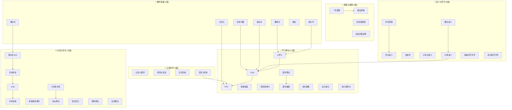

# 人工智能学习知识总索引

> [!abstract] 知识库概述
> 本知识库系统梳理人工智能学习的九大核心方向，涵盖从基础数学理论到高级算法范式的完整知识体系。每个方向包含理论基础、核心算法与实践应用的完整链条。

## 九大知识方向

| 序号 | 方向 | 文档数 | 核心主题 |
|:----:|------|:------:|----------|
| 1 | [[语义学/_Index|语义学]] | 6 | 概念语义、形式语义、语用学、分布式语义、计算语义 |
| 2 | [[符号学/_Index|符号学]] | 3 | 符号逻辑、索绪尔符号学、皮尔斯符号学 |
| 3 | [[强化学习/_Index|强化学习]] | 7 | MDP、Q学习、DQN、PPO、多智能体 |
| 4 | [[进化算法/_Index|进化算法]] | 5 | 遗传算法、遗传编程、进化策略、差分进化、PSO |
| 5 | [[对抗算法/_Index|对抗算法]] | 6 | 博弈论、对抗样本、GAN、对抗训练、多智能体博弈 |
| 6 | [[算法优化/_Index|算法优化]] | 5 | 计算复杂性、近似算法、组合优化、随机算法、在线算法 |
| 7 | [[数学基础/_Index|数学基础]] | 7 | 概率论、统计学、线性代数、凸优化、信息论、图论、博弈论 |
| 8 | [[认知科学/_Index|认知科学]] | 4 | 认知心理学、感知与表征、记忆系统、注意力机制 |
| 9 | [[逻辑与推理/_Index|逻辑与推理]] | 4 | 一阶逻辑、模态逻辑、非经典逻辑、自动定理证明 |

---

## 知识图谱概览



---

## 核心知识链接

### 语言与表示层

- [[归愚双系统/slow system/归愚知识源/Expert Knowledge（专业，工具类知识）/人工智能/0000人工智能学习知识/语义学/_Index|语义学]] — 语言意义的理论基石
- [[归愚双系统/slow system/归愚知识源/Expert Knowledge（专业，工具类知识）/人工智能/0000人工智能学习知识/符号学/_Index|符号学]] — 符号与意义的形式化

### 数学与逻辑层

- [[归愚双系统/slow system/归愚知识源/Expert Knowledge（专业，工具类知识）/人工智能/0000人工智能学习知识/数学基础/_Index|数学基础]] — AI的数学根基
- [[归愚双系统/slow system/归愚知识源/Expert Knowledge（专业，工具类知识）/人工智能/0000人工智能学习知识/逻辑与推理/_Index|逻辑与推理]] — 形式推理的逻辑系统

### 学习与优化层

- [[归愚双系统/slow system/归愚知识源/Expert Knowledge（专业，工具类知识）/人工智能/0000人工智能学习知识/强化学习/_Index|强化学习]] — 序贯决策学习
- [[归愚双系统/slow system/归愚知识源/Expert Knowledge（专业，工具类知识）/人工智能/0000人工智能学习知识/进化算法/_Index|进化算法]] — 进化计算范式
- [[归愚双系统/slow system/归愚知识源/Expert Knowledge（专业，工具类知识）/人工智能/0000人工智能学习知识/算法优化/_Index|算法优化]] — 计算效率与复杂性

### 智能与对抗层

- [[归愚双系统/slow system/归愚知识源/Expert Knowledge（专业，工具类知识）/人工智能/0000人工智能学习知识/对抗算法/_Index|对抗算法]] — 对抗性学习与博弈
- [[归愚双系统/slow system/归愚知识源/Expert Knowledge（专业，工具类知识）/人工智能/0000人工智能学习知识/认知科学/_Index|认知科学]] — 人类智能的认知机制

---

## 学习路径建议

### 入门路径：数学基础 → 逻辑推理 → 强化学习 → 深度强化学习

```
数学基础 → 强化学习基础 → DQN/PPO → 多智能体RL
```

### 进阶路径：语义符号 → 对抗攻防 → 生成模型

```
语义学 + 符号学 → 对抗样本 → GAN → 对抗训练
```

### 交叉路径：认知启发 → 算法创新

```
认知科学 → 注意力机制 → 算法优化 → 进化算法
```

---

> [!tip] 使用提示
> - 点击各方向链接可直接进入该方向的详细索引
> - 使用图谱了解知识间的关联关系
> - 配合双向链接探索相关概念

%% Zoottelkeeper: 自动生成于 2026-04-18 %%
