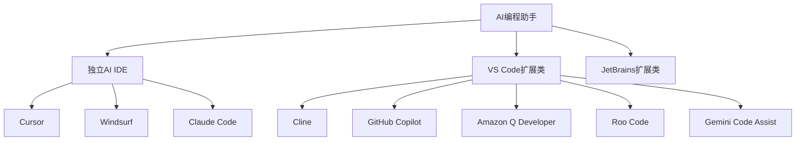

# AI编程助手目录索引

> [!NOTE]
> 本文档最后更新于 **2026年4月**，提供AI编程助手的全面对比、选型建议和使用场景指南。

---

## 目录概览

本目录收录了当前主流的AI编程助手工具，按照产品形态分为两大类别：



---

## 工具分类

### 独立AI IDE（自带编辑器）

这类工具拥有完整的集成开发环境，AI能力深度整合到编辑器中。

| 工具 | 特点 | 价格 | 适用人群 |
|------|------|------|----------|
| [[Cursor]] | 最流行的AI IDE | $20/月 | 追求体验的开发者 |
| [[Windsurf]] | Codeium出品 | $10/月 | 注重性价比的用户 |
| [[Claude Code]] | Anthropic官方CLI | $25/月 | 深度Claude用户 |

### VS Code扩展类

以VS Code扩展形式提供的AI编程助手。

| 工具 | 特点 | 价格 | 适用人群 |
|------|------|------|----------|
| [[Cline]] | 开源、多模型支持 | 免费 | 注重隐私和成本 |
| [[GitHub Copilot]] | GitHub生态集成 | $10/月 | GitHub用户 |
| [[Amazon-Q-Developer]] | AWS深度集成 | $19/月 | AWS开发者 |
| [[Roo-Code]] | 开源、可定制 | 免费 | 极客和开源爱好者 |
| [[Gemini-Code-Assist]] | Google Gemini | 免费 | Google生态用户 |

### JetBrains扩展类

支持JetBrains系列IDE的AI编程助手。

| 工具 | 特点 | 价格 |
|------|------|------|
| GitHub Copilot | JetBrains原生支持 | $10/月 |
| Amazon Q Developer | 通过AWS Toolkit | $19/月 |
| Cline | VS Code扩展兼容 | 免费 |

---

## 工具详细对比

### 功能特性对比

| 特性 | [[Cursor]] | [[Cline]] | [[GitHub Copilot]] | [[Amazon-Q-Developer]] | [[Windsurf]] |
|------|-----------|-----------|-------------------|------------------------|--------------|
| **许可证** | 专有 | MIT开源 | 专有 | 专有 | 专有 |
| **价格** | $20/月 | 免费 | $10/月 | $19/月 | $10/月 |
| **开源** | ❌ | ✅ | ❌ | ❌ | ❌ |
| **本地模型** | ❌ | ✅ | ❌ | ❌ | ❌ |
| **MCP支持** | ✅ | ✅ | ❌ | ❌ | ❌ |
| **VS Code** | ❌ | ✅ | ✅ | ✅ | ✅ |
| **自有IDE** | ✅ | ❌ | ❌ | ❌ | ✅ |
| **代理模式** | ✅ | ✅ | ❌ | ✅ Pro | ✅ |
| **多文件编辑** | ✅ | ✅ | 有限 | ✅ | ✅ |
| **终端集成** | ✅ | ✅ | CLI单独 | ✅ | ✅ |
| **安全扫描** | ✅ | ✅ | ❌ | ✅ | ✅ |

### AI模型支持

| 工具 | Claude | GPT-4 | Gemini | 本地模型 | 自定义模型 |
|------|--------|-------|--------|----------|------------|
| [[Cursor]] | ✅ | ✅ | ✅ | ❌ | ❌ |
| [[Cline]] | ✅ | ✅ | ✅ | ✅ Ollama | ✅ OpenAI兼容 |
| [[GitHub Copilot]] | ❌ | ✅ | ❌ | ❌ | ❌ |
| [[Amazon-Q-Developer]] | ✅ | ✅ | ❌ | ❌ | ❌ |
| [[Windsurf]] | ✅ | ✅ | ❌ | ❌ | ❌ |

### 成本对比

```
┌─────────────────────────────────────────────────────────────┐
│                    月度成本对比                              │
├─────────────────────────────────────────────────────────────┤
│                                                              │
│  工具              订阅费      API成本      总成本          │
│  ─────────────────────────────────────────────────         │
│  Cline             $0          自选         $0-$50         │
│  Copilot           $10         包含         $10            │
│  Windsurf          $10         包含         $10            │
│  Cursor            $20         包含         $20            │
│  Amazon Q Pro      $19         包含         $19            │
│  Claude Code       $25         包含         $25            │
│                                                              │
│  * Cline使用本地Ollama模型可实现$0成本                       │
│  * Copilot/GitHub企业版为$19/月/人                           │
│                                                              │
└─────────────────────────────────────────────────────────────┘
```

---

## 选型决策树

```
开始
  │
  ├─ 你主要在哪里开发？
  │   │
  │   ├─ AWS生态系统
  │   │   └─ → [[Amazon-Q-Developer]]
  │   │
  │   ├─ Google生态系统
  │   │   └─ → [[Gemini-Code-Assist]]
  │   │
  │   ├─ GitHub项目
  │   │   └─ → [[GitHub Copilot]]
  │   │
  │   └─ 通用开发
  │       │
  │       ├─ 预算有限？
  │       │   ├─ 需要本地运行？
  │       │   │   └─ → [[Cline]] + Ollama
  │       │   └─ 云端可接受
  │       │       └─ → [[GitHub Copilot]]
  │       │
  │       ├─ 追求最佳体验？
  │       │   └─ → [[Cursor]]
  │       │
  │       └─ 需要开源可定制？
  │           └─ → [[Cline]] 或 [[Roo-Code]]
```

---

## 场景化推荐

### 场景1：个人开发者、小型项目

**推荐工具**：[[Cline]] + Claude API 或 [[GitHub Copilot]]

**理由**：
- Cline完全免费（只需API费用）
- 支持多种AI模型灵活切换
- 丰富的MCP扩展能力

**配置建议**：
```json
{
  "apiProvider": "anthropic",
  "model": "claude-sonnet-4-20250514"
}
```

### 场景2：企业团队、协作开发

**推荐工具**：[[GitHub Copilot]] Business 或 [[Amazon-Q-Developer]] Business

**理由**：
- 企业级安全和合规
- 团队管理和审计功能
- SSO/SAML集成

### 场景3：AWS云原生开发

**推荐工具**：[[Amazon-Q-Developer]]

**理由**：
- 深度AWS服务集成
- CDK/SAM模板生成
- IAM策略分析
- DevOps Guru集成

### 场景4：隐私敏感项目

**推荐工具**：[[Cline]] + [[Ollama]] 本地部署

**理由**：
- 代码完全不离开发机器
- 无API成本
- 完全离线可用

### 场景5：快速原型开发

**推荐工具**：[[Cursor]] 或 [[Windsurf]]

**理由**：
- 开箱即用，无需配置
- 优秀的用户体验
- 强大的AI代码生成能力

### 场景6：追求性价比

**推荐工具**：[[Windsurf]] 或 [[Cline]] + DeepSeek

**理由**：
- Windsurf $10/月，包含无限补全
- Cline可使用低成本DeepSeek API

---

## 工具学习路径

### 入门路径（1周）

```mermaid
graph LR
    A[第一天] --> B[第二天]
    B --> C[第三天]
    C --> D[第四天]
    D --> E[第五天]
    
    A --> 安装VS Code扩展
    B --> 尝试基础代码补全
    C --> 使用对话功能
    D --> 探索高级功能
    E --> 自定义配置
```

### 进阶路径（1个月）

1. **第一周**：熟练使用基础功能
2. **第二周**：探索MCP扩展和自定义
3. **第三周**：集成到CI/CD流程
4. **第四周**：团队协作和企业功能

### 专家路径（持续）

1. 自定义系统提示和工作流
2. 开发自定义MCP服务器
3. 参与社区贡献
4. 分享使用经验

---

## 工具间迁移指南

### 从Copilot迁移到Cline

| 功能对比 | Copilot | Cline |
|---------|---------|--------|
| 代码补全 | ✅ | 需要主动对话 |
| 快捷键 | 内联 | 面板 |
| 多文件编辑 | 有限 | ✅ |

**迁移步骤**：
1. 安装Cline扩展
2. 配置API密钥
3. 禁用/卸载Copilot
4. 开始使用

### 从Cursor迁移到Cline

| 功能对比 | Cursor | Cline |
|---------|--------|--------|
| 完整IDE | ✅ | ❌依赖VS Code |
| 价格 | $20/月 | 免费 |
| 开源 | ❌ | ✅ |

**迁移步骤**：
1. 安装Cline
2. 导入Cursor的提示词配置
3. 迁移API设置

---

## 常见问题

### Q1：应该选择免费工具还是付费工具？

**答案取决于你的需求**：

| 需求 | 推荐 |
|------|------|
| 预算有限，愿意配置 | [[Cline]] 免费版 |
| 追求开箱即用 | [[Windsurf]] 或 [[GitHub Copilot]] |
| 企业用户 | [[GitHub Copilot]] Business |
| AWS开发者 | [[Amazon-Q-Developer]] Pro |

### Q2：可以同时使用多个工具吗？

**可以，但不推荐同时激活**。建议：

1. 主要工具：选择最符合需求的
2. 辅助工具：特定场景使用
3. 避免功能重叠导致干扰

### Q3：本地模型能否替代云端模型？

**取决于使用场景**：

| 场景 | 本地模型 | 云端模型 |
|------|----------|----------|
| 响应速度 | 可能较慢 | 快速 |
| 成本 | $0 | 按量计费 |
| 隐私 | 完全保护 | 需要信任服务商 |
| 能力 | 较弱 | 更强 |

**建议**：简单任务用本地模型，复杂任务用云端模型。

### Q4：如何评估AI编程工具的效果？

**量化指标**：

| 指标 | 测量方法 |
|------|----------|
| 代码采纳率 | AI建议被接受的百分比 |
| 任务完成时间 | 相比不使用AI的节省时间 |
| API成本 | 每月API费用 |
| Bug率 | AI生成代码的错误率 |

**主观指标**：
- 使用舒适度
- 学习曲线
- 社区支持

---

## 扩展阅读

### 相关目录

- [[../02-提示词工程/|提示词工程指南]] - 优化AI输出质量
- [[../03-模型选择/|模型选择指南]] - 了解各模型优劣势
- [[../04-MCP协议/|MCP协议详解]] - 扩展AI能力

### 推荐资源

| 资源 | 说明 |
|------|------|
| [AI编程助手对比](https://example.com) | 实时更新的对比表 |
| [Cursor官方文档](https://cursor.com/docs) | Cursor完整指南 |
| [Cline GitHub](https://github.com/cline/cline) | 开源项目 |
| [AWS Q开发者指南](https://docs.aws.amazon.com/amazonq) | 官方文档 |

---

## 更新日志

| 日期 | 更新内容 |
|------|----------|
| 2026-04-24 | 初始版本，添加所有工具索引 |
| 2026-04-24 | 添加对比表格和选型建议 |

---

> [!SUCCESS]
> 选择合适的AI编程助手需要考虑多个因素：预算、技术栈、隐私需求和团队规模。本索引旨在帮助你快速了解各工具特点，做出明智的选择。建议先从免费工具开始尝试，逐步探索更高级的功能。