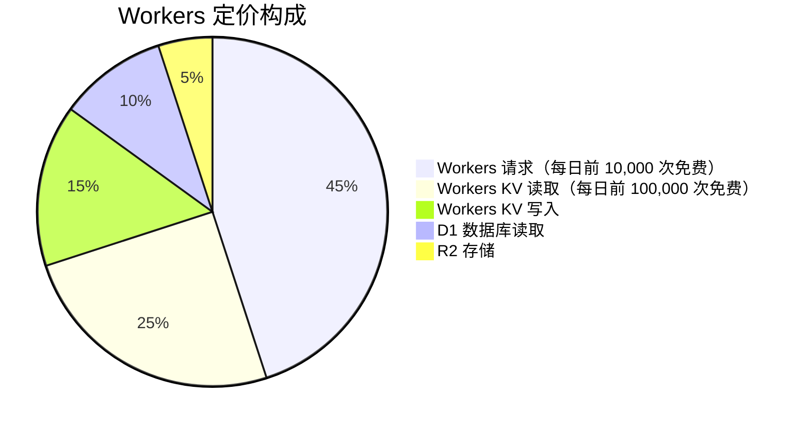

# Cloudflare：CDN + 边缘计算 + Workers 完整指南

> [!NOTE]
> 本文档最后更新于 **2026年4月**，涵盖 Cloudflare 产品矩阵、Workers 架构、D1 分布式 SQLite、R2 对象存储，以及与 Vercel/Netlify 的对比分析。

---

## 目录

1. [[#Cloudflare 产品矩阵]]
2. [[#Cloudflare Workers 详解]]
3. [[#Workers KV 键值存储]]
4. [[#Durable Objects 持久对象]]
5. [[#D1 分布式 SQLite]]
6. [[#R2 对象存储]]
7. [[#Cloudflare Pages]]
8. [[#Cloudflare Tunnel 内网穿透]]
9. [[#Workers vs Vercel Functions vs Netlify Functions 对比]]
10. [[#AI 应用中的 Cloudflare]]

---

## Cloudflare 产品矩阵

### 产品概览

Cloudflare 成立于 2009 年，从 CDN 和 DNS 服务起步，逐步发展为覆盖网络安全、性能、计算、存储、数据库的综合性云平台。截至 2026 年，Cloudflare 网络覆盖全球 300+ 城市，是世界上最大、性能最优的网络之一。

### 核心产品分类

| 类别 | 产品 | 说明 |
|------|------|------|
| **网络优化** | CDN | 全球内容分发 |
| | ARGO Smart Routing | 智能路由优化 |
| | Load Balancing | 全球负载均衡 |
| **安全** | DDoS 防护 | 业界领先的 DDoS 缓解 |
| | WAF | Web 应用防火墙 |
| | Bot Management | 机器人管理 |
| | SSL/TLS | 免费 SSL 证书 |
| **DNS** | Registrar | 域名注册服务 |
| | DNS | 快速可靠的 DNS |
| **边缘计算** | Workers | V8 边缘函数 |
| | Workers KV | 边缘键值存储 |
| | Durable Objects | 有状态的边缘对象 |
| | Queues | 边缘消息队列 |
| **存储** | R2 | S3 兼容对象存储 |
| | D1 | 分布式 SQLite |
| | Hyperdrive | 边缘数据库加速 |
| **部署** | Pages | 静态网站部署 |
| | Wave | 渐进式部署 |
| **AI** | AI Gateway | AI API 网关 |
| | Workers AI | GPU 边缘推理 |

### 网络覆盖

```
┌─────────────────────────────────────────────────────────────────────┐
│                   Cloudflare 全球网络（300+ 城市）                    │
├─────────────────────────────────────────────────────────────────────┤
│                                                                     │
│  ┌───────────────────────────────────────────────────────────────┐ │
│  │                     亚太地区                                   │ │
│  │   香港、东京、新加坡、悉尼、墨尔本、首尔、孟买、孟买、雅加达     │ │
│  │   台北、曼谷、吉隆坡、马尼拉、胡志明市、班加罗尔、上海、北京      │ │
│  └───────────────────────────────────────────────────────────────┘ │
│                                                                     │
│  ┌───────────────────────────────────────────────────────────────┐ │
│  │                     欧洲地区                                    │ │
│  │   伦敦、法兰克福、阿姆斯特丹、巴黎、米兰、马德里、华沙、斯德哥尔摩 │ │
│  │   维也纳、布鲁塞尔、苏黎世、都柏林、赫尔辛基、布拉格、雅典       │ │
│  └───────────────────────────────────────────────────────────────┘ │
│                                                                     │
│  ┌───────────────────────────────────────────────────────────────┐ │
│  │                     美洲地区                                    │ │
│  │   纽约、洛杉矶、旧金山、西雅图、迈阿密、芝加哥、多伦多、圣保罗    │ │
│  │   亚特兰大、波士顿、达拉斯、丹佛、休斯顿、温哥华、墨西哥城       │ │
│  └───────────────────────────────────────────────────────────────┘ │
│                                                                     │
└─────────────────────────────────────────────────────────────────────┘
```

---

## Cloudflare Workers 详解

### Workers 架构

Cloudflare Workers 基于 V8 JavaScript 引擎，运行在 Cloudflare 边缘节点上，提供毫秒级冷启动和全球分布执行能力。

```typescript
// src/index.ts
// ─────────────────────────────────────────────────────────────
// 最简单的 Worker 示例
// ─────────────────────────────────────────────────────────────

export default {
    async fetch(request: Request, env: Env, ctx: ExecutionContext): Promise<Response> {
        const url = new URL(request.url);
        
        return new Response(JSON.stringify({
            message: 'Hello from Cloudflare Workers!',
            path: url.pathname,
            method: request.method,
            timestamp: new Date().toISOString(),
        }), {
            headers: {
                'Content-Type': 'application/json',
            },
        });
    },
};

interface Env {
    // 环境变量类型定义
    DATABASE_URL: string;
    API_KEY: string;
}

export {};
```

### Workers vs 传统 Serverless

| 维度 | Cloudflare Workers | AWS Lambda | Vercel Functions |
|------|-------------------|------------|------------------|
| **冷启动** | < 1ms | ~100ms | ~100ms |
| **执行位置** | 边缘（300+ 节点） | 区域数据中心 | 区域数据中心 |
| **运行时** | V8 | Node.js | Node.js |
| **免费额度** | 100K 请求/天 | 400K GB-秒/月 | 100K 请求/月 |
| **超时** | 30 秒（CPU） | 15 分钟 | 10-26 秒 |
| **支持语言** | JS/TS/Rust/C++ | 多语言 | Node.js |

### 路由和中间件

```typescript
// src/middleware/auth.ts
// ─────────────────────────────────────────────────────────────
// 认证中间件示例
// ─────────────────────────────────────────────────────────────

export class AuthMiddleware {
    async fetch(request: Request, env: Env, ctx: ExecutionContext): Promise<Response | null> {
        // 公开路径列表
        const publicPaths = ['/api/auth/login', '/api/health', '/'];
        
        const url = new URL(request.url);
        if (publicPaths.some(path => url.pathname.startsWith(path))) {
            return null; // 继续处理
        }
        
        // 检查认证头
        const authHeader = request.headers.get('Authorization');
        if (!authHeader || !authHeader.startsWith('Bearer ')) {
            return new Response(JSON.stringify({ error: 'Unauthorized' }), {
                status: 401,
                headers: { 'Content-Type': 'application/json' },
            });
        }
        
        // 验证 token（这里简化处理）
        const token = authHeader.substring(7);
        const isValid = await this.validateToken(token, env);
        
        if (!isValid) {
            return new Response(JSON.stringify({ error: 'Invalid token' }), {
                status: 401,
                headers: { 'Content-Type': 'application/json' },
            });
        }
        
        return null; // 认证通过，继续处理
    }
    
    private async validateToken(token: string, env: Env): Promise<boolean> {
        // 实际项目中应该调用外部认证服务或验证 JWT
        return token.length > 10;
    }
}

// 组合多个中间件
export function withAuth(
    handler: (request: Request, env: Env, ctx: ExecutionContext) => Promise<Response>
) {
    const auth = new AuthMiddleware();
    
    return async (request: Request, env: Env, ctx: ExecutionContext): Promise<Response> {
        // 执行认证中间件
        const authResult = await auth.fetch(request, env, ctx);
        if (authResult) return authResult;
        
        // 执行实际处理器
        return handler(request, env, ctx);
    };
}
```

### wrangler.toml 配置

```toml
# wrangler.toml
# ─────────────────────────────────────────────────────────────
# Cloudflare Workers 配置文件
# ─────────────────────────────────────────────────────────────

name = "my-worker"
main = "src/index.ts"
compatibility_date = "2026-04-19"

# 区域配置
compatibility_flags = ["nodejs_compat"]

# 构建配置
build = "npm run build"
dev = "npm run dev"

# 环境
[env.production]
name = "my-worker"
routes = [
    { pattern = "api.example.com", zone_name = "example.com" }
]

[env.staging]
name = "my-worker-staging"
routes = [
    { pattern = "staging.example.com", zone_name = "example.com" }
]

# KV 命名空间绑定
[[kv_namespaces]]
    binding = "CACHE"
    id = "xxxxxxxxxxxxxxxxxxxxxxxxxxxxxxxx"

[[kv_namespaces]]
    binding = "SESSIONS"
    id = "xxxxxxxxxxxxxxxxxxxxxxxxxxxxxxxx"
    preview_id = "preview-xxxx"

# D1 数据库绑定
[[d1_databases]]
    binding = "DB"
    database_name = "my-database"
    database_id = "xxxxxxxxxxxxxxxxxxxxxxxxxxxxxxxx"
    preview_database_id = "preview-xxxx"

# R2 存储桶绑定
[[r2_buckets]]
    binding = "ASSETS"
    bucket_name = "my-assets"

# Durable Objects
[[durable_objects.bindings]]
    name = "COUNTER"
    class_name = "Counter"

# 环境变量
[vars]
    ENV = "production"
    API_BASE_URL = "https://api.example.com"

# 密钥（通过 CLI 设置）
# wrangler secret put API_KEY

# 服务绑定
[[services]]
    binding = "IMAGE_SERVICE"
    service = "image-processor"
    environment = "production"
```

### 路由和重写

```typescript
// src/routes/index.ts
// ─────────────────────────────────────────────────────────────
// 基于路由的处理
// ─────────────────────────────────────────────────────────────

export const router = {
    async fetch(request: Request, env: Env, ctx: ExecutionContext): Promise<Response> {
        const url = new URL(request.url);
        const path = url.pathname;
        
        // 路由匹配
        switch (true) {
            // API 路由
            case path.startsWith('/api/users'):
                return handleUsers(request, env, ctx);
            
            case path.startsWith('/api/products'):
                return handleProducts(request, env, ctx);
            
            case path.startsWith('/api/'):
                return handleApi(request, env, ctx);
            
            // 静态资源
            case path.startsWith('/static/'):
                return handleStatic(request, env, ctx);
            
            // 默认路由
            default:
                return handleFallback(request, env, ctx);
        }
    },
};

// 用户 API
async function handleUsers(request: Request, env: Env, ctx: ExecutionContext): Promise<Response> {
    if (request.method === 'GET') {
        const users = await env.DB.prepare('SELECT * FROM users LIMIT 100').all();
        return Response.json(users.results);
    }
    
    if (request.method === 'POST') {
        const body = await request.json();
        const { name, email } = body;
        
        if (!name || !email) {
            return Response.json({ error: 'Name and email required' }, { status: 400 });
        }
        
        const result = await env.DB.prepare(
            'INSERT INTO users (name, email) VALUES (?, ?)'
        ).bind(name, email).run();
        
        return Response.json({ id: result.meta.last_row_id }, { status: 201 });
    }
    
    return Response.json({ error: 'Method not allowed' }, { status: 405 });
}

// 产品 API
async function handleProducts(request: Request, env: Env, ctx: ExecutionContext): Promise<Response> {
    const cacheKey = `products:${request.url}`;
    
    // 尝试从 KV 缓存读取
    const cached = await env.CACHE.get(cacheKey);
    if (cached) {
        return new Response(cached, {
            headers: {
                'Content-Type': 'application/json',
                'X-Cache': 'HIT',
            },
        });
    }
    
    // 从数据库获取
    const products = await env.DB.prepare('SELECT * FROM products').all();
    const response = Response.json(products.results);
    
    // 写入缓存（1 小时）
    ctx.waitUntil(
        env.CACHE.put(cacheKey, JSON.stringify(products.results), { expirationTtl: 3600 })
    );
    
    return new Response(JSON.stringify(products.results), {
        headers: {
            'Content-Type': 'application/json',
            'X-Cache': 'MISS',
        },
    });
}

// 默认处理
async function handleFallback(request: Request, env: Env, ctx: ExecutionContext): Promise<Response> {
    return new Response('Not Found', { status: 404 });
}
```

---

## Workers KV 键值存储

### KV 特性

Workers KV 是 Cloudflare 提供的边缘键值存储，读取延迟极低，写入最终一致（通常在 60 秒内）。

| 特性 | 说明 |
|------|------|
| **读取延迟** | < 10ms（边缘节点） |
| **写入传播** | 最终一致（通常 < 60s） |
| **一致性** | 最终一致性（可配置） |
| **存储限制** | 无限制（付费版） |
| **操作类型** | GET/PUT/DELETE/LIST |

### KV 操作示例

```typescript
// src/kv-example.ts
// ─────────────────────────────────────────────────────────────
// KV 存储操作示例
// ─────────────────────────────────────────────────────────────

export default {
    async fetch(request: Request, env: Env, ctx: ExecutionContext): Promise<Response> {
        const url = new URL(request.url);
        const path = url.pathname;
        
        // 设置值
        if (path === '/set' && request.method === 'POST') {
            const { key, value, expirationTtl } = await request.json();
            
            if (expirationTtl) {
                await env.CACHE.put(key, value, { expirationTtl });
            } else {
                await env.CACHE.put(key, value);
            }
            
            return Response.json({ success: true });
        }
        
        // 获取值
        if (path === '/get') {
            const key = url.searchParams.get('key');
            if (!key) {
                return Response.json({ error: 'Key required' }, { status: 400 });
            }
            
            const value = await env.CACHE.get(key);
            if (!value) {
                return Response.json({ error: 'Key not found' }, { status: 404 });
            }
            
            return Response.json({ key, value });
        }
        
        // 删除值
        if (path === '/delete') {
            const key = url.searchParams.get('key');
            if (!key) {
                return Response.json({ error: 'Key required' }, { status: 400 });
            }
            
            await env.CACHE.delete(key);
            return Response.json({ success: true });
        }
        
        // 列出键
        if (path === '/list') {
            const prefix = url.searchParams.get('prefix') || '';
            const limit = parseInt(url.searchParams.get('limit') || '100');
            
            const list = await env.CACHE.list({
                prefix,
                limit,
            });
            
            return Response.json({
                keys: list.keys.map(k => ({
                    name: k.name,
                    expiration: k.expiration,
                })),
            });
        }
        
        return Response.json({ message: 'Use /set, /get, /delete, or /list' });
    },
};
```

### 缓存模式实现

```typescript
// src/cache.ts
// ─────────────────────────────────────────────────────────────
// 多层缓存模式
// ─────────────────────────────────────────────────────────────

export class CacheManager {
    constructor(private kv: KVNamespace, private cacheName: string) {}
    
    // 获取（优先缓存）
    async get<T>(key: string, fetcher: () => Promise<T>, ttl = 3600): Promise<T> {
        // 1. 尝试从 KV 缓存获取
        const cached = await this.kv.get(`${this.cacheName}:${key}`);
        if (cached) {
            return JSON.parse(cached);
        }
        
        // 2. 执行fetcher获取新数据
        const data = await fetcher();
        
        // 3. 写入缓存
        await this.kv.put(
            `${this.cacheName}:${key}`,
            JSON.stringify(data),
            { expirationTtl: ttl }
        );
        
        return data;
    }
    
    // 清除缓存
    async invalidate(pattern: string): Promise<void> {
        const list = await this.kv.list({
            prefix: `${this.cacheName}:${pattern}`,
        });
        
        const deletes = list.keys.map(k => 
            this.kv.delete(k.name)
        );
        
        await Promise.all(deletes);
    }
}

// 使用示例
const cache = new CacheManager(env.CACHE, 'user-sessions');

export default {
    async fetch(request: Request, env: Env, ctx: ExecutionContext): Promise<Response> {
        const url = new URL(request.url);
        const userId = url.pathname.split('/').pop();
        
        // 使用缓存获取用户数据
        const user = await cache.get(
            `user:${userId}`,
            async () => {
                const result = await env.DB.prepare(
                    'SELECT * FROM users WHERE id = ?'
                ).bind(userId).first();
                return result;
            },
            3600 // 1 小时缓存
        );
        
        return Response.json(user);
    },
};
```

---

## Durable Objects 持久对象

### Durable Objects 特性

Durable Objects 是 Cloudflare 的有状态边缘计算模型，每个 Durable Object 实例在单个区域内运行，提供强一致性和持久化状态。

| 特性 | 说明 |
|------|------|
| **状态持久化** | 自动持久化，无需数据库 |
| **强一致性** | 单一实例处理所有请求 |
| **事务** | 支持 ACID 事务 |
| **WebSocket** | 原生支持 |
| **适用场景** | 实时协作、游戏状态、事务处理 |

### Durable Objects 示例

```typescript
// src/counter.ts
// ─────────────────────────────────────────────────────────────
// Durable Objects：计数器示例
// ─────────────────────────────────────────────────────────────

export class Counter implements DurableObject {
    private count = 0;
    private lastUpdated: number;
    
    constructor(state: DurableObjectState, env: Env) {
        // 从存储中恢复状态
        this.lastUpdated = Date.now();
        
        // 异步加载状态
        state.storage.get('count').then(count => {
            if (count !== undefined) {
                this.count = count as number;
            }
        });
    }
    
    // 处理 HTTP 请求
    async fetch(request: Request): Promise<Response> {
        const url = new URL(request.url);
        
        switch (url.pathname) {
            case '/increment':
                this.count++;
                await this.storage();
                return Response.json({ count: this.count });
            
            case '/decrement':
                this.count--;
                await this.storage();
                return Response.json({ count: this.count });
            
            case '/reset':
                this.count = 0;
                await this.storage();
                return Response.json({ count: this.count });
            
            default:
                return Response.json({ count: this.count });
        }
    }
    
    // 持久化状态
    private async storage(): Promise<void> {
        // 在状态改变时保存
        await this.state.storage.put('count', this.count);
        this.lastUpdated = Date.now();
    }
    
    // 定时任务（每小时重置）
    async scheduled(controller: ScheduledController): Promise<void> {
        if (controller.cron === '0 * * * *') {
            // 每小时执行
            this.count = 0;
            await this.state.storage.put('count', this.count);
        }
    }
}

// Worker 主入口
export default {
    async fetch(request: Request, env: Env): Promise<Response> {
        const url = new URL(request.url);
        
        // 为每个 ID 获取对应的 Durable Object
        const id = env.COUNTER.idFromName(url.pathname);
        const counter = env.COUNTER.get(id);
        
        // 代理请求到 Durable Object
        return counter.fetch(request);
    },
};
```

### WebSocket 示例

```typescript
// src/realtime.ts
// ─────────────────────────────────────────────────────────────
// Durable Objects：WebSocket 实时通信
// ─────────────────────────────────────────────────────────────

export class RealtimeRoom implements DurableObject {
    private clients: Set<WebSocket> = new Set();
    
    constructor(private state: DurableObjectState, private env: Env) {}
    
    async fetch(request: Request): Promise<Response> {
        // 升级为 WebSocket
        if (request.headers.get('Upgrade') === 'websocket') {
            const { 0: client, 1: server } = new WebSocketPair();
            
            await this.handleWebSocket(server);
            server.accept();
            
            return new Response(null, {
                status: 101,
                webSocket: client,
            });
        }
        
        return new Response('Expected WebSocket', { status: 426 });
    }
    
    private async handleWebSocket(ws: WebSocket): Promise<void> {
        this.clients.add(ws);
        
        ws.addEventListener('message', async (event) => {
            // 广播消息给所有客户端
            for (const client of this.clients) {
                if (client !== ws) {
                    client.send(`[Broadcast] ${event.data}`);
                }
            }
        });
        
        ws.addEventListener('close', () => {
            this.clients.delete(ws);
        });
    }
}
```

---

## D1 分布式 SQLite

### D1 特性

D1 是 Cloudflare 的分布式 SQLite 数据库，基于 libSQL（SQLite 分支），提供全局复制的读写分离能力。

| 特性 | 说明 |
|------|------|
| **存储引擎** | libSQL（SQLite 分支） |
| **全局复制** | 读副本全球分布 |
| **写入** | 单主区域写入 |
| **延迟** | 读取 < 50ms（边缘） |
| **大小限制** | 免费 5GB / 付费 250GB |

### D1 操作示例

```typescript
// src/d1-example.ts
// ─────────────────────────────────────────────────────────────
// D1 数据库操作示例
// ─────────────────────────────────────────────────────────────

export default {
    async fetch(request: Request, env: Env, ctx: ExecutionContext): Promise<Response> {
        const url = new URL(request.url);
        
        // 获取所有用户
        if (url.pathname === '/users' && request.method === 'GET') {
            const { results } = await env.DB.prepare(
                'SELECT id, name, email, created_at FROM users ORDER BY created_at DESC'
            ).all();
            
            return Response.json(results);
        }
        
        // 创建用户
        if (url.pathname === '/users' && request.method === 'POST') {
            const { name, email } = await request.json();
            
            if (!name || !email) {
                return Response.json({ error: 'Name and email required' }, { status: 400 });
            }
            
            const result = await env.DB.prepare(
                'INSERT INTO users (name, email) VALUES (?, ?)'
            ).bind(name, email).run();
            
            return Response.json({ 
                id: result.meta.last_row_id,
                message: 'User created' 
            }, { status: 201 });
        }
        
        // 获取单个用户
        if (url.pathname.startsWith('/users/')) {
            const userId = url.pathname.split('/').pop();
            
            const user = await env.DB.prepare(
                'SELECT * FROM users WHERE id = ?'
            ).bind(userId).first();
            
            if (!user) {
                return Response.json({ error: 'User not found' }, { status: 404 });
            }
            
            return Response.json(user);
        }
        
        return Response.json({ message: 'Use /users or /users/:id' });
    },
};
```

### D1 事务

```typescript
// src/d1-transaction.ts
// ─────────────────────────────────────────────────────────────
// D1 事务示例
// ─────────────────────────────────────────────────────────────

export default {
    async fetch(request: Request, env: Env): Promise<Response> {
        // D1 不支持传统事务，但可以通过批处理实现原子操作
        const batch = await env.DB.batch([
            env.DB.prepare('UPDATE counters SET count = count + 1 WHERE name = ?')
                .bind('page_views'),
            env.DB.prepare('INSERT INTO logs (action, timestamp) VALUES (?, ?)')
                .bind('page_view', Date.now()),
        ]);
        
        return Response.json({
            success: true,
            batchResults: batch.map(r => r.meta),
        });
    },
};
```

### 初始化 D1 数据库

```bash
# 创建 D1 数据库
wrangler d1 create my-database

# 在 wrangler.toml 中配置
# [[d1_databases]]
#     binding = "DB"
#     database_name = "my-database"
#     database_id = "xxx"

# 创建表结构
# schema.sql
CREATE TABLE IF NOT EXISTS users (
    id INTEGER PRIMARY KEY AUTOINCREMENT,
    name TEXT NOT NULL,
    email TEXT UNIQUE NOT NULL,
    created_at TEXT DEFAULT (datetime('now'))
);

CREATE TABLE IF NOT EXISTS posts (
    id INTEGER PRIMARY KEY AUTOINCREMENT,
    user_id INTEGER NOT NULL,
    title TEXT NOT NULL,
    content TEXT,
    published INTEGER DEFAULT 0,
    created_at TEXT DEFAULT (datetime('now')),
    FOREIGN KEY (user_id) REFERENCES users(id)
);

CREATE INDEX idx_posts_user ON posts(user_id);
CREATE INDEX idx_posts_published ON posts(published);

# 应用 schema
wrangler d1 execute my-database --file=./schema.sql

# 本地开发
wrangler d1 execute my-database --local --file=./schema.sql
```

---

## R2 对象存储

### R2 特性

R2 是 Cloudflare 的对象存储服务，完全兼容 S3 API，且无出口费用（egress fees）。

| 特性 | 说明 |
|------|------|
| **API 兼容** | S3 兼容 |
| **出口费用** | 无限制，零费用 |
| **存储费用** | $0.015/GB/月 |
| **写入** | 免费 |
| **读取** | 免费（Cloudflare 内部） |
| **操作费用** | $0.36/百万操作 |

### R2 操作示例

```typescript
// src/r2-example.ts
// ─────────────────────────────────────────────────────────────
// R2 对象存储操作示例
// ─────────────────────────────────────────────────────────────

export default {
    async fetch(request: Request, env: Env): Promise<Response> {
        const url = new URL(request.url);
        
        // 上传文件
        if (url.pathname === '/upload' && request.method === 'POST') {
            const formData = await request.formData();
            const file = formData.get('file') as File;
            
            if (!file) {
                return Response.json({ error: 'No file provided' }, { status: 400 });
            }
            
            // 生成唯一文件名
            const key = `uploads/${Date.now()}-${file.name}`;
            
            // 上传到 R2
            await env.ASSETS.put(key, file.stream(), {
                httpMetadata: {
                    contentType: file.type,
                },
                customMetadata: {
                    uploadedBy: 'user-123',
                    originalName: file.name,
                },
            });
            
            return Response.json({
                success: true,
                key,
                url: `/download/${encodeURIComponent(key)}`,
            });
        }
        
        // 下载文件
        if (url.pathname.startsWith('/download/')) {
            const key = decodeURIComponent(url.pathname.replace('/download/', ''));
            
            const object = await env.ASSETS.get(key);
            
            if (!object) {
                return Response.json({ error: 'File not found' }, { status: 404 });
            }
            
            const data = await object.arrayBuffer();
            
            return new Response(data, {
                headers: {
                    'Content-Type': object.httpMetadata?.contentType || 'application/octet-stream',
                    'Content-Disposition': `inline; filename="${object.customMetadata?.originalName || key}"`,
                },
            });
        }
        
        // 列出文件
        if (url.pathname === '/files' && request.method === 'GET') {
            const prefix = url.searchParams.get('prefix') || 'uploads/';
            
            const list = await env.ASSETS.list({
                prefix,
                limit: 100,
            });
            
            return Response.json({
                files: list.objects.map(obj => ({
                    key: obj.key,
                    size: obj.size,
                    uploaded: obj.uploaded,
                })),
            });
        }
        
        // 删除文件
        if (url.pathname.startsWith('/delete/')) {
            const key = decodeURIComponent(url.pathname.replace('/delete/', ''));
            
            await env.ASSETS.delete(key);
            
            return Response.json({ success: true });
        }
        
        return Response.json({ message: 'Use /upload, /download/:key, /files, or /delete/:key' });
    },
};
```

### 预签名 URL

```typescript
// src/presigned-url.ts
// ─────────────────────────────────────────────────────────────
// R2 预签名 URL（需要 S3 API 兼容）
// ─────────────────────────────────────────────────────────────

export default {
    async fetch(request: Request, env: Env): Promise<Response> {
        const url = new URL(request.url);
        const key = url.searchParams.get('key');
        
        if (!key) {
            return Response.json({ error: 'Key required' }, { status: 400 });
        }
        
        // 注意：R2 API 不直接支持预签名 URL
        // 需要使用 Workers 签名或 Cloudflare Streams
        
        // 方案1：生成临时访问 URL（Cloudflare Streams）
        const expiry = Math.floor(Date.now() / 1000) + 3600; // 1 小时后过期
        
        return Response.json({
            key,
            note: 'R2 requires custom signing implementation',
            alternatives: [
                'Use Cloudflare Streams for signed URLs',
                'Implement custom signing in Workers',
                'Use private bucket with signed cookies',
            ],
        });
    },
};
```

---

## Cloudflare Pages

### Pages 特性

Cloudflare Pages 是面向静态站点和 JAMstack 应用的部署平台，集成 Cloudflare 全球网络。

| 特性 | 说明 |
|------|------|
| **CDN** | 全球 300+ 节点 |
| **边缘函数** | 支持 Pages Functions |
| **预览部署** | 每个 PR 自动生成 |
| **构建限制** | 30 分钟，4GB 内存 |
| **免费带宽** | 500GB/月 |
| **自定义域名** | 免费 SSL |

### pages-plugin 示例

```typescript
// functions/_middleware.ts
// ─────────────────────────────────────────────────────────────
// Cloudflare Pages 中间件
// ─────────────────────────────────────────────────────────────

export interface Env {
    ASSETS: R2Bucket;
    DB: D1Database;
}

export const onRequest: PagesFunction<Env> = async (context) => {
    const { request, next, env } = context;
    const url = new URL(request.url);
    
    // 添加安全头
    const response = await next();
    
    const newResponse = new Response(response.body, response);
    newResponse.headers.set('X-Frame-Options', 'DENY');
    newResponse.headers.set('X-Content-Type-Options', 'nosniff');
    newResponse.headers.set('Referrer-Policy', 'strict-origin-when-cross-origin');
    
    return newResponse;
};
```

---

## Cloudflare Tunnel 内网穿透

### Tunnel 配置

```bash
# 安装 cloudflared
brew install cloudflare/cloudflare/cloudflared

# 登录 Cloudflare
cloudflared tunnel login

# 创建隧道
cloudflared tunnel create my-tunnel

# 配置 DNS
cloudflared tunnel route dns my-tunnel tunnel.example.com

# 运行隧道
cloudflared tunnel run --name my-tunnel
```

### docker-compose 配置

```yaml
# docker-compose.yml
services:
    cloudflared:
        image: cloudflare/cloudflared:latest
        container_name: cloudflared-tunnel
        restart: unless-stopped
        command: tunnel run --token ${TUNNEL_TOKEN}
        environment:
            - TUNNEL_TOKEN=${TUNNEL_TOKEN}
        networks:
            - app-network

networks:
    app-network:
        external: true
```

---

## Workers vs Vercel Functions vs Netlify Functions 对比

### 核心对比表

| 维度 | Cloudflare Workers | Vercel Functions | Netlify Functions |
|------|-------------------|------------------|------------------|
| **冷启动** | < 1ms | ~100ms | ~100ms |
| **执行位置** | 边缘（300+） | 区域 | 区域 |
| **免费额度** | 100K/天 | 100K/月 | 125K/月 |
| **付费价格** | $5/10M 请求 | $0.40/100K | $0.40/100K |
| **超时** | 30 秒（CPU） | 10-26 秒 | 10-26 秒 |
| **支持语言** | JS/TS/Rust/C | Node.js | Node.js/Go |
| **KV 存储** | 原生 | 第三方 | 第三方 |
| **数据库** | D1（原生） | Postgres（集成） | Postgres（集成） |
| **对象存储** | R2（原生） | R2（集成） | Large Media |

### 选择建议

> [!TIP]
> - **低延迟要求**：Cloudflare Workers（边缘执行）
> - **Next.js 优先**：Vercel
> - **表单+认证需求**：Netlify
> - **S3 兼容存储**：Cloudflare R2（无出口费）
> - **全球 CDN**：Cloudflare Pages

---

## AI 应用中的 Cloudflare

### AI Gateway

```typescript
// src/ai-gateway.ts
// ─────────────────────────────────────────────────────────────
// Cloudflare AI Gateway 示例
// ─────────────────────────────────────────────────────────────

export default {
    async fetch(request: Request, env: Env): Promise<Response> {
        const url = new URL(request.url);
        
        // AI 请求代理
        if (url.pathname.startsWith('/ai/')) {
            const model = url.searchParams.get('model') || 'gpt-4o';
            const userMessage = url.searchParams.get('message');
            
            if (!userMessage) {
                return Response.json({ error: 'Message required' }, { status: 400 });
            }
            
            // 调用 OpenAI
            const response = await fetch('https://api.openai.com/v1/chat/completions', {
                method: 'POST',
                headers: {
                    'Content-Type': 'application/json',
                    'Authorization': `Bearer ${env.OPENAI_API_KEY}`,
                },
                body: JSON.stringify({
                    model,
                    messages: [{ role: 'user', content: userMessage }],
                }),
            });
            
            const data = await response.json();
            
            return Response.json(data);
        }
        
        return Response.json({ message: 'Use /ai/chat endpoint' });
    },
};
```

---

# Cloudflare：CDN + 边缘计算 + Workers 完整指南

> [!NOTE]
> 本文档最后更新于 **2026年4月**，涵盖 Cloudflare 产品矩阵、Workers 架构、D1 分布式 SQLite、R2 对象存储，以及与 Vercel/Netlify 的对比分析。

---

## 服务概述与定位

### Cloudflare 产品定位与战略愿景

Cloudflare 成立于 2009 年，由 Matthew Prince、Lee Holloway 和 Michelle Zatlyn 三位创始人共同创办。公司最初以 DDoS 防护和 CDN 服务起家，经过十余年的发展，已成长为涵盖网络安全、性能优化、边缘计算、存储服务、开发者平台等多领域的综合性云服务提供商。截至 2026 年，Cloudflare 的网络覆盖全球 300+ 城市，处理着全球超过 25% 的互联网流量，是世界上最大、最快的网络之一。

Cloudflare 的核心战略愿景是构建「连接一切、保护一切、加速一切」的互联网基础设施。在传统云计算时代，AWS、Google Cloud、Azure 等巨头占据了大部分市场份额，但 Cloudflare 选择了一条差异化道路：专注于网络边缘，通过在全球各地部署的小型化、高密度边缘节点，将计算能力推向离用户最近的位置。这种架构设计使得 Cloudflare 在低延迟应用场景中具有得天独厚的优势。

#### 核心竞争优势

```mermaid
┌─────────────────────────────────────────────────────────────────────────┐
│                    Cloudflare 核心竞争优势                               │
├─────────────────────────────────────────────────────────────────────────┤
│                                                                         │
│  ┌─────────────────┐    ┌─────────────────┐    ┌─────────────────┐    │
│  │    全球化网络    │    │   开发者友好    │    │    成本优势      │    │
│  ├─────────────────┤    ├─────────────────┤    ├─────────────────┤    │
│  │ • 300+ 城市     │    │ • Workers 生态  │    │ • 慷慨免费额度   │    │
│  │ • P95 < 50ms    │    │ • 开发生态      │    │ • 零出口费用     │    │
│  │ • 自动优化路由   │    │ • 统一 SDK      │    │ • 按需付费       │    │
│  └─────────────────┘    └─────────────────┘    └─────────────────┘    │
│                                                                         │
│  ┌─────────────────┐    ┌─────────────────┐    ┌─────────────────┐    │
│  │    安全性        │    │   可靠性         │    │   易用性         │    │
│  ├─────────────────┤    ├─────────────────┤    ├─────────────────┤    │
│  │ • 零信任安全     │    │ • 99.99% SLA    │    │ • 零配置 CDN    │    │
│  │ • WAF/防火墙    │    │ • 自动故障转移   │    │ • 一键部署      │    │
│  │ • Bot 防护      │    │ • 全球负载均衡   │    │ • 丰富文档      │    │
│  └─────────────────┘    └─────────────────┘    └─────────────────┘    │
│                                                                         │
└─────────────────────────────────────────────────────────────────────────┘
```

#### 目标用户群体

Cloudflare 的服务覆盖了从个人开发者到大型企业的广泛用户群体：

**个人开发者与小型项目**
- 静态网站托管（Pages）
- 免费 SSL 证书
- DDoS 基础防护
- Workers 每日 100K 请求免费额度

**中小型企业**
- 增强型 DDoS 防护
- WAF 规则定制
- R2 对象存储（无出口费）
- Workers KV 边缘缓存
- Cloudflare Tunnel 内网穿透

**大型企业与高级用户**
- Cloudflare Gateway（零信任网络）
- Cloudflare Access（身份认证）
- Workers AI（GPU 边缘推理）
- Durable Objects（有状态计算）
- D1 全球分布式数据库
- Hyperdrive（边缘数据库加速）

#### 与传统云厂商的差异化

| 维度 | Cloudflare | AWS | GCP | Azure |
|------|------------|-----|-----|-------|
| **架构定位** | 边缘计算优先 | 中心化云 | 中心化云 | 中心化云 |
| **冷启动** | < 1ms | ~100ms | ~100ms | ~100ms |
| **出口费用** | 零（限 R2） | 按流量计费 | 按流量计费 | 按流量计费 |
| **免费额度** | 慷慨 | 有限 | 有限 | 有限 |
| **学习曲线** | 低 | 高 | 高 | 高 |
| **产品集成** | 统一生态 | 分散服务 | 分散服务 | 分散服务 |

---

## 完整配置教程

### Workers 项目初始化

```bash
# ─────────────────────────────────────────────────────────────────────────────
# Cloudflare Workers 项目创建与配置完整流程
# ─────────────────────────────────────────────────────────────────────────────

# 1. 安装 Wrangler CLI
npm install -g wrangler

# 2. 验证安装
wrangler --version
# wrangler 4.x.x

# 3. 登录 Cloudflare
wrangler login
# 浏览器将打开并要求授权

# 4. 创建新项目
wrangler generate my-worker
# 或使用模板
wrangler generate my-worker https://github.com/cloudflare/worker-typescript-template

# 5. 项目结构
my-worker/
├── src/
│   └── index.ts          # Worker 入口文件
├── wrangler.toml         # 配置文件
├── package.json
└── tsconfig.json

# 6. 配置 wrangler.toml
# 详见下方完整配置示例

# 7. 本地开发
wrangler dev
# 访问 http://localhost:8787

# 8. 预览部署
wrangler dev --env staging

# 9. 生产部署
wrangler deploy

# 10. 实时日志
wrangler tail
```

### wrangler.toml 完整配置

```toml
# wrangler.toml
# ─────────────────────────────────────────────────────────────────────────────
# Cloudflare Workers 完整配置
# ─────────────────────────────────────────────────────────────────────────────

# ─────────────────────────────────────────────────────────────────────────────
# 基础配置
# ─────────────────────────────────────────────────────────────────────────────
name = "my-worker"
main = "src/index.ts"
compatibility_date = "2024-01-01"
compatibility_flags = [
    "nodejs_compat",           # Node.js 兼容性
    "export_interface_module_format",  # ES Module 格式
    "fetch_deprecated_get_client_address"  # 弃用 API
]

# ─────────────────────────────────────────────────────────────────────────────
# 构建配置
# ─────────────────────────────────────────────────────────────────────────────
# 自定义构建命令
build = "npm run build"
# 自定义开发命令
dev = "npm run dev"
# 观察模式
watch_dir = "src"

# ─────────────────────────────────────────────────────────────────────────────
# 环境配置
# ─────────────────────────────────────────────────────────────────────────────
[env.production]
name = "my-worker"
routes = [
    { pattern = "api.example.com", zone_name = "example.com", include_subdomains = true },
    { pattern = "example.com/api/*" }
]

[env.staging]
name = "my-worker-staging"
routes = [
    { pattern = "staging.example.com", zone_name = "example.com" }
]

[env.development]
name = "my-worker-dev"
# 开发环境不使用 routes，通过 *.workers.dev 访问

# ─────────────────────────────────────────────────────────────────────────────
# KV 命名空间
# ─────────────────────────────────────────────────────────────────────────────
# 创建 KV: wrangler kv:namespace create "CACHE"
# 预览环境: wrangler kv:namespace create "CACHE" --env previews

[[kv_namespaces]]
binding = "CACHE"
id = "xxxxxxxxxxxxxxxxxxxxxxxxxxxxxxxx"
preview_id = "preview-xxxxxxxxxxxxxxxx"

[[kv_namespaces]]
binding = "SESSIONS"
id = "xxxxxxxxxxxxxxxxxxxxxxxxxxxxxxxx"
preview_id = "preview-xxxxxxxxxxxxxxxx"

# 命名空间环境配置
[[env.staging.kv_namespaces]]
binding = "CACHE"
id = "staging-xxxxxxxxxxxxxxxx"

# ─────────────────────────────────────────────────────────────────────────────
# D1 数据库
# ─────────────────────────────────────────────────────────────────────────────
# 创建 D1: wrangler d1 create my-database

[[d1_databases]]
binding = "DB"
database_name = "my-database"
database_id = "xxxxxxxxxxxxxxxxxxxxxxxxxxxxxxxx"
preview_database_id = "preview-xxxxxxxxxxxxxxxx"

[[env.production.d1_databases]]
binding = "DB"
database_name = "my-database-prod"
database_id = "prod-xxxxxxxxxxxxxxxx"

# ─────────────────────────────────────────────────────────────────────────────
# R2 存储桶
# ─────────────────────────────────────────────────────────────────────────────
# 创建 R2: wrangler r2 bucket create my-bucket

[[r2_buckets]]
binding = "ASSETS"
bucket_name = "my-bucket"

[[r2_buckets]]
binding = "UPLOADS"
bucket_name = "uploads-bucket"

# ─────────────────────────────────────────────────────────────────────────────
# Durable Objects
# ─────────────────────────────────────────────────────────────────────────────
# Durable Objects 类定义

[[durable_objects.bindings]]
name = "COUNTER"
class_name = "Counter"

[[durable_objects.bindings]]
name = "CHAT_ROOM"
class_name = "ChatRoom"

# Durable Objects 脚本配置
[[env.production.durable_objects]]
name = "my-worker"
class_name = "Counter"
script = "my-worker"

# ─────────────────────────────────────────────────────────────────────────────
# 环境变量（公开）
# ─────────────────────────────────────────────────────────────────────────────
[vars]
ENV = "production"
API_BASE_URL = "https://api.example.com"
FEATURE_FLAG = "true"

[env.staging.vars]
ENV = "staging"
API_BASE_URL = "https://staging-api.example.com"
FEATURE_FLAG = "false"

# ─────────────────────────────────────────────────────────────────────────────
# 密钥（私密，通过 CLI 设置）
# ─────────────────────────────────────────────────────────────────────────────
# wrangler secret put API_KEY
# wrangler secret put DATABASE_URL
# wrangler secret put JWT_SECRET

# ─────────────────────────────────────────────────────────────────────────────
# 服务绑定
# ─────────────────────────────────────────────────────────────────────────────
# 绑定到其他 Worker 服务
[[services]]
binding = "IMAGE_SERVICE"
service = "image-processor"
environment = "production"

# 绑定到 Worker Queue
[[queues.producers]]
queue = "my-queue"
binding = "MY_QUEUE"

[[queues.consumers]]
queue = "my-queue"
max_batch_size = 10
max_batch_timeout = 30

# ─────────────────────────────────────────────────────────────────────────────
# 定时触发器
# ─────────────────────────────────────────────────────────────────────────────
triggers = {
    crons = ["*/15 * * * *", "0 0 * * 1"]
}

# ─────────────────────────────────────────────────────────────────────────────
# 日志配置
# ─────────────────────────────────────────────────────────────────────────────
logpush = true
log_limit = 10000

# ─────────────────────────────────────────────────────────────────────────────
# Workers 设置
# ─────────────────────────────────────────────────────────────────────────────
# 最大内存（默认 128MB）
# memory = 128

# 最多 CPU 时间（默认 10ms，优化后 50ms）
# max_execution_time = 50

# 严格模式
# strict_mode = true

# ─────────────────────────────────────────────────────────────────────────────
# Tail Workers（实时日志）
# ─────────────────────────────────────────────────────────────────────────────
tail_consumers = [
    {
        environment = "production",
        service = "tail-worker"
    }
]

# ─────────────────────────────────────────────────────────────────────────────
# 其他配置
# ─────────────────────────────────────────────────────────────────────────────
# 私有网络（访问内部服务）
# vite.config.ts 中的 internalEnv

# 测试配置
[dev]
port = 8787
local_protocol = "http"
https_key_path = "./key.pem"
https_cert_path = "./cert.pem"
```

### TypeScript 类型定义

```typescript
// src/types.ts
// ─────────────────────────────────────────────────────────────────────────────
// Cloudflare Workers TypeScript 类型定义
// ─────────────────────────────────────────────────────────────────────────────

// 环境变量类型
interface Env {
  // KV 命名空间
  CACHE: KVNamespace;
  SESSIONS: KVNamespace;
  
  // D1 数据库
  DB: D1Database;
  
  // R2 存储桶
  ASSETS: R2Bucket;
  UPLOADS: R2Bucket;
  
  // Durable Objects
  COUNTER: DurableObjectNamespace;
  CHAT_ROOM: DurableObjectNamespace;
  
  // 服务绑定
  IMAGE_SERVICE: Fetcher;
  
  // 队列
  MY_QUEUE: Queue;
  
  // 公开环境变量
  ENV: string;
  API_BASE_URL: string;
  FEATURE_FLAG: string;
  
  // 私密密钥（通过 wrangler secret put 设置）
  API_KEY: string;
  DATABASE_URL: string;
  JWT_SECRET: string;
}

// 请求上下文
interface ExecutionContext {
  waitUntil(promise: Promise<any>): void;
  passThroughOnException(): void;
}

// 辅助类型
type JSONValue = string | number | boolean | null | JSONValue[] | { [key: string]: JSONValue };

interface ApiResponse<T = unknown> {
  success: boolean;
  data?: T;
  error?: string;
  message?: string;
}

interface PaginatedResponse<T> extends ApiResponse<T[]> {
  pagination: {
    page: number;
    pageSize: number;
    total: number;
    hasMore: boolean;
  };
}

// Durable Objects 状态接口
interface CounterState {
  count: number;
  lastUpdated: number;
}

// Durable Objects 存储接口
interface DurableObjectStorage {
  get<T>(key: string): Promise<T | undefined>;
  put<T>(key: string, value: T): Promise<void>;
  delete(key: string): Promise<void>;
  list<T>(options?: {
    prefix?: string;
    limit?: number;
    cursor?: string;
  }): Promise<{ keys: string[]; values: T[]; cursor?: string }>;
  transaction<T>(cb: (txn: DurableObjectTransaction) => T): Promise<T>;
}

// R2 对象元数据
interface R2ObjectMetadata {
  key: string;
  size: number;
  uploaded: number;
  httpMetadata?: Record<string, string>;
  customMetadata?: Record<string, string>;
  etag: string;
  httpETag: string;
}

// 错误类型
class WorkerError extends Error {
  constructor(
    message: string,
    public status: number = 500,
    public code?: string
  ) {
    super(message);
    this.name = 'WorkerError';
  }
}

class ValidationError extends WorkerError {
  constructor(message: string) {
    super(message, 400, 'VALIDATION_ERROR');
  }
}

class AuthenticationError extends WorkerError {
  constructor(message: string = 'Unauthorized') {
    super(message, 401, 'AUTHENTICATION_ERROR');
  }
}

class NotFoundError extends WorkerError {
  constructor(resource: string) {
    super(`${resource} not found`, 404, 'NOT_FOUND');
  }
}
```

### 路由与中间件系统

```typescript
// src/router.ts
// ─────────────────────────────────────────────────────────────────────────────
// 完整路由与中间件系统
// ─────────────────────────────────────────────────────────────────────────────

// ─────────────────────────────────────────────────────────────────────────────
// 中间件类型定义
// ─────────────────────────────────────────────────────────────────────────────

type MiddlewareHandler = (
  request: Request,
  env: Env,
  ctx: ExecutionContext
) => Promise<Response> | Response | null;

interface Middleware {
  name: string;
  handler: MiddlewareHandler;
  priority?: number;
}

// 上下文扩展
interface RequestContext {
  params: Record<string, string>;
  path: string;
  method: string;
  url: URL;
  startTime: number;
}

declare global {
  interface ExecutionContext {
    state?: {
      request?: RequestContext;
      user?: User;
    };
  }
}

interface User {
  id: string;
  email: string;
  role: 'admin' | 'user' | 'guest';
  createdAt: number;
}

// ─────────────────────────────────────────────────────────────────────────────
// 中间件实现
// ─────────────────────────────────────────────────────────────────────────────

// 1. CORS 中间件
function corsMiddleware(origins: string[] = ['*']): MiddlewareHandler {
  return (request: Request) => {
    // 处理预检请求
    if (request.method === 'OPTIONS') {
      return new Response(null, {
        status: 204,
        headers: {
          'Access-Control-Allow-Origin': origins.includes('*') ? '*' : origins.join(', '),
          'Access-Control-Allow-Methods': 'GET, POST, PUT, DELETE, PATCH, OPTIONS',
          'Access-Control-Allow-Headers': 'Content-Type, Authorization, X-Requested-With',
          'Access-Control-Max-Age': '86400',
        },
      });
    }

    // 为响应添加 CORS 头
    const response = new Response('Continue', { status: 200 });
    response.headers.set('Access-Control-Allow-Origin', origins.includes('*') ? '*' : origins.join(', '));
    return response;
  };
}

// 2. 认证中间件
async function authMiddleware(
  request: Request,
  env: Env
): Promise<Response | null> {
  const url = new URL(request.url);
  
  // 公开路径
  const publicPaths = ['/health', '/api/auth/login', '/api/auth/register', '/api/public'];
  if (publicPaths.some(p => url.pathname.startsWith(p))) {
    return null;
  }

  const authHeader = request.headers.get('Authorization');
  if (!authHeader || !authHeader.startsWith('Bearer ')) {
    return Response.json(
      { error: 'Unauthorized', message: 'Missing or invalid authorization header' },
      { status: 401 }
    );
  }

  const token = authHeader.substring(7);
  
  try {
    // 验证 JWT
    const payload = await verifyJWT(token, env.JWT_SECRET);
    
    // 将用户信息存入上下文
    globalThis.state = {
      ...globalThis.state,
      user: {
        id: payload.sub,
        email: payload.email,
        role: payload.role || 'user',
        createdAt: payload.iat,
      },
    };
    
    return null;
  } catch (error) {
    return Response.json(
      { error: 'Unauthorized', message: 'Invalid or expired token' },
      { status: 401 }
    );
  }
}

// 3. 角色检查中间件
function requireRole(...roles: string[]): MiddlewareHandler {
  return async (request: Request, env: Env, ctx: ExecutionContext) => {
    const user = ctx.state?.user;
    
    if (!user) {
      return Response.json(
        { error: 'Forbidden', message: 'Authentication required' },
        { status: 403 }
      );
    }

    if (!roles.includes(user.role)) {
      return Response.json(
        { error: 'Forbidden', message: `Required role: ${roles.join(' or ')}` },
        { status: 403 }
      );
    }

    return null;
  };
}

// 4. 请求日志中间件
function loggingMiddleware() {
  return async (request: Request, env: Env, ctx: ExecutionContext) => {
    const startTime = Date.now();
    const url = new URL(request.url);
    
    // 添加计时
    ctx.state = {
      ...ctx.state,
      request: {
        params: {},
        path: url.pathname,
        method: request.method,
        url,
        startTime,
      },
    };

    // 包装响应以添加日志
    const originalResponse = await handleRequest(request, env, ctx);
    
    const duration = Date.now() - startTime;
    console.log(JSON.stringify({
      method: request.method,
      path: url.pathname,
      status: originalResponse.status,
      duration,
      userId: ctx.state?.user?.id,
    }));

    return originalResponse;
  };
}

// 5. 速率限制中间件
class RateLimiter {
  private kv: KVNamespace;
  private limit: number;
  private windowMs: number;

  constructor(kv: KVNamespace, limit: number = 100, windowMs: number = 60000) {
    this.kv = kv;
    this.limit = limit;
    this.windowMs = windowMs;
  }

  middleware() {
    return async (request: Request, env: Env): Promise<Response | null> => {
      const ip = request.headers.get('CF-Connecting-IP') || 'unknown';
      const key = `ratelimit:${ip}`;
      
      const current = await this.kv.get(key);
      const now = Date.now();
      
      if (current) {
        const { count, windowStart } = JSON.parse(current);
        
        if (now - windowStart < this.windowMs) {
          if (count >= this.limit) {
            return Response.json(
              { error: 'Too Many Requests', retryAfter: Math.ceil((this.windowMs - (now - windowStart)) / 1000) },
              { 
                status: 429,
                headers: {
                  'X-RateLimit-Limit': this.limit.toString(),
                  'X-RateLimit-Remaining': '0',
                  'X-RateLimit-Reset': Math.ceil((windowStart + this.windowMs) / 1000).toString(),
                  'Retry-After': Math.ceil((this.windowMs - (now - windowStart)) / 1000).toString(),
                }
              }
            );
          }
          
          await this.kv.put(key, JSON.stringify({ count: count + 1, windowStart }), { expirationTtl: Math.ceil(this.windowMs / 1000) });
        } else {
          await this.kv.put(key, JSON.stringify({ count: 1, windowStart: now }), { expirationTtl: Math.ceil(this.windowMs / 1000) });
        }
      } else {
        await this.kv.put(key, JSON.stringify({ count: 1, windowStart: now }), { expirationTtl: Math.ceil(this.windowMs / 1000) });
      }

      return null;
    };
  }
}

// ─────────────────────────────────────────────────────────────────────────────
// 路由系统
// ─────────────────────────────────────────────────────────────────────────────

interface Route {
  method?: string | string[];
  path: string | RegExp;
  handler: (request: Request, env: Env, ctx: ExecutionContext, params?: Record<string, string>) => Promise<Response>;
  middlewares?: MiddlewareHandler[];
}

class Router {
  private routes: Route[] = [];

  // 添加路由
  add(route: Route): this {
    this.routes.push(route);
    return this;
  }

  // HTTP 方法快捷方法
  get(path: string, handler: Route['handler'], middlewares?: MiddlewareHandler[]): this {
    return this.add({ method: 'GET', path, handler, middlewares });
  }

  post(path: string, handler: Route['handler'], middlewares?: MiddlewareHandler[]): this {
    return this.add({ method: 'POST', path, handler, middlewares });
  }

  put(path: string, handler: Route['handler'], middlewares?: MiddlewareHandler[]): this {
    return this.add({ method: 'PUT', path, handler, middlewares });
  }

  delete(path: string, handler: Route['handler'], middlewares?: MiddlewareHandler[]): this {
    return this.add({ method: 'DELETE', path, handler, middlewares });
  }

  patch(path: string, handler: Route['handler'], middlewares?: MiddlewareHandler[]): this {
    return this.add({ method: 'PATCH', path, handler, middlewares });
  }

  // 匹配路由
  match(method: string, path: string): { route: Route; params: Record<string, string> } | null {
    for (const route of this.routes) {
      // 方法匹配
      if (route.method) {
        const methods = Array.isArray(route.method) ? route.method : [route.method];
        if (!methods.includes(method) && !methods.includes('*')) {
          continue;
        }
      }

      // 路径匹配
      if (typeof route.path === 'string') {
        const pattern = route.path
          .replace(/:(\w+)/g, '([^/]+)')
          .replace(/\//g, '\\/');
        const regex = new RegExp(`^${pattern}$`);
        const match = path.match(regex);
        
        if (match) {
          const params: Record<string, string> = {};
          const paramNames = (route.path.match(/:(\w+)/g) || []).map(p => p.substring(1));
          paramNames.forEach((name, index) => {
            params[name] = match[index + 1];
          });
          
          return { route, params };
        }
      } else if (route.path instanceof RegExp) {
        const match = path.match(route.path);
        if (match) {
          return { route, params: { 0: match[0], ...match.groups || {} } };
        }
      }
    }

    return null;
  }

  // 处理请求
  async handle(request: Request, env: Env, ctx: ExecutionContext): Promise<Response> {
    const url = new URL(request.url);
    const match = this.match(request.method, url.pathname);

    if (!match) {
      return Response.json({ error: 'Not Found', path: url.pathname }, { status: 404 });
    }

    // 执行中间件
    const middlewares = match.route.middlewares || [];
    for (const middleware of middlewares) {
      const result = await middleware(request, env, ctx);
      if (result) return result;
    }

    // 执行处理器
    return match.route.handler(request, env, ctx, match.params);
  }
}

// ─────────────────────────────────────────────────────────────────────────────
// 路由定义
// ─────────────────────────────────────────────────────────────────────────────

const router = new Router();
const rateLimiter = new RateLimiter(env.CACHE, 100, 60000);

// 用户相关路由
router
  .get('/api/users', async (req, env, ctx) => {
    const users = await env.DB.prepare('SELECT * FROM users ORDER BY created_at DESC LIMIT 100').all();
    return Response.json({ success: true, data: users.results });
  })
  .post('/api/users', async (req, env, ctx) => {
    const { name, email } = await req.json();
    
    if (!name || !email) {
      return Response.json({ error: 'Name and email required' }, { status: 400 });
    }
    
    const result = await env.DB.prepare(
      'INSERT INTO users (name, email) VALUES (?, ?)'
    ).bind(name, email).run();
    
    return Response.json({ success: true, id: result.meta.last_row_id }, { status: 201 });
  })
  .get('/api/users/:id', async (req, env, ctx, params) => {
    const user = await env.DB.prepare('SELECT * FROM users WHERE id = ?').bind(params.id).first();
    
    if (!user) {
      return Response.json({ error: 'User not found' }, { status: 404 });
    }
    
    return Response.json({ success: true, data: user });
  });

// 主入口
export default {
  async fetch(request: Request, env: Env, ctx: ExecutionContext): Promise<Response> {
    // 添加 CORS 头
    const corsResponse = corsMiddleware()(request, env, ctx);
    if (corsResponse) {
      return router.handle(request, env, ctx)
        .then(response => {
          // 合并 CORS 头
          corsResponse.headers.forEach((value, key) => {
            if (!response.headers.has(key)) {
              response.headers.set(key, value);
            }
          });
          return response;
        });
    }
    
    return router.handle(request, env, ctx);
  },
};
```

---

## 核心功能详解

### Workers AI 深度集成

Cloudflare Workers AI 将 AI 推理能力带到了边缘，使得开发者可以在全球任何地方运行 AI 模型，延迟通常低于 50ms。

```typescript
// src/ai-examples.ts
// ─────────────────────────────────────────────────────────────────────────────
// Workers AI 完整示例
// ─────────────────────────────────────────────────────────────────────────────

interface Env {
  AI: Ai;
  // ... other bindings
}

// ─────────────────────────────────────────────────────────────────────────────
// 1. 文本生成（LLM）
// ─────────────────────────────────────────────────────────────────────────────

async function textGeneration(prompt: string, env: Env): Promise<string> {
  const response = await env.AI.run('@cf/meta/llama-3-8b-instruct', {
    messages: [
      { role: 'system', content: '你是一个有帮助的AI助手。' },
      { role: 'user', content: prompt }
    ],
    max_tokens: 512,
    temperature: 0.7,
  });
  
  return response.response;
}

// ─────────────────────────────────────────────────────────────────────────────
// 2. 嵌入向量生成
// ─────────────────────────────────────────────────────────────────────────────

async function generateEmbeddings(texts: string[], env: Env): Promise<number[][]> {
  const response = await env.AI.run('@cf/baai/bge-large-en-v1.5', {
    text: texts,
  });
  
  return response.data;
}

// ─────────────────────────────────────────────────────────────────────────────
// 3. 图像生成
// ─────────────────────────────────────────────────────────────────────────────

async function generateImage(prompt: string, env: Env): Promise<ArrayBuffer> {
  const response = await env.AI.run('@cf/stabilityai/stable-diffusion-xl-base-1.0', {
    prompt,
    num_steps: 20,
    guidance: 7.5,
  });
  
  // 返回的是 base64 编码的图像
  const binaryString = atob(response.image);
  const bytes = new Uint8Array(binaryString.length);
  for (let i = 0; i < binaryString.length; i++) {
    bytes[i] = binaryString.charCodeAt(i);
  }
  
  return bytes.buffer;
}

// ─────────────────────────────────────────────────────────────────────────────
// 4. 语音转文字
// ─────────────────────────────────────────────────────────────────────────────

async function transcribeAudio(audioData: ArrayBuffer, env: Env): Promise<string> {
  const formData = new FormData();
  formData.append('file', new File([audioData], 'audio.webm', { type: 'audio/webm' }));
  
  const response = await env.AI.run('@cf/openai/whisper', formData);
  
  return response.text;
}

// ─────────────────────────────────────────────────────────────────────────────
// 5. 图像识别
// ─────────────────────────────────────────────────────────────────────────────

async function analyzeImage(imageUrl: string, env: Env): Promise<string> {
  // 下载图像
  const imageResponse = await fetch(imageUrl);
  const imageBuffer = await imageResponse.arrayBuffer();
  
  // 进行图像分类
  const result = await env.AI.run('@cf/microsoft/resnet-50', {
    image: [...new Uint8Array(imageBuffer)],
  });
  
  return JSON.stringify(result);
}

// ─────────────────────────────────────────────────────────────────────────────
// 6. 语义搜索
// ─────────────────────────────────────────────────────────────────────────────

class SemanticSearch {
  constructor(private env: Env) {}
  
  async index(texts: string[], ids: string[]): Promise<void> {
    // 生成嵌入向量
    const embeddings = await generateEmbeddings(texts, this.env);
    
    // 存储到 KV
    for (let i = 0; i < texts.length; i++) {
      await this.env.CACHE.put(`embed:${ids[i]}`, JSON.stringify({
        text: texts[i],
        embedding: embeddings[i],
      }));
    }
  }
  
  async search(query: string, topK: number = 5): Promise<{ id: string; text: string; score: number }[]> {
    // 生成查询向量
    const queryEmbedding = await generateEmbeddings([query], this.env);
    
    // 从 KV 获取所有嵌入并计算相似度
    const allEmbeddings = await this.env.CACHE.list({ prefix: 'embed:' });
    
    const results = [];
    for (const item of allEmbeddings.keys) {
      const data = await this.env.CACHE.get(item.name);
      if (data) {
        const { text, embedding } = JSON.parse(data);
        const similarity = this.cosineSimilarity(queryEmbedding[0], embedding);
        results.push({
          id: item.name.replace('embed:', ''),
          text,
          score: similarity,
        });
      }
    }
    
    // 返回 topK 结果
    return results
      .sort((a, b) => b.score - a.score)
      .slice(0, topK);
  }
  
  private cosineSimilarity(a: number[], b: number[]): number {
    const dot = a.reduce((sum, val, i) => sum + val * b[i], 0);
    const magA = Math.sqrt(a.reduce((sum, val) => sum + val * val, 0));
    const magB = Math.sqrt(b.reduce((sum, val) => sum + val * val, 0));
    return dot / (magA * magB);
  }
}

// ─────────────────────────────────────────────────────────────────────────────
// 7. RAG（检索增强生成）
// ─────────────────────────────────────────────────────────────────────────────

async function ragQuery(userQuery: string, env: Env): Promise<string> {
  const search = new SemanticSearch(env);
  
  // 1. 检索相关文档
  const relevantDocs = await search.search(userQuery, 3);
  
  // 2. 构建上下文
  const context = relevantDocs
    .map((doc, i) => `[文档 ${i + 1}] ${doc.text}`)
    .join('\n\n');
  
  // 3. 生成回答
  const prompt = `
请根据以下上下文回答用户的问题。如果上下文中没有相关信息，请如实说明。

上下文:
${context}

用户问题: ${userQuery}

回答:`;
  
  return textGeneration(prompt, env);
}

// ─────────────────────────────────────────────────────────────────────────────
// 8. AI Gateway（AI 请求路由与缓存）
// ─────────────────────────────────────────────────────────────────────────────

export default {
  async fetch(request: Request, env: Env): Promise<Response> {
    const url = new URL(request.url);
    
    // AI Gateway 路由
    if (url.pathname.startsWith('/ai/')) {
      const path = url.pathname.replace('/ai/', '');
      
      // 文本生成
      if (path === 'chat') {
        const { model = 'llama-3-8b-instruct', messages } = await request.json();
        
        const response = await env.AI.run(`@cf/meta/${model}`, {
          messages,
          max_tokens: 1024,
        });
        
        return Response.json(response);
      }
      
      // 嵌入生成
      if (path === 'embed') {
        const { texts } = await request.json();
        
        const response = await env.AI.run('@cf/baai/bge-large-en-v1.5', { text: texts });
        
        return Response.json(response);
      }
      
      // 图像生成
      if (path === 'image') {
        const { prompt } = await request.json();
        
        const response = await generateImage(prompt, env);
        
        return new Response(response, {
          headers: { 'Content-Type': 'image/png' },
        });
      }
    }
    
    return Response.json({ error: 'Not Found' }, { status: 404 });
  },
};
```

### Hyperdrive 边缘数据库加速

```typescript
// src/hyperdrive.ts
// ─────────────────────────────────────────────────────────────────────────────
// Hyperdrive 边缘数据库加速
// ─────────────────────────────────────────────────────────────────────────────

interface Env {
  // Hyperdrive 配置
  HYPERDRIVE: D1Database;
  // ... other bindings
}

// ─────────────────────────────────────────────────────────────────────────────
// 基础查询
// ─────────────────────────────────────────────────────────────────────────────

async function basicQueries(env: Env) {
  // 查询用户列表
  const users = await env.HYPERDRIVE.prepare('SELECT * FROM users LIMIT 100').all();
  
  // 查询单个用户
  const user = await env.HYPERDRIVE
    .prepare('SELECT * FROM users WHERE id = ?')
    .bind(123)
    .first();
  
  // 插入数据
  const insert = await env.HYPERDRIVE
    .prepare('INSERT INTO users (name, email) VALUES (?, ?)')
    .bind('John Doe', 'john@example.com')
    .run();
  
  // 更新数据
  const update = await env.HYPERDRIVE
    .prepare('UPDATE users SET name = ? WHERE id = ?')
    .bind('Jane Doe', 123)
    .run();
  
  // 删除数据
  const delete = await env.HYPERDRIVE
    .prepare('DELETE FROM users WHERE id = ?')
    .bind(123)
    .run();
  
  return { users, user, insert, update, delete };
}

// ─────────────────────────────────────────────────────────────────────────────
// 事务操作
// ─────────────────────────────────────────────────────────────────────────────

async function transactionExample(env: Env) {
  // 使用批处理模拟事务
  const batch = await env.HYPERDRIVE.batch([
    env.HYPERDRIVE.prepare('UPDATE accounts SET balance = balance - 100 WHERE id = 1'),
    env.HYPERDRIVE.prepare('UPDATE accounts SET balance = balance + 100 WHERE id = 2'),
    env.HYPERDRIVE.prepare('INSERT INTO transactions (from_id, to_id, amount) VALUES (1, 2, 100)'),
  ]);
  
  return batch;
}

// ─────────────────────────────────────────────────────────────────────────────
// 参数化查询
// ─────────────────────────────────────────────────────────────────────────────

async function parameterizedQueries(env: Env) {
  // 基础参数绑定
  const result1 = await env.HYPERDRIVE
    .prepare('SELECT * FROM users WHERE email = ?')
    .bind('john@example.com')
    .first();
  
  // 多个参数
  const result2 = await env.HYPERDRIVE
    .prepare('SELECT * FROM users WHERE role = ? AND active = ?')
    .bind('admin', true)
    .all();
  
  // LIKE 查询
  const result3 = await env.HYPERDRIVE
    .prepare('SELECT * FROM users WHERE name LIKE ?')
    .bind('%John%')
    .all();
  
  // IN 查询
  const result4 = await env.HYPERDRIVE
    .prepare('SELECT * FROM users WHERE id IN (?, ?, ?)')
    .bind(1, 2, 3)
    .all();
  
  return { result1, result2, result3, result4 };
}

// ─────────────────────────────────────────────────────────────────────────────
// 全文搜索
// ─────────────────────────────────────────────────────────────────────────────

async function fullTextSearch(env: Env) {
  // D1 支持 FTS5 全文搜索
  const results = await env.HYPERDRIVE
    .prepare(`
      SELECT * FROM posts 
      WHERE posts MATCH ?
      ORDER BY rank
      LIMIT 20
    `)
    .bind('content:AI AND tags:programming')
    .all();
  
  return results;
}

// ─────────────────────────────────────────────────────────────────────────────
// 统计查询
// ─────────────────────────────────────────────────────────────────────────────

async function aggregateQueries(env: Env) {
  // COUNT
  const count = await env.HYPERDRIVE
    .prepare('SELECT COUNT(*) as total FROM users')
    .first();
  
  // SUM
  const sum = await env.HYPERDRIVE
    .prepare('SELECT SUM(balance) as total FROM accounts')
    .first();
  
  // AVG
  const avg = await env.HYPERDRIVE
    .prepare('SELECT AVG(price) as average FROM products')
    .first();
  
  // 分组统计
  const groupBy = await env.HYPERDRIVE
    .prepare(`
      SELECT role, COUNT(*) as count 
      FROM users 
      GROUP BY role 
      HAVING count > 1
    `)
    .all();
  
  return { count, sum, avg, groupBy };
}
```

---

## 部署配置

### 多环境部署策略

```typescript
// wrangler.toml 配置
# ─────────────────────────────────────────────────────────────────────────────
# 多环境部署配置
# ─────────────────────────────────────────────────────────────────────────────

# 开发环境
[env.development]
name = "my-worker-dev"
# 使用 workers.dev 子域
workers_dev = true

[env.development.vars]
ENV = "development"
DEBUG = "true"
API_URL = "http://localhost:3000"

# 暂存环境
[env.staging]
name = "my-worker-staging"
routes = [
    { pattern = "staging.example.com" }
]

[env.staging.kv_namespaces]
CACHE = { id = "staging-cache-id" }
SESSIONS = { id = "staging-sessions-id" }

[env.staging.vars]
ENV = "staging"
DEBUG = "true"
API_URL = "https://staging-api.example.com"

# 生产环境
[env.production]
name = "my-worker"
routes = [
    { pattern = "api.example.com" },
    { pattern = "example.com/api/*" }
]

[env.production.kv_namespaces]
CACHE = { id = "prod-cache-id" }
SESSIONS = { id = "prod-sessions-id" }

[env.production.vars]
ENV = "production"
DEBUG = "false"
API_URL = "https://api.example.com"
```

```bash
# ─────────────────────────────────────────────────────────────────────────────
# 部署命令
# ─────────────────────────────────────────────────────────────────────────────

# 部署到开发环境
wrangler deploy --env development

# 部署到暂存环境
wrangler deploy --env staging

# 部署到生产环境
wrangler deploy --env production

# 部署到所有环境
wrangler deploy --env staging && wrangler deploy --env production

# 查看部署状态
wrangler deployments list

# 回滚到上一个版本
wrangler rollback --env production

# 预览（不部署）
wrangler dev --env staging
```

### 环境变量与密钥管理

```bash
# ─────────────────────────────────────────────────────────────────────────────
# 密钥管理命令
# ─────────────────────────────────────────────────────────────────────────────

# 设置密钥
wrangler secret put API_KEY
# 输入密钥值后按 Ctrl+D

# 批量设置
echo "SECRET_KEY=value" | wrangler secret bulk

# 查看密钥列表（只能看到名称）
wrangler secret list

# 删除密钥
wrangler secret delete API_KEY

# 为特定环境设置密钥
wrangler secret put API_KEY --env production

# 从文件读取密钥
cat ./secrets/api.env | wrangler secret bulk

# secret 文件格式
# API_KEY=your-api-key
# DATABASE_URL=postgresql://...
# JWT_SECRET=your-jwt-secret
```

```typescript
// ─────────────────────────────────────────────────────────────────────────────
// 密钥使用示例
// ─────────────────────────────────────────────────────────────────────────────

export default {
  async fetch(request: Request, env: Env): Promise<Response> {
    const url = new URL(request.url);
    
    // /secrets 路由用于验证密钥配置
    if (url.pathname === '/secrets') {
      const secrets = {
        hasApiKey: !!env.API_KEY,
        hasDatabaseUrl: !!env.DATABASE_URL,
        hasJwtSecret: !!env.JWT_SECRET,
        // 不要返回实际的密钥值！
      };
      
      return Response.json(secrets);
    }
    
    // 在 API 调用中使用密钥
    if (url.pathname === '/proxy') {
      const response = await fetch('https://api.example.com/data', {
        headers: {
          'Authorization': `Bearer ${env.API_KEY}`,
          'Content-Type': 'application/json',
        },
      });
      
      return new Response(await response.text(), {
        headers: { 'Content-Type': 'application/json' },
      });
    }
    
    return Response.json({ error: 'Not Found' }, { status: 404 });
  },
};
```

### 预热与健康检查

```typescript
// src/health.ts
// ─────────────────────────────────────────────────────────────────────────────
// 健康检查与预热
# ─────────────────────────────────────────────────────────────────────────────

interface Env {
  CACHE: KVNamespace;
  DB: D1Database;
}

// 健康检查端点
export async function healthCheck(request: Request, env: Env): Promise<Response> {
  const checks = {
    uptime: true,
    kv: false,
    d1: false,
    timestamp: Date.now(),
  };
  
  // KV 检查
  try {
    await env.CACHE.get('health-check');
    checks.kv = true;
  } catch (e) {
    checks.kv = false;
  }
  
  // D1 检查
  try {
    await env.DB.prepare('SELECT 1').first();
    checks.d1 = true;
  } catch (e) {
    checks.d1 = false;
  }
  
  const allHealthy = checks.uptime && checks.kv && checks.d1;
  
  return Response.json(checks, {
    status: allHealthy ? 200 : 503,
    headers: {
      'Cache-Control': 'no-store',
      'X-Health-Check': allHealthy ? 'OK' : 'DEGRADED',
    },
  });
}

// 预热函数
export async function warmUp(env: Env): Promise<void> {
  // 预热 KV
  await env.CACHE.put('warmup', Date.now().toString(), { expirationTtl: 300 });
  
  // 预热数据库连接
  await env.DB.prepare('SELECT 1').first();
  
  console.log('Warm-up completed');
}

// 定时预热（配合 Cron Triggers）
export default {
  async scheduled(event: ScheduledEvent, env: Env, ctx: ExecutionContext): Promise<void> {
    // 每 15 分钟预热一次
    await warmUp(env);
  },
  
  async fetch(request: Request, env: Env): Promise<Response> {
    const url = new URL(request.url);
    
    if (url.pathname === '/health') {
      return healthCheck(request, env);
    }
    
    return Response.json({ error: 'Not Found' }, { status: 404 });
  },
};
```

---

## CI/CD 集成

### GitHub Actions 部署

```yaml
# .github/workflows/cloudflare-deploy.yml
# ─────────────────────────────────────────────────────────────────────────────
# Cloudflare Workers CI/CD 配置
# ─────────────────────────────────────────────────────────────────────────────

name: Cloudflare Workers Deploy

on:
  push:
    branches: [main, develop]
  pull_request:
    branches: [main]
  workflow_dispatch:
    inputs:
      environment:
        description: 'Deployment environment'
        required: false
        type: choice
        options:
          - development
          - staging
          - production
        default: staging

env:
  WRANGLER_VERSION: '4'

jobs:
  # ─────────────────────────────────────────────────────────────────────────────
  # 阶段 1：测试
  # ─────────────────────────────────────────────────────────────────────────────
  test:
    name: Test
    runs-on: ubuntu-latest
    timeout-minutes: 15
    
    steps:
      - uses: actions/checkout@v4
      
      - name: Setup Node.js
        uses: actions/setup-node@v4
        with:
          node-version: '20'
          cache: 'npm'
      
      - name: Install Wrangler
        run: npm install -g wrangler@${{ env.WRANGLER_VERSION }}
      
      - name: Install dependencies
        run: npm ci
      
      - name: Run tests
        run: npm test
      
      - name: Type check
        run: npx tsc --noEmit
      
      - name: Lint
        run: npm run lint

  # ─────────────────────────────────────────────────────────────────────────────
  # 阶段 2：部署预览
  # ─────────────────────────────────────────────────────────────────────────────
  preview:
    name: Deploy Preview
    runs-on: ubuntu-latest
    needs: test
    if: github.event_name == 'pull_request'
    
    steps:
      - uses: actions/checkout@v4
      
      - name: Setup Node.js
        uses: actions/setup-node@v4
        with:
          node-version: '20'
          cache: 'npm'
      
      - name: Install Wrangler
        run: npm install -g wrangler@${{ env.WRANGLER_VERSION }}
      
      - name: Install dependencies
        run: npm ci
      
      - name: Deploy preview
        uses: cloudflare/wrangler-action@v3
        with:
          apiToken: ${{ secrets.CLOUDFLARE_API_TOKEN }}
          accountId: ${{ secrets.CLOUDFLARE_ACCOUNT_ID }}
          command: deploy --env development
      
      - name: Comment PR
        uses: actions/github-script@v7
        with:
          script: |
            const previewUrl = 'https://worker-dev.${{ secrets.CLOUDFLARE_SUBDOMAIN }}.workers.dev';
            github.rest.issues.createComment({
              issue_number: context.issue.number,
              owner: context.repo.owner,
              repo: context.repo.repo,
              body: `🚀 Preview deployed: ${previewUrl}`
            });

  # ─────────────────────────────────────────────────────────────────────────────
  # 阶段 3：部署到 Staging
  # ─────────────────────────────────────────────────────────────────────────────
  deploy-staging:
    name: Deploy to Staging
    runs-on: ubuntu-latest
    needs: test
    if: github.ref == 'refs/heads/develop'
    
    environment: staging
    
    steps:
      - uses: actions/checkout@v4
      
      - name: Setup Node.js
        uses: actions/setup-node@v4
        with:
          node-version: '20'
          cache: 'npm'
      
      - name: Install Wrangler
        run: npm install -g wrangler@${{ env.WRANGLER_VERSION }}
      
      - name: Install dependencies
        run: npm ci
      
      - name: Deploy to staging
        uses: cloudflare/wrangler-action@v3
        with:
          apiToken: ${{ secrets.CLOUDFLARE_API_TOKEN }}
          accountId: ${{ secrets.CLOUDFLARE_ACCOUNT_ID }}
          command: deploy --env staging
      
      - name: Verify deployment
        run: |
          sleep 10
          curl -f https://staging.example.com/health || exit 1

  # ─────────────────────────────────────────────────────────────────────────────
  # 阶段 4：部署到 Production
  # ─────────────────────────────────────────────────────────────────────────────
  deploy-production:
    name: Deploy to Production
    runs-on: ubuntu-latest
    needs: test
    if: github.ref == 'refs/heads/main'
    
    environment: production
    # 生产部署需要人工审批
    environment:
      name: production
      url: https://api.example.com
      deployment_review_required: true
    
    steps:
      - uses: actions/checkout@v4
      
      - name: Setup Node.js
        uses: actions/setup-node@v4
        with:
          node-version: '20'
          cache: 'npm'
      
      - name: Install Wrangler
        run: npm install -g wrangler@${{ env.WRANGLER_VERSION }}
      
      - name: Install dependencies
        run: npm ci
      
      - name: Run E2E tests
        run: npm run test:e2e
        env:
          WORKER_URL: https://staging.example.com
      
      - name: Deploy to production
        uses: cloudflare/wrangler-action@v3
        with:
          apiToken: ${{ secrets.CLOUDFLARE_API_TOKEN }}
          accountId: ${{ secrets.CLOUDFLARE_ACCOUNT_ID }}
          command: deploy --env production
      
      - name: Verify deployment
        run: |
          sleep 10
          curl -f https://api.example.com/health || exit 1
      
      - name: Notify
        run: |
          echo "Deployment completed successfully"

  # ─────────────────────────────────────────────────────────────────────────────
  # 阶段 5：清理旧部署
  # ─────────────────────────────────────────────────────────────────────────────
  cleanup:
    name: Cleanup Old Deployments
    runs-on: ubuntu-latest
    needs: deploy-production
    if: always()
    
    steps:
      - name: List deployments
        run: wrangler deployments list
      
      - name: Prune old versions
        run: |
          # 保留最近 5 个版本
          wrangler deployments list --json | jq '.[5:] | .[].id' | xargs -I {} wrangler deployments delete {} || true
```

### wrangler.toml 环境配置

```toml
# wrangler.toml
# ─────────────────────────────────────────────────────────────────────────────
# 完整 wrangler 配置示例
# ─────────────────────────────────────────────────────────────────────────────

name = "my-worker"
main = "src/index.ts"
compatibility_date = "2024-01-01"

# 运行环境
workers_dev = true

# 日志
logpush = true
log_limit = 10000

# 环境
[env.development]
workers_dev = true
name = "my-worker-dev"

[env.staging]
name = "my-worker-staging"
routes = [
    { pattern = "staging.example.com" }
]

[env.production]
name = "my-worker"
routes = [
    { pattern = "api.example.com" }
]

# KV 命名空间
[[kv_namespaces]]
binding = "CACHE"
id = "prod-cache-id"
preview_id = "dev-cache-id"

# D1 数据库
[[d1_databases]]
binding = "DB"
database_name = "my-database"
database_id = "prod-db-id"
preview_database_id = "dev-db-id"

# R2 存储桶
[[r2_buckets]]
binding = "ASSETS"
bucket_name = "my-assets"

# 环境变量
[vars]
ENV = "production"

# 定时触发器
triggers = { crons = ["0 * * * *"] }

# Tail Workers
tail_consumers = [{ service = "tail-worker" }]
```

---

## 性能优化与缓存策略

### Workers 性能优化

```typescript
// src/optimization.ts
// ─────────────────────────────────────────────────────────────────────────────
// Workers 性能优化技巧
# ─────────────────────────────────────────────────────────────────────────────

interface Env {
  CACHE: KVNamespace;
  ASSETS: R2Bucket;
}

// ─────────────────────────────────────────────────────────────────────────────
// 1. 缓存控制优化
# ─────────────────────────────────────────────────────────────────────────────

async function cachingExamples(request: Request, env: Env): Promise<Response> {
  const url = new URL(request.url);
  
  // 静态资源缓存
  if (url.pathname.startsWith('/static/')) {
    const cacheKey = `static:${url.pathname}`;
    const cached = await env.CACHE.get(cacheKey);
    
    if (cached) {
      return new Response(cached, {
        headers: {
          'Content-Type': 'text/javascript',
          'Cache-Control': 'public, max-age=31536000, immutable',
          'X-Cache': 'HIT',
        },
      });
    }
    
    // 从 R2 获取
    const object = await env.ASSETS.get(`static${url.pathname}`);
    if (object) {
      const body = await object.arrayBuffer();
      const response = new Response(body, {
        headers: {
          'Content-Type': object.httpMetadata?.contentType || 'application/octet-stream',
          'Cache-Control': 'public, max-age=31536000, immutable',
          'X-Cache': 'MISS',
        },
      });
      
      // 后台缓存
      env.CACHE.put(cacheKey, body.toString(), { expirationTtl: 86400 * 30 });
      
      return response;
    }
  }
  
  // API 响应缓存
  if (url.pathname.startsWith('/api/')) {
    const cacheKey = `api:${url.pathname}:${url.search}`;
    const cached = await env.CACHE.getWithMetadata(cacheKey);
    
    if (cached.value) {
      return new Response(cached.value, {
        headers: {
          'Content-Type': 'application/json',
          'Cache-Control': 'public, max-age=60, stale-while-revalidate=300',
          'X-Cache': 'HIT',
          'ETag': `"${cached.metadata?.etag}"`,
        },
      });
    }
    
    // 生成响应
    const data = { message: 'Hello API' };
    const response = new Response(JSON.stringify(data), {
      headers: {
        'Content-Type': 'application/json',
        'Cache-Control': 'public, max-age=60, stale-while-revalidate=300',
        'X-Cache': 'MISS',
      },
    });
    
    // 后台缓存
    const etag = crypto.randomUUID();
    ctx.waitUntil(
      env.CACHE.put(cacheKey, JSON.stringify(data), { 
        expirationTtl: 3600,
        metadata: { etag },
      })
    );
    
    return response;
  }
  
  return Response.json({ error: 'Not Found' }, { status: 404 });
}

// ─────────────────────────────────────────────────────────────────────────────
// 2. 数据压缩
# ─────────────────────────────────────────────────────────────────────────────

async function compressedResponse(data: string, request: Request): Promise<Response> {
  const acceptEncoding = request.headers.get('Accept-Encoding') || '';
  
  const headers = {
    'Content-Type': 'application/json',
    'Cache-Control': 'public, max-age=3600',
  };
  
  // 检查客户端支持压缩
  if (acceptEncoding.includes('gzip')) {
    const compressed = await compressGzip(data);
    return new Response(compressed, {
      ...headers,
      'Content-Encoding': 'gzip',
      'Vary': 'Accept-Encoding',
    });
  }
  
  if (acceptEncoding.includes('brotli')) {
    const compressed = await compressBrotli(data);
    return new Response(compressed, {
      ...headers,
      'Content-Encoding': 'br',
      'Vary': 'Accept-Encoding',
    });
  }
  
  return new Response(data, { headers });
}

// ─────────────────────────────────────────────────────────────────────────────
// 3. 并行请求
# ─────────────────────────────────────────────────────────────────────────────

async function parallelRequests(env: Env): Promise<Response> {
  // 并行执行多个 KV 读取
  const [user, settings, preferences] = await Promise.all([
    env.CACHE.get('user:123'),
    env.CACHE.get('settings:123'),
    env.CACHE.get('preferences:123'),
  ]);
  
  // 并行执行多个 API 请求
  const [users, posts, comments] = await Promise.all([
    fetch('https://api.example.com/users'),
    fetch('https://api.example.com/posts'),
    fetch('https://api.example.com/comments'),
  ]);
  
  const [userData, postsData, commentsData] = await Promise.all([
    users.json(),
    posts.json(),
    comments.json(),
  ]);
  
  return Response.json({
    user,
    settings,
    preferences,
    data: { users: userData, posts: postsData, comments: commentsData },
  });
}

// ─────────────────────────────────────────────────────────────────────────────
// 4. 流式响应
# ─────────────────────────────────────────────────────────────────────────────

async function streamingResponse(): Promise<Response> {
  const stream = new ReadableStream({
    async start(controller) {
      // 发送初始数据
      controller.enqueue('{"data": [');
      
      // 模拟分页数据
      for (let i = 0; i < 1000; i++) {
        const item = JSON.stringify({ id: i, name: `Item ${i}` });
        if (i > 0) controller.enqueue(',');
        controller.enqueue(item);
        // 模拟延迟
        await new Promise(resolve => setTimeout(resolve, 10));
      }
      
      controller.enqueue(']}');
      controller.close();
    },
  });
  
  return new Response(stream, {
    headers: {
      'Content-Type': 'application/json',
      'Transfer-Encoding': 'chunked',
    },
  });
}

// ─────────────────────────────────────────────────────────────────────────────
// 5. 边缘计算优化
# ─────────────────────────────────────────────────────────────────────────────

async function edgeOptimized(env: Env): Promise<Response> {
  // 使用 Cache API 进行 HTTP 缓存
  const cacheKey = new Request('https://api.example.com/data');
  const cache = caches.default;
  
  let response = await cache.match(cacheKey);
  
  if (!response) {
    // 缓存未命中，获取数据
    response = await fetch('https://api.example.com/data');
    
    // 缓存响应（支持 streaming）
    response = new Response(response.body, response);
    response.headers.append('Cache-Control', 'public, max-age=3600');
    
    ctx.waitUntil(cache.put(cacheKey, response.clone()));
  }
  
  return response;
}
```

### 缓存策略最佳实践

```typescript
// src/cache-strategies.ts
// ─────────────────────────────────────────────────────────────────────────────
// 缓存策略完整实现
# ─────────────────────────────────────────────────────────────────────────────

interface CacheOptions {
  ttl: number;
  staleTtl?: number;
  compress?: boolean;
  tags?: string[];
}

interface Env {
  CACHE: KVNamespace;
}

// ─────────────────────────────────────────────────────────────────────────────
// 1. Cache-Aside 模式
# ─────────────────────────────────────────────────────────────────────────────

async function cacheAside<T>(
  key: string,
  fetcher: () => Promise<T>,
  options: CacheOptions,
  env: Env
): Promise<T> {
  // 1. 尝试从缓存读取
  const cached = await env.CACHE.get(key);
  if (cached) {
    return JSON.parse(cached) as T;
  }
  
  // 2. 缓存未命中，执行 fetcher
  const data = await fetcher();
  
  // 3. 写入缓存
  await env.CACHE.put(key, JSON.stringify(data), { 
    expirationTtl: options.ttl 
  });
  
  return data;
}

// ─────────────────────────────────────────────────────────────────────────────
// 2. Write-Through 模式
# ─────────────────────────────────────────────────────────────────────────────

async function writeThrough<T>(
  key: string,
  data: T,
  options: CacheOptions,
  env: Env
): Promise<T> {
  // 同时写入数据库和缓存
  const [writeResult, cacheResult] = await Promise.all([
    // 写入数据库
    env.DB.prepare('UPDATE cache SET data = ? WHERE key = ?').bind(JSON.stringify(data), key).run(),
    // 写入缓存
    env.CACHE.put(key, JSON.stringify(data), { expirationTtl: options.ttl }),
  ]);
  
  return data;
}

// ─────────────────────────────────────────────────────────────────────────────
// 3. Write-Behind 模式
# ─────────────────────────────────────────────────────────────────────────────

async function writeBehind<T>(
  key: string,
  data: T,
  options: CacheOptions,
  env: Env
): Promise<T> {
  // 立即写入缓存
  await env.CACHE.put(key, JSON.stringify(data), { expirationTtl: options.ttl });
  
  // 后台写入数据库
  ctx.waitUntil(
    env.DB.prepare('UPDATE cache SET data = ? WHERE key = ?')
      .bind(JSON.stringify(data), key)
      .run()
      .catch(err => {
        // 记录错误但不阻塞响应
        console.error('Failed to write behind:', err);
      })
  );
  
  return data;
}

// ─────────────────────────────────────────────────────────────────────────────
// 4. Stale-While-Revalidate 模式
# ─────────────────────────────────────────────────────────────────────────────

async function staleWhileRevalidate<T>(
  key: string,
  fetcher: () => Promise<T>,
  options: CacheOptions,
  env: Env
): Promise<T> {
  // 获取缓存
  const cached = await env.CACHE.get(key);
  
  if (cached) {
    // 返回缓存，后台更新
    ctx.waitUntil(
      fetcher()
        .then(data => env.CACHE.put(key, JSON.stringify(data), { expirationTtl: options.ttl }))
        .catch(err => console.error('Stale-while-revalidate failed:', err))
    );
    
    return JSON.parse(cached) as T;
  }
  
  // 缓存未命中，等待新数据
  const data = await fetcher();
  await env.CACHE.put(key, JSON.stringify(data), { expirationTtl: options.ttl });
  
  return data;
}

// ─────────────────────────────────────────────────────────────────────────────
// 5. 缓存失效策略
# ─────────────────────────────────────────────────────────────────────────────

async function invalidateCache(
  pattern: string,
  env: Env
): Promise<void> {
  // 列出匹配的键
  const keys = await env.CACHE.list({ prefix: pattern });
  
  // 删除所有匹配的键
  await Promise.all(keys.keys.map(key => env.CACHE.delete(key.name)));
}

// 标签式缓存失效
async function invalidateByTag(
  tag: string,
  env: Env
): Promise<void> {
  // 存储标签到键的映射
  const tagKey = `tag:${tag}`;
  const keys = await env.CACHE.get(tagKey);
  
  if (keys) {
    const keyList: string[] = JSON.parse(keys);
    await Promise.all(keyList.map(key => env.CACHE.delete(key)));
    await env.CACHE.delete(tagKey);
  }
}

async function cacheWithTags<T>(
  key: string,
  data: T,
  tags: string[],
  options: CacheOptions,
  env: Env
): Promise<void> {
  // 存储数据
  await env.CACHE.put(key, JSON.stringify(data), { expirationTtl: options.ttl });
  
  // 更新标签映射
  for (const tag of tags) {
    const tagKey = `tag:${tag}`;
    const existingKeys = await env.CACHE.get(tagKey);
    const keyList: string[] = existingKeys ? JSON.parse(existingKeys) : [];
    
    if (!keyList.includes(key)) {
      keyList.push(key);
      await env.CACHE.put(tagKey, JSON.stringify(keyList));
    }
  }
}
```

---

## 成本估算

### Cloudflare Workers 定价

Cloudflare Workers 采用简单透明的按量付费模式，没有复杂的阶梯定价。



#### 详细定价表

| 服务 | 免费额度 | 按量付费 |
|------|---------|---------|
| **Workers 请求** | 10,000 次/天 | $0.30 / 百万次 |
| **Workers CPU 时间** | N/A | $0.50 / 百万 CPU-秒 |
| **Workers KV 读取** | 100,000 次/天 | $0.00 / 百万次 |
| **Workers KV 写入** | 1,000 次/天 | $5.00 / 百万次 |
| **Workers KV 删除** | 1,000 次/天 | 免费 |
| **D1 读取** | 5,000,000 次/天 | $0.001 / 百万次 |
| **D1 写入** | 100,000 次/天 | $5.00 / 百万次 |
| **D1 删除** | 100,000 次/天 | 免费 |
| **R2 存储** | 10 GB | $0.015 / GB/月 |
| **R2 类（上传/写入）** | 免费 | 免费 |
| **R2 类（读取/下载）** | 免费 | 免费 |
| **Durable Objects** | 500,000 次/天 | $0.15 / 百万次 |
| **Pages 带宽** | 500 GB/月 | $0.50 / GB |
| **Cache API 带宽** | 免费 | $0.50 / GB |
| **Hyperdrive** | 5,000,000 次/天 | $0.50 / 百万次 |

### 成本估算示例

```typescript
// src/cost-calculator.ts
// ─────────────────────────────────────────────────────────────────────────────
// 成本估算工具
# ─────────────────────────────────────────────────────────────────────────────

interface UsageMetrics {
  // Workers
  workersRequestsPerDay: number;
  avgCpuTimeMs: number;
  
  // KV
  kvReadsPerDay: number;
  kvWritesPerDay: number;
  kvDeletesPerDay: number;
  
  // D1
  d1ReadsPerDay: number;
  d1WritesPerDay: number;
  
  // R2
  r2StorageGB: number;
  r2UploadsPerDay: number;
  r2DownloadsGBPerDay: number;
  
  // Durable Objects
  doRequestsPerDay: number;
}

interface CostBreakdown {
  service: string;
  freeUsage: number;
  paidUsage: number;
  unitPrice: number;
  monthlyCost: number;
}

function calculateMonthlyCost(metrics: UsageMetrics): {
  total: number;
  breakdown: CostBreakdown[];
} {
  const breakdown: CostBreakdown[] = [];
  
  // Workers 请求
  const workersFree = 10000 * 30;
  const workersPaid = Math.max(0, metrics.workersRequestsPerDay * 30 - workersFree);
  const workersCost = (workersPaid / 1000000) * 0.30;
  breakdown.push({
    service: 'Workers 请求',
    freeUsage: workersFree,
    paidUsage: workersPaid,
    unitPrice: 0.30,
    monthlyCost: workersCost,
  });
  
  // Workers CPU
  const cpuSeconds = (metrics.workersRequestsPerDay * 30 * metrics.avgCpuTimeMs) / 1000;
  const cpuCost = (cpuSeconds / 1000000) * 0.50;
  breakdown.push({
    service: 'Workers CPU',
    freeUsage: 0,
    paidUsage: cpuSeconds,
    unitPrice: 0.50,
    monthlyCost: cpuCost,
  });
  
  // KV 读取
  const kvReadFree = 100000 * 30;
  const kvReadPaid = Math.max(0, metrics.kvReadsPerDay * 30 - kvReadFree);
  breakdown.push({
    service: 'KV 读取',
    freeUsage: kvReadFree,
    paidUsage: kvReadPaid,
    unitPrice: 0,
    monthlyCost: 0,
  });
  
  // KV 写入
  const kvWriteFree = 1000 * 30;
  const kvWritePaid = Math.max(0, metrics.kvWritesPerDay * 30 - kvWriteFree);
  const kvWriteCost = (kvWritePaid / 1000000) * 5;
  breakdown.push({
    service: 'KV 写入',
    freeUsage: kvWriteFree,
    paidUsage: kvWritePaid,
    unitPrice: 5,
    monthlyCost: kvWriteCost,
  });
  
  // D1 读取
  const d1ReadFree = 5000000 * 30;
  const d1ReadPaid = Math.max(0, metrics.d1ReadsPerDay * 30 - d1ReadFree);
  const d1ReadCost = (d1ReadPaid / 1000000) * 0.001;
  breakdown.push({
    service: 'D1 读取',
    freeUsage: d1ReadFree,
    paidUsage: d1ReadPaid,
    unitPrice: 0.001,
    monthlyCost: d1ReadCost,
  });
  
  // D1 写入
  const d1WriteFree = 100000 * 30;
  const d1WritePaid = Math.max(0, metrics.d1WritesPerDay * 30 - d1WriteFree);
  const d1WriteCost = (d1WritePaid / 1000000) * 5;
  breakdown.push({
    service: 'D1 写入',
    freeUsage: d1WriteFree,
    paidUsage: d1WritePaid,
    unitPrice: 5,
    monthlyCost: d1WriteCost,
  });
  
  // R2 存储
  const r2StorageCost = Math.max(0, metrics.r2StorageGB - 10) * 0.015;
  breakdown.push({
    service: 'R2 存储',
    freeUsage: 10,
    paidUsage: Math.max(0, metrics.r2StorageGB - 10),
    unitPrice: 0.015,
    monthlyCost: r2StorageCost,
  });
  
  // R2 读取（免费）
  breakdown.push({
    service: 'R2 读取',
    freeUsage: metrics.r2DownloadsGBPerDay * 30,
    paidUsage: 0,
    unitPrice: 0,
    monthlyCost: 0,
  });
  
  // Durable Objects
  const doFree = 500000 * 30;
  const doPaid = Math.max(0, metrics.doRequestsPerDay * 30 - doFree);
  const doCost = (doPaid / 1000000) * 0.15;
  breakdown.push({
    service: 'Durable Objects',
    freeUsage: doFree,
    paidUsage: doPaid,
    unitPrice: 0.15,
    monthlyCost: doCost,
  });
  
  const total = breakdown.reduce((sum, item) => sum + item.monthlyCost, 0);
  
  return { total, breakdown };
}

// 使用示例
const exampleMetrics: UsageMetrics = {
  workersRequestsPerDay: 50000,
  avgCpuTimeMs: 5,
  kvReadsPerDay: 200000,
  kvWritesPerDay: 5000,
  kvDeletesPerDay: 100,
  d1ReadsPerDay: 10000000,
  d1WritesPerDay: 200000,
  r2StorageGB: 50,
  r2UploadsPerDay: 1000,
  r2DownloadsGBPerDay: 100,
  doRequestsPerDay: 1000000,
};

const result = calculateMonthlyCost(exampleMetrics);
console.log('Monthly cost:', result.total);
console.table(result.breakdown);
```

---

## 常见问题与解决方案

### 调试与故障排除

```typescript
// src/debug.ts
// ─────────────────────────────────────────────────────────────────────────────
// 调试与故障排除工具
# ─────────────────────────────────────────────────────────────────────────────

interface Env {
  CACHE: KVNamespace;
  DB: D1Database;
}

// ─────────────────────────────────────────────────────────────────────────────
// 1. 诊断端点
# ─────────────────────────────────────────────────────────────────────────────

async function diagnostics(request: Request, env: Env): Promise<Response> {
  const url = new URL(request.url);
  const diagnostics: Record<string, any> = {
    timestamp: new Date().toISOString(),
    request: {
      method: request.method,
      url: request.url,
      headers: Object.fromEntries(request.headers.entries()),
    },
    worker: {
      scriptVersion: '1.0.0',
      region: request.cf?.colo || 'unknown',
    },
  };
  
  // KV 诊断
  try {
    const keys = await env.CACHE.list({ limit: 10 });
    diagnostics.kv = {
      status: 'ok',
      totalKeys: keys.keys.length,
      sampleKeys: keys.keys.slice(0, 5).map(k => k.name),
    };
  } catch (e) {
    diagnostics.kv = { status: 'error', message: String(e) };
  }
  
  // D1 诊断
  try {
    const result = await env.DB.prepare('SELECT 1 as test').first();
    diagnostics.d1 = {
      status: 'ok',
      connectionTest: result,
    };
  } catch (e) {
    diagnostics.d1 = { status: 'error', message: String(e) };
  }
  
  return Response.json(diagnostics, {
    headers: { 'Cache-Control': 'no-store' },
  });
}

// ─────────────────────────────────────────────────────────────────────────────
// 2. 错误处理
# ─────────────────────────────────────────────────────────────────────────────

class WorkerException extends Error {
  constructor(
    message: string,
    public code: string,
    public status: number = 500,
    public details?: Record<string, any>
  ) {
    super(message);
    this.name = 'WorkerException';
  }
  
  toResponse(): Response {
    return Response.json({
      error: this.code,
      message: this.message,
      details: this.details,
    }, { status: this.status });
  }
}

async function handleErrors(
  handler: (request: Request, env: Env, ctx: ExecutionContext) => Promise<Response>
) {
  return async (request: Request, env: Env, ctx: ExecutionContext): Promise<Response> => {
    try {
      return await handler(request, env, ctx);
    } catch (e) {
      if (e instanceof WorkerException) {
        return e.toResponse();
      }
      
      // 未知错误
      console.error('Unhandled error:', e);
      
      return Response.json({
        error: 'INTERNAL_ERROR',
        message: 'An unexpected error occurred',
      }, { status: 500 });
    }
  };
}

// ─────────────────────────────────────────────────────────────────────────────
// 3. Tail Workers 日志
# ─────────────────────────────────────────────────────────────────────────────

// tail-worker/index.ts
export default {
  async tail(request: Request, env: Env, ctx: ExecutionContext): Promise<void> {
    const logs = ctx.waitUntil(
      // 获取日志
      fetch('https://log-service.example.com/logs', {
        method: 'POST',
        body: JSON.stringify({
          request,
          errors: [], // 从上下文中获取
          events: [], // 自定义事件
        }),
      })
    );
  },
};
```

### 常见问题速查表

| 问题 | 原因 | 解决方案 |
|------|------|---------|
| **部署失败** | 权限不足 | 检查 API Token 权限，确保有 Workers 写入权限 |
| **KV 数据不更新** | 缓存未失效 | 使用 `expirationTtl` 或手动调用 `delete` |
| **D1 查询超时** | 复杂查询 | 添加索引，优化 SQL，或使用 Hyperdrive |
| **CORS 错误** | 未设置响应头 | 在响应中添加 `Access-Control-Allow-Origin` |
| **Workers 超时** | CPU 时间不足 | 优化代码逻辑，减少计算量，使用 Durable Objects |
| **Tail 不工作** | 未配置 tail_consumer | 在 `wrangler.toml` 中添加 `tail_consumers` |
| **环境变量未生效** | 部署环境错误 | 使用 `--env` 参数部署到正确环境 |
| **域名未解析** | DNS 未配置 | 在 Cloudflare DNS 中添加 CNAME 记录 |
| **R2 访问被拒绝** | Bucket 策略 | 检查 R2 bucket 的访问策略 |
| **Durable Objects 504** | 实例未启动 | Durable Objects 可能有冷启动延迟 |

### 性能调试

```typescript
// ─────────────────────────────────────────────────────────────────────────────
// 性能分析
# ─────────────────────────────────────────────────────────────────────────────

async function performanceMonitor(
  request: Request,
  env: Env,
  ctx: ExecutionContext
): Promise<void> {
  const start = Date.now();
  
  // ... 处理请求 ...
  
  const duration = Date.now() - start;
  
  // 上报到分析服务
  ctx.waitUntil(
    fetch('https://analytics.example.com/metrics', {
      method: 'POST',
      body: JSON.stringify({
        metric: 'request_duration',
        value: duration,
        tags: {
          path: new URL(request.url).pathname,
          method: request.method,
          colo: request.cf?.colo,
        },
      }),
    })
  );
}
```

---

## 服务概述与定位

### Cloudflare 战略定位与产品矩阵

Cloudflare 作为全球领先的互联网基础设施提供商，其战略定位可以概括为"边缘优先的云原生平台"。与传统云厂商的中心化架构不同，Cloudflare 选择了一条差异化的技术路径——通过在全球 300+ 城市部署高密度的边缘节点，将计算、存储、安全能力推向离用户最近的位置。这种架构设计使得 Cloudflare 在低延迟应用场景中具有得天独厚的竞争优势，其 P95 延迟通常低于 50ms，远优于传统云厂商的区域数据中心模式。

从产品演进历程来看，Cloudflare 从最初的 CDN 和 DDoS 防护服务起步，逐步扩展为涵盖网络安全、性能优化、边缘计算、存储服务、开发者平台的综合云服务提供商。截至 2026 年，Cloudflare 网络承载了全球超过 25% 的互联网流量，服务超过 10 万个付费企业客户和数百万个人开发者用户。其产品矩阵可以划分为四大核心层次：

**第一层：网络安全与边缘防护**。Cloudflare 的立身之本，包括业界领先的 DDoS 防护（可抵御超过 2Tbps 的攻击流量）、Web 应用防火墙（WAF）、Bot 管理与检测、SSL/TLS 加密服务。这层服务面向所有客户免费提供基础版本，是 Cloudflare 扩大用户基数的重要入口。

**第二层：性能优化与全球分发**。CDN 智能路由、Argo 路由优化、Load Balancing 全球负载均衡、Image Optimization 图片优化、Stream 视频分发。这层服务在基础 CDN 之上提供增值性能优化，适合对访问速度有较高要求的企业客户。

**第三层：边缘计算与开发者平台**。Workers 边缘函数、D1 分布式 SQLite、R2 对象存储、Workers KV 键值存储、Durable Objects 持久对象、Queues 消息队列、Hyperdrive 边缘数据库加速、Workers AI GPU 边缘推理。这层服务是 Cloudflare 向云原生开发者领域扩张的核心武器，形成了与 Vercel、Netlify 直接竞争的产品矩阵。

**第四层：企业级零信任安全**。Cloudflare Access 身份认证、Gateway 零信任网络、 CASB 云访问安全代理、Email Security 邮件安全。这些服务面向大型企业市场，提供完整的零信任安全架构解决方案。

#### 核心竞争优势与差异化分析

```mermaid
┌─────────────────────────────────────────────────────────────────────────┐
│                    Cloudflare 核心竞争优势雷达图                              │
├─────────────────────────────────────────────────────────────────────────┤
│                                                                         │
│                           边缘计算能力                                    │
│                                ▲                                         │
│                                │                                         │
│          成本优势 ─────────────┼───────────── 全球覆盖                   │
│             ▲                 │                 ▲                        │
│             │                 │                 │                        │
│    开发者友好 ────────────────┼────────────────┤ 安全性                  │
│                                │                 │                        │
│             │                 │                 │                        │
│             ▼                 ▼                 ▼                        │
│                           可靠性                                         │
│                                                                         │
│  ┌─────────────────────────────────────────────────────────────────┐   │
│  │  详细解读：                                                      │   │
│  │  • 边缘计算能力：<1ms 冷启动，30 秒 CPU 时间限制                  │   │
│  │  • 成本优势：慷慨免费额度，R2 零出口费，KV 读取免费              │   │
│  │  • 全球覆盖：300+ 城市节点，P95 延迟 <50ms                       │   │
│  │  • 开发者友好：统一 SDK，TypeScript 一等公民，Vercel 兼容模式    │   │
│  │  • 安全性：零信任架构，DDoS 防护，WAF 规则，Bot 管理             │   │
│  │  • 可靠性：99.99% SLA，自动故障转移，全球负载均衡                │   │
│  └─────────────────────────────────────────────────────────────────┘   │
│                                                                         │
└─────────────────────────────────────────────────────────────────────────┘
```

#### 技术架构与边缘节点网络

Cloudflare 的边缘计算架构基于轻量级 V8 隔离技术，与传统容器或虚拟机模式有本质区别。每一个 Worker 请求运行在独立的 V8 Isolate 中，实现亚毫秒级的冷启动和高效的资源利用。这种架构的优势在于极高的并发处理能力——单节点可支持数十万个并发连接，且各请求之间完全隔离确保安全性。劣势则是 CPU 计算时间受限（默认 10ms，可配置至 50ms），不适合计算密集型任务。

边缘节点的地理分布遵循"贴近用户"的原则，在全球主要都市圈和互联网交换节点部署了大量高密度边缘服务器。这种分布模式确保了用户请求能够被最近的节点处理，大幅降低网络延迟。同时，Cloudflare 的 Anycast 网络自动将用户流量路由到最优节点，即使单个节点故障也能自动切换，保障服务高可用性。

#### 定价策略与成本优势

Cloudflare 的定价策略以"慷慨免费额度"和"零出口费用"为核心卖点，形成了显著的差异化竞争优势：

| 服务类别 | 免费额度 | 付费价格 | 备注 |
|---------|---------|---------|------|
| Workers 请求 | 10,000/天 | $0.30/百万次 | 业界极具竞争力 |
| Workers KV 读取 | 100,000/天 | 免费 | 读取完全免费 |
| Workers KV 写入 | 1,000/天 | $5.00/百万次 | 写入相对昂贵 |
| D1 数据库读取 | 5,000,000/天 | $0.001/百万次 | 接近免费 |
| D1 数据库写入 | 100,000/天 | $5.00/百万次 | 批量写入更经济 |
| R2 存储 | 10 GB | $0.015/GB/月 | 无出口费用 |
| R2 类操作 | 免费 | 免费 | 上传下载均免费 |
| Durable Objects | 500,000/天 | $0.15/百万次 | 按请求计费 |
| Pages 带宽 | 500 GB/月 | $0.50/GB | 超额部分计费 |

**关键成本优势**：R2 存储的零出口费用是其最具吸引力的定价创新——对比 AWS S3（$0.09/GB）和 Google Cloud Storage（$0.12/GB），R2 在大规模数据分发场景可节省 80%+ 的成本。这对于 AI 应用需要频繁分发模型权重和推理结果的场景尤为有利。

#### 竞争格局与选型决策

Cloudflare 与主流竞品的竞争格局可以用"边缘计算看 Cloudflare，传统云服务看 AWS/GCP"来概括：

| 评估维度 | Cloudflare | Vercel | Netlify | AWS Lambda | 适用建议 |
|---------|------------|---------|---------|-----------|---------|
| **冷启动速度** | <1ms | ~100ms | ~100ms | ~100ms | 边缘优先选 Cloudflare |
| **全球节点数** | 300+ | 20+ | 30+ | 25+ | 全球分发选 Cloudflare |
| **免费额度** | 慷慨 | 中等 | 中等 | 有限 | 预算敏感选 Cloudflare |
| **出口费用** | 零（R2） | 按流量 | 按流量 | 按流量 | 视频/AI 选 Cloudflare |
| **Next.js 优化** | 一般 | 深度集成 | 一般 | 支持 | Next.js 项目选 Vercel |
| **数据库集成** | D1（SQLite） | Postgres（集成） | Postgres（集成） | DynamoDB | SQL 需求选 Vercel |
| **企业安全** | 完整 | 基础 | 基础 | 完整 | 企业合规选 AWS |
| **学习曲线** | 低 | 低 | 低 | 中 | 快速上手都可选 |

#### 战略布局：AI 时代的 Cloudflare

Cloudflare 在 AI 浪潮中的战略定位值得关注。Workers AI 产品的推出标志着 Cloudflare 正式进入 AI 基础设施市场——通过在边缘部署 GPU 推理能力，使得 AI 推理延迟降至 50ms 以下，同时避免了数据远距离传输的隐私风险。AI Gateway 作为统一入口，提供跨多个 AI 提供商的流量管理、成本控制和安全防护。Vectorize 向量数据库与 Workers AI 的组合则形成了完整的 RAG（检索增强生成）解决方案。

对于 AI 应用开发者而言，Cloudflare 的独特价值在于：数据无需离开边缘节点即可完成推理和向量化处理，大幅降低数据泄露风险；R2 存储零出口费用使得大规模模型分发成为可能；边缘推理的低延迟特性适合实时对话和交互场景。

---

## 相关资源

- [[Cloudflare Workers 完整指南]]
- [[Vercel 部署与边缘函数]]
- [[Netlify 静态站点部署]]
- [[AWS Lambda Serverless]]
- [[Edge Computing 边缘计算]]
- [[RAG 应用架构设计]]
- [[AI Gateway 配置]]
- [[Workers AI 推理部署]]

---

> [!SUCCESS]
> Cloudflare 提供了从 CDN 到边缘计算、从数据库到对象存储的完整云原生基础设施。Workers + KV + D1 + R2 的组合为 AI 应用提供了低成本、高性能的解决方案，特别是其零出口费用的 R2 存储和全球边缘网络，使其成为 Vercel/Netlify 的强有力竞争者。
