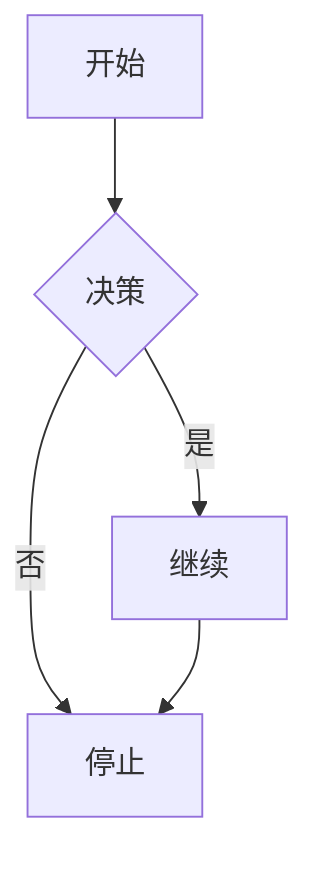

# Markdown 与文档工具完全指南

> [!NOTE]
> 本文档涵盖 Markdown 语法体系、文档工具链、静态站点生成器、API 文档工具及 AI 辅助文档开发，是 vibecoding 时代知识管理与文档编写的完整指南。

---

## 目录

1. [[#Markdown 概述与版本演进]]
2. [[#标准 Markdown 语法]]
3. [[#Markdown 扩展语法]]
4. [[#Obsidian Flavored Markdown]]
5. [[#静态站点生成器]]
6. [[#API 文档工具]]
7. [[#AI 辅助文档编写]]
8. [[#选型建议]]

---

## Markdown 概述与版本演进

### Markdown 的设计哲学

Markdown 由 John Gruber 于 2004 年创建，核心理念是「用纯文本的语法来实现『易读易写』的文档」。其设计原则：
- **可读性优先**：文档源码本身即可阅读
- **简洁直观**：语法符号接近自然语言
- **可转换性**：可渲染为 HTML、PDF 等多种格式

### 版本生态

| 版本 | 说明 | 生态 |
|------|------|------|
| **CommonMark** | Markdown 规范解析，标准化语法 | 基础解析器 |
| **GFM** | GitHub Flavored Markdown，扩展了表格、任务列表等 | GitHub, GitLab |
| **Obsidian Flavored Markdown** | Wiki 链接、嵌入、标签等 | Obsidian, Logseq |
| **MDX** | Markdown + JSX，可嵌入 React 组件 | Next.js, Gatsby |
| **MDsveX** | Markdown + Svelte 组件 | SvelteKit |

---

## 标准 Markdown 语法

### 标题

```markdown
# 一级标题
## 二级标题
### 三级标题
#### 四级标题
##### 五级标题
###### 六级标题
```

### 段落与换行

```markdown
这是一个段落。

这是另一个段落。

行末两个空格  
会创建一个换行（<br>）。

或者直接空一行，也会产生段落。
```

### 强调

```markdown
*斜体文本* 或 _斜体文本_

**粗体文本** 或 __粗体文本__

***粗斜体文本***

~~删除线文本~~

==高亮文本==  （部分扩展支持）
```

### 列表

```markdown
<!-- 无序列表 -->
- 项目一
- 项目二
  - 嵌套项目
  - 嵌套项目
- 项目三

<!-- 有序列表 -->
1. 第一步
2. 第二步
3. 第三步

<!-- 任务列表 -->
- [x] 已完成任务
- [ ] 未完成任务
- [ ] 另一个任务
```

### 链接与图片

```markdown
<!-- 链接 -->
[链接文字](https://example.com "可选标题")
[锚点链接](#header-id)

<!-- 图片 -->


<!-- 参考式链接 -->
[链接文字][ref]
[ref]: https://example.com "标题"

<!-- 自动链接 -->
<https://example.com>
<address@example.com>
```

### 引用

```markdown
> 这是一段引用文本。
> 可以多行，
> 会合并为一个块引用。

> 嵌套引用
>> 二级嵌套
```

### 代码

```markdown
<!-- 行内代码 -->
`inline code`

<!-- 代码块 -->
```javascript
function hello() {
  console.log('Hello, World!');
}
```

<!-- 代码块指定语言 -->
```python
def main():
    print("Hello")
```

<!-- 缩进代码块（4空格或1Tab） -->
    function example() {
        return true;
    }
```

### 分割线

```markdown
---

***

- - -

___
```

### 表格

```markdown
| 表头1 | 表头2 | 表头3 |
|-------|-------|-------|
| 单元格1 | 单元格2 | 单元格3 |
| 左对齐 | 居中 | 右对齐 |
|:------|:-----:|------:|
```

### HTML 内联

```markdown
大部分 Markdown 解析器支持 HTML：

<div align="center">
  <h1>居中标题</h1>
</div>

<kbd>Ctrl</kbd> + <kbd>C</kbd>

<details>
<summary>可折叠内容</summary>
展开后显示的内容
</details>
```

---

## Markdown 扩展语法

### GFM（GitHub Flavored Markdown）

GFM 在 CommonMark 基础上扩展：

```markdown
<!-- 任务列表（GFM）-->
- [x] 设计完成
- [ ] 开发中
- [ ] 测试待做

<!-- 自动链接激活 -->
https://github.com
<!-- 自动识别 URL -->

<!-- 删除线 -->
~~删除的内容~~

<!-- 表格（严格语法）-->
| 列1 | 列2 |
|-----|-----|
| 内容 | 内容 |
```

### 数学公式（支持 LaTeX 的解析器）

```markdown
<!-- 行内公式 -->
$E = mc^2$

<!-- 块级公式 -->
$$
\int_{0}^{\infty} e^{-x^2} dx = \frac{\sqrt{\pi}}{2}
$$

<!-- 多行对齐 -->
$$
\begin{align}
a &= b + c \\
  &= d + e + f
\end{align}
$$
```

### 脚注

```markdown
这是一段带有脚注的文字[^1]。

另一个脚注引用[^note]。

[^1]: 这是第一个脚注的内容。
[^note]: 这是第二个脚注的说明。
```

### 目录生成

```markdown
大多数解析器支持自动生成目录：

[[toc]]

或

- [第一部分](#第一部分)
  - [子部分](#子部分)
```

### Mermaid 图表

```markdown

```

支持图表类型：
- `graph` / `flowchart` — 流程图
- `sequenceDiagram` — 时序图
- `classDiagram` — 类图
- `stateDiagram` — 状态图
- `entityRelationshipDiagram` — ER 图
- `gantt` — 甘特图
- `pie` — 饼图

---

## Obsidian Flavored Markdown

### Wiki 链接

```markdown
<!-- 基本链接 -->
[[笔记名称]]

<!-- 显示文本 -->
[[笔记名称|显示文本]]

<!-- 链接到标题 -->
[[笔记名称#标题]]

<!-- 链接到块 -->
[[笔记名称#^块ID]]

<!-- 同一笔记内链接 -->
[[#标题]]

<!-- 嵌入文件 -->
![[笔记名称]]
![[笔记名称#标题]]
![[笔记名称|300]]  <!-- 带宽度 -->
```

### 嵌入资源

```markdown
<!-- 嵌入图片 -->
![[image.png]]
![[image.png|200]]          <!-- 指定宽度 -->
![[image.png|50%]]          <!-- 百分比宽度 -->

<!-- 嵌入 PDF -->
![[document.pdf#page=3]]

<!-- 嵌入音频 -->
![[audio.mp3]]

<!-- 嵌入视频 -->
![[video.mp4]]

<!-- 嵌入其他笔记 -->
![[其他笔记]]

<!-- 嵌入代码块 -->
![[代码笔记#代码块ID]]
```

### 属性（YAML Frontmatter）

```yaml
---
title: 文章标题
date: 2026-04-19
tags:
  - 标签1
  - 标签2
aliases:
  - 另一个名称
  - Alternative Name
cssclasses:
  - wide-table
created: 2026-04-19
modified: 2026-04-19
---

正文内容
```

### 标签

```markdown
<!-- 行内标签 -->
#tag
#嵌套/标签
#日期/2026-04

<!-- 标签使用场景 -->
#project/writing
#area/frontend
#status/in-progress
```

### Callout（标注块）

```markdown
> [!note] 笔记
> 普通笔记内容。

> [!warning] 自定义标题
> 警告内容。

> [!tip]- 可折叠
> 加 - 变为可折叠，默认折叠。
> 内容。

> [!faq]- 常见问题
> Q: 这是一个问题吗？
> A: 是的。
```

### 双向链接图谱

Obsidian 支持自动生成反向链接：

```markdown
<!-- 链接关系自动追踪 -->
[[目标笔记]]

<!-- 在目标笔记中可见：
     1 backlink from [[当前笔记]] -->
```

---

## 静态站点生成器

### 工具对比

| 工具 | 特点 | 语言 | 生态 | AI 友好度 |
|------|------|------|------|-----------|
| **Astro** | 内容优先，多岛屿架构 | TypeScript | 丰富 | 高 |
| **Next.js** | 全功能 SSR/SSG | TypeScript/JSX | 极丰富 | 高 |
| **Gatsby** | React 生态，GraphQL | React/GraphQL | 丰富 | 中 |
| **Hugo** | 极速构建 | Go | 主题丰富 | 低 |
| **VuePress** | Vue 生态，文档友好 | Vue | 中等 | 中 |
| **VitePress** | VuePress 继任者 | Vue | 中等 | 高 |
| **Docusaurus** | React 文档框架 | React/MDX | 丰富 | 高 |
| **Quartz 4** | Obsidian 发布 | Go | 活跃 | 极高 |
| **mdbook** | Rust 文档生成 | Rust/Markdown | 小众 | 中 |

### Quartz（Obsidian 发布）

Quartz 是将 Obsidian 笔记发布为静态站点的最佳工具：

```bash
# 安装
git clone https://github.com/coffeeladycn/quartz.git
cd quartz

# 初始化
npx quartz create

# 同步笔记
npx quartz sync

# 本地预览
npx quartz serve
```

```javascript
// quartz.config.ts
export default {
  configuration: {
    pageTitle: "我的数字花园",
    enableSPA: true,
    enableToc: true,
    enableCallouts: true,
    enableMermaid: true,
    baseUrl: "https://yoursite.com",
  },
  plugins: {
    themes: [],
  },
}
```

### VitePress（现代文档）

```bash
# 创建项目
npm create vitepress@latest my-docs

# 目录结构
my-docs/
├── .vitepress/
│   └── config.js
├── index.md
└── guide/
    └── getting-started.md
```

```javascript
// .vitepress/config.js
export default {
  title: '我的文档',
  description: '文档描述',
  themeConfig: {
    nav: [
      { text: '指南', link: '/guide/' },
      { text: 'API', link: '/api/' },
    ],
    sidebar: [
      {
        text: '指南',
        items: [
          { text: '快速开始', link: '/guide/getting-started' },
          { text: '配置', link: '/guide/config' },
        ],
      },
    ],
  },
}
```

### Docusaurus（React 文档）

```bash
# 创建
npx create-docusaurus@latest my-website classic

# 启动
cd my-website
npm start
```

---

## API 文档工具

### OpenAPI / Swagger

```yaml
# openapi.yaml
openapi: 3.1.0
info:
  title: 我的 API
  version: 1.0.0
  description: API 描述

servers:
  - url: https://api.example.com/v1
    description: 生产环境

paths:
  /users:
    get:
      summary: 获取用户列表
      parameters:
        - name: page
          in: query
          schema:
            type: integer
            default: 1
      responses:
        '200':
          description: 成功
          content:
            application/json:
              schema:
                type: array
                items:
                  $ref: '#/components/schemas/User'

components:
  schemas:
    User:
      type: object
      properties:
        id:
          type: string
          format: uuid
        name:
          type: string
        email:
          type: string
          format: email
```

### 文档工具生态

| 工具 | 特点 | 渲染引擎 |
|------|------|---------|
| **Scalar** | 现代 API 文档，支持 OpenAPI | React |
| **Redocly** | 企业级 API 文档 | React |
| **Swagger UI** | 经典 API 文档 + 测试 | JavaScript |
| **Mintlify** | AI 原生文档，现代设计 | Next.js |
| **Slidev** | Markdown 演示文稿 | Vue + Vite |
| **Shiki** | 代码高亮引擎 | TypeScript |

### Mintlify（AI 友好文档）

```bash
# 安装
npm i -g mintlify

# 启动
mintlify dev

# 创建页面
mintlify add page
```

```markdown
# 我的页面

## 快速开始

Install `package` using the following command:

```bash
npm install package
```

## API Reference

### `createUser()`

Creates a new user in the system.

```javascript
const user = await createUser({
  name: 'Alice',
  email: 'alice@example.com'
});
```

| Parameter | Type | Description |
|-----------|------|-------------|
| name | string | User's name |
| email | string | User's email |
```

---

## AI 辅助文档编写

### 使用场景

1. **自动生成 README**
2. **API 文档补全**
3. **代码注释生成**
4. **变更日志维护**
5. **技术博客写作**

### AI 文档工具链

| 工具 | 功能 | AI 能力 |
|------|------|---------|
| **Mintlify** | 文档站点 | AI 自动补全注释 |
| **Docusaurus** | React 文档 | 配合 Copilot |
| **VuePress** | Vue 文档 | AI 辅助编写 |
| **GitBook** | 团队文档 | AI 写作助手 |
| **Notion** | 知识库 | AI 写作增强 |
| **Obsidian** | 个人知识库 | 配合 AI 插件 |

### AI 文档最佳实践

```markdown
<!-- 给 AI 的提示词模板 -->
请为以下代码生成规范的 JSDoc 注释：

```typescript
/**
 * 计算两点之间的距离
 * @param x1 第一个点的 x 坐标
 * @param y1 第一个点的 y 坐标
 * @param x2 第二个点的 x 坐标
 * @param y2 第二个点的 y 坐标
 * @returns 两点之间的距离
 */
function distance(x1: number, y1: number, x2: number, y2: number): number {
  return Math.sqrt((x2 - x1) ** 2 + (y2 - y1) ** 2);
}
```

<!-- AI 输出示例 -->
```typescript
/**
 * Calculates the Euclidean distance between two points in 2D space.
 * 
 * @param x1 - The x-coordinate of the first point
 * @param y1 - The y-coordinate of the first point
 * @param x2 - The x-coordinate of the second point
 * @param y2 - The y-coordinate of the second point
 * @returns The Euclidean distance between the two points
 * 
 * @example
 * distance(0, 0, 3, 4); // returns 5
 * 
 * @see https://en.wikipedia.org/wiki/Euclidean_distance
 */
```

<!-- 自动化 CHANGELOG -->
```bash
# conventional-changelog 自动生成
npm install -g conventional-changelog
conventional-changelog -p angular -i CHANGELOG.md -s
```
```

---

## 选型建议

### 文档工具选型

| 场景 | 推荐工具 | 原因 |
|------|---------|------|
| **个人知识管理** | Obsidian + Quartz | 原生 OFM 支持，双向链接 |
| **技术博客** | Astro + MDX | 极致性能，内容优先 |
| **API 文档** | Mintlify / Scalar | AI 友好，现代设计 |
| **开源项目文档** | VitePress / Docusaurus | 社区生态成熟 |
| **团队内部文档** | GitBook / Notion | 协作能力强 |
| **代码演示/幻灯** | Slidev / Marp | Markdown 演示 |
| **静态站点** | Hugo / Astro | 极速构建 |

### Markdown 编辑器推荐

| 编辑器 | 平台 | 特点 |
|--------|------|------|
| **Obsidian** | 全平台 | 知识管理首选，双向链接 |
| **Typora** | 全平台 | 实时预览，简洁优雅 |
| **VS Code** | 全平台 | 插件生态强大，编程友好 |
| **Zettlr** | 全平台 | 学术写作，Zettelkasten |
| **Logseq** | 全平台 | 大纲优先，本地优先 |
| **iA Writer** | 全平台 | 专注写作，干净界面 |

---

## 技术概述与定位

### Markdown 在现代文档体系中的位置

Markdown 作为一种轻量级标记语言，在现代文档生态中扮演着不可或缺的角色。从个人笔记到企业文档，从开源项目到静态博客，Markdown 已经成为技术写作的事实标准。

```
文档格式演进历程：

1986: SGML → 复杂、冗长、难以手写
    ↓
1991: HTML → 结构化但语法繁琐
    ↓
2004: Markdown → Gruber 创立，简洁易读
    ↓
2012: CommonMark → 标准化规范
    ↓
2014: GFM → GitHub 扩展，生态繁荣
    ↓
2016: OFM → Obsidian 双向链接
    ↓
2018: MDX → React 组件嵌入
    ↓
2021: MDsveX → Svelte 组件嵌入
    ↓
2024: AI集成 → 智能文档生成
```

### Markdown 的核心优势

| 优势 | 说明 | 适用场景 |
|------|------|---------|
| **纯文本兼容性** | 可在任何编辑器打开，无需专用软件 | 跨平台协作、版本控制 |
| **版本控制友好** | 作为纯文本，diff 清晰可读 | Git 管理、历史追溯 |
| **转换灵活** | 可转换为 HTML、PDF、DOCX 等 | 多格式发布 |
| **学习成本低** | 基础语法 10 分钟入门 | 团队普及、非技术成员 |
| **专注内容** | 语法简洁，减少格式干扰 | 写作、笔记、知识管理 |
| **生态丰富** | 众多工具支持 | 编辑器、静态站点、API 文档 |

### Markdown 工具生态全景

```
Markdown 工具生态：

┌─────────────────────────────────────────────────────────────────────┐
│                           编辑器层                                   │
├─────────────────────────────────────────────────────────────────────┤
│                                                                     │
│  纯文本编辑器    │    富文本编辑器    │    混合编辑器              │
│  Vim/Emacs     │    Typora          │    Obsidian                │
│  VS Code       │    IA Writer       │    Logseq                 │
│  Sublime       │    Bear            │    Notion                  │
│                                                                     │
└─────────────────────────────────────────────────────────────────────┘
                              ↓
┌─────────────────────────────────────────────────────────────────────┐
│                           处理引擎层                                 │
├─────────────────────────────────────────────────────────────────────┤
│                                                                     │
│  解析器        │    渲染器         │    转换器                    │
│  marked        │    浏览器原生     │    pandoc                   │
│  remark        │    Node.js        │    md-pdf                   │
│  markdown-it   │    SSR            │    docx-generator           │
│                                                                     │
└─────────────────────────────────────────────────────────────────────┘
                              ↓
┌─────────────────────────────────────────────────────────────────────┐
│                           发布平台层                                 │
├─────────────────────────────────────────────────────────────────────┤
│                                                                     │
│  静态站点       │    文档平台       │    知识平台                  │
│  Hugo          │    VitePress      │    Obsidian Publish         │
│  Astro         │    Docusaurus     │    Quartz                   │
│  Gatsby        │    GitBook        │    Siyuan                   │
│  Next.js       │    Mintlify       │    Logseq                   │
│                                                                     │
└─────────────────────────────────────────────────────────────────────┘
```

---

## 完整安装与配置

### VS Code Markdown 配置

VS Code 是最流行的 Markdown 编辑器之一，通过插件扩展可获得极佳的写作体验。

**1. 基础配置**

```json
// .vscode/settings.json
{
  // 启用 Markdown 预览
  "markdown.styles": [],
  
  // Markdown 预览样式
  "markdown.preview.fontFamily": "-apple-system, BlinkMacSystemFont, 'Segoe UI', Roboto, sans-serif",
  "markdown.preview.fontSize": 16,
  "markdown.preview.lineHeight": 1.6,
  
  // 数学公式支持
  "markdown.preview.markEditorPresentation": "toolbar",
  
  // 启用链接验证
  "markdown.linkValidation": true,
  
  // 文件排除
  "files.exclude": {
    "**/.git": true,
    "**/node_modules": true
  },
  
  // 建议的扩展
  "extensions.recommended": [
    "esbenp.prettier-vscode",
    "yzhang.markdown-all-in-one",
    "bierner.github-markdown-preview",
    "dendron顶顶顶顶.dendron-markdown-preview",
    "shd101wyy.markdown-preview-enhanced",
    "DavidAnson.vscode-markdownlint"
  ]
}
```

**2. Prettier 格式化配置**

```json
// .prettierrc.json (项目根目录)
{
  "proseWrap": "preserve",
  "printWidth": 80,
  "tabWidth": 2,
  "useTabs": false,
  "semi": false,
  "singleQuote": true,
  "quoteProps": "as-needed",
  "jsxSingleQuote": false,
  "trailingComma": "es5",
  "bracketSpacing": true,
  "arrowParens": "always",
  "endOfLine": "lf",
  "embeddedLanguageFormatting": "auto"
}
```

**3. Markdownlint 规则配置**

```json
// .markdownlint.json
{
  "MD013": {
    "line_length": 120,
    "heading_line_length": 80
  },
  "MD024": {
    "siblings_only": true
  },
  "MD033": {
    "allowed_elements": ["kbd", "details", "summary"]
  },
  "MD041": false,
  "MD004": {
    "style": "unordered"
  },
  "MD007": {
    "indent": 2
  },
  "MD029": {
    "style": "ordered"
  }
}
```

### Obsidian 配置

Obsidian 是 Markdown 知识管理的最佳工具之一。

**1. 核心设置**

```json
// .obsidian/options.json (或通过 GUI 设置)
{
  // 编辑器设置
  "editor": {
    "defaultViewMode": "source",
    "spellcheck": true,
    "spellcheckDictionary": ["en-US", "zh-CN"],
    "smartIndent": true,
    "foldHeading": true,
    "foldLine": false,
    "alwaysUpdateInternalLinks": true
  },
  
  // 外观设置
  "appearance": {
    "theme": "system",
    "translucency": false,
    "showInlineTitle": true,
    "showLineNumber": true,
    "showFrontmatter": true,
    "showTabFileName": true,
    "showStatusBar": true
  },
  
  // 核心插件设置
  "plugin": {
    "dailyNotes": {
      "format": "YYYY-MM-DD"
    },
    "fileRecovery": {
      "maxBackup": 10
    }
  }
}
```

**2. 社区插件推荐**

| 插件名称 | 功能 | 用途 |
|---------|------|------|
| **Templater** | 高级模板系统 | 自动化笔记创建 |
| **Dataview** | 类数据库查询 | 动态数据索引 |
| **QuickAdd** | 快速添加 | 快速创建笔记 |
| **obsidian-git** | Git 同步 | 版本控制 |
| **Obsidian PDF** | PDF 导出 | 打印友好 |
| **Admonition** | 标注块 | Callout 扩展 |
| **Excalidraw** | 白板绘图 | 可视化思考 |
| **Kanban** | 看板 | 任务管理 |
| **Calendar** | 日历视图 | 日常笔记管理 |

**3. 同步配置**

```yaml
# obsidian-git 配置示例
---
repo: "https://github.com/username/obsidian-vault.git"
branch: "main"
commitMessageFormat: "{{date}} {{time}}"
autoCommitInterval: 30
autoPushInterval: 60
autoPullInterval: 30
```

### Typora 配置

Typora 是一款「所见即所得」的 Markdown 编辑器。

**1. 外观设置**

```json
// 偏好设置 (通过 GUI)
{
  "appearance": {
    "theme": "GitHub",  // 或 "newsprint", "night", "dracula"
    "fontFamily": "JetBrains Mono",
    "fontSize": 16,
    "lineHeight": 1.6
  },
  
  "editor": {
    "autoPairBracket": true,
    "autoPairMarkdownSyntax": true,
    "spellCheck": true,
    "smartGrammar": true,
    "codeBlock": "highlight",
    "inlineMath": true
  },
  
  "export": {
    "PDF": {
      "pageSize": "A4",
      "marginTop": "2cm",
      "marginBottom": "2cm",
      "marginLeft": "2cm",
      "marginRight": "2cm"
    }
  }
}
```

**2. 自定义 CSS 主题**

```css
/* custom.css (放在 Typora 主题文件夹) */
:root {
  --bg-color: #ffffff;
  --text-color: #24292e;
  --code-bg: #f6f8fa;
  --side-bar-bg-color: #f6f8fa;
}

body {
  font-family: -apple-system, BlinkMacSystemFont, "Segoe UI", Helvetica, Arial, sans-serif;
  line-height: 1.6;
}

#write {
  max-width: 900px;
  margin: 0 auto;
  padding: 40px 60px;
}

/* 代码块样式 */
.md-fences {
  border-radius: 6px;
  font-family: 'JetBrains Mono', 'Fira Code', monospace;
}

/* 表格样式 */
table {
  border-collapse: collapse;
  width: 100%;
}

table th, table td {
  border: 1px solid #d0d7de;
  padding: 8px 16px;
}

table th {
  background-color: #f6f8fa;
  font-weight: 600;
}
```

### GitBook 配置

GitBook 是团队协作文档的首选工具。

**1. 初始化项目**

```bash
# 初始化 GitBook 项目
mkdir my-docs && cd my-docs
gitbook init

# 安装 CLI
npm install -g gitbook-cli

# 本地预览
gitbook serve
```

**2. book.json 配置**

```json
{
  "title": "我的文档",
  "description": "项目文档说明",
  "author": "Author Name",
  "output": "_book",
  "root": ".",
  
  "structure": {
    "readme": "README.md",
    "summary": "SUMMARY.md",
    "glossary": "GLOSSARY.md",
    "languages": "LANGS.md"
  },
  
  "plugins": [
    "theme-default",
    "-lunr",
    "-search",
    "search-pro",
    "highlight",
    "github",
    "github-buttons",
    "anchor-navigation-ex",
    "expandable-chapters-small",
    "copy-code-button",
    "pageview-count",
    "tbfed-pagefooter",
    "sitemap-general"
  ],
  
  "pluginsConfig": {
    "github": {
      "url": "https://github.com/username/repo"
    },
    "anchor-navigation-ex": {
      "isShowPrintMargin": false,
      "showLevel": true
    },
    "tbfed-pagefooter": {
      "copyright": "&copy; 2024 Company Name",
      "modify_label": "本文档修订时间：",
      "modify_format": "YYYY-MM-DD HH:mm:ss"
    },
    "sitemap-general": {
      "hostname": "https://docs.example.com"
    }
  },
  
  "styles": {
    "website": "styles/website.css",
    "pdf": "styles/pdf.css",
    "epub": "styles/epub.css",
    "mobi": "styles/mobi.css",
    "ebook": "styles/ebook.css"
  }
}
```

**3. SUMMARY.md 结构定义**

```markdown
# Summary

- [介绍](README.md)
- [快速开始](quick-start.md)

## 基础指南

- [安装](guides/installation.md)
- [配置](guides/configuration.md)
- [基本用法](guides/usage.md)

## 进阶主题

- [高级配置](advanced/advanced-config.md)
- [插件开发](advanced/plugins.md)
- [自定义主题](advanced/themes.md)

## API 参考

- [API 概述](api/overview.md)
- [认证](api/authentication.md)
- [端点](api/endpoints.md)
  - [用户](api/endpoints/users.md)
  - [订单](api/endpoints/orders.md)

## 常见问题

- [FAQ](faq.md)
- [故障排除](troubleshooting.md)
```

---

## 核心概念详解

### 核心概念一：Markdown 解析器原理

理解 Markdown 解析器的工作原理，有助于编写更规范的文档和排查问题。

#### 解析流程

```
┌─────────────────────────────────────────────────────────────────────┐
│                        Markdown 解析流程                             │
├─────────────────────────────────────────────────────────────────────┤
│                                                                      │
│  1. 词法分析 (Lexing)                                                │
│     └── 将源码拆分为 Token 序列                                       │
│         - 标题标记 (#, ##, ...)                                     │
│         - 链接标记 ([](),  )                                   │
│         - 代码标记 (`, ```)                                          │
│         - 强调标记 (*, **, _)                                       │
│         - 列表标记 (-, *, 1., [ ])                                  │
│                                                                      │
│  2. 语法分析 (Parsing)                                               │
│     └── 将 Token 转换为 AST (抽象语法树)                              │
│         - Document (文档)                                           │
│         - Heading (标题)                                             │
│         - Paragraph (段落)                                           │
│         - CodeBlock (代码块)                                         │
│         - List (列表)                                                │
│         - Link (链接)                                                │
│                                                                      │
│  3. 转换 (Transform)                                                 │
│     └── AST → HTML AST                                               │
│         - 扩展 GFM 语法                                             │
│         - 解析嵌入语言 (MDX, MDsveX)                                │
│                                                                      │
│  4. 生成 (Generation)                                                │
│     └── HTML AST → HTML 字符串                                       │
│                                                                      │
└─────────────────────────────────────────────────────────────────────┘
```

#### 常见解析器对比

| 解析器 | 语言 | 速度 | GFM 支持 | 插件系统 | 生态 |
|--------|------|------|---------|---------|------|
| **marked** | JavaScript | 快 | 完整 | 有限 | 广泛 |
| **remark** | JavaScript | 中等 | 完整 | 强大 | MDX 生态 |
| **markdown-it** | JavaScript | 快 | 完整 | 强大 | 插件丰富 |
| **commonmark.js** | JavaScript | 慢 | 需扩展 | 无 | 参考实现 |
| **marked.js** | JavaScript | 快 | 完整 | 有限 | 广泛 |
| **remark-rehype** | JavaScript | 中等 | 完整 | 强大 | 统一生态 |
| **pandoc** | Haskell | 慢 | 扩展 | 模板 | 功能最全 |

#### remark/rehype 生态

remark 和 rehype 是现代 Markdown 处理的核心：

```typescript
import { remark } from 'remark';
import remarkGfm from 'remark-gfm';
import remarkMath from 'remark-math';
import remarkRehype from 'remark-rehype';
import rehypeKatex from 'rehype-katex';
import rehypeStringify from 'rehype-stringify';
import rehypeSlug from 'rehype-slug';
import rehypeAutolinkHeadings from 'rehype-autolink-headings';

async function processMarkdown(markdown: string): Promise<string> {
  const result = await remark()
    .use(remarkGfm)           // GFM 扩展
    .use(remarkMath)          // 数学公式
    .use(remarkRehype)        // 转换为 rehype AST
    .use(rehypeKatex)         // KaTeX 数学渲染
    .use(rehypeSlug)          // 标题添加 ID
    .use(rehypeAutolinkHeadings) // 标题自动链接
    .use(rehypeStringify)     // 生成 HTML
    .process(markdown);
    
  return result.toString();
}
```

### 核心概念二：OFM (Obsidian Flavored Markdown)

Obsidian Flavored Markdown 是知识管理领域最重要的 Markdown 方言。

#### Wiki 链接深度解析

```markdown
<!-- 基本语法 -->
[[笔记名称]]              → 链接到同名笔记
[[笔记名称|显示文本]]      → 自定义显示文本
[[笔记名称#标题]]         → 链接到特定标题
[[笔记名称#^块ID]]        → 链接到特定块
[[#标题]]                 → 当前笔记内的标题锚点

<!-- 嵌入语法 -->
![[笔记名称]]             → 嵌入整个笔记
![[笔记名称#标题]]        → 嵌入特定标题
![[笔记名称|300]]         → 嵌入并指定宽度
![[image.png|200x200]]    → 嵌入图片并指定尺寸
![[document.pdf]]         → 嵌入 PDF
![[audio.mp3]]            → 嵌入音频
![[video.mp4]]            → 嵌入视频

<!-- 别名引用 -->
<!-- 在笔记 frontmatter 中定义 -->
---
aliases:
  - 笔记简称
  - Another Name
---
<!-- 可用别名链接 -->
[[笔记简称]]
```

#### 属性系统 (Frontmatter)

```yaml
---
# 基本元数据
title: 文章标题
date: 2024-04-19
created: 2024-04-19
modified: 2024-04-19
author: 作者名

# 分类与标签
tags:
  - 标签1
  - 标签2
  - 嵌套/子标签
categories:
  - 分类1
  - 分类1/子分类

# 别名
aliases:
  - 别名1
  - Another Name
  - short-name

# CSS 类（需要 CSS 代码块插件）
cssclasses:
  - wide-table
  - callout-custom

# 发布设置
publish: true
draft: false
permalink: /custom-url

# 自定义属性
type: article
rating: 5
readtime: 10min

# 相关链接
related:
  - "[[相关笔记1]]"
  - "[[相关笔记2]]"

# 封面图
cover: "![[cover-image.png]]"
banner: "![[banner.jpg]]"
icon: "📝"
---

正文内容...
```

#### Callout 标注块完整指南

```markdown
> [!NOTE] 基本笔记
> 普通提示信息。

> [!TIP]+ 可折叠标题（默认展开）
> 这是一个可折叠的提示块。
> 可以包含多行内容。

> [!TIP]- 可折叠标题（默认折叠）
> 这是一个默认折叠的提示块。

> [!WARNING] 警告
> 警告信息内容。

> [!CAUTION] 小心
> 需要注意的内容。

> [!IMPORTANT] 重要
> 重要提示。

> [!INFO] 信息
> 一般信息。

> [!EXAMPLE] 示例
> 用法示例。

> [!QUESTION] 问题
> 疑问内容。

> [!BUGBUG] Bug
> 已知问题。

> [!QUOTE] 引用
> 引用内容。

> [!SUCCESS] 成功
> 成功信息。

> [!FAILURE] 失败
> 失败信息。

> [!DANGER] 危险
> 危险警告。

> [!抽象]- 自定义标题
> 使用自定义标题的自定义类型。
```

#### 标签系统深度使用

```markdown
<!-- 基本标签 -->
#tag                    → 简单标签
#project/writing        → 命名空间
#area/frontend/vue      → 多级命名空间
#日期/2024/04          → 日期标签
#status/in-progress     → 状态标签

<!-- 搜索语法 -->
#tag OR #tag2          → 或关系
#tag AND #tag2         → 且关系
#tag -#excluded         → 排除
tag:#tag                → 精确匹配
tag:#tag*               → 开头匹配

<!-- 标签与元数据 -->
<!-- 在笔记中使用标签作为元数据 -->
#person/engineer
#location/beijing
#company/startup
```

### 核心概念三：MDX 与组件化文档

MDX 允许在 Markdown 中使用 React 组件，实现交互式文档。

#### MDX 基础语法

```mdx
---
title: MDX 文档示例
---

import { Chart } from './components/Chart';
import { Callout } from 'nextra/components';

# 使用 React 组件

这是一个普通的 Markdown 段落。

<Chart data={chartData} title="销售趋势" />

## 交互式演示

import { Counter } from './components/Counter';

<Counter initialValue={0} step={1} />

## 组件化 Callout

<Callout type="info" title="提示">
  这是一个自定义的提示组件。
</Callout>

## 数据表格

import { DataTable } from './components/DataTable';

<DataTable 
  columns={['Name', 'Type', 'Status']}
  data={[
    ['Item 1', 'Type A', 'Active'],
    ['Item 2', 'Type B', 'Pending'],
  ]}
/>
```

#### MDX 配置 (Next.js)

```javascript
// next.config.js
const withMDX = require('@next/mdx')({
  extension: /\.mdx?$/,
  options: {
    remarkPlugins: [
      require('remark-gfm'),
      require('remark-frontmatter'),
      [require('remark-mdx-frontmatter'), { name: 'frontmatter' }],
    ],
    rehypePlugins: [
      require('rehype-slug'),
      require('rehype-autolink-headings'),
      require('rehype-pretty-code'),
    ],
    providerImportSource: '@mdx/react',
  },
});

/** @type {import('next').NextConfig} */
const nextConfig = {
  pageExtensions: ['js', 'jsx', 'mdx', 'ts', 'tsx'],
};

module.exports = withMDX(nextConfig);
```

#### 常用 MDX 组件库

| 组件库 | 特点 | 适用场景 |
|--------|------|---------|
| **shiki** | 代码高亮 | 技术文档 |
| **nextra** | Next.js 文档框架 | 产品文档 |
| **docusaurus** | React 文档框架 | 开源项目 |
| **rspress** | Rspack 驱动 | 快速构建 |
| **mintlify** | AI 友好 | API 文档 |

### 核心概念四：静态站点生成器原理

静态站点生成器 (SSG) 将 Markdown 转换为静态 HTML。

#### SSG 工作流程

```
┌─────────────────────────────────────────────────────────────────────┐
│                    静态站点生成器工作流程                            │
├─────────────────────────────────────────────────────────────────────┤
│                                                                      │
│  1. 内容收集 (Content Collection)                                   │
│     └── 扫描源目录 (通常是 /docs 或 /content)                        │
│         - 读取所有 .md/.mdx 文件                                     │
│         - 解析 frontmatter 元数据                                    │
│         - 生成内容图谱                                               │
│                                                                      │
│  2. 路由生成 (Routing)                                               │
│     └── 基于文件系统或配置生成路由                                     │
│         - 文件路径 → URL 路径                                        │
│         - /docs/guide/getting-started.md → /guide/getting-started   │
│                                                                      │
│  3. 内容转换 (Transformation)                                        │
│     └── Markdown → HTML                                             │
│         - 调用解析器处理 Markdown                                     │
│         - 渲染代码高亮                                               │
│         - 处理嵌入资源                                               │
│                                                                      │
│  4. 模板渲染 (Templating)                                           │
│     └── 应用布局模板                                                 │
│         - 注入导航菜单                                               │
│         - 应用主题样式                                               │
│         - 添加侧边栏                                                 │
│                                                                      │
│  5. 资源优化 (Optimization)                                          │
│     └── 优化最终产物                                                 │
│         - CSS/JS 压缩                                               │
│         - 图片优化                                                   │
│         - 代码分割                                                   │
│                                                                      │
│  6. 输出 (Output)                                                    │
│     └── 生成静态文件                                                 │
│         - /dist/index.html                                          │
│         - /dist/guide/getting-started/index.html                    │
│         - /dist/assets/...                                          │
│                                                                      │
└─────────────────────────────────────────────────────────────────────┘
```

#### 内容管理与组织

```markdown
# 常见内容组织方式

## 按分类组织
docs/
├── getting-started/
│   ├── installation.md
│   ├── configuration.md
│   └── quick-start.md
├── guides/
│   ├── basic/
│   │   ├── writing.md
│   │   └── formatting.md
│   └── advanced/
│       ├── plugins.md
│       └── theming.md
└── api/
    ├── overview.md
    └── endpoints/

## 按系列组织
docs/
├── series-a/
│   ├── 01-introduction.md
│   ├── 02-basics.md
│   └── 03-advanced.md
└── series-b/
    ├── 01-getting-started.md
    └── 02-reference.md

## 混合组织
docs/
├── README.md              → 文档首页
├── guide/
│   ├── README.md         → 指南首页
│   ├── basics.md
│   └── advanced.md
└── reference/
    ├── README.md         → 参考首页
    ├── api.md
    └── cli.md
```

---

## 常用命令与操作

### GitBook CLI 命令

```bash
# 初始化项目
gitbook init

# 本地预览
gitbook serve
gitbook serve --port 4001          # 指定端口
gitbook serve --lrport 35729       # Livereload 端口

# 构建静态站点
gitbook build
gitbook build ./my-docs ./output   # 指定输入输出目录

# PDF 输出
gitbook pdf
gitbook pdf ./my-docs ./book.pdf   # 指定输出文件

# EPUB 输出
gitbook epub
gitbook epub ./my-docs ./book.epub

# Mobi 输出
gitbook mobi
gitbook mobi ./my-docs ./book.mobi

# 列出已安装插件
gitbook list

# 安装插件
gitbook install

# 更新 GitBook
npm update -g gitbook-cli
```

### VitePress 命令

```bash
# 创建项目
npm create vitepress@latest my-docs

# 开发服务器
npm run docs:dev
npm run docs:dev -- --port 8080    # 指定端口
npm run docs:dev -- --open          # 自动打开浏览器

# 构建生产版本
npm run docs:build

# 预览生产版本
npm run docs:preview
```

### Docusaurus 命令

```bash
# 创建项目
npx create-docusaurus@latest my-website classic

# 开发服务器
npm start
npm start -- --port 3000           # 指定端口

# 构建
npm run build

# 部署
npm run deploy

# 清理缓存
npm run clear
```

### Obsidian CLI (obsidian-cli)

```bash
# 安装
npm install -g @intermiso/obsidian-cli

# 初始化
obsidian-cli init

# 基本命令
obsidian-cli new "笔记标题"                    # 创建新笔记
obsidian-cli new "笔记标题" -t "template"      # 使用模板
obsidian-cli search "关键词"                    # 搜索笔记
obsidian-cli list                              # 列出所有笔记
obsidian-cli open "笔记名称"                    # 在编辑器打开

# 同步
obsidian-cli sync                              # 同步笔记
obsidian-cli sync --pull                       # 仅拉取
obsidian-cli sync --push                       # 仅推送
```

### Markdown 转换命令

```bash
# pandoc 转换
pandoc input.md -o output.html                 # Markdown → HTML
pandoc input.md -o output.pdf                  # Markdown → PDF
pandoc input.md -o output.docx                # Markdown → Word
pandoc input.md -o output.latex               # Markdown → LaTeX
pandoc input.md -o output.epub                # Markdown → EPUB

# 带参数的转换
pandoc input.md \
  -o output.pdf \
  --pdf-engine=xelatex \
  -V mainfont="Songti SC" \
  -V geometry:margin=1in \
  -V fontsize=12pt

# 组合多个文件
pandoc intro.md guide.md api.md -o combined.pdf

# 包含目录
pandoc input.md -o output.pdf --toc --toc-depth=2
```

### Markdownlint CLI

```bash
# 安装
npm install -g markdownlint-cli

# 检查文件
markdownlint "**/*.md"

# 检查并修复
markdownlint "**/*.md" --fix

# 排除目录
markdownlint "**/*.md" --ignore "node_modules/**"

# 自定义规则
markdownlint "**/*.md" --config .markdownlint.json

# 严重级别
markdownlint "**/*.md" --severity error    # 只显示错误
markdownlint "**/*.md" --severity warning  # 显示警告和错误
```

---

## 高级配置与技巧

### MDsveX 配置 (Svelte + Markdown)

```javascript
// svelte.config.js
import { mdsvex } from 'mdsvex';

const config = {
  extensions: ['.svelte', '.md', '.svx'],
  
  preprocess: [
    mdsvex({
      extensions: ['.md', '.svx'],
      
      // 布局系统
      layout: {
        _: './src/lib/components/MarkdownLayout.svelte',
        blog: './src/lib/components/BlogLayout.svelte',
        docs: './src/lib/components/DocsLayout.svelte',
      },
      
      // Remark 插件
      remarkPlugins: [
        require('remark-gfm'),
        require('remark-toc'),
        [require('remark-frontmatter'), 'yaml'],
      ],
      
      // Rehype 插件
      rehypePlugins: [
        require('rehype-slug'),
        require('rehype-autolink-headings'),
      ],
      
      // 智能标头
      smartypants: true,
      
      // 代码块高亮
      highlight: {
        highlighter: async (code, lang) => {
          const { getHighlighter } = await import('shiki');
          const highlighter = await getHighlighter({
            themes: 'one-dark-pro',
            langs: [lang || 'text'],
          });
          return highlighter.codeToHtml(code, { lang });
        },
      },
    }),
  ],
};

export default config;
```

### VitePress 高级配置

```javascript
// docs/.vitepress/config.js
import { defineConfig } from 'vitepress';

export default defineConfig({
  title: '文档站点',
  description: '项目文档描述',
  
  // 头部和底部
  head: [
    ['link', { rel: 'icon', type: 'image/svg+xml', href: '/favicon.svg' }],
    ['meta', { name: 'theme-color', content: '#3eaf7c' }],
  ],
  
  // Markdown 配置
  markdown: {
    lineNumbers: true,                        // 代码行号
    theme: 'one-dark',                       // 代码主题
    config: (md) => {
      md.use(require('markdown-it-anchor'));
      md.use(require('markdown-it-toc'));
    },
  },
  
  // 导航
  nav: [
    { text: '指南', link: '/guide/', activeMatch: '/guide/' },
    { text: '参考', link: '/reference/', activeMatch: '/reference/' },
    { text: '博客', link: '/blog/' },
    {
      text: '资源',
      items: [
        { text: 'GitHub', link: 'https://github.com/example' },
        { text: 'Changelog', link: '/changelog' },
      ],
    },
  ],
  
  // 侧边栏
  sidebar: {
    '/guide/': [
      {
        text: '入门',
        items: [
          { text: '安装', link: '/guide/installation' },
          { text: '快速开始', link: '/guide/getting-started' },
        ],
      },
      {
        text: '基础',
        collapsed: false,
        items: [
          { text: '配置', link: '/guide/configuration' },
          { text: '使用', link: '/guide/usage' },
        ],
      },
    ],
    '/reference/': [
      {
        text: 'API 参考',
        items: [
          { text: '概览', link: '/reference/' },
          { text: '配置', link: '/reference/config' },
        ],
      },
    ],
  },
  
  // 社交链接
  socialLinks: [
    { icon: 'github', link: 'https://github.com/vuejs/vitepress' },
    { icon: 'twitter', link: 'https://twitter.com/vuejs' },
  ],
  
  // 页脚
  footer: {
    message: '基于 MIT 许可证发布。',
    copyright: 'Copyright © 2024',
  },
  
  // 编辑链接
  editLink: {
    pattern: 'https://github.com/vuejs/vitepress/edit/main/docs/:path',
    text: '在 GitHub 上编辑此页',
  },
  
  // 最后一个更新信息
  lastUpdated: {
    text: '最后更新于',
    formatOptions: {
      dateStyle: 'short',
      timeStyle: 'short',
    },
  },
  
  // 搜索
  search: {
    provider: 'local',
    options: {
      detailedView: true,
    },
  },
});
```

### Hugo 高级配置

```yaml
# config.yaml
baseURL: "https://example.com/"
languageCode: "zh-cn"
title: "我的网站"
theme: "hugo-theme-learn"

# 多语言
languages:
  zh-cn:
    languageName: "简体中文"
    weight: 1
    title: "中文网站"
  en:
    languageName: "English"
    weight: 2
    title: "English Site"

# 参数
params:
  author: "作者名"
  description: "网站描述"
  email: "contact@example.com"
  
  # 主题特定参数
  themeVariant: "green"
  disableAssetsBusting: false
  disableSearch: false
  menuPre: "BLOG"
  enableSearch: true
  enablethemeswitcher: true

# 导航菜单
menu:
  main:
    - name: 指南
      url: /guides/
      weight: 1
    - name: 参考
      url: /reference/
      weight: 2
    - name: 博客
      url: /blog/
      weight: 3
    - name: 关于
      url: /about/
      weight: 4

# 输出格式
outputs:
  home:
    - HTML
    - RSS
    - JSON
  page:
    - HTML

# 短代码
markup:
  highlight:
    codeFences: true
    guessSyntax: true
    style: monokai
  tableOfContents:
    startLevel: 2
    endLevel: 6
    ordered: false
  goldmark:
    renderer:
      unsafe: true  # 允许 HTML
    extensions:
      linkify: true
    parser:
      wrapStandAloneImageWithinParagraph: true
```

---

## 与同类技术对比

### 主流文档工具对比

| 工具 | 类型 | 适合场景 | 优点 | 缺点 |
|------|------|---------|------|------|
| **VitePress** | SSG | 技术文档 | 快速、Vue 生态、简单 | 插件相对少 |
| **Docusaurus** | SSG | React 文档 | 功能丰富、社区大 | 较重 |
| **GitBook** | 在线文档 | 团队协作 | 协作友好、托管服务 | 灵活度低 |
| **Hugo** | SSG | 内容站 | 极快构建 | 模板复杂 |
| **Astro** | SSG | 内容站 | 多框架支持、性能好 | 学习曲线 |
| **Gatsby** | SSG | React 内容 | GraphQL 生态 | 较慢 |
| **Next.js** | SSG/SSR | 应用/文档 | 全功能 | 配置复杂 |
| **Quartz** | SSG | Obsidian 发布 | OFM 支持、简洁 | 功能有限 |

### 各工具适用场景分析

```markdown
# 文档工具选型决策树

你的文档类型是什么？
│
├── 静态内容展示
│   ├── 构建速度要求高 → Hugo
│   ├── 需要 Vue 集成 → VitePress
│   ├── 需要 React 集成 → Docusaurus
│   └── 需要内容优先 → Astro
│
├── 团队协作文档
│   ├── 需要托管服务 → GitBook
│   ├── 需要自托管 → Confluence / Notion
│   └── 需要开源 → Outline / Wiki.js
│
├── 个人知识管理
│   ├── 双向链接重要 → Obsidian + Quartz
│   ├── 本地优先 → Logseq / Roam
│   └── 云端优先 → Notion / RemNote
│
└── API 文档
    ├── 需要 AI 辅助 → Mintlify / Scalar
    ├── 传统 Swagger → Redocly / Swagger UI
    └── 企业级 → Postman / Stoplight
```

### Markdown 编辑器对比

| 编辑器 | 平台 | 特点 | 适合人群 |
|--------|------|------|---------|
| **Obsidian** | 全平台 | 双向链接、本地存储 | 知识管理者 |
| **Logseq** | 全平台 | 大纲优先、Roam 风格 | PKM 爱好者 |
| **Typora** | 全平台 | 所见即所得、简洁 | 写作爱好者 |
| **VS Code** | 全平台 | 插件生态、代码友好 | 开发者 |
| **iA Writer** | 全平台 | 专注写作、干净 | 作家 |
| **Zettlr** | 全平台 | 学术写作、Zettelkasten | 学者 |
| **Bear** | Apple 全家桶 | 优雅、标签系统 | Apple 用户 |
| **Notion** | 全平台 | 数据库、多功能 | 团队 |

---

## 常见问题与解决方案

### 问题一：图片路径问题

**问题描述：**

在本地编辑器中图片正常显示，但部署到线上后图片无法加载。

**解决方案：**

1. **使用相对路径**

```markdown
<!-- 推荐：相对于当前文件 -->


<!-- 不推荐：绝对路径 -->
<!--  -->
```

2. **使用媒体文件夹**

```markdown
---
cover: "![[images/cover.png]]"
---

<!-- 或在 frontmatter 中 -->
---
banner: "./assets/banner.jpg"
---
```

3. **配置公共资源目录**

```javascript
// VitePress 配置
export default defineConfig({
  srcDir: 'docs',
  assetsInclude: ['**/*.png', '**/*.jpg'],
  publicDir: 'public',
});
```

### 问题二：代码高亮主题不匹配

**问题描述：**

VS Code 编辑器和预览主题不一致，或暗色模式下代码块不可读。

**解决方案：**

1. **统一使用 shiki**

```javascript
// VitePress 配置
export default defineConfig({
  markdown: {
    theme: {
      light: 'github-light',
      dark: 'github-dark',
    },
  },
});
```

2. **自定义 CSS 覆盖**

```css
/* 在 custom.css 中 */
:root {
  --vp-code-bg: #f6f8fa;
}

.dark {
  --vp-code-bg: #161b22;
}

pre code {
  background: var(--vp-code-bg) !important;
  padding: 1rem !important;
  border-radius: 8px;
}
```

### 问题三：Frontmatter 不生效

**问题描述：**

在 Markdown 文件中添加了 frontmatter，但配置没有生效。

**解决方案：**

1. **检查 YAML 语法**

```markdown
---
# 正确格式
title: 文章标题
date: 2024-04-19
tags:
  - tag1
  - tag2
---

正文内容
```

2. **确认文件编码**

```bash
# 确保文件是 UTF-8 编码
file -I your-file.md
# your-file.md: text/plain; charset=utf-8

# 如果不是，转换编码
iconv -f GBK -t UTF-8 your-file.md > your-file-utf8.md
```

3. **检查解析器支持**

```javascript
// 确保 remark 插件正确配置
import remarkFrontmatter from 'remark-frontmatter';

remark()
  .use(remarkFrontmatter, ['yaml'])
  .use(remarkExtractFrontmatter)
  .process(markdown);
```

### 问题四：双向链接失效

**问题描述：**

Obsidian 中双向链接显示为悬空链接 (broken links)。

**解决方案：**

1. **检查文件名精确匹配**

```markdown
<!-- 链接文件名必须完全一致 -->
[[笔记名称]]           → 正确
[[笔记]]              → 错误（如果实际文件名是"笔记名称"）
```

2. **使用别名**

```yaml
---
aliases:
  - 笔记简称
  - 另一个名称
---

# 现在可以使用别名链接
[[笔记简称]]
```

3. **创建缺失的笔记**

```markdown
<!-- 在链接上按 Ctrl/Cmd + 点击，系统会提示创建 -->
[[新笔记名称]]
```

4. **外部链接插件**

```markdown
<!-- 使用 dataview 查找悬空链接 -->
```dataview
LIST file.ctime
WHERE contains(file.outlinks, this.file.link)
```
```

---

## 实战项目示例

### 示例一：完整的 VitePress 文档站点

```markdown
<!-- docs/index.md - 首页 -->
---
layout: home

hero:
  name: "项目名称"
  text: "现代化文档解决方案"
  tagline: 快速、简单、强大
  actions:
    - theme: brand
      text: 快速开始 →
      link: /guide/getting-started
    - theme: alt
      text: 查看文档
      link: /guide/

features:
  - icon: 🚀
    title: 快速
    details: 基于 Vite 构建，开发体验极佳
  - icon: ✨
    title: 简洁
    details: 使用 Markdown 编写，专注于内容
  - icon: 🛠️
    title: 强大
    details: 支持 Vue 组件、MDX、内容路由
  - icon: 📦
    title: 轻量
    details: 默认主题极小，加载速度快
  - icon: 🎨
    title: 可定制
    details: 完全可定制的布局和样式
  - icon: 🌐
    title: 多语言
    details: 内置国际化支持
---
```

```markdown
<!-- docs/guide/index.md - 指南首页 -->
---
title: 指南
description: 学习如何使用本项目
---
```

```markdown
<!-- docs/guide/getting-started.md - 快速开始 -->
---
title: 快速开始
description: 在 5 分钟内开始使用
---

# 快速开始

## 安装

使用 npm 安装：

```bash
npm install my-package
```

或使用 yarn：

```bash
yarn add my-package
```

## 基本用法

导入并使用：

```javascript
import { createApp } from 'my-package';

const app = createApp({
  // 配置
});

app.mount('#app');
```

::: tip 提示
这是一个提示框，用于提供额外信息。
:::

## 下一步

- [配置指南](/guide/configuration) - 了解所有配置选项
- [示例](/examples/) - 查看完整示例
- [API 参考](/api/) - 查看 API 文档
```

### 示例二：Obsidian 知识库模板

```markdown
<!-- 模板：Daily Note -->
---
created: {{date}}
modified: {{date}}
type: daily
mood: 
tags:
  - 日记
---

# {{date:YYYY-MM-DD}} 日记

## 今日计划

- [ ]

## 今日收获

-

## 明日计划

- [ ]

## 反思

>

## 链接

- [[{{yesterday}}]] ← [[{{tomorrow}}]] →
```

```markdown
<!-- 模板：Article Note -->
---
title: {{title}}
date: {{date}}
author: 
tags:
  - article
  - 
category: 
readTime: 
source: 
status: 
---

# {{title}}

## 摘要

> 用一两句话概括文章核心观点

## 核心观点

### 观点一

### 观点二

### 观点三

## 我的思考

## 关联笔记

- [[]]
- [[]]

## 摘录

> 精彩片段1
> 
> 精彩片段2
```

### 示例三：API 文档 OpenAPI 规范

```yaml
# openapi.yaml
openapi: 3.1.0
info:
  title: 示例 API
  description: |
    这是一个完整的 API 文档示例。
    
    ## 特性
    - 用户管理
    - 认证授权
    - 数据统计
  version: 1.0.0
  contact:
    name: API 支持
    email: support@example.com
  license:
    name: MIT
    url: https://opensource.org/licenses/MIT

servers:
  - url: https://api.example.com/v1
    description: 生产环境
  - url: https://staging-api.example.com/v1
    description: 预发布环境
  - url: http://localhost:3000/v1
    description: 本地开发

tags:
  - name: 用户
    description: 用户相关操作
  - name: 认证
    description: 身份验证和授权

paths:
  /users:
    get:
      tags:
        - 用户
      summary: 获取用户列表
      description: 返回所有用户的分页列表
      operationId: listUsers
      parameters:
        - name: page
          in: query
          description: 页码
          schema:
            type: integer
            default: 1
            minimum: 1
        - name: limit
          in: query
          description: 每页数量
          schema:
            type: integer
            default: 20
            maximum: 100
        - name: sort
          in: query
          description: 排序字段
          schema:
            type: string
            enum: [created_at, name, email]
            default: created_at
      responses:
        '200':
          description: 成功
          content:
            application/json:
              schema:
                type: object
                properties:
                  data:
                    type: array
                    items:
                      $ref: '#/components/schemas/User'
                  pagination:
                    $ref: '#/components/schemas/Pagination'
    
    post:
      tags:
        - 用户
      summary: 创建用户
      operationId: createUser
      requestBody:
        required: true
        content:
          application/json:
            schema:
              type: object
              required:
                - email
                - password
              properties:
                name:
                  type: string
                  minLength: 2
                  maxLength: 50
                email:
                  type: string
                  format: email
                password:
                  type: string
                  format: password
                  minLength: 8
      responses:
        '201':
          description: 创建成功
          content:
            application/json:
              schema:
                $ref: '#/components/schemas/User'
        '400':
          description: 参数错误
          content:
            application/json:
              schema:
                $ref: '#/components/schemas/Error'

  /users/{id}:
    get:
      tags:
        - 用户
      summary: 获取用户详情
      operationId: getUserById
      parameters:
        - name: id
          in: path
          required: true
          schema:
            type: string
            format: uuid
      responses:
        '200':
          description: 成功
          content:
            application/json:
              schema:
                $ref: '#/components/schemas/User'
        '404':
          description: 用户不存在

components:
  schemas:
    User:
      type: object
      properties:
        id:
          type: string
          format: uuid
        name:
          type: string
        email:
          type: string
          format: email
        avatar:
          type: string
          format: uri
        role:
          type: string
          enum: [user, admin]
        createdAt:
          type: string
          format: date-time
        updatedAt:
          type: string
          format: date-time
    
    Pagination:
      type: object
      properties:
        page:
          type: integer
        limit:
          type: integer
        total:
          type: integer
        totalPages:
          type: integer
    
    Error:
      type: object
      properties:
        code:
          type: string
        message:
          type: string
        details:
          type: array
          items:
            type: object

  securitySchemes:
    bearerAuth:
      type: http
      scheme: bearer
      bearerFormat: JWT
```

---

> [!SUCCESS]
> 本文档全面覆盖了 Markdown 语法体系、文档工具生态、静态站点生成器、API 文档工具及 AI 辅助文档开发。在 vibecoding 时代，掌握这套完整的文档工具链意味着你可以高效地管理个人知识库、构建团队文档平台、发布技术博客。记住，工具的价值在于帮助你更好地表达和分享知识，选择最适合你的工作流程，持续迭代优化。
