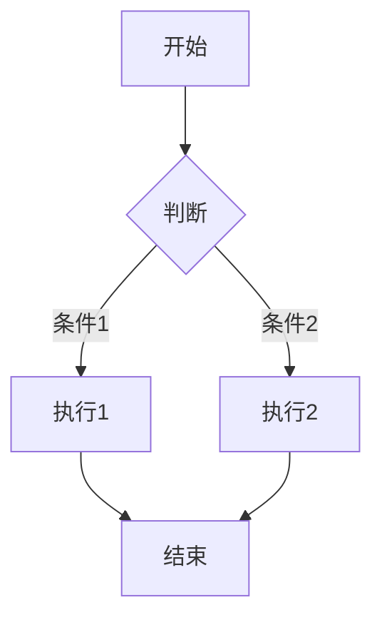

# Obsidian 深度完全指南

> [!NOTE]
> Obsidian 是一款基于本地 Markdown 文件的知识管理工具，以其强大的双向链接能力和灵活的插件生态著称。本文深入解析 Obsidian 的核心功能、OFM 语法、插件生态以及与 AI 的结合使用。

---

## 1. 技术概述与定位

### 1.1 Obsidian 的诞生背景与定位

Obsidian 是由上海独立开发者 Shida Li 和 Ed Lowe 于 2020 年创建的笔记与知识管理工具。与传统的笔记应用不同，Obsidian 将所有内容存储为本地 Markdown 文件，这意味着你的笔记完全属于你自己，不受任何云服务提供商的限制。这种「本地优先」的设计理念在数据隐私意识日益增强的今天显得尤为重要。

Obsidian 的核心定位是「不仅仅是笔记软件」，它更像是一个个人知识管理系统（PKMS）和第二大脑（Second Brain）的构建平台。通过双向链接、图谱视图和插件生态，Obsidian 能够帮助你将碎片化的知识点编织成相互关联的知识网络，最终形成你自己的知识图谱。

### 1.2 Obsidian 的核心优势

**本地存储与数据主权**：Obsidian 将所有笔记存储为标准的 Markdown 文件（`.md`），这意味着你永远拥有自己的数据。即使有一天 Obsidian 停止开发或服务，你的笔记仍然可以继续使用任何文本编辑器打开和编辑。这种开放性是许多专有格式笔记软件无法比拟的。

**双向链接与知识关联**：这是 Obsidian 最核心的特性。当你在一篇笔记中使用 `[[链接]]` 语法链接到另一篇笔记时，Obsidian 不仅在当前笔记中创建了链接，还会在被链接笔记的「反向链接」面板中自动显示这个引用。这种机制让知识之间形成了网状结构，而非孤立的点。

**强大的插件生态**：Obsidian 的插件系统是其生态繁荣的关键。目前社区已经开发了数千款插件，覆盖了日历视图、看板、数据库、时间追踪、AI 集成、PDF 标注、思维导图等方方面面。无论你需要什么功能，几乎都能找到对应的插件来满足。

**图谱可视化**：Obsidian 内置了多种图谱视图，包括全局图谱、本地图谱和画布图谱。全局图谱展示整个保险库的知识网络，本地图谱展示单篇笔记的关联关系，画布图谱则允许你自由布局笔记内容进行视觉化创作。

### 1.3 Obsidian 与其他笔记软件的对比

| 特性 | Obsidian | Notion | Roam Research | Logseq | Apple Notes |
|------|----------|--------|---------------|--------|-------------|
| **存储方式** | 本地 Markdown | 云端专有格式 | 云端专有格式 | 本地 + 同步 | iCloud |
| **双向链接** | 原生支持 | 需要手动 | 原生支持 | 原生支持 | 不支持 |
| **插件生态** | 非常丰富 | 丰富 | 一般 | 较少 | 无 |
| **图谱视图** | 原生支持 | 无 | 有 | 有 | 无 |
| **免费版限制** | 无限制 | 1000 块 | 90 天 | 无限制 | 无限制 |
| **付费版价格** | 约 $25/一次性 | $10/月 | $15/月 | 免费/开源 | 包含在 iCloud |
| **数据导出** | 完整 Markdown | 有限 | 有限 | 完整 | 有限 |
| **离线支持** | 完全离线 | 需要网络 | 需要网络 | 完全离线 | 需要 iCloud |
| **移动端** | iOS/Android | iOS/Android | iOS/Android | iOS/Android | iOS 专属 |

### 1.4 Obsidian 的应用场景

Obsidian 适用于多种使用场景：

1. **个人知识管理（PKM）**：构建个人知识库，整理学习笔记，管理阅读清单
2. **学术研究**：管理研究文献，记录实验数据，梳理研究思路
3. **项目管理**：跟踪项目进度，协调团队任务，整理项目文档
4. **写作创作**：撰写长篇文章、书籍、小说，利用双向链接构建素材库
5. **第二大脑**：作为数字记忆的延伸，将日常灵感、想法、思考结构化存储
6. **学习方法**：整理课程笔记，做题记录，知识点关联与复习
7. **日常生活**：日记记录，健康追踪，旅行规划，财务记录

### 1.5 Obsidian 的技术架构

Obsidian 基于 Electron 框架构建，这使其能够跨平台运行（Windows、macOS、Linux、iOS、Android）。其核心技术架构包括：

- **核心层**：处理 Markdown 解析、文件管理、搜索索引
- **渲染层**：基于 CodeMirror 6 的 Markdown 编辑器
- **插件层**：基于插件 API 的扩展系统
- **同步层**：可选的 Obsidian Sync 或第三方同步服务
- **渲染引擎**：实时预览和阅读模式渲染

```
Obsidian 技术架构:

┌─────────────────────────────────────────────────────────────────┐
│                      Obsidian 客户端                             │
├─────────────────────────────────────────────────────────────────┤
│                                                                  │
│   ┌─────────────────────────────────────────────────────────┐   │
│   │                    用户界面层                             │   │
│   │  ┌─────────┐  ┌─────────┐  ┌─────────┐  ┌─────────┐   │   │
│   │  │ 编辑器  │  │ 侧边栏  │  │ 图表    │  │ 搜索    │   │   │
│   │  └─────────┘  └─────────┘  └─────────┘  └─────────┘   │   │
│   └─────────────────────────────────────────────────────────┘   │
│                              │                                   │
│   ┌─────────────────────────────────────────────────────────┐   │
│   │                    插件系统                              │   │
│   │  ┌──────────┐  ┌──────────┐  ┌──────────┐            │   │
│   │  │ 社区插件 │  │ 核心插件 │  │ 主题     │            │   │
│   │  └──────────┘  └──────────┘  └──────────┘            │   │
│   └─────────────────────────────────────────────────────────┘   │
│                              │                                   │
│   ┌─────────────────────────────────────────────────────────┐   │
│   │                    核心引擎                              │   │
│   │  ┌──────────┐  ┌──────────┐  ┌──────────┐            │   │
│   │  │ Markdown │  │  双向    │  │  文件    │            │   │
│   │  │ 解析器  │  │  链接    │  │  管理    │            │   │
│   │  └──────────┘  └──────────┘  └──────────┘            │   │
│   └─────────────────────────────────────────────────────────┘   │
│                              │                                   │
│   ┌─────────────────────────────────────────────────────────┐   │
│   │                    数据存储                              │   │
│   │  ┌─────────────────────────────────────────────────┐   │   │
│   │  │            本地文件系统 (Markdown)                 │   │   │
│   │  └─────────────────────────────────────────────────┘   │   │
│   └─────────────────────────────────────────────────────────┘   │
│                                                                  │
└─────────────────────────────────────────────────────────────────┘
```

---

## 2. 完整安装与配置

### 2.1 安装 Obsidian

#### 2.1.1 桌面端安装

Obsidian 支持 Windows、macOS 和 Linux 系统：

```bash
# Windows
# 1. 访问 https://obsidian.md/download 下载安装包
# 2. 运行 .exe 安装程序
# 3. 或使用 winget 安装：
winget install Obsidian.Obsidian

# macOS
# 1. 使用 Homebrew 安装：
brew install --cask obsidian

# 2. 或下载 .dmg 文件手动安装

# Linux
# 1. 使用 Flatpak：
flatpak install flathub md.obsidian.Obsidian

# 2. 或使用 Snap：
snap install obsidian --classic

# 3. 或使用 AUR (Arch)：
yay -S obsidian
```

#### 2.1.2 移动端安装

```bash
# iOS
# 在 App Store 搜索 "Obsidian" 并安装

# Android
# 在 Google Play 搜索 "Obsidian" 并安装
# 或使用 F-Droid 获取开源版本
```

### 2.2 初始化保险库

#### 2.2.1 创建新保险库

首次启动 Obsidian 时，会提示你创建或打开一个保险库（Vault）：

1. **创建新保险库**：点击「创建新保险库」，输入名称，选择存储位置
2. **打开已有文件夹**：如果你已经有 Markdown 文件，可以直接打开该文件夹作为保险库
3. **同步已有保险库**：如果你在其他设备上使用过 Obsidian，可以通过同步服务同步保险库

#### 2.2.2 保险库结构建议

一个结构良好的保险库应该包含清晰的目录组织：

```markdown
vault-root/
├── .obsidian/                 # Obsidian 配置目录（不要手动编辑）
│   ├── workspace.json         # 工作区状态
│   ├── plugins.json           # 启用的插件
│   └── appearance.json        # 外观设置
│
├── 01-Daily/                  # 每日笔记
│   └── 2026-04-19.md
│
├── 02-Projects/               # 项目笔记
│   ├── 项目A/
│   │   ├── 项目概述.md
│   │   ├── 任务列表.md
│   │   └── 笔记/
│   └── 项目B/
│
├── 03-Knowledge/              # 知识库
│   ├── 技术/
│   │   ├── 编程语言/
│   │   └── 框架/
│   ├── 人文/
│   │   ├── 历史/
│   │   └── 哲学/
│   └── 科学/
│
├── 04-Resources/              # 资源收集
│   ├── 读书笔记/
│   ├── 课程笔记/
│   └── 网页剪藏/
│
├── 05-Templates/              # 模板
│   ├── daily-template.md
│   ├── project-template.md
│   └── meeting-template.md
│
├── 06-Attachments/            # 附件
│   ├── images/
│   └── files/
│
└── .gitignore                 # Git 忽略文件
```

#### 2.2.3 核心配置

Obsidian 的核心配置通过「设置」→「选项」界面进行，主要配置项包括：

```yaml
# .obsidian/workspace.json (示例)
{
  "main": {
    "paneA": {
      "type": "leaf",
      "state": {
        "type": "markdown",
        "source": false,
        "file": "2026-04-19.md"
      }
    }
  },
  "left": {
    "width": 300,
    "collapsed": false
  }
}

# .obsidian/plugins.json (启用的插件)
{
  "enabledPlugins": [
    "obsidian-plugin",
    "core-plugin"
  ]
}
```

### 2.3 同步配置

#### 2.3.1 Obsidian Sync

Obsidian 提供官方的同步服务，需要付费订阅：

```markdown
# 设置步骤
1. 打开「设置」→「关于」
2. 登录 Obsidian 账户
3. 打开「设置」→「同步」
4. 选择同步服务
5. 配置同步选项
```

#### 2.3.2 iCloud 同步（macOS/iOS）

```markdown
# iCloud 同步配置
1. 将保险库存放在 iCloud Drive 中的文件夹
2. 确保 macOS 和 iOS 设备都登录同一个 iCloud 账户
3. 在两端的 Obsidian 中打开同一保险库
```

#### 2.3.3 Git 同步

```bash
# 在保险库中初始化 Git 仓库
cd /path/to/vault
git init
git add .
git commit -m "Initial commit"

# 添加 .gitignore
echo ".obsidian/workspace" >> .gitignore
echo ".obsidian/plugins.json" >> .gitignore
echo "*.tmp" >> .gitignore
echo "*.log" >> .gitignore

# 推送到远程仓库
git remote add origin https://github.com/username/obsidian-vault.git
git push -u origin main
```

#### 2.3.4 Remotely Save 插件

使用 Remotely Save 插件连接各种同步服务：

```markdown
# 支持的服务
- Obsidian Sync (官方)
- iCloud
- Dropbox
- Google Drive
- OneDrive
- S3/WebDAV
- Git (通过 gitee/github)
```

### 2.4 主题与外观配置

#### 2.4.1 内置主题

Obsidian 提供了几种内置主题：

- **系统**：跟随操作系统设置
- **浅色**：纯白背景
- **深色**：暗色背景
- **月亮**：温暖的暗色主题

#### 2.4.2 社区主题安装

```markdown
# 安装社区主题
1. 打开「设置」→「外观」
2. 点击「管理主题」
3. 搜索并安装喜欢的主题

# 热门主题推荐
- Things (事物主题)
- Minimal (极简风格)
- Sanctum (神圣主题)
- Primrose (报春花主题)
- Shimmering Focus (微光聚焦)
```

---

## 3. 核心概念详解

### 3.1 Obsidian Flavored Markdown (OFM)

Obsidian Flavored Markdown（OFM）是标准 Markdown 的超集，添加了许多专有的语法扩展。

#### 3.1.1 维基链接（Wikilinks）

维基链接是 Obsidian 最核心的语法，用双括号 `[[]]` 表示：

```markdown
<!-- 基本语法 -->
[[笔记标题]]                    # 链接到同目录笔记
[[文件夹/笔记标题]]             # 链接到子目录
[[笔记标题|显示文本]]           # 自定义显示文本
[[笔记标题#章节]]               # 链接到特定章节
[[笔记标题#章节^块ID]]         # 链接到特定块

<!-- 实际示例 -->
今天学习了 [[Python]] 的基础语法
了解更多请参考 [[机器学习/监督学习]]
详情见 [[正则表达式#捕获组]]
代码示例 [[JavaScript#函数^func-example]]

<!-- 链接到笔记的属性 -->
[[笔记标题|display text|display text 2]]
```

#### 3.1.2 嵌入语法

使用 `![[]]` 语法可以嵌入笔记内容：

```markdown
<!-- 嵌入整篇笔记 -->
![[目标笔记]]

<!-- 嵌入特定章节 -->
![[目标笔记#章节标题]]

<!-- 嵌入特定块（需要块 ID） -->
![[目标笔记#^block-id]]

<!-- 嵌入图片 -->
![[image.png]]
![[image.png|200]]            # 设置宽度
![[image.png|400]]            # 设置宽度
![[image.png|alt text|300]]   # alt 文本和宽度

<!-- 嵌入音频 -->
![[audio.mp3]]

<!-- 嵌入视频 -->
![[video.mp4]]

<!-- 嵌入 PDF -->
![[document.pdf]]
![[document.pdf#page=2]]      # 链接到特定页码

<!-- 嵌套嵌入 -->
![[嵌入的笔记#小节]]
```

#### 3.1.3 属性（YAML Frontmatter）

属性提供了笔记的元数据管理能力：

```yaml
---
# 唯一标识符
uid: 20260419-001

# 标签（数组形式）
tags:
  - 教程
  - Obsidian

# 别名（用于搜索和链接）
aliases:
  - Obsidian指南
  - Obsidian教程

# 创建和修改日期
created: 2026-04-19
modified: 2026-04-19
last_modified: 2026-04-19T10:30:00

# 元数据类型
type: post
status: complete
draft: false

# 自定义属性
author: 张三
rating: 5
difficulty: 中等
topics:
  - Markdown
  - 知识管理

# CSS 类（用于自定义样式）
cssclasses:
  - table-flat
  - highlight-heading
---
```

#### 3.1.4 Callout 标注框

Callout 是 Obsidian 0.14+ 引入的强大功能：

```markdown
> [!NOTE] 普通提示
> 这是一个普通提示框

> [!ABSTRACT] 摘要
> 这是摘要内容

> [!INFO] 信息
> 这是信息框

> [!TODO] 待办
> - [ ] 待办事项 1
> - [ ] 待办事项 2

> [!TIP] 技巧提示
> 这是一个使用技巧

> [!SUCCESS] 成功状态
> 操作成功完成

> [!QUESTION] 问题
> 这是一个疑问

> [!WARNING] 警告
> 这是一个警告

> [!FAILURE] 失败
> 操作失败

> [!DANGER] 危险
> 危险警告

> [!BUG] Bug
> 这是一个 Bug

> [!EXAMPLE] 示例
> 这是一个示例

> [!QUOTE] 引用
> 这是一段引用
```

**可折叠的 Callout**：

```markdown
> [!NOTE]+ 可折叠并展开的提示
> 这是展开状态的内容

> [!NOTE]- 折叠状态（点击展开）
> 这是折叠状态的内容

> [!NOTE]+ 点击查看更多
> 第一层内容
> > [!NOTE]+ 嵌套的 Callout
> > 嵌套内容
```

#### 3.1.5 代码块扩展

Obsidian 对代码块进行了多项扩展：

````markdown
```ts title="src/utils/helper.ts"
// 带标题的代码块
function greet(name: string): string {
  return `Hello, ${name}!`;
}
```

```css {2,4-6}
// 带行高亮的代码块
.card {
  padding: 16px;       // 高亮
  margin: 8px;        // 高亮
  background: white;  // 高亮
  border: 1px solid #eee;
  border-radius: 4px; // 高亮
}
```



```dataview
TABLE file.ctime, tags
FROM ""
WHERE contains(tags, "python")
SORT file.ctime DESC
LIMIT 10
```
````

#### 3.1.6 图表支持

Obsidian 原生支持 Mermaid 图表：

```mermaid
%% 流程图
graph TD
    A[开始] --> B{是否继续}
    B -->|是| C[处理中]
    B -->|否| D[结束]
    C --> B

%% 序列图
sequenceDiagram
    participant U as 用户
    participant S as 服务器
    participant D as 数据库
    U->>S: 请求登录
    S->>D: 查询用户
    D-->>S: 返回结果
    S-->>U: 登录成功

%% 甘特图
gantt
    title 项目计划
    dateFormat YYYY-MM-DD
    section 设计
    设计阶段: 2026-04-01, 7d
    section 开发
    开发阶段: 2026-04-08, 14d
    section 测试
    测试阶段: 2026-04-22, 7d
```

### 3.2 双向链接系统

#### 3.2.1 正向链接与反向链接

```markdown
<!-- 在笔记 A.md 中 -->
# 笔记 A

今天我学习了 [[正则表达式]]，特别是捕获组的概念。

<!-- 在正则表达式.md 中 -->
# 正则表达式

正则表达式是一种强大的文本匹配工具。

<!-- 反向链接面板自动显示 -->
"来自：笔记 A"
"今天我学习了正则表达式，特别是捕获组的概念。"
```

#### 3.2.2 链接类型

```markdown
<!-- 内部链接 -->
[[笔记标题]]                    # 内部笔记
[[文件夹/子笔记]]              # 子目录笔记

<!-- 外部链接 -->
[链接文本](https://example.com)

<!-- 块链接 -->
[[笔记#标题^block-id]]         # 链接到特定块
[[笔记#^block-id]]            # 仅块 ID

<!-- 标题链接 -->
[[笔记#章节标题]]              # 链接到特定章节

<!-- 属性链接 -->
[[笔记|display text|display text 2]]
```

#### 3.2.3 未链接引用

未链接引用是一种特殊功能，可以显示提到某个词但未形成链接的笔记：

```markdown
# 笔记 A
今天学习了 Python 编程。

# 笔记 B
Python 是一门流行的语言。

<!-- 在 Python 笔记中，未链接引用会显示笔记 B -->
```

### 3.3 搜索系统

#### 3.3.1 快速切换器

```markdown
# 快捷键：Ctrl/Cmd + O
# 功能：快速跳转到任意笔记
```

#### 3.3.2 搜索面板

```markdown
# 快捷键：Ctrl/Cmd + Shift + F
# 支持的搜索语法：

# 普通搜索
python

# 搜索特定标签
tag:#python

# 搜索特定路径
path:技术/

# 搜索包含多个词
python AND 机器学习

# 搜索精确短语
"exact phrase"

# 正则搜索
regex:/\d{4}-\d{2}-\d{2}/

# 搜索属性
alias:正则表达式

# 组合搜索
tag:#python AND path:机器学习
```

### 3.5 插件生态系统深度解析

#### 3.5.1 核心插件配置详解

Obsidian 的核心插件提供了笔记管理的基础功能，深入理解这些插件的配置可以让你的工作流更加高效。

**日记插件配置**：
日记插件是 Obsidian 最常用的核心插件之一，用于创建和管理每日笔记。

```markdown
# 日记插件配置详解

## 基础配置

日记插件允许你：
- 按日期自动创建笔记
- 使用模板生成日记结构
- 在日历视图中快速导航
- 链接相邻日期

## 模板变量

日记模板支持丰富的变量：

| 变量 | 说明 | 示例输出 |
|------|------|----------|
| {{date}} | 当前日期 | 2026-04-19 |
| {{title}} | 文件标题 | 2026-04-19 |
| {{time}} | 当前时间 | 14:30 |
| {{datetime}} | 日期时间 | 2026-04-19 14:30 |
| {{yesterday}} | 昨天日期 | 2026-04-18 |
| {{tomorrow}} | 明天日期 | 2026-04-20 |
| {{yesterday:YYYY-MM-DD}} | 昨天（指定格式） | 2026-04-18 |
| {{sunday}} | 最近周日 | 2026-04-13 |
| {{monday}} | 最近周一 | 2026-04-14 |
| {{weekday}} | 星期几 | Saturday |
| {{week}} | ISO 周数 | W16 |
```

```markdown
<!-- 日记完整模板 -->
---
uid: {{date}}
created: {{date}}
tags:
  - 日记
aliases:
  - {{date:YYYY-MM-DD}}
---

# {{date:YYYY年MM月DD日}} {{weekday}}

## 今日概览

> 一句话总结今天的主要活动和收获

## 晨间日记

### 今日计划
- [ ] 

### 重要事项
1. 

## 工作记录

### 完成的任务
- [x] 

### 进行中的任务
- [ ] 

### 遇到的问题
> 记录今天遇到的技术问题或业务挑战

## 学习与成长

### 新学习的知识点
- 

### 反思与收获
> 今天最深刻的感悟是什么？

## 生活记录

### 运动
> 今天运动了吗？做了什么运动？持续多长时间？

### 饮食
> 今天吃了什么？感觉如何？

### 社交
> 今天和谁交流了？有什么收获？

## 明日计划

### 待办事项
- [ ] 

### 预约/会议
- 

## 财务记录

### 支出
| 类别 | 金额 | 说明 |
|------|------|------|
| 餐饮 | ¥ | |
| 交通 | ¥ | |
| 购物 | ¥ | |
| 其他 | ¥ | |

### 总计
今日支出：¥

## 灵感与想法

> 今天有什么好的想法或创意？

## 感恩日记

> 今天最想感谢的人或事是什么？

---

## 晚间复盘

### 今日亮点
1. 
2. 

### 可以改进的地方
1. 

### 睡眠时间
入睡时间： | 起床时间：

## 链接

### 今日笔记
- [[]]

### 相关项目
- [[]]

---

*记录于 {{time}}*
```

**模板插件高级配置**：
Templater 插件提供了比内置模板更强大的功能：

```javascript
// Templater 配置
{
  "template_folder": "Templates",
  "enable_cron": true,
  "cron_reminder": {
    "enabled": true,
    "minutes_before": 5,
    "show_popup": true
  },
  "command_timeout": 5000,
  "open_on_startup": []
}
```

```markdown
<!-- 高级模板示例 -->
<%*
// 获取当前日期和时间
const now = tp.date.now("YYYY-MM-DD");
const time = tp.date.now("HH:mm");
const weekNumber = moment().week();
const quarter = Math.ceil((moment().month() + 1) / 3);

// 获取前一个工作日
const prevWorkday = moment().weekday(-2).format("YYYY-MM-DD");

// 获取本周末
const weekend = moment().endOf('week').format("YYYY-MM-DD");

// 获取本月第一天
const monthStart = moment().startOf('month').format("YYYY-MM-DD");

// 获取本月最后一天
const monthEnd = moment().endOf('month').format("YYYY-MM-DD");

// 获取本季度第一天
const quarterStart = moment().startOf('quarter').format("YYYY-MM-DD");

// 获取本季度最后一天
const quarterEnd = moment().endOf('quarter').format("YYYY-MM-DD");

// 问候语
const hour = moment().hour();
let greeting = "早上好";
if (hour >= 12 && hour < 18) {
  greeting = "下午好";
} else if (hour >= 18) {
  greeting = "晚上好";
}

// 获取文件标题
let title = tp.file.title;
if (title === tp.file.title) {
  title = await tp.system.prompt("输入笔记标题：", "默认标题");
}
-%>

---
uid: <% now %>-<% Math.random().toString(36).substring(2, 8) %>
created: <% now %>
modified: <% now %>
type: note
tags:
  - <% tp.date.now("YYYY-MM") %>
  - <% tp.date.now("GGGG-[W]WW") %>  <!-- ISO 周 -->
status: 🟡 进行中
priority: <% await tp.system.suggester(["高", "中", "低"], ["高", "中", "低"]) %>
<% if (tp.file.selection()) { %>
description: "<% tp.file.selection() %>"
<% } %>
---

# <% title %>

<% greeting %>，今天是 **<% tp.date.now("YYYY年MM月DD日") %>**，<% tp.date.now("dddd") %>。

## 元信息

| 属性 | 值 |
|------|-----|
| 创建时间 | <% now %> <% time %> |
| 当前周 | <% weekNumber %> 周 |
| 当前季度 | Q<% quarter %> |
| 上一个工作日 | [[<% prevWorkday %>]] |
| 本周末 | <% weekend %> |

## 内容

### 主要内容

<% await tp.file.cursor() %>

### 详细说明

> 在这里填写详细说明

### 要点

- 要点 1
- 要点 2
- 要点 3

## 相关链接

- [[]]  <!-- 相关笔记 -->
- [[]]  <!-- 相关笔记 -->

## 行动项

- [ ] 待办 1
- [ ] 待办 2

## 备注

> 附加备注信息

---

*创建于 <% time %>*
```

#### 3.5.2 社区插件推荐与配置

**必需插件列表**：

| 插件名称 | 功能描述 | 配置难度 |
|---------|---------|---------|
| Dataview | 类 SQL 查询笔记 | ⭐⭐⭐ |
| Templater | 高级模板系统 | ⭐⭐⭐ |
| QuickAdd | 快速创建笔记 | ⭐⭐ |
| Obsidian Git | Git 版本控制 | ⭐⭐ |
| Remotely Save | 多平台同步 | ⭐⭐ |
| Style Settings | 主题自定义 | ⭐ |

**Dataview 高级查询示例**：

```markdown
<!-- 基础列表查询 -->
```dataview
LIST 
FROM ""
WHERE file.ctime >= date(2026-01-01)
  AND contains(tags, "项目")
SORT file.mtime DESC
LIMIT 10
```
```

```markdown
<!-- 表格查询 -->
```dataview
TABLE 
  file.ctime AS "创建时间",
  file.mtime AS "修改时间",
  tags AS "标签",
  status AS "状态",
  priority AS "优先级"
FROM ""
WHERE type = "note"
  AND !file.path.includes("模板")
SORT file.mtime DESC
LIMIT 20
```
```

```markdown
<!-- 任务查询 -->
```dataview
TASK
FROM ""
WHERE !completed
  AND due <= date(today)
GROUP BY file.link
```
```

```markdown
<!-- 复杂聚合查询 -->
```dataview
TABLE WITHOUT ID
  file.link AS "文件",
  length(filter(rows, (r) => r.completed)) AS "已完成",
  length(filter(rows, (r) => !r.completed)) AS "未完成",
  length(rows) AS "总计",
  round(length(filter(rows, (r) => r.completed)) / length(rows) * 100) + "%" AS "完成率"
FROM ""
WHERE contains(tags, "任务")
FLATTEN file.tasks AS task
GROUP BY file.link
SORT 完成率 DESC
```
```

```markdown
<!-- 统计查询 -->
```dataview
TABLE WITHOUT ID
  "<% tp.date.now("YYYY-MM") %>" AS "月份",
  length(rows) AS "笔记数量",
  length(filter(rows, (r) => r.type = "日记")) AS "日记数量",
  length(filter(rows, (r) => contains(r.tags, "项目"))) AS "项目数量",
  length(filter(rows, (r) => r.type = "文章")) AS "文章数量"
FROM ""
WHERE file.cday >= date(2026-04-01)
  AND file.cday < date(2026-05-01)
GROUP BY true
```
```

```markdown
<!-- 日历视图 -->
```dataview
CALENDAR file.ctime
FROM ""
WHERE file.cday >= date(2026-01-01)
  AND file.cday <= date(2026-12-31)
GROUP BY file.cday
```
```

```markdown
<!-- 按标签分组 -->
```dataview
LIST rows.file.link
FROM ""
WHERE length(file.tags) > 0
FLATTEN file.tags AS tag
WHERE !startswith(tag, "obsidian")
GROUP BY tag
SORT rows.length DESC
LIMIT 20
```
```

```markdown
<!-- 搜索并显示上下文 -->
```dataview
LIST item.text
FROM ""
WHERE contains(file.content, "重要")
FLATTEN file.lists AS item
WHERE contains(item.text, "重要")
SORT item.checked ASC
```
```

**QuickAdd 高级配置**：

```javascript
// QuickAdd 设置脚本示例

// 1. 每日回顾模板
const createDailyReview = async () => {
  const today = tp.date.now("YYYY-MM-DD");
  const yesterday = tp.date.subtract(1, "day").format("YYYY-MM-DD");
  
  const content = `---
uid: ${today}-review
type: review
date: ${today}
tags:
  - 每日回顾
---

# ${today} 每日回顾

## 昨日完成

\`\`\`dataview
TASK
FROM ""
WHERE completed
  AND completion = date(${yesterday})
\`\`\`

## 今日计划

\`\`\`dataview
TASK
FROM ""
WHERE !completed
  AND due <= date(${today})
\`\`\`

## 反思

> 从昨天的工作中学到了什么？

## 能量状态

- 睡眠质量：
- 运动：
- 饮食：
- 心情：

`;

  await app.vault.create(`${today}-daily-review.md`, content);
};

// 2. 项目创建模板
const createProject = async () => {
  const name = await tp.system.prompt("项目名称：");
  const type = await tp.system.suggester(["个人项目", "工作项目", "学习项目"], ["personal", "work", "study"]);
  const status = await tp.system.suggester(["🟡 进行中", "🟢 已完成", "🔴 已搁置"], ["active", "completed", "paused"]);
  
  const today = tp.date.now("YYYY-MM-DD");
  const content = `---
uid: ${today}-project-${name.slug()}
type: project
project: ${name}
status: ${status}
priority: 🟡 中
created: ${today}
due:
members: []
tags:
  - 项目
  - ${type}
---

# ${name}

## 项目概述

> 一句话描述项目目标和价值

## 目标与关键结果

### 目标 1 (Objective)
- [ ] KR 1.1
- [ ] KR 1.2
- [ ] KR 1.3

### 目标 2 (Objective)
- [ ] KR 2.1
- [ ] KR 2.2

## 里程碑

- [ ] 里程碑 1
- [ ] 里程碑 2
- [ ] 里程碑 3

## 任务列表

\`\`\`dataview
TASK
FROM ""
WHERE contains(project, "${name}")
SORT file.name
\`\`\`

## 资源

### 文档
- [[]]

### 链接
- 

### 文件

## 团队成员

| 姓名 | 角色 | 职责 |
|------|------|------|
|  | 负责人 | |

## 进度日志

### ${today}
- 

## 风险与依赖

### 风险
- 🔴 
- 🟡 

### 依赖
- 

## 相关笔记

- [[]]

## 会议记录

- [[]]

`;

  await app.vault.create(`Projects/${name}/${name}.md`, content);
};

// 导出函数
module.exports = { createDailyReview, createProject };
```

#### 3.5.3 插件开发入门

如果你需要特定功能，可以自己开发插件：

```javascript
// plugin/index.js - 简单插件示例
module.exports = class MyPlugin {
  constructor(app) {
    this.app = app;
    this.manifest = {
      id: 'my-custom-plugin',
      name: 'My Custom Plugin',
      version: '1.0.0',
      description: 'A custom plugin for Obsidian',
      author: 'Your Name',
    };
  }

  async onload() {
    console.log('Loading my custom plugin...');
    
    // 添加命令
    this.addCommand();
    
    // 添加设置选项卡
    this.addSettingTab();
    
    // 注册事件处理器
    this.registerEventHandlers();
    
    // 添加状态栏元素
    this.addStatusBar();
  }

  onunload() {
    console.log('Unloading my custom plugin...');
  }

  addCommand() {
    // 添加命令到命令面板
    this.addCommand({
      id: 'my-plugin-command',
      name: 'Run My Plugin Command',
      callback: () => {
        this.runCommand();
      },
      hotkeys: [
        {
          modifiers: ['Mod', 'Shift'],
          key: 'M',
        },
      ],
    });
  }

  async runCommand() {
    const activeFile = this.app.workspace.getActiveFile();
    if (activeFile) {
      const content = await this.app.vault.read(activeFile);
      new Notice(`Active file: ${activeFile.name}\nWord count: ${content.split(/\s+/).length}`);
    }
  }

  addSettingTab() {
    this.addSettingTab(new MyPluginSettingsTab(this.app, this));
  }

  registerEventHandlers() {
    // 文件创建事件
    this.registerEvent(
      this.app.vault.on('create', (file) => {
        console.log('File created:', file.name);
      })
    );

    // 文件修改事件
    this.registerEvent(
      this.app.vault.on('modify', (file) => {
        console.log('File modified:', file.name);
      })
    );

    // 文件删除事件
    this.registerEvent(
      this.app.vault.on('delete', (file) => {
        console.log('File deleted:', file.name);
      })
    );

    // 活动窗格改变事件
    this.registerEvent(
      this.app.workspace.on('active-leaf-change', (leaf) => {
        if (leaf) {
          console.log('Active file changed:', leaf.title);
        }
      })
    );
  }

  addStatusBar() {
    this.statusBarItem = this.addStatusBarItem();
    this.statusBarItem.setText('My Plugin Active');
  }
};

// 设置选项卡类
class MyPluginSettingsTab extends PluginSettingTab {
  constructor(app, plugin) {
    super(app, plugin);
    this.plugin = plugin;
  }

  display() {
    const { containerEl } = this;
    containerEl.empty();

    new Setting(containerEl)
      .setName('Setting Name')
      .setDesc('Setting description')
      .addText((text) =>
        text
          .setPlaceholder('Enter value')
          .setValue(this.plugin.settings.settingName || '')
          .onChange(async (value) => {
            this.plugin.settings.settingName = value;
            await this.plugin.saveSettings();
          })
      );

    new Setting(containerEl)
      .setName('Toggle Setting')
      .addToggle((toggle) =>
        toggle
          .setValue(this.plugin.settings.toggleSetting || false)
          .onChange(async (value) => {
            this.plugin.settings.toggleSetting = value;
            await this.plugin.saveSettings();
          })
      );
  }
}
```

### 3.6 高级使用技巧

#### 3.6.1 工作流自动化

```markdown
# Obsidian 工作流自动化指南

## 自动任务处理

使用 DataviewJS 和 Templater 实现自动化任务管理：

\`\`\`dataviewjs
// 获取所有未完成任务
const incompleteTasks = dv.pages()
  .flatMap(page => {
    if (page.file.tasks) {
      return page.file.tasks
        .filter(t => !t.completed)
        .map(t => ({
          text: t.text,
          file: page.file.link,
          due: t.due,
          status: t.checked ? '✅' : '⬜',
        }));
    }
    return [];
  })
  .sort((a, b) => {
    if (a.due && b.due) {
      return new Date(a.due) - new Date(b.due);
    }
    return 0;
  });

dv.table(
  ["状态", "任务", "所属笔记", "截止日期"],
  incompleteTasks.slice(0, 10)
);
\`\`\`

## 自动项目追踪

\`\`\`dataviewjs
// 统计各状态项目
const projects = dv.pages()
  .where(p => p.type === 'project')
  .groupBy(p => p.status);

const summary = projects.map(g => [
  g.key,
  g.rows.length,
  g.rows.map(r => r.file.link).join(', ')
]);

dv.table(
  ["状态", "数量", "项目"],
  summary
);
\`\`\`

## 每日统计自动化

\`\`\`dataviewjs
// 计算今日统计数据
const today = dv.date('today');
const thisMonth = dv.pages()
  .where(p => p.file.cday?.month === today.month)
  .where(p => p.file.cday?.year === today.year);

// 创建笔记数
const notesCreated = thisMonth.filter(p => 
  p.file.cday?.toISODate() === today.toISODate()
);

// 总字数统计
let totalWords = 0;
for (const page of thisMonth) {
  const content = await dv.io.load(page.file.path);
  totalWords += content.split(/\s+/).length;
}

dv.paragraph(`
📊 **今日统计**

- 新建笔记：${notesCreated.length}
- 本月笔记：${thisMonth.length}
- 总字数：${totalWords.toLocaleString()}
\`\`\`);
\`\`\`
```

#### 3.6.2 快捷命令组合

```markdown
# 常用快捷命令组合

## 导航快捷键

| 快捷键 | 功能 |
|--------|------|
| Ctrl/Cmd + O | 快速切换器 |
| Ctrl/Cmd + P | 命令面板 |
| Ctrl/Cmd + K | 插入内部链接 |
| Ctrl/Cmd + Shift + F | 全局搜索 |
| Ctrl/Cmd + E | 切换编辑/预览 |
| Ctrl/Cmd + Tab | 切换标签页 |
| Ctrl/Cmd + B | 显示/隐藏侧边栏 |
| Ctrl/Cmd + ; | 显示/隐藏右侧栏 |

## 编辑快捷键

| 快捷键 | 功能 |
|--------|------|
| Ctrl/Cmd + D | 选择相同词 |
| Ctrl/Cmd + Shift + D | 复制选中行 |
| Ctrl/Cmd + / | 切换行注释 |
| Ctrl/Cmd + Home | 跳到文件开头 |
| Ctrl/Cmd + End | 跳到文件结尾 |
| Alt + 上/下 | 移动行 |
| Alt + Shift + 上/下 | 复制行 |

## 格式化快捷键

| 快捷键 | 功能 |
|--------|------|
| Ctrl/Cmd + B | 粗体 |
| Ctrl/Cmd + I | 斜体 |
| Ctrl/Cmd + H | 高亮 |
| Ctrl/Cmd + J | 跳转到链接 |
| ==文字== | 高亮文本 |
| ~~文字~~ | 删除线 |
| \`代码\` | 行内代码 |
```

#### 3.6.3 图谱可视化技巧

```markdown
# 图谱可视化高级技巧

## 全局图谱配置

在设置中调整图谱显示：

\`\`\`javascript
// 图谱设置配置
const graphConfig = {
  // 节点大小
  nodeSize: "links",  // "links" | "size"
  
  // 标签显示
  showTags: true,
  showAllAttachments: false,
  showAllLinks: true,
  
  // 颜色配置
  colorOptions: {
    nodes: {
      byGroup: true,
      byTag: false,
    },
    links: {
      byConnectionType: true,
    },
  },
  
  // 力学模拟
  physics: {
    enabled: true,
    solver: "forceAtlas2",
    forceAtlas2Settings: {
      gravity: 1,
      scaling: 1,
      strongGravityMode: true,
      barnesHutOptimize: true,
    },
  },
};
\`\`\`

## 图谱筛选技巧

使用搜索语法筛选图谱：

\`\`\`
# 显示特定标签的笔记
tag:#编程

# 显示特定路径下的笔记
path:技术/

# 显示双向链接最多的笔记
links:>=5

# 显示最近修改的笔记
modified:>=2026-04-01
\`\`\`

## 自定义图谱视图

使用插件创建自定义视图：

- **Graph Views**: 提供多个图谱视图
- **Force Directed Graph**: 交互式力导向图
- **Obsidian Pivot**: 枢轴分析视图
```
```

### 3.7 高级自定义

#### 3.7.1 CSS 片段进阶

```css
/* 高级 CSS 片段 */

/* 1. 暗色主题增强 */
.theme-dark {
  /* 改进编辑器背景 */
  --background-primary: #1a1a2e;
  --background-secondary: #16213e;
  --background-modifier-border: #2d3a4f;
  
  /* 改进文本颜色 */
  --text-normal: #e4e4e7;
  --text-muted: #a1a1aa;
  --text-faint: #71717a;
  
  /* 改进链接颜色 */
  --text-accent: #60a5fa;
  --text-accent-hover: #93c5fd;
}

/* 2. 语法高亮自定义 */
.cm-s-obsidian {
  .cm-header {
    color: #f472b6 !important;
    font-weight: 600;
  }
  
  .cm-strong {
    color: #fb923c;
    font-weight: 700;
  }
  
  .cm-em {
    color: #a78bfa;
    font-style: italic;
  }
  
  .cm-link {
    color: #34d399;
    text-decoration: underline;
  }
  
  .cm-url {
    color: #22d3ee;
  }
  
  .cm-code {
    background-color: rgba(99, 102, 241, 0.2);
    border-radius: 4px;
    padding: 2px 4px;
  }
}

/* 3. Callout 样式自定义 */
.callout {
  border-radius: 12px;
  border-left-width: 4px;
  
  &[data-type="note"] {
    background: linear-gradient(135deg, rgba(59, 130, 246, 0.1), rgba(59, 130, 246, 0.05));
    border-color: #3b82f6;
  }
  
  &[data-type="warning"] {
    background: linear-gradient(135deg, rgba(245, 158, 11, 0.1), rgba(245, 158, 11, 0.05));
    border-color: #f59e0b;
  }
  
  &[data-type="danger"] {
    background: linear-gradient(135deg, rgba(239, 68, 68, 0.1), rgba(239, 68, 68, 0.05));
    border-color: #ef4444;
  }
  
  &[data-type="success"] {
    background: linear-gradient(135deg, rgba(34, 197, 94, 0.1), rgba(34, 197, 94, 0.05));
    border-color: #22c55e;
  }
}

/* 4. 表格样式增强 */
.markdown-preview-view,
.markdown-source-view {
  table {
    border-collapse: separate;
    border-spacing: 0;
    width: 100%;
    margin: 1.5em 0;
    
    th, td {
      border: 1px solid var(--background-modifier-border);
      padding: 0.75em 1em;
      text-align: left;
    }
    
    th {
      background: var(--background-secondary);
      font-weight: 600;
      position: sticky;
      top: 0;
    }
    
    tr:hover td {
      background: var(--background-modifier-hover);
    }
    
    tr:first-child td:first-child { border-radius: 8px 0 0 0; }
    tr:first-child td:last-child { border-radius: 0 8px 0 0; }
    tr:last-child td:first-child { border-radius: 0 0 0 8px; }
    tr:last-child td:last-child { border-radius: 0 0 8px 0; }
  }
}

/* 5. 滚动条美化 */
::-webkit-scrollbar {
  width: 8px;
  height: 8px;
}

::-webkit-scrollbar-track {
  background: transparent;
}

::-webkit-scrollbar-thumb {
  background: var(--background-modifier-border);
  border-radius: 4px;
  
  &:hover {
    background: var(--text-muted);
  }
}

/* 6. 编辑器增强 */
.markdown-source-view {
  font-family: 'JetBrains Mono', 'Fira Code', monospace;
  font-size: 15px;
  line-height: 1.7;
  
  .cm-content {
    padding: 20px 0;
  }
  
  .cm-line {
    padding: 0 16px;
  }
  
  .cm-active-line {
    background-color: rgba(59, 130, 246, 0.1);
  }
  
  .cm-selectionBackground {
    background-color: rgba(59, 130, 246, 0.3) !important;
  }
}

/* 7. 代码块增强 */
.markdown-preview-view pre {
  border-radius: 12px;
  padding: 1.25em;
  margin: 1.5em 0;
  position: relative;
  overflow: hidden;
  
  &::before {
    content: '';
    position: absolute;
    top: 0;
    left: 0;
    right: 0;
    height: 3px;
    background: linear-gradient(90deg, #f472b6, #a78bfa, #60a5fa);
  }
  
  code {
    font-family: 'JetBrains Mono', monospace;
    font-size: 0.9em;
    line-height: 1.6;
  }
}

/* 8. 进度条样式 */
.progress-bar {
  display: flex;
  height: 8px;
  overflow: hidden;
  background-color: var(--background-modifier-border);
  border-radius: 4px;
  
  .progress {
    display: flex;
    flex-direction: column;
    justify-content: center;
    background-color: var(--text-accent);
    transition: width 0.3s ease;
    
    &::after {
      content: '';
      position: absolute;
      inset: 0;
      background: linear-gradient(
        90deg,
        transparent 0%,
        rgba(255, 255, 255, 0.2) 50%,
        transparent 100%
      );
      animation: shimmer 2s infinite;
    }
  }
}

@keyframes shimmer {
  0% { transform: translateX(-100%); }
  100% { transform: translateX(100%); }
}
```

#### 3.7.2 主题创建基础

```css
/* obsidian-theme.css - 自定义主题基础 */

/* 1. 主题变量定义 */
:root {
  /* 基础颜色 */
  --color-1: #f472b6;
  --color-2: #a78bfa;
  --color-3: #60a5fa;
  --color-4: #34d399;
  --color-5: #fbbf24;
  
  /* 语义颜色 */
  --accent-color: var(--color-3);
  --accent-color-hover: #93c5fd;
  
  /* 背景层级 */
  --bg-1: #ffffff;
  --bg-2: #f8fafc;
  --bg-3: #f1f5f9;
  --bg-4: #e2e8f0;
  
  /* 文字层级 */
  --text-1: #0f172a;
  --text-2: #334155;
  --text-3: #64748b;
  --text-4: #94a3b8;
  
  /* 边框颜色 */
  --border-1: #e2e8f0;
  --border-2: #cbd5e1;
  
  /* 阴影 */
  --shadow-sm: 0 1px 2px rgba(0, 0, 0, 0.05);
  --shadow-md: 0 4px 6px -1px rgba(0, 0, 0, 0.1);
  --shadow-lg: 0 10px 15px -3px rgba(0, 0, 0, 0.1);
  
  /* 圆角 */
  --radius-sm: 4px;
  --radius-md: 8px;
  --radius-lg: 12px;
  --radius-full: 9999px;
}

/* 暗色主题 */
.theme-dark {
  --color-1: #f472b6;
  --color-2: #c084fc;
  --color-3: #60a5fa;
  --color-4: #34d399;
  --color-5: #fbbf24;
  
  --accent-color: var(--color-3);
  --accent-color-hover: #93c5fd;
  
  --bg-1: #0f172a;
  --bg-2: #1e293b;
  --bg-3: #334155;
  --bg-4: #475569;
  
  --text-1: #f8fafc;
  --text-2: #e2e8f0;
  --text-3: #94a3b8;
  --text-4: #64748b;
  
  --border-1: #334155;
  --border-2: #475569;
  
  --shadow-sm: 0 1px 2px rgba(0, 0, 0, 0.3);
  --shadow-md: 0 4px 6px -1px rgba(0, 0, 0, 0.4);
  --shadow-lg: 0 10px 15px -3px rgba(0, 0, 0, 0.5);
}

/* 2. 应用变量到组件 */
body {
  background-color: var(--bg-1);
  color: var(--text-1);
  font-family: -apple-system, BlinkMacSystemFont, 'Segoe UI', Roboto, sans-serif;
}

.workspace {
  background-color: var(--bg-2);
}

.sidebar {
  background-color: var(--bg-1);
  border-right: 1px solid var(--border-1);
}

.titlebar {
  background-color: var(--bg-1);
  border-bottom: 1px solid var(--border-1);
}

/* 3. 交互状态 */
.clickable-icon:hover,
button:hover {
  background-color: var(--bg-3);
}

.nav-file:hover,
.nav-folder:hover {
  background-color: var(--bg-2);
}

/* 4. 焦点状态 */
:focus-visible {
  outline: 2px solid var(--accent-color);
  outline-offset: 2px;
}

/* 5. 过渡动画 */
* {
  transition-property: background-color, border-color, color, fill, stroke;
  transition-duration: 150ms;
  transition-timing-function: ease;
}
```

---

## 4. 常用命令与操作

### 4.1 快捷键

#### 4.1.1 导航快捷键

| 功能 | Windows/Linux | macOS |
|------|--------------|-------|
| 快速切换 | Ctrl + O | Cmd + O |
| 搜索 | Ctrl + Shift + F | Cmd + Shift + F |
| 打开命令面板 | Ctrl + P | Cmd + P |
| 返回 | Ctrl + [ | Cmd + [ |
| 前进 | Ctrl + ] | Cmd + ] |
| 切换侧边栏 | Ctrl + B | Cmd + B |
| 切换右侧栏 | Ctrl + ; | Cmd + ; |
| 全局搜索 | Ctrl + K | Cmd + K |

#### 4.1.2 编辑快捷键

| 功能 | Windows/Linux | macOS |
|------|--------------|-------|
| 粗体 | Ctrl + B | Cmd + B |
| 斜体 | Ctrl + I | Cmd + I |
| 代码 | Ctrl + E | Cmd + E |
| 链接 | Ctrl + K | Cmd + K |
| 创建内部链接 | [[ | [[ |
| 切换预览 | Ctrl + / | Cmd + / |
| 缩进 | Tab | Tab |
| 取消缩进 | Shift + Tab | Shift + Tab |
| 插入模板 | Ctrl + T | Cmd + T |
| 单词高亮 | == | == |

#### 4.1.3 格式化快捷键

```markdown
# 标题
Ctrl/Cmd + 1-6  →  一级标题到六级标题

# 列表
Ctrl/Cmd + Shift + 1  →  有序列表
Ctrl/Cmd + Shift + 2  →  无序列表
Ctrl/Cmd + Shift + 6  →  任务列表

# 引用
Ctrl/Cmd + Shift + 5  →  引用块
```

### 4.2 命令面板

命令面板是 Obsidian 的核心功能之一：

```markdown
# 打开命令面板
Ctrl/Cmd + P

# 常用命令
- 新建笔记: Create new note
- 删除笔记: Delete current note
- 切换视图: Toggle preview/edit mode
- 打开设置: Open settings
- 同步保险库: Sync vault
- 切换主题: Toggle theme
- 重命名笔记: Rename current file
- 移动笔记: Move current file
```

### 4.3 模板系统

#### 4.3.1 内置模板

Obsidian 支持使用模板创建新笔记：

```markdown
<!-- 每日笔记模板 -->
---
uid: {{date}}
created: {{date}}
tags:
  - 日记
---

# {{title}}

## 今日概要


## 完成的任务
- [ ]

## 未完成的任务


## 明日计划


## 灵感记录


## 反思


## 链接
- [[]]

---

<!-- 项目笔记模板 -->
---
uid: {{date}}
created: {{date}}
project: {{title}}
status: 🟡 进行中
priority: 高
tags:
  - 项目
---

# {{title}}

## 项目概述


## 目标
- [ ]

## 关键结果


## 里程碑
- [ ] 里程碑1
- [ ] 里程碑2

## 资源
- [[]]

## 团队成员


## 相关笔记
- [[]]
- [[]]

## 进度日志

### {{date}}
- 
```

#### 4.3.2 Templater 插件

Templater 是高级模板插件，提供更强大的模板功能：

```javascript
<%*
const title = tp.file.title;
const date = tp.date.now("YYYY-MM-DD");
const time = tp.date.now("HH:mm");
const datetime = tp.date.now("YYYY-MM-DD HH:mm:ss");
-%>
---
uid: <% date %>-<% Math.random().toString(36).substring(2, 8) %>
created: <% date %>
tags: []
---

# <% title %>

## 笔记概要


## 核心内容

### 要点1


### 要点2


## 相关概念
- [[]]
- [[]]

## 行动项
- [ ]

## 参考资料

> [!cite] 参考来源
> 
```

---

## 5. 高级配置与技巧

### 5.1 核心插件配置

#### 5.1.1 每日笔记

```markdown
# 每日笔记配置
设置 → 核心插件 → 每日笔记

配置选项：
- 新建位置：指定每日笔记存放目录
- 格式：日期格式（如 YYYY-MM-DD）
- 模板：选择使用的模板文件
```

#### 5.1.2 模板

```markdown
# 模板配置
设置 → 核心插件 → 模板

配置选项：
- 模板文件夹位置
- 插入日期格式
- 插入时间格式
```

#### 5.1.3 工作区

```markdown
# 工作区配置
设置 → 外观

- 窗口背景色
- 侧边栏宽度
- 字体设置
- 行高设置
```

### 5.2 高级搜索语法

```markdown
# 搜索语法详解

# 基础搜索
python                          # 搜索包含 "python" 的笔记

# 标签搜索
tag:#python                    # 搜索带有 #python 标签
tag:#技术/编程                 # 搜索子标签

# 路径搜索
path:技术/                     # 搜索特定路径
folder:技术                    # 搜索特定文件夹

# 属性搜索
alias:正则表达式              # 搜索别名
-created:2026-04              # 创建于 2026 年 4 月
modified:2026-04-19            # 修改于特定日期

# 逻辑组合
python AND 机器学习           # 同时包含两者
python OR javascript          # 包含任一词
NOT python                     # 不包含 python

# 正则表达式
regex:/\d{4}-\d{2}/           # 匹配日期格式

# 搜索内容类型
type:image                    # 搜索图片
type:audio                    # 搜索音频
type:video                    # 搜索视频

# 组合查询
tag:#学习 AND path:技术/ AND created:2026-04
```

### 5.3 高级链接技巧

```markdown
# 隐藏链接（不出现在反向链接面板）
[[笔记| ]]

# 自动生成链接文本
[[#标题]]                      # 使用标题作为链接文本

# 链接到嵌入内容
![[笔记#标题]]

# 条件链接（使用 DataviewJS）
```dataviewjs
dv.list(dv.pages().where(p => p.tags.includes("python"))
  .map(p => dv.fileLink(p.file.name)))
```
```

### 5.4 自定义样式

#### 5.4.1 片段（Snippets）

```css
/* 自定义 CSS 片段 */

/* 修改编辑器字体 */
.markdown-source-view {
  font-family: 'JetBrains Mono', monospace;
  font-size: 15px;
}

/* 修改预览字体 */
.markdown-preview-view {
  font-family: 'Inter', sans-serif;
  font-size: 16px;
  line-height: 1.7;
}

/* 代码块样式 */
.markdown-preview-view pre {
  border-radius: 8px;
  padding: 16px;
  background: #1e1e1e;
}

/* Callout 样式 */
.callout {
  border-radius: 8px;
  border-left-width: 4px;
}

/* 表格样式 */
table {
  width: 100%;
  border-collapse: collapse;
}

th, td {
  border: 1px solid #e2e8f0;
  padding: 8px 12px;
}

th {
  background: #f8fafc;
  font-weight: 600;
}

/* 任务列表样式 */
.task-list-item {
  list-style: none;
}

.task-list-item input[type="checkbox"] {
  margin-right: 8px;
}
```

#### 5.4.2 主题自定义

```css
/* 主题变量覆盖 */
:root {
  --text-accent: #3b82f6;
  --background-primary: #ffffff;
  --background-secondary: #f8fafc;
  --background-modifier-border: #e2e8f0;
  --text-normal: #1e293b;
  --text-muted: #64748b;
}
```

### 5.5 高级插件配置

#### 5.5.1 Dataview 查询

```markdown
# 基础查询
```dataview
TABLE file.ctime, tags
FROM ""
WHERE contains(tags, "python")
SORT file.ctime DESC
```

# 复杂查询
```dataview
LIST
FROM ""
WHERE file.ctime >= date(2026-01-01)
  AND file.mtime <= date(today)
  AND contains(tags, "项目")
FLATTEN file.etags AS tag
WHERE startswith(tag, "状态/")
GROUP BY tag
```

# 任务查询
```dataview
TASK
FROM ""
WHERE !completed
  AND due <= date(today)
```

# 统计查询
```dataview
TABLE WITHOUT ID
  length(filter(rows, (r) => true)) AS 总数,
  length(filter(rows, (r) => r.completed)) AS 已完成,
  length(filter(rows, (r) => !r.completed)) AS 未完成
FROM ""
GROUP BY true
```
```

#### 5.5.2 Templater 高级用法

```javascript
<%* 
// 动态创建笔记
const filename = await tp.system.prompt("输入文件名:");
const folder = tp.file.find_tfile("模板笔记");
const content = await app.vault.read(folder);
await app.vault.create(filename + ".md", content);

// 条件逻辑
const isImportant = tp.frontmatter.tags?.includes("重要");
if (isImportant) {
  tR += "\n> [!IMPORTANT]\n> 这是重要笔记";
}

// 文件操作
const targetFile = tp.file.find_tfile("目标笔记");
const content = await app.vault.read(targetFile);
tR += "\n\n" + content;
-%>
```

---

## 6. 与同类技术对比

### 6.1 笔记软件对比

| 软件 | 定位 | 存储 | 链接 | 插件 | 价格 |
|------|------|------|------|------|------|
| Obsidian | PKMS | 本地 Markdown | 双向 | 数千 | 免费/约$25 |
| Notion | 协作工作区 | 云端 | 单向 | 丰富 | 免费/约$10/月 |
| Roam | PKMS | 云端 | 双向 | 有限 | $15/月 |
| Logseq | PKMS | 本地 | 双向 | 较少 | 免费 |
| Apple Notes | 笔记 | iCloud | 无 | 无 | 免费 |
| Bear | 笔记 | 本地 | 有限 | 一般 | 免费/约$15/年 |
| Notability | 手写 | iCloud | 无 | 有限 | $13/年 |
| GoodNotes | 手写 | 本地/云端 | 无 | 有限 | $8/永久 |

### 6.2 Obsidian 的独特优势

**数据主权**：Obsidian 的 Markdown 文件格式意味着你完全拥有自己的数据。相比之下，Notion 和 Roam 的数据存储在服务商的服务器上，如果服务关闭或账号被封，数据可能面临风险。

**隐私保护**：所有数据都存储在本地，不经过云端处理（除非你使用同步服务）。对于注重隐私的用户来说，这是一个重要优势。

**长期可维护性**：Markdown 是通用格式，即使 Obsidian 停止开发，你的笔记仍然可以被任何文本编辑器打开和处理。

**插件生态的广度**：Obsidian 拥有最丰富的插件生态，可以满足各种个性化需求。

### 6.3 选型建议

```
笔记软件选型决策树:

需要本地存储和数据主权吗？
│
├─ 是 → 需要双向链接功能吗？
│        ├─ 是 → Obsidian / Logseq
│        │         │
│        │         ├─ 需要丰富的插件 → Obsidian
│        │         └─ 喜欢开源免费 → Logseq
│        │
│        └─ 否 → 需要手写功能吗？
│                 ├─ 是 → GoodNotes / Notability
│                 └─ 否 → Apple Notes / Bear
│
└─ 否 → 需要团队协作功能吗？
         ├─ 是 → Notion / Notion
         │
         └─ 否 → 预算有限吗？
                  ├─ 是 → Obsidian (免费功能丰富)
                  │
                  └─ 否 → Notion (协作功能强)
```

### 6.4 Obsidian 的局限性

**学习曲线**：Obsidian 的功能非常丰富，但也意味着需要一定的学习成本。特别是对于不熟悉 Markdown 的用户，可能需要时间适应。

**同步复杂性**：虽然本地存储是优势，但也意味着同步需要额外配置。相比之下，Notion 等云端软件提供了开箱即用的同步体验。

**移动端体验**：Obsidian 的移动端应用相比桌面端功能有限，部分插件在移动端不可用。

**无内置协作**：Obsidian 主要是个人工具，没有内置的实时协作功能。如果需要团队协作，可能需要配合第三方工具使用。

---

## 7. 常见问题与解决方案

### 7.1 性能问题

#### 7.1.1 保险库过大导致卡顿

**问题**：随着笔记数量增加，Obsidian 变得卡顿。

**解决方案**：

```markdown
# 优化方法

1. 限制图谱显示数量
   设置 → 图表 → 限制节点数量

2. 禁用不必要的插件
   设置 → 社区插件 → 禁用不常用的插件

3. 定期清理未使用的附件
   使用 "Local REST API" 插件扫描未使用文件

4. 拆分大型保险库
   将保险库拆分为多个子保险库
   使用 "Obsidian Git" 或其他同步方案

5. 优化搜索索引
   设置 → 核心插件 → 搜索 → 重建索引
```

#### 7.1.2 搜索响应慢

**问题**：搜索结果加载缓慢。

**解决方案**：

```markdown
# 优化方法

1. 减少同时搜索的范围
   使用路径限定搜索

2. 清理搜索历史
   设置 → 核心插件 → 搜索 → 清除搜索历史

3. 压缩保险库（减少文件数量）
   合并相似的笔记

4. 定期归档旧笔记
   将不常用的笔记移动到归档目录
```

### 7.2 数据问题

#### 7.2.1 误删笔记恢复

**问题**：不小心删除了重要笔记。

**解决方案**：

```markdown
# 恢复方法

1. 检查系统回收站
   文件被删除后会进入系统回收站

2. 使用版本控制
   如果使用 Git 插件，可以从 git 历史恢复
   git log
   git checkout <commit-hash> -- "path/to/deleted.md"

3. 检查 Time Machine / 备份
   macOS Time Machine
   Windows 文件历史记录

4. 启用自动备份
   设置 → 核心插件 → 文件恢复
```

#### 7.2.2 链接断裂

**问题**：移动或重命名笔记后链接断裂。

**解决方案**：

```markdown
# 解决方法

1. 使用 Obsidian 的别名功能
   在笔记 frontmatter 中添加多个别名
   aliases:
     - 原名称
     - 常用缩写

2. 定期检查断链
   使用 "Quick Explorer" 或其他插件检查断链

3. 使用 Dataview 查找孤立笔记
   ```dataview
   LIST
   FROM ""
   WHERE length(file.inlinks) = 0
     AND length(file.outlinks) = 0
   ```

4. 重命名时使用命令面板
   Ctrl/Cmd + P → "Rename"
   这样会自动更新所有引用
```

### 7.3 同步问题

#### 7.3.1 iCloud 同步冲突

**问题**：多设备间出现同步冲突。

**解决方案**：

```markdown
# 解决方法

1. 启用版本历史
   设置 → 文件与链接 → 启用版本历史

2. 手动解决冲突
   当出现冲突时，Obsidian 会保留两个版本
   手动合并内容后删除多余文件

3. 使用 Git 同步
   Git 可以更好地处理合并冲突
```

#### 7.3.2 Git 同步问题

**问题**：Git 同步失败或冲突。

**解决方案**：

```bash
# 常见命令
git status                    # 查看状态
git add .                     # 添加更改
git commit -m "message"      # 提交
git push                      # 推送到远程
git pull                      # 拉取更新

# 处理冲突
git stash                     # 暂存本地更改
git pull                      # 拉取远程
git stash pop                 # 应用本地更改
# 手动解决冲突后提交

# 完整重置（谨慎使用）
git fetch --all
git reset --hard origin/main
```

### 7.4 插件问题

#### 7.4.1 插件不兼容

**问题**：安装插件后 Obsidian 崩溃或报错。

**解决方案**：

```markdown
# 解决方法

1. 检查插件兼容性
   查看插件说明中的 Obsidian 版本要求

2. 禁用问题插件
   重启 Obsidian 时按住 Shift
   临时禁用所有社区插件
   逐个启用找出问题插件

3. 清除插件缓存
   删除 .obsidian/plugins 中的问题插件文件夹

4. 更新插件
   确保插件是最新版本

5. 查看插件 Issues
   在 GitHub 上搜索插件的 issues
```

#### 7.4.2 插件更新导致问题

**问题**：更新插件后功能异常。

**解决方案**：

```markdown
# 解决方法

1. 降级插件版本
   通过 BRAT 插件安装特定版本

2. 等待插件修复
   关注插件 GitHub Issues

3. 回滚到备份
   使用 Git 回滚插件代码
```

---

## 8. 实战项目示例

### 8.1 个人知识管理系统

#### 8.1.1 系统架构

```
个人知识管理系统/
├── 00-入门/
│   ├── 快速开始.md
│   ├── 核心理念.md
│   └── 工作流.md
│
├── 01-收集箱/
│   ├── 灵感.md
│   ├── 临时笔记.md
│   └── 每日收集.md
│
├── 02-知识库/
│   ├── 领域/
│   │   ├── 编程/
│   │   │   ├── 前端/
│   │   │   ├── 后端/
│   │   │   └── 数据库/
│   │   ├── 设计/
│   │   │   ├── UI设计/
│   │   │   └── UX设计/
│   │   └── 管理/
│   │       ├── 产品/
│   │       └── 项目/
│   │
│   ├── 概念/
│   │   ├── MOC-编程概念.md
│   │   └── MOC-设计原则.md
│   │
│   └── 方法论/
│       ├── 学习方法.md
│       └── 思考工具.md
│
├── 03-项目/
│   ├── 项目索引.md
│   ├── 项目A/
│   │   ├── 概述.md
│   │   └── 进度.md
│   └── 项目B/
│
├── 04-资源/
│   ├── 书籍/
│   │   ├── 读过的书/
│   │   └── 想读的书/
│   ├── 课程/
│   └── 文章/
│
├── 05-日记/
│   └── 每日笔记/
│
└── 06-模板/
    ├── 每日模板.md
    ├── 读书笔记模板.md
    ├── 项目模板.md
    └── 概念模板.md
```

#### 8.1.2 MOC（内容地图）示例

```markdown
---
uid: 20260419-moc-programming
tags:
  - MOC
  - 编程
aliases:
  - 编程知识地图
created: 2026-01-01
---

# 编程知识地图

> [!NOTE] 内容地图
> 这是编程领域知识的总览，用于导航和组织相关笔记。

## 核心领域

### 前端开发
- [[前端-概览]]
- [[HTML-CSS]]
- [[JavaScript]]
- [[前端框架]]
- [[状态管理]]

### 后端开发
- [[后端-概览]]
- [[API设计]]
- [[数据库]]
- [[缓存]]
- [[消息队列]]

### DevOps
- [[Docker]]
- [[Kubernetes]]
- [[CI-CD]]
- [[监控]]

## 关联笔记

| 概念 | 关联 | 说明 |
|------|------|------|
| [[JavaScript]] | [[TypeScript]] | 类型系统扩展 |
| [[REST API]] | [[GraphQL]] | API 设计范式 |
| [[SQL]] | [[NoSQL]] | 数据库类型 |
| [[Git]] | [[GitHub Actions]] | 版本控制与 CI |

## 近期学习

```dataview
LIST
FROM ""
WHERE contains(tags, "编程")
  AND file.mtime >= date(2026-04-01)
SORT file.mtime DESC
LIMIT 5
```

## 待整理

- [ ] 设计模式笔记整理
- [ ] 算法笔记完善
- [ ] 系统设计案例收集
```

### 8.2 论文研究系统

#### 8.2.1 系统架构

```
论文研究系统/
├── 00-研究概览/
│   ├── 研究主题.md
│   ├── 研究问题.md
│   └── 研究计划.md
│
├── 01-文献库/
│   ├── 已读文献/
│   │   ├── 论文1.md
│   │   └── 论文2.md
│   ├── 正在阅读/
│   └── 待读文献/
│
├── 02-文献笔记/
│   ├── 核心概念.md
│   ├── 研究方法.md
│   └── 数据来源.md
│
├── 03-分析/
│   ├── 对比分析.md
│   ├── 趋势分析.md
│   └── 差距分析.md
│
├── 04-写作/
│   ├── 大纲.md
│   ├── 草稿/
│   └── 参考文献/
│
└── 05-会议记录/
    ├── 导师会议/
    └── 研讨会/
```

#### 8.2.2 论文笔记模板

```markdown
---
uid: {{date}}-paper-{{title}}
type: paper
tags:
  - 文献
  - {{领域}}
status: 🟡 进行中
paper:
  title: {{title}}
  authors: []
  year: {{year}}
  venue: {{venue}}
  doi: {{doi}}
links:
  paper:
  pdf: 
  code:
  website:
rating: ⭐⭐⭐
summary: 
---

# {{title}}

## 基本信息

| 属性 | 内容 |
|------|------|
| 标题 | {{title}} |
| 作者 | {{authors}} |
| 年份 | {{year}} |
| 期刊/会议 | {{venue}} |
| DOI | {{doi}} |

## 论文链接

- [[PDF]]
- [[arXiv]]
- [[GitHub]]

## 研究动机

> 这篇论文要解决什么问题？
> 为什么这个问题重要？

## 核心贡献

1. **贡献1**：描述
2. **贡献2**：描述
3. **贡献3**：描述

## 方法论

### 技术方法

### 数据集

### 实验设置

## 主要发现

### 定量结果

### 定性分析

## 关键图表

![[figure1.png]]
![[table1.png]]

## 局限性

- 局限性1
- 局限性2

## 相关工作

- [[相关论文1]]
- [[相关论文2]]

## 引用

```bibtex
@article{key,
  title={},
  author={},
  year={},
  venue={},
}
```

## 个人评论

> [!NOTE] 我的思考
> 阅读这篇论文后的思考和收获：
> - 收获1
> - 收获2
> - 可以应用到我的研究中的点：

## 后续行动

- [ ] 与导师讨论
- [ ] 深入理解某方法
- [ ] 复现实验
- [ ] 结合到我的研究中

## 关联笔记

- [[核心概念]]
- [[研究方法]]
```

### 8.3 项目管理系统

#### 8.3.1 项目概览模板

```markdown
---
uid: {{date}}-project
project: {{title}}
status: 🟡 进行中
priority: 高
start_date: {{date}}
due_date: 
tags:
  - 项目
members:
  - 成员1
  - 成员2
---

# {{title}}

## 项目概述

> 一句话描述项目目标和价值

## 项目背景

## 目标和关键结果

### 目标 (OKRs)

| 目标 | 关键结果 | 状态 |
|------|----------|------|
| 目标1 | KR1.1 | 🟡 |
| | KR1.2 | 🟢 |
| 目标2 | KR2.1 | 🔴 |

## 里程碑

```dataview
TASK
FROM ""
WHERE contains(this.project, "{{title}}")
  AND contains(tags, "里程碑")
SORT file.name
```

## 任务看板

### 待办
```dataview
TASK
FROM ""
WHERE contains(tags, "{{title}}")
  AND !completed
  AND contains(status, "待办")
```

### 进行中
```dataview
TASK
FROM ""
WHERE contains(tags, "{{title}}")
  AND !completed
  AND contains(status, "进行中")
```

### 已完成
```dataview
TASK
FROM ""
WHERE contains(tags, "{{title}}")
  AND completed
LIMIT 10
```

## 资源

### 文档
- [[设计文档]]
- [[技术方案]]
- [[用户手册]]

### 工具
- [[Figma 设计稿]]
- [[Jira 项目管理]]
- [[Confluence 文档]]

## 团队成员

| 成员 | 角色 | 职责 |
|------|------|------|
| 成员1 | 负责人 | 项目整体管理 |
| 成员2 | 开发 | 技术实现 |

## 进度日志

### {{date}}
- 日志内容

## 风险和依赖

### 风险
- 🔴 风险1
- 🟡 风险2

### 依赖
- 依赖1
- 依赖2

## 相关会议

- [[2026-04-19-项目周会]]
- [[2026-04-15-需求评审]]
```

### 8.4 习惯追踪系统

#### 8.4.1 习惯追踪模板

```markdown
---
uid: habit-tracker
type: habit
tags:
  - 习惯追踪
habits:
  - name: 早起
    target: "06:30"
    days: [1, 2, 3, 4, 5]
  - name: 运动
    target: 30
    unit: 分钟
    days: [1, 2, 3, 4, 5, 6]
  - name: 阅读
    target: 30
    unit: 分钟
    days: [1, 2, 3, 4, 5, 6, 7]
  - name: 冥想
    target: 15
    unit: 分钟
    days: [1, 2, 3, 4, 5]
  - name: 写作
    target: 500
    unit: 字
    days: [1, 3, 5, 7]
---

# 习惯追踪

> [!TIP] 使用说明
> 每天在对应的习惯单元格中记录实际完成情况。

## 本周统计

```dataview
TABLE WITHOUT ID
  file.link AS 日期,
  row.早起 AS 早起,
  row.运动 AS 运动,
  row.阅读 AS 阅读,
  row.冥想 AS 冥想,
  row.写作 AS 写作
FROM "05-日记"
WHERE file.name >= 2026-04-13 AND file.name <= 2026-04-19
FLATTEN {
  "早起": default(habits.早起, "❌"),
  "运动": default(habits.运动, "❌"),
  "阅读": default(habits.阅读, "❌"),
  "冥想": default(habits.冥想, "❌"),
  "写作": default(habits.写作, "❌")
} AS row
SORT file.name DESC
```

## 本月汇总

```dataview
TABLE WITHOUT ID
  count(file) AS 总天数,
  length(filter(rows, (r) => contains(r.habits, "早起"))) AS 早起天数,
  length(filter(rows, (r) => contains(r.habits, "运动"))) AS 运动天数,
  length(filter(rows, (r) => contains(r.habits, "阅读"))) AS 阅读天数
FROM "05-日记"
WHERE file.name >= 2026-04-01 AND file.name <= 2026-04-30
  AND contains(file.tags, "日记")
GROUP BY true
```

## 连续记录

| 习惯 | 当前连续 | 最长连续 |
|------|----------|----------|
| 早起 | 🔥 15 天 | 🏆 30 天 |
| 运动 | 🔥 8 天 | 🏆 21 天 |
| 阅读 | 🔥 22 天 | 🏆 45 天 |
| 冥想 | ❌ | 🏆 10 天 |
| 写作 | 🔥 5 天 | 🏆 14 天 |

## 年度热力图

> 使用 Heatmap Calendar 插件生成年度习惯热力图
```

---

> [!TIP]
> **Obsidian 使用最佳实践**：
> 1. 从简单的笔记开始，逐步建立系统
> 2. 善用双向链接构建知识网络
> 3. 定期回顾和整理笔记，保持知识库的活力
> 4. 利用 Dataview 插件实现动态查询和统计
> 5. 使用模板提高笔记创建效率
> 6. 选择性安装插件，避免性能下降
> 7. 定期备份保险库，确保数据安全

---

## 附录 A：推荐插件清单

### A.1 核心增强插件

| 插件名称 | 功能描述 | 评分 |
|---------|---------|------|
| Templater | 高级模板系统，支持动态内容 | ⭐⭐⭐⭐⭐ |
| Dataview | 类 SQL 查询，动态数据展示 | ⭐⭐⭐⭐⭐ |
| QuickAdd | 快速创建笔记的快捷方式 | ⭐⭐⭐⭐⭐ |
| Obsidian Git | Git 版本控制集成 | ⭐⭐⭐⭐⭐ |
| Remotely Save | 多种同步服务支持 | ⭐⭐⭐⭐ |
| Style Settings | 主题自定义配置 | ⭐⭐⭐⭐ |

### A.2 界面增强插件

| 插件名称 | 功能描述 | 评分 |
|---------|---------|------|
| Minimal Theme Settings | 极简主题配置面板 | ⭐⭐⭐⭐⭐ |
| Hider | 隐藏界面元素 | ⭐⭐⭐⭐ |
| Slide | 演示模式 | ⭐⭐⭐⭐ |
| Tab Switcher | 标签页切换增强 | ⭐⭐⭐⭐ |
| Better Word Count | 高级字数统计 | ⭐⭐⭐⭐ |

### A.3 可视化插件

| 插件名称 | 功能描述 | 评分 |
|---------|---------|------|
| Excalidraw | 手绘风格图表 | ⭐⭐⭐⭐⭐ |
| Diagram | Mermaid 图表增强 | ⭐⭐⭐⭐ |
| Obsidian Charts | 原生图表支持 | ⭐⭐⭐⭐ |
| Heatmap Calendar | 热力图日历 | ⭐⭐⭐⭐ |
| Kanban | 看板视图 | ⭐⭐⭐⭐ |

### A.4 内容增强插件

| 插件名称 | 功能描述 | 评分 |
|---------|---------|------|
| Obsidian PDF Plugin | PDF 标注和嵌入 | ⭐⭐⭐⭐⭐ |
| Book Search | 书籍信息自动获取 | ⭐⭐⭐⭐ |
| Reading Time | 阅读时间估算 | ⭐⭐⭐⭐ |
| Footnotes | 脚注支持 | ⭐⭐⭐⭐ |
| Obsidian Text Generator | AI 文本生成 | ⭐⭐⭐⭐ |

### A.5 写作增强插件

| 插件名称 | 功能描述 | 评分 |
|---------|---------|------|
| Spellcheck | 拼写检查 | ⭐⭐⭐⭐ |
| Dictionary | 词典集成 | ⭐⭐⭐⭐ |
| Word Density | 词语密度分析 | ⭐⭐⭐⭐ |
| Writing Goals | 写作目标追踪 | ⭐⭐⭐⭐ |

---

## 附录 B：常见工作流模板

### B.1 康奈尔笔记法模板

```markdown
---
uid: cornell-notes-template
type: template
tags:
  - 模板
  - 学习
---

# {{title}}

> [!NOTE] 康奈尔笔记法
> 将笔记分为笔记区域、提示栏和问题栏三部分。

---

## 笔记区域（主体内容）

在这里记录讲座、书籍或视频的主要内容。

### 主题 1
- 要点1
- 要点2
- 要点3

### 主题 2
- 要点1
- 要点2

---

## 提示栏（关键词和线索）

在这里写下帮助你回忆的关键词：

| 关键词 | 解释 |
|--------|------|
| 关键词1 | 简要解释 |
| 关键词2 | 简要解释 |

---

## 总结栏（问题与思考）

### 复习问题
1. 问题1？
2. 问题2？

### 个人思考
- 思考1
- 思考2

### 应用场景
- 应用1
- 应用2

---

## 回顾记录

- [ ] 第一遍复习：{{date}}
- [ ] 第二遍复习：{{date}}
- [ ] 最终掌握：{{date}}
```

### B.2 费曼学习法模板

```markdown
---
uid: feynman-template
type: template
tags:
  - 模板
  - 学习方法
---

# {{title}} - 费曼学习法

> [!TIP] 费曼学习法
> 如果你不能用简单的语言解释它，说明你还没有真正理解它。

---

## 第一步：选择一个概念

选择一个你想要理解的概念或主题。

---

## 第二步：像在向小学生解释一样解释它

用最简单、最基本的语言写下你的解释：

> 想象你在向一个10岁的小学生解释这个概念。
> 
> 使用简单的词汇，避免专业术语。
> 如果必须使用术语，也要解释清楚。

---

## 第三步：回顾你的解释

当你遇到卡点时，返回原始材料重新学习：

### 遇到的卡点
- 卡点1：
- 卡点2：

### 如何克服
- 方法1：
- 方法2：

---

## 第四步：简化和类比

如果你仍在使用专业术语，尝试用类比来解释：

### 类比
> 就像...一样...

### 简化版本
> 总之，{{title}} 就是...

---

## 掌握程度自评

| 阶段 | 状态 | 日期 |
|------|------|------|
| 选择概念 | ✅ | |
| 初步解释 | ✅ | |
| 回顾卡点 | ✅ | |
| 简化和类比 | ✅ | |
| 能向他人解释 | ✅ | |

---

## 关联笔记

- [[]]
- [[]]
- [[]]

---

*本文档使用费曼学习法模板创建*
```

---

## 附录 C：Obsidian 命令行工具

### C.1 Obsidian CLI 安装与使用

Obsidian CLI 允许你通过命令行与 Obsidian 交互：

```bash
# 安装 obsidian-cli (需要 Node.js)
npm install -g obsidian-cli

# 基本命令
obsidian new "笔记标题"              # 创建新笔记
obsidian open                        # 在 Obsidian 中打开
obsidian search "关键词"             # 搜索笔记
obsidian list                        # 列出所有笔记
obsidian delete "笔记标题"           # 删除笔记
obsidian rename 旧名 新名            # 重命名笔记
```

### C.2 Alfred/Shortcuts 集成

创建自动化工作流，快速在 Obsidian 中创建笔记：

```bash
# Apple Shortcuts 自动化
# 1. 创建新的 Shortcut
# 2. 添加 "Run Shell Script" 操作
# 3. 输入以下脚本：
osascript -e 'tell application "Obsidian" to activate'
osascript -e 'tell application "System Events" to keystroke "n" using command down'
```

---

## 附录 D：数据迁移指南

### D.1 从其他笔记软件迁移

#### Notion 迁移

```bash
# 使用 notion2obsidian 工具
npm install -g notion2obsidian

# 导出 Notion 数据为 JSON
# 1. 打开 Notion 页面
# 2. 使用 Notion API 或第三方导出工具
# 3. 转换为 Markdown

# 或者使用社区工具
notion2obsidian --input ./notion-export --output ./obsidian-vault
```

#### Roam Research 迁移

```bash
# 使用 roam2obsidian 工具
npm install -g roam2obsidian

# 导出 Roam 数据
roam2obsidian --input ./roam-export --output ./obsidian-vault
```

### D.2 迁移后的链接修复

```markdown
# 迁移后需要检查的内容

1. **图片链接**
   - 检查图片是否正确嵌入
   - 更新图片路径

2. **双向链接**
   - 使用 "Quick Explorer" 检查断链
   - 使用别名功能建立备用链接

3. **标签**
   - 检查标签格式是否一致
   - 合并重复标签

4. **嵌入内容**
   - 检查 ![[]] 语法是否正确
   - 修复断开的嵌入
```

---

## 附录 E：性能优化指南

### E.1 大型保险库优化策略

```markdown
# 当保险库包含超过 10,000 篇笔记时：

## 1. 分库策略
- 将保险库拆分为多个子库
- 使用主库作为索引
- 通过链接连接不同子库

## 2. 插件管理
- 禁用不必要的插件
- 使用「只在指定保险库启用」功能
- 定期审查已安装插件

## 3. 文件组织
- 使用有意义的文件夹结构
- 定期归档旧笔记
- 合并相似笔记

## 4. 搜索优化
- 限制搜索范围
- 使用路径过滤器
- 建立索引别名
```

### E.2 内存管理

```markdown
# Obsidian 内存占用优化

## 降低内存使用
1. 减少打开的标签页数量
2. 禁用不必要的预览功能
3. 关闭图谱视图（尤其是大图谱）
4. 使用轻量级主题

## 监控工具
- macOS: Activity Monitor
- Windows: Task Manager
- Linux: htop

## 推荐配置
| 设置项 | 推荐值 |
|--------|--------|
| 最大缓存大小 | 500MB |
| 打开的标签页限制 | 10-15 |
| 图谱节点限制 | 1000 |
```

---

*本文档由 [[归愚知识系统]] 自动生成*
*最后更新：2026-04-19*
