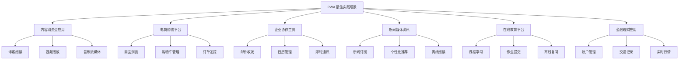

# PWA深度指南

## 概述

渐进式网页应用（Progressive Web App，PWA）代表了现代Web开发的最高成就之一——它将Web的广覆盖性与原生应用的高体验感完美融合。PWA不是某种特定的技术栈，而是一套完整的技术理念与最佳实践集合，核心目标是让Web应用能够像原生应用一样被安装、离线访问、推送通知，并且在性能上逼近甚至超越原生应用。

> [!abstract] 核心价值
> PWA的三大支柱：**可靠性**（可离线使用）、**速度**（极速加载体验）、**参与度**（可添加到主屏幕、推送通知）。这三点直接对应用户体验的核心诉求，也是PWA能够在现代Web开发中占据重要地位的根本原因。

---

## Service Worker完整生命周期

Service Worker是PWA技术的核心引擎，它运行在浏览器后台，独立于网页线程，为Web应用提供了拦截网络请求、缓存资源、推送通知等强大能力。理解Service Worker的生命周期是掌握PWA的第一步。

### 生命周期阶段

Service Worker的生命周期包含六个关键阶段：

```javascript
// sw.js - Service Worker完整生命周期演示

// 1. 安装阶段 (Installing)
self.addEventListener('install', (event) => {
  console.log('SW: Installing...');
  
  // 预缓存关键资源
  event.waitUntil(
    caches.open('static-v1')
      .then((cache) => {
        console.log('SW: Caching static assets');
        return cache.addAll([
          '/',
          '/index.html',
          '/styles/main.css',
          '/scripts/app.js',
          '/images/logo.png'
        ]);
      })
      .then(() => {
        // 跳过等待，直接激活
        return self.skipWaiting();
      })
  );
});

// 2. 激活阶段 (Activating)
self.addEventListener('activate', (event) => {
  console.log('SW: Activating...');
  
  event.waitUntil(
    // 清理旧版本缓存
    caches.keys()
      .then((cacheNames) => {
        return Promise.all(
          cacheNames
            .filter((name) => name !== 'static-v1')
            .map((name) => {
              console.log('SW: Deleting old cache:', name);
              return caches.delete(name);
            })
        );
      })
      .then(() => {
        // 立即接管所有客户端
        return self.clients.claim();
      })
  );
});

// 3. 安装后事件 (Installed)
self.addEventListener('installed', (event) => {
  console.log('SW: Installed event fired');
});

// 4. 激活后事件 (Activated)
self.addEventListener('activated', (event) => {
  console.log('SW: Activated event fired');
});

// 5. 功能性事件 (Functional Events)
// 5.1 Fetch事件 - 拦截网络请求
self.addEventListener('fetch', (event) => {
  const { request } = event;
  const url = new URL(request.url);
  
  // 仅处理同源请求
  if (url.origin !== location.origin) {
    return;
  }
  
  event.respondWith(
    caches.match(request)
      .then((cachedResponse) => {
        if (cachedResponse) {
          // 缓存命中，返回缓存并更新
          fetchAndCache(request);
          return cachedResponse;
        }
        
        // 缓存未命中，尝试网络请求
        return fetch(request)
          .then((response) => {
            // 检查响应是否有效
            if (!response || response.status !== 200 || response.type !== 'basic') {
              return response;
            }
            
            // 克隆响应并缓存
            const responseToCache = response.clone();
            caches.open('static-v1')
              .then((cache) => {
                cache.put(request, responseToCache);
              });
            
            return response;
          });
      })
  );
});

// 5.2 消息事件 - 与主线程通信
self.addEventListener('message', (event) => {
  if (event.data && event.data.type === 'SKIP_WAITING') {
    self.skipWaiting();
  }
});

// 5.3 后台同步事件 - 网络恢复时自动同步
self.addEventListener('sync', (event) => {
  if (event.tag === 'sync-data') {
    event.waitUntil(syncData());
  }
});

// 5.4 推送通知事件
self.addEventListener('push', (event) => {
  const options = {
    body: event.data ? event.data.text() : '新通知',
    icon: '/images/icon-192.png',
    badge: '/images/badge.png',
    vibrate: [100, 50, 100],
    data: {
      dateOfArrival: Date.now(),
      primaryKey: 1
    },
    actions: [
      { action: 'explore', title: '查看详情' },
      { action: 'close', title: '关闭' }
    ]
  };
  
  event.waitUntil(
    self.registration.showNotification('推送标题', options)
  );
});

// 5.5 通知点击事件
self.addEventListener('notificationclick', (event) => {
  event.notification.close();
  
  if (event.action === 'explore') {
    event.waitUntil(
      clients.openWindow('/details')
    );
  }
});

// 辅助函数：获取并缓存
async function fetchAndCache(request) {
  try {
    const response = await fetch(request);
    const cache = await caches.open('static-v1');
    cache.put(request, response);
  } catch (error) {
    console.error('Fetch failed:', error);
  }
}

// 辅助函数：数据同步
async function syncData() {
  const response = await fetch('/api/sync');
  const data = await response.json();
  // 处理同步逻辑
  console.log('Synced data:', data);
}
```

### 通信机制

主线程与Service Worker之间的通信是双向的：

```javascript
// main.js - 主线程通信

// 注册Service Worker
if ('serviceWorker' in navigator) {
  navigator.serviceWorker.register('/sw.js')
    .then((registration) => {
      console.log('SW registered:', registration.scope);
      
      // 向Service Worker发送消息
      const button = document.getElementById('update-btn');
      button.addEventListener('click', () => {
        registration.active.postMessage({
          type: 'GET_STATUS',
          payload: { timestamp: Date.now() }
        });
      });
    })
    .catch((error) => {
      console.error('SW registration failed:', error);
    });
  
  // 接收Service Worker消息
  navigator.serviceWorker.addEventListener('message', (event) => {
    console.log('Message from SW:', event.data);
    
    if (event.data.type === 'CACHE_UPDATED') {
      showToast('缓存已更新，请刷新页面');
    }
  });
}

// 手动触发更新
navigator.serviceWorker.addEventListener('controllerchange', () => {
  window.location.reload();
});
```

---

## Web App Manifest配置详解

Web App Manifest是一个JSON文件，定义了Web应用的外观和行为，使其能够被添加到设备主屏幕，并像原生应用一样启动。

### 完整Manifest配置

```json
{
  "$schema": "https://json.schemastore.org/webmanifest",
  "name": "电商商城应用",
  "short_name": "商城",
  "description": "全品类电商购物平台",
  "start_url": "/?source=pwa",
  "id": "/?source=pwa",
  "display": "standalone",
  "display_override": ["standalone", "minimal-ui"],
  "orientation": "portrait-primary",
  "background_color": "#ffffff",
  "theme_color": "#1976d2",
  "scope": "/",
  "lang": "zh-CN",
  "dir": "ltr",
  "categories": ["shopping", "business"],
  "icons": [
    {
      "src": "/icons/icon-72.png",
      "sizes": "72x72",
      "type": "image/png",
      "purpose": "maskable any"
    },
    {
      "src": "/icons/icon-96.png",
      "sizes": "96x96",
      "type": "image/png",
      "purpose": "maskable any"
    },
    {
      "src": "/icons/icon-128.png",
      "sizes": "128x128",
      "type": "image/png",
      "purpose": "maskable any"
    },
    {
      "src": "/icons/icon-144.png",
      "sizes": "144x144",
      "type": "image/png",
      "purpose": "maskable any"
    },
    {
      "src": "/icons/icon-152.png",
      "sizes": "152x152",
      "type": "image/png",
      "purpose": "maskable any"
    },
    {
      "src": "/icons/icon-192.png",
      "sizes": "192x192",
      "type": "image/png",
      "purpose": "maskable any"
    },
    {
      "src": "/icons/icon-384.png",
      "sizes": "384x384",
      "type": "image/png",
      "purpose": "maskable any"
    },
    {
      "src": "/icons/icon-512.png",
      "sizes": "512x512",
      "type": "image/png",
      "purpose": "maskable any"
    }
  ],
  "screenshots": [
    {
      "src": "/screenshots/mobile.png",
      "sizes": "390x844",
      "type": "image/png",
      "form_factor": "narrow"
    },
    {
      "src": "/screenshots/desktop.png",
      "sizes": "1280x720",
      "type": "image/png",
      "form_factor": "wide"
    }
  ],
  "shortcuts": [
    {
      "name": "搜索商品",
      "short_name": "搜索",
      "description": "快速搜索商品",
      "url": "/search?q=",
      "icons": [{ "src": "/icons/search.png", "sizes": "96x96" }]
    },
    {
      "name": "购物车",
      "short_name": "购物车",
      "description": "查看购物车",
      "url": "/cart",
      "icons": [{ "src": "/icons/cart.png", "sizes": "96x96" }]
    },
    {
      "name": "我的订单",
      "short_name": "订单",
      "description": "查看订单列表",
      "url": "/orders",
      "icons": [{ "src": "/icons/orders.png", "sizes": "96x96" }]
    }
  ],
  "related_applications": [
    {
      "platform": "play",
      "url": "https://play.google.com/store/apps/details?id=com.example.app",
      "id": "com.example.app"
    }
  ],
  "prefer_related_applications": false
}
```

### Manifest链接与HTML集成

```html
<!DOCTYPE html>
<html lang="zh-CN">
<head>
  <meta charset="UTF-8">
  <meta name="viewport" content="width=device-width, initial-scale=1.0">
  <meta name="theme-color" content="#1976d2">
  <meta name="description" content="全品类电商购物平台">
  
  <!-- PWA Manifest -->
  <link rel="manifest" href="/manifest.json">
  
  <!-- Apple Touch Icon -->
  <link rel="apple-touch-icon" href="/icons/icon-192.png">
  
  <!-- iOS Safari 特定元标签 -->
  <meta name="apple-mobile-web-app-capable" content="yes">
  <meta name="apple-mobile-web-app-status-bar-style" content="black-translucent">
  <meta name="apple-mobile-web-app-title" content="商城">
  
  <title>电商商城</title>
</head>
```

---

## 缓存策略深度解析

### 三种核心策略对比

| 策略 | 适用场景 | 优点 | 缺点 |
|------|----------|------|------|
| CacheFirst | 静态资源（CSS/JS/图片） | 极快响应 | 可能返回过期内容 |
| NetworkFirst | API数据、用户内容 | 总是获取最新 | 慢速网络体验差 |
| StaleWhileRevalidate | 混合场景 | 快速响应+基本新鲜 | 消耗带宽 |
| CacheOnly | 离线优先场景 | 完全离线 | 无网络更新 |
| NetworkOnly | 实时数据 | 始终最新 | 完全依赖网络 |

### 完整缓存策略实现

```javascript
// strategies.js - 完整缓存策略库

/**
 * 策略1: CacheOnly - 仅从缓存读取
 * 适用：已完全缓存的离线资源
 */
export async function cacheOnlyStrategy(request) {
  const cachedResponse = await caches.match(request);
  
  if (cachedResponse) {
    return cachedResponse;
  }
  
  throw new Error('No cached response found');
}

/**
 * 策略2: NetworkOnly - 仅从网络获取
 * 适用：实时数据、认证请求
 */
export async function networkOnlyStrategy(request) {
  const networkResponse = await fetch(request);
  
  if (!networkResponse.ok) {
    throw new Error('Network response was not ok');
  }
  
  return networkResponse;
}

/**
 * 策略3: CacheFirst - 缓存优先
 * 适用：静态资源（图片、CSS、JS、字体）
 */
export async function cacheFirstStrategy(request, cacheName = 'static-v1') {
  const cachedResponse = await caches.match(request);
  
  if (cachedResponse) {
    return cachedResponse;
  }
  
  try {
    const networkResponse = await fetch(request);
    
    if (networkResponse.ok) {
      const cache = await caches.open(cacheName);
      cache.put(request, networkResponse.clone());
    }
    
    return networkResponse;
  } catch (error) {
    // 返回默认占位图
    return caches.match('/images/placeholder.png');
  }
}

/**
 * 策略4: NetworkFirst - 网络优先
 * 适用：API数据、用户生成内容
 */
export async function networkFirstStrategy(request, cacheName = 'api-v1') {
  try {
    const networkResponse = await fetch(request);
    
    if (networkResponse.ok) {
      const cache = await caches.open(cacheName);
      cache.put(request, networkResponse.clone());
    }
    
    return networkResponse;
  } catch (error) {
    const cachedResponse = await caches.match(request);
    
    if (cachedResponse) {
      return cachedResponse;
    }
    
    // 返回离线兜底数据
    return new Response(
      JSON.stringify({ error: 'offline', message: '请检查网络连接' }),
      {
        status: 503,
        headers: { 'Content-Type': 'application/json' }
      }
    );
  }
}

/**
 * 策略5: StaleWhileRevalidate - 过期重新验证
 * 适用：新闻列表、社交动态等
 */
export async function staleWhileRevalidateStrategy(request, cacheName = 'mixed-v1') {
  const cache = await caches.open(cacheName);
  const cachedResponse = await cache.match(request);
  
  // 异步更新缓存，不阻塞响应
  const fetchPromise = fetch(request)
    .then((networkResponse) => {
      if (networkResponse.ok) {
        cache.put(request, networkResponse.clone());
      }
      return networkResponse;
    })
    .catch(() => null);
  
  // 立即返回缓存，网络请求在后台进行
  return cachedResponse || fetchPromise;
}

/**
 * 策略6: 增量缓存（对于大文件）
 * 适用：视频、大型资源
 */
export async function rangeRequestStrategy(request) {
  const cache = await caches.open('large-files-v1');
  const cachedResponse = await cache.match(request);
  
  if (request.headers.has('range')) {
    return handleRangeRequest(request, cachedResponse, cache);
  }
  
  return handleFullRequest(request, cache, cachedResponse);
}

async function handleRangeRequest(request, cachedResponse, cache) {
  const rangeHeader = request.headers.get('Range');
  const rangeMatch = rangeHeader.match(/bytes=(\d+)-(\d*)/);
  const start = parseInt(rangeMatch[1], 10);
  const end = rangeMatch[2] ? parseInt(rangeMatch[2], 10) : undefined;
  
  if (cachedResponse) {
    const blob = await cachedResponse.blob();
    const size = blob.size;
    const body = blob.slice(start, end || size);
    
    return new Response(body, {
      status: 206,
      statusText: 'Partial Content',
      headers: {
        'Content-Type': cachedResponse.headers.get('Content-Type') || 'application/octet-stream',
        'Content-Range': `bytes ${start}-${(end || size) - 1}/${size}`,
        'Content-Length': body.size
      }
    });
  }
  
  // 从网络获取范围请求
  const networkResponse = await fetch(request);
  const reader = networkResponse.body.getReader();
  const chunks = [];
  
  while (true) {
    const { done, value } = await reader.read();
    if (done) break;
    
    const chunkEnd = start + chunks.reduce((a, c) => a + c.length, 0) + value.length;
    if (chunkEnd <= start) {
      chunks.push(value);
    }
    
    if (end && chunkEnd >= end) {
      chunks.push(value.slice(0, end - chunkEnd + value.length));
      break;
    }
  }
  
  const body = new Blob(chunks);
  
  // 缓存完整文件以便下次使用
  const fullResponse = await fetch(request);
  if (fullResponse.ok) {
    cache.put(request, fullResponse.clone());
  }
  
  return new Response(body.slice(0, end ? end - start + 1 : undefined), {
    status: 206,
    headers: networkResponse.headers
  });
}

async function handleFullRequest(request, cache, cachedResponse) {
  if (cachedResponse) {
    // 后台更新
    fetch(request)
      .then((response) => {
        if (response.ok) cache.put(request, response);
      })
      .catch(() => {});
    
    return cachedResponse;
  }
  
  const networkResponse = await fetch(request);
  if (networkResponse.ok) {
    cache.put(request, networkResponse.clone());
  }
  
  return networkResponse;
}
```

### 高级缓存策略：内容哈希验证

```javascript
// hash-based-strategy.js - 基于内容哈希的缓存策略

// 构建时生成的资源清单
const precacheManifest = {
  'main.abc123.js': '/static/js/main.abc123.js',
  'main.abc123.js.map': '/static/js/main.abc123.js.map',
  'chunk-vendors.def456.css': '/static/css/chunk-vendors.def456.css'
};

self.addEventListener('fetch', (event) => {
  const url = new URL(event.request.url);
  
  // 跳过非GET请求
  if (event.request.method !== 'GET') return;
  
  // 跳过跨域请求
  if (url.origin !== location.origin) return;
  
  // 跳过Chrome扩展
  if (url.protocol === 'chrome-extension:') return;
  
  event.respondWith(handleFetch(event.request));
});

async function handleFetch(request) {
  const url = new URL(request.url);
  const cache = await caches.open('content-hash-v1');
  
  // 1. 检查精确缓存匹配
  const exactMatch = await cache.match(request);
  if (exactMatch) {
    return exactMatch;
  }
  
  // 2. 检查是否是需要预缓存的资源
  const path = url.pathname;
  const expectedHash = Object.entries(precacheManifest)
    .find(([key]) => path.endsWith(key.split('.').slice(-2, -1)[0]))?.[0];
  
  if (expectedHash) {
    // 这是预缓存资源，网络优先
    try {
      const networkResponse = await fetch(request);
      if (networkResponse.ok) {
        await cache.put(request, networkResponse.clone());
        // 更新清单中的路径
        await cache.put(
          new Request(url.pathname),
          networkResponse.clone()
        );
      }
      return networkResponse;
    } catch (error) {
      // 预缓存资源离线不可用是严重问题
      throw error;
    }
  }
  
  // 3. 其他资源使用StaleWhileRevalidate
  const cachedResponse = await cache.match(request);
  
  fetch(request)
    .then((response) => {
      if (response.ok) {
        cache.put(request, response.clone());
      }
    })
    .catch(() => {});
  
  return cachedResponse || fetch(request);
}
```

---

## PWA工具链

### Workbox深度集成

Workbox是Google开发的PWA工具库，提供了声明式的缓存策略配置：

```javascript
// workbox-config.js - Workbox配置
import { generateSW } from 'workbox-build';
import { registerRoute } from 'workbox-routing';
import {
  CacheFirst,
  StaleWhileRevalidate,
  NetworkFirst,
  ExpirationPlugin
} from 'workbox-strategies';
import { CacheableResponsePlugin } from 'workbox-cacheable-response';
import { precacheAndRoute } from 'workbox-precaching';
import { setCatchHandler } from 'workbox-strategies';

// 导入预缓存清单（Vite/Webpack插件自动生成）
precacheAndRoute(self.__WB_MANIFEST);

// 1. Google Fonts缓存
registerRoute(
  ({ url }) => url.origin === 'https://fonts.googleapis.com' ||
               url.origin === 'https://fonts.gstatic.com',
  new StaleWhileRevalidate({
    cacheName: 'google-fonts',
    plugins: [
      new CacheableResponsePlugin({
        statuses: [0, 200]
      }),
      new ExpirationPlugin({
        maxAgeSeconds: 60 * 60 * 24 * 365, // 1年
        maxEntries: 30
      })
    ]
  })
);

// 2. 图片缓存
registerRoute(
  ({ request }) => request.destination === 'image',
  new CacheFirst({
    cacheName: 'images',
    plugins: [
      new CacheableResponsePlugin({
        statuses: [0, 200]
      }),
      new ExpirationPlugin({
        maxEntries: 60,
        maxAgeSeconds: 60 * 60 * 24 * 30 // 30天
      })
    ]
  })
);

// 3. CSS/JS缓存
registerRoute(
  ({ request }) => request.destination === 'style' ||
                   request.destination === 'script',
  new StaleWhileRevalidate({
    cacheName: 'static-resources',
    plugins: [
      new CacheableResponsePlugin({
        statuses: [0, 200]
      })
    ]
  })
);

// 4. API数据缓存（网络优先，缓存兜底）
registerRoute(
  ({ url }) => url.pathname.startsWith('/api/'),
  new NetworkFirst({
    cacheName: 'api-cache',
    plugins: [
      new CacheableResponsePlugin({
        statuses: [0, 200]
      }),
      new ExpirationPlugin({
        maxEntries: 50,
        maxAgeSeconds: 60 * 60 // 1小时
      })
    ]
  })
);

// 5. 导航请求（HTML）
registerRoute(
  ({ request }) => request.mode === 'navigate',
  new NetworkFirst({
    cacheName: 'pages',
    plugins: [
      new CacheableResponsePlugin({
        statuses: [0, 200]
      }),
      new ExpirationPlugin({
        maxEntries: 25
      })
    ]
  })
);

// 错误处理
setCatchHandler(async ({ event }) => {
  if (event.request.destination === 'document') {
    const cache = await caches.open('pages');
    const cachedResponse = await cache.match('/offline.html');
    
    if (cachedResponse) {
      return cachedResponse;
    }
  }
  
  return Response.error();
});
```

### Vite PWA插件集成

```javascript
// vite.config.js - Vite PWA配置
import { defineConfig } from 'vite';
import { VitePWA } from 'vite-plugin-pwa';

export default defineConfig({
  plugins: [
    VitePWA({
      registerType: 'autoUpdate',
      injectRegister: 'auto',
      
      // PWA策略
      strategies: 'generateSW',
      
      // 构建输出配置
      manifest: {
        name: '电商商城应用',
        short_name: '商城',
        description: '全品类电商购物平台',
        theme_color: '#1976d2',
        background_color: '#ffffff',
        display: 'standalone',
        orientation: 'portrait-primary',
        scope: '/',
        start_url: '/',
        icons: [
          {
            src: '/pwa-192x192.png',
            sizes: '192x192',
            type: 'image/png'
          },
          {
            src: '/pwa-512x512.png',
            sizes: '512x512',
            type: 'image/png',
            purpose: 'any maskable'
          }
        ],
        shortcuts: [
          {
            name: '搜索',
            url: '/search',
            description: '快速搜索'
          }
        ]
      },
      
      // Workbox配置
      workbox: {
        // 预缓存的文件
        globPatterns: ['**/*.{js,css,html,ico,png,svg,woff2}'],
        
        // 运行时缓存规则
        runtimeCaching: [
          {
            urlPattern: /^https:\/\/fonts\.googleapis\.com\/.*/i,
            handler: 'CacheFirst',
            options: {
              cacheName: 'google-fonts-cache',
              expiration: {
                maxEntries: 10,
                maxAgeSeconds: 60 * 60 * 24 * 365
              },
              cacheableResponse: {
                statuses: [0, 200]
              }
            }
          },
          {
            urlPattern: /^https:\/\/fonts\.gstatic\.com\/.*/i,
            handler: 'CacheFirst',
            options: {
              cacheName: 'google-fonts-webfonts',
              expiration: {
                maxEntries: 30,
                maxAgeSeconds: 60 * 60 * 24 * 365
              },
              cacheableResponse: {
                statuses: [0, 200]
              }
            }
          },
          {
            urlPattern: /\.(?:png|jpg|jpeg|svg|gif|webp)$/,
            handler: 'CacheFirst',
            options: {
              cacheName: 'images-cache',
              expiration: {
                maxEntries: 50,
                maxAgeSeconds: 60 * 60 * 24 * 30
              }
            }
          },
          {
            urlPattern: /\/api\/.*/i,
            handler: 'NetworkFirst',
            options: {
              cacheName: 'api-cache',
              networkTimeoutSeconds: 10,
              expiration: {
                maxEntries: 50,
                maxAgeSeconds: 60 * 60
              }
            }
          }
        ]
      },
      
      // 开发模式选项
      devOptions: {
        enabled: true,
        type: 'module'
      },
      
      // 生命周期钩子
      callbacks: {
        beforeCreateWorker(workerOptions) {
          console.log('Worker即将创建:', workerOptions);
          return workerOptions;
        },
        beforeStartIndexChain(hook) {
          console.log('索引链开始:', hook);
        },
        buildStart(hook) {
          console.log('构建开始');
        },
        registering(registration) {
          console.log('Service Worker已注册:', registration);
        },
        registered(registration) {
          console.log('Service Worker注册完成');
        },
        updateFound(registration) {
          console.log('发现新版本');
        }
      }
    })
  ]
});
```

---

## Lighthouse PWA评分优化

### 评分维度解析

Lighthouse PWA评分基于四个核心维度：

| 维度 | 权重 | 核心检查项 |
|------|------|-----------|
| 快速可靠 | 30% | HTTPS、响应式viewport、启动画面配置 |
| 可安装 | 30% | Manifest配置、Service Worker、图标 |
| PWA优化 | 20% | 离线功能、离线回退页面 |
| 最佳实践 | 20% | HTTPS配置、无Deprecated API |

### 完整优化清单

```html
<!-- index.html - PWA完整配置示例 -->

<!DOCTYPE html>
<html lang="zh-CN">
<head>
  <meta charset="UTF-8">
  <meta name="viewport" content="width=device-width, initial-scale=1.0, viewport-fit=cover">
  <meta name="theme-color" content="#1976d2">
  <meta name="description" content="全品类电商购物平台，支持离线浏览">
  
  <!-- 关键PWA元标签 -->
  <meta name="mobile-web-app-capable" content="yes">
  <meta name="apple-mobile-web-app-capable" content="yes">
  <meta name="apple-mobile-web-app-status-bar-style" content="black-translucent">
  <meta name="apple-mobile-web-app-title" content="商城">
  
  <!-- 图标 -->
  <link rel="icon" type="image/png" sizes="32x32" href="/icons/icon-32.png">
  <link rel="icon" type="image/png" sizes="16x16" href="/icons/icon-16.png">
  <link rel="apple-touch-icon" href="/icons/icon-192.png">
  
  <!-- Manifest -->
  <link rel="manifest" href="/manifest.json">
  
  <!-- 启动画面（iOS） -->
  <link rel="apple-touch-startup-image" href="/splash/splash-1242x2688.png"
       media="(device-width: 414px) and (device-height: 896px) and (-webkit-device-pixel-ratio: 3)">
  
  <!-- HTTPS强制 -->
  <meta http-equiv="Content-Security-Policy" content="default-src 'self'; script-src 'self'; style-src 'self' 'unsafe-inline' https://fonts.googleapis.com; font-src 'self' https://fonts.gstatic.com; img-src 'self' data: https:; connect-src 'self' https://api.example.com;">
  
  <title>电商商城</title>
  
  <style>
    /* 启动画面样式 */
    body {
      background-color: #1976d2;
    }
    
    @media (prefers-color-scheme: dark) {
      body {
        background-color: #0d47a1;
      }
    }
    
    /* 安全区域适配 */
    body {
      padding-top: env(safe-area-inset-top);
      padding-bottom: env(safe-area-inset-bottom);
      padding-left: env(safe-area-inset-left);
      padding-right: env(safe-area-inset-right);
    }
  </style>
</head>
<body>
  <!-- 离线回退内容 -->
  <div id="offline-message" style="display: none;">
    <h1>您当前处于离线状态</h1>
    <p>请检查网络连接后重试</p>
    <button onclick="location.reload()">重试</button>
  </div>
  
  <script>
    // 离线检测
    function updateOnlineStatus() {
      const offlineMsg = document.getElementById('offline-message');
      
      if (!navigator.onLine) {
        offlineMsg.style.display = 'flex';
      } else {
        offlineMsg.style.display = 'none';
      }
    }
    
    window.addEventListener('online', updateOnlineStatus);
    window.addEventListener('offline', updateOnlineStatus);
    
    // 注册Service Worker
    if ('serviceWorker' in navigator) {
      window.addEventListener('load', async () => {
        try {
          const registration = await navigator.serviceWorker.register('/sw.js');
          console.log('SW registered:', registration.scope);
          
          // 检查更新
          registration.addEventListener('updatefound', () => {
            const newWorker = registration.installing;
            
            newWorker.addEventListener('statechange', () => {
              if (newWorker.state === 'installed' && navigator.serviceWorker.controller) {
                // 发现新版本，提示用户刷新
                showUpdateNotification();
              }
            });
          });
        } catch (error) {
          console.error('SW registration failed:', error);
        }
      });
    }
    
    function showUpdateNotification() {
      const toast = document.createElement('div');
      toast.innerHTML = '有新版本可用 <button onclick="location.reload()">刷新</button>';
      toast.style.cssText = 'position:fixed;bottom:20px;left:50%;transform:translateX(-50%);background:#333;color:#fff;padding:10px 20px;border-radius:5px;z-index:9999;';
      document.body.appendChild(toast);
    }
  </script>
</body>
</html>
```

### Lighthouse CI自动化

```yaml
# .lighthouserc.yml - Lighthouse CI配置

ci:
  collect:
    # 收集设置
    url:
      - http://localhost:3000/
      - http://localhost:3000/cart
      - http://localhost:3000/product/1
    numberOfRuns: 3
    startServerCommand: npm start
    startServerReadyPattern: "Server running"
    startServerReadyTimeout: 30000
    
    settings:
      preset: desktop
      throttling:
        rttMs: 40
        throughputKbps: 10240
        cpuSlowdownMultiplier: 1
      formFactor: desktop
      screenEmulation:
        mobile: false
        width: 1350
        height: 940
        deviceScaleFactor: 1
        disabled: false
  
  assert:
    assertions:
      # PWA必须通过所有检查
      categories:pwa: [error, { minScore: 1 }]
      
      # 性能分数要求
      categories:performance: [warn, { minScore: 0.9 }]
      
      # 可访问性要求
      categories:accessibility: [error, { minScore: 0.9 }]
      
      # 最佳实践要求
      categories:best-practices: [error, { minScore: 0.9 }]
      
      # SEO要求
      categories:seo: [warn, { minScore: 0.9 }]
      
      # Service Worker必须存在
      service-worker: error
      "installable-manifest": error
      
      # HTTPS必须启用
      is-on-https: error
      
      # 响应式viewport必须配置
      viewport: error
      
      # 图标必须满足要求
      icons: error
      "apple-touch-icon": error
      
      # 离线功能
      works-offline: error
```

---

## 总结与实践建议

> [!tip] PWA实施路线图
> 1. **基础阶段**：添加Manifest和基础Service Worker，实现离线可用
> 2. **优化阶段**：完善缓存策略，优化启动画面，提升PWA评分
> 3. **高级阶段**：添加推送通知、后台同步等高级功能
> 4. **原生融合**：与原生应用协同，形成完整的产品矩阵

PWA技术已经相当成熟，在主流浏览器中得到了良好的支持。对于大多数Web应用来说，实施PWA的成本相对较低，但带来的用户体验提升是显著的。建议从本文介绍的核心功能开始，逐步完善PWA的各项能力，最终为用户提供接近原生应用的使用体验。

---

## 部署配置

### 生产环境部署检查清单

在将 PWA 部署到生产环境之前，必须完成以下检查清单以确保应用的可靠性、安全性和性能。

```javascript
// deploy-checklist.js
// ─────────────────────────────────────────────────────────────
// PWA 生产部署前检查清单
// ─────────────────────────────────────────────────────────────

const CHECKLIST = {
  // HTTPS 强制要求
  security: {
    httpsEnabled: {
      description: 'HTTPS 必须启用',
      verify: '检查 SSL 证书有效性',
      tools: ['SSL Labs', 'Let's Encrypt']
    },
    hstsHeaders: {
      description: '配置 HSTS 头',
      header: 'Strict-Transport-Security: max-age=31536000; includeSubDomains'
    },
    contentSecurityPolicy: {
      description: '配置 CSP 防止 XSS',
      required: ['default-src', 'script-src', 'worker-src']
    }
  },

  // Service Worker 配置
  serviceWorker: {
    registration: {
      description: 'SW 注册成功',
      verify: '检查 navigator.serviceWorker.controller 存在'
    },
    scope: {
      description: 'SW 作用域正确',
      verify: 'scope 应限制在应用范围内'
    },
    updateStrategy: {
      description: '更新策略配置',
      recommend: 'skipWaiting + clients.claim'
    }
  },

  // Manifest 配置
  manifest: {
    requiredFields: ['name', 'short_name', 'start_url', 'display', 'icons'],
    iconSizes: [72, 96, 128, 144, 152, 192, 384, 512],
    maskableIcons: true,
    themeColor: true,
    backgroundColor: true
  },

  // 缓存策略
  cache: {
    precacheList: '验证构建时的预缓存清单',
    runtimeCache: '配置运行时缓存规则',
    cacheSize: '设置缓存大小限制（建议 < 50MB）',
    staleCleanup: '配置过期缓存清理策略'
  }
};

// 自动化检查脚本
async function verifyPWAProduction() {
  const results = {
    passed: [],
    failed: [],
    warnings: []
  };

  // 1. HTTPS 检查
  if (location.protocol !== 'https:') {
    results.failed.push('HTTPS is required for PWA');
  } else {
    results.passed.push('HTTPS enabled');
  }

  // 2. Service Worker 检查
  if ('serviceWorker' in navigator) {
    const registration = await navigator.serviceWorker.ready;
    if (registration.active) {
      results.passed.push('Service Worker is active');
    } else {
      results.failed.push('Service Worker not active');
    }
  } else {
    results.failed.push('Service Worker not supported');
  }

  // 3. Manifest 检查
  const manifest = document.querySelector('link[rel="manifest"]');
  if (manifest) {
    results.passed.push('Manifest link found');
  } else {
    results.failed.push('Manifest link missing');
  }

  // 4. 安装条件检查
  if (window.matchMedia('(display-mode: standalone)').matches) {
    results.passed.push('App is running in standalone mode');
  }

  return results;
}

export { CHECKLIST, verifyPWAProduction };
```

### 服务器配置要求

不同的 Web 服务器对 PWA 有不同的配置要求。以下是常见服务器的完整配置示例。

#### Nginx 配置

```nginx
# /etc/nginx/conf.d/pwa.conf
# ─────────────────────────────────────────────────────────────
# PWA 生产环境 Nginx 配置
# ─────────────────────────────────────────────────────────────

# 主服务器块
server {
    listen 443 ssl http2;
    server_name example.com www.example.com;
    
    # SSL 证书配置
    ssl_certificate /etc/letsencrypt/live/example.com/fullchain.pem;
    ssl_certificate_key /etc/letsencrypt/live/example.com/privkey.pem;
    
    # SSL 安全配置
    ssl_protocols TLSv1.2 TLSv1.3;
    ssl_ciphers ECDHE-ECDSA-AES128-GCM-SHA256:ECDHE-RSA-AES128-GCM-SHA256;
    ssl_prefer_server_ciphers off;
    ssl_session_cache shared:SSL:10m;
    ssl_session_timeout 1d;
    ssl_session_tickets off;
    
    # HSTS 配置
    add_header Strict-Transport-Security "max-age=31536000; includeSubDomains; preload" always;
    
    # 安全头配置
    add_header X-Frame-Options "SAMEORIGIN" always;
    add_header X-Content-Type-Options "nosniff" always;
    add_header X-XSS-Protection "1; mode=block" always;
    add_header Referrer-Policy "strict-origin-when-cross-origin" always;
    
    # CSP 配置
    add_header Content-Security-Policy "
        default-src 'self';
        script-src 'self' 'unsafe-eval' https://cdn.example.com;
        style-src 'self' 'unsafe-inline' https://fonts.googleapis.com;
        font-src 'self' https://fonts.gstatic.com;
        img-src 'self' data: https: blob:;
        connect-src 'self' https://api.example.com wss://realtime.example.com;
        worker-src 'self' blob:;
        frame-ancestors 'none';
    " always;
    
    # 根目录
    root /var/www/pwa-app/dist;
    index index.html;
    
    # PWA 相关 MIME 类型
    include /etc/nginx/mime.types;
    
    # Service Worker 文件不缓存
    location /sw.js {
        add_header Cache-Control "no-cache, no-store, must-revalidate";
        add_header Pragma "no-cache";
        add_header Expires "0";
        expires 0;
    }
    
    # 静态资源长期缓存
    location ~* \.(js|css|png|jpg|jpeg|gif|ico|svg|woff|woff2)$ {
        expires 1y;
        add_header Cache-Control "public, immutable";
        access_log off;
    }
    
    # HTML 不缓存
    location ~* \.html$ {
        add_header Cache-Control "no-cache, no-store, must-revalidate";
        expires 0;
    }
    
    # API 代理
    location /api/ {
        proxy_pass http://backend:3000/;
        proxy_http_version 1.1;
        proxy_set_header Upgrade $http_upgrade;
        proxy_set_header Connection 'upgrade';
        proxy_set_header Host $host;
        proxy_cache_bypass $http_upgrade;
    }
    
    # SPA 路由支持
    location / {
        try_files $uri $uri/ /index.html;
    }
    
    # Gzip 压缩
    gzip on;
    gzip_vary on;
    gzip_proxied any;
    gzip_comp_level 6;
    gzip_types text/plain text/css text/xml application/json application/javascript 
               application/xml application/xml+rss text/javascript application/x-javascript
               image/svg+xml application/vnd.ms-fontobject application/x-font-ttf font/opentype;
}

# HTTP 重定向到 HTTPS
server {
    listen 80;
    server_name example.com www.example.com;
    return 301 https://$host$request_uri;
}
```

#### Apache 配置

```apache
# .htaccess
# ─────────────────────────────────────────────────────────────
# PWA 生产环境 Apache 配置
# ─────────────────────────────────────────────────────────────

# 启用 Rewrite 模块
<IfModule mod_rewrite.c>
    RewriteEngine On
    RewriteBase /
    
    # HTTP 重定向到 HTTPS
    RewriteCond %{HTTPS} off
    RewriteRule ^(.*)$ https://%{HTTP_HOST}%{REQUEST_URI} [L,R=301]
</IfModule>

# 安全头
<IfModule mod_headers.c>
    # HSTS
    Header always set Strict-Transport-Security "max-age=31536000; includeSubDomains; preload"
    
    # 安全头
    Header always set X-Frame-Options "SAMEORIGIN"
    Header always set X-Content-Type-Options "nosniff"
    Header always set X-XSS-Protection "1; mode=block"
    Header always set Referrer-Policy "strict-origin-when-cross-origin"
    
    # Service Worker 文件不缓存
    <FilesMatch "sw\.js$">
        Header set Cache-Control "no-cache, no-store, must-revalidate"
        Header set Pragma "no-cache"
        Header set Expires 0
    </FilesMatch>
</IfModule>

# Gzip 压缩
<IfModule mod_deflate.c>
    AddOutputFilterByType DEFLATE text/plain
    AddOutputFilterByType DEFLATE text/css
    AddOutputFilterByType DEFLATE application/javascript
    AddOutputFilterByType DEFLATE application/json
    AddOutputFilterByType DEFLATE application/xml
    AddOutputFilterByType DEFLATE text/xml
    AddOutputFilterByType DEFLATE image/svg+xml
</IfModule>

# 缓存配置
<IfModule mod_expires.c>
    ExpiresActive On
    
    # 静态资源长期缓存
    ExpiresByType image/png "access plus 1 year"
    ExpiresByType image/jpg "access plus 1 year"
    ExpiresByType image/jpeg "access plus 1 year"
    ExpiresByType image/gif "access plus 1 year"
    ExpiresByType image/ico "access plus 1 year"
    ExpiresByType image/svg+xml "access plus 1 year"
    ExpiresByType text/css "access plus 1 year"
    ExpiresByType application/javascript "access plus 1 year"
    ExpiresByType application/pdf "access plus 1 year"
    ExpiresByType font/ttf "access plus 1 year"
    ExpiresByType font/woff "access plus 1 year"
    ExpiresByType font/woff2 "access plus 1 year"
    
    # HTML 不缓存
    ExpiresByType text/html "no-cache"
</IfModule>

# MIME 类型
<IfModule mod_mime.c>
    AddType application/javascript js
    AddType text/css css
    AddType image/svg+xml svg svgz
    AddType application/font-woff woff
    AddType application/font-woff2 woff2
</IfModule>

# SPA 路由支持
<IfModule mod_rewrite.c>
    RewriteEngine On
    RewriteBase /
    RewriteRule ^index\.html$ - [L]
    RewriteCond %{REQUEST_FILENAME} !-f
    RewriteCond %{REQUEST_FILENAME} !-d
    RewriteRule . /index.html [L]
</IfModule>
```

#### Caddy 配置

```caddy
# Caddyfile
# ─────────────────────────────────────────────────────────────
# PWA 生产环境 Caddy 配置
# ─────────────────────────────────────────────────────────────

example.com, www.example.com {
    # TLS 配置
    tls {
        dns cloudflare {env.CLOUDFLARE_API_TOKEN}
    }
    
    # 根目录
    root * /var/www/pwa-app/dist
    
    # 安全头中间件
    header {
        # HSTS
        Strict-Transport-Security "max-age=31536000; includeSubDomains; preload"
        
        # 安全头
        X-Frame-Options "SAMEORIGIN"
        X-Content-Type-Options "nosniff"
        Referrer-Policy "strict-origin-when-cross-origin"
        
        # CSP
        Content-Security-Policy "default-src 'self'; script-src 'self' 'unsafe-eval'; style-src 'self' 'unsafe-inline' https://fonts.googleapis.com; font-src 'self' https://fonts.gstatic.com; img-src 'self' data: https:; worker-src 'self' blob:;"
        
        # 权限策略
        Permissions-Policy "geolocation=(), microphone=(), camera=()"
    }
    
    # Service Worker 文件特殊处理
    @sw_js {
        path /sw.js /sw-worker-development.js
    }
    handle @sw_js {
        header {
            Cache-Control "no-cache, no-store, must-revalidate"
            Pragma "no-cache"
        }
    }
    
    # 静态资源缓存
    @static {
        path *.js *.css *.png *.jpg *.jpeg *.gif *.ico *.svg *.woff *.woff2
    }
    handle @static {
        header {
            Cache-Control "public, max-age=31536000, immutable"
        }
    }
    
    # 目录列表关闭
    file_server browse off
    
    # SPA 路由支持
    try_files {path} {path}/ /index.html
    
    # Gzip 压缩
    encode gzip zstd
    
    # 日志
    log {
        output file /var/log/caddy/pwa.log
    }
}
```

### CDN 部署配置

对于全球化部署的 PWA 应用，CDN 是提升性能和可靠性的关键组件。

```javascript
// cdn-config.js
// ─────────────────────────────────────────────────────────────
// CDN 配置与边缘缓存策略
// ─────────────────────────────────────────────────────────────

const CDN_CONFIG = {
  // Cloudflare 配置示例
  cloudflare: {
    // 页面规则
    pageRules: [
      {
        pattern: 'example.com/*',
        settings: {
          // 缓存级别
          cacheLevel: 'cacheEverything',
          // 边缘缓存 TTL
          edgeCacheTTL: 604800, // 7天
          // 浏览器缓存 TTL
          browserCacheTTL: 86400, // 1天
          // 源站缓存控制
          originCacheControl: true,
          // 自动压缩
          automaticHTTPSRewrites: 'on',
          // 剥离 cookie
          cacheByCookies: false,
          // 查询字符串排序
          cacheQueryString: true
        }
      },
      {
        pattern: 'example.com/api/*',
        settings: {
          cacheLevel: 'bypass',
          edgeCacheTTL: 0,
          browserCacheTTL: 0
        }
      }
    ],
    
    // Workers 配置（可选）
    workerScript: `
      addEventListener('fetch', event => {
        const url = new URL(event.request.url);
        
        // API 请求不缓存
        if (url.pathname.startsWith('/api/')) {
          event.respondWith(fetch(event.request));
          return;
        }
        
        // HTML 页面使用 stale-while-revalidate
        if (url.pathname.endsWith('.html') || url.pathname === '/') {
          event.respondWith(
            caches.open('html-cache').then(async cache => {
              const cached = await cache.match(event.request);
              
              const fetchPromise = fetch(event.request).then(response => {
                if (response.ok) {
                  cache.put(event.request, response.clone());
                }
                return response;
              }).catch(() => null);
              
              return cached || fetchPromise;
            })
          );
          return;
        }
        
        // 默认处理
        event.respondWith(fetch(event.request));
      });
    `
  },

  // CloudFront 配置示例
  cloudfront: {
    // 缓存策略
    cachePolicy: {
      name: 'PWAStaticAssets',
      minTTL: 31536000,
      maxTTL: 31536000,
      defaultTTL: 31536000,
      parametersInCacheKeyAndForwardedToOrigin: {
        cookiesConfig: { forward: 'none' },
        headersConfig: { forward: 'none' },
        queryStringsConfig: { forward: 'all' }
      }
    },
    
    // 源请求策略
    originRequestPolicy: {
      // 传递必要的头
      headers: [
        'Origin',
        'Access-Control-Request-Headers',
        'Access-Control-Request-Method'
      ],
      // 传递查询字符串
      queryStrings: true
    },
    
    // 响应头策略
    responseHeadersPolicy: {
      securityHeaders: {
        xFrameOptions: { value: 'SAMEORIGIN' },
        xSSProtection: { value: '1; mode=block' },
        xContentTypeOptions: { value: 'nosniff' },
        referrerPolicy: { value: 'strict-origin-when-cross-origin' },
        strictTransportSecurity: {
          value: 'max-age=31536000; includeSubDomains; preload'
        },
        contentSecurityPolicy: {
          value: "default-src 'self'; script-src 'self'; style-src 'self' 'unsafe-inline'"
        }
      }
    }
  }
};

// 生成 CloudFront 函数
function generateCloudFrontFunction() {
  return `
    function handler(event) {
      var request = event.request;
      var response = event.response;
      
      // 添加安全头
      response.headers['x-frame-options'] = { value: 'SAMEORIGIN' };
      response.headers['x-content-type-options'] = { value: 'nosniff' };
      response.headers['referrer-policy'] = { value: 'strict-origin-when-cross-origin' };
      response.headers['strict-transport-security'] = { 
        value: 'max-age=31536000; includeSubDomains; preload' 
      };
      
      return response;
    }
  `;
}

export { CDN_CONFIG, generateCloudFrontFunction };
```

---

## 环境变量与密钥管理

### PWA 环境配置策略

PWA 应用的环境配置需要考虑多个层面：构建时配置、运行时配置，以及敏感信息的安全管理。

```javascript
// env-config.js
// ─────────────────────────────────────────────────────────────
// 环境配置管理
// ─────────────────────────────────────────────────────────────

// 环境配置定义
const ENV_CONFIG = {
  development: {
    apiBaseUrl: 'http://localhost:3000/api',
    wsUrl: 'ws://localhost:3000',
    enableDebug: true,
    logLevel: 'debug',
    cacheEnabled: false,
    analyticsId: null
  },
  staging: {
    apiBaseUrl: 'https://staging-api.example.com/api',
    wsUrl: 'wss://staging-api.example.com',
    enableDebug: false,
    logLevel: 'info',
    cacheEnabled: true,
    analyticsId: 'UA-XXXXXXXXX-2'
  },
  production: {
    apiBaseUrl: 'https://api.example.com/api',
    wsUrl: 'wss://api.example.com',
    enableDebug: false,
    logLevel: 'error',
    cacheEnabled: true,
    analyticsId: 'UA-XXXXXXXXX-1'
  }
};

// 获取当前环境
function getCurrentEnv() {
  // 检查 URL 参数
  const urlParams = new URLSearchParams(window.location.search);
  const envParam = urlParams.get('env');
  if (envParam && ENV_CONFIG[envParam]) {
    return envParam;
  }
  
  // 检查 localStorage
  const storedEnv = localStorage.getItem('app_env');
  if (storedEnv && ENV_CONFIG[storedEnv]) {
    return storedEnv;
  }
  
  // 根据域名判断
  const hostname = window.location.hostname;
  if (hostname.startsWith('staging.')) return 'staging';
  if (hostname.startsWith('dev.')) return 'development';
  if (hostname === 'localhost' || hostname === '127.0.0.1') return 'development';
  
  return 'production';
}

// 配置管理器
class ConfigManager {
  constructor() {
    this.env = getCurrentEnv();
    this.config = ENV_CONFIG[this.env];
    this.runtimeConfig = {};
  }
  
  // 获取配置值
  get(key, defaultValue = null) {
    // 运行时配置优先
    if (this.runtimeConfig[key] !== undefined) {
      return this.runtimeConfig[key];
    }
    
    // 构建时配置
    if (this.config[key] !== undefined) {
      return this.config[key];
    }
    
    return defaultValue;
  }
  
  // 设置运行时配置（从服务器获取）
  async loadRuntimeConfig() {
    try {
      const response = await fetch('/config/runtime.json');
      if (response.ok) {
        this.runtimeConfig = await response.json();
      }
    } catch (error) {
      console.warn('Failed to load runtime config:', error);
    }
  }
  
  // 获取 API 基础 URL
  getApiUrl(path = '') {
    return `${this.config.apiBaseUrl}${path}`;
  }
  
  // 获取 WebSocket URL
  getWsUrl(path = '') {
    return `${this.config.wsUrl}${path}`;
  }
  
  // 检查是否为生产环境
  isProduction() {
    return this.env === 'production';
  }
  
  // 检查是否为开发环境
  isDevelopment() {
    return this.env === 'development';
  }
}

const configManager = new ConfigManager();
export default configManager;
export { ENV_CONFIG, getCurrentEnv };
```

### Service Worker 中的配置

Service Worker 需要特殊的配置管理策略，因为它运行在独立的上下文中。

```javascript
// sw-config.js
// ─────────────────────────────────────────────────────────────
// Service Worker 配置管理
// ─────────────────────────────────────────────────────────────

// SW 配置（编译时注入）
const SW_CONFIG = {
  // 缓存版本
  cacheVersion: 'v1.0.0',
  
  // 预缓存资源列表
  precacheUrls: [
    '/',
    '/index.html',
    '/offline.html',
    '/manifest.json'
  ],
  
  // 运行时缓存策略
  runtimeCaching: {
    // 图片缓存策略
    images: {
      strategy: 'CacheFirst',
      maxAgeSeconds: 60 * 60 * 24 * 30, // 30天
      maxEntries: 60
    },
    
    // 字体缓存策略
    fonts: {
      strategy: 'CacheFirst',
      maxAgeSeconds: 60 * 60 * 24 * 365, // 1年
      maxEntries: 20
    },
    
    // CSS 缓存策略
    stylesheets: {
      strategy: 'StaleWhileRevalidate',
      maxAgeSeconds: 60 * 60 * 24 * 7, // 7天
      maxEntries: 20
    },
    
    // JavaScript 缓存策略
    scripts: {
      strategy: 'StaleWhileRevalidate',
      maxAgeSeconds: 60 * 60 * 24 * 7, // 7天
      maxEntries: 30
    },
    
    // API 请求缓存策略
    api: {
      strategy: 'NetworkFirst',
      networkTimeoutSeconds: 10,
      maxAgeSeconds: 60 * 60, // 1小时
      maxEntries: 50
    }
  },
  
  // 后台同步配置
  backgroundSync: {
    enabled: true,
    syncTag: 'data-sync',
    maxRetries: 3
  },
  
  // 推送通知配置
  push: {
    enabled: true,
    vapidPublicKey: '' // 从服务器获取
  }
};

// 缓存名称管理
const CacheNames = {
  static: `static-${SW_CONFIG.cacheVersion}`,
  dynamic: `dynamic-${SW_CONFIG.cacheVersion}`,
  images: `images-${SW_CONFIG.cacheVersion}`,
  api: `api-${SW_CONFIG.cacheVersion}`,
  fonts: `fonts-${SW_CONFIG.cacheVersion}`
};

// 获取缓存配置
function getCacheConfig(resourceType) {
  return SW_CONFIG.runtimeCaching[resourceType] || {
    strategy: 'NetworkFirst',
    maxAgeSeconds: 60 * 60,
    maxEntries: 50
  };
}

// 清理旧缓存
async function cleanOldCaches() {
  const expectedCacheNames = Object.values(CacheNames);
  
  const cacheNames = await caches.keys();
  
  await Promise.all(
    cacheNames
      .filter(cacheName => !expectedCacheNames.includes(cacheName))
      .map(cacheName => {
        console.log('SW: Deleting old cache:', cacheName);
        return caches.delete(cacheName);
      })
  );
}

export { SW_CONFIG, CacheNames, getCacheConfig, cleanOldCaches };
```

### 敏感信息管理

PWA 应用中的敏感信息需要特殊处理，尤其是那些需要存储在客户端的数据。

```javascript
// secure-storage.js
// ─────────────────────────────────────────────────────────────
// 安全存储管理
// ─────────────────────────────────────────────────────────────

// 使用 IndexedDB 安全存储
class SecureStorage {
  constructor(dbName = 'SecureAppDB', storeName = 'secureData') {
    this.dbName = dbName;
    this.storeName = storeName;
    this.db = null;
  }
  
  async init() {
    return new Promise((resolve, reject) => {
      const request = indexedDB.open(this.dbName, 1);
      
      request.onerror = () => reject(request.error);
      
      request.onsuccess = () => {
        this.db = request.result;
        resolve(this.db);
      };
      
      request.onupgradeneeded = (event) => {
        const db = event.target.result;
        
        if (!db.objectStoreNames.contains(this.storeName)) {
          const store = db.createObjectStore(this.storeName, { keyPath: 'key' });
          store.createIndex('expiresAt', 'expiresAt', { unique: false });
        }
      };
    });
  }
  
  // 加密数据
  async encrypt(data, password) {
    const encoder = new TextEncoder();
    const dataBuffer = encoder.encode(JSON.stringify(data));
    
    const keyMaterial = await crypto.subtle.importKey(
      'raw',
      encoder.encode(password),
      { name: 'PBKDF2' },
      false,
      ['deriveBits', 'deriveKey']
    );
    
    const salt = crypto.getRandomValues(new Uint8Array(16));
    const iv = crypto.getRandomValues(new Uint8Array(12));
    
    const key = await crypto.subtle.deriveKey(
      { name: 'PBKDF2', salt, iterations: 100000, hash: 'SHA-256' },
      keyMaterial,
      { name: 'AES-GCM', length: 256 },
      false,
      ['encrypt', 'decrypt']
    );
    
    const encrypted = await crypto.subtle.encrypt(
      { name: 'AES-GCM', iv },
      key,
      dataBuffer
    );
    
    return {
      salt: Array.from(salt),
      iv: Array.from(iv),
      data: Array.from(new Uint8Array(encrypted))
    };
  }
  
  // 解密数据
  async decrypt(encryptedData, password) {
    const encoder = new TextEncoder();
    
    const keyMaterial = await crypto.subtle.importKey(
      'raw',
      encoder.encode(password),
      { name: 'PBKDF2' },
      false,
      ['deriveBits', 'deriveKey']
    );
    
    const salt = new Uint8Array(encryptedData.salt);
    const iv = new Uint8Array(encryptedData.iv);
    
    const key = await crypto.subtle.deriveKey(
      { name: 'PBKDF2', salt, iterations: 100000, hash: 'SHA-256' },
      keyMaterial,
      { name: 'AES-GCM', length: 256 },
      false,
      ['encrypt', 'decrypt']
    );
    
    const decrypted = await crypto.subtle.decrypt(
      { name: 'AES-GCM', iv },
      key,
      new Uint8Array(encryptedData.data)
    );
    
    const decoder = new TextDecoder();
    return JSON.parse(decoder.decode(decrypted));
  }
  
  // 存储数据（带过期时间）
  async set(key, value, expiresIn = null) {
    const transaction = this.db.transaction([this.storeName], 'readwrite');
    const store = transaction.objectStore(this.storeName);
    
    const data = {
      key,
      value,
      createdAt: Date.now(),
      expiresAt: expiresIn ? Date.now() + expiresIn : null
    };
    
    return new Promise((resolve, reject) => {
      const request = store.put(data);
      request.onsuccess = () => resolve(true);
      request.onerror = () => reject(request.error);
    });
  }
  
  // 获取数据
  async get(key) {
    const transaction = this.db.transaction([this.storeName], 'readonly');
    const store = transaction.objectStore(this.storeName);
    
    return new Promise((resolve, reject) => {
      const request = store.get(key);
      request.onsuccess = () => {
        const data = request.result;
        
        if (!data) {
          resolve(null);
          return;
        }
        
        // 检查过期
        if (data.expiresAt && Date.now() > data.expiresAt) {
          this.delete(key);
          resolve(null);
          return;
        }
        
        resolve(data.value);
      };
      request.onerror = () => reject(request.error);
    });
  }
  
  // 删除数据
  async delete(key) {
    const transaction = this.db.transaction([this.storeName], 'readwrite');
    const store = transaction.objectStore(this.storeName);
    
    return new Promise((resolve, reject) => {
      const request = store.delete(key);
      request.onsuccess = () => resolve(true);
      request.onerror = () => reject(request.error);
    });
  }
  
  // 清理过期数据
  async cleanExpired() {
    const transaction = this.db.transaction([this.storeName], 'readwrite');
    const store = transaction.objectStore(this.storeName);
    const index = store.index('expiresAt');
    
    const now = Date.now();
    let cursor = await index.openCursor(IDBKeyRange.upperBound(now));
    
    while (cursor) {
      await cursor.delete();
      cursor = await cursor.continue();
    }
  }
}

// Token 管理器
class TokenManager {
  constructor(secureStorage) {
    this.storage = secureStorage;
    this.tokenKey = 'auth_token';
    this.refreshTokenKey = 'refresh_token';
  }
  
  async setTokens(accessToken, refreshToken, expiresIn = 3600000) {
    await this.storage.set(this.tokenKey, {
      token: accessToken,
      expiresAt: Date.now() + expiresIn
    }, expiresIn);
    
    if (refreshToken) {
      // Refresh token 有效期更长（7天）
      await this.storage.set(this.refreshTokenKey, refreshToken, 7 * 24 * 60 * 60 * 1000);
    }
  }
  
  async getAccessToken() {
    const data = await this.storage.get(this.tokenKey);
    return data?.token;
  }
  
  async getRefreshToken() {
    return await this.storage.get(this.refreshTokenKey);
  }
  
  async isTokenValid() {
    const data = await this.storage.get(this.tokenKey);
    return data && (!data.expiresAt || Date.now() < data.expiresAt);
  }
  
  async clearTokens() {
    await this.storage.delete(this.tokenKey);
    await this.storage.delete(this.refreshTokenKey);
  }
}

export { SecureStorage, TokenManager };
```

---

## CI/CD 集成

### 自动化测试与部署

将 PWA 集成到 CI/CD 流程中可以确保每次部署都符合质量标准。

```yaml
# .github/workflows/pwa-ci-cd.yml
# ─────────────────────────────────────────────────────────────
# PWA CI/CD 完整配置
# ─────────────────────────────────────────────────────────────

name: PWA CI/CD Pipeline

on:
  push:
    branches: [main, develop]
    paths:
      - 'src/**'
      - 'public/**'
      - 'package.json'
      - 'vite.config.ts'
      - '.github/workflows/pwa-ci-cd.yml'
  pull_request:
    branches: [main]
  workflow_dispatch:
    inputs:
      skip_tests:
        description: 'Skip tests'
        required: false
        default: 'false'

env:
  NODE_VERSION: '20'
  REGISTRY: ghcr.io
  IMAGE_NAME: ${{ github.repository }}

jobs:
  # ─────────────────────────────────────────────────────────
  # 阶段 1：代码质量检查
  # ─────────────────────────────────────────────────────────
  quality:
    name: Code Quality
    runs-on: ubuntu-latest
    timeout-minutes: 15
    
    steps:
      - name: Checkout code
        uses: actions/checkout@v4
        with:
          fetch-depth: 0
      
      - name: Setup Node.js
        uses: actions/setup-node@v4
        with:
          node-version: ${{ env.NODE_VERSION }}
          cache: 'npm'
      
      - name: Install dependencies
        run: npm ci
      
      - name: Lint check
        run: npm run lint
      
      - name: Type check
        run: npm run typecheck
      
      - name: Prettier format check
        run: npm run format:check
      
      - name: Commit lint
        if: github.event_name == 'push'
        run: npx commitlint --from HEAD~1 --to HEAD --verbose

  # ─────────────────────────────────────────────────────────
  # 阶段 2：单元测试
  # ─────────────────────────────────────────────────────────
  test:
    name: Unit Tests
    runs-on: ubuntu-latest
    needs: quality
    timeout-minutes: 20
    
    steps:
      - name: Checkout code
        uses: actions/checkout@v4
      
      - name: Setup Node.js
        uses: actions/setup-node@v4
        with:
          node-version: ${{ env.NODE_VERSION }}
          cache: 'npm'
      
      - name: Install dependencies
        run: npm ci
      
      - name: Run unit tests
        run: npm run test:unit -- --coverage
      
      - name: Upload coverage
        uses: actions/upload-artifact@v4
        with:
          name: unit-coverage
          path: coverage/
          retention-days: 14
      
      - name: Comment coverage
        uses: romeovs/lcov-reporter@v0.3.0
        if: github.event_name == 'pull_request'
        with:
          lcov-file: coverage/lcov.info
          github-token: ${{ secrets.GITHUB_TOKEN }}
          fail-coverage-below: 80

  # ─────────────────────────────────────────────────────────
  # 阶段 3：PWA 可用性测试
  # ─────────────────────────────────────────────────────────
  pwa-audit:
    name: PWA Audit
    runs-on: ubuntu-latest
    needs: test
    timeout-minutes: 15
    
    steps:
      - name: Checkout code
        uses: actions/checkout@v4
      
      - name: Setup Node.js
        uses: actions/setup-node@v4
        with:
          node-version: ${{ env.NODE_VERSION }}
          cache: 'npm'
      
      - name: Install dependencies
        run: npm ci
      
      - name: Build application
        run: npm run build
      
      - name: Start preview server
        run: npm run preview &
        env:
          PORT: 4173
      
      - name: Wait for server
        run: npx wait-on http://localhost:4173 --timeout 60000
      
      - name: Run Lighthouse CI
        uses: treosh/lighthouse-ci-action@v11
        with:
          configPath: './lighthouserc.json'
          uploadArtifacts: true
          temporaryPublicStorage: true
      
      - name: Check PWA criteria
        run: |
          npm run test:pwa-criteria || echo "PWA criteria check completed"

  # ─────────────────────────────────────────────────────────
  # 阶段 4：E2E 测试
  # ─────────────────────────────────────────────────────────
  e2e:
    name: E2E Tests
    runs-on: ubuntu-latest
    needs: pwa-audit
    timeout-minutes: 30
    
    steps:
      - name: Checkout code
        uses: actions/checkout@v4
      
      - name: Setup Node.js
        uses: actions/setup-node@v4
        with:
          node-version: ${{ env.NODE_VERSION }}
          cache: 'npm'
      
      - name: Install dependencies
        run: npm ci
      
      - name: Build application
        run: npm run build
      
      - name: Install Playwright browsers
        run: npx playwright install --with-deps chromium
      
      - name: Run E2E tests
        run: npm run test:e2e
      
      - name: Upload E2E results
        uses: actions/upload-artifact@v4
        if: always()
        with:
          name: e2e-results
          path: playwright-report/
          retention-days: 14

  # ─────────────────────────────────────────────────────────
  # 阶段 5：构建 Docker 镜像
  # ─────────────────────────────────────────────────────────
  build:
    name: Build Docker Image
    runs-on: ubuntu-latest
    needs: e2e
    if: github.event_name == 'push'
    timeout-minutes: 20
    
    outputs:
      image-tag: ${{ steps.meta.outputs.tags }}
    
    steps:
      - name: Checkout code
        uses: actions/checkout@v4
      
      - name: Setup Docker Buildx
        uses: docker/setup-buildx-action@v3
      
      - name: Login to Container Registry
        uses: docker/login-action@v3
        with:
          registry: ${{ env.REGISTRY }}
          username: ${{ github.actor }}
          password: ${{ secrets.GITHUB_TOKEN }}
      
      - name: Extract metadata
        id: meta
        uses: docker/metadata-action@v5
        with:
          images: ${{ env.REGISTRY }}/${{ env.IMAGE_NAME }}
          tags: |
            type=ref,event=branch
            type=ref,event=pr
            type=semver,pattern={{version}}
            type=sha
      
      - name: Build and push
        uses: docker/build-push-action@v6
        with:
          context: .
          push: true
          tags: ${{ steps.meta.outputs.tags }}
          cache-from: type=gha
          cache-to: type=gha,mode=max
          build-args: |
            NODE_VERSION=${{ env.NODE_VERSION }}
            BUILD_SHA=${{ github.sha }}

  # ─────────────────────────────────────────────────────────
  # 阶段 6：部署到 Staging
  # ─────────────────────────────────────────────────────────
  deploy-staging:
    name: Deploy to Staging
    runs-on: ubuntu-latest
    needs: build
    if: github.ref == 'refs/heads/develop'
    environment: staging
    timeout-minutes: 10
    
    steps:
      - name: Deploy via SSH
        uses: appleboy/ssh-action@v1
        with:
          host: ${{ secrets.STAGING_HOST }}
          username: ${{ secrets.STAGING_USER }}
          key: ${{ secrets.STAGING_SSH_KEY }}
          script: |
            cd /app/staging
            docker pull ${{ needs.build.outputs.image-tag }}
            docker-compose -f docker-compose.staging.yml up -d --no-deps app
            docker image prune -f
            ./scripts/health-check.sh https://staging.example.com

  # ─────────────────────────────────────────────────────────
  # 阶段 7：部署到 Production
  # ─────────────────────────────────────────────────────────
  deploy-production:
    name: Deploy to Production
    runs-on: ubuntu-latest
    needs: [build, deploy-staging]
    if: github.ref == 'refs/heads/main'
    environment: production
    timeout-minutes: 15
    
    steps:
      - name: Run Smoke Tests
        run: |
          echo "Running production smoke tests..."
          curl -f https://api.example.com/health || exit 1
      
      - name: Deploy via SSH
        uses: appleboy/ssh-action@v1
        with:
          host: ${{ secrets.PROD_HOST }}
          username: ${{ secrets.PROD_USER }}
          key: ${{ secrets.PROD_SSH_KEY }}
          script: |
            cd /app/production
            docker pull ${{ needs.build.outputs.image-tag }}
            docker-compose -f docker-compose.prod.yml up -d --no-deps app
            docker image prune -f
            ./scripts/health-check.sh https://example.com
            ./scripts/notify.sh "Production deployed successfully"

  # ─────────────────────────────────────────────────────────
  # 阶段 8：通知
  # ─────────────────────────────────────────────────────────
  notify:
    name: Notify
    runs-on: ubuntu-latest
    needs: [deploy-production, deploy-staging]
    if: always()
    timeout-minutes: 5
    
    steps:
      - name: Send Slack notification
        if: needs.deploy-production.result == 'success'
        uses: slackapi/slack-github-action@v1
        with:
          payload: |
            {
              "text": "✅ Deployment Successful",
              "blocks": [
                {
                  "type": "section",
                  "text": {
                    "type": "mrkdwn",
                    "text": "*Production Deployment Complete*"
                  }
                },
                {
                  "type": "context",
                  "elements": [
                    {"type": "mrkdwn", "text": "Commit: `${{ github.sha }}`"},
                    {"type": "mrkdwn", "text": "Author: ${{ github.actor }}"}
                  ]
                }
              ]
            }
        env:
          SLACK_WEBHOOK_URL: ${{ secrets.SLACK_WEBHOOK_URL }}
          SLACK_WEBHOOK_TYPE: INCOMING_WEBHOOK
      
      - name: Send failure notification
        if: needs.deploy-production.result == 'failure'
        uses: slackapi/slack-github-action@v1
        with:
          payload: |
            {
              "text": "❌ Deployment Failed",
              "blocks": [
                {
                  "type": "section",
                  "text": {
                    "type": "mrkdwn",
                    "text": "*Production Deployment Failed*"
                  }
                },
                {
                  "type": "context",
                  "elements": [
                    {"type": "mrkdwn", "text": "Commit: `${{ github.sha }}`"},
                    {"type": "mrkdwn", "text": "Error: Check workflow logs"}
                  ]
                }
              ]
            }
        env:
          SLACK_WEBHOOK_URL: ${{ secrets.SLACK_WEBHOOK_URL }}
          SLACK_WEBHOOK_TYPE: INCOMING_WEBHOOK
```

### Lighthouse CI 配置

```json
// lighthouserc.json
{
  "ci": {
    "collect": {
      "url": [
        "http://localhost:4173/",
        "http://localhost:4173/about",
        "http://localhost:4173/products"
      ],
      "numberOfRuns": 3,
      "startServerCommand": "npm run preview",
      "startServerReadyPattern": "Local",
      "startServerReadyTimeout": 30000,
      "settings": {
        "preset": "desktop",
        "throttling": {
          "rttMs": 40,
          "throughputKbps": 10240,
          "cpuSlowdownMultiplier": 1
        },
        "formFactor": "desktop",
        "screenEmulation": {
          "mobile": false,
          "width": 1350,
          "height": 940,
          "deviceScaleFactor": 1,
          "disabled": false
        }
      }
    },
    "assert": {
      "assertions": {
        "categories:pwa": ["error", {" minScore: 1 }],
        "categories:performance": ["warn", { "minScore": 0.9 }],
        "categories:accessibility": ["error", { "minScore": 0.9 }],
        "categories:best-practices": ["error", { "minScore": 0.9 }],
        "categories:seo": ["warn", { "minScore": 0.9 }],
        
        "service-worker": "error",
        "installable-manifest": "error",
        "is-on-https": "error",
        "works-offline": "error",
        "viewport": "error",
        "apple-touch-icon": "error",
        "splash-screen": "error",
        "themed-omnibox": "error",
        
        "first-contentful-paint": ["warn", { "maxNumericValue": 1800 }],
        "largest-contentful-paint": ["warn", { "maxNumericValue": 2500 }],
        "total-blocking-time": ["warn", { "maxNumericValue": 200 }],
        "cumulative-layout-shift": ["warn", { "maxNumericValue": 0.1 }],
        "speed-index": ["warn", { "maxNumericValue": 3400 }]
      }
    },
    "upload": {
      "target": "temporaryPublicStorage"
    }
  }
}
```

---

## 性能优化与缓存策略

### 核心 Web Vitals 优化

Core Web Vitals 是 Google 定义的衡量用户体验的核心指标，PWA 需要针对这些指标进行优化。

```javascript
// core-web-vitals.js
// ─────────────────────────────────────────────────────────────
// Core Web Vitals 优化策略
// ─────────────────────────────────────────────────────────────

// LCP (Largest Contentful Paint) 优化
const LCP_OPTIMIZATION = {
  // 1. 预加载关键资源
  preloadCriticalResources: () => {
    // 预加载 LCP 图片
    const lcpImage = document.querySelector('img.hero-image');
    if (lcpImage) {
      const link = document.createElement('link');
      link.rel = 'preload';
      link.as = 'image';
      link.href = lcpImage.src;
      document.head.appendChild(link);
    }
    
    // 预加载关键 CSS
    const criticalCSS = document.querySelector('link[href*="critical"]');
    if (criticalCSS) {
      const link = document.createElement('link');
      link.rel = 'preload';
      link.as = 'style';
      link.href = criticalCSS.href;
      document.head.appendChild(link);
    }
    
    // 预连接关键域名
    const preconnectDomains = ['https://fonts.googleapis.com', 'https://fonts.gstatic.com'];
    preconnectDomains.forEach(domain => {
      const link = document.createElement('link');
      link.rel = 'preconnect';
      link.href = domain;
      link.crossOrigin = 'anonymous';
      document.head.appendChild(link);
    });
  },
  
  // 2. 使用 fetchpriority 属性
  setFetchPriority: () => {
    const lcpImage = document.querySelector('img.hero-image');
    if (lcpImage) {
      lcpImage.fetchPriority = 'high';
    }
  },
  
  // 3. 延迟加载非关键图片
  lazyLoadImages: () => {
    const images = document.querySelectorAll('img[data-src]');
    
    const imageObserver = new IntersectionObserver((entries, observer) => {
      entries.forEach(entry => {
        if (entry.isIntersecting) {
          const img = entry.target;
          img.src = img.dataset.src;
          img.removeAttribute('data-src');
          observer.unobserve(img);
        }
      });
    }, {
      rootMargin: '50px 0px',
      threshold: 0.01
    });
    
    images.forEach(img => imageObserver.observe(img));
  }
};

// FID (First Input Delay) 优化
const FID_OPTIMIZATION = {
  // 1. 分解长任务
  splitLongTasks: (callback, delay = 50) => {
    let lastTime = performance.now();
    
    return function(...args) {
      const now = performance.now();
      const elapsed = now - lastTime;
      
      if (elapsed >= delay) {
        lastTime = now;
        callback.apply(this, args);
      } else {
        // 调度到下一个任务队列
        setTimeout(() => {
          lastTime = performance.now();
          callback.apply(this, args);
        }, delay - elapsed);
      }
    };
  },
  
  // 2. 使用 requestIdleCallback
  runWhenIdle: (callback, options = {}) => {
    if ('requestIdleCallback' in window) {
      window.requestIdleCallback(callback, options);
    } else {
      // 回退到 setTimeout
      setTimeout(callback, 1);
    }
  },
  
  // 3. 延迟非关键 JavaScript
  deferNonCriticalScripts: () => {
    const scripts = document.querySelectorAll('script[data-defer]');
    
    scripts.forEach(script => {
      const newScript = document.createElement('script');
      Array.from(script.attributes).forEach(attr => {
        if (attr.name !== 'data-defer') {
          newScript.setAttribute(attr.name, attr.value);
        }
      });
      newScript.async = true;
      script.parentNode.insertBefore(newScript, script);
      script.remove();
    });
  }
};

// CLS (Cumulative Layout Shift) 优化
const CLS_OPTIMIZATION = {
  // 1. 为图片和视频设置尺寸
  setImageDimensions: () => {
    const images = document.querySelectorAll('img:not([width]):not([height])');
    
    images.forEach(img => {
      // 检查图片是否已加载
      if (img.complete) {
        img.setAttribute('width', img.naturalWidth);
        img.setAttribute('height', img.naturalHeight);
      } else {
        img.addEventListener('load', () => {
          img.setAttribute('width', img.naturalWidth);
          img.setAttribute('height', img.naturalHeight);
        });
      }
    });
  },
  
  // 2. 使用 aspect-ratio CSS
  setAspectRatio: () => {
    // 添加 CSS 规则
    const style = document.createElement('style');
    style.textContent = `
      img:not([width]):not([height]) {
        background-color: #f0f0f0;
      }
      
      .aspect-ratio-box {
        aspect-ratio: 16 / 9;
      }
      
      .reserve-space {
        min-height: 100px;
      }
    `;
    document.head.appendChild(style);
  },
  
  // 3. 避免动态内容插入
  avoidDynamicContent: () => {
    // 不要在已加载内容上方插入动态内容
    // 如果必须插入，确保有足够的空间预留
  },
  
  // 4. 使用 font-display: optional 或 swap
  optimizeFonts: () => {
    // 在 CSS 中使用 font-display
    // @font-face { font-display: swap; }
  }
};

// 性能监控
class PerformanceMonitor {
  constructor() {
    this.metrics = {};
    this.init();
  }
  
  init() {
    // 使用 Performance Observer
    if ('PerformanceObserver' in window) {
      // LCP
      new PerformanceObserver((entryList) => {
        const entries = entryList.getEntries();
        const lastEntry = entries[entries.length - 1];
        this.metrics.lcp = lastEntry.startTime;
        console.log('LCP:', lastEntry.startTime);
      }).observe({ type: 'largest-contentful-paint', buffered: true });
      
      // FID
      new PerformanceObserver((entryList) => {
        const entries = entryList.getEntries();
        entries.forEach(entry => {
          this.metrics.fid = entry.processingStart - entry.startTime;
          console.log('FID:', entry.processingStart - entry.startTime);
        });
      }).observe({ type: 'first-input', buffered: true });
      
      // CLS
      new PerformanceObserver((entryList) => {
        let cls = 0;
        const entries = entryList.getEntries();
        
        entries.forEach(entry => {
          if (!entry.hadRecentInput) {
            cls += entry.value;
          }
        });
        
        this.metrics.cls = cls;
        console.log('CLS:', cls);
      }).observe({ type: 'layout-shift', buffered: true });
      
      // INP (Interaction to Next Paint)
      new PerformanceObserver((entryList) => {
        const entries = entryList.getEntries();
        entries.forEach(entry => {
          if (entry.interactionId) {
            const inp = entry.processingStart + entry.duration - entry.startTime;
            this.metrics.inp = Math.max(this.metrics.inp || 0, inp);
          }
        });
      }).observe({ type: 'event', buffered: true, durationThreshold: 16 });
    }
  }
  
  getMetrics() {
    return { ...this.metrics };
  }
  
  reportToAnalytics() {
    // 上报给分析服务
    if (this.metrics.lcp && this.metrics.fid !== undefined && this.metrics.cls) {
      // 发送到 Google Analytics
      gtag('event', 'web_vitals', {
        lcp: this.metrics.lcp,
        fid: this.metrics.fid,
        cls: this.metrics.cls,
        inp: this.metrics.inp
      });
    }
  }
}

export { LCP_OPTIMIZATION, FID_OPTIMIZATION, CLS_OPTIMIZATION, PerformanceMonitor };
```

### 高级缓存策略

```javascript
// advanced-cache.js
// ─────────────────────────────────────────────────────────────
// 高级缓存策略实现
// ─────────────────────────────────────────────────────────────

// 1. 内容寻址缓存（基于哈希）
class ContentAddressableCache {
  constructor() {
    this.cacheName = 'content-hash-v1';
  }
  
  async hashContent(content) {
    const encoder = new TextEncoder();
    const data = encoder.encode(content);
    const hashBuffer = await crypto.subtle.digest('SHA-256', data);
    const hashArray = Array.from(new Uint8Array(hashBuffer));
    return hashArray.map(b => b.toString(16).padStart(2, '0')).join('');
  }
  
  async put(key, response) {
    const cache = await caches.open(this.cacheName);
    const clonedResponse = response.clone();
    const body = await clonedResponse.text();
    const hash = await this.hashContent(body);
    
    // 使用哈希作为键
    await cache.put(hash, response);
    return hash;
  }
  
  async get(hash) {
    const cache = await caches.open(this.cacheName);
    return cache.match(hash);
  }
}

// 2. 乐观更新策略
class OptimisticUpdateCache {
  async fetchWithOptimisticUpdate(request, updateFn, cacheName = 'optimistic-v1') {
    const cache = await caches.open(cacheName);
    
    // 1. 立即返回缓存（乐观响应）
    const cachedResponse = await cache.match(request);
    if (cachedResponse) {
      // 后台更新
      this.backgroundUpdate(request, updateFn, cache);
      return cachedResponse;
    }
    
    // 2. 如果没有缓存，等待网络响应
    const networkResponse = await fetch(request);
    if (networkResponse.ok) {
      await cache.put(request, networkResponse.clone());
    }
    return networkResponse;
  }
  
  async backgroundUpdate(request, updateFn, cache) {
    try {
      const response = await fetch(request);
      if (response.ok) {
        const updatedData = await updateFn(await response.json());
        const newResponse = new Response(JSON.stringify(updatedData), {
          headers: { 'Content-Type': 'application/json' }
        });
        await cache.put(request, newResponse);
      }
    } catch (error) {
      console.error('Background update failed:', error);
    }
  }
}

// 3. 渐进式缓存（分片加载）
class ProgressiveCache {
  async putInChunks(key, blob, chunkSize = 1024 * 1024) {
    const cache = await caches.open('chunks-v1');
    const totalChunks = Math.ceil(blob.size / chunkSize);
    
    for (let i = 0; i < totalChunks; i++) {
      const start = i * chunkSize;
      const end = Math.min(start + chunkSize, blob.size);
      const chunk = blob.slice(start, end);
      
      await cache.put(`${key}:${i}`, new Response(chunk, {
        headers: {
          'Content-Type': 'application/octet-stream',
          'X-Chunk-Index': i.toString(),
          'X-Total-Chunks': totalChunks.toString()
        }
      }));
    }
    
    // 存储元数据
    await cache.put(`${key}:meta`, new Response(JSON.stringify({
      totalSize: blob.size,
      totalChunks,
      chunkSize
    }), {
      headers: { 'Content-Type': 'application/json' }
    }));
  }
  
  async getFromChunks(key) {
    const cache = await caches.open('chunks-v1');
    
    // 获取元数据
    const metaResponse = await cache.match(`${key}:meta`);
    if (!metaResponse) throw new Error('Chunk metadata not found');
    
    const meta = await metaResponse.json();
    const chunks = [];
    
    // 按顺序获取所有分片
    for (let i = 0; i < meta.totalChunks; i++) {
      const chunkResponse = await cache.match(`${key}:${i}`);
      if (!chunkResponse) throw new Error(`Missing chunk ${i}`);
      chunks.push(await chunkResponse.blob());
    }
    
    // 合并分片
    return new Blob(chunks, { type: 'application/octet-stream' });
  }
}

// 4. 版本化缓存（多版本共存）
class VersionedCache {
  constructor() {
    this.currentVersion = 'v1';
  }
  
  async put(key, response) {
    const cache = await caches.open(`static-${this.currentVersion}`);
    await cache.put(key, response);
  }
  
  async get(key) {
    // 尝试当前版本
    const cache = await caches.open(`static-${this.currentVersion}`);
    let response = await cache.match(key);
    
    if (response) return response;
    
    // 尝试旧版本
    const allCaches = await caches.keys();
    for (const cacheName of allCaches) {
      if (cacheName.startsWith('static-')) {
        const oldCache = await caches.open(cacheName);
        response = await oldCache.match(key);
        if (response) return response;
      }
    }
    
    return null;
  }
  
  async cleanOldVersions() {
    const allCaches = await caches.keys();
    const currentCacheName = `static-${this.currentVersion}`;
    
    await Promise.all(
      allCaches
        .filter(name => name.startsWith('static-') && name !== currentCacheName)
        .map(name => caches.delete(name))
    );
  }
}

export { ContentAddressableCache, OptimisticUpdateCache, ProgressiveCache, VersionedCache };
```

---

## 成本估算

### PWA 运营成本分析

PWA 的成本结构与传统原生应用有显著不同，以下是详细的成本估算框架。

```javascript
// cost-estimation.js
// ─────────────────────────────────────────────────────────────
// PWA 成本估算模型
// ─────────────────────────────────────────────────────────────

const COST_ESTIMATION = {
  // 开发成本
  development: {
    // 人力成本（月薪，单位：美元）
    roles: {
      frontend: {
        title: '前端工程师',
        monthlySalary: 10000,
        months: 4,
        headcount: 2
      },
      backend: {
        title: '后端工程师',
        monthlySalary: 12000,
        months: 4,
        headcount: 1
      },
      designer: {
        title: 'UI/UX 设计师',
        monthlySalary: 9000,
        months: 2,
        headcount: 1
      },
      qa: {
        title: '测试工程师',
        monthlySalary: 8000,
        months: 2,
        headcount: 1
      }
    },
    
    calculateDevelopmentCost() {
      let total = 0;
      Object.values(this.roles).forEach(role => {
        total += role.monthlySalary * role.months * role.headcount;
      });
      return total;
    }
  },
  
  // 基础设施成本
  infrastructure: {
    // CDN 成本（按流量计费）
    cdn: {
      provider: 'Cloudflare',
      freeTier: '500GB/月',
      overagePricing: 0.00001, // 每 GB
      estimatedMonthlyTrafficGB: 1000,
      monthlyCost() {
        const overage = Math.max(0, this.estimatedMonthlyTrafficGB - 500);
        return overage * this.overagePricing * 100; // 转换为美分
      }
    },
    
    // 服务器成本
    servers: {
      provider: 'AWS/Vercel',
      config: {
        instanceType: 't3.medium',
        count: 2,
        monthlyHours: 730
      },
      pricing: {
        linux: 0.042, // 每小时
        storage: 0.10, // GB/月
        transfer: 0.09 // GB
      },
      monthlyStorageGB: 100,
      monthlyTransferGB: 500,
      monthlyCost() {
        const compute = this.config.instanceType.count * this.config.monthlyHours * this.pricing.linux;
        const storage = this.monthlyStorageGB * this.pricing.storage;
        const transfer = this.monthlyTransferGB * this.pricing.transfer;
        return compute + storage + transfer;
      }
    },
    
    // 数据库成本
    database: {
      provider: 'PlanetScale/Neon',
      plan: 'Scale',
      pricing: {
        storage: 1.5, // GB/月
        readOperations: 0.0000001, // 每操作
        writeOperations: 0.000001
      },
      estimatedStorageGB: 50,
      estimatedReadsPerMonth: 10000000,
      estimatedWritesPerMonth: 1000000,
      monthlyCost() {
        const storage = this.estimatedStorageGB * this.pricing.storage;
        const reads = this.estimatedReadsPerMonth * this.pricing.readOperations;
        const writes = this.estimatedWritesPerMonth * this.pricing.writeOperations;
        return storage + reads + writes;
      }
    }
  },
  
  // 第三方服务成本
  thirdParty: {
    // 域名
    domain: {
      annualCost: 15, // .com 域名
      monthlyCost() {
        return this.annualCost / 12;
      }
    },
    
    // SSL 证书
    ssl: {
      provider: "Let's Encrypt",
      cost: 0 // 免费
    },
    
    // 监控服务
    monitoring: {
      provider: 'Sentry',
      plan: 'Team',
      monthlyCost: 26 // 100K events/月
    },
    
    // 分析服务
    analytics: {
      provider: 'Plausible',
      plan: 'Starter',
      monthlyCost: 9 // 100K pageviews/月
    },
    
    // 推送通知
    push: {
      provider: 'OneSignal',
      plan: 'Free',
      freeQuota: 100000,
      overagePricing: 0.001 // 每通知
    }
  },
  
  // 运营成本
  operations: {
    // CI/CD
    cicd: {
      provider: 'GitHub Actions',
      freeMinutes: 2000,
      additionalMinutesCost: 0.008, // 每分钟
      estimatedMinutesPerMonth: 5000,
      monthlyCost() {
        const free = Math.min(this.estimatedMinutesPerMonth, this.freeMinutes);
        const paid = this.estimatedMinutesPerMonth - free;
        return paid * this.additionalMinutesCost;
      }
    },
    
    // 日志服务
    logging: {
      provider: 'Datadog',
      plan: 'Pro',
      monthlyCost: 15 // 基础费用
    }
  },
  
  // 总成本汇总
  calculateTotalMonthlyCost() {
    const infra = this.infrastructure.cdn.monthlyCost() +
                  this.infrastructure.servers.monthlyCost() +
                  this.infrastructure.database.monthlyCost();
    
    const thirdParty = this.thirdParty.domain.monthlyCost() +
                       this.thirdParty.monitoring.monthlyCost +
                       this.thirdParty.analytics.monthlyCost;
    
    const operations = this.operations.cicd.monthlyCost() +
                      this.operations.logging.monthlyCost;
    
    return infra + thirdParty + operations;
  },
  
  generateCostReport() {
    const devCost = this.development.calculateDevelopmentCost();
    const monthlyOps = this.calculateTotalMonthlyCost();
    const yearlyOps = monthlyOps * 12;
    
    return {
      development: {
        total: devCost,
        breakdown: Object.fromEntries(
          Object.entries(this.development.roles).map(([key, role]) => [
            key,
            role.monthlySalary * role.months * role.headcount
          ])
        )
      },
      operations: {
        monthly: monthlyOps,
        yearly: yearlyOps,
        breakdown: {
          cdn: this.infrastructure.cdn.monthlyCost(),
          servers: this.infrastructure.servers.monthlyCost(),
          database: this.infrastructure.database.monthlyCost(),
          domain: this.thirdParty.domain.monthlyCost(),
          monitoring: this.thirdParty.monitoring.monthlyCost,
          analytics: this.thirdParty.analytics.monthlyCost,
          cicd: this.operations.cicd.monthlyCost(),
          logging: this.operations.logging.monthlyCost
        }
      },
      roi: {
        comparedToNative: 'PWA 开发成本通常比原生应用低 50-70%',
        maintenanceAdvantage: '更新无需用户手动下载，安装基础版本后增量更新'
      }
    };
  }
};

export { COST_ESTIMATION };
```

### 与原生应用成本对比

| 成本维度 | PWA | iOS 原生 | Android 原生 | 跨平台（React Native） |
|---------|-----|----------|-------------|----------------------|
| **初始开发** | $80,000-150,000 | $150,000-300,000 | $100,000-250,000 | $120,000-200,000 |
| **维护（年）** | $20,000-40,000 | $50,000-100,000 | $50,000-100,000 | $40,000-80,000 |
| **应用商店费** | $0 | $99/年 | $25（一次性） | $0-124 |
| **设备适配** | 自动 | 单一平台 | 单一平台 | 主要平台 |
| **更新周期** | 即时 | App Store 审核 1-7 天 | Play Store 几小时 | 平台审核 |
| **用户获取成本** | 0（Web 发现性） | 需引导安装 | 需引导安装 | 需引导安装 |

---

## 常见问题与解决方案

### 调试与故障排除

```javascript
// debug-utils.js
// ─────────────────────────────────────────────────────────────
// PWA 调试工具集
// ─────────────────────────────────────────────────────────────

// 1. Service Worker 调试
class SWDebugger {
  constructor() {
    this.logs = [];
  }
  
  // 监听 SW 事件
  setupListeners() {
    if (!('serviceWorker' in navigator)) {
      console.warn('Service Worker not supported');
      return;
    }
    
    navigator.serviceWorker.addEventListener('controllerchange', (event) => {
      console.log('SW Controller changed:', event.target.controller);
    });
    
    navigator.serviceWorker.addEventListener('message', (event) => {
      this.logs.push({
        type: 'message',
        data: event.data,
        timestamp: Date.now()
      });
      console.log('SW Message:', event.data);
    });
  }
  
  // 获取 SW 状态
  async getSWStatus() {
    const registration = await navigator.serviceWorker.ready;
    const sw = registration.active || registration.waiting || registration.installing;
    
    return {
      state: sw?.state,
      scriptURL: sw?.scriptURL,
      updateFound: !!registration.update,
      navigationPreload: registration.navigationPreload?.enabled
    };
  }
  
  // 手动更新 SW
  async forceUpdate() {
    const registration = await navigator.serviceWorker.ready;
    
    if (registration.waiting) {
      registration.waiting.postMessage({ type: 'SKIP_WAITING' });
      window.location.reload();
    } else {
      await registration.update();
    }
  }
  
  // 清除所有缓存
  async clearAllCaches() {
    const cacheNames = await caches.keys();
    await Promise.all(cacheNames.map(name => caches.delete(name)));
    console.log('All caches cleared');
  }
  
  // 注销 SW
  async unregisterSW() {
    const registrations = await navigator.serviceWorker.getRegistrations();
    await Promise.all(registrations.map(reg => reg.unregister()));
    await this.clearAllCaches();
    console.log('Service Worker unregistered');
  }
  
  // 获取缓存内容
  async getCacheContents() {
    const cacheNames = await caches.keys();
    const contents = {};
    
    for (const name of cacheNames) {
      const cache = await caches.open(name);
      const keys = await cache.keys();
      contents[name] = keys.map(request => ({
        url: request.url,
        method: request.method
      }));
    }
    
    return contents;
  }
}

// 2. PWA 安装状态检测
class PWAInstaller {
  constructor() {
    this.deferredPrompt = null;
    this.setupListeners();
  }
  
  setupListeners() {
    window.addEventListener('beforeinstallprompt', (event) => {
      event.preventDefault();
      this.deferredPrompt = event;
      console.log('Install prompt triggered');
      
      // 显示自定义安装按钮
      this.showInstallButton();
    });
    
    window.addEventListener('appinstalled', () => {
      console.log('PWA installed');
      this.hideInstallButton();
      this.deferredPrompt = null;
    });
  }
  
  showInstallButton() {
    const button = document.createElement('button');
    button.id = 'pwa-install-btn';
    button.textContent = '安装应用';
    button.style.cssText = `
      position: fixed;
      bottom: 20px;
      right: 20px;
      padding: 12px 24px;
      background: #1976d2;
      color: white;
      border: none;
      border-radius: 24px;
      font-size: 14px;
      cursor: pointer;
      box-shadow: 0 4px 12px rgba(0,0,0,0.15);
      z-index: 9999;
    `;
    button.addEventListener('click', () => this.install());
    document.body.appendChild(button);
  }
  
  hideInstallButton() {
    const button = document.getElementById('pwa-install-btn');
    if (button) button.remove();
  }
  
  async install() {
    if (!this.deferredPrompt) {
      console.log('Install prompt not available');
      return;
    }
    
    this.deferredPrompt.prompt();
    const { outcome } = await this.deferredPrompt.userChoice;
    console.log('Install outcome:', outcome);
  }
  
  // 检查是否为独立模式
  isStandalone() {
    return window.matchMedia('(display-mode: standalone)').matches ||
           window.navigator.standalone === true;
  }
  
  // 检查支持的功能
  getSupportedFeatures() {
    return {
      serviceWorker: 'serviceWorker' in navigator,
      manifest: 'manifest' in document,
      push: 'PushManager' in window,
      notifications: 'Notification' in window,
      backgroundSync: 'serviceWorker' in navigator && 'sync' in ServiceWorkerRegistration.prototype,
      share: 'share' in navigator,
      payment: 'PaymentRequest' in window
    };
  }
}

// 3. 网络状态管理
class NetworkStatus {
  constructor() {
    this.status = navigator.onLine;
    this.listeners = [];
    this.setupListeners();
  }
  
  setupListeners() {
    window.addEventListener('online', () => this.handleChange(true));
    window.addEventListener('offline', () => this.handleChange(false));
  }
  
  handleChange(isOnline) {
    this.status = isOnline;
    this.listeners.forEach(callback => callback(isOnline));
    
    // 更新 UI
    this.showNetworkStatus(isOnline);
  }
  
  onChange(callback) {
    this.listeners.push(callback);
  }
  
  showNetworkStatus(isOnline) {
    let toast = document.getElementById('network-status-toast');
    
    if (!isOnline) {
      if (!toast) {
        toast = document.createElement('div');
        toast.id = 'network-status-toast';
        toast.style.cssText = `
          position: fixed;
          top: 0;
          left: 0;
          right: 0;
          background: #f44336;
          color: white;
          text-align: center;
          padding: 12px;
          z-index: 10000;
        `;
        document.body.appendChild(toast);
      }
      toast.textContent = '您当前处于离线状态';
    } else if (toast) {
      toast.textContent = '网络已恢复';
      toast.style.background = '#4caf50';
      setTimeout(() => toast.remove(), 2000);
    }
  }
}

// 4. 常见问题诊断
class PWADiagnostics {
  constructor() {
    this.swDebugger = new SWDebugger();
    this.pwaInstaller = new PWAInstaller();
    this.networkStatus = new NetworkStatus();
  }
  
  async runFullDiagnostics() {
    const results = {
      timestamp: new Date().toISOString(),
      browser: this.getBrowserInfo(),
      features: this.pwaInstaller.getSupportedFeatures(),
      serviceWorker: await this.getSWDiagnostics(),
      manifest: await this.getManifestDiagnostics(),
      cache: await this.getCacheDiagnostics(),
      network: this.getNetworkStatus()
    };
    
    console.table(results);
    return results;
  }
  
  getBrowserInfo() {
    const ua = navigator.userAgent;
    return {
      userAgent: ua,
      platform: navigator.platform,
      language: navigator.language,
      cookiesEnabled: navigator.cookieEnabled,
      doNotTrack: navigator.doNotTrack
    };
  }
  
  async getSWDiagnostics() {
    try {
      const registration = await navigator.serviceWorker.ready;
      const controller = navigator.serviceWorker.controller;
      
      return {
        registered: !!registration,
        active: !!registration.active,
        waiting: !!registration.waiting,
        installing: !!registration.installing,
        controlled: !!controller,
        scope: registration.scope
      };
    } catch (error) {
      return { error: error.message };
    }
  }
  
  async getManifestDiagnostics() {
    const manifestLink = document.querySelector('link[rel="manifest"]');
    if (!manifestLink) {
      return { error: 'Manifest link not found' };
    }
    
    try {
      const response = await fetch(manifestLink.href);
      const manifest = await response.json();
      
      return {
        valid: true,
        hasName: !!manifest.name,
        hasShortName: !!manifest.short_name,
        hasStartUrl: !!manifest.start_url,
        hasDisplay: !!manifest.display,
        hasIcons: manifest.icons?.length > 0,
        iconCount: manifest.icons?.length || 0,
        themeColor: manifest.theme_color,
        backgroundColor: manifest.background_color
      };
    } catch (error) {
      return { error: error.message };
    }
  }
  
  async getCacheDiagnostics() {
    const cacheNames = await caches.keys();
    const cacheDetails = {};
    
    for (const name of cacheNames) {
      const cache = await caches.open(name);
      const keys = await cache.keys();
      cacheDetails[name] = {
        count: keys.length,
        urls: keys.map(k => k.url)
      };
    }
    
    return {
      totalCaches: cacheNames.length,
      caches: cacheDetails
    };
  }
  
  getNetworkStatus() {
    return {
      online: this.networkStatus.status,
      effectiveType: navigator.connection?.effectiveType,
      downlink: navigator.connection?.downlink,
      rtt: navigator.connection?.rtt
    };
  }
}

// 全局诊断实例
const diagnostics = new PWADiagnostics();

export { SWDebugger, PWAInstaller, NetworkStatus, PWADiagnostics, diagnostics };
```

### 常见问题速查表

| 问题 | 原因 | 解决方案 |
|------|------|---------|
| SW 不更新 | 浏览器缓存 SW 文件 | 添加版本查询参数 `sw.js?v=1.0.0` |
| Manifest 未识别 | 路径错误或 CORS | 检查 manifest 链接路径，服务器配置 CORS |
| 安装按钮不显示 | 未满足可安装条件 | 确保 HTTPS、有效的 manifest、SW 注册 |
| 离线功能不工作 | 缓存策略配置错误 | 检查 SW 的 fetch 事件处理 |
| 推送通知不工作 | 权限被拒绝 | 检查 Notification.permission |
| 缓存越来越大 | 未配置缓存限制 | 使用 Workbox ExpirationPlugin |
| 页面空白 | SW 返回错误响应 | 添加错误处理和离线回退页面 |
| 旧内容显示 | 缓存未失效 | 清理旧缓存或使用版本化缓存名称 |
| 滚动卡顿 | 大图片未优化 | 使用 srcset、懒加载、WebP 格式 |
| FOUT 问题 | 字体加载策略 | 使用 font-display: optional 或 swap |

---

## 服务概述与定位

### PWA 战略定位与技术价值

渐进式网页应用（PWA）作为现代 Web 开发的核心技术范式，其战略价值远超技术本身。从商业角度看，PWA 能够帮助企业以极低的获客成本触达更广泛的用户群体——用户无需通过应用商店的繁琐下载流程，只需访问 URL 即可获得接近原生应用的使用体验。这种"零摩擦安装"特性使得 PWA 在新兴市场（网络基础设施相对薄弱、应用商店审核流程繁琐的地区）具有独特的竞争优势。

从技术架构角度分析，PWA 的核心价值体现在三个维度的能力提升。首先是**可靠性维度**，Service Worker 的离线缓存能力确保应用在网络不稳定甚至完全离线的环境下仍能正常访问，这对于移动端用户尤为重要——研究表明，每增加 1 秒的加载时间，用户流失率将上升 7%。其次是**性能维度**，通过预缓存、增量更新、增量响应等技术手段，PWA 能够实现亚秒级的首屏加载，为用户提供极速的使用体验。最后是**参与度维度**，推送通知、桌面快捷方式、定期提醒等原生特性让用户能够持续保持与应用的连接，提升用户留存率和活跃度。

#### PWA 与传统技术栈的对比分析

```mermaid
┌─────────────────────────────────────────────────────────────────────────┐
│                    PWA vs 传统技术栈对比矩阵                               │
├─────────────────────────────────────────────────────────────────────────┤
│                                                                         │
│  ┌─────────────────┐    ┌─────────────────┐    ┌─────────────────┐    │
│  │    技术维度       │    │      PWA        │    │   传统 Web      │    │
│  ├─────────────────┤    ├─────────────────┤    ├─────────────────┤    │
│  │ 安装体验         │    │ 一键添加到桌面   │    │ 需要手动收藏     │    │
│  │ 离线能力         │    │ 完全离线可用     │    │ 依赖网络        │    │
│  │ 推送通知         │    │ 原生级推送      │    │ 无             │    │
│  │ 后台同步         │    │ 支持           │    │ 不支持         │    │
│  │ 硬件访问         │    │ 受限           │    │ 受限           │    │
│  │ 应用商店         │    │ 不需要         │    │ 不需要         │    │
│  │ 更新方式         │    │ 增量自动更新   │    │ 手动刷新       │    │
│  │ 分发渠道         │    │ Web URL       │    │ Web URL       │    │
│  └─────────────────┘    └─────────────────┘    └─────────────────┘    │
│                                                                         │
│  ┌─────────────────┐    ┌─────────────────┐    ┌─────────────────┐    │
│  │      原生 App    │    │    React Native   │    │    Flutter      │    │
│  ├─────────────────┤    ├─────────────────┤    ├─────────────────┤    │
│  │ 完整硬件访问     │    │ 跨平台代码复用   │    │ 高性能渲染      │    │
│  │ 应用商店分发     │    │ JavaScript 生态  │    │ Dart 语言       │    │
│  │ 原生 UI/UX      │    │ Web 体验限制     │    │ 学习曲线陡峭    │    │
│  │ 审核周期长       │    │ 性能接近原生     │    │ 包体积较大      │    │
│  │ 更新需用户操作   │    │ 热更新支持       │    │ 热更新支持      │    │
│  │ 开发成本高       │    │ 开发成本中等     │    │ 开发成本较高    │    │
│  └─────────────────┘    └─────────────────┘    └─────────────────┘    │
│                                                                         │
└─────────────────────────────────────────────────────────────────────────┘
```

#### PWA 技术成熟度评估

根据 2026 年 Web 技术成熟度曲线，PWA 各项技术的能力现状如下：

| 技术能力 | 成熟度等级 | 浏览器支持率 | 厂商推荐度 |
|---------|-----------|-------------|-----------|
| Service Worker | 稳定成熟 | 98%+ | 强烈推荐 |
| Web App Manifest | 稳定成熟 | 95%+ | 强烈推荐 |
| 推送通知 | 稳定成熟 | 93%+ | 推荐 |
| 后台同步 | 早期成熟 | 85%+ | 推荐 |
| Web Bluetooth | 发展中 | 78%+ | 谨慎使用 |
| Web USB | 早期采用 | 65%+ | 实验性 |
| WebXR (AR/VR) | 早期采用 | 55%+ | 探索性 |
| File System Access | 早期采用 | 72%+ | 推荐 |

#### PWA 最佳实践场景



---

## 相关资源

- [[Service Worker API]]
- [[Web Manifest]]
- [[Cache API]]
- [[IndexedDB 数据库]]
- [[Workbox 文档]]
- [[Core Web Vitals]]
- [[Lighthouse]]
