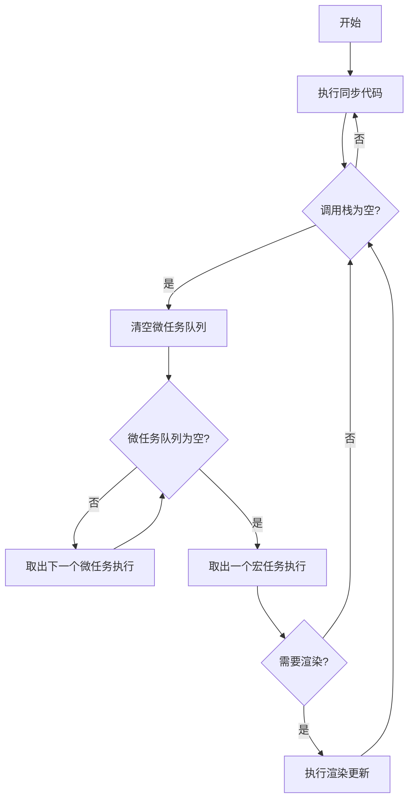

# 事件循环与异步

## 概述

事件循环（Event Loop）是 JavaScript 异步编程的核心机制，理解其运作原理是成为高级前端工程师的必经之路。JavaScript 采用单线程执行模型，但通过事件循环和任务队列的协作，实现了非阻塞异步操作。本文将深入剖析事件循环的完整执行流程，探讨微任务与宏任务的区别，以及 requestAnimationFrame、requestIdleCallback 的高级用法，并演示 Web Worker 如何帮助处理计算密集型任务。

## Event Loop 完整执行流程

### 执行上下文栈

JavaScript 引擎在执行代码时，维护一个**执行上下文栈（Execution Context Stack）**。当调用一个函数时，会创建一个新的执行上下文并压入栈中；函数执行完毕后，上下文从栈中弹出。

```javascript
// 执行顺序演示
function foo() {
  console.log('foo');
  bar();
}
function bar() {
  console.log('bar');
}
foo();
// 输出: foo -> bar
```

### 任务队列与事件循环

事件循环的核心逻辑是：**持续检查调用栈是否为空，如果为空，则从任务队列中取出第一个任务执行**。

```javascript
// 事件循环伪代码实现
while (true) {
  // 1. 执行同步任务（调用栈不为空时等待）
  // 2. 调用栈为空时，处理微任务队列
  while (microtaskQueue.isNotEmpty()) {
    const task = microtaskQueue.dequeue();
    executeTask(task);
  }
  // 3. 处理一个宏任务
  if (macroTaskQueue.isNotEmpty()) {
    const task = macroTaskQueue.dequeue();
    executeTask(task);
  }
  // 4. 渲染更新（浏览器环境）
  if (shouldBrowserRender()) {
    requestRendering();
  }
}
```

### 完整执行流程图解



## Microtask vs Macrotask 对比

### 任务类型分类

| 特性 | 微任务（Microtask） | 宏任务（Macrotask） |
|------|---------------------|---------------------|
| **代表API** | Promise.then/catch/finally<br>MutationObserver<br>queueMicrotask | setTimeout<br>setInterval<br>I/O操作<br>UI渲染<br>requestAnimationFrame |
| **执行时机** | 当前任务执行完毕后<br>渲染之前 | 下一轮事件循环<br>渲染之后 |
| **执行数量** | 清空整个队列 | 仅执行一个 |
| **优先级** | 较高 | 较低 |

### 实战演练

```javascript
console.log('1 - 同步代码');

setTimeout(() => {
  console.log('2 - setTimeout 宏任务');
}, 0);

Promise.resolve()
  .then(() => {
    console.log('3 - Promise 微任务');
  })
  .then(() => {
    console.log('4 - Promise 链式微任务');
  });

queueMicrotask(() => {
  console.log('5 - queueMicrotask 微任务');
});

console.log('6 - 同步代码结束');

// 输出顺序: 1 -> 6 -> 3 -> 5 -> 4 -> 2
```

### 深入理解微任务队列

微任务队列在每次宏任务执行完毕后会被**完全清空**，这意味着微任务可以产生新的微任务，形成链式反应。

```javascript
Promise.resolve()
  .then(() => {
    console.log('微任务1');
    Promise.resolve().then(() => {
      console.log('嵌套微任务');
    });
  })
  .then(() => {
    console.log('微任务2');
  });

// 输出: 微任务1 -> 嵌套微任务 -> 微任务2
// 即使嵌套，嵌套微任务也会在下一个微任务之前执行
```

### async/await 与微任务

`async` 函数隐式返回一个 Promise，`await` 关键字会使后面的代码成为微任务。

```javascript
async function asyncExample() {
  console.log('1 - async 函数开始');
  
  await Promise.resolve();
  console.log('2 - await 之后的代码（微任务）');
  
  await Promise.resolve();
  console.log('3 - 第二个 await 之后的代码');
}

console.log('4 - 同步代码');
asyncExample();
console.log('5 - 同步代码结束');

// 输出: 4 -> 1 -> 5 -> 2 -> 3
```

## requestAnimationFrame 与 requestIdleCallback

### requestAnimationFrame (rAF)

`requestAnimationFrame` 会在浏览器下一次重绘之前调用回调，常用于动画实现。

```javascript
class AnimationController {
  constructor() {
    this.isRunning = false;
    this.startTime = null;
    this.animationId = null;
  }

  start(duration = 2000) {
    this.isRunning = true;
    this.startTime = performance.now();
    
    const animate = (currentTime) => {
      if (!this.isRunning) return;
      
      const elapsed = currentTime - this.startTime;
      const progress = Math.min(elapsed / duration, 1);
      
      // 计算缓动值（ease-out cubic）
      const easedProgress = 1 - Math.pow(1 - progress, 3);
      
      // 应用到 DOM 元素
      const element = document.getElementById('animated-element');
      if (element) {
        element.style.transform = `translateX(${easedProgress * 300}px)`;
        element.style.opacity = 1 - easedProgress * 0.5;
      }
      
      if (progress < 1) {
        this.animationId = requestAnimationFrame(animate);
      } else {
        this.onComplete?.();
      }
    };
    
    this.animationId = requestAnimationFrame(animate);
  }

  stop() {
    this.isRunning = false;
    if (this.animationId) {
      cancelAnimationFrame(this.animationId);
    }
  }
}
```

### requestIdleCallback (rIC)

`requestIdleCallback` 允许在浏览器空闲时执行低优先级任务。

```javascript
// polyfill 兼容
const requestIdleCallback = window.requestIdleCallback || 
  function(callback) {
    return setTimeout(() => {
      callback({
        didTimeout: false,
        timeRemaining: () => 50
      });
    }, 1);
  };

const cancelIdleCallback = window.cancelIdleCallback || 
  function(id) {
    clearTimeout(id);
  };

// 使用示例：批量处理大数据
class BatchProcessor {
  constructor(options = {}) {
    this.batchSize = options.batchSize || 100;
    this.items = [];
    this.processingId = null;
  }

  addItems(newItems) {
    this.items.push(...newItems);
    this.scheduleProcessing();
  }

  scheduleProcessing() {
    if (this.processingId) return;

    this.processingId = requestIdleCallback(
      (deadline) => {
        while (
          this.items.length > 0 &&
          deadline.timeRemaining() > 0
        ) {
          this.processBatch();
        }
        
        this.processingId = null;
        
        if (this.items.length > 0) {
          this.scheduleProcessing();
        }
      },
      { timeout: 2000 } // 超过2秒强制执行
    );
  }

  processBatch() {
    const batch = this.items.splice(0, this.batchSize);
    batch.forEach(item => {
      // 处理每个项目
      this.processItem(item);
    });
  }

  processItem(item) {
    // 实际的处理逻辑
    console.log('Processing:', item);
  }
}

// 实际使用
const processor = new BatchProcessor({ batchSize: 50 });

// 添加大量数据
for (let i = 0; i < 1000; i++) {
  processor.addItems([{ id: i, data: `item-${i}` }]);
}
```

## Web Worker 使用

### 创建与通信

Web Worker 在独立线程中运行，适合处理计算密集型任务。

```javascript
// worker.js - Web Worker 文件
self.addEventListener('message', function(e) {
  const { type, data, id } = e.data;
  
  switch (type) {
    case 'fibonacci':
      const result = calculateFibonacci(data.n);
      self.postMessage({ type: 'fibonacci_result', id, result });
      break;
      
    case 'sort':
      const sorted = mergeSort(data.array);
      self.postMessage({ type: 'sort_result', id, result: sorted });
      break;
      
    case 'prime':
      const primes = findPrimes(data.max);
      self.postMessage({ type: 'prime_result', id, result: primes });
      break;
  }
});

function calculateFibonacci(n) {
  if (n <= 1) return n;
  let a = 0, b = 1;
  for (let i = 2; i <= n; i++) {
    [a, b] = [b, a + b];
  }
  return b;
}

function mergeSort(arr) {
  if (arr.length <= 1) return arr;
  const mid = Math.floor(arr.length / 2);
  const left = mergeSort(arr.slice(0, mid));
  const right = mergeSort(arr.slice(mid));
  return merge(left, right);
}

function merge(left, right) {
  const result = [];
  let i = 0, j = 0;
  while (i < left.length && j < right.length) {
    result.push(left[i] <= right[j] ? left[i++] : right[j++]);
  }
  return result.concat(left.slice(i)).concat(right.slice(j));
}

function findPrimes(max) {
  const sieve = new Array(max + 1).fill(true);
  sieve[0] = sieve[1] = false;
  for (let i = 2; i <= Math.sqrt(max); i++) {
    if (sieve[i]) {
      for (let j = i * i; j <= max; j += i) {
        sieve[j] = false;
      }
    }
  }
  return sieve.reduce((primes, isPrime, num) => {
    if (isPrime) primes.push(num);
    return primes;
  }, []);
}
```

```javascript
// main.js - 主线程
class WorkerManager {
  constructor() {
    this.worker = new Worker('worker.js');
    this.pendingRequests = new Map();
    this.requestId = 0;
    
    this.worker.addEventListener('message', this.handleMessage.bind(this));
    this.worker.addEventListener('error', this.handleError.bind(this));
  }

  sendRequest(type, data) {
    return new Promise((resolve, reject) => {
      const id = ++this.requestId;
      this.pendingRequests.set(id, { resolve, reject });
      this.worker.postMessage({ type, data, id });
    });
  }

  handleMessage(e) {
    const { type, id, result, error } = e.data;
    const pending = this.pendingRequests.get(id);
    
    if (pending) {
      if (error) {
        pending.reject(new Error(error));
      } else {
        pending.resolve(result);
      }
      this.pendingRequests.delete(id);
    }
  }

  handleError(error) {
    console.error('Worker error:', error);
  }

  // 便捷方法
  async fibonacci(n) {
    return this.sendRequest('fibonacci', { n });
  }

  async sort(array) {
    return this.sendRequest('sort', { array });
  }

  async findPrimes(max) {
    return this.sendRequest('prime', { max });
  }

  terminate() {
    this.worker.terminate();
  }
}

// 使用示例
const manager = new WorkerManager();

async function demo() {
  console.time('fibonacci');
  const fib45 = await manager.fibonacci(45);
  console.timeEnd('fibonacci');
  console.log('Fib(45) =', fib45);
  
  console.time('sort');
  const sorted = await manager.sort([64, 34, 25, 12, 22, 11, 90, 5, 77, 30, 40, 45, 58, 76, 89, 100, 2, 5, 8, 12, 15, 20, 25, 30, 35]);
  console.timeEnd('sort');
  console.log('Sorted:', sorted);
  
  console.time('primes');
  const primes = await manager.findPrimes(100000);
  console.timeEnd('primes');
  console.log('Found', primes.length, 'primes');
  
  manager.terminate();
}

demo();
```

### SharedWorker 实现跨标签页通信

```javascript
// shared-worker.js
const connections = new Set();

self.onconnect = function(e) {
  const port = e.ports[0];
  connections.add(port);
  
  port.onmessage = function(event) {
    // 广播消息到所有连接的标签页
    connections.forEach(client => {
      client.postMessage(event.data);
    });
  };
  
  port.start();
};
```

## async/await 高级用法

### 并行执行

```javascript
class AsyncBatchProcessor {
  // 并行执行多个异步任务（限制并发数）
  static async parallel(tasks, concurrency = 5) {
    const results = [];
    const executing = new Set();
    
    for (const task of tasks) {
      const promise = Promise.resolve().then(() => task());
      results.push(promise);
      executing.add(promise);
      
      if (executing.size >= concurrency) {
        await Promise.race(executing);
        executing.delete(promise);
      }
    }
    
    return Promise.all(results);
  }

  // 失败自动重试
  static async withRetry(fn, options = {}) {
    const {
      maxAttempts = 3,
      delay = 1000,
      backoff = 'exponential',
      onRetry = null
    } = options;
    
    let lastError;
    
    for (let attempt = 1; attempt <= maxAttempts; attempt++) {
      try {
        return await fn();
      } catch (error) {
        lastError = error;
        
        if (attempt === maxAttempts) {
          throw lastError;
        }
        
        const waitTime = backoff === 'exponential' 
          ? delay * Math.pow(2, attempt - 1)
          : delay * attempt;
        
        if (onRetry) {
          onRetry({ attempt, maxAttempts, waitTime, error });
        }
        
        await new Promise(resolve => setTimeout(resolve, waitTime));
      }
    }
  }

  // 超时控制
  static async withTimeout(promise, timeoutMs, errorMessage = 'Operation timed out') {
    let timeoutId;
    const timeoutPromise = new Promise((_, reject) => {
      timeoutId = setTimeout(() => {
        reject(new Error(errorMessage));
      }, timeoutMs);
    });
    
    try {
      return await Promise.race([promise, timeoutPromise]);
    } finally {
      clearTimeout(timeoutId);
    }
  }

  // 全部执行完成（包括失败）
  static async allSettled(tasks) {
    return Promise.allSettled(tasks);
  }
}

// 使用示例
async function demo() {
  // 并行执行
  const urls = ['url1', 'url2', 'url3', 'url4', 'url5', 'url6'];
  const results = await AsyncBatchProcessor.parallel(
    urls.map(url => () => fetch(url).then(r => r.json())),
    3 // 最多3个并发
  );

  // 带重试的请求
  const data = await AsyncBatchProcessor.withRetry(
    () => fetch('https://api.example.com/data').then(r => r.json()),
    {
      maxAttempts: 5,
      delay: 1000,
      onRetry: ({ attempt, waitTime }) => {
        console.log(`重试 ${attempt}，等待 ${waitTime}ms`);
      }
    }
  );

  // 超时控制
  try {
    const result = await AsyncBatchProcessor.withTimeout(
      fetch('https://slow-api.example.com/data'),
      5000,
      '请求超时'
    );
  } catch (error) {
    console.error(error.message);
  }
}
```

### 错误处理策略

```javascript
class RobustAsyncHandler {
  // 错误分类处理
  static async handle(fn, handlers = {}) {
    try {
      const result = await fn();
      if (handlers.success) {
        return handlers.success(result);
      }
      return result;
    } catch (error) {
      // 网络错误
      if (error.name === 'TypeError' && error.message.includes('fetch')) {
        if (handlers.networkError) {
          return handlers.networkError(error);
        }
      }
      
      // HTTP 错误
      if (error.status) {
        switch (error.status) {
          case 401:
            if (handlers.unauthorized) return handlers.unauthorized(error);
            break;
          case 403:
            if (handlers.forbidden) return handlers.forbidden(error);
            break;
          case 404:
            if (handlers.notFound) return handlers.notFound(error);
            break;
          case 500:
          case 502:
          case 503:
            if (handlers.serverError) return handlers.serverError(error);
            break;
        }
      }
      
      if (handlers.error) {
        return handlers.error(error);
      }
      throw error;
    }
  }

  // Promise 链式错误处理
  static async safePromiseChain(promise, ...errorHandlers) {
    return promise
      .catch(error => {
        const handler = errorHandlers.find(h => h.canHandle(error));
        if (handler) {
          return handler.handle(error);
        }
        throw error;
      });
  }
}
```

## 核心概念与设计哲学

### 异步编程范式的演进

JavaScript 异步编程的发展史反映了整个前端领域对非阻塞执行的追求与探索。

```
JavaScript 异步编程演进
├── 1995-2009: 回调地狱时代
│   ├── setTimeout/setInterval
│   ├── 事件监听器
│   └── 回调嵌套（回调地狱）
│
├── 2009-2015: Promise 萌芽时代
│   ├── jQuery Deferred
│   ├── Q Promise 库
│   ├── Promise/A+ 规范
│   └── 链式调用
│
├── 2015-2017: Promise 标准化时代
│   ├── ES2015 Promise 原生支持
│   ├── 生成器 (Generator)
│   └── co 库（Generator + Promise）
│
├── 2017至今: async/await 时代
│   ├── ES2017 async/await
│   ├── async 迭代器/生成器
│   └── 顶层 await (ES2022)
```

### 同步 vs 异步的本质

理解同步与异步的区别，是理解 JavaScript 事件循环的基础。

```javascript
// 同步执行 - 代码按顺序依次执行
console.log('1');
console.log('2');
console.log('3');
// 输出: 1 -> 2 -> 3（确定性的）

// 异步执行 - 代码不会立即执行完成
console.log('1');
setTimeout(() => console.log('3'), 0);
console.log('2');
// 输出: 1 -> 2 -> 3（异步回调在最后）

// 同步代码优先执行
// 即使 setTimeout 设置为 0，也会等同步代码执行完
```

### 事件循环的设计动机

JavaScript 设计为单线程有其历史原因和实际考量：

```javascript
// 单线程的优势
// 1. 简化 DOM 操作 - 不需要锁
document.getElementById('app').innerHTML = 'Hello';
document.getElementById('app').classList.add('active');
// 这两行代码不会产生竞态条件

// 2. 避免死锁
// 多线程环境需要处理复杂的同步问题

// 3. 简化调试
// 调用栈是线性的，容易追踪

// 单线程的挑战
// 1. CPU 密集型任务会阻塞 UI
function heavyComputation() {
  let result = 0;
  for (let i = 0; i < 1e9; i++) {
    result += i;
  }
  return result; // 这期间 UI 无响应
}

// 2. 解决方案：分片 + 事件循环
async function chunkedComputation() {
  let result = 0;
  for (let i = 0; i < 1e9; i++) {
    result += i;
    // 每处理 10000 个数字，让出主线程
    if (i % 10000 === 0) {
      await new Promise(resolve => setTimeout(resolve, 0));
    }
  }
  return result;
}

// 3. 更优方案：Web Worker
const worker = new Worker('compute.js');
```

---

## 详细原理解析

### 事件循环完整机制

事件循环是 JavaScript 运行时的心脏，它协调同步代码、异步回调和渲染更新。

```
事件循环完整流程图

┌─────────────────────────────────────────────────────────┐
│                        事件循环                          │
├─────────────────────────────────────────────────────────┤
│  1. 执行同步代码（调用栈）                                │
│     ↓                                                   │
│  2. 执行所有微任务（清空微任务队列）                        │
│     ↓                                                   │
│  3. 尝试渲染更新（如有必要且时机合适）                      │
│     ↓                                                   │
│  4. 取出一个宏任务执行                                    │
│     ↓                                                   │
│  5. 回到步骤 2                                          │
└─────────────────────────────────────────────────────────┘
```

**关键要点：**
- 微任务队列在每个宏任务后完全清空
- 渲染更新不一定每次循环都发生（浏览器优化）
- 微任务可以产生新的微任务，形成链式反应

```javascript
// 完整事件循环演示
console.log('1 - 同步开始');

setTimeout(() => {
  console.log('4 - setTimeout 1 (宏任务)');
  
  Promise.resolve().then(() => {
    console.log('6 - 微任务在宏任务中');
  });
}, 0);

queueMicrotask(() => {
  console.log('3 - 第一个微任务');
});

Promise.resolve().then(() => {
  console.log('5 - 链式微任务');
});

console.log('2 - 同步结束');

// 完整输出顺序：
// 1 - 同步开始
// 2 - 同步结束
// 3 - 第一个微任务
// 5 - 链式微任务
// 4 - setTimeout 1 (宏任务)
// 6 - 微任务在宏任务中
```

### 宏任务与微任务的深度对比

| 类型 | 示例 | 执行时机 | 队列数量 | 优先级 |
|------|------|----------|----------|--------|
| 微任务 | Promise.then, queueMicrotask, MutationObserver | 当前任务完成后、渲染前 | 一个队列 | 高 |
| 宏任务 | setTimeout, setInterval, I/O, UI 渲染 | 下一轮事件循环 | 多个队列 | 低 |

```javascript
// 微任务队列完全清空示例
Promise.resolve()
  .then(() => console.log('微任务 1'))
  .then(() => console.log('微任务 2'))
  .then(() => console.log('微任务 3'));

// 即使不断产生新微任务，也会全部执行
// 每次 .then() 返回新 Promise，
// 这个 Promise 的 resolve 会产生新的微任务

// 宏任务每次只执行一个
setTimeout(() => console.log('宏任务 1'), 0);
setTimeout(() => console.log('宏任务 2'), 0);
setTimeout(() => console.log('宏任务 3'), 0);
// 每次循环只执行一个 setTimeout

// 嵌套微任务 vs 宏任务
console.log('同步');

Promise.resolve().then(() => {
  console.log('微任务 A');
  Promise.resolve().then(() => {
    console.log('嵌套微任务'); // 仍在微任务阶段执行
  });
});

setTimeout(() => {
  console.log('宏任务');
}, 0);

// 输出: 同步 -> 微任务 A -> 嵌套微任务 -> 宏任务
```

### Node.js 事件循环与浏览器差异

Node.js 的事件循环实现与浏览器有显著区别。

```
Node.js 事件循环阶段

   ┌─────────────────────────────┐
   │           timers            │  setTimeout, setInterval
   │  pending callbacks (I/O)    │  延迟到下一个事件循环
   │        idle, prepare         │  内部使用
   │           poll              │  获取新的 I/O 事件
   │           check             │  setImmediate 回调
   │      close callbacks        │  socket.on('close')
   └─────────────────────────────┘
```

```javascript
// Node.js 特有的 setImmediate
setImmediate(() => {
  console.log('setImmediate');
});

setTimeout(() => {
  console.log('setTimeout');
}, 0);

// 输出顺序可能不确定（取决于系统）
// 但在 I/O 操作后，setImmediate 优先于 setTimeout

// Node.js 中的 process.nextTick
process.nextTick(() => {
  console.log('nextTick');
});

Promise.resolve().then(() => {
  console.log('Promise 微任务');
});

// 输出: nextTick -> Promise 微任务
// nextTick 比 Promise 微任务优先级更高
```

### 浏览器渲染与事件循环

浏览器渲染是事件循环的重要组成部分，但受到严格控制。

```javascript
// 渲染触发条件（不是每次循环都渲染）
// 1. 页面首次加载
// 2. requestAnimationFrame 回调
// 3. resize/scroll 事件（节流）
// 4. visibilitychange 事件

// requestAnimationFrame 与渲染
function animate() {
  // 这个回调在渲染之前执行
  // 适合更新动画
  requestAnimationFrame(animate);
}

// 渲染时序
// 同步代码
// 微任务
// 渲染（可能）
// 宏任务
// 渲染（可能）
// ...

// 实际渲染时机
setTimeout(() => {
  document.body.style.background = 'red';
}, 0);
// 可能需要下一次渲染周期才能看到效果

requestAnimationFrame(() => {
  document.body.style.background = 'blue';
});
// 会在下一次渲染前执行，效果更流畅
```

### 异步迭代器与生成器

ES2018 引入了异步迭代器，为处理异步数据流提供了优雅的方式。

```javascript
// 异步迭代器协议
const asyncIterator = {
  [Symbol.asyncIterator]() {
    return this;
  },
  async next() {
    // 返回 Promise
    return { value: 'item', done: false };
  }
};

// for await...of 循环
async function asyncLoop() {
  for await (const item of asyncIterator) {
    console.log(item);
  }
}

// 创建异步生成器
async function* asyncGenerator(urls) {
  for (const url of urls) {
    const response = await fetch(url);
    const data = await response.json();
    yield data;
  }
}

// 使用异步生成器
async function main() {
  const urls = ['/api/1', '/api/2', '/api/3'];
  
  for await (const data of asyncGenerator(urls)) {
    console.log(data);
  }
}

// 异步迭代器辅助函数
async function* mapAsync(iterable, fn) {
  for await (const item of iterable) {
    yield fn(item);
  }
}

async function* filterAsync(iterable, predicate) {
  for await (const item of iterable) {
    if (await predicate(item)) {
      yield item;
    }
  }
}

async function* takeAsync(iterable, n) {
  let i = 0;
  for await (const item of iterable) {
    if (i >= n) break;
    yield item;
    i++;
  }
}

// 使用示例：处理大文件流
async function processLargeFile(file) {
  const stream = file.stream();
  const reader = stream.getReader();
  
  async function* streamGenerator() {
    while (true) {
      const { done, value } = await reader.read();
      if (done) break;
      yield value;
    }
  }
  
  for await (const chunk of streamGenerator()) {
    await processChunk(chunk);
  }
}
```

### 错误传播与异常处理

异步代码的错误处理是防止应用崩溃的关键。

```javascript
// Promise 错误处理
fetch('/api/data')
  .then(response => {
    if (!response.ok) {
      throw new Error(`HTTP ${response.status}`);
    }
    return response.json();
  })
  .then(data => {
    console.log(data);
  })
  .catch(error => {
    console.error('请求失败:', error.message);
    // 错误会被捕获，不会继续传播
  })
  .finally(() => {
    console.log('请求完成（无论成功或失败）');
  });

// async/await 错误处理
async function fetchData() {
  try {
    const response = await fetch('/api/data');
    if (!response.ok) {
      throw new Error(`HTTP ${response.status}`);
    }
    return await response.json();
  } catch (error) {
    console.error('获取数据失败:', error);
    throw error; // 可以重新抛出
  }
}

// 全局未处理 rejection 事件
window.addEventListener('unhandledrejection', (event) => {
  console.error('未处理的 Promise 错误:', event.reason);
  event.preventDefault(); // 阻止默认行为
});

// Node.js 中
process.on('unhandledRejection', (reason, promise) => {
  console.error('未处理的 Promise 拒绝:', reason);
});

// 错误恢复策略
async function withRetry(fn, options = {}) {
  const { maxAttempts = 3, delay = 1000, backoff = 'exponential' } = options;
  
  for (let attempt = 1; attempt <= maxAttempts; attempt++) {
    try {
      return await fn();
    } catch (error) {
      if (attempt === maxAttempts) throw error;
      
      const waitTime = delay * Math.pow(backoff === 'exponential' ? 2 : 1, attempt - 1);
      await new Promise(resolve => setTimeout(resolve, waitTime));
      
      console.log(`重试 ${attempt}/${maxAttempts}，等待 ${waitTime}ms`);
    }
  }
}

// 使用指数退避
async function fetchWithBackoff(url, maxRetries = 3) {
  for (let i = 0; i < maxRetries; i++) {
    try {
      return await fetch(url);
    } catch (error) {
      if (i === maxRetries - 1) throw error;
      await new Promise(resolve => 
        setTimeout(resolve, Math.min(1000 * Math.pow(2, i), 30000))
      );
    }
  }
}
```

---

## 常用 API 详解

### Promise API 完整指南

```javascript
// Promise 构造函数
new Promise((resolve, reject) => {
  // executor 函数立即执行
  // resolve(value) - 成功
  // reject(error) - 失败
});

// 静态方法
Promise.resolve(value); // 创建已 resolved 的 Promise
Promise.reject(error);   // 创建已 rejected 的 Promise
Promise.all(promises);   // 所有成功才成功
Promise.allSettled(promises); // 等待所有完成
Promise.race(promises); // 首个完成（无论成功/失败）
Promise.any(promises);   // 首个成功（忽略失败）

// Promise.all - 全有或全无
const urls = ['/api/1', '/api/2', '/api/3'];
const results = await Promise.all(urls.map(url => fetch(url)));

// Promise.allSettled - 获取所有结果
const results = await Promise.allSettled([
  fetch('/api/1'),
  fetch('/api/2'),
]);

results.forEach((result, index) => {
  if (result.status === 'fulfilled') {
    console.log(`API ${index} 成功:`, result.value);
  } else {
    console.log(`API ${index} 失败:`, result.reason);
  }
});

// Promise.race - 超时模式
const withTimeout = (promise, timeout) => {
  return Promise.race([
    promise,
    new Promise((_, reject) => 
      setTimeout(() => reject(new Error('Timeout')), timeout)
    ),
  ]);
};

// Promise.any - 容错模式
async function fetchFirst() {
  const responses = [
    fetch('/api/primary'),
    fetch('/api/backup'),
    fetch('/api/tertiary'),
  ];
  
  try {
    const response = await Promise.any(responses);
    return response.json();
  } catch (error) {
    console.error('所有 API 都失败了:', error.errors);
    throw error;
  }
}

// Promise.withResolvers (ES2024)
const { promise, resolve, reject } = Promise.withResolvers();
```

### async/await 完整指南

```javascript
// async 函数总是返回 Promise
async function example() {
  return 42;
}

example().then(console.log); // 42

// await 暂停函数执行，等待 Promise
async function fetchUser(id) {
  const response = await fetch(`/api/users/${id}`);
  const user = await response.json();
  return user;
}

// 并行 vs 顺序
async function sequential() {
  const a = await fetchA(); // 等待 A 完成
  const b = await fetchB(); // 然后才请求 B
  return [a, b];
}

async function parallel() {
  const [a, b] = await Promise.all([fetchA(), fetchB()]);
  return [a, b];
}

// 顶层 await (ES2022, 模块顶层)
const data = await fetch('/api/data').then(r => r.json());

// 条件异步
async function conditional() {
  if (condition) {
    return await fetchData();
  }
  return defaultData;
}

// 错误处理模式
async function robust() {
  try {
    const data = await fetchData();
    return data;
  } catch (error) {
    if (error instanceof NetworkError) {
      return fallbackData;
    }
    if (error instanceof ValidationError) {
      throw error;
    }
    throw error;
  } finally {
    cleanup(); // 总是执行
  }
}

// 串行处理数组
async function processSerially(items) {
  const results = [];
  for (const item of items) {
    const result = await processItem(item);
    results.push(result);
  }
  return results;
}

// 并行处理数组（受限制）
async function processLimited(items, concurrency = 5) {
  const chunks = [];
  for (let i = 0; i < items.length; i += concurrency) {
    chunks.push(items.slice(i, i + concurrency));
  }
  
  const results = [];
  for (const chunk of chunks) {
    const chunkResults = await Promise.all(
      chunk.map(item => processItem(item))
    );
    results.push(...chunkResults);
  }
  return results;
}
```

### setTimeout 与 setInterval 详解

```javascript
// setTimeout - 延迟执行一次
const timeoutId = setTimeout(callback, delay, ...args);

// 清除
clearTimeout(timeoutId);

// 最小延迟是 1ms，但实际取决于浏览器
setTimeout(() => console.log('Hello'), 1);

// setInterval - 重复执行
const intervalId = setInterval(callback, delay, ...args);

// 清除
clearInterval(intervalId);

// 使用示例：轮询
async function poll(fn, condition, interval = 1000) {
  while (await condition()) {
    await fn();
    await new Promise(resolve => setTimeout(resolve, interval));
  }
}

// setTimeout 实现 setInterval（更可控）
function setInterval2(fn, delay) {
  let timeoutId;
  
  function repeat() {
    fn();
    timeoutId = setTimeout(repeat, delay);
  }
  
  timeoutId = setTimeout(repeat, delay);
  
  return {
    clear() {
      clearTimeout(timeoutId);
    }
  };
}

// 动画帧率控制
let lastFrameTime = 0;
const FRAME_RATE = 60;
const FRAME_DELAY = 1000 / FRAME_RATE;

function gameLoop(currentTime) {
  const elapsed = currentTime - lastFrameTime;
  
  if (elapsed >= FRAME_DELAY) {
    lastFrameTime = currentTime - (elapsed % FRAME_DELAY);
    update();
    render();
  }
  
  requestAnimationFrame(gameLoop);
}
```

### requestAnimationFrame 详解

```javascript
// 基本用法
const animationId = requestAnimationFrame(callback);

// callback 接收当前时间戳（DOMHighResTimeStamp）
function animate(currentTime) {
  // 计算动画进度
  const progress = (currentTime - startTime) / duration;
  
  // 应用变换
  element.style.transform = `translateX(${progress * 100}px)`;
  
  if (progress < 1) {
    requestAnimationFrame(animate);
  }
}

// 取消动画
cancelAnimationFrame(animationId);

// 完整动画控制器
class AnimationController {
  constructor(element) {
    this.element = element;
    this.animationId = null;
    this.startTime = null;
    this.duration = 1000;
    this.easing = t => t * t * t; // easeInOutCubic
    this.onUpdate = null;
    this.onComplete = null;
  }

  start() {
    this.startTime = performance.now();
    this.animate = this.animate.bind(this);
    this.animationId = requestAnimationFrame(this.animate);
  }

  animate(currentTime) {
    const elapsed = currentTime - this.startTime;
    let progress = Math.min(elapsed / this.duration, 1);
    progress = this.easing(progress);
    
    if (this.onUpdate) {
      this.onUpdate(progress);
    }
    
    if (progress < 1) {
      this.animationId = requestAnimationFrame(this.animate);
    } else {
      if (this.onComplete) {
        this.onComplete();
      }
    }
  }

  stop() {
    if (this.animationId) {
      cancelAnimationFrame(this.animationId);
      this.animationId = null;
    }
  }
}

// 使用
const anim = new AnimationController(box);
anim.duration = 2000;
anim.easing = t => t < 0.5 ? 2 * t * t : 1 - Math.pow(-2 * t + 2, 2) / 2;
anim.onUpdate = (progress) => {
  box.style.transform = `translateX(${progress * 300}px)`;
};
anim.start();
```

### requestIdleCallback 详解

```javascript
// 基本用法
const idleId = requestIdleCallback(callback, options);

// callback 接收 IdleDeadline
function callback(deadline) {
  // timeRemaining() 返回剩余时间（毫秒）
  while (deadline.timeRemaining() > 0) {
    // 执行任务
  }
  
  // didTimeout 表示是否超时
  if (deadline.didTimeout) {
    // 立即执行完成
  }
}

// options
requestIdleCallback(callback, {
  timeout: 2000 // 最多等待 2 秒
});

// 取消
cancelIdleCallback(idleId);

// Polyfill
const requestIdleCallback = window.requestIdleCallback || function(cb) {
  return setTimeout(() => {
    cb({
      didTimeout: false,
      timeRemaining: () => 50
    });
  }, 1);
};

// 批量处理任务
class IdleTaskQueue {
  constructor() {
    this.tasks = [];
    this.isProcessing = false;
  }

  add(task, options = {}) {
    return new Promise((resolve) => {
      this.tasks.push({ task, resolve, options });
      this.schedule();
    });
  }

  schedule() {
    if (this.isProcessing) return;
    
    this.isProcessing = true;
    
    requestIdleCallback((deadline) => {
      while (this.tasks.length > 0 && deadline.timeRemaining() > 0) {
        const { task, resolve } = this.tasks.shift();
        try {
          task();
          resolve();
        } catch (error) {
          resolve(Promise.reject(error));
        }
      }
      
      this.isProcessing = false;
      
      if (this.tasks.length > 0) {
        this.schedule();
      }
    });
  }
}

// 使用示例
const queue = new IdleTaskQueue();

queue.add(() => processAnalytics());
queue.add(() => updateCache());
queue.add(() => generateReport());
```

### Web Worker 完整指南

```javascript
// worker.js - 专用 Worker
self.onmessage = ({ data }) => {
  // 处理数据
  const result = compute(data);
  
  // 发送结果
  self.postMessage(result);
  
  // 发送带类型的结果
  self.postMessage({ type: 'RESULT', payload: result });
  
  // 错误处理
  self.onerror = (error) => {
    console.error('Worker error:', error);
  };
};

// 可转移对象（高效转移所有权）
const buffer = new ArrayBuffer(1024);
worker.postMessage({ buffer }, [buffer]);
// buffer 的所有权转移到 worker

// 共享 Worker（多个标签页共享）
const sharedWorker = new SharedWorker('shared-worker.js');

sharedWorker.port.start();
sharedWorker.port.postMessage('hello');
sharedWorker.port.onmessage = (event) => {
  console.log('Received:', event.data);
};

// Service Worker（特殊类型的 Worker）
// service-worker.js
self.addEventListener('install', (event) => {
  event.waitUntil(
    caches.open('v1').then(cache => {
      return cache.addAll([
        '/',
        '/index.html',
        '/style.css',
        '/main.js',
      ]);
    })
  );
});

self.addEventListener('fetch', (event) => {
  event.respondWith(
    caches.match(event.request).then(response => {
      return response || fetch(event.request);
    })
  );
});

// 主线程使用 Service Worker
if ('serviceWorker' in navigator) {
  navigator.serviceWorker.register('/service-worker.js').then((registration) => {
    console.log('Service Worker registered:', registration);
  });
}
```

---

## 实战代码示例

### 完整异步数据流管理

```javascript
// 数据管理器
class DataManager {
  constructor() {
    this.cache = new Map();
    this.pending = new Map();
  }

  async fetch(key, fetcher, options = {}) {
    const { ttl = 60000, staleTime = 0, refresh } = options;
    
    // 返回缓存数据（如果新鲜）
    if (!refresh && this.cache.has(key)) {
      const cached = this.cache.get(key);
      if (Date.now() - cached.timestamp < staleTime) {
        return cached.data;
      }
    }
    
    // 返回已有请求
    if (this.pending.has(key)) {
      return this.pending.get(key);
    }
    
    // 创建新请求
    const promise = (async () => {
      try {
        const data = await fetcher();
        this.cache.set(key, {
          data,
          timestamp: Date.now(),
        });
        return data;
      } finally {
        this.pending.delete(key);
      }
    })();
    
    this.pending.set(key, promise);
    return promise;
  }

  invalidate(key) {
    this.cache.delete(key);
  }

  clear() {
    this.cache.clear();
    this.pending.clear();
  }
}

// 使用示例
const dataManager = new DataManager();

const users = await dataManager.fetch(
  'users',
  () => fetch('/api/users').then(r => r.json()),
  { ttl: 300000, staleTime: 60000 }
);
```

### 并发控制与请求合并

```javascript
// 请求合并器
class RequestBatcher {
  constructor(batchFn, options = {}) {
    this.batchFn = batchFn;
    this.interval = options.interval || 100;
    this.maxBatchSize = options.maxBatchSize || 100;
    this.pending = new Map();
    this.timer = null;
  }

  request(key, ...args) {
    if (!this.pending.has(key)) {
      this.pending.set(key, []);
    }
    
    return new Promise((resolve, reject) => {
      this.pending.get(key).push({ args, resolve, reject });
      
      if (this.pending.size >= this.maxBatchSize) {
        this.flush();
      } else if (!this.timer) {
        this.timer = setTimeout(() => this.flush(), this.interval);
      }
    });
  }

  async flush() {
    if (this.timer) {
      clearTimeout(this.timer);
      this.timer = null;
    }
    
    const batch = new Map(this.pending);
    this.pending.clear();
    
    try {
      const results = await this.batchFn(
        Array.from(batch.entries()).map(([key, requests]) => ({
          key,
          args: requests.map(r => r.args),
        }))
      );
      
      for (const [key, requests] of batch) {
        const result = results[key];
        requests.forEach(({ resolve }) => resolve(result));
      }
    } catch (error) {
      for (const [, requests] of batch) {
        requests.forEach(({ reject }) => reject(error));
      }
    }
  }
}

// 使用示例：批量获取用户
const userBatcher = new RequestBatcher(async (requests) => {
  const ids = requests.flatMap(r => r.args[0]);
  const response = await fetch('/api/users/batch', {
    method: 'POST',
    body: JSON.stringify({ ids }),
  });
  const users = await response.json();
  
  const userMap = new Map(users.map(u => [u.id, u]));
  
  return Object.fromEntries(
    requests.map(({ key, args }) => [key, userMap.get(args[0])])
  );
});

async function getUser(id) {
  return userBatcher.request(id, id);
}
```

### 异步状态机

```javascript
// 异步状态机
class AsyncStateMachine {
  constructor(initialState, transitions) {
    this.state = initialState;
    this.transitions = transitions;
    this.listeners = new Set();
  }

  async transition(action, ...args) {
    const transition = this.transitions[this.state]?.[action];
    
    if (!transition) {
      throw new Error(`Invalid transition: ${action} from ${this.state}`);
    }
    
    const prevState = this.state;
    this.state = transition.next;
    
    try {
      if (typeof transition.execute === 'function') {
        const result = await transition.execute(...args);
        this.notify({ type: 'success', prevState, state: this.state, result });
        return result;
      }
      this.notify({ type: 'transition', prevState, state: this.state });
    } catch (error) {
      this.state = prevState;
      this.notify({ type: 'error', prevState, state: this.state, error });
      throw error;
    }
  }

  on(callback) {
    this.listeners.add(callback);
    return () => this.listeners.delete(callback);
  }

  notify(event) {
    this.listeners.forEach(cb => cb(event));
  }
}

// 使用示例：加载状态机
const loadingMachine = new AsyncStateMachine('idle', {
  idle: {
    load: {
      next: 'loading',
      execute: async (url) => {
        const response = await fetch(url);
        if (!response.ok) throw new Error('Failed to load');
        return response.json();
      },
    },
  },
  loading: {
    success: {
      next: 'success',
    },
    error: {
      next: 'error',
    },
  },
  success: {
    reload: {
      next: 'loading',
    },
  },
  error: {
    retry: {
      next: 'loading',
    },
  },
});

loadingMachine.on(({ type, state, error }) => {
  console.log(`State changed to ${state}, type: ${type}`);
  if (error) console.error(error);
});

const data = await loadingMachine.transition('load', '/api/data');
```

### 异步队列与重试策略

```javascript
// 异步任务队列
class AsyncQueue {
  constructor(options = {}) {
    this.concurrency = options.concurrency || 1;
    this.running = 0;
    this.queue = [];
  }

  add(task) {
    return new Promise((resolve, reject) => {
      this.queue.push({ task, resolve, reject });
      this.process();
    });
  }

  async process() {
    if (this.running >= this.concurrency) return;
    
    const item = this.queue.shift();
    if (!item) return;
    
    this.running++;
    
    try {
      const result = await item.task();
      item.resolve(result);
    } catch (error) {
      item.reject(error);
    } finally {
      this.running--;
      this.process();
    }
  }

  clear() {
    this.queue.forEach(({ reject }) => reject(new Error('Queue cleared')));
    this.queue = [];
  }
}

// 重试策略
class RetryStrategy {
  static exponential(options = {}) {
    const { maxAttempts = 3, baseDelay = 1000, maxDelay = 30000 } = options;
    
    return async (fn) => {
      for (let attempt = 1; attempt <= maxAttempts; attempt++) {
        try {
          return await fn();
        } catch (error) {
          if (attempt === maxAttempts) throw error;
          
          const delay = Math.min(baseDelay * Math.pow(2, attempt - 1), maxDelay);
          const jitter = Math.random() * delay * 0.1;
          
          await new Promise(resolve => setTimeout(resolve, delay + jitter));
        }
      }
    };
  }

  static linear(options = {}) {
    const { maxAttempts = 3, delay = 1000 } = options;
    
    return async (fn) => {
      for (let attempt = 1; attempt <= maxAttempts; attempt++) {
        try {
          return await fn();
        } catch (error) {
          if (attempt === maxAttempts) throw error;
          await new Promise(resolve => setTimeout(resolve, delay));
        }
      }
    };
  }

  static fibonacci(options = {}) {
    const { maxAttempts = 5, baseDelay = 1000 } = options;
    
    return async (fn) => {
      let delay = 0;
      let nextDelay = baseDelay;
      
      for (let attempt = 1; attempt <= maxAttempts; attempt++) {
        try {
          return await fn();
        } catch (error) {
          if (attempt === maxAttempts) throw error;
          
          await new Promise(resolve => setTimeout(resolve, delay));
          [delay, nextDelay] = [nextDelay, delay + nextDelay];
        }
      }
    };
  }
}

// 使用示例
const queue = new AsyncQueue({ concurrency: 3 });
const retry = RetryStrategy.exponential({ maxAttempts: 3 });

async function uploadFile(file) {
  return queue.add(() => retry(() => uploadToServer(file)));
}
```

---

## 性能优化技巧

### 避免阻塞主线程

```javascript
// 1. 大计算任务分片
async function processLargeArray(arr, processFn, chunkSize = 1000) {
  const results = [];
  
  for (let i = 0; i < arr.length; i += chunkSize) {
    const chunk = arr.slice(i, i + chunkSize);
    const chunkResults = chunk.map(processFn);
    results.push(...chunkResults);
    
    // 让出主线程
    await new Promise(resolve => setTimeout(resolve, 0));
  }
  
  return results;
}

// 2. 使用 Worker 处理计算
function processInWorker(data) {
  return new Promise((resolve, reject) => {
    const worker = new Worker('processor.js');
    worker.onmessage = ({ data }) => resolve(data);
    worker.onerror = (error) => reject(error);
    worker.postMessage(data);
  });
}

// 3. requestIdleCallback 处理非紧急任务
function processNonUrgent(task) {
  return new Promise((resolve) => {
    requestIdleCallback(() => {
      const result = task();
      resolve(result);
    }, { timeout: 5000 });
  });
}

// 4. 虚拟滚动（长列表优化）
class VirtualScroll {
  constructor(container, options) {
    this.container = container;
    this.itemHeight = options.itemHeight || 50;
    this.items = options.items || [];
    this.renderItem = options.renderItem;
    
    this.scrollTop = 0;
    this.visibleCount = Math.ceil(container.clientHeight / this.itemHeight) + 2;
    
    this.setupScrollListener();
    this.render();
  }

  setupScrollListener() {
    this.container.addEventListener('scroll', () => {
      this.scrollTop = this.container.scrollTop;
      requestAnimationFrame(() => this.render());
    });
  }

  render() {
    const startIndex = Math.floor(this.scrollTop / this.itemHeight);
    const endIndex = Math.min(startIndex + this.visibleCount, this.items.length);
    
    const totalHeight = this.items.length * this.itemHeight;
    const offsetY = startIndex * this.itemHeight;
    
    this.container.style.height = `${totalHeight}px`;
    
    const visibleItems = this.items.slice(startIndex, endIndex);
    const fragment = document.createDocumentFragment();
    
    visibleItems.forEach((item, index) => {
      const el = this.renderItem(item);
      el.style.position = 'absolute';
      el.style.top = `${(startIndex + index) * this.itemHeight}px`;
      el.style.height = `${this.itemHeight}px`;
      fragment.appendChild(el);
    });
    
    this.container.innerHTML = '';
    this.container.appendChild(fragment);
  }
}
```

### 优化微任务使用

```javascript
// 1. 避免在微任务中创建大量微任务
// 差
function bad() {
  for (let i = 0; i < 10000; i++) {
    queueMicrotask(() => process(i));
  }
}

// 好：批量处理
function good() {
  const BATCH_SIZE = 100;
  let index = 0;
  
  function processBatch() {
    const end = Math.min(index + BATCH_SIZE, 10000);
    for (let i = index; i < end; i++) {
      process(i);
    }
    index = end;
    
    if (index < 10000) {
      queueMicrotask(processBatch);
    }
  }
  
  queueMicrotask(processBatch);
}

// 2. 合并微任务更新
class BatchedUpdater {
  constructor(updateFn) {
    this.updateFn = updateFn;
    this.pending = false;
    this.data = null;
  }

  schedule(data) {
    this.data = data;
    if (!this.pending) {
      this.pending = true;
      Promise.resolve().then(() => {
        this.pending = false;
        this.updateFn(this.data);
      });
    }
  }
}

// 3. MutationObserver 批量更新
const observer = new MutationObserver((mutations) => {
  // 批量处理所有变更
  const additions = mutations.flatMap(m => [...m.addedNodes]);
  const deletions = mutations.flatMap(m => [...m.removedNodes]);
  
  // 批量更新
  batchUpdate(additions, deletions);
});

observer.observe(document.body, {
  childList: true,
  subtree: true,
});
```

### 渲染优化

```javascript
// 1. 使用 requestAnimationFrame 节流
function rafThrottle(fn) {
  let ticking = false;
  
  return function(...args) {
    if (!ticking) {
      requestAnimationFrame(() => {
        fn.apply(this, args);
        ticking = false;
      });
      ticking = true;
    }
  };
}

// 2. will-change 优化
function enableHardwareAcceleration(element) {
  element.style.willChange = 'transform';
  element.style.transform = 'translateZ(0)';
  
  // 动画结束后移除
  element.addEventListener('transitionend', () => {
    element.style.willChange = 'auto';
  }, { once: true });
}

// 3. 合成层分离
// 将动画元素提升为独立合成层
.animated-element {
  will-change: transform;
  transform: translateZ(0);
}

// 4. CSS contain 属性
.card {
  contain: content; /* 或 layout paint */
}

// 5. 批量 DOM 更新
function batchDOMUpdates(fn) {
  requestAnimationFrame(() => {
    requestAnimationFrame(fn);
  });
}
```

---

## 与同类技术对比

### JavaScript 异步 vs 其他语言

| 特性 | JavaScript | Python | Go | Rust |
|------|------------|--------|-----|------|
| **并发模型** | 事件循环 | asyncio/threading | Goroutines | async/await |
| **线程模型** | 单线程 | 多线程 | 多线程 | 多线程 |
| **内存共享** | 受限 | 受限 | 支持 | 受限 |
| **适用场景** | I/O 密集 | 通用 | 通用/并发 | 系统编程 |
| **学习曲线** | 低 | 中 | 中 | 高 |

```javascript
// JavaScript Promise vs Python asyncio
// JavaScript
async function fetchData(url) {
  const response = await fetch(url);
  return response.json();
}

// Python
import aiohttp

async def fetch_data(url):
    async with aiohttp.ClientSession() as session:
        async with session.get(url) as response:
            return await response.json()
```

### 回调 vs Promise vs async/await

| 特性 | 回调 | Promise | async/await |
|------|------|---------|--------------|
| **可读性** | 差（嵌套） | 好（链式） | 优秀（同步风格） |
| **错误处理** | 分散 | 集中（.catch） | try/catch |
| **组合性** | 困难 | 好 | 优秀 |
| **调试** | 困难 | 较好 | 好 |
| **浏览器支持** | 原生 | ES2015+ | ES2017+ |

### Web Worker vs Service Worker vs SharedWorker

| 类型 | 用途 | 生命周期 | 通信方式 |
|------|------|----------|----------|
| **Web Worker** | 计算密集任务 | 与创建者页面共存 | postMessage |
| **SharedWorker** | 跨标签页共享 | 独立于页面 | port.postMessage |
| **Service Worker** | 代理网络请求 | 独立于页面 | postMessage |

### 状态管理库对比

| 库 | 异步处理 | 社区 | 学习曲线 |
|----|----------|------|----------|
| **Redux Thunk** | 内置中间件 | 大 | 中 |
| **Redux Saga** | Generator | 大 | 高 |
| **MobX** | 自动响应 | 中 | 低 |
| **Zustand** | 手动处理 | 小 | 低 |
| **RTK Query** | 自动缓存 | 中 | 低 |

---

## 常见问题与解决方案

### 问题 1: async 函数返回 undefined

```javascript
// 问题
async function getValue() {
  return getValueSync(); // 忘记 await
}

// 解决方案
async function getValue() {
  return await getValueSync();
}
```

### 问题 2: await 在循环中顺序执行

```javascript
// 问题：串行执行，性能差
async function bad(items) {
  const results = [];
  for (const item of items) {
    results.push(await processItem(item)); // 等待每个完成
  }
  return results;
}

// 解决方案：并行执行
async function good(items) {
  return Promise.all(items.map(item => processItem(item)));
}
```

### 问题 3: 忘记处理 Promise rejection

```javascript
// 问题
fetch('/api/data')
  .then(data => console.log(data));
// 错误不会被处理

// 解决方案 1：添加 catch
fetch('/api/data')
  .then(data => console.log(data))
  .catch(error => console.error(error));

// 解决方案 2：使用 await
try {
  const data = await fetch('/api/data');
} catch (error) {
  console.error(error);
}
```

### 问题 4: 在构造函数中使用 async

```javascript
// 问题
class User {
  constructor(id) {
    this.data = fetchUser(id); // 返回 Promise，不是 data
  }
}

// 解决方案：使用静态工厂方法
class User {
  constructor(data) {
    this.data = data;
  }

  static async create(id) {
    const data = await fetchUser(id);
    return new User(data);
  }
}
```

### 问题 5: 异步循环中的索引问题

```javascript
// 问题
for (var i = 0; i < 3; i++) {
  setTimeout(() => console.log(i), 100); // 输出 3, 3, 3
}

// 解决方案 1：使用 let
for (let i = 0; i < 3; i++) {
  setTimeout(() => console.log(i), 100); // 输出 0, 1, 2
}

// 解决方案 2：IIFE
for (var i = 0; i < 3; i++) {
  ((j) => setTimeout(() => console.log(j), 100))(i);
}

// 异步循环的正确方式
async function asyncLoop() {
  const items = [1, 2, 3];
  
  for (const item of items) {
    await processItem(item);
  }
}
```

### 问题 6: 并行请求中的错误处理

```javascript
// 问题
async function fetchAll(urls) {
  return Promise.all(urls.map(url => fetch(url)));
  // 一个失败，全部失败
}

// 解决方案 1：Promise.allSettled
async function fetchAll1(urls) {
  const results = await Promise.allSettled(urls.map(url => fetch(url)));
  return results.map((result, i) => {
    if (result.status === 'fulfilled') {
      return { success: true, data: result.value };
    }
    return { success: false, error: result.reason };
  });
}

// 解决方案 2：容错模式
async function fetchAll2(urls) {
  return Promise.all(
    urls.map(async (url) => {
      try {
        return { success: true, data: await fetch(url) };
      } catch (error) {
        return { success: false, error };
      }
    })
  );
}
```

### 问题 7: 内存泄漏

```javascript
// 问题：未清理的事件监听器
function subscribe(handler) {
  document.addEventListener('click', handler);
  // 没有返回取消订阅的方法
}

// 解决方案
function subscribe(handler) {
  const wrappedHandler = (...args) => handler(...args);
  document.addEventListener('click', wrappedHandler);
  
  return () => {
    document.removeEventListener('click', wrappedHandler);
  };
}

// 使用 AbortController
function subscribe(handler) {
  const controller = new AbortController();
  document.addEventListener('click', handler, { signal: controller.signal });
  
  return () => controller.abort();
}
```

### 问题 8: 竞态条件

```javascript
// 问题
let cache = null;

async function getData() {
  if (!cache) {
    cache = fetch('/api/data'); // 发起请求
  }
  return cache;
}

// 多个并发调用会发起多个请求

// 解决方案
const cachePromise = fetch('/api/data');
cache = cachePromise;

async function getData() {
  return cachePromise;
}

// 或使用类
class DataCache {
  #promise = null;

  async get() {
    if (!this.#promise) {
      this.#promise = fetch('/api/data');
    }
    return this.#promise;
  }
}
```

// 或使用类
class DataCache {
  #promise = null;

  async get() {
    if (!this.#promise) {
      this.#promise = fetch('/api/data');
    }
    return this.#promise;
  }
}
```

---

## 深度实战案例

### 完整的异步任务调度器

```javascript
// 异步任务调度器
class TaskScheduler {
  constructor(options = {}) {
    this.maxConcurrent = options.maxConcurrent || 5;
    this.maxQueueSize = options.maxQueueSize || Infinity;
    this.retryDelay = options.retryDelay || 1000;
    this.maxRetries = options.maxRetries || 3;

    this.running = 0;
    this.queue = [];
    this.results = new Map();
    this.taskId = 0;
  }

  // 添加任务
  add(task, options = {}) {
    const { priority = 0, timeout = 30000 } = options;

    if (this.queue.length >= this.maxQueueSize) {
      throw new Error('Queue is full');
    }

    const id = ++this.taskId;
    const taskItem = {
      id,
      task,
      priority,
      timeout,
      retries: 0,
      status: 'pending',
      resolve: null,
      reject: null
    };

    // 创建 Promise
    const promise = new Promise((resolve, reject) => {
      taskItem.resolve = resolve;
      taskItem.reject = reject;
    });

    // 插入队列（按优先级排序）
    const insertIndex = this.queue.findIndex(item => item.priority < priority);
    if (insertIndex === -1) {
      this.queue.push(taskItem);
    } else {
      this.queue.splice(insertIndex, 0, taskItem);
    }

    // 自动开始处理
    this.processQueue();

    return { id, promise };
  }

  // 处理队列
  async processQueue() {
    while (this.queue.length > 0 && this.running < this.maxConcurrent) {
      const task = this.queue.shift();
      if (!task) break;

      this.running++;
      task.status = 'running';

      this.executeTask(task)
        .then(task.resolve)
        .catch(task.reject)
        .finally(() => {
          this.running--;
          this.processQueue();
        });
    }
  }

  // 执行任务
  async executeTask(task) {
    try {
      const result = await Promise.race([
        task.task(),
        this.createTimeout(task.timeout)
      ]);

      task.status = 'completed';
      this.results.set(task.id, { status: 'fulfilled', value: result });
      return result;
    } catch (error) {
      task.status = 'failed';

      if (task.retries < this.maxRetries) {
        task.retries++;
        task.status = 'pending';

        // 延迟重试
        await this.delay(this.retryDelay * task.retries);
        this.queue.unshift(task);
        this.processQueue();
      } else {
        this.results.set(task.id, { status: 'rejected', reason: error });
        throw error;
      }
    }
  }

  // 创建超时 Promise
  createTimeout(ms) {
    return new Promise((_, reject) => {
      setTimeout(() => reject(new Error('Task timeout')), ms);
    });
  }

  // 延迟
  delay(ms) {
    return new Promise(resolve => setTimeout(resolve, ms));
  }

  // 取消任务
  cancel(id) {
    const index = this.queue.findIndex(t => t.id === id);
    if (index !== -1) {
      this.queue.splice(index, 1);
      this.results.set(id, { status: 'cancelled' });
      return true;
    }
    return false;
  }

  // 获取任务状态
  getStatus(id) {
    return this.results.get(id);
  }

  // 等待所有任务完成
  async waitAll() {
    const pending = this.queue.filter(t => t.status === 'pending');
    return Promise.all(pending.map(t => t.promise));
  }

  // 清空队列
  clear() {
    this.queue.forEach(task => {
      task.reject(new Error('Queue cleared'));
    });
    this.queue = [];
  }
}

// 使用示例
const scheduler = new TaskScheduler({
  maxConcurrent: 3,
  maxRetries: 2,
  retryDelay: 1000
});

// 添加任务
scheduler.add(async () => {
  const response = await fetch('/api/users');
  return response.json();
}, { priority: 1 });

scheduler.add(async () => {
  const response = await fetch('/api/posts');
  return response.json();
}, { priority: 2 });

// 批量添加
const tasks = [
  { task: () => fetch('/api/1').then(r => r.json()), priority: 1 },
  { task: () => fetch('/api/2').then(r => r.json()), priority: 2 },
  { task: () => fetch('/api/3').then(r => r.json()), priority: 1 }
];

tasks.forEach(({ task, priority }) => scheduler.add(task, { priority }));
```

### 流式数据处理系统

```javascript
// 流式数据处理管道
class StreamPipeline {
  constructor() {
    this.transformers = [];
    this.filters = [];
    this.bufferSize = 100;
    this.buffer = [];
    this.isProcessing = false;
  }

  // 添加转换器
  pipe(transform) {
    this.transformers.push(transform);
    return this;
  }

  // 添加过滤器
  filter(predicate) {
    this.filters.push(predicate);
    return this;
  }

  // 设置缓冲区大小
  setBufferSize(size) {
    this.bufferSize = size;
    return this;
  }

  // 写入数据
  write(data) {
    return new Promise((resolve, reject) => {
      const process = async () => {
        try {
          let result = data;

          // 应用所有过滤器
          for (const filter of this.filters) {
            if (!filter(result)) {
              resolve(null);
              return;
            }
          }

          // 应用所有转换器
          for (const transformer of this.transformers) {
            result = await transformer(result);
          }

          this.buffer.push(result);

          // 缓冲区满时清空
          if (this.buffer.length >= this.bufferSize) {
            this.flush();
          }

          resolve(result);
        } catch (error) {
          reject(error);
        }
      };

      process();
    });
  }

  // 批量写入
  async writeBatch(dataArray) {
    const results = [];
    for (const data of dataArray) {
      const result = await this.write(data);
      if (result !== null) {
        results.push(result);
      }
    }
    return results;
  }

  // 清空缓冲区
  flush() {
    const data = this.buffer.splice(0, this.buffer.length);
    if (this.onFlush) {
      this.onFlush(data);
    }
    return data;
  }

  // 设置刷新回调
  onFlush(callback) {
    this.onFlush = callback;
    return this;
  }

  // 结束流
  async end() {
    return this.flush();
  }
}

// 使用示例
const stream = new StreamPipeline()
  .setBufferSize(10)
  .filter(data => data.valid)  // 过滤无效数据
  .pipe(async data => ({ ...data, processed: true }))  // 转换数据
  .pipe(async data => enrichData(data))  // 丰富数据
  .onFlush(dataArray => {
    console.log('Flushing batch:', dataArray.length, 'items');
    batchInsert(dataArray);
  });

// 写入数据
for (const item of dataSource) {
  await stream.write(item);
}

// 结束流
await stream.end();
```

### 异步锁实现

```javascript
// 异步锁（防止并发竞争）
class AsyncLock {
  constructor() {
    this._locks = new Map();
    this._queue = new Map();
  }

  // 获取锁
  async acquire(key) {
    if (!this._locks.has(key)) {
      this._locks.set(key, null);
      return { key, release: () => this.release(key) };
    }

    // 已有锁，加入等待队列
    if (!this._queue.has(key)) {
      this._queue.set(key, []);
    }

    return new Promise((resolve) => {
      this._queue.get(key).push({
        resolve,
        timestamp: Date.now()
      });
    }).then(() => {
      return { key, release: () => this.release(key) };
    });
  }

  // 释放锁
  release(key) {
    const queue = this._queue.get(key);
    if (queue && queue.length > 0) {
      // 唤醒下一个等待者
      const next = queue.shift();
      next.resolve();
    } else {
      // 没有等待者，释放锁
      this._locks.delete(key);
      this._queue.delete(key);
    }
  }

  // 检查是否被锁定
  isLocked(key) {
    return this._locks.has(key);
  }

  // 带锁执行
  async withLock(key, fn) {
    const lock = await this.acquire(key);
    try {
      return await fn();
    } finally {
      lock.release();
    }
  }

  // 清除所有锁
  clear() {
    this._locks.clear();
    this._queue.clear();
  }
}

// 使用示例
const lock = new AsyncLock();

// 保护共享资源
async function updateSharedResource(id, data) {
  return lock.withLock(`resource:${id}`, async () => {
    const current = await fetch(`/api/resources/${id}`);
    const updated = { ...current, ...data, updatedAt: Date.now() };
    await save(`/api/resources/${id}`, updated);
    return updated;
  });
}

// 并发更新会被序列化
Promise.all([
  updateSharedResource(1, { value: 1 }),
  updateSharedResource(1, { value: 2 }),
  updateSharedResource(1, { value: 3 })
]);
```

### 异步数据流管理系统

```javascript
// 可取消的异步操作
class CancellableOperation {
  constructor() {
    this.controller = new AbortController();
    this.aborted = false;
  }

  abort() {
    this.aborted = true;
    this.controller.abort();
  }

  get signal() {
    return this.controller.signal;
  }

  async execute(fn) {
    if (this.aborted) {
      throw new Error('Operation was cancelled before execution');
    }

    try {
      const result = await fn(this.controller.signal);
      return result;
    } catch (error) {
      if (error.name === 'AbortError') {
        throw new Error('Operation cancelled');
      }
      throw error;
    }
  }
}

// 异步操作管理器
class AsyncOperationManager {
  constructor() {
    this.operations = new Map();
    this.id = 0;
  }

  // 创建操作
  create(fn) {
    const id = ++this.id;
    const operation = new CancellableOperation();
    this.operations.set(id, operation);

    const promise = operation.execute(fn)
      .finally(() => this.operations.delete(id));

    return {
      id,
      promise,
      abort: () => operation.abort(),
      signal: operation.signal
    };
  }

  // 取消所有操作
  abortAll() {
    this.operations.forEach(op => op.abort());
    this.operations.clear();
  }

  // 取消指定操作
  abort(id) {
    const operation = this.operations.get(id);
    if (operation) {
      operation.abort();
      this.operations.delete(id);
    }
  }
}

// 使用示例
const manager = new AsyncOperationManager();

// 创建多个操作
const op1 = manager.create(async (signal) => {
  const response = await fetch('/api/data1', { signal });
  return response.json();
});

const op2 = manager.create(async (signal) => {
  const response = await fetch('/api/data2', { signal });
  return response.json();
});

// 等待结果
const [data1, data2] = await Promise.all([op1.promise, op2.promise]);

// 取消所有操作
manager.abortAll();

// 取消单个操作
manager.abort(op1.id);
```

### 完整的流式 API 处理

```javascript
// 流式 API 请求
async function streamRequest(url, options = {}) {
  const { 
    onChunk, 
    onProgress, 
    onComplete, 
    onError,
    signal 
  } = options;

  const response = await fetch(url, { signal });
  const reader = response.body.getReader();
  const contentLength = response.headers.get('Content-Length');
  let receivedLength = 0;
  let chunks = [];

  const decoder = new TextDecoder();

  try {
    while (true) {
      const { done, value } = await reader.read();

      if (done) {
        if (onComplete) {
          onComplete(chunks.join(''), receivedLength);
        }
        break;
      }

      chunks.push(decoder.decode(value, { stream: true }));
      receivedLength += value.length;

      if (onChunk) {
        onChunk(decoder.decode(value, { stream: true }), receivedLength);
      }

      if (onProgress && contentLength) {
        const progress = (receivedLength / contentLength) * 100;
        onProgress(progress, receivedLength, contentLength);
      }
    }

    return chunks.join('');
  } catch (error) {
    if (onError) {
      onError(error);
    }
    throw error;
  }
}

// JSON 流式解析
async function streamJSON(url) {
  let buffer = '';
  let depth = 0;
  let inString = false;
  let escaped = false;
  let currentObject = null;
  let objects = [];

  await streamRequest(url, {
    onChunk(chunk) {
      buffer += chunk;

      for (let i = 0; i < buffer.length; i++) {
        const char = buffer[i];

        if (escaped) {
          escaped = false;
          continue;
        }

        if (char === '\\') {
          escaped = true;
          continue;
        }

        if (char === '"') {
          inString = !inString;
          continue;
        }

        if (inString) continue;

        if (char === '{') depth++;
        if (char === '}') {
          depth--;
          if (depth === 0) {
            // 完整的对象
            const objStr = buffer.substring(0, i + 1);
            buffer = buffer.substring(i + 1);
            objects.push(JSON.parse(objStr));
          }
        }
      }
    },
    onComplete() {
      // 处理剩余数据
      if (buffer.trim()) {
        try {
          objects.push(JSON.parse(buffer));
        } catch (e) {
          // 忽略不完整的数据
        }
      }
    }
  });

  return objects;
}

// 使用示例
await streamRequest('http://example.com/stream', {
  onChunk(chunk) {
    process.stdout.write(chunk);
  },
  onProgress(percent, received, total) {
    console.log(`Progress: ${percent.toFixed(1)}%`);
  },
  onComplete(fullData) {
    console.log('Complete!');
  },
  onError(error) {
    console.error('Error:', error);
  }
});
```

---

## 高级性能优化

### 任务分片与时间片

```javascript
// 时间片执行器
class TimeSlicer {
  constructor(options = {}) {
    this.timeSlice = options.timeSlice || 5;  // 毫秒
    this.yieldCallback = options.yieldCallback || (() => {});
  }

  // 分片执行
  async run(tasks, options = {}) {
    const { onProgress, onComplete, onError } = options;
    const results = [];
    let completed = 0;

    for (let i = 0; i < tasks.length; i++) {
      const task = tasks[i];

      const startTime = performance.now();

      try {
        const result = await this.executeWithSlice(task);
        results.push({ success: true, value: result });
      } catch (error) {
        results.push({ success: false, error });
        if (onError) onError(error, i);
      }

      completed++;
      if (onProgress) {
        onProgress(completed / tasks.length, completed, tasks.length);
      }

      // 让出时间片
      if (i < tasks.length - 1) {
        await this.yield();
      }
    }

    if (onComplete) onComplete(results);
    return results;
  }

  // 带时间片执行
  async executeWithSlice(task) {
    if (task instanceof Function) {
      return task();
    }
    if (task && typeof task.next === 'function') {
      // 处理生成器
      while (true) {
        const { value, done } = task.next();
        if (done) return value;

        const elapsed = performance.now();
        if (elapsed % this.timeSlice < 1) {
          await this.yield();
        }
      }
    }
    return task;
  }

  // 让出主线程
  yield() {
    return new Promise(resolve => {
      this.yieldCallback();
      setTimeout(resolve, 0);
    });
  }
}

// 使用示例
const slicer = new TimeSlicer({ timeSlice: 5 });

// 处理大量数据
const largeArray = Array.from({ length: 100000 }, (_, i) => i);

await slicer.run(largeArray.map(item => () => processItem(item)), {
  onProgress(percent, completed, total) {
    progressBar.update(percent);
  },
  onComplete(results) {
    console.log('Processing complete');
    const failed = results.filter(r => !r.success).length;
    console.log(`Failed: ${failed}`);
  }
});
```

### 防抖节流高级实现

```javascript
// 带状态管理的防抖
class StatefulDebounce {
  constructor(options = {}) {
    this.wait = options.wait || 300;
    this.initialValue = options.initialValue;
    this.result = null;
    this.pending = false;
    this.timeoutId = null;
    this.resolve = null;
  }

  call(fn) {
    return new Promise((resolve) => {
      this.resolve = resolve;

      if (this.timeoutId) {
        clearTimeout(this.timeoutId);
      }

      if (!this.pending && this.initialValue !== undefined) {
        this.resolve(this.initialValue);
        this.initialValue = undefined;
      }

      this.timeoutId = setTimeout(async () => {
        this.pending = true;
        try {
          this.result = await fn();
          this.resolve(this.result);
        } finally {
          this.pending = false;
        }
      }, this.wait);
    });
  }

  cancel() {
    if (this.timeoutId) {
      clearTimeout(this.timeoutId);
      this.timeoutId = null;
    }
    this.pending = false;
  }

  flush() {
    if (this.resolve && this.pending) {
      this.resolve(this.result);
    }
  }
}

// 带节流的滚动监听
function createThrottledScrollListener(callback, options = {}) {
  const { limit = 100, leading = true, trailing = true } = options;
  let callCount = 0;
  let lastCallTime = 0;
  let timeoutId = null;

  return function onScroll(event) {
    const now = Date.now();
    callCount++;

    if (leading && callCount === 1) {
      callback(event);
      lastCallTime = now;
    }

    if (trailing && !timeoutId) {
      timeoutId = setTimeout(() => {
        if (callCount > limit) {
          callback(event);
          callCount = 0;
        }
        timeoutId = null;
      }, Math.max(limit - (now - lastCallTime), 0));
    }

    callCount = Math.min(callCount, limit);
  };
}

// 使用示例
const debouncer = new StatefulDebounce({ wait: 300 });

async function search(query) {
  return debouncer.call(async () => {
    const response = await fetch(`/api/search?q=${query}`);
    return response.json();
  });
}

// 搜索框输入
input.addEventListener('input', (e) => {
  search(e.target.value).then(results => {
    renderResults(results);
  });
});
```

### 内存优化技术

```javascript
// 对象池
class ObjectPool {
  constructor(factory, options = {}) {
    this.factory = factory;
    this.maxSize = options.maxSize || 100;
    this.validator = options.validator || (() => true);
    this.reset = options.reset || (() => {});

    this.pool = [];
    this.inUse = new Set();

    // 预热
    this.warmup(options.initialSize || 10);
  }

  warmup(count) {
    for (let i = 0; i < count; i++) {
      this.pool.push(this.factory());
    }
  }

  acquire() {
    let obj = this.pool.pop();

    if (!obj) {
      obj = this.factory();
    }

    if (!this.validator(obj)) {
      obj = this.factory();
    }

    this.inUse.add(obj);
    return obj;
  }

  release(obj) {
    if (!this.inUse.has(obj)) return;

    this.inUse.delete(obj);
    this.reset(obj);

    if (this.pool.length < this.maxSize) {
      this.pool.push(obj);
    }
  }

  clear() {
    this.pool = [];
    this.inUse.clear();
  }

  get stats() {
    return {
      poolSize: this.pool.length,
      inUse: this.inUse.size,
      total: this.pool.length + this.inUse.size
    };
  }
}

// 使用示例
const bufferPool = new ObjectPool(
  () => new ArrayBuffer(1024),
  {
    maxSize: 50,
    reset: (buffer) => {
      // 重置缓冲区
      new Uint8Array(buffer).fill(0);
    }
  }
);

// 使用缓冲区
const buffer = bufferPool.acquire();
// ... 使用 buffer
bufferPool.release(buffer);

// WeakRef 用于缓存
class WeakCache {
  constructor(maxSize = 100) {
    this.cache = new Map();
    this.refs = new Map();
    this.maxSize = maxSize;
  }

  get(key) {
    const ref = this.refs.get(key);
    if (ref) {
      const value = ref.deref();
      if (value) {
        // 更新访问顺序
        this.cache.delete(key);
        this.cache.set(key, value);
        return value;
      }
    }
    return null;
  }

  set(key, value) {
    // 清理超出大小的旧值
    if (this.cache.size >= this.maxSize) {
      const oldestKey = this.cache.keys().next().value;
      this.delete(oldestKey);
    }

    this.cache.set(key, value);
    this.refs.set(key, new WeakRef(value));
  }

  delete(key) {
    this.cache.delete(key);
    this.refs.delete(key);
  }

  clear() {
    this.cache.clear();
    this.refs.clear();
  }
}
```

---

## 与同类技术深度对比

### JavaScript async vs 其他语言的异步模型

| 特性 | JavaScript | C# | Kotlin | Rust |
|------|------------|-----|--------|------|
| 语法 | async/await | async/await | suspend | async/await |
| Future 类型 | Promise | Task<T> | Deferred<T> | Future<T> |
| 并发控制 | Promise.all | Task.WhenAll | coroutinesScope | tokio::join! |
| 取消机制 | AbortController | CancellationToken | Job | tokio::select! |
| 错误处理 | try/catch | try/catch | Result/throw | Result<T,E> |
| 流处理 | AsyncIterator | IAsyncEnumerable | Flow | Stream<T> |

```csharp
// C# async 示例
public async Task<User> GetUserAsync(int id)
{
    try
    {
        var response = await httpClient.GetAsync($"/api/users/{id}");
        response.EnsureSuccessStatusCode();
        return await response.Content.ReadFromJsonAsync<User>();
    }
    catch (HttpRequestException ex)
    {
        logger.LogError(ex, "Failed to fetch user");
        throw;
    }
}
```

```kotlin
// Kotlin 协程示例
suspend fun getUser(id: Int): User {
    return withContext(Dispatchers.IO) {
        try {
            val response = httpClient.get("/api/users/$id")
            response.json<User>()
        } catch (e: HttpException) {
            logger.error("Failed to fetch user", e)
            throw e
        }
    }
}

// 并发执行
suspend fun getUsers(ids: List<Int>) = coroutineScope {
    ids.map { async { getUser(it) } }.awaitAll()
}
```

```rust
// Rust async 示例
async fn get_user(client: &Client, id: u32) -> Result<User, reqwest::Error> {
    let response = client
        .get(&format!("/api/users/{}", id))
        .send()
        .await?;

    Ok(response.json::<User>().await?)
}

// 并发执行
async fn get_users(client: &Client, ids: Vec<u32>) -> Vec<Result<User, reqwest::Error>> {
    let futures = ids.iter().map(|id| get_user(client, *id));
    futures::future::join_all(futures).await
}
```

### 事件循环实现对比

```javascript
// 浏览器事件循环（简化版）
class BrowserEventLoop {
  constructor() {
    this.callStack = [];
    this.microtaskQueue = [];
    this.macrotaskQueue = [];
  }

  // 调度微任务
  enqueueMicrotask(task) {
    this.microtaskQueue.push(task);
  }

  // 调度宏任务
  enqueueMacrotask(task) {
    this.macrotaskQueue.push(task);
  }

  // 执行一个 tick
  tick() {
    // 1. 执行微任务（清空队列）
    while (this.microtaskQueue.length > 0) {
      const task = this.microtaskQueue.shift();
      task();
    }

    // 2. 执行一个宏任务
    if (this.macrotaskQueue.length > 0) {
      const task = this.macrotaskQueue.shift();
      task();
    }

    // 3. 渲染更新（浏览器）
    if (shouldRender()) {
      requestAnimationFrame(flushRender);
    }
  }
}

// Node.js 事件循环
class NodeEventLoop {
  // Node.js 事件循环阶段
  static phases = [
    'timers',
    'pending callbacks',
    'idle, prepare',
    'poll',
    'check',
    'close callbacks'
  ];

  // setImmediate 在 check 阶段执行
  setImmediate(callback) {
    this.phases.get('check').push(callback);
  }

  // process.nextTick 优先级最高
  nextTick(callback) {
    this.nextTickQueue.push(callback);
  }

  // 微任务（Promise）优先级高于 nextTick
  enqueueMicrotask(task) {
    this.microtaskQueue.push(task);
  }
}
```

---

## 常见问题与解决方案（续）

### 问题 9: async 生成器的背压处理

```javascript
// 问题：快速生产者和慢速消费者导致内存堆积
async function* badGenerator() {
  const items = await fetchAll();  // 快速获取大量数据
  for (const item of items) {
    yield item;  // 快速产生，但不等待消费
  }
}

// 解决方案：背压控制
async function* controlledGenerator(source) {
  const buffer = [];
  const bufferSize = 10;
  let producerDone = false;

  // 生产者
  (async () => {
    for await (const item of source) {
      if (buffer.length >= bufferSize) {
        // 缓冲区满，等待消费
        await new Promise(resolve => {
          const check = () => {
            if (buffer.length < bufferSize) resolve();
            else setTimeout(check, 10);
          };
          check();
        });
      }
      buffer.push(item);
    }
    producerDone = true;
  })();

  // 消费者
  while (!producerDone || buffer.length > 0) {
    if (buffer.length === 0) {
      await new Promise(resolve => setTimeout(resolve, 10));
      continue;
    }
    yield buffer.shift();
  }
}
```

### 问题 10: 并发请求去重

```javascript
// 问题：相同请求被发送多次
function search(query) {
  return fetch(`/api/search?q=${query}`);
}

search('javascript');  // 发送
search('javascript');  // 再次发送

// 解决方案：请求缓存
class RequestDeduplicator {
  constructor() {
    this.cache = new Map();
  }

  async request(key, fetcher) {
    if (this.cache.has(key)) {
      return this.cache.get(key);
    }

    const promise = fetcher().finally(() => {
      // 短暂缓存后清除
      setTimeout(() => {
        if (this.cache.get(key) === promise) {
          this.cache.delete(key);
        }
      }, 1000);
    });

    this.cache.set(key, promise);
    return promise;
  }
}

// 使用
const dedup = new RequestDeduplicator();

async function search(query) {
  return dedup.request(`search:${query}`, () => 
    fetch(`/api/search?q=${query}`)
  );
}
```

### 问题 11: 异步循环中的异常聚合

```javascript
// 问题：异步循环中的错误处理不完整
async function processAll(items) {
  const errors = [];
  
  for (const item of items) {
    try {
      await processItem(item);
    } catch (error) {
      errors.push({ item, error });
    }
  }
  
  if (errors.length > 0) {
    throw new AggregateError(errors, 'Some items failed');
  }
}

// 更好的方式：收集所有结果
async function processAllDetailed(items) {
  const results = await Promise.allSettled(
    items.map(item => processItem(item))
  );

  const succeeded = [];
  const failed = [];

  results.forEach((result, index) => {
    if (result.status === 'fulfilled') {
      succeeded.push({ index, value: result.value });
    } else {
      failed.push({ index, error: result.reason });
    }
  });

  return { succeeded, failed, total: items.length };
}
```

### 问题 12: 嵌套 Promise 的处理

```javascript
// 问题：Promise.resolve 处理嵌套 Promise
const nested = Promise.resolve(Promise.resolve(Promise.resolve(1)));
Promise.resolve(nested).then(v => console.log(v));  // 展平到最内层

// 正确处理方式
async function flattenPromise(promise) {
  return promise;
}

// 使用
async function processWithRetry(promiseFactory, maxRetries = 3) {
  for (let i = 0; i < maxRetries; i++) {
    try {
      const promise = promiseFactory();
      return await promise;
    } catch (error) {
      if (i === maxRetries - 1) throw error;
      await delay(1000 * Math.pow(2, i));
    }
  }
}
```

---

## 高级调试技巧

### 异步调用栈追踪

```javascript
// 异步调用栈增强
class AsyncStackTracker {
  constructor() {
    this.stacks = new Map();
    this.enabled = false;
  }

  enable() {
    this.enabled = true;
  }

  disable() {
    this.enabled = false;
  }

  track(promise, context = '') {
    if (!this.enabled) return promise;

    const stack = new Error().stack;
    this.stacks.set(promise, { stack, context, created: Date.now() });

    return promise
      .then(result => {
        this.stacks.delete(promise);
        return result;
      })
      .catch(error => {
        const info = this.stacks.get(promise);
        if (info) {
          error.asyncStack = info;
        }
        this.stacks.delete(promise);
        throw error;
      });
  }

  getActiveStacks() {
    return Array.from(this.stacks.entries()).map(([promise, info]) => ({
      promise,
      ...info,
      age: Date.now() - info.created
    }));
  }

  findLongRunning(threshold = 5000) {
    return this.getActiveStacks().filter(s => s.age > threshold);
  }
}

// 使用
const tracker = new AsyncStackTracker();
tracker.enable();

async function slowOperation() {
  await delay(3000);
}

const promise = tracker.track(slowOperation(), 'User action');
tracker.findLongRunning().forEach(s => {
  console.log('Long running operation:', s.context, s.age);
});
```

### Promise 可视化调试

```javascript
// Promise 状态可视化
class PromiseVisualizer {
  constructor() {
    this.promises = new Map();
  }

  wrap(promise, name) {
    const id = Math.random().toString(36).slice(2);
    const startTime = performance.now();

    this.promises.set(id, {
      name,
      status: 'pending',
      startTime,
      endTime: null,
      result: null
    });

    console.group(`Promise created: ${name} [${id}]`);

    return promise
      .then(result => {
        this.update(id, 'fulfilled', result);
        console.log(`✓ ${name} resolved:`, result);
        console.groupEnd();
        return result;
      })
      .catch(error => {
        this.update(id, 'rejected', error);
        console.error(`✗ ${name} rejected:`, error);
        console.groupEnd();
        throw error;
      });
  }

  update(id, status, result) {
    const info = this.promises.get(id);
    if (info) {
      info.status = status;
      info.endTime = performance.now();
      info.result = result;
    }
  }

  getStats() {
    const stats = {
      total: this.promises.size,
      pending: 0,
      fulfilled: 0,
      rejected: 0,
      avgDuration: 0
    };

    let totalDuration = 0;
    let completed = 0;

    this.promises.forEach(info => {
      stats[info.status]++;
      if (info.endTime) {
        totalDuration += info.endTime - info.startTime;
        completed++;
      }
    });

    if (completed > 0) {
      stats.avgDuration = totalDuration / completed;
    }

    return stats;
  }
}

// 使用
const visualizer = new PromiseVisualizer();

visualizer.wrap(fetch('/api/users'), 'Fetch users')
  .then(users => visualizer.wrap(Promise.all(users.map(u => fetch(`/api/users/${u.id}`))), 'Fetch user details'))
  .then(() => console.log('Stats:', visualizer.getStats()));
```

---

---

## 深度原理解析

### 事件循环的浏览器实现

浏览器中的事件循环由多个组件协同工作：

```javascript
// 事件循环的核心组件
// ┌─────────────────────────────────────────────────────────────┐
// │                        主线程                                │
// │  ┌─────────────────────────────────────────────────────┐   │
// │  │              JavaScript 引擎                          │   │
// │  │  ┌─────────────┐  ┌─────────────┐  ┌───────────┐   │   │
// │  │  │ 调用栈      │  │ 执行上下文   │  │ 编译优化  │   │   │
// │  │  │ (Call      │  │ (Context)   │  │           │   │   │
// │  │  │  Stack)    │  │             │  │ JIT 编译  │   │   │
// │  │  └─────────────┘  └─────────────┘  └───────────┘   │   │
// │  └─────────────────────────────────────────────────────┘   │
// │                          ↓                                 │
// │  ┌─────────────────────────────────────────────────────┐   │
// │  │              任务队列                                │   │
// │  │  ┌─────────────┐  ┌─────────────┐  ┌───────────┐   │   │
// │  │  │ 微任务队列  │  │ 宏任务队列  │  │ 渲染队列  │   │   │
// │  │  │ (Microtask │  │ (Macrotask │  │           │   │   │
// │  │  │  Queue)    │  │  Queue)    │  │ rAF 回调  │   │   │
// │  │  └─────────────┘  └─────────────┘  └───────────┘   │   │
// │  └─────────────────────────────────────────────────────┘   │
// └─────────────────────────────────────────────────────────────┘

// 事件循环伪代码
function eventLoop() {
  while (true) {
    // 1. 执行调用栈中的所有同步代码
    runCallStack();
    
    // 2. 清空微任务队列
    while (microtaskQueue.isNotEmpty()) {
      const task = microtaskQueue.dequeue();
      runTask(task);
    }
    
    // 3. 判断是否需要渲染
    if (shouldRender()) {
      // 执行 beforeDOMMutationCallbacks
      runBeforeDOMMutationCallbacks();
      
      // 执行 DOM 修改
      runDOMModifications();
      
      // 计算样式
      calculateStyles();
      
      // 布局计算
      calculateLayout();
      
      // 绘制
      paint();
      
      // 执行 requestAnimationFrame 回调
      runRAFCallbacks();
      
      // 执行 IntersectionObserver 回调
      runIntersectionCallbacks();
    }
    
    // 4. 从宏任务队列取出一个任务执行
    if (macrotaskQueue.isNotEmpty()) {
      const task = macrotaskQueue.dequeue();
      runTask(task);
    }
    
    // 5. 重复循环
  }
}

// shouldRender 的条件
function shouldRender() {
  return (
    document.hidden === false &&  // 页面可见
    !document.body.compositing  // 未在合成中
  );
}
```

### 微任务队列的完整机制

```javascript
// 微任务来源
// 1. Promise.then/catch/finally
Promise.resolve().then(() => console.log('microtask'));

// 2. queueMicrotask
queueMicrotask(() => console.log('microtask'));

// 3. MutationObserver
const observer = new MutationObserver(() => console.log('mutation'));
observer.observe(element, { attributes: true });

// 4. Object.observe (已废弃)

// 5. queueMicrotask 底层实现
function queueMicrotaskPolyfill(callback) {
  Promise.resolve()
    .then(callback)
    .catch(error => {
      setTimeout(() => { throw error; });
    });
}

// 微任务执行顺序
console.log('1');

queueMicrotask(() => {
  console.log('2');
  queueMicrotask(() => console.log('3'));
});

Promise.resolve().then(() => console.log('4'));

console.log('5');

// 输出: 1, 5, 2, 3, 4
// 说明：微任务可以嵌套添加微任务，全部在同步代码后执行

// MutationObserver 示例
const observer = new MutationObserver((mutations) => {
  console.log('Mutation observed:', mutations.length);
  
  // 在回调中添加新观察
  mutations.forEach(mutation => {
    if (mutation.type === 'attributes' && mutation.attributeName === 'class') {
      console.log('Class changed to:', mutation.target.className);
    }
  });
});

observer.observe(document.body, {
  childList: true,
  subtree: true,
  attributes: true
});

// 批量 Mutation 观察
document.body.classList.add('test1');
document.body.classList.add('test2');
document.body.classList.add('test3');
// 所有变更会被批量处理为一个回调
```

### 宏任务队列的完整机制

```javascript
// 宏任务类型和优先级
// 优先级从高到低：
// 1. setTimeout (定时器)
// 2. setInterval (定时器)
// 3. I/O 操作
// 4. UI 渲染 (在某些浏览器中)
// 5. requestAnimationFrame
// 6. setImmediate (Node.js)

// setTimeout 实现原理
class TimerQueue {
  #timers = new Map();
  #id = 0;
  #running = false;
  #startTime = 0;
  
  setTimeout(callback, delay, ...args) {
    const id = ++this.#id;
    const dueTime = performance.now() + delay;
    
    this.#timers.set(id, {
      callback,
      args,
      dueTime,
      type: 'timeout'
    });
    
    this.#schedule();
    return id;
  }
  
  clearTimeout(id) {
    this.#timers.delete(id);
  }
  
  #schedule() {
    if (this.#running) return;
    
    const nextTimer = this.#getNextTimer();
    if (!nextTimer) return;
    
    this.#running = true;
    const delay = Math.max(0, nextTimer.dueTime - performance.now());
    
    setTimeout(() => this.#processTimers(), delay);
  }
  
  #processTimers() {
    this.#running = false;
    const now = performance.now();
    
    for (const [id, timer] of this.#timers) {
      if (timer.dueTime <= now) {
        timer.callback(...timer.args);
        this.#timers.delete(id);
      }
    }
    
    this.#schedule();
  }
  
  #getNextTimer() {
    let earliest = null;
    for (const timer of this.#timers.values()) {
      if (!earliest || timer.dueTime < earliest.dueTime) {
        earliest = timer;
      }
    }
    return earliest;
  }
}

// setInterval 的实现
function setInterval(callback, delay, ...args) {
  let id;
  function repeat() {
    id = setTimeout(repeat, delay);
    callback(...args);
  }
  id = setTimeout(repeat, delay);
  return () => clearTimeout(id);
}

// 宏任务执行时机
console.log('同步 1');

setTimeout(() => console.log('setTimeout 1'), 0);
setTimeout(() => {
  console.log('setTimeout 2');
  queueMicrotask(() => console.log('嵌套微任务'));
}, 0);

Promise.resolve().then(() => console.log('Promise 1'));

console.log('同步 2');

// 输出: 同步 1, 同步 2, Promise 1, setTimeout 1, setTimeout 2, 嵌套微任务

// 注意：setTimeout 的 0ms 实际上至少有 1ms 延迟（大多数浏览器）
```

### 浏览器渲染时序

```javascript
// 渲染触发时机
// ┌─────────────────────────────────────────────────────────────┐
// │                    事件循环周期                              │
// ├─────────────────────────────────────────────────────────────┤
// │ 1. 执行微任务（清空队列）                                    │
// │ 2. 判断是否需要渲染                                          │
// │    - document.hidden === false                             │
// │    - requestAnimationFrame 回调是否注册                      │
// │    - 距上次渲染是否达到 16.67ms (60fps)                     │
// │ 3. 执行渲染更新                                             │
// │    - rIC (requestIdleCallback)                            │
// │    - 样式计算                                              │
// │    - 布局计算                                              │
// │    - 绘制                                                  │
// │    - 合成                                                  │
// │ 4. 执行一个宏任务                                           │
// └─────────────────────────────────────────────────────────────┘

// requestAnimationFrame 时序
function animate() {
  // 这个回调在"绘制"阶段之前执行
  // 适合更新动画属性
  updateAnimation();
  
  requestAnimationFrame(animate);
}

// rAF vs setTimeout(0) 性能对比
// setTimeout(0) 可能导致丢帧
let start = performance.now();
let frames = 0;

function countFramesRAF() {
  frames++;
  requestAnimationFrame(countFramesRAF);
}

function countFramesTimeout() {
  frames++;
  setTimeout(countFramesTimeout, 0);
}

// rAF 在 60fps 显示器上应该每秒调用约 60 次
// setTimeout(0) 可能调用 1000+ 次（但大部分是无效渲染）

// 渲染优化策略
class RenderOptimizer {
  #pending = false;
  #callbacks = [];

  schedule(callback) {
    this.#callbacks.push(callback);
    this.#requestFrame();
  }

  #requestFrame() {
    if (this.#pending) return;
    this.#pending = true;

    requestAnimationFrame(() => {
      this.#callbacks.forEach(cb => cb());
      this.#callbacks = [];
      this.#pending = false;
    });
  }
}

// 使用示例
const optimizer = new RenderOptimizer();

element.addEventListener('scroll', () => {
  optimizer.schedule(() => {
    updateScrollPosition();
  });
});

element.addEventListener('resize', () => {
  optimizer.schedule(() => {
    updateLayout();
  });
});
```

### Node.js 事件循环与 libuv

```javascript
// Node.js 事件循环基于 libuv
// ┌─────────────────────────────────────────────────────────────┐
// │                        Node.js 事件循环                       │
// ├─────────────────────────────────────────────────────────────┤
// │                      ┌───────────────┐                     │
// │  1. timers          │ setTimeout     │ ← 定时器回调        │
// │                     │ setInterval    │                     │
// │                     └───────────────┘                     │
// │  2. pending callbacks │ I/O 回调      │ ← 延迟的 I/O 错误  │
// │  3. idle, prepare    │ 内部使用       │                    │
// │  4. poll             │ 获取 I/O 事件  │ ← 大多数 I/O 操作 │
// │  5. check            │ setImmediate   │ ← setImmediate 回调 │
// │  6. close callbacks  │ close 事件     │ ← socket.on('close')│
// └─────────────────────────────────────────────────────────────┘

// timers 阶段
setTimeout(() => console.log('timeout'), 0);
setImmediate(() => console.log('immediate'));
// 输出不确定，取决于系统

// I/O 操作后
const fs = require('fs');
fs.readFile('test.txt', () => {
  console.log('readFile callback');
  setTimeout(() => console.log('timeout inside I/O'), 0);
  setImmediate(() => console.log('immediate inside I/O'), 0);
});
// 输出: readFile callback, immediate inside I/O, timeout inside I/O

// process.nextTick
console.log('start');
process.nextTick(() => console.log('nextTick 1'));
process.nextTick(() => {
  console.log('nextTick 2');
  process.nextTick(() => console.log('nested nextTick'));
});
Promise.resolve().then(() => console.log('promise'));
console.log('end');
// 输出: start, end, nextTick 1, nextTick 2, nested nextTick, promise

// nextTick 优先级高于 Promise 微任务
// 但 nextTick 队列可以"饿死"其他代码，不宜过度使用

// setImmediate 特点
setImmediate(() => console.log('immediate 1'));
setImmediate(() => console.log('immediate 2'));
// 在 check 阶段执行，在 poll 阶段完成后执行

// 完整的 poll → check 流程
const fs = require('fs');
fs.readFile('test.txt', () => {
  console.log('I/O 回调');
  setTimeout(() => console.log('timeout from I/O'), 0);
  setImmediate(() => console.log('immediate from I/O'));
});
// I/O 回调 → immediate from I/O → timeout from I/O

// 微任务在每个阶段结束后执行
console.log('同步');
setTimeout(() => console.log('timeout'));
setImmediate(() => console.log('immediate'));

Promise.resolve().then(() => console.log('promise'));

// 输出: 同步, promise, timeout, immediate (通常)
// 或者: 同步, promise, immediate, timeout
```

### AsyncContext 与异步追踪

```javascript
// AsyncContext API (Node.js 20+)
// 提供异步操作的上下文追踪

// 注意：这是实验性 API，需要启用
// node --experimental-async-context app.js

import { AsyncLocalStorage } from 'async_hooks';

const asyncLocalStorage = new AsyncLocalStorage();

// 中间件示例
function logMiddleware(req, res, next) {
  const requestId = Math.random().toString(36).substring(7);
  asyncLocalStorage.run({ requestId }, () => {
    req.requestId = requestId;
    console.log(`[${requestId}] ${req.method} ${req.url}`);
    next();
  });
}

// 异步追踪
async function processRequest(userId) {
  const context = asyncLocalStorage.getStore();
  console.log(`Processing request: ${context.requestId}`);
  
  const user = await fetchUser(userId);
  await processUserData(user);
  
  return user;
}

async function fetchUser(userId) {
  const context = asyncLocalStorage.getStore();
  console.log(`Fetching user ${userId} for ${context.requestId}`);
  return { id: userId, name: 'User' + userId };
}

// 使用 AsyncResource
import { AsyncResource } from 'async_hooks';

class DatabaseConnection extends AsyncResource {
  constructor(options) {
    super('DatabaseConnection');
    this.options = options;
  }

  async query(sql) {
    return this.runInAsyncScope(async () => {
      console.log(`Query in context: ${asyncLocalStorage.getStore()?.requestId}`);
      return this.options.query(sql);
    });
  }
}
```

---

## 高级应用场景

### 流式处理与背压控制

```javascript
// 流式数据处理
class StreamProcessor {
  constructor(options = {}) {
    this.chunkSize = options.chunkSize || 1000;
    this.processFn = options.processFn;
    this.onProgress = options.onProgress || (() => {});
    this.aborted = false;
  }

  async *process(data) {
    const total = data.length;
    let processed = 0;

    for (let i = 0; i < total; i += this.chunkSize) {
      if (this.aborted) {
        throw new Error('Processing aborted');
      }

      const chunk = data.slice(i, i + this.chunkSize);
      const results = await this.processFn(chunk);
      
      processed += chunk.length;
      this.onProgress({ processed, total, percent: (processed / total) * 100 });

      // 使用 yield 实现流式输出
      yield* results;
    }
  }

  abort() {
    this.aborted = true;
  }
}

// 背压控制
class BackpressureController {
  constructor(options = {}) {
    this.maxPending = options.maxPending || 10;
    this.pending = 0;
    this.queue = [];
    this.processing = false;
  }

  async add(task) {
    if (this.pending >= this.maxPending) {
      // 等待有空间
      await new Promise(resolve => {
        this.queue.push(resolve);
      });
    }

    this.pending++;
    try {
      return await task();
    } finally {
      this.pending--;
      
      // 释放队列中的下一个
      if (this.queue.length > 0) {
        const resolve = this.queue.shift();
        resolve();
      }
    }
  }
}

// 使用示例
async function demo() {
  const controller = new BackpressureController({ maxPending: 5 });
  
  const tasks = Array.from({ length: 20 }, (_, i) => 
    () => new Promise(resolve => 
      setTimeout(() => resolve(i), Math.random() * 100)
    )
  );

  const start = Date.now();
  
  const results = await Promise.all(
    tasks.map(task => controller.add(task))
  );
  
  console.log(`Completed in ${Date.now() - start}ms`);
  console.log('Results:', results);
}
```

### 限流与防抖进阶

```javascript
// 自适应限流器
class AdaptiveThrottler {
  constructor(options = {}) {
    this.minDelay = options.minDelay || 100;
    this.maxDelay = options.maxDelay || 5000;
    this.currentDelay = this.minDelay;
    this.successCount = 0;
    this.failureCount = 0;
    this.pending = false;
    this.queue = [];
    this.lastSuccess = Date.now();
  }

  async execute(fn) {
    return new Promise((resolve, reject) => {
      this.queue.push({ fn, resolve, reject });
      this.#process();
    });
  }

  async #process() {
    if (this.pending || this.queue.length === 0) return;

    this.pending = true;
    const { fn, resolve, reject } = this.queue.shift();

    try {
      await this.#wait(this.currentDelay);
      const result = await fn();
      this.#onSuccess();
      resolve(result);
    } catch (error) {
      this.#onFailure();
      reject(error);
    } finally {
      this.pending = false;
      this.#process();
    }
  }

  #wait(ms) {
    return new Promise(resolve => setTimeout(resolve, ms));
  }

  #onSuccess() {
    this.successCount++;
    this.failureCount = 0;
    this.currentDelay = Math.max(
      this.minDelay,
      this.currentDelay * 0.9
    );
    this.lastSuccess = Date.now();
  }

  #onFailure() {
    this.failureCount++;
    this.successCount = 0;
    this.currentDelay = Math.min(
      this.maxDelay,
      this.currentDelay * 2
    );
  }

  getStatus() {
    return {
      currentDelay: this.currentDelay,
      queueLength: this.queue.length,
      isPending: this.pending,
      timeSinceLastSuccess: Date.now() - this.lastSuccess
    };
  }
}

// 组合限流
class ComposedThrottler {
  constructor(throttlers) {
    this.throttlers = throttlers;
    this.index = 0;
  }

  async execute(fn) {
    const throttler = this.throttlers[this.index];
    this.index = (this.index + 1) % this.throttlers.length;
    return throttler.execute(fn);
  }
}
```

### 事件驱动的状态机

```javascript
// 异步状态机
class AsyncStateMachine {
  constructor(config) {
    this.state = config.initialState;
    this.states = config.states;
    this.context = config.context || {};
    this.listeners = new Set();
  }

  async transition(event, payload) {
    const currentState = this.states[this.state];
    const transition = currentState?.on?.[event];

    if (!transition) {
      throw new Error(`Invalid transition: ${event} from state ${this.state}`);
    }

    const prevState = this.state;
    const nextState = typeof transition === 'string' 
      ? transition 
      : transition.target;

    // 执行进入钩子
    if (typeof transition.onEnter === 'function') {
      await transition.onEnter(this.context, payload);
    }

    this.state = nextState;
    this.#notify({ type: 'transition', from: prevState, to: nextState, event, payload });

    // 执行状态动作
    if (transition.action) {
      try {
        const result = await transition.action(this.context, payload);
        this.#notify({ type: 'actionComplete', result });
        return result;
      } catch (error) {
        this.#notify({ type: 'actionError', error });
        throw error;
      }
    }
  }

  on(callback) {
    this.listeners.add(callback);
    return () => this.listeners.delete(callback);
  }

  #notify(event) {
    this.listeners.forEach(cb => cb(event, this.state, this.context));
  }
}

// HTTP 请求状态机
const httpStateMachine = new AsyncStateMachine({
  initialState: 'idle',
  context: { response: null, error: null },
  states: {
    idle: {
      on: {
        FETCH: { target: 'loading', action: async (ctx, payload) => {
          try {
            const response = await fetch(payload.url, payload.options);
            if (!response.ok) throw new Error(`HTTP ${response.status}`);
            ctx.response = await response.json();
            return ctx.response;
          } catch (error) {
            ctx.error = error;
            throw error;
          }
        }}
      }
    },
    loading: {
      on: {
        SUCCESS: { target: 'success' },
        ERROR: { target: 'error' },
        ABORT: { target: 'idle' }
      }
    },
    success: {
      on: {
        RESET: { target: 'idle' }
      }
    },
    error: {
      on: {
        RETRY: { target: 'loading', action: async (ctx) => {
          ctx.error = null;
          return ctx.response;
        }},
        RESET: { target: 'idle' }
      }
    }
  }
});

httpStateMachine.on((event, state, ctx) => {
  console.log(`State: ${state}, Event: ${event.type}`);
  if (state === 'success') {
    updateUI(ctx.response);
  }
  if (state === 'error') {
    showError(ctx.error.message);
  }
});
```

### 并发控制与信号量

```javascript
// 信号量实现
class Semaphore {
  #maxConcurrent;
  #current = 0;
  #queue = [];

  constructor(maxConcurrent) {
    this.#maxConcurrent = maxConcurrent;
  }

  async acquire() {
    if (this.#current < this.#maxConcurrent) {
      this.#current++;
      return this.release.bind(this);
    }

    return new Promise(resolve => {
      this.#queue.push(resolve);
    });
  }

  release() {
    this.#current--;
    
    if (this.#queue.length > 0) {
      this.#current++;
      const resolve = this.#queue.shift();
      resolve(this.release.bind(this));
    }
  }

  get available() {
    return this.#maxConcurrent - this.#current;
  }
}

// 可重入锁
class ReentrantLock {
  #semaphore;
  #owner = null;
  #count = 0;

  constructor() {
    this.#semaphore = new Semaphore(1);
  }

  async acquire() {
    const identity = getCurrentIdentity();
    
    if (this.#owner === identity) {
      this.#count++;
      return;
    }

    await this.#semaphore.acquire();
    this.#owner = identity;
    this.#count = 1;
  }

  release() {
    const identity = getCurrentIdentity();
    
    if (this.#owner !== identity) {
      throw new Error('Cannot release lock not owned');
    }

    this.#count--;
    
    if (this.#count === 0) {
      this.#owner = null;
      this.#semaphore.release();
    }
  }

  isLocked() {
    return this.#owner !== null;
  }
}

// 使用示例
const semaphore = new Semaphore(3);

async function processTask(task) {
  const release = await semaphore.acquire();
  try {
    console.log(`Processing task ${task} (${semaphore.available} slots left)`);
    await doWork(task);
  } finally {
    release();
    console.log(`Task ${task} completed (${semaphore.available} slots available)`);
  }
}

async function demo() {
  const tasks = [1, 2, 3, 4, 5, 6];
  await Promise.all(tasks.map(t => processTask(t)));
}
```

### 延迟队列与任务调度

```javascript
// 延迟队列
class DelayQueue {
  #heap = [];
  #timer = null;
  #onExecute = null;

  constructor(onExecute) {
    this.#onExecute = onExecute;
  }

  add(delay, data) {
    const executeAt = Date.now() + delay;
    this.#heap.push({ executeAt, data });
    this.#bubbleUp(this.#heap.length - 1);
    this.#schedule();
  }

  #schedule() {
    if (this.#timer) {
      clearTimeout(this.#timer);
    }

    if (this.#heap.length === 0) return;

    const next = this.#heap[0];
    const delay = Math.max(0, next.executeAt - Date.now());

    this.#timer = setTimeout(() => {
      this.#execute();
    }, delay);
  }

  async #execute() {
    while (this.#heap.length > 0) {
      const now = Date.now();
      const next = this.#heap[0];

      if (next.executeAt > now) {
        this.#schedule();
        return;
      }

      this.#heap.shift();
      this.#siftDown(0);
      
      try {
        await this.#onExecute(next.data);
      } catch (error) {
        console.error('Delayed task failed:', error);
      }
    }
  }

  #bubbleUp(index) {
    while (index > 0) {
      const parentIndex = Math.floor((index - 1) / 2);
      if (this.#heap[parentIndex].executeAt <= this.#heap[index].executeAt) break;
      [this.#heap[parentIndex], this.#heap[index]] = [this.#heap[index], this.#heap[parentIndex]];
      index = parentIndex;
    }
  }

  #siftDown(index) {
    while (true) {
      const leftChild = 2 * index + 1;
      const rightChild = 2 * index + 2;
      let smallest = index;

      if (leftChild < this.#heap.length && 
          this.#heap[leftChild].executeAt < this.#heap[smallest].executeAt) {
        smallest = leftChild;
      }

      if (rightChild < this.#heap.length && 
          this.#heap[rightChild].executeAt < this.#heap[smallest].executeAt) {
        smallest = rightChild;
      }

      if (smallest === index) break;

      [this.#heap[index], this.#heap[smallest]] = [this.#heap[smallest], this.#heap[index]];
      index = smallest;
    }
  }

  clear() {
    this.#heap = [];
    if (this.#timer) {
      clearTimeout(this.#timer);
      this.#timer = null;
    }
  }

  get size() {
    return this.#heap.length;
  }
}

// 定时任务调度器
class TaskScheduler {
  #interval;
  #tasks = new Map();
  #timer = null;

  constructor(interval = 1000) {
    this.#interval = interval;
  }

  schedule(cron, task) {
    const id = Math.random().toString(36).substring(7);
    
    const parser = new CronParser(cron);
    const nextRun = parser.getNext();
    
    this.#tasks.set(id, {
      task,
      nextRun,
      intervalId: null
    });

    this.#scheduleNext();
    return id;
  }

  cancel(id) {
    const task = this.#tasks.get(id);
    if (task?.intervalId) {
      clearTimeout(task.intervalId);
    }
    this.#tasks.delete(id);
  }

  #scheduleNext() {
    if (this.#timer) {
      clearTimeout(this.#timer);
    }

    let nearest = null;
    for (const task of this.#tasks.values()) {
      if (!nearest || task.nextRun < nearest.nextRun) {
        nearest = task;
      }
    }

    if (!nearest) return;

    const delay = nearest.nextRun - Date.now();
    this.#timer = setTimeout(async () => {
      try {
        await nearest.task();
      } catch (error) {
        console.error('Scheduled task failed:', error);
      }
      
      // 更新下次运行时间
      const parser = new CronParser(nearest.cron);
      nearest.nextRun = parser.getNext();
      
      this.#scheduleNext();
    }, delay);
  }
}

// 简单 Cron 解析器
class CronParser {
  #cron;
  #pattern;

  constructor(cron) {
    this.#cron = cron;
    // 简化实现：支持 "*/n" 格式
  }

  getNext() {
    const now = Date.now();
    const parts = this.#cron.split(' ');
    
    // 简单实现：基于分钟的调度
    const match = this.#cron.match(/\*\/(\d+)/);
    if (match) {
      const interval = parseInt(match[1]);
      const nextMinute = Math.ceil(now / 60000) * 60000;
      return nextMinute + (interval - 1) * 60000;
    }
    
    return now + 60000; // 默认 1 分钟
  }
}
```

---

## 常见问题与解决方案（续）

### 问题 9: setTimeout 延迟不准确

```javascript
// 问题：setTimeout(callback, 0) 实际延迟可能很长
console.log('start');
setTimeout(() => console.log('timeout'), 0);
// 实际输出顺序不确定

// 解决方案 1: 使用 MessageChannel
function immediate(callback) {
  const channel = new MessageChannel();
  channel.port1.onmessage = () => callback();
  channel.port2.postMessage(null);
}

console.log('start');
immediate(() => console.log('immediate'));
console.log('end');
// 输出: start, end, immediate

// 解决方案 2: 使用 queueMicrotask
function microtaskImmediate(callback) {
  queueMicrotask(callback);
}

// 解决方案 3: 使用 setImmediate (Node.js)
if (typeof setImmediate !== 'undefined') {
  setImmediate(() => console.log('immediate'));
}

// 解决方案 4: 使用 nextTick (Node.js)
if (typeof process !== 'undefined' && process.nextTick) {
  process.nextTick(() => console.log('nextTick'));
}
```

### 问题 10: 动画掉帧

```javascript
// 问题：动画在后台标签页时停止
// 当标签页在后台时，浏览器会降低帧率到 1fps 或暂停

// 解决方案：时间戳替代帧计数
class SmoothAnimation {
  constructor(element) {
    this.element = element;
    this.startTime = null;
    this.duration = 1000;
    this.targetX = 0;
    this.startX = 0;
  }

  start(targetX, duration = 1000) {
    this.targetX = targetX;
    this.startX = this.parseX(this.element.style.transform);
    this.duration = duration;
    this.startTime = null;
    
    if (!this.running) {
      this.running = true;
      requestAnimationFrame(this.tick.bind(this));
    }
  }

  tick(timestamp) {
    if (!this.running) return;

    // 使用绝对时间，而非帧数
    if (!this.startTime) {
      this.startTime = timestamp;
    }

    const elapsed = timestamp - this.startTime;
    const progress = Math.min(elapsed / this.duration, 1);
    
    // 使用缓动函数
    const eased = this.easeOutCubic(progress);
    const currentX = this.startX + (this.targetX - this.startX) * eased;

    this.element.style.transform = `translateX(${currentX}px)`;

    if (progress < 1) {
      requestAnimationFrame(this.tick.bind(this));
    } else {
      this.running = false;
    }
  }

  parseX(transform) {
    const match = transform.match(/translateX\(([^)]+)\)/);
    return match ? parseFloat(match[1]) : 0;
  }

  easeOutCubic(t) {
    return 1 - Math.pow(1 - t, 3);
  }
}

// 解决方案：使用 Web Worker + OffscreenCanvas
// worker.js
self.onmessage = (e) => {
  if (e.data.type === 'start') {
    const canvas = e.data.canvas;
    const ctx = canvas.getContext('2d');
    
    let startTime = null;
    
    function animate(timestamp) {
      if (!startTime) startTime = timestamp;
      const progress = (timestamp - startTime) / 2000;
      
      ctx.clearRect(0, 0, canvas.width, canvas.height);
      ctx.fillRect(progress * canvas.width, 0, 50, 50);
      
      if (progress < 1) {
        self.requestAnimationFrame(animate);
      }
    }
    
    self.requestAnimationFrame(animate);
  }
};

// main.js
const canvas = document.getElementById('canvas');
const offscreen = canvas.transferControlToOffscreen();
const worker = new Worker('worker.js');
worker.postMessage({ type: 'start', canvas: offscreen }, [offscreen]);
```

### 问题 11: Promise 内存泄漏

```javascript
// 问题：未清理的 Promise 链
function createLongLivingPromise() {
  return fetch('/api/data')
    .then(response => response.json())
    .then(data => {
      // 这个 Promise 链一直持有对 data 的引用
      return processData(data);
    });
}

// 解决方案 1: 显式清理
function createPromiseWithCleanup() {
  let cleanup = null;
  
  const promise = fetch('/api/data')
    .then(response => response.json())
    .then(data => {
      return processData(data);
    });
  
  return {
    promise,
    cleanup: () => {
      // 清理引用
      cleanup?.();
    }
  };
}

// 解决方案 2: 使用 AbortController
async function fetchWithAbort(url, signal) {
  const response = await fetch(url, { signal });
  return response.json();
}

const controller = new AbortController();

// 使用
const fetchPromise = fetchWithAbort('/api/data', controller.signal);

// 清理
controller.abort();

// 解决方案 3: WeakRef + FinalizationRegistry
const pendingRequests = new WeakMap();

const registry = new FinalizationRegistry(() => {
  // 清理逻辑
});

function createRequest(id, promise) {
  const request = { id, promise, created: Date.now() };
  pendingRequests.set(request, promise);
  registry.register(request, () => {
    // 清理
    console.log(`Request ${id} was garbage collected`);
  });
  return request;
}
```

### 问题 12: async/await 死锁

```javascript
// 问题：await 在持有锁的情况下等待
const lock = new PromiseLock();

async function badExample() {
  await lock.acquire();
  await fetch('/api'); // 如果 fetch 需要同一个锁，会死锁
  lock.release();
}

class PromiseLock {
  #locked = false;
  #queue = [];

  async acquire() {
    if (!this.#locked) {
      this.#locked = true;
      return;
    }
    
    return new Promise(resolve => {
      this.#queue.push(resolve);
    });
  }

  release() {
    if (this.#queue.length > 0) {
      const resolve = this.#queue.shift();
      resolve();
    } else {
      this.#locked = false;
    }
  }
}

// 解决方案：超时机制
async function acquireWithTimeout(lock, timeout = 5000) {
  return Promise.race([
    lock.acquire(),
    new Promise((_, reject) => 
      setTimeout(() => reject(new Error('Lock acquisition timeout')), timeout)
    )
  ]);
}

// 解决方案：可重入锁
class ReentrantAsyncLock {
  #locks = new Map();

  async acquire(identity = Math.random()) {
    if (this.#locks.get(identity)) {
      const count = this.#locks.get(identity) + 1;
      this.#locks.set(identity, count);
      return;
    }

    while (this.#locks.size > 0) {
      await new Promise(resolve => setTimeout(resolve, 10));
    }

    this.#locks.set(identity, 1);
  }

  release(identity = Math.random()) {
    const count = this.#locks.get(identity);
    if (count === 1) {
      this.#locks.delete(identity);
    } else if (count > 1) {
      this.#locks.set(identity, count - 1);
    }
  }
}
```

### 问题 13: Web Worker 数据传输

```javascript
// 问题：大数据在主线程和 Worker 之间传输的性能

// 解决方案 1: 使用 transferable 对象
const buffer = new ArrayBuffer(1024 * 1024); // 1MB
const worker = new Worker('processor.js');

// 转移所有权（更快）
worker.postMessage({ buffer }, [buffer]);
// buffer 在主线程中变为无效

// 解决方案 2: 使用 SharedArrayBuffer
const sharedBuffer = new SharedArrayBuffer(1024 * 1024);
const sharedArray = new Int32Array(sharedBuffer);

// 两个线程可以同时访问同一块内存
worker.postMessage({ sharedBuffer });

// worker.js
self.onmessage = (e) => {
  const sharedBuffer = e.data.sharedBuffer;
  const sharedArray = new Int32Array(sharedBuffer);
  
  // 直接操作共享内存
  Atomics.add(sharedArray, 0, 1);
};

// 解决方案 3: 压缩数据
import { compress, decompress } from './compression.js';

async function sendToWorker(data) {
  const compressed = await compress(JSON.stringify(data));
  worker.postMessage({ compressed });
}

worker.onmessage = async (e) => {
  const decompressed = await decompress(e.data.compressed);
  const data = JSON.parse(decompressed);
};

// 解决方案 4: 流式传输大文件
function createFileProcessor() {
  let offset = 0;
  const chunkSize = 64 * 1024; // 64KB

  async function processChunk(file) {
    const chunk = file.slice(offset, offset + chunkSize);
    const buffer = await chunk.arrayBuffer();
    
    worker.postMessage({ buffer, offset }, [buffer]);
    
    offset += chunkSize;
    
    if (offset < file.size) {
      return processChunk(file);
    }
    
    return offset;
  }

  return { processChunk };
}
```

---

## 性能监控与调试

###  Performance API

```javascript
// Performance API 使用
const perf = performance;

// 标记和测量
perf.mark('start-operation');

async function doWork() {
  await fetch('/api/data');
  perf.mark('end-operation');
  
  perf.measure('operation duration', 'start-operation', 'end-operation');
  
  const measures = perf.getEntriesByType('measure');
  console.log(measures);
}

// 资源加载时间
const resources = perf.getEntriesByType('resource');
resources.forEach(resource => {
  console.log({
    name: resource.name,
    duration: resource.duration,
    transferSize: resource.transferSize,
    dns: resource.domainLookupEnd - resource.domainLookupStart,
    tcp: resource.connectEnd - resource.connectStart,
    ttfb: resource.responseStart - resource.requestStart
  });
});

// 页面性能指标
const paintEntries = perf.getEntriesByType('paint');
const firstPaint = paintEntries.find(e => e.name === 'first-paint');
const firstContentfulPaint = paintEntries.find(e => e.name === 'first-contentful-paint');

console.log('FCP:', firstContentfulPaint?.startTime);

// 观察性能变化
const observer = new PerformanceObserver((list) => {
  for (const entry of list.getEntries()) {
    console.log('Long task detected:', entry.duration, 'ms');
  }
});

observer.observe({ type: 'longtask', buffered: true });

// 自定义指标
function measureAsyncOperation(name, fn) {
  return async (...args) => {
    const startMark = `${name}-start`;
    const endMark = `${name}-end`;
    
    performance.mark(startMark);
    
    try {
      return await fn(...args);
    } finally {
      performance.mark(endMark);
      performance.measure(name, startMark, endMark);
    }
  };
}

// 使用
const measuredFetch = measureAsyncOperation('api-fetch', 
  url => fetch(url).then(r => r.json())
);

await measuredFetch('/api/users');
```

### 内存分析

```javascript
// 内存监控
class MemoryMonitor {
  #interval = null;
  #samples = [];

  start(interval = 1000) {
    this.#interval = setInterval(() => {
      if (performance.memory) {
        this.#samples.push({
          used: performance.memory.usedJSHeapSize,
          total: performance.memory.totalJSHeapSize,
          limit: performance.memory.jsHeapSizeLimit,
          timestamp: Date.now()
        });
      }
    }, interval);
  }

  stop() {
    if (this.#interval) {
      clearInterval(this.#interval);
    }
  }

  getReport() {
    if (this.#samples.length === 0) {
      return null;
    }

    const latest = this.#samples[this.#samples.length - 1];
    const oldest = this.#samples[0];
    
    return {
      current: {
        used: latest.used,
        total: latest.total,
        percent: (latest.used / latest.limit) * 100
      },
      trend: {
        growth: latest.used - oldest.used,
        samples: this.#samples.length,
        duration: latest.timestamp - oldest.timestamp
      }
    };
  }

  detectLeak(threshold = 0.1) {
    if (this.#samples.length < 10) return false;

    const recent = this.#samples.slice(-10);
    const first = recent[0].used;
    const last = recent[recent.length - 1].used;
    
    const growth = (last - first) / first;
    return growth > threshold;
  }
}

// 使用
const monitor = new MemoryMonitor();
monitor.start(1000);

// 检测内存泄漏
setInterval(() => {
  if (monitor.detectLeak()) {
    console.warn('Possible memory leak detected!');
    console.log(monitor.getReport());
  }
}, 10000);

// 完整报告
function getMemoryReport() {
  if (!performance.memory) {
    return 'Memory API not available';
  }

  return {
    heapSize: (performance.memory.usedJSHeapSize / 1024 / 1024).toFixed(2) + ' MB',
    totalHeap: (performance.memory.totalJSHeapSize / 1024 / 1024).toFixed(2) + ' MB',
    heapLimit: (performance.memory.jsHeapSizeLimit / 1024 / 1024).toFixed(2) + ' MB',
    usagePercent: ((performance.memory.usedJSHeapSize / performance.memory.jsHeapSizeLimit) * 100).toFixed(2) + '%'
  };
}
```

---

## 总结

深入理解事件循环是掌握 JavaScript 异步编程的关键。事件循环决定了代码的执行顺序，微任务和宏任务的区别直接影响应用的响应性和性能。`requestAnimationFrame` 和 `requestIdleCallback` 为动画和低优先级任务提供了精细的控制能力。Web Worker 打破了 JavaScript 单线程的限制，使我们能够高效处理计算密集型任务。async/await 的高级用法则让异步代码具有了同步代码的可读性和更强的错误处理能力。

掌握这些概念和技巧，你将能够编写出更加高效、响应迅速的前端应用。从任务调度到流式处理，从并发控制到内存优化，异步编程的艺术在于平衡性能与可维护性。理解底层机制，善用现代 API，避免常见陷阱，你的前端应用将获得质的飞跃。
