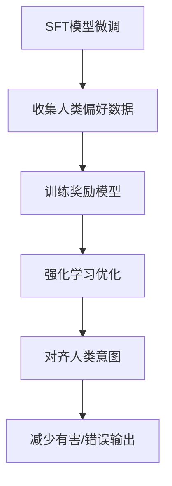
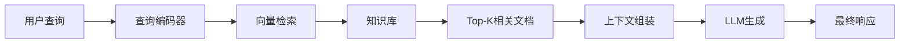

# 幻觉缓解策略

## 关键词速览

| 中文术语 | 英文术语 | 重要性 |
|---------|---------|--------|
| 幻觉 | Hallucination | ⭐⭐⭐⭐⭐ |
| 强化学习人类反馈 | RLHF | ⭐⭐⭐⭐⭐ |
| 思维链 | Chain-of-Thought | ⭐⭐⭐⭐ |
| 检索增强生成 | RAG | ⭐⭐⭐⭐⭐ |
| 自洽性验证 | Self-Consistency | ⭐⭐⭐⭐ |
| 不确定性量化 | Uncertainty Quantification | ⭐⭐⭐⭐ |
| 知识检索 | Knowledge Retrieval | ⭐⭐⭐⭐ |
| Constitutional AI | Constitutional AI | ⭐⭐⭐ |
| 置信度校准 | Confidence Calibration | ⭐⭐⭐⭐ |
| 反刍式检索 | CRAG | ⭐⭐⭐⭐ |

## 一、问题本质：为何LLM会产生幻觉

大型语言模型（Large Language Model, LLM）的幻觉问题是指模型生成的内容与客观事实不符、或与用户意图产生偏离的现象。根据其表现形式，可分为三类：

1. **事实性幻觉（Factuality Hallucination）**：生成内容包含错误的事实性陈述
2. **忠实性幻觉（Faithfulness Hallucination）**：生成内容偏离用户指令或输入上下文
3. **编造性幻觉（Fabrication Hallucination）**：模型凭空捏造不存在的引用、数据或来源

> [!note] 核心矛盾
> LLM本质上是一个基于概率分布的**自回归文本生成器**，而非事实检索系统。其训练目标是预测下一个token，而非保证事实准确性。

### 1.1 幻觉产生的数学机理

LLM的输出可形式化为条件概率分布：

$$
P(\text{output} | \text{input}, \theta) = \prod_{t=1}^{T} P(w_t | w_{<t}, \text{input}, \theta)
$$

其中 $\theta$ 为模型参数。幻觉产生的根源在于：

1. **分布外泛化（Out-of-Distribution）**：输入落在训练分布之外时，模型外推到不可靠区域
2. **知识边界模糊**：模型无法区分"已学习"与"未学习"的知识
3. **最大似然目标**：训练时优化的是token级别的似然，而非整体事实一致性

```python
# 典型的token概率分布示例
def demonstrate_hallucination_probability():
    """
    演示模型对未见过实体的幻觉概率
    """
    # 假设模型对"埃隆·马斯克在火星上有房产"这个查询
    # 实际上模型从未在训练语料中见过此信息
    
    # 但模型会基于语义相似性生成看似合理的回答
    hallucinated_response = {
        "entity": "埃隆·马斯克",
        "related_concepts": ["SpaceX", "火星殖民计划", "特斯拉"],
        "generated_statement": "是的，埃隆·马斯克在火星的奥林帕斯山区域拥有房产...",
        "confidence": 0.87,  # 模型给出的置信度
        "factuality": False  # 实际为虚构
    }
    return hallucinated_response
```

## 二、强化学习人类反馈（RLHF）方法论

### 2.1 RLHF的核心流程

RLHF（Reinforcement Learning from Human Feedback）是通过人类反馈信号微调模型，使其输出更符合人类偏好的技术。其完整流程如下：



**第一步：监督微调（Supervised Fine-Tuning, SFT）**

首先在高质量数据上进行监督学习：

$$
\mathcal{L}_{\text{SFT}} = -\mathbb{E}_{(x,y) \sim \mathcal{D}}[\log \pi_\theta(y|x)]
$$

**第二步：奖励模型训练**

收集人类对比数据，训练奖励模型 $r_\phi(x, y)$：

$$
\mathcal{L}_R = -\mathbb{E}_{(x, y_1, y_2, \text{label}) \sim \mathcal{D}}[\log \sigma(r_\phi(x, y_1) - r_\phi(x, y_2))]
$$

**第三步：PPO强化学习优化**

使用PPO算法最大化期望奖励，同时限制与参考模型的偏离：

$$
\mathcal{L}_{\text{PPO}} = -\mathbb{E}_{x \sim \mathcal{D}, y \sim \pi_\theta(\cdot|x)}[r_\phi(x, y)] + \beta \cdot \mathbb{E}_x[\text{KL}(\pi_\theta(\cdot|x) || \pi_{\text{ref}}(\cdot|x))]
$$

### 2.2 RLHF在幻觉缓解中的应用

```python
from typing import List, Dict, Tuple
import numpy as np

class RLHFBasedHallucinationMitigation:
    """
    基于RLHF的幻觉缓解框架
    """
    def __init__(self, reward_model, reference_model, ppo_config):
        self.reward_model = reward_model
        self.reference_model = reference_model
        self.config = ppo_config
        
    def compute_hallucination_reward(
        self, 
        prompt: str, 
        response: str,
        knowledge_base: Dict[str, any]
    ) -> float:
        """
        计算幻觉惩罚reward
        """
        # 事实核查reward
        factual_reward = self._evaluate_factuality(response, knowledge_base)
        
        # 一致性reward
        consistency_reward = self._evaluate_consistency(prompt, response)
        
        # 完整性reward（是否回避了问题）
        completeness_reward = self._evaluate_completeness(response)
        
        # 加权组合
        total_reward = (
            0.5 * factual_reward + 
            0.3 * consistency_reward + 
            0.2 * completeness_reward
        )
        return total_reward
    
    def _evaluate_factuality(self, response: str, kb: Dict) -> float:
        """
        评估响应的事实性
        """
        # 提取响应中的事实声明
        claims = self._extract_claims(response)
        
        # 与知识库比对
        verified_count = sum(
            1 for claim in claims 
            if self._verify_claim(claim, kb)
        )
        
        if len(claims) == 0:
            return 1.0  # 无声明则默认合格
        return verified_count / len(claims)
```

> [!tip] RLHF实践建议
> - 偏好数据的多样性比数量更重要
> - 对幻觉类错误的惩罚权重应高于其他类型错误
> - 定期重新标注以适应模型能力的演进

## 三、思维链与自我验证机制

### 3.1 Chain-of-Thought（CoT）推理

思维链提示通过让模型显式展示推理过程来减少幻觉：

```python
class CoTSelfVerification:
    """
    基于CoT的自我验证框架
    """
    
    def generate_with_verification(
        self, 
        question: str,
        num_samples: int = 8
    ) -> Dict[str, any]:
        """
        使用自洽性采样进行验证
        """
        # 多次采样带CoT的响应
        reasoning_paths = [
            self._generate_reasoning(question) 
            for _ in range(num_samples)
        ]
        
        # 提取最终答案
        answers = [path["answer"] for path in reasoning_paths]
        
        # 投票选择最一致的答案
        answer_counts = {}
        for ans in answers:
            answer_counts[ans] = answer_counts.get(ans, 0) + 1
        
        final_answer = max(answer_counts, key=answer_counts.get)
        confidence = answer_counts[final_answer] / num_samples
        
        return {
            "answer": final_answer,
            "confidence": confidence,
            "reasoning_paths": reasoning_paths,
            "answer_distribution": answer_counts
        }
    
    def _generate_reasoning(self, question: str) -> Dict:
        """
        生成单条推理路径
        """
        prompt = f"""
        问题: {question}
        
        请分步推理，并在最后给出明确答案。
        
        推理过程:
        1. 
        """
        response = self.model.generate(prompt)
        return {
            "reasoning": response,
            "answer": self._extract_final_answer(response)
        }
```

### 3.2 不确定性量化（Uncertainty Quantification）

让模型表达其不确定性，而非强制给出答案：

$$
P(\text{uncertain} | x) = \sigma(f_\theta(x) \cdot \tau)
$$

其中 $\sigma$ 为sigmoid函数，$\tau$ 为温度参数。

```python
class UncertaintyAwareGeneration:
    """
    不确定性感知生成器
    """
    
    def generate_with_uncertainty(
        self, 
        prompt: str,
        uncertainty_threshold: float = 0.3
    ) -> Dict[str, any]:
        """
        生成响应并附带不确定性估计
        """
        # 获取logits
        logits = self.model.get_logits(prompt)
        
        # 计算token级别的entropy
        token_entropy = self._compute_entropy(logits)
        
        # 整体不确定性
        overall_uncertainty = np.mean(token_entropy)
        
        # 判断是否需要表达不确定性
        if overall_uncertainty > uncertainty_threshold:
            return {
                "response": self._generate_uncertainty_acknowledgment(prompt),
                "uncertainty_flag": True,
                "uncertainty_score": overall_uncertainty,
                "suggestion": "建议使用RAG系统进行事实核查"
            }
        else:
            return {
                "response": self.model.generate(prompt),
                "uncertainty_flag": False,
                "uncertainty_score": overall_uncertainty
            }
    
    def _compute_entropy(self, logits: np.ndarray) -> np.ndarray:
        """计算概率分布的熵"""
        probs = softmax(logits)
        entropy = -np.sum(probs * np.log(probs + 1e-10), axis=-1)
        return entropy
```

## 四、检索增强生成（RAG）约束

### 4.1 基础RAG架构



### 4.2 CRAG：自我纠正式检索增强

CRAG（Corrective Retrieval Augmented Generation）让模型在生成后主动评估并纠正检索结果：

```python
class CRAGImplementation:
    """
    CRAG：自纠正检索增强生成
    """
    
    def generate_with_crag(
        self,
        question: str,
        knowledge_base,
        max_retries: int = 3
    ) -> str:
        """
        CRAG主循环
        """
        for iteration in range(max_retries):
            # Step 1: 初步检索
            retrieved_docs = self._retrieve(question, top_k=10)
            
            # Step 2: 知识评估
            assessment = self._assess_knowledge_quality(
                question, retrieved_docs
            )
            
            # Step 3: 基于评估采取行动
            if assessment["status"] == "CORRECT":
                # 知识正确，直接生成
                return self._generate_with_context(question, retrieved_docs)
            
            elif assessment["status"] == "INCORRECT":
                # 知识错误，尝试外部搜索
                retrieved_docs = await self._external_search(question)
                if retrieved_docs:
                    continue
            
            elif assessment["status"] == "AMBIGUOUS":
                # 知识模糊，生成时附带多种可能性
                return self._generate_with_multiple_interpretations(
                    question, retrieved_docs, assessment
                )
        
        # 最终fallback：使用模型自身知识但标注不确定性
        return self._generate_with_uncertainty_flag(question)
    
    def _assess_knowledge_quality(
        self, 
        question: str, 
        docs: List[Document]
    ) -> Dict[str, any]:
        """
        评估检索到的知识质量
        """
        # 构建评估prompt
        eval_prompt = f"""
        问题: {question}
        
        检索到的信息:
        {self._format_docs(docs)}
        
        请评估：
        1. 这些信息是否与问题相关？
        2. 这些信息是否正确（你可以使用内部知识判断）？
        3. 这些信息是否足以回答问题？
        
        输出JSON格式的评估结果。
        """
        
        result = self.evaluation_model.generate(eval_prompt)
        return self._parse_assessment(result)
```

> [!example] CRAG应用场景
> 当用户询问"2024年诺贝尔物理学奖获得者是谁"时：
> 1. 如果知识库中有准确答案 → 直接生成
> 2. 如果知识库显示获奖者A但实际是B → 触发纠正流程
> 3. 如果知识库信息与问题不完全匹配 → 生成带条件的回答

## 五、实用缓解策略总结

| 策略 | 适用场景 | 优点 | 缺点 |
|------|---------|------|------|
| RLHF | 通用对齐 | 效果显著 | 成本高 |
| CoT验证 | 推理任务 | 可解释性强 | token开销大 |
| RAG | 知识密集型任务 | 事实性强 | 依赖检索质量 |
| CRAG | 动态知识场景 | 自适应纠正 | 实现复杂 |
| 不确定性量化 | 高风险应用 | 风险可控 | 可能过于保守 |

> [!warning] 注意事项
> - 没有任何单一策略能完全消除幻觉
> - 多策略组合往往比单一策略更有效
> - 持续监控和human-in-the-loop仍然必要

## 六、进阶实践：构建生产级防幻觉系统

```python
class ProductionHallucinationMitigation:
    """
    生产级幻觉缓解系统
    """
    
    def __init__(self, config: Dict):
        self.components = {
            "rag": RAGPipeline(config["rag"]),
            "cot": CoTSelfVerification(config["cot"]),
            "uncertainty": UncertaintyAwareGeneration(config["uncertainty"]),
            "fact_checker": FactChecker(config["fact_checker"]),
            "output_validator": OutputValidator(config["validator"])
        }
    
    async def generate_safe_response(
        self,
        prompt: str,
        context: Dict = None
    ) -> Dict[str, any]:
        """
        多层防护的生成流程
        """
        # Layer 1: 意图识别与风险评估
        risk_level = self._assess_generation_risk(prompt)
        
        if risk_level == "HIGH":
            # 高风险场景：强制使用RAG
            response = await self._rag_only_generation(prompt)
        else:
            # 正常场景：多策略组合
            response = await self._hybrid_generation(prompt, context)
        
        # Layer 2: 后处理验证
        validation = self.components["output_validator"].validate(
            prompt, response
        )
        
        if not validation["passed"]:
            response = await self._correct_hallucination(
                prompt, response, validation["issues"]
            )
        
        # Layer 3: 不确定性标注
        if response.get("uncertainty", 0) > 0.5:
            response["safety_warning"] = self._generate_warning(
                response["uncertainty"]
            )
        
        return response
```

## 相关文档

- [[上下文窗口限制详解]] - 了解上下文长度对幻觉的影响
- [[推理计算成本优化]] - CoT等技术的成本考量
- [[AI评估基准失效问题]] - 如何评估幻觉缓解效果
- [[AI安全与对齐]] - 更广泛的AI安全问题
- [[RAG系统设计]] - 检索增强生成的深入实践

---

*文档创建于 2026-04-18*
