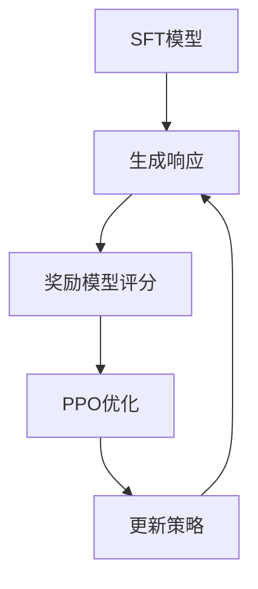

> [!info]+ 关键词
> PPO、近端策略优化、奖励模型、KL散度、clip裁剪、PPO-Clip、强化学习、大语言模型、价值函数、优势估计

---

## 概述

Proximal Policy Optimization（PPO，近端策略优化）是OpenAI在2017年提出的一种强化学习算法，也是目前大语言模型对齐训练中最广泛使用的RL算法。PPO通过引入clip机制，在保证策略更新的同时避免了策略剧烈波动的问题，使其成为RLHF（Reinforcement Learning from Human Feedback）的核心算法。本文档将详细介绍PPO在LLM中的应用，包括算法原理、奖励模型训练、训练稳定性处理等核心内容。

## PPO在LLM中的应用

### RLHF三阶段框架

在LLM对齐中，PPO是第三阶段的核心算法，整个RLHF流程包含：

1. **监督微调（SFT）**：在高质量数据上微调基础模型
2. **奖励模型训练**：训练奖励模型预测人类偏好
3. **PPO强化学习**：使用PPO算法优化策略



### PPO在LLM中的特殊挑战

LLM场景下的PPO与标准强化学习有显著差异：

1. **动作空间巨大**：词表达数万个token
2. **状态空间连续**：自然语言输入
3. **序列决策**：需要考虑整个响应的整体质量
4. **部分可观测**：只看到最终响应

### 简化PPO框架

在LLM中，PPO简化为以下形式：

1. **状态**：输入提示 $x$ 和已生成token序列
2. **动作**：选择下一个token
3. **奖励**：奖励模型给出的整体评分
4. **策略**：LLM的输出概率分布

## Reward Model训练

### 奖励模型架构

奖励模型通常基于预训练语言模型改造：

```python
import torch.nn as nn

class RewardModel(nn.Module):
    def __init__(self, base_model):
        super().__init__()
        self.base_model = base_model
        self.value_head = nn.Linear(base_model.config.hidden_size, 1)
        
    def forward(self, input_ids, attention_mask):
        outputs = self.base_model(
            input_ids=input_ids,
            attention_mask=attention_mask
        )
        # 使用最后一个token的hidden state
        hidden_state = outputs.last_hidden_state[:, -1, :]
        reward = self.value_head(hidden_state)
        return reward.squeeze(-1)
```

### Bradley-Terry偏好建模

奖励模型的训练目标是预测人类偏好：

$$P(y_w \succ y_l | x) = \sigma(r(x, y_w) - r(x, y_l))$$

其中 $r(x, y)$ 是奖励模型对响应 $y$ 的评分。

### 损失函数

奖励模型的对比损失函数：

$$\mathcal{L}_R = -\mathbb{E}_{(x, y_w, y_l) \sim \mathcal{D}} \left[ \log \sigma(r(x, y_w) - r(x, y_l)) \right]$$

### 训练技巧

> [!tip]+ 奖励模型训练要点
> 1. **数据配比**：正负样本比例保持1:1
> 2. **学习率**：通常使用1e-5到3e-5
> 3. **正则化**：添加权重衰减防止过拟合
> 4. **批次构造**：每个批次包含同一提示的不同响应

### 奖励模型质量评估

评估奖励模型的关键指标：

| 指标 | 计算方法 | 目标值 |
|------|----------|--------|
| 准确率 | 预测正确的偏好比例 | >70% |
| 一致性 | 与众包标注的一致程度 | Kappa>0.5 |
| 校准度 | 奖励差异与胜率的对应关系 | R²>0.8 |

## PPO算法核心参数

### CLIP机制

PPO的核心是clip操作，限制策略更新的幅度：

$$\mathcal{L}^{CLIP}(\theta) = -\mathbb{E}_t \left[ \min\left( r_t(\theta) \hat{A}_t, \text{clip}(r_t(\theta), 1-\epsilon, 1+\epsilon) \hat{A}_t \right) \right]$$

其中：
- $r_t(\theta) = \frac{\pi_\theta(a_t|s_t)}{\pi_{\theta_{old}}(a_t|s_t)}$ 是概率比
- $\epsilon$ 是clip范围（通常0.1-0.2）
- $\hat{A}_t$ 是优势函数估计

### 关键超参数

| 参数 | 推荐值 | 说明 |
|------|--------|------|
| `clip_eps` | 0.1-0.2 | PPO clip范围 |
| `gae_lambda` | 0.9-0.95 | 优势估计的衰减因子 |
| `gamma` | 0.99 | 折扣因子 |
| `ppo_epochs` | 4-8 | 每次更新的训练轮数 |
| `mini_batch_size` | 4-16 | 小批量大小 |
| `entropy_coef` | 0.01-0.1 | 熵正则化系数 |
| `value_loss_coef` | 0.1-0.5 | 价值损失系数 |

### KL散度约束（clip）

PPO中的KL约束有两种实现方式：

#### 方式1：PPO-Clip（内置KL约束）

通过clip实现隐式KL约束：

```python
def ppo_clip_loss(log_ratio, advantages, eps=0.2):
    ratio = torch.exp(log_ratio)
    clipped_ratio = torch.clamp(ratio, 1 - eps, 1 + eps)
    clipped_loss = -torch.min(
        ratio * advantages,
        clipped_ratio * advantages
    )
    return clipped_loss.mean()
```

#### 方式2：KL惩罚项（外显KL约束）

在损失函数中添加KL项：

$$\mathcal{L}_{KL} = \mathcal{L}^{CLIP} - \beta \cdot KL(\pi_\theta || \pi_{ref})$$

其中 $\beta$ 控制KL惩罚的强度。

### 优势函数估计（GAE）

Generalized Advantage Estimation (GAE) 提供低方差优势估计：

$$\hat{A}_t^{GAE}(\gamma, \lambda) = \sum_{l=0}^{\infty} (\gamma\lambda)^l \delta_{t+l}$$

其中 $\delta_t = r_t + \gamma V(s_{t+1}) - V(s_t)$

## 训练不稳定的处理

### 不稳定的根源

LLM的PPO训练面临多种不稳定因素：

1. **冷启动问题**：初始策略可能很差
2. **奖励噪声**：偏好标注本身存在噪声
3. **策略突变**：过大的策略更新
4. **价值过估**：价值函数估计偏差

### 应对策略

#### 1. 奖励塑形

将奖励分解为基础奖励和KL惩罚：

$$r_{final}(x, y) = r_{RM}(x, y) - \beta \log \frac{\pi_\theta(y|x)}{\pi_{ref}(y|x)}$$

> [!warning]+ 奖励工程重要性
> 奖励函数的设计至关重要。简单的奖励可能导致模型走捷径（如长度作弊），复杂的奖励需要更多人工设计。

#### 2. 梯度裁剪

```python
torch.nn.utils.clip_grad_norm_(
    model.parameters(), 
    max_norm=1.0
)
```

#### 3. 学习率调度

```python
scheduler = torch.optim.lr_scheduler.CosineAnnealingLR(
    optimizer,
    T_max=num_updates,
    eta_min=base_lr * 0.1
)
```

#### 4. 价值函数预训练

在PPO之前单独训练价值函数：

```python
# 预训练价值函数
for _ in range(1000):
    batch = sample_data()
    with torch.no_grad():
        target_values = reward_model(batch)
    value_loss = mse_loss(value_head(hidden), target_values)
    value_loss.backward()
```

### 训练监控指标

| 指标 | 含义 | 异常表现 |
|------|------|----------|
| `reward/mean` | 平均奖励 | 突然下降 |
| `kl/approx_kl` | KL散度估计 | 过大或为负 |
| `policy/entropy` | 策略熵 | 过低（崩溃）或过高（随机） |
| `value/explained_variance` | 价值解释方差 | 接近0或为负 |
| `clip_fraction` | clip比例 | 持续接近0.2-0.3 |

## 训练效率优化

### 序列并行生成

```python
from transformers import DataParallel

# 使用多GPU并行生成
responses = DataParallel(model).generate(
    input_ids,
    max_new_tokens=512,
    do_sample=True,
    num_beams=1
)
```

### 拒绝采样预热

在正式PPO之前进行拒绝采样：

1. 生成大量候选响应
2. 用奖励模型评分
3. 筛选高奖励样本
4. 用这些样本做SFT预热

### 混合训练策略

| 阶段 | 方法 | 比例 |
|------|------|------|
| 预热期 | SFT + 拒绝采样 | 100% SFT |
| 初期 | PPO + SFT混合 | 90% PPO + 10% SFT |
| 稳定期 | PPO + KL惩罚 | 95% PPO + 5% KL |

### 伪代码：完整PPO流程

```python
def ppo_training_loop():
    # 初始化
    policy = load_sft_model()
    ref_policy = copy(policy)
    reward_model = load_reward_model()
    
    for iteration in range(num_iterations):
        # 1. 收集经验
        trajectories = []
        for _ in range(num rollout_steps):
            prompt = sample_prompt()
            response = policy.generate(prompt)
            reward = reward_model(prompt, response)
            trajectories.append((prompt, response, reward))
        
        # 2. 计算优势估计
        advantages = compute_gae(trajectories, gamma, lambda)
        
        # 3. PPO更新
        for epoch in range(ppo_epochs):
            for batch in batchify(trajectories):
                # 计算新旧策略比
                log_ratio = compute_log_ratio(batch, policy, ref_policy)
                
                # 计算clip损失
                clip_loss = ppo_clip_loss(log_ratio, advantages)
                
                # 计算价值损失
                value_loss = compute_value_loss(batch)
                
                # 总损失
                total_loss = clip_loss + 0.5 * value_loss - 0.01 * entropy_loss
                
                # 反向传播
                total_loss.backward()
                optimizer.step()
                scheduler.step()
```

## PPO vs 其他方法对比

| 维度 | PPO | DPO | KTO |
|------|-----|-----|-----|
| 训练阶段 | 三阶段 | 单阶段 | 单阶段 |
| 奖励模型 | 必须 | 隐式 | 隐式 |
| 计算成本 | 高 | 低 | 中 |
| 训练稳定性 | 中等 | 高 | 高 |
| 样本效率 | 中等 | 高 | 高 |
| 探索能力 | 强 | 弱 | 弱 |

## 实战配置示例

```python
from trl import PPOTrainer, PPOConfig

config = PPOConfig(
    model_name="gpt2",
    learning_rate=1.4e-5,
    ppo_epochs=4,
    mini_batch_size=4,
    batch_size=256,
    gradient_accumulation_steps=1,
    adafactor=False,
    max_grad_norm=1.0,
    early_stopping=False,
    target_kl=0.1,
    lr_range_start=1e-5,
    lr_range_end=1e-6,
    lr_range_fraction=0.1,
)

trainer = PPOTrainer(
    config=config,
    model=policy_model,
    ref_model=ref_model,
    reward_model=reward_model,
    tokenizer=tokenizer,
)

# 开始训练
 trainer.train()
```

## 相关文档

- [[DPO深度指南]] - 简化的对齐方法
- [[KTO对齐]] - 基于目标分布的对齐
- [[ORPO对齐]] - 单阶段概率比优化
- [[偏好数据构建]] - 高质量偏好数据的构建
- [[Constitutional_AI详解]] - 宪章驱动的对齐方法
