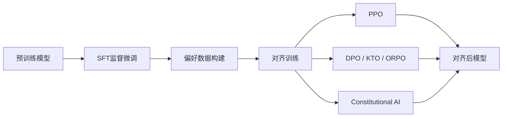

# RLHF与对齐 (Reinforcement Learning from Human Feedback)

本目录系统梳理大语言模型人类反馈强化学习与对齐技术的完整知识体系，覆盖主流对齐算法（PPO、DPO、KTO、ORPO、Constitutional AI）的原理、偏好数据构建方法与实战指南。

---

## 目录结构

### 对齐算法

| 算法 | 核心文档 | 类别 | 核心思想 |
|------|---------|------|---------|
| PPO | [[PPO训练详解]] | 在线RL | 基于Reward Model的策略梯度优化 |
| DPO | [[DPO深度指南]] | 离线对比 | 直接偏好优化，无需显式Reward Model |
| KTO | [[KTO对齐]] | 离线效用 | 基于Kahneman-Tversky效用理论的单向偏好 |
| ORPO | [[ORPO对齐]] | 混合对比 | 联合训练SFT Loss + Odds Ratio偏好损失 |
| Constitutional AI | [[Constitutional_AI详解]] | 自我对齐 | 基于宪法规则的自迭代对齐框架 |

### 数据基础

- [[偏好数据构建]] — 成对偏好数据的采集策略、质量控制、标注规范与大规模构建方案

---

## 核心主题关联

> [!info] 算法演进路径
> 1. **PPO** → 经典RLHF范式，ChatGPT/InstructGPT采用方案，计算开销大
> 2. **DPO** → 绕过Reward Model，直接用偏好对优化策略，简化流程
> 3. **KTO** → 打破偏好对称性假设，引入认知偏差建模，单向标注更易扩展
> 4. **ORPO** → 统一SFT与偏好训练，避免两阶段分立，训练更稳定
> 5. **Constitutional AI** → 规则驱动自我迭代，绕过人工标注瓶颈

> [!warning] 实践注意
> - PPO需要同时训练Reward Model、Value Network、Policy三个组件，GPU显存需求高
> - DPO对数据质量敏感，偏好对噪声会导致策略崩溃
> - [[偏好数据构建]] 是所有对齐算法的上游瓶颈，建议优先投入

---

## 相关知识节点

- [[../微调技术/微调技术]] — 对齐前的模型微调基础
- [[../数据处理/数据处理]] — 偏好数据的收集与标注
- [[../评估与优化/评估与优化]] — 对齐效果的量化评估
