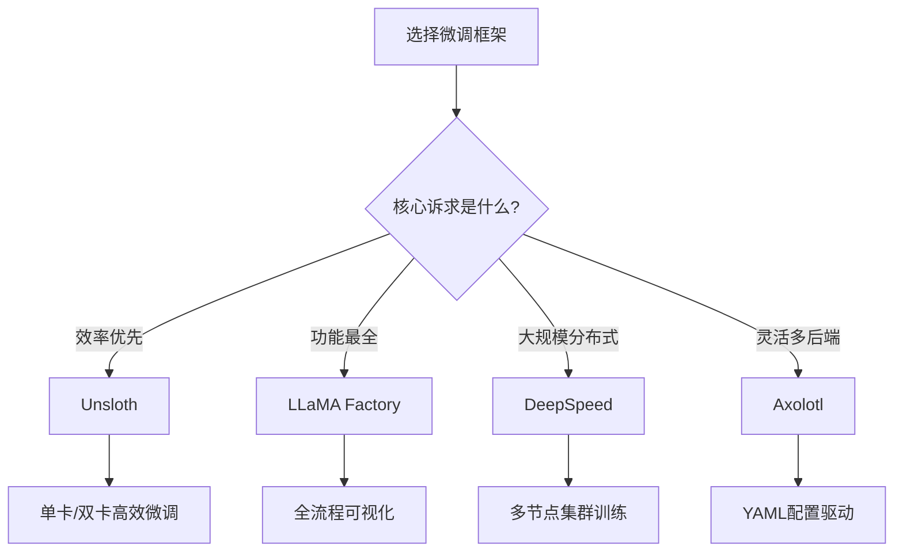

# 开源微调框架 (Open-Source Fine-Tuning Frameworks)

本目录系统梳理当前主流开源大模型微调框架的核心能力、配置方法与选型建议，覆盖从单卡到分布式训练的全栈工具链。

---

## 目录结构

### 框架详解

| 框架 | 核心文档 | 定位 | 核心优势 |
|------|---------|------|---------|
| Axolotl | [[Axolotl使用指南]] | 多框架统一入口 | YAML配置、多后端兼容、社区活跃 |
| DeepSpeed | [[DeepSpeed训练优化]] | 分布式训练引擎 | ZeRO优化、MoE、Pipeline并行 |
| LLaMA Factory | [[LLaMA_Factory完整指南]] | 全链路一站式平台 | WebUI、丰富微调算法、40+模型支持 |
| Unsloth | [[Unsloth使用指南]] | 极致效率优化 | 2x训练加速、50%显存节省、动态加速器 |

### 综合评估

- [[框架对比与选择]] — 四大框架在易用性、性能、显存效率、社区生态与适用场景的全面对比矩阵

---

## 框架能力对比



> [!note] 框架协同使用
> 框架并非互斥，可组合使用：
> - **Unsloth** 提供高效实现内核 → 配合 **Axolotl** 的配置管理
> - **DeepSpeed** 提供分布式策略 → 由 **Axolotl** 或 **LLaMA Factory** 调度
> - **LLaMA Factory** 提供 WebUI 交互 → 底层可切换至 DeepSpeed 或 HaggingFace Accelerate 后端

---

## 快速选型决策树

```
资源规模?
├── 单卡 (≤24GB VRAM)
│   └── 推荐: Unsloth（最快）或 LLaMA Factory
├── 多卡 (2-8 GPU)
│   ├── 小规模 → Axolotl + DeepSpeed ZeRO-2
│   └── 中等规模 → LLaMA Factory + DeepSpeed ZeRO-3
└── 集群 (8+ GPU)
    └── 推荐: DeepSpeed + Axolotl（MoE/Pipeline支持更成熟）

模型类型?
├── LLaMA / Qwen / Mistral 系列
│   └── LLaMA Factory（一站式）或 Unsloth（效率）
└── MoE / 超大模型
    └── DeepSpeed（ZeRO-Infinity + CPU Offloading）
```

---

## 相关知识节点

- [[../微调技术/微调技术]] — 框架背后的微调原理
- [[../RLHF与对齐/RLHF与对齐]] — 对齐训练在框架中的实现
- [[../评估与优化/评估与优化]] — 框架内置的评估与监控工具
