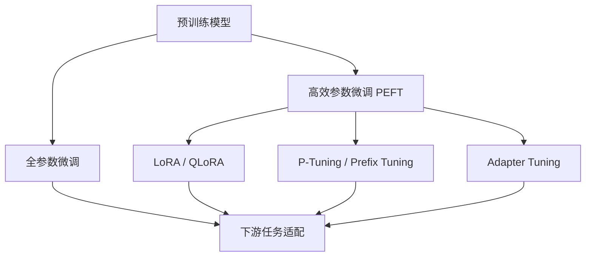

# 微调技术 (Fine-Tuning Techniques)

本目录系统梳理大语言模型微调技术的完整知识体系，涵盖从全参数微调到各类高效参数微调方法的核心原理、实践指南与技术对比。

---

## 目录结构

### 全参数微调 (Full Parameter Fine-Tuning)
- [[全参数微调]] — 传统全量参数更新方法，覆盖成本与适用场景

### 高效参数微调 (Parameter-Efficient Fine-Tuning, PEFT)

| 方法 | 核心文档 | 说明 |
|------|---------|------|
| LoRA | [[LoRA微调深度指南]] | 低秩适配器原理、秩选择、目标模块配置 |
| QLoRA | [[QLoRA微调详解]] | 量化感知微调，4-bit NF4量化 + LoRA组合方案 |
| P-Tuning | [[P-Tuning微调]] | 连续提示学习，前缀嵌入与提示编码器设计 |
| Adapter | [[Adapter微调]] | 瓶颈Adapter结构，投影层插入策略 |
| Prefix | [[prefix微调]] | 连续前缀向量，可学习上下文前缀设计 |

### 技术综合

- [[微调技术对比总结]] — 各微调范式的参数量、训练速度、推理开销、效果对比矩阵

---

## 核心主题关联

> [!tip] 选型建议
> - **资源受限场景**：优先选择 [[LoRA微调深度指南|QLoRA]]，兼顾效率与效果
> - **序列建模需求强**：参考 [[P-Tuning微调]] 的连续提示方案
> - **追求极限压缩**：参见 [[Adapter微调]] 的瓶颈结构设计
> - **全面了解差异**：必读 [[微调技术对比总结]]

---

## 相关知识节点

- [[../RLHF与对齐/RLHF与对齐]] — 微调后的对齐技术
- [[../数据处理/数据处理]] — 微调数据的收集、清洗与标注
- [[../开源微调框架/开源微调框架]] — 具体框架实现（DeepSpeed、Axolotl、Unsloth）
