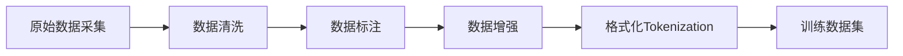

# 数据处理 (Data Processing Pipeline)

本目录覆盖大语言模型训练数据的全生命周期处理流程，从原始数据采集、清洗、标注、增强到最终的格式化与Tokenization，为模型微调提供高质量数据底座。

---

## 目录结构

### 数据采集 (Data Collection)
- [[数据收集指南]] — 多来源数据的采集策略、网络爬取、开放数据集整合与版权合规

### 数据清洗 (Data Cleaning)
- [[数据清洗技术]] — 去重（Deduplication）、噪声过滤、格式标准化、异常值处理与质量评分体系

### 数据标注 (Data Annotation)
- [[数据标注最佳实践]] — 标注任务设计、标注员管理、质量控制机制、主动学习标注方案

### 数据增强 (Data Augmentation)
- [[数据增强方法]] — 回译、同义词替换、数据合成、LLM生成增强与领域自适应增强技术

### 数据格式化 (Data Formatting)
- [[数据格式化与Tokenization]] — ChatML格式、指令模板设计、特殊Token处理、Tokenizer配置与序列化格式规范

---

## 数据处理流水线

> [!abstract] 数据质量优先级
> 数据质量在微调效果中的贡献约占 ==70%==，远超模型架构选择（约20%）和训练技巧（约10%）。garbage in, garbage out — 低质量数据是模型性能最常见的瓶颈来源。

---

## 各环节关键要点

| 环节 | 核心挑战 | 推荐策略 |
|------|---------|---------|
| 采集 | 来源分散、格式不统一 | 统一Schema提取、分层存储 |
| 清洗 | 去重不彻底、质量不一致 | 多级去重（精确+模糊）、质量评分 |
| 标注 | 成本高、一致性差 | 双盲标注、主动学习、LLM辅助标注 |
| 增强 | 引入噪声、分布偏移 | 保守增强、评估增强后分布漂移 |
| 格式化 | Tokenizer不匹配、特殊Token冲突 | 统一模板引擎、Token计数审计 |

---

## 相关知识节点

- [[../微调技术/微调技术]] — 处理后数据的下游应用
- [[../RLHF与对齐/偏好数据构建]] — RLHF场景下的偏好数据专项构建
- [[../评估与优化/评估与优化]] — 数据质量对下游评估的影响
