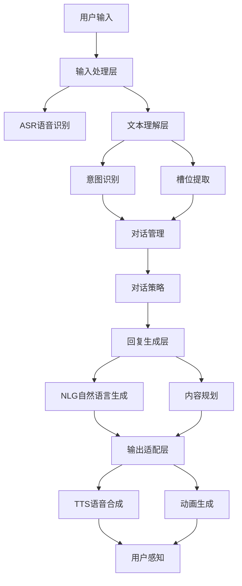
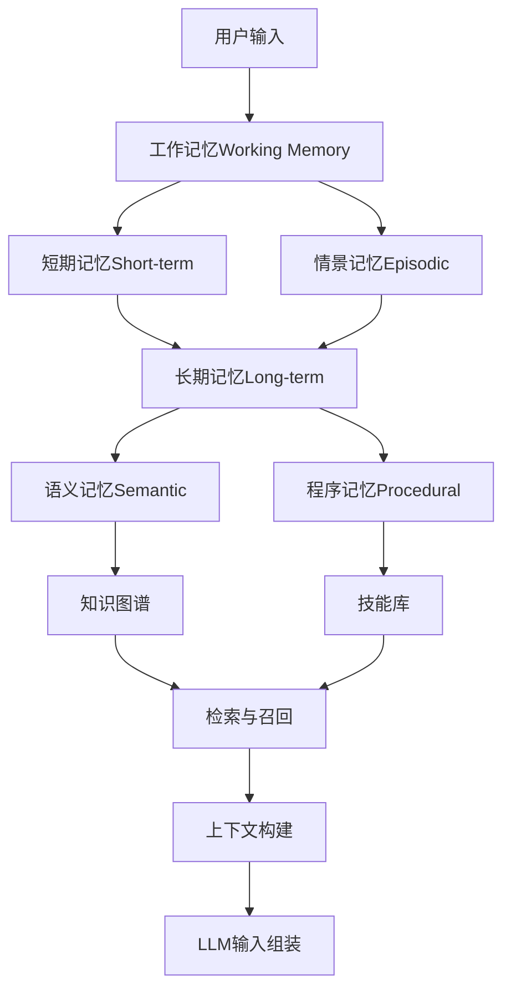
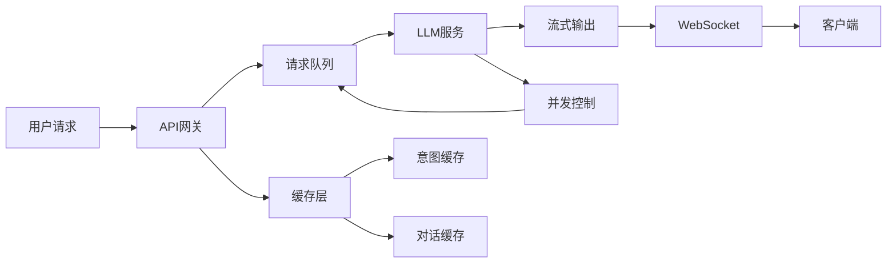

# 数字人交互系统

## 关键词

| 类别 | 关键词 |
|------|--------|
| 对话系统 | 对话管理、意图识别、槽位填充、NLU、NLG |
| 多模态 | 视觉-语言融合、多模态理解、跨模态生成 |
| 情感计算 | 情感识别、情感合成、共情回复、情绪分析 |
| 记忆系统 | 长期记忆、短期记忆、情景记忆、工作记忆 |
| 个性化 | 人设定制、风格迁移、角色扮演、记忆个性化 |
| 大模型 | LLM、GPT-4、Claude、RAG、Agent |
| 实时响应 | 流式输出、WebSocket、低延迟、并发 |
| 应用场景 | 客服、教育、娱乐、医疗、企业服务 |

> [!abstract] 摘要
> 数字人交互系统是赋予虚拟人"智慧灵魂"的核心模块，决定了数字人与用户之间的交互体验质量。本文档系统梳理对话系统架构、多模态交互技术、情感识别与回应机制、上下文记忆系统、个性化定制方案及实时响应优化策略，为构建高智能数字人提供全面的交互系统技术参考。

---

## 1. 对话系统架构

### 1.1 经典架构模式

现代数字人对话系统通常采用分层架构：



### 1.2 模块详解

#### 语音识别层（ASR）

```python
# 多引擎ASR适配
class ASREngine:
    def __init__(self, engine='whisper'):
        self.engine = engine
        if engine == 'whisper':
            from faster_whisper import WhisperModel
            self.model = WhisperModel('large-v2')
        elif engine == 'vosk':
            from vosk import Model, KaldiRecognizer
            self.model = Model('vosk-model')
            self.rec = KaldiRecognizer(self.model, 16000)
    
    def recognize(self, audio_chunk):
        if self.engine == 'whisper':
            segments, _ = self.model.transcribe(
                audio_chunk, 
                beam_size=5,
                vad_filter=True
            )
            return ' '.join([s.text for s in segments])
        elif self.engine == 'vosk':
            self.rec.AcceptWaveform(audio_chunk)
            result = json.loads(self.rec.Result())
            return result['text']
```

#### 自然语言理解层（NLU）

```python
# 基于规则的意图识别
class IntentClassifier:
    def __init__(self):
        self.intents = {
            'greeting': {
                'patterns': ['你好', 'hi', 'hello', '早上好', '嗨'],
                'weight': 1.0
            },
            'product_inquiry': {
                'patterns': ['是什么', '介绍一下', '怎么用', '功能'],
                'keywords': ['产品', '服务', '功能', '特点']
            },
            'complaint': {
                'patterns': ['太差', '不满意', '问题', '故障'],
                'negative_words': ['不', '没', '无', '差', '烂']
            },
            'transaction': {
                'patterns': ['买', '下单', '支付', '多少钱'],
                'action_words': ['购买', '订阅', '开通']
            }
        }
    
    def classify(self, text):
        scores = {}
        for intent, config in self.intents.items():
            score = 0.0
            for pattern in config['patterns']:
                if pattern in text:
                    score += config['weight']
            if score > 0:
                scores[intent] = score
        
        if scores:
            best_intent = max(scores, key=scores.get)
            return {'intent': best_intent, 'confidence': scores[best_intent]}
        return {'intent': 'unknown', 'confidence': 0.0}
```

#### 槽位填充

```python
# 槽位提取器
class SlotExtractor:
    def __init__(self):
        self.slot_definitions = {
            'time': {
                'type': 'time',
                'patterns': [
                    r'\d{1,2}点\d{0,2}分',
                    r'今天|明天|后天|下周',
                    r'上午|下午|晚上'
                ]
            },
            'location': {
                'type': 'entity',
                'ner_model': 'bert-ner',
                'labels': ['GPE', 'LOC']
            },
            'product': {
                'type': 'keyword',
                'keywords': ['手机', '电脑', '耳机', '手表']
            },
            'quantity': {
                'type': 'number',
                'patterns': [r'\d+个?', r'几.*']
            }
        }
    
    def extract(self, text, intent):
        slots = {}
        
        for slot_name, slot_def in self.slot_definitions.items():
            if slot_def['type'] == 'time':
                import re
                for pattern in slot_def['patterns']:
                    match = re.search(pattern, text)
                    if match:
                        slots[slot_name] = match.group()
                        
            elif slot_def['type'] == 'ner':
                entities = self.ner_extract(text, slot_def['labels'])
                if entities:
                    slots[slot_name] = entities[0]
                    
            elif slot_def['type'] == 'keyword':
                for kw in slot_def['keywords']:
                    if kw in text:
                        slots[slot_name] = kw
                        
        return slots
```

### 1.3 对话管理

```python
# 对话状态跟踪
class DialogueStateTracker:
    def __init__(self):
        self.state = {
            'current_intent': None,
            'slots': {},
            'history': [],
            'turn_count': 0,
            'context': {}
        }
    
    def update(self, intent, slots, user_input):
        self.state['current_intent'] = intent
        self.state['slots'].update(slots)
        self.state['history'].append({
            'role': 'user',
            'content': user_input,
            'intent': intent,
            'slots': slots.copy()
        })
        self.state['turn_count'] += 1
    
    def is_complete(self, required_slots):
        """检查是否收集到所有必要槽位"""
        for slot in required_slots:
            if slot not in self.state['slots']:
                return False
        return True
    
    def get_missing_slots(self, required_slots):
        """获取缺失的槽位"""
        return [s for s in required_slots 
                if s not in self.state['slots']]
```

---

## 2. 多模态交互

### 2.1 多模态融合策略

数字人的多模态交互涉及语音、文本、视觉等多种输入的融合理解：

| 融合方式 | 描述 | 优势 | 劣势 |
|----------|------|------|------|
| 早期融合 | 原始特征拼接 | 表达能力强 | 计算量大 |
| 晚期融合 | 各模态独立处理后融合 | 灵活 | 忽略模态关联 |
| 中间融合 | 分层特征融合 | 平衡 | 实现复杂 |
| 注意力融合 | 注意力机制加权 | 动态可解释 | 训练困难 |

### 2.2 多模态大模型

```python
# 多模态理解API调用
class MultimodalLLM:
    def __init__(self, provider='openai'):
        self.provider = provider
        
    async def understand(self, image, text, audio=None):
        if self.provider == 'openai':
            return await self._openai_multimodal(image, text)
        elif self.provider == 'anthropic':
            return await self._claude_vision(image, text)
        elif self.provider == 'google':
            return await self._gemini_vision(image, text, audio)
    
    async def _openai_multimodal(self, image, text):
        response = await openai.ChatCompletion.acreate(
            model='gpt-4o',
            messages=[{
                'role': 'user',
                'content': [
                    {'type': 'text', 'text': text},
                    {
                        'type': 'image_url',
                        'image_url': {
                            'url': f'data:image/jpeg;base64,{image}',
                            'detail': 'high'
                        }
                    }
                ]
            }]
        )
        return response.choices[0].message.content
```

### 2.3 视觉-语言对齐

```python
# CLIP用于视觉-语言理解
import clip
import torch

class VisionLanguageAlign:
    def __init__(self):
        self.device = 'cuda' if torch.cuda.is_available() else 'cpu'
        self.model, self.preprocess = clip.load(
            'ViT-L/14', 
            device=self.device
        )
    
    def describe_image(self, image):
        """为图像生成描述"""
        image_input = self.preprocess(image).unsqueeze(0).to(self.device)
        
        with torch.no_grad():
            image_features = self.model.encode_image(image_input)
        
        # 使用图像特征查询文本描述
        text_descriptions = [
            "a person smiling happily",
            "a person looking confused",
            "a person looking at their phone",
            "a person in a business meeting",
            "a person walking on the street"
        ]
        
        text_inputs = clip.tokenize(text_descriptions).to(self.device)
        
        with torch.no_grad():
            text_features = self.model.encode_text(text_inputs)
        
        # 计算相似度
        similarity = (image_features @ text_features.T).softmax(dim=-1)
        
        best_match = text_descriptions[similarity.argmax().item()]
        confidence = similarity.max().item()
        
        return {'description': best_match, 'confidence': confidence}
    
    def find_relevant_context(self, image, knowledge_base):
        """从知识库中找到与图像相关的内容"""
        image_features = self.model.encode_image(
            self.preprocess(image).unsqueeze(0).to(self.device)
        )
        
        best_matches = []
        for item in knowledge_base:
            text_features = self.model.encode_text(
                clip.tokenize(item['description']).to(self.device)
            )
            similarity = (image_features @ text_features.T).item()
            best_matches.append((item, similarity))
        
        best_matches.sort(key=lambda x: x[1], reverse=True)
        return best_matches[:5]
```

### 2.4 多模态生成

```python
# 生成多模态回复（文本+表情）
class MultimodalResponseGenerator:
    def __init__(self):
        self.llm = MultimodalLLM()
        self.emotion_classifier = EmotionClassifier()
        self.gesture_selector = GestureSelector()
    
    async def generate(self, user_input, context):
        # 生成文本回复
        text_response = await self.llm.chat(
            system_prompt=self.build_system_prompt(context),
            user_message=user_input
        )
        
        # 分析情感
        emotion = self.emotion_classifier.analyze(
            text_response
        )
        
        # 选择匹配的肢体语言
        gesture = self.gesture_selector.select(
            emotion=emotion,
            intent=context['current_intent']
        )
        
        # 选择合适的面部表情
        facial_expr = self.select_facial_expression(emotion)
        
        return {
            'text': text_response,
            'emotion': emotion,
            'gesture': gesture,
            'facial_expression': facial_expr,
            'speech_style': self.get_speech_style(emotion)
        }
    
    def get_speech_style(self, emotion):
        """根据情感调整语音风格"""
        emotion_styles = {
            'happy': {'rate': 1.1, 'pitch': 1.05, 'volume': 1.0},
            'sad': {'rate': 0.9, 'pitch': 0.95, 'volume': 0.9},
            'angry': {'rate': 1.2, 'pitch': 1.1, 'volume': 1.2},
            'neutral': {'rate': 1.0, 'pitch': 1.0, 'volume': 1.0}
        }
        return emotion_styles.get(emotion, emotion_styles['neutral'])
```

---

## 3. 情感识别与回应

### 3.1 情感计算模型

情感识别是多模态交互的重要组成部分：

```python
# 多模态情感识别
class MultimodalEmotionRecognizer:
    def __init__(self):
        self.text_emotion = TextEmotionRecognizer()
        self.audio_emotion = AudioEmotionRecognizer()
        self.visual_emotion = VisualEmotionRecognizer()
        self.fusion_weight = {'text': 0.5, 'audio': 0.3, 'visual': 0.2}
    
    def recognize(self, text=None, audio=None, face=None):
        emotions = {}
        
        if text:
            emotions['text'] = self.text_emotion.predict(text)
        
        if audio:
            emotions['audio'] = self.audio_emotion.predict(audio)
            
        if face:
            emotions['visual'] = self.visual_emotion.predict(face)
        
        if not emotions:
            return {'emotion': 'neutral', 'intensity': 0.0}
        
        # 加权融合
        fused = self.fuse_emotions(emotions)
        return fused
    
    def fuse_emotions(self, emotions):
        """情感融合"""
        emotion_categories = [
            'happy', 'sad', 'angry', 'fear', 
            'surprise', 'disgust', 'neutral'
        ]
        
        final_scores = {e: 0.0 for e in emotion_categories}
        
        for modality, result in emotions.items():
            weight = self.fusion_weight.get(modality, 0.33)
            for emotion in emotion_categories:
                final_scores[emotion] += (
                    result['scores'].get(emotion, 0) * weight
                )
        
        dominant = max(final_scores, key=final_scores.get)
        return {
            'emotion': dominant,
            'intensity': final_scores[dominant],
            'all_scores': final_scores
        }
```

### 3.2 情感回复策略

```python
# 情感化回复生成
class EmpatheticResponseGenerator:
    def __init__(self):
        self.emotion_keywords = {
            'happy': ['太棒了', '太好了', '开心', '高兴'],
            'sad': ['心疼', '理解', '难过', '安慰'],
            'angry': ['理解', '抱歉', '建议', '冷静'],
            'fear': ['别担心', '安全', '放心', '保护'],
            'surprise': ['真的吗', '没想到', '惊讶', '惊喜']
        }
    
    def generate_empathetic_response(self, user_emotion, content):
        """生成共情回复"""
        empathy_prefix = self.get_empathy_prefix(user_emotion)
        
        # 根据情感调整回复内容
        if user_emotion == 'sad':
            content = self.soften_content(content)
            content = self.add_comfort(content)
        elif user_emotion == 'angry':
            content = self.calm_down_content(content)
            content = self.add_apology(content)
        elif user_emotion == 'happy':
            content = self.enhance_joy(content)
            
        return f"{empathy_prefix}，{content}"
    
    def get_empathy_prefix(self, emotion):
        prefixes = {
            'happy': '真为你高兴',
            'sad': '我能理解你的感受',
            'angry': '先别着急',
            'fear': '放心，有我在',
            'surprise': '哇，确实没想到'
        }
        return prefixes.get(emotion, '')
```

> [!note] 共情策略
> 情感回复不仅仅是情感的简单识别和输出，更重要的是：
> - **情感镜像**：适当镜像用户的情感状态
> - **情感验证**：承认用户的感受是合理的
> - **情感支持**：提供情感上的支持和安慰
> - **情感引导**：帮助用户从负面情绪中恢复

---

## 4. 上下文记忆系统

### 4.1 多层次记忆架构



### 4.2 记忆实现

```python
# 分层记忆系统
class LayeredMemorySystem:
    def __init__(self):
        # 工作记忆 - 当前对话窗口
        self.working_memory = {
            'recent_turns': deque(maxlen=10),
            'current_topic': None,
            'pending_slots': {}
        }
        
        # 情景记忆 - 用户会话历史
        self.episodic_memory = EpisodicStore()
        
        # 长期记忆 - 持久化用户画像
        self.long_term_memory = LongTermStore()
        
        # 知识图谱 - 结构化知识
        self.knowledge_graph = KnowledgeGraph()
    
    def add_turn(self, user_input, system_response, context):
        """添加一轮对话到记忆"""
        turn_record = {
            'timestamp': datetime.now(),
            'user_input': user_input,
            'system_response': system_response,
            'intent': context.get('intent'),
            'slots': context.get('slots', {}),
            'emotion': context.get('emotion'),
            'entities': self.extract_entities(user_input)
        }
        
        # 加入工作记忆
        self.working_memory['recent_turns'].append(turn_record)
        
        # 提取重要信息存入情景记忆
        if self.is_memorable(turn_record):
            self.episodic_memory.add(turn_record)
    
    def is_memorable(self, turn_record):
        """判断是否值得记忆"""
        memorable_patterns = [
            '用户提供了个人信息',
            '重要决策或承诺',
            '情感表达',
            '偏好或厌恶表达'
        ]
        # 实现判断逻辑...
        return False
    
    def build_context(self, current_input):
        """构建LLM输入上下文"""
        context_parts = []
        
        # 1. 角色设定
        context_parts.append(self.system_prompt)
        
        # 2. 用户画像摘要
        user_profile = self.long_term_memory.get_summary()
        if user_profile:
            context_parts.append(f"用户画像：{user_profile}")
        
        # 3. 相关情景记忆
        relevant_episodes = self.episodic_memory.retrieve(
            current_input,
            limit=3
        )
        if relevant_episodes:
            context_parts.append(
                f"相关历史：{self.format_episodes(relevant_episodes)}"
            )
        
        # 4. 当前对话历史
        recent = list(self.working_memory['recent_turns'])
        context_parts.append(
            f"当前对话：{self.format_recent_turns(recent)}"
        )
        
        return '\n\n'.join(context_parts)
```

### 4.3 RAG增强检索

```python
# 检索增强生成（RAG）
class RAGEngine:
    def __init__(self):
        self.embedding_model = SentenceTransformer('m3e-base')
        self.vector_store = FAISS(Index())
        self.document_store = DocumentStore()
    
    def retrieve(self, query, top_k=5):
        """检索相关文档"""
        # 向量化查询
        query_vector = self.embedding_model.encode(query)
        
        # 向量检索
        indices, scores = self.vector_store.search(
            query_vector, 
            top_k
        )
        
        # 获取文档
        results = []
        for idx, score in zip(indices, scores):
            if score > 0.7:  # 相似度阈值
                doc = self.document_store.get(indices)
                results.append({
                    'content': doc.content,
                    'score': score,
                    'metadata': doc.metadata
                })
        
        return results
    
    def augment_prompt(self, query, retrieved_docs):
        """增强提示词"""
        context = '\n\n'.join([
            f"[参考文档{i+1}]\n{doc['content']}"
            for i, doc in enumerate(retrieved_docs)
        ])
        
        prompt = f"""基于以下参考资料回答用户问题。
如果没有足够信息，请根据你的知识回答。

{context}

用户问题：{query}

回答："""
        
        return prompt
```

---

## 5. 个性化定制

### 5.1 角色人设系统

```python
# 角色人设配置
class CharacterProfile:
    def __init__(self):
        self.profile = {
            'name': '',
            'personality': {},
            'background': '',
            'speaking_style': {},
            'knowledge_domains': [],
            'values': [],
            'constraints': []
        }
    
    def configure(self, config):
        """加载角色配置"""
        self.profile.update(config)
        self.build_system_prompt()
    
    def build_system_prompt(self):
        """构建系统提示词"""
        parts = [
            f"你是{self.profile['name']}。",
            f"\n\n## 背景故事\n{self.profile['background']}",
            f"\n\n## 性格特点\n{self.format_personality()}",
            f"\n\n## 说话风格\n{self.format_speaking_style()}",
            f"\n\n## 专长领域\n{', '.join(self.profile['knowledge_domains'])}",
            f"\n\n## 行为准则\n{self.format_constraints()}"
        ]
        
        self.system_prompt = ''.join(parts)
    
    def format_personality(self):
        traits = []
        for trait, score in self.profile['personality'].items():
            strength = '非常' if score > 0.7 else ('略' if score > 0.4 else '')
            traits.append(f"- {strength}{trait}")
        return '\n'.join(traits)
    
    def format_speaking_style(self):
        style = self.profile['speaking_style']
        return (f"语气：{style.get('tone', '友好')}\n"
                f"词汇：{style.get('vocabulary', '日常')}\n"
                f"句式：{style.get('sentence', '简洁')}")
```

### 5.2 个性化学习

```python
# 基于对话历史学习用户偏好
class UserPreferenceLearner:
    def __init__(self):
        self.preference_store = PreferenceStore()
        self.update_threshold = 3  # 触发更新的对话轮数
    
    def update_preferences(self, conversation_history):
        """从对话历史中学习用户偏好"""
        updates = {}
        
        for turn in conversation_history[-10:]:
            # 学习命名偏好
            name_prefs = self.extract_name_preferences(turn)
            updates.update(name_prefs)
            
            # 学习风格偏好
            style_prefs = self.extract_style_preferences(turn)
            updates.update(style_prefs)
            
            # 学习知识偏好
            topic_prefs = self.extract_topic_preferences(turn)
            updates.update(topic_prefs)
        
        # 批量更新
        for key, value in updates.items():
            self.preference_store.update(key, value, confidence_delta=0.1)
    
    def apply_preferences(self, response):
        """在回复中应用用户偏好"""
        prefs = self.preference_store.get_all()
        
        # 称呼偏好
        if 'preferred_name' in prefs:
            response = response.replace('[name]', prefs['preferred_name'])
        
        # 详细程度偏好
        if prefs.get('detail_level') == 'brief':
            response = self.summarize_response(response, ratio=0.5)
        
        # 语言偏好
        if prefs.get('language') == 'simple':
            response = self.simplify_language(response)
        
        return response
```

---

## 6. 实时响应优化

### 6.1 流式输出架构



### 6.2 流式实现

```python
# WebSocket流式响应
import asyncio
import websockets
from fastapi import FastAPI, WebSocket
from fastapi.responses import StreamingResponse

app = FastAPI()

class StreamingChatHandler:
    def __init__(self):
        self.active_connections = {}
        self.llm = LLMClient()
    
    async def handle_stream(self, websocket: WebSocket, session_id: str):
        await websocket.accept()
        self.active_connections[session_id] = websocket
        
        try:
            while True:
                data = await websocket.receive_text()
                request = json.loads(data)
                
                # 启动流式生成任务
                asyncio.create_task(
                    self.stream_response(session_id, request)
                )
                
        except Exception as e:
            logger.error(f"WebSocket error: {e}")
        finally:
            del self.active_connections[session_id]
    
    async def stream_response(self, session_id, request):
        websocket = self.active_connections.get(session_id)
        if not websocket:
            return
        
        try:
            # 构建上下文
            context = self.build_context(request)
            
            # 流式生成
            full_response = ""
            async for chunk in self.llm.stream_generate(context):
                full_response += chunk
                
                # 发送增量更新
                await websocket.send_json({
                    'type': 'chunk',
                    'content': chunk,
                    'full_text': full_response
                })
                
                # 同时发送口型同步数据
                viseme = self.predict_viseme(chunk)
                await websocket.send_json({
                    'type': 'viseme',
                    'data': viseme
                })
            
            # 发送完成信号
            await websocket.send_json({
                'type': 'done',
                'full_text': full_response
            })
            
        except Exception as e:
            await websocket.send_json({
                'type': 'error',
                'message': str(e)
            })
```

### 6.3 性能优化策略

> [!tip] 延迟优化要点
> 端到端延迟 = ASR延迟 + LLM延迟 + TTS延迟 + 网络延迟

```python
# 并行化处理优化
class ParallelPipeline:
    async def process(self, user_input, audio_data):
        # 1. 同时进行ASR和情感分析
        asr_task = asyncio.create_task(self.asr.recognize(audio_data))
        emotion_task = asyncio.create_task(self.emotion.analyze(audio_data))
        
        text, emotion = await asyncio.gather(asr_task, emotion_task)
        
        # 2. LLM生成和TTS预热并行
        llm_task = asyncio.create_task(
            self.llm.generate(text, emotion=emotion)
        )
        tts_task = asyncio.create_task(
            self.tts.prepare(voice_config=emotion)
        )
        
        response = await llm_task
        await tts_task
        
        # 3. 流式TTS
        async for audio_chunk in self.tts.stream_synthesize(response):
            yield audio_chunk
```

---

## 相关文档

- [[数字人形象生成]] - 数字人视觉形象
- [[TTS语音合成]] - 语音生成
- [[口型同步技术]] - 唇形同步
- [[动作捕捉技术]] - 动作驱动
- [[实时渲染技术]] - 实时渲染
- [[数字人平台工具]] - 平台与工具

---

## 更新日志

| 日期 | 版本 | 修改内容 |
|------|------|----------|
| 2026-04-18 | v1.0 | 初版完成 |

---

> [!copyright] 版权声明
> 本文档为归愚知识库原创内容，采用CC BY-NC-SA 4.0协议授权。
