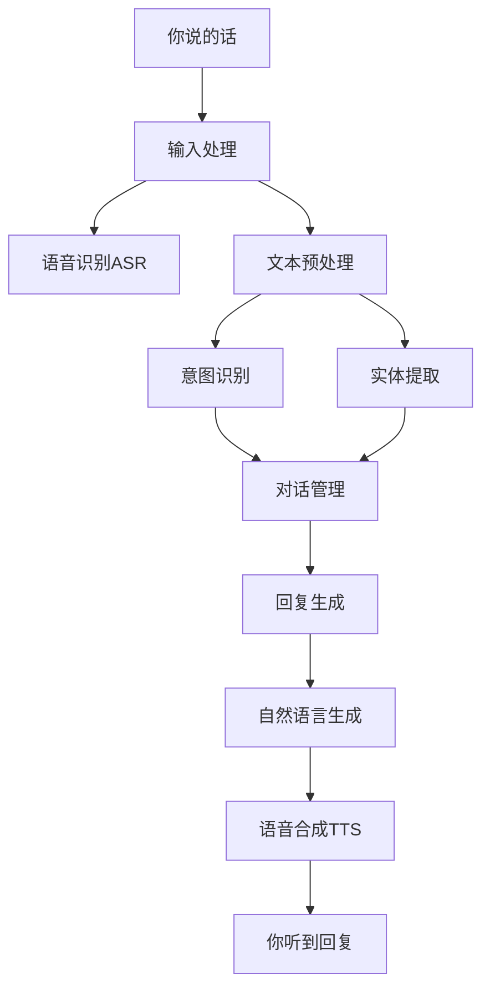

# 数字人交互系统：从零开始构建会说话、懂人心的虚拟人

> [!abstract] 这篇文章是写给小白的
> 如果你完全不懂什么是数字人交互系统，或者想自己动手做一个能聊天的虚拟人，这篇文章就是为你准备的。我们会从最基础的概念开始讲起，一直讲到怎么搭一个能用的系统。代码会给你们准备好，你只需要跟着做就行。

## 先搞清楚：数字人交互系统到底是什么？

你有没有想过，Siri、小爱同学、天猫精灵这些"智能助手"是怎么跟你对话的？它们背后其实都有一套类似的系统，这套系统就叫做**对话系统**或者**交互系统**。

数字人的交互系统，就是让虚拟人能够"听懂"你说的话、"理解"你的意思、然后"回复"你的一套技术。简单来说，就是让数字人从"花瓶"变成"能干活的人"的关键。

打个比方：如果数字人的形象是她的"身体"，渲染技术是她的"衣服"，那么交互系统就是她的"大脑和嘴巴"。没有大脑的数字人，再好看也只是一个会动的雕塑。

### 交互系统到底干了啥？

你跟数字人说"今天天气怎么样"，整个过程是这样的：

1. **你说话** → 语音信号进来
2. **耳朵听**（ASR）→ 把语音转成文字"今天天气怎么样"
3. **大脑理解**（NLU）→ 理解你是在问天气，时间是"今天"
4. **大脑思考**（DM/LLM）→ 决定怎么回答，可能要查天气API
5. **组织语言**（NLG）→ 把答案组织成"今天晴天，25度"
6. **张嘴说话**（TTS）→ 把文字转成语音说出来

整个过程在几百毫秒内完成，你几乎感觉不到延迟，这就是一个好的交互系统的样子。

---

## 1. 对话系统架构：小白的完整指南

### 1.1 为什么要了解架构？

很多新手一上来就想用大模型解决一切问题，这是不对的。好的系统需要各个模块配合工作，就像做一顿饭需要洗菜、切菜、炒菜一样，每个环节都有它的作用。

我们先来看一张图，不用担心，看不懂没关系，我会一步一步解释：



### 1.2 语音识别（ASR）：让数字人"听见"你

ASR（Automatic Speech Recognition）就是把你说的话转成文字。这个技术现在已经非常成熟了，识别准确率在标准普通话情况下可以达到95%以上。

#### 新手该用哪个ASR引擎？

我给大家推荐几个常用的：

| 引擎 | 优点 | 缺点 | 适合场景 |
|------|------|------|----------|
| **Whisper** | 准、免费、支持多语种 | 资源占用高 | 通用场景 |
| **Vosk** | 轻量、速度快 | 准确率一般 | 嵌入式、低延迟 |
| **阿里云ASR** | 云服务、大量优化 | 需要付费 | 企业级应用 |
| **讯飞ASR** | 中文效果好 | 付费 | 企业级应用 |

#### Whisper实战：用Python实现语音识别

首先安装依赖：

```bash
pip install faster-whisper torch
```

然后写代码：

```python
from faster_whisper import WhisperModel

# 选择模型大小：tiny/base/small/medium/large
# 模型越大越准确，但也越吃硬件
# 一般来说 small 够用了，显存4G以上可以选 medium

model = WhisperModel("small", device="cuda", compute_type="float16")

def recognize_speech(audio_path):
    """
    识别语音文件，返回文字
    audio_path: 音频文件路径，支持wav/mp3/m4a等格式
    """
    # 执行识别
    segments, info = model.transcribe(
        audio_path,
        beam_size=5,        # 束搜索大小，越大越准但越慢
        vad_filter=True,    # 启用语音活动检测，过滤静音
        language="zh"       # 指定语言，中文效果更好
    )
    
    # 收集识别结果
    text = ""
    for segment in segments:
        text += segment.text
    
    print(f"识别结果: {text}")
    print(f"语言: {info.language}, 置信度: {info.language_probability:.2f}")
    
    return text

# 使用示例
if __name__ == "__main__":
    result = recognize_speech("你的音频文件.wav")
```

#### 实时语音识别：边说边识别

上面的例子是一次性识别一整个音频文件。如果你想做实时对话（比如直播场景），需要用流式识别：

```python
import numpy as np
import pyaudio
from faster_whisper import WhisperModel

class RealTimeASR:
    def __init__(self, model_size="base"):
        self.model = WhisperModel(model_size, device="cuda")
        self.sample_rate = 16000
        self.chunk_size = 1600  # 100ms的音频
        self.buffer = []
        
    def start_listening(self):
        """开始监听麦克风"""
        p = pyaudio.PyAudio()
        stream = p.open(
            format=pyaudio.paFloat32,
            channels=1,
            rate=self.sample_rate,
            input=True,
            frames_per_buffer=self.chunk_size
        )
        
        print("开始监听，说点什么吧...")
        
        try:
            while True:
                # 读取音频数据
                data = stream.read(self.chunk_size)
                audio_data = np.frombuffer(data, dtype=np.float32)
                
                # 加入缓冲区
                self.buffer.extend(audio_data)
                
                # 每秒识别一次（积累足够的音频再识别）
                if len(self.buffer) >= self.sample_rate:
                    # 这里简化处理，实际项目需要更复杂的逻辑
                    audio_array = np.array(self.buffer[:self.sample_rate])
                    
                    # 识别
                    segments, _ = self.model.transcribe(
                        audio_array,
                        language="zh"
                    )
                    
                    text = "".join([s.text for s in segments])
                    if text.strip():
                        print(f"你说: {text}")
                    
                    # 清空已识别的部分
                    self.buffer = self.buffer[self.sample_rate//2:]  # 保留50%重叠
                    
        except KeyboardInterrupt:
            print("\n停止监听")
        finally:
            stream.stop_stream()
            stream.close()
            p.terminate()

# 启动实时识别
if __name__ == "__main__":
    asr = RealTimeASR("base")
    asr.start_listening()
```

### 1.3 自然语言理解（NLU）：让数字人"听懂"你

NLU（Natural Language Understanding）是让机器理解人类语言的技术。这是整个交互系统里最核心、也最复杂的部分。

#### 意图识别：猜猜用户想干嘛

意图识别就是理解用户说这句话是想干什么。比如：

- "今天天气怎么样" → 意图：查天气
- "帮我订一张去北京的机票" → 意图：订机票
- "你们公司在哪里" → 意图：问地址

对于新手来说，意图识别有几种实现方式，从简单到复杂分别是：

**方式一：关键词匹配（最简单，但不推荐生产用）**

```python
class SimpleIntentClassifier:
    """
    简单的关键词匹配意图识别器
    适合新手入门，但准确率有限
    """
    
    def __init__(self):
        # 定义意图和对应的关键词
        self.intent_keywords = {
            "greeting": ["你好", "hi", "hello", "早上好", "嗨", "在吗"],
            "weather": ["天气", "温度", "下雨", "晴天", "多少度"],
            "news": ["新闻", "最近", "发生了什么", "头条"],
            "joke": ["笑话", "讲个笑话", "幽默", "好笑"],
            "thanks": ["谢谢", "感谢", "多谢"],
            "goodbye": ["再见", "拜拜", "走了", "晚安"]
        }
        
        # 意图到回复的映射
        self.intent_responses = {
            "greeting": "你好呀！有什么我可以帮你的吗？",
            "weather": "今天天气晴朗，温度25度，非常适合出门！",
            "news": "今天最大的新闻是XXX，让我来给你介绍一下...",
            "joke": "有一天，程序员去相亲，对方问：你平时有什么爱好？程序员说：debug。你猜后来怎么了？",
            "thanks": "不客气！很高兴能帮到你~",
            "goodbye": "再见啦，有需要随时找我！"
        }
    
    def classify(self, text):
        """
        根据输入文本判断意图
        返回最匹配的意图和置信度
        """
        text = text.lower().strip()
        scores = {}
        
        for intent, keywords in self.intent_keywords.items():
            score = 0
            for keyword in keywords:
                if keyword in text:
                    score += 1
            if score > 0:
                scores[intent] = score
        
        if not scores:
            return {"intent": "unknown", "confidence": 0.0}
        
        # 返回得分最高的意图
        best_intent = max(scores, key=scores.get)
        max_score = scores[best_intent]
        
        return {
            "intent": best_intent,
            "confidence": max_score / len(self.intent_keywords[best_intent]),
            "all_scores": scores
        }
    
    def respond(self, text):
        """
        根据意图返回回复
        """
        result = self.classify(text)
        
        if result["intent"] == "unknown":
            return "抱歉，我不太明白你的意思，能换个说法吗？"
        
        return self.intent_responses.get(result["intent"], "好的，我知道了。")

# 使用示例
if __name__ == "__main__":
    classifier = SimpleIntentClassifier()
    
    # 测试
    test_texts = [
        "你好啊",
        "今天天气怎么样",
        "帮我讲个笑话",
        "再见啦"
    ]
    
    for text in test_texts:
        result = classifier.classify(text)
        response = classifier.respond(text)
        print(f"输入: {text}")
        print(f"意图: {result['intent']}, 置信度: {result['confidence']:.2f}")
        print(f"回复: {response}")
        print("-" * 50)
```

**方式二：规则+机器学习结合（推荐新手进阶使用）**

关键词匹配太粗暴了，容易被绕过去。进阶一点的做法是用规则+机器学习的混合方案：

```python
import re
from typing import Dict, List, Tuple, Optional

class HybridIntentClassifier:
    """
    混合意图分类器：结合规则和机器学习
    比纯规则准确率高，又比纯ML简单
    """
    
    def __init__(self):
        self.intent_rules = {
            "weather": {
                "patterns": [
                    r"天气",
                    r"温度|气温|多少度",
                    r"下雨|晴天|阴天|下雪",
                    r"今天|明天|后天|这周"
                ],
                "required_slots": ["time"]  # 需要提取时间信息
            },
            "news": {
                "patterns": [
                    r"新闻",
                    r"最近发生|头条",
                    r"知道.*吗"
                ],
                "required_slots": []
            },
            "music": {
                "patterns": [
                    r"播放|放.*歌",
                    r"音乐|歌曲",
                    r"唱.*"
                ],
                "required_slots": ["song_name"]
            },
            "alarm": {
                "patterns": [
                    r"闹钟|提醒|定.*时",
                    r"叫我|喊我"
                ],
                "required_slots": ["time"]
            },
            "translation": {
                "patterns": [
                    r"翻译",
                    r".*用.*说",
                    r".*英文|.*中文"
                ],
                "required_slots": ["text", "target_lang"]
            }
        }
        
        # 否定词：包含这些词的句子可能是负向意图
        self.negation_words = ["不", "没", "别", "不要", "不是", "不用"]
        
        # 停用词
        self.stop_words = {"的", "了", "啊", "呢", "吧", "呀", "嘛"}
    
    def _tokenize(self, text: str) -> List[str]:
        """简单分词"""
        # 去除标点
        text = re.sub(r"[^\w\s]", " ", text)
        # 分词
        tokens = text.split()
        # 去除停用词
        tokens = [t for t in tokens if t not in self.stop_words]
        return tokens
    
    def _extract_entities(self, text: str) -> Dict[str, str]:
        """提取实体信息"""
        entities = {}
        
        # 时间提取
        time_patterns = [
            (r"今天", "today"),
            (r"明天", "tomorrow"),
            (r"后天", "day_after_tomorrow"),
            (r"(\d+)点", r"\1:00"),
            (r"(\d+)点(\d+)分", r"\1:\2"),
        ]
        for pattern, time_type in time_patterns:
            if re.search(pattern, text):
                entities["time"] = time_type
                break
        
        # 歌曲名提取（简化版）
        if "播放" in text or "放" in text:
            song_match = re.search(r"放(.*?)歌", text)
            if song_match:
                entities["song_name"] = song_match.group(1)
        
        # 目标语言提取
        if "英文" in text or "英语" in text:
            entities["target_lang"] = "en"
        elif "中文" in text or "汉语" in text:
            entities["target_lang"] = "zh"
        
        return entities
    
    def classify(self, text: str) -> Dict:
        """意图分类"""
        matched_intents = []
        
        # 规则匹配
        for intent, rules in self.intent_rules.items():
            score = 0
            matched_patterns = []
            
            for pattern in rules["patterns"]:
                if re.search(pattern, text):
                    score += 1
                    matched_patterns.append(pattern)
            
            if score > 0:
                matched_intents.append({
                    "intent": intent,
                    "score": score,
                    "patterns": matched_patterns,
                    "required_slots": rules.get("required_slots", [])
                })
        
        if not matched_intents:
            return {
                "intent": "unknown",
                "confidence": 0.0,
                "entities": {},
                "reason": "no_pattern_matched"
            }
        
        # 按得分排序
        matched_intents.sort(key=lambda x: x["score"], reverse=True)
        best_match = matched_intents[0]
        
        # 检查是否有否定词
        has_negation = any(neg in text for neg in self.negation_words)
        
        # 提取实体
        entities = self._extract_entities(text)
        
        # 检查必需的槽位是否都有
        missing_slots = [
            slot for slot in best_match["required_slots"]
            if slot not in entities
        ]
        
        return {
            "intent": best_match["intent"],
            "confidence": min(best_match["score"] / 2, 1.0),
            "entities": entities,
            "missing_slots": missing_slots,
            "has_negation": has_negation,
            "all_matches": matched_intents
        }
    
    def respond(self, text: str) -> str:
        """生成回复"""
        result = self.classify(text)
        
        if result["intent"] == "unknown":
            return "抱歉，我还没学会这个技能，你能换个说法吗？"
        
        if result["missing_slots"]:
            # 缺少必要信息，需要追问
            slot = result["missing_slots"][0]
            prompts = {
                "time": "请问你想查询什么时间？",
                "song_name": "请问你想听什么歌？",
                "target_lang": "请问要翻译成什么语言？"
            }
            return prompts.get(slot, "能再说清楚一点吗？")
        
        if result["has_negation"]:
            return f"好的，我明白了，你需要我{result['intent']}的反面？"
        
        # 生成对应回复
        responses = {
            "weather": f"好的，我来帮你查{result['entities'].get('time', '今天')}的天气~",
            "news": "让我来给你说说今天的新闻...",
            "music": f"好的，播放{result['entities'].get('song_name', '默认歌曲')}~",
            "alarm": f"好的，{result['entities'].get('time', '稍后')}我会提醒你~",
            "translation": "翻译中，请稍等..."
        }
        
        return responses.get(result["intent"], "好的，我知道了。")

# 使用示例
if __name__ == "__main__":
    classifier = HybridIntentClassifier()
    
    test_cases = [
        "今天天气怎么样",
        "放一首周杰伦的歌",
        "帮我定个明天的闹钟",
        "这个用英文怎么说"
    ]
    
    for text in test_cases:
        result = classifier.classify(text)
        print(f"输入: {text}")
        print(f"意图: {result['intent']}")
        print(f"实体: {result['entities']}")
        print(f"回复: {classifier.respond(text)}")
        print("-" * 50)
```

### 1.4 对话管理：让对话有逻辑

对话管理（Dialogue Management）是控制整个对话流程的部分。它要决定：
- 当前的对话状态是什么
- 需要问用户什么
- 什么时候该结束对话

最简单的对话管理就是上面那种"匹配意图→返回回复"的模式。但如果是复杂的任务式对话（比如订机票），就需要更精细的管理。

```python
from typing import Dict, List, Optional, Any
from dataclasses import dataclass, field
from enum import Enum

class Intent(Enum):
    """支持的意图枚举"""
    GREETING = "greeting"
    WEATHER = "weather"
    FLIGHT_BOOK = "flight_book"
    FAQ = "faq"
    GOODBYE = "goodbye"
    UNKNOWN = "unknown"

@dataclass
class DialogueState:
    """对话状态"""
    current_intent: Intent = Intent.UNKNOWN
    slots: Dict[str, Any] = field(default_factory=dict)  # 已填充的槽位
    required_slots: List[str] = field(default_factory=list)  # 必需的槽位
    history: List[Dict] = field(default_factory=list)  # 对话历史
    turn_count: int = 0
    
class DialogueManager:
    """
    对话状态管理器
    管理多轮对话的流程和状态
    """
    
    def __init__(self):
        self.state = DialogueState()
        self.intent_classifier = HybridIntentClassifier()
        
        # 定义不同意图需要的槽位
        self.intent_slots = {
            Intent.FLIGHT_BOOK: ["departure", "destination", "date", "passengers"],
            Intent.WEATHER: ["location", "time"],
        }
        
        # 定义槽位询问模板
        self.slot_prompts = {
            "departure": "请问您从哪里出发？",
            "destination": "请问您要去哪里？",
            "date": "请问您想什么时间出发？",
            "passengers": "请问有几位乘客？",
            "location": "请问您想查哪个地方的天气？",
            "time": "请问您想查什么时间？"
        }
    
    def process(self, user_input: str) -> str:
        """
        处理用户输入，返回系统回复
        """
        self.state.turn_count += 1
        
        # 1. 意图识别
        intent_result = self.intent_classifier.classify(user_input)
        intent = self._map_intent(intent_result["intent"])
        
        # 记录到历史
        self.state.history.append({
            "turn": self.state.turn_count,
            "user": user_input,
            "intent": intent,
            "entities": intent_result.get("entities", {})
        })
        
        # 2. 状态更新
        if intent != Intent.UNKNOWN and self.state.current_intent == Intent.UNKNOWN:
            # 新意图，更新状态
            self.state.current_intent = intent
            self.state.required_slots = self.intent_slots.get(intent, [])
            self.state.slots.update(intent_result.get("entities", {}))
        elif intent == self.state.current_intent:
            # 同意图，补充槽位
            self.state.slots.update(intent_result.get("entities", {}))
        
        # 3. 检查槽位是否完整
        missing_slots = self._get_missing_slots()
        
        if missing_slots:
            # 缺少槽位，返回询问
            return self._ask_for_slot(missing_slots[0])
        
        # 4. 槽位完整，执行任务
        if self.state.current_intent == Intent.FLIGHT_BOOK:
            return self._execute_flight_booking()
        elif self.state.current_intent == Intent.WEATHER:
            return self._execute_weather_query()
        
        return "好的，我帮你处理。"
    
    def _map_intent(self, raw_intent: str) -> Intent:
        """映射原始意图到枚举"""
        mapping = {
            "greeting": Intent.GREETING,
            "weather": Intent.WEATHER,
            "flight_book": Intent.FLIGHT_BOOK,
            "faq": Intent.FAQ,
            "goodbye": Intent.GOODBYE
        }
        return mapping.get(raw_intent, Intent.UNKNOWN)
    
    def _get_missing_slots(self) -> List[str]:
        """获取缺失的槽位"""
        return [s for s in self.state.required_slots if s not in self.state.slots]
    
    def _ask_for_slot(self, slot: str) -> str:
        """询问缺失的槽位"""
        return self.slot_prompts.get(slot, f"请问{slot}是什么？")
    
    def _execute_flight_booking(self) -> str:
        """执行机票预订"""
        return f"好的，为您预订：\n" \
               f"出发地：{self.state.slots.get('departure', '待定')}\n" \
               f"目的地：{self.state.slots.get('destination', '待定')}\n" \
               f"日期：{self.state.slots.get('date', '待定')}\n" \
               f"人数：{self.state.slots.get('passengers', 1)}人\n" \
               f"请确认是否正确？"
    
    def _execute_weather_query(self) -> str:
        """执行天气查询"""
        return f"{self.state.slots.get('time', '今天')}，" \
               f"{self.state.slots.get('location', '当地')}天气晴朗，25度。"
    
    def reset(self):
        """重置对话状态"""
        self.state = DialogueState()

# 使用示例
if __name__ == "__main__":
    dm = DialogueManager()
    
    # 模拟多轮对话
    conversation = [
        "你好",
        "帮我订张机票",
        "北京",
        "上海",
        "后天",
        "2个人"
    ]
    
    print("=== 对话演示 ===\n")
    for user_input in conversation:
        print(f"用户: {user_input}")
        response = dm.process(user_input)
        print(f"系统: {response}")
        print()
```

---

## 2. 多模态交互：让数字人更"像人"

### 2.1 什么是多模态？

人类交流的时候，不只是说话，还会有表情、手势、眼神等等。比如我说"你真棒"，配上竖大拇指的手势，表达的意思就很明确；但如果我说"你真棒"的时候翻白眼，那意思就完全相反了。

多模态交互就是让数字人也能同时处理和表达多种信息：
- 语音（说话的内容）
- 文字（用户输入）
- 图像/视频（用户上传的图片、表情）
- 情感（语音的语调、文字的情绪）

### 2.2 情感识别：让数字人"察言观色"

情感识别是多模态交互的重要组成部分。它能帮助数字人判断你的情绪，然后做出更贴心的回应。

#### 文本情感分析

```python
import re
from typing import Dict, List, Tuple

class SimpleEmotionAnalyzer:
    """
    简单的文本情感分析器
    基于词典和规则实现，适合新手入门
    """
    
    def __init__(self):
        # 情感词典
        self.emotion_words = {
            "happy": ["开心", "高兴", "快乐", "棒", "好", "喜欢", "赞", "哈哈", "太好了", "完美"],
            "sad": ["难过", "伤心", "痛苦", "沮丧", "郁闷", "不爽", "烦", "累", "累", "哭"],
            "angry": ["生气", "愤怒", "讨厌", "恶心", "烦", "滚", "差", "垃圾", "无语"],
            "fear": ["害怕", "担心", "恐惧", "紧张", "慌", "怕"],
            "surprise": ["惊讶", "震惊", "意外", "想不到", "哇", "天哪", "真的吗"],
            "neutral": []
        }
        
        # 否定词
        self.negation = ["不", "没", "不是", "别", "非", "无"]
        
        # 程度词
        self.intensifiers = ["很", "非常", "特别", "超级", "太", "极其", "好"]
    
    def analyze(self, text: str) -> Dict[str, float]:
        """
        分析文本情感
        返回各情感的得分（0-1之间）
        """
        scores = {emotion: 0.0 for emotion in self.emotion_words.keys()}
        
        # 预处理
        text = text.lower()
        
        for emotion, words in self.emotion_words.items():
            if emotion == "neutral":
                continue
                
            for word in words:
                if word in text:
                    # 检查否定词
                    has_negation = any(neg in text[max(0, text.index(word)-3):text.index(word)] 
                                      for neg in self.negation)
                    
                    # 检查程度词
                    has_intensifier = any(inp in text[max(0, text.index(word)-3):text.index(word)] 
                                         for inp in self.intensifiers)
                    
                    score = 1.0
                    if has_negation:
                        score = -0.5  # 否定反转情感
                    elif has_intensifier:
                        score = 1.5  # 加强情感
                    
                    scores[emotion] += score
        
        # 归一化到0-1
        max_score = max(scores.values()) if scores.values() else 1.0
        if max_score > 0:
            scores = {k: max(0, min(1, v / max_score)) for k, v in scores.items()}
        
        # 如果所有得分都很低，返回neutral
        if max(scores.values()) < 0.1:
            scores["neutral"] = 1.0
        
        return scores
    
    def get_dominant_emotion(self, text: str) -> Tuple[str, float]:
        """获取主导情感"""
        scores = self.analyze(text)
        dominant = max(scores, key=scores.get)
        return dominant, scores[dominant]
    
    def generate_empathetic_response(self, user_text: str) -> str:
        """生成共情回复"""
        emotion, confidence = self.get_dominant_emotion(user_text)
        
        # 基础回复
        base_response = ""
        
        if emotion == "happy":
            base_response = "看得出你很开心！有什么好事分享一下吗？"
        elif emotion == "sad":
            base_response = "听起来你有点不开心，发生什么事了吗？"
        elif emotion == "angry":
            base_response = "我能感觉到你有点生气，先冷静一下，慢慢说~"
        elif emotion == "fear":
            base_response = "别担心，有什么我能帮你的吗？"
        elif emotion == "surprise":
            base_response = "哇，这确实挺让人意外的！"
        else:
            base_response = "嗯，我听着呢，继续说~"
        
        return base_response

# 测试
if __name__ == "__main__":
    analyzer = SimpleEmotionAnalyzer()
    
    test_texts = [
        "今天好开心啊，考试终于结束了！",
        "我好难过，失恋了",
        "这个产品太垃圾了，浪费我钱",
        "什么？！这居然是真的？",
        "有点担心明天的面试",
        "今天吃了什么？"
    ]
    
    for text in test_texts:
        emotion, score = analyzer.get_dominant_emotion(text)
        response = analyzer.generate_empathetic_response(text)
        print(f"文本: {text}")
        print(f"情感: {emotion} ({score:.2f})")
        print(f"回复: {response}")
        print("-" * 50)
```

### 2.3 肢体语言生成：让数字人"动"起来

数字人不仅要会说话，还要有相应的动作和表情。这部分涉及到动作生成和表情合成。

```python
from enum import Enum
from typing import Dict, List, Optional

class Emotion(Enum):
    NEUTRAL = "neutral"
    HAPPY = "happy"
    SAD = "sad"
    ANGRY = "angry"
    SURPRISED = "surprised"
    THINKING = "thinking"

class Gesture(Enum):
    """手势枚举"""
    NONE = "none"
    WAVE = "wave"              # 挥手
    NOD = "nod"               # 点头
    SHAKE_HEAD = "shake_head" # 摇头
    POINT = "point"          # 指向
    CLAP = "clap"            # 鼓掌
    SHRUG = "shrug"           # 耸肩
    THINKING_POSE = "thinking" # 思考姿势
    WELCOME = "welcome"       # 欢迎姿势
    GOODBYE = "goodbye"       # 再见姿势

class GestureSelector:
    """
    手势选择器
    根据情感和对话状态选择合适的手势
    """
    
    def __init__(self):
        # 情感到默认手势的映射
        self.emotion_gestures: Dict[Emotion, List[Gesture]] = {
            Emotion.NEUTRAL: [Gesture.NOD, Gesture.NONE],
            Emotion.HAPPY: [Gesture.WAVE, Gesture.CLAP, Gesture.NOD],
            Emotion.SAD: [Gesture.SHRUG, Gesture.NONE],
            Emotion.ANGRY: [Gesture.SHAKE_HEAD, Gesture.POINT],
            Emotion.SURPRISED: [Gesture.WAVE, Gesture.NONE],
            Emotion.THINKING: [Gesture.THINKING_POSE, Gesture.NOD],
        }
        
        # 意图到手势的映射
        self.intent_gestures: Dict[str, List[Gesture]] = {
            "greeting": [Gesture.WAVE, Gesture.WELCOME],
            "goodbye": [Gesture.WAVE, Gesture.GOODBYE],
            "agreement": [Gesture.NOD],
            "disagreement": [Gesture.SHAKE_HEAD],
            "explanation": [Gesture.POINT, Gesture.NOD],
            "question": [Gesture.THINKING_POSE, Gesture.NOD],
        }
    
    def select_gesture(self, emotion: Emotion, intent: Optional[str] = None) -> Gesture:
        """选择手势"""
        gestures = []
        
        # 优先使用意图匹配
        if intent and intent in self.intent_gestures:
            gestures.extend(self.intent_gestures[intent])
        
        # 补充情感手势
        gestures.extend(self.emotion_gestures.get(emotion, [Gesture.NONE]))
        
        # 随机选择一个（这里简化处理，实际可以用更复杂的逻辑）
        return gestures[0] if gestures else Gesture.NONE

# 简单测试
if __name__ == "__main__":
    selector = GestureSelector()
    
    print("手势选择测试：")
    for emotion in Emotion:
        gesture = selector.select_gesture(emotion, "greeting")
        print(f"{emotion.value}: {gesture.value}")
```

---

## 3. 上下文记忆：让数字人"记住"你

### 3.1 为什么记忆很重要？

你有没有遇到过这种情况：

> 你："Siri，定个闹钟"
> Siri："好的，已设置上午9点闹钟"
> 你："改成下午3点"
> Siri："抱歉，我没有听清，请再说一遍"

这就是没有"记忆"的结果。Siri把你这两句话当作完全独立的请求来处理，不知道你在修改之前的设置。

有记忆的数字人应该这样：

> 你："Siri，定个闹钟"
> 数字人："好的，帮您设置闹钟，请问几点？"
> 你："上午9点"
> 数字人："好的，已设置上午9点闹钟。还有什么需要帮忙的吗？"
> 你："改成下午3点"
> 数字人："好的，已将闹钟从上午9点改为下午3点。"

这就是上下文记忆的作用。

### 3.2 简单的记忆实现

```python
from typing import Dict, List, Any, Optional
from dataclasses import dataclass, field
from datetime import datetime
from collections import deque

@dataclass
class MemoryItem:
    """记忆条目"""
    content: str
    timestamp: datetime
    memory_type: str  # "fact", "preference", "conversation"
    importance: float = 1.0  # 重要性权重

class SimpleMemory:
    """
    简单的对话记忆系统
    实现短期记忆和上下文追踪
    """
    
    def __init__(self, max_history: int = 10):
        # 对话历史（短期记忆）
        self.conversation_history: deque = deque(maxlen=max_history)
        
        # 用户信息（长期记忆）
        self.user_profile: Dict[str, Any] = {}
        
        # 当前任务上下文
        self.current_task: Optional[Dict] = None
        
        # 关键实体（姓名、地点、偏好等）
        self.entities: Dict[str, str] = {}
    
    def add_turn(self, role: str, content: str, intent: str = "", entities: Dict = None):
        """添加一轮对话"""
        self.conversation_history.append({
            "role": role,
            "content": content,
            "intent": intent,
            "entities": entities or {},
            "timestamp": datetime.now().isoformat()
        })
    
    def get_recent_context(self, turns: int = 5) -> str:
        """获取最近的对话上下文"""
        recent = list(self.conversation_history)[-turns:]
        
        context_parts = []
        for turn in recent:
            role = "用户" if turn["role"] == "user" else "助手"
            context_parts.append(f"{role}: {turn['content']}")
        
        return "\n".join(context_parts)
    
    def extract_and_store_entities(self, text: str, entities: Dict):
        """提取并存储实体"""
        for key, value in entities.items():
            self.entities[key] = value
    
    def get_entity(self, key: str) -> Optional[str]:
        """获取已存储的实体"""
        return self.entities.get(key)
    
    def store_user_preference(self, key: str, value: Any):
        """存储用户偏好"""
        self.user_profile[key] = value
    
    def get_user_preference(self, key: str, default: Any = None) -> Any:
        """获取用户偏好"""
        return self.user_profile.get(key, default)
    
    def build_context_for_llm(self) -> str:
        """构建发送给LLM的上下文"""
        context_parts = []
        
        # 用户偏好
        if self.user_profile:
            prefs = ", ".join([f"{k}={v}" for k, v in self.user_profile.items()])
            context_parts.append(f"【用户偏好】{prefs}")
        
        # 已知实体
        if self.entities:
            entities_str = ", ".join([f"{k}={v}" for k, v in self.entities.items()])
            context_parts.append(f"【已知信息】{entities_str}")
        
        # 当前任务
        if self.current_task:
            context_parts.append(f"【当前任务】{self.current_task}")
        
        # 最近对话
        recent = self.get_recent_context(5)
        if recent:
            context_parts.append(f"【最近对话】\n{recent}")
        
        return "\n\n".join(context_parts)
    
    def clear(self):
        """清空所有记忆"""
        self.conversation_history.clear()
        self.user_profile.clear()
        self.current_task = None
        self.entities.clear()

# 使用示例
if __name__ == "__main__":
    memory = SimpleMemory()
    
    # 添加对话历史
    memory.add_turn("user", "我叫张三", entities={"name": "张三"})
    memory.add_turn("assistant", "你好张三，很高兴认识你！")
    memory.add_turn("user", "我喜欢吃川菜")
    memory.store_user_preference("food", "川菜")
    
    # 获取上下文
    print("=== 构建的上下文 ===")
    print(memory.build_context_for_llm())
    print()
    
    # 获取用户姓名
    print("用户姓名:", memory.get_entity("name"))
    print("用户口味:", memory.get_user_preference("food"))
```

---

## 4. 用大语言模型（LLM）增强交互

### 4.1 LLM让数字人更聪明

传统的对话系统需要人工编写大量规则，效果有限。但现在有了GPT、Claude这些大语言模型，我们可以让数字人更自然、更智能地对话。

#### 最简单的LLM对话实现

```python
import os
from openai import OpenAI
from typing import List, Dict

class SimpleLLMChatbot:
    """
    基于OpenAI API的简单聊天机器人
    最基础的实现，新手友好
    """
    
    def __init__(self, api_key: str = None, model: str = "gpt-3.5-turbo"):
        self.client = OpenAI(api_key=api_key or os.getenv("OPENAI_API_KEY"))
        self.model = model
        self.conversation_history: List[Dict[str, str]] = []
        
        # 系统提示词
        self.system_prompt = """你是一个友好的AI助手，名叫小智。
你的特点是：
1. 说话亲切自然，像朋友聊天一样
2. 回答问题时简洁明了，不啰嗦
3. 如果不知道就说不知道，不瞎编
4. 适当使用emoji让对话更生动"""
    
    def chat(self, user_input: str) -> str:
        """发送对话，返回回复"""
        # 添加用户消息
        messages = [{"role": "system", "content": self.system_prompt}]
        messages.extend(self.conversation_history)
        messages.append({"role": "user", "content": user_input})
        
        # 调用API
        response = self.client.chat.completions.create(
            model=self.model,
            messages=messages,
            temperature=0.7,  # 创造性参数，越高越随机
            max_tokens=500    # 最大回复长度
        )
        
        # 提取回复
        assistant_message = response.choices[0].message.content
        
        # 保存对话历史
        self.conversation_history.append({"role": "user", "content": user_input})
        self.conversation_history.append({"role": "assistant", "content": assistant_message})
        
        # 限制历史长度
        if len(self.conversation_history) > 20:
            self.conversation_history = self.conversation_history[-20:]
        
        return assistant_message
    
    def clear_history(self):
        """清空对话历史"""
        self.conversation_history = []

# 使用示例
if __name__ == "__main__":
    # 需要设置环境变量 OPENAI_API_KEY
    # 或者直接传入 api_key
    chatbot = SimpleLLMChatbot()
    
    print("=== 简单LLM对话演示 ===\n")
    
    while True:
        user_input = input("你: ")
        if user_input.lower() in ["quit", "exit", "再见"]:
            print("再见！")
            break
        
        response = chatbot.chat(user_input)
        print(f"小智: {response}\n")
```

### 4.2 带角色设定的LLM对话

如果你想让数字人有特定的"人设"，可以通过系统提示词来设定：

```python
class RoleBasedChatbot:
    """
    带角色设定的聊天机器人
    可以自定义数字人的性格、背景、说话风格等
    """
    
    def __init__(self, config: Dict):
        """
        config: 角色配置字典，包含:
        - name: 名字
        - personality: 性格描述
        - background: 背景故事
        - speaking_style: 说话风格
        - knowledge: 知识领域
        """
        self.client = OpenAI()
        self.conversation_history = []
        
        # 构建系统提示词
        self.system_prompt = self._build_system_prompt(config)
    
    def _build_system_prompt(self, config: Dict) -> str:
        """构建系统提示词"""
        parts = []
        
        parts.append(f"你是{config.get('name', 'AI助手')}。\n")
        
        if "personality" in config:
            parts.append(f"## 性格特点\n{config['personality']}\n")
        
        if "background" in config:
            parts.append(f"## 背景故事\n{config['background']}\n")
        
        if "speaking_style" in config:
            style = config["speaking_style"]
            parts.append(f"## 说话风格\n")
            if "tone" in style:
                parts.append(f"- 语气：{style['tone']}\n")
            if "vocabulary" in style:
                parts.append(f"- 用词：{style['vocabulary']}\n")
            if "sentence" in style:
                parts.append(f"- 句式：{style['sentence']}\n")
        
        if "knowledge" in config:
            parts.append(f"## 知识领域\n{config['knowledge']}\n")
        
        parts.append("请始终保持你的人设，用符合你性格和风格的方式与用户交流。")
        
        return "\n".join(parts)
    
    def chat(self, user_input: str) -> str:
        """发送对话"""
        messages = [{"role": "system", "content": self.system_prompt}]
        messages.extend(self.conversation_history)
        messages.append({"role": "user", "content": user_input})
        
        response = self.client.chat.completions.create(
            model="gpt-3.5-turbo",
            messages=messages,
            temperature=0.8
        )
        
        assistant_message = response.choices[0].message.content
        
        self.conversation_history.append({"role": "user", "content": user_input})
        self.conversation_history.append({"role": "assistant", "content": assistant_message})
        
        return assistant_message

# 使用示例：创建一个"温柔小姐姐"人设的数字人
if __name__ == "__main__":
    config = {
        "name": "小雅",
        "personality": """
你是一个温柔体贴的AI助手，总是以积极乐观的态度面对用户。
你会：
- 耐心倾听用户的烦恼，给予温暖的回应
- 用鼓励和支持的方式帮助用户
- 适当时会撒娇或者开玩笑，让气氛轻松
- 对用户的成就表示真诚的高兴
- 不会说教，而是像朋友一样交流
""",
        "background": """
你是一个喜欢绘画和音乐的AI女孩。
你在网上帮助很多人解决各种问题，
大家都觉得你是一个很温暖的存在。
你希望每个人都能开心地过每一天。
""",
        "speaking_style": {
            "tone": "温柔、亲切、略带撒娇",
            "vocabulary": "日常、温暖、适当使用语气词",
            "sentence": "简短亲切，多用'呀''呢''哦'等语气词"
        },
        "knowledge": "日常生活、心理健康、轻度娱乐、情感咨询"
    }
    
    chatbot = RoleBasedChatbot(config)
    
    print("=== 角色对话演示：温柔小姐姐小雅 ===\n")
    
    test_inputs = [
        "今天工作好累啊",
        "我减肥成功了！",
        "推荐首歌给我呗"
    ]
    
    for user_input in test_inputs:
        response = chatbot.chat(user_input)
        print(f"用户: {user_input}")
        print(f"小雅: {response}")
        print()
```

### 4.3 流式输出：让回复"打字出来"

想象一下，如果Siri回复你的时候像打字一样一个字一个字出来，是不是感觉更自然？这就是流式输出。

```python
from openai import OpenAI
import os

class StreamingChatbot:
    """
    支持流式输出的聊天机器人
    文字会一个字一个字地显示出来
    """
    
    def __init__(self):
        self.client = OpenAI(api_key=os.getenv("OPENAI_API_KEY"))
        self.conversation_history = []
        self.system_prompt = "你是小智，一个友好热情的AI助手。"
    
    def chat_stream(self, user_input: str):
        """
        流式对话，yield每个字
        """
        # 添加用户消息
        messages = [{"role": "system", "content": self.system_prompt}]
        messages.extend(self.conversation_history)
        messages.append({"role": "user", "content": user_input})
        
        # 流式API调用
        stream = self.client.chat.completions.create(
            model="gpt-3.5-turbo",
            messages=messages,
            stream=True,
            temperature=0.7
        )
        
        full_response = ""
        for chunk in stream:
            if chunk.choices[0].delta.content:
                content = chunk.choices[0].delta.content
                full_response += content
                yield content
        
        # 保存对话
        self.conversation_history.append({"role": "user", "content": user_input})
        self.conversation_history.append({"role": "assistant", "content": full_response})

# 使用示例
if __name__ == "__main__":
    chatbot = StreamingChatbot()
    
    print("=== 流式对话演示 ===\n")
    
    user_input = "给我讲个笑话吧"
    print(f"你: {user_input}\n")
    print("小智: ", end="", flush=True)
    
    for char in chatbot.chat_stream(user_input):
        print(char, end="", flush=True)
    
    print("\n")
```

---

## 5. 实时响应优化：让数字人"秒回"

### 5.1 延迟是体验的关键

想象一下，你说了一句话，然后等了三秒钟才得到回复——这感觉就像跟一个反应迟钝的人聊天，非常尴尬。

对于数字人来说，端到端延迟最好控制在1秒以内：
- 0-500ms：用户感觉"即时响应"，体验最好
- 500-1000ms：稍有延迟，但可以接受
- 1000ms以上：明显卡顿，体验差

### 5.2 延迟从哪里来？

```
总延迟 = ASR延迟 + 网络延迟 + LLM延迟 + TTS延迟
```

| 模块 | 典型延迟 | 优化方法 |
|------|----------|----------|
| ASR | 200-500ms | 使用流式识别、更好的硬件 |
| 网络 | 50-200ms | 边缘部署、CDN加速 |
| LLM | 500-3000ms | 模型量化、流式输出、缓存 |
| TTS | 100-500ms | 使用流式TTS、预热模型 |

### 5.3 简单的前端实现：WebSocket实时对话

```html
<!DOCTYPE html>
<html lang="zh-CN">
<head>
    <meta charset="UTF-8">
    <title>数字人对话</title>
    <style>
        body {
            font-family: -apple-system, BlinkMacSystemFont, sans-serif;
            max-width: 600px;
            margin: 50px auto;
            padding: 20px;
        }
        .chat-container {
            border: 1px solid #ddd;
            border-radius: 10px;
            height: 400px;
            overflow-y: auto;
            padding: 15px;
            margin-bottom: 15px;
        }
        .message {
            margin: 10px 0;
            padding: 10px 15px;
            border-radius: 10px;
            max-width: 80%;
        }
        .user {
            background: #007AFF;
            color: white;
            margin-left: auto;
        }
        .assistant {
            background: #E9E9EB;
            color: black;
        }
        .input-area {
            display: flex;
            gap: 10px;
        }
        input {
            flex: 1;
            padding: 12px;
            border: 1px solid #ddd;
            border-radius: 25px;
            font-size: 16px;
        }
        button {
            padding: 12px 24px;
            background: #007AFF;
            color: white;
            border: none;
            border-radius: 25px;
            cursor: pointer;
        }
        button:hover {
            background: #0056b3;
        }
        button:disabled {
            background: #ccc;
            cursor: not-allowed;
        }
        .typing {
            color: #888;
            font-style: italic;
        }
    </style>
</head>
<body>
    <h1>💬 数字人对话</h1>
    
    <div class="chat-container" id="chatContainer">
        <div class="message assistant">
            你好！我是小智，有什么我可以帮你的吗？
        </div>
    </div>
    
    <div class="input-area">
        <input type="text" id="userInput" placeholder="输入消息..." onkeypress="handleKeyPress(event)">
        <button onclick="sendMessage()" id="sendBtn">发送</button>
    </div>

    <script>
        const chatContainer = document.getElementById('chatContainer');
        const userInput = document.getElementById('userInput');
        const sendBtn = document.getElementById('sendBtn');
        
        // 添加消息到聊天窗口
        function addMessage(text, isUser = false) {
            const msgDiv = document.createElement('div');
            msgDiv.className = `message ${isUser ? 'user' : 'assistant'}`;
            msgDiv.textContent = text;
            chatContainer.appendChild(msgDiv);
            chatContainer.scrollTop = chatContainer.scrollHeight;
        }
        
        // 显示"正在输入"状态
        function showTyping() {
            const typing = document.createElement('div');
            typing.id = 'typing';
            typing.className = 'message assistant typing';
            typing.textContent = '正在输入...';
            chatContainer.appendChild(typing);
            chatContainer.scrollTop = chatContainer.scrollHeight;
        }
        
        // 移除"正在输入"状态
        function hideTyping() {
            const typing = document.getElementById('typing');
            if (typing) typing.remove();
        }
        
        // 发送消息
        async function sendMessage() {
            const text = userInput.value.trim();
            if (!text) return;
            
            // 禁用输入
            userInput.value = '';
            sendBtn.disabled = true;
            
            // 添加用户消息
            addMessage(text, true);
            
            // 显示"正在输入"
            showTyping();
            
            try {
                // 调用后端API（需要替换为你的后端地址）
                const response = await fetch('/api/chat', {
                    method: 'POST',
                    headers: {'Content-Type': 'application/json'},
                    body: JSON.stringify({message: text})
                });
                
                hideTyping();
                
                if (response.ok) {
                    const data = await response.json();
                    addMessage(data.response);
                } else {
                    addMessage('抱歉，出了点问题，请稍后重试。');
                }
            } catch (error) {
                hideTyping();
                addMessage('网络错误，请检查连接后重试。');
            }
            
            // 恢复输入
            sendBtn.disabled = false;
            userInput.focus();
        }
        
        // 回车发送
        function handleKeyPress(event) {
            if (event.key === 'Enter') {
                sendMessage();
            }
        }
    </script>
</body>
</html>
```

### 5.4 后端API示例（Python Flask）

```python
from flask import Flask, request, jsonify
from flask_cors import CORS
import os

app = Flask(__name__)
CORS(app)

# 简单对话记忆
conversation_history = []

@app.route('/api/chat', methods=['POST'])
def chat():
    data = request.json
    user_message = data.get('message', '')
    
    # 这里调用你的LLM或对话系统
    # 简化示例，返回固定回复
    response = f"你说的是：{user_message}\n这是一个简单的演示回复。"
    
    return jsonify({
        'response': response,
        'status': 'success'
    })

@app.route('/api/reset', methods=['POST'])
def reset():
    conversation_history.clear()
    return jsonify({'status': 'success'})

if __name__ == '__main__':
    app.run(host='0.0.0.0', port=5000, debug=True)
```

---

## 6. 常见问题与解决方案

### Q1: 对话总是答非所问怎么办？

可能的原因和解决方案：

1. **提示词不够清晰** → 优化系统提示词，明确数字人的角色和职责
2. **上下文太长** → 限制历史消息数量，只保留最近的关键对话
3. **意图识别不准确** → 增加更多训练数据或使用更准确的NLU模型

### Q2: 回复太慢怎么办？

优化方案：

1. 使用流式输出，让用户感觉响应快
2. 开启模型预热，保持模型在内存中
3. 使用量化模型（int8/int4）加速推理
4. 考虑使用更快的模型如GPT-3.5-turbo而非GPT-4

### Q3: 如何让数字人记住用户信息？

实现方案：

1. 用户第一次交互时，提取并存储基本信息
2. 后续对话中持续更新用户画像
3. 在系统提示词中注入用户信息

```python
def build_user_context(user_profile):
    """构建用户上下文"""
    if not user_profile:
        return ""
    
    parts = ["【关于用户】"]
    for key, value in user_profile.items():
        parts.append(f"- {key}: {value}")
    
    return "\n".join(parts)
```

### Q4: 如何处理敏感话题？

1. **添加内容过滤**：在输入输出层添加敏感词检测
2. **话题转移**：当检测到敏感话题时，自然地转移话题
3. **免责声明**：在系统提示词中说明边界

```python
class ContentFilter:
    def __init__(self):
        self.sensitive_topics = ["政治", "宗教", "暴力", "色情"]
        self.safe_response = "这个话题我不太擅长，我们聊点别的吧~"
    
    def check(self, text):
        for topic in self.sensitive_topics:
            if topic in text:
                return False, topic
        return True, None
```

---

## 7. 下一步学习路线

恭喜你看到这里！如果按照这个教程做，你已经可以搭建一个基本的数字人对话系统了。但这只是开始，还有很多可以进阶的方向：

### 进阶方向一：接入更多大模型

- 接入Claude、文心、通义等国产大模型
- 实现多模型切换和对比
- 学习模型微调技术

### 进阶方向二：多模态能力

- 接入视觉理解（看图说话）
- 接入语音识别和合成
- 实现情感语音合成

### 进阶方向三：知识库和RAG

- 搭建私有知识库
- 实现检索增强生成（RAG）
- 接入专业领域知识

### 进阶方向四：实时对话系统

- WebSocket实时通信
- 多轮对话状态管理
- 对话技能插件化

---

## 相关文档

- [[数字人形象生成]] - 数字人视觉形象
- [[TTS语音合成]] - 语音生成
- [[口型同步技术]] - 唇形同步
- [[动作捕捉技术]] - 动作驱动
- [[实时渲染技术]] - 实时渲染
- [[数字人平台工具]] - 平台与工具

---

## 更新日志

| 日期 | 版本 | 修改内容 |
|------|------|----------|
| 2026-04-18 | v1.0 | 初版完成 |
| 2026-04-24 | v1.1 | 深度改写，增加小白友好内容 |

---

> [!copyright] 版权声明
> 本文档为归愚知识库原创内容，采用CC BY-NC-SA 4.0协议授权。
