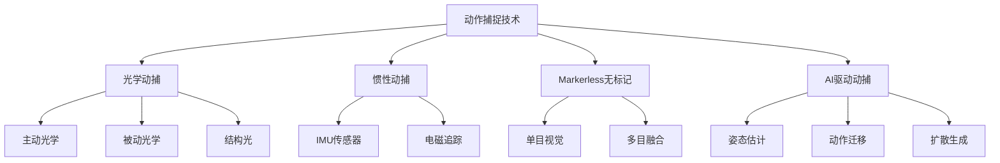
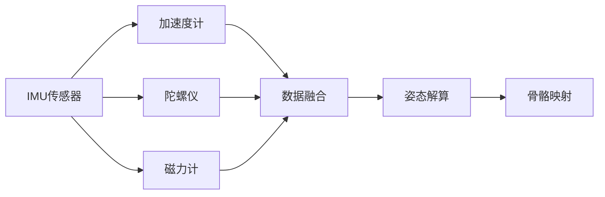
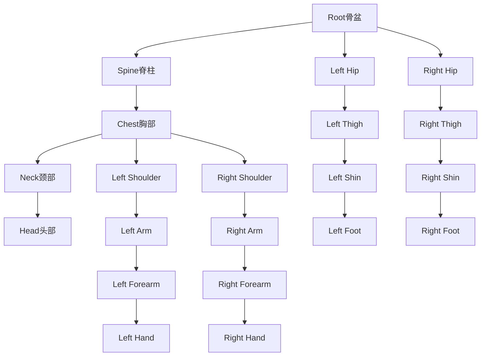

# 动作捕捉技术

## 关键词

| 类别 | 关键词 |
|------|--------|
| 动捕类型 | 光学动捕、惯性动捕、Markerless、AI驱动 |
| 面部捕捉 | Face Capture、ARKit、ARCore、表情捕捉 |
| 身体捕捉 | 骨骼动画、IK/FK、动作库、动作迁移 |
| 手势识别 | MediaPipe Hands、Leap Motion、手语识别 |
| 开源方案 | OpenPose、MediaPipe、SMPL-X、MotionDiffuse |
| 数据格式 | BVH、FBX、SKEL、AnimStack |
| 应用场景 | 动画制作、虚拟直播、游戏开发、体育分析 |
| 性能指标 | 精度、延迟、追踪点数、采样率 |

> [!abstract] 摘要
> 动作捕捉（Motion Capture, MoCap）是将真实人物的动作转化为数字人骨骼动画的关键技术。本文档系统梳理动作捕捉的技术分类（光学/惯性/markerless）、面部与身体捕捉方案、开源工具链及AI驱动动作技术，为数字人动作系统构建提供全面的技术参考。

---

## 1. 动作捕捉技术分类

### 1.1 技术分类概览



### 1.2 三大技术路线对比

| 技术路线 | 精度 | 成本 | 便捷性 | 延迟 | 适用场景 |
|----------|------|------|--------|------|----------|
| **被动光学** | ⭐⭐⭐⭐⭐ | ⭐⭐⭐⭐⭐ | ⭐⭐ | 极低 | 影视特效、动画制作 |
| **惯性动捕** | ⭐⭐⭐⭐ | ⭐⭐⭐ | ⭐⭐⭐⭐ | 低 | 游戏、直播、预演 |
| **AI/Markerless** | ⭐⭐⭐ | ⭐⭐ | ⭐⭐⭐⭐⭐ | 中 | 快速原型、实时应用 |

### 1.3 被动光学动捕

被动光学动捕是目前精度最高的专业方案：

**工作原理**：
- 演员穿戴带有反光球的动捕服
- 多台红外摄像机从不同角度捕捉反光球位置
- 通过三角测量算法重建3D空间位置
- 映射到预设的骨骼结构上

**代表系统**：

| 品牌 | 型号 | 追踪点 | 精度 | 价格 |
|------|------|--------|------|------|
| OptiTrack | Prime 41 | 41MP | <0.2mm | $40,000+ |
| Vicon | Vantage | 16MP | <0.1mm | $100,000+ |
| Phase Space | IMPULSE | 48点 | <0.5mm | $60,000+ |

### 1.4 主动光学动捕

主动光学使用主动发光的LED标记点：

```python
# 主动光学标记点识别算法
def detect_active_markers(frame):
    # 提取红色/绿色LED发光区域
    red_mask = extract_color_region(frame, RED)
    green_mask = extract_color_region(frame, GREEN)
    
    # 形态学处理
    red_markers = morphological_filter(red_mask)
    green_markers = morphological_filter(green_mask)
    
    # 质心计算
    red_centers = [calculate_centroid(m) for m in red_markers]
    green_centers = [calculate_centroid(m) for m in green_markers]
    
    # 3D重建
    points_3d = triangulate(red_centers, green_centers)
    return points_3d
```

### 1.5 惯性动捕

惯性动捕使用IMU（惯性测量单元）传感器：

**优势**：
- 不受遮挡影响，可在任意环境使用
- 便携性强，适合户外和实地采集
- 无需复杂的相机标定

**工作原理**：



```python
# IMU数据融合（互补滤波）
class IMUFusion:
    def __init__(self, alpha=0.98):
        self.alpha = alpha  # 互补滤波系数
        
    def fuse(self, accel, gyro, dt):
        # 加速度计计算角度
        accel_angle = np.arctan2(accel[1], accel[2])
        
        # 陀螺仪积分（漂移大）
        gyro_angle = self.current_angle + gyro[0] * dt
        
        # 互补滤波融合
        fused_angle = (
            self.alpha * gyro_angle + 
            (1 - self.alpha) * accel_angle
        )
        
        return fused_angle
    
    def to_quaternion(self, euler):
        # 欧拉角转四元数
        # ...
```

---

## 2. 表情捕捉技术

### 2.1 FACS系统

面部动作编码系统（Facial Action Coding System, FACS）是表情捕捉的标准理论基础：

| Action Unit | 描述 | 激活肌肉 |
|-------------|------|----------|
| AU1 | 眉内侧上提 | 额肌内侧 |
| AU2 | 眉外侧上提 | 额肌外侧 |
| AU4 | 眉降低 | 降眉肌、皱眉肌 |
| AU6 | 脸颊上提 | 颧大肌 |
| AU9 | 鼻翼上提 | 提上唇鼻翼肌 |
| AU12 | 嘴角上扬 | 颧大肌 |
| AU17 | 下巴上提 | 颏肌 |
| AU25 | 嘴唇张开 | 颏肌 |
| AU26 | 下巴降低 | 二腹肌 |

### 2.2 ARKit面部追踪

iOS的ARKit提供高精度的面部追踪能力：

```swift
// ARKit Face Tracking
import ARKit

class FaceTracker: NSObject, ARSessionDelegate {
    var session: ARSession!
    
    func setupFaceTracking() {
        guard ARFaceTrackingConfiguration.isSupported else { return }
        
        let configuration = ARFaceTrackingConfiguration()
        configuration.isLightEstimationEnabled = true
        
        session.run(configuration)
    }
    
    func session(_ session: ARSession, 
                 didUpdate anchors: [ARAnchor]) {
        guard let faceAnchor = anchors.first as? ARFaceAnchor else { 
            return 
        }
        
        // 获取表情系数（52个blend shape）
        let blendShapes = faceAnchor.blendShapes
        
        let eyeBlinkLeft = blendShapes[.eyeBlinkLeft]?.doubleValue ?? 0
        let eyeBlinkRight = blendShapes[.eyeBlinkRight]?.doubleValue ?? 0
        let mouthSmileLeft = blendShapes[.mouthSmileLeft]?.doubleValue ?? 0
        let jawOpen = blendShapes[.jawOpen]?.doubleValue ?? 0
        
        // 转换为数字人Blend Shape
        self.applyToDigitalHuman(
            eyeBlink: (eyeBlinkLeft + eyeBlinkRight) / 2,
            mouthSmile: (mouthSmileLeft + 
                         (blendShapes[.mouthSmileRight]?.doubleValue ?? 0)) / 2,
            jawOpen: jawOpen
        )
    }
}
```

### 2.3 Live Link Face

Unreal Engine的Live Link Face支持iPhone原生面部追踪：

```python
# Python脚本通过Live Link发送表情数据
from pylivelinkface import PyLiveLinkFace, BlendShapeMode

# 初始化
face = PyLiveLinkFace()

# 连接Unreal Live Link
face.connect_udp("127.0.0.1", 11111)

# 发送表情数据
while True:
    # 获取表情系数
    blendshapes = get_blendshapes_from_model()
    
    # 转换为Live Link格式
    face.send_blendshapes(
        mode=BlendShapeMode.Face,
        timecode=current_timecode,
        blendshapes=blendshapes
    )
```

### 2.4 开源表情捕捉方案

| 方案 | GitHub Stars | 精度 | 实时性 | 平台 |
|------|--------------|------|--------|------|
| MediaPipe Face Mesh | 10k+ | ⭐⭐⭐⭐ | ✅ | 跨平台 |
| OpenFace 2.0 | 8k+ | ⭐⭐⭐⭐⭐ | ❌ | 学术 |
| Dlib | 15k+ | ⭐⭐⭐ | ✅ | Python |
| face-api.js | 12k+ | ⭐⭐⭐ | ✅ | Web |

```javascript
// MediaPipe Face Mesh实时表情捕捉
import { FaceMesh } from '@mediapipe/face_mesh';

const faceMesh = new FaceMesh({
    locateFile: (file) => {
        return `https://cdn.jsdelivr.net/npm/@mediapipe/face_mesh/${file}`;
    }
});

faceMesh.setOptions({
    maxNumFaces: 1,
    refineLandmarks: true,  // 468个关键点
    minDetectionConfidence: 0.5,
    minTrackingConfidence: 0.5
});

faceMesh.onResults((results) => {
    // 提取68个关键点用于表情分析
    const landmarks = results.multiFaceLandmarks[0];
    
    // 计算AU激活强度
    const au4 = calculateBrowRaiser(landmarks);  // AU4
    const au6 = calculateCheekRaiser(landmarks); // AU6
    const au12 = calculateLipCornerPuller(landmarks); // AU12
    
    // 应用到3D模型
    applyExpressionToModel({ au4, au6, au12 });
});
```

---

## 3. 身体动作捕捉

### 3.1 骨骼系统架构

数字人骨骼系统采用层级结构：



### 3.2 IK/FK系统

逆运动学（IK）与正向运动学（FK）是动画控制的核心：

```python
# FABRIK IK算法实现
class FABRIK:
    def __init__(self, joints, lengths, target):
        self.joints = joints  # 关节位置列表
        self.lengths = lengths  # 各段长度
        self.target = target  # 目标位置
        
    def solve(self, max_iterations=10, tolerance=0.01):
        # 计算总臂长
        total_length = sum(self.lengths)
        
        # 检查目标是否可达
        dist_to_target = np.linalg.norm(self.target - self.joints[0])
        if dist_to_target > total_length:
            # 目标不可达，向目标方向伸展
            self.stretch_towards_target()
        else:
            # FABRIK迭代求解
            for _ in range(max_iterations):
                # 后向递推：将末端拉向根节点
                self.backward()
                # 前向递推：将根节点移回原位
                self.forward()
                
                if np.linalg.norm(self.joints[-1] - self.target) < tolerance:
                    break
                    
        return self.joints
    
    def backward(self):
        """后向递推"""
        self.joints[-1] = self.target
        for i in range(len(self.joints) - 2, -1, -1):
            direction = self.joints[i] - self.joints[i + 1]
            direction = direction / np.linalg.norm(direction)
            self.joints[i] = (
                self.joints[i + 1] + 
                direction * self.lengths[i]
            )
    
    def forward(self):
        """前向递推"""
        self.joints[0] = self.root_position
        for i in range(len(self.joints) - 1):
            direction = self.joints[i + 1] - self.joints[i]
            direction = direction / np.linalg.norm(direction)
            self.joints[i + 1] = (
                self.joints[i] + 
                direction * self.lengths[i]
            )
```

### 3.3 动作库与动作匹配

专业动画制作依赖大量预录制的动作库：

```python
# 动作匹配与混合
class MotionBlending:
    def __init__(self):
        self.motion_library = {}
        self.transition_duration = 0.3  # 过渡时长(秒)
    
    def blend_motions(self, motion_a, motion_b, blend_factor):
        """线性混合两个动作"""
        blended_frames = []
        
        for frame_a, frame_b in zip(motion_a, motion_b):
            blended_pose = {}
            for joint in frame_a.keys():
                blended_pose[joint] = lerp(
                    frame_a[joint],
                    frame_b[joint],
                    blend_factor
                )
            blended_frames.append(blended_pose)
            
        return blended_frames
    
    def match_pose(self, current_pose, target_type):
        """从动作库中匹配最适合的过渡动作"""
        best_match = None
        min_distance = float('inf')
        
        for motion in self.motion_library[target_type]:
            distance = self.calculate_pose_distance(
                current_pose, 
                motion[0]  # 取起始帧
            )
            if distance < min_distance:
                min_distance = distance
                best_match = motion
                
        return best_match
```

---

## 4. 手势识别技术

### 4.1 MediaPipe Hands

MediaPipe Hands是Google开源的高精度手部追踪方案：

```python
# MediaPipe Hands手势识别
import cv2
import mediapipe as mp

mp_hands = mp.solutions.hands
hands = mp_hands.Hands(
    static_image_mode=False,
    max_num_hands=2,
    min_detection_confidence=0.5,
    min_tracking_confidence=0.5
)

def recognize_gesture(landmarks):
    """基于21个关键点识别手势"""
    
    # 计算指尖与手掌的距离比
    thumb_tip = landmarks[4]
    index_tip = landmarks[8]
    middle_tip = landmarks[12]
    ring_tip = landmarks[16]
    pinky_tip = landmarks[20]
    palm_base = landmarks[0]
    
    # 计算各手指伸展程度
    finger_states = {
        'thumb': is_thumb_extended(landmarks),
        'index': is_finger_extended(landmarks, 8, 5),
        'middle': is_finger_extended(landmarks, 12, 9),
        'ring': is_finger_extended(landmarks, 16, 13),
        'pinky': is_finger_extended(landmarks, 20, 17)
    }
    
    # 手势分类
    gesture = classify_gesture(finger_states)
    
    return gesture, finger_states

def classify_gesture(states):
    """手势分类"""
    s = states
    
    if s['thumb'] and not any([s['index'], s['middle'], 
                                s['ring'], s['pinky']]):
        return 'OK'
    elif all([s['index'], s['middle'], s['ring'], s['pinky']]):
        return 'OPEN'
    elif not any([s['index'], s['middle'], s['ring'], s['pinky']]):
        return 'FIST'
    elif s['index'] and s['middle'] and not s['ring'] and s['pinky']:
        return 'ROCK'
    # ... 更多手势
    
    return 'UNKNOWN'
```

### 4.2 Leap Motion

Leap Motion专注于手部追踪，精度极高：

```csharp
// Unity中集成Leap Motion
using Leap;
using Leap.Unity;

public class HandController : MonoBehaviour {
    private LeapServiceProvider provider;
    
    void Start() {
        provider = FindObjectOfType<LeapServiceProvider>();
    }
    
    void Update() {
        Frame frame = provider.CurrentFrame;
        
        foreach (Hand hand in frame.Hands) {
            // 获取手部数据
            Vector3 palmPosition = hand.PalmPosition.ToVector3();
            Quaternion palmRotation = hand.PalmRotation.ToQuaternion();
            
            // 获取手指数据
            foreach (Finger finger in hand.Fingers) {
                for (int b = 0; b < finger.bones.Length; b++) {
                    Bone bone = finger.bones[b];
                    // 映射到骨骼
                    UpdateBoneTransform(finger.Type, b, bone);
                }
            }
            
            // 手势识别
            Gesture gesture = DetectGesture(hand);
            ApplyGestureToModel(hand.IsLeft, gesture);
        }
    }
}
```

### 4.3 手语识别

手语识别是特殊的手势应用场景：

```python
# 手语识别模型
class SignLanguageRecognizer:
    def __init__(self):
        self.model = self.load_model('sign_language_model.tflite')
        self.sequence_length = 30  # 帧数
        self.num_classes = 500  # 词汇量
        
    def predict(self, landmark_sequence):
        """识别手语词汇"""
        # 预处理
        features = self.extract_features(landmark_sequence)
        
        # 时序推理（LSTM/Transformer）
        logits = self.model.predict(features)
        
        # 解码
        predicted_class = np.argmax(logits)
        confidence = np.max(logits)
        
        return {
            'class': predicted_class,
            'word': self.idx_to_word[predicted_class],
            'confidence': confidence
        }
    
    def extract_features(self, landmarks):
        """提取时空特征"""
        # 空间特征：21个关键点 × 3坐标 × 2手 = 126
        # 时序特征：序列长度30帧
        
        spatial = []
        for frame in landmarks:
            frame_features = []
            for hand in [frame.left_hand, frame.right_hand]:
                for lm in hand.landmarks:
                    frame_features.extend([lm.x, lm.y, lm.z])
            spatial.append(frame_features)
            
        return np.array(spatial)
```

---

## 5. 开源方案汇总

### 5.1 OpenPose

OpenPose是卡内基梅隆大学开源的多人关键点检测方案：

```bash
# 安装OpenPose
git clone https://github.com/CMU-Perceptual-Computing-Lab/openpose.git
cd openpose
mkdir build && cd build
cmake ..
make -j$(nproc)

# 运行演示
./build/examples/openpose/openpose.bin \
    --video input_video.mp4 \
    --keypoint_scale 3 \
    --model_pose COCO \
    --render_pose 1 \
    --write_video output.avi
```

**支持的关键点**：

| 模型 | 关键点数量 | 身体 | 面部 | 手部 |
|------|------------|------|------|------|
| BODY_25 | 25 | ✅ | ❌ | ❌ |
| COCO | 18 | ✅ | ❌ | ❌ |
| MPI | 15 | ✅ | ❌ | ❌ |
| BODY_135 | 135 | ✅ | ✅ | ✅ |

### 5.2 MediaPipe整体方案

MediaPipe提供完整的人体追踪解决方案：

```python
import mediapipe as mp
from mediapipe.tasks import python

# 使用MediaPipe Pose
base_options = python.BaseOptions(model_asset_path='pose_landmarker.task')
options = python.vision.PoseLandmarkerOptions(
    base_options=base_options,
    running_mode=mp.tasks.vision.RunningMode.VIDEO
)

landmarker = mp.tasks.vision.PoseLandmarker.create_from_options(options)

# 处理视频帧
for frame in video_reader:
    mp_image = mp.Image(image_format=mp.ImageFormat.SRGB, 
                        data=frame)
    
    pose_result = landmarker.detect_for_video(
        mp_image, 
        timestamp_ms=frame.timestamp
    )
    
    # 提取33个关键点
    landmarks = pose_result.pose_landmarks[0]
    
    # 映射到数字人骨骼
    apply_to_skeleton(landmarks)
```

### 5.3 SMPL-X模型

SMPL-X是用于3D人体重建的标准化模型：

```python
# SMPL-X身体重建
import torch
from smplx import SMPLX

# 加载SMPL-X模型
smplx = SMPLX(
    model_path='smplx/',
    num_pExpression_coeffs=100,  # 表情参数
    use_hands=True
)

def estimate_smplx(image):
    """从图像估计SMPL-X参数"""
    
    # 使用ExPose或PIXIE估计
    params = expose_estimator.predict(image)
    
    # 提取参数
    betas = params['shape']  # 体型参数(10维)
    global_orient = params['global_pose']  # 全局朝向
    body_pose = params['body_pose']  # 身体姿势
    left_hand_pose = params['left_hand']  # 左手姿势
    right_hand_pose = params['right_hand']  # 右手姿势
    expression = params['expression']  # 表情参数
    
    # SMPL-X前向计算
    output = smplx(
        betas=betas,
        global_orient=global_orient,
        body_pose=body_pose,
        left_hand_pose=left_hand_pose,
        right_hand_pose=right_hand_pose,
        expression=expression,
        return_verts=True
    )
    
    return output.vertices, output.joints
```

### 5.4 开源方案对比

| 方案 | 3D支持 | 实时性 | 精度 | 手部 | 面部 | 许可证 |
|------|--------|--------|------|------|------|--------|
| OpenPose | ❌ | ✅ | ⭐⭐⭐ | ✅ | ✅ | Apache 2.0 |
| MediaPipe | ❌ | ✅ | ⭐⭐⭐⭐ | ✅ | ✅ | Apache 2.0 |
| SMPL-X | ✅ | ❌ | ⭐⭐⭐⭐⭐ | ✅ | ✅ | CC BY-NC 4.0 |
| VIBE | ✅ | ✅ | ⭐⭐⭐⭐ | ❌ | ❌ | MIT |
| MotionDiffuse | ✅ | ❌ | ⭐⭐⭐⭐ | ✅ | ❌ | MIT |
| HuMAn | ✅ | ✅ | ⭐⭐⭐⭐ | ✅ | ❌ | Apache 2.0 |

---

## 6. AI驱动动作生成

### 6.1 MotionDiffuse

MotionDiffuse是使用扩散模型生成人体动作的前沿方案：

> [!note] 技术创新
> MotionDiffuse将文本描述作为条件输入，生成符合语义的人体动作序列

```python
# MotionDiffuse推理
import torch
from motiondiffuse import MotionDiffuse

model = MotionDiffuse.load_pretrained('motiondiffuse_t2m')

# 文本生成动作
motion = model.generate(
    text="a person walks forward and waves hand",
    num_frames=60,  # 2秒(30fps)
    temperature=0.7
)

# 转换为BVH格式
bvh_data = model.to_bvh(motion)
save_bvh('output.bvh', bvh_data)
```

### 6.2 动作迁移（Motion Transfer）

将源人物的动作迁移到目标数字人：

```python
# MotionBERT动作迁移
from motionbert import MotionBERT

mb = MotionBERT('motionbert_pretrain.pth')

# 从视频提取动作
video_path = 'source_video.mp4'
motion_3d = mb.extract_motion(video_path)

# 迁移到目标骨骼
target_skeleton = load_skeleton('target_rig.bvh')
migrated_motion = mb.retarget(motion_3d, target_skeleton)

# 导出到目标软件
migrated_motion.export('target_motion.bvh')
```

### 6.3 实时AI动捕

```python
# 基于MediaPipe的实时AI动捕
import cv2
import mediapipe as mp
import numpy as np

class RealTimeMoCap:
    def __init__(self, smoothing=0.5):
        self.mp_pose = mp.solutions.pose
        self.pose = self.mp_pose.Pose(
            enable_segmentation=False,
            model_complexity=2,
            smooth_landmarks=True
        )
        self.smoothing = smoothing
        self.prev_landmarks = None
        
    def process_frame(self, frame):
        rgb = cv2.cvtColor(frame, cv2.COLOR_BGR2RGB)
        results = self.pose.process(rgb)
        
        if results.pose_landmarks:
            landmarks = self.normalize_landmarks(
                results.pose_landmarks
            )
            
            # 时序平滑
            if self.prev_landmarks is not None:
                landmarks = self.smooth(landmarks, self.prev_landmarks)
            
            self.prev_landmarks = landmarks
            
            # 应用到数字人骨骼
            self.apply_to_digital_human(landmarks)
            
            return landmarks
        return None
    
    def smooth(self, current, previous):
        return previous * self.smoothing + current * (1 - self.smoothing)
```

---

## 7. 数据格式与导出

### 7.1 常用格式

| 格式 | 描述 | 支持软件 | 文件大小 |
|------|------|----------|----------|
| FBX | Autodesk通用格式 | 全部 | 中 |
| BVH | Biovision层级数据 | 全部 | 大 |
| SKEL | Unity骨骼格式 | Unity | 小 |
| AnimStack | Blender动画 | Blender | 中 |
| USD | Pixar通用场景 | 全部 | 中 |

### 7.2 BVH格式说明

BVH（Biovision Hierarchy）是最通用的动作捕捉格式：

```
HIERARCHY
ROOT hips
{
    OFFSET 0.00 85.00 0.00
    CHANNELS 6 Xposition Yposition Zposition Zrotation Yrotation Xrotation
    JOINT torso
    {
        OFFSET 0.00 10.00 0.00
        CHANNELS 3 Zrotation Yrotation Xrotation
        JOINT chest
        {
            OFFSET 0.00 20.00 0.00
            CHANNELS 3 Zrotation Yrotation Xrotation
            ...
        }
    }
}
MOTION
Frames: 120
Frame Time: 0.033333
数据行...
```

### 7.3 导出脚本

```python
# Blender导出BVH脚本
import bpy

def export_bvh(output_path):
    # 选择骨架
    armature = bpy.data.objects['Armature']
    bpy.context.view_layer.objects.active = armature
    armature.select_set(True)
    
    # 切换到姿态模式
    bpy.ops.object.mode_set(mode='POSE')
    
    # 导出BVH
    bpy.ops.export_anim.bvh(
        filepath=output_path,
        global_scale=1.0,
        frame_start=1,
        frame_end=120,
        rotate_mode='ZYX'
    )

# 使用Unreal骨骼映射导出FBX
def export_fbx_with_retarget(source_armature, target_template):
    # 定义骨骼映射表
    bone_mapping = {
        'hips': 'Pelvis',
        'spine': 'Spine',
        'chest': 'Chest',
        'neck': 'Neck',
        'head': 'Head',
        'left_upArm': 'LeftArm',
        'left_lowArm': 'LeftForeArm',
        'left_hand': 'LeftHand',
        # ...
    }
    
    # 执行重定向
    for src_bone, tgt_bone in bone_mapping.items():
        source_bone = source_armature.bones[src_bone]
        target_bone = target_template.bones[tgt_bone]
        
        # 复制变换
        copy_transform(source_bone, target_bone)
    
    # 导出
    bpy.ops.export_scene.fbx(
        filepath='output.fbx',
        use_selection=True,
        armature_nodetype='NULL'
    )
```

---

## 相关文档

- [[数字人形象生成]] - 数字人视觉形象
- [[TTS语音合成]] - 语音生成
- [[口型同步技术]] - 唇形同步
- [[数字人交互系统]] - 智能对话
- [[实时渲染技术]] - 骨骼动画渲染
- [[数字人平台工具]] - 工具链整合

---

## 更新日志

| 日期 | 版本 | 修改内容 |
|------|------|----------|
| 2026-04-18 | v1.0 | 初版完成 |

---

> [!copyright] 版权声明
> 本文档为归愚知识库原创内容，采用CC BY-NC-SA 4.0协议授权。
