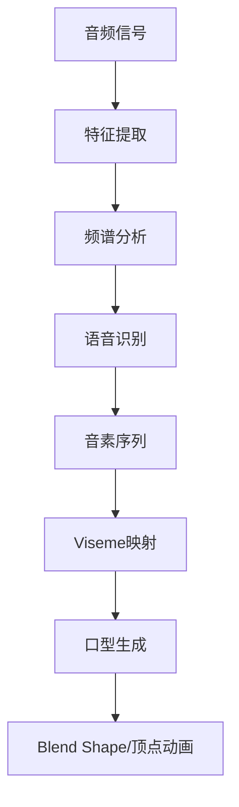
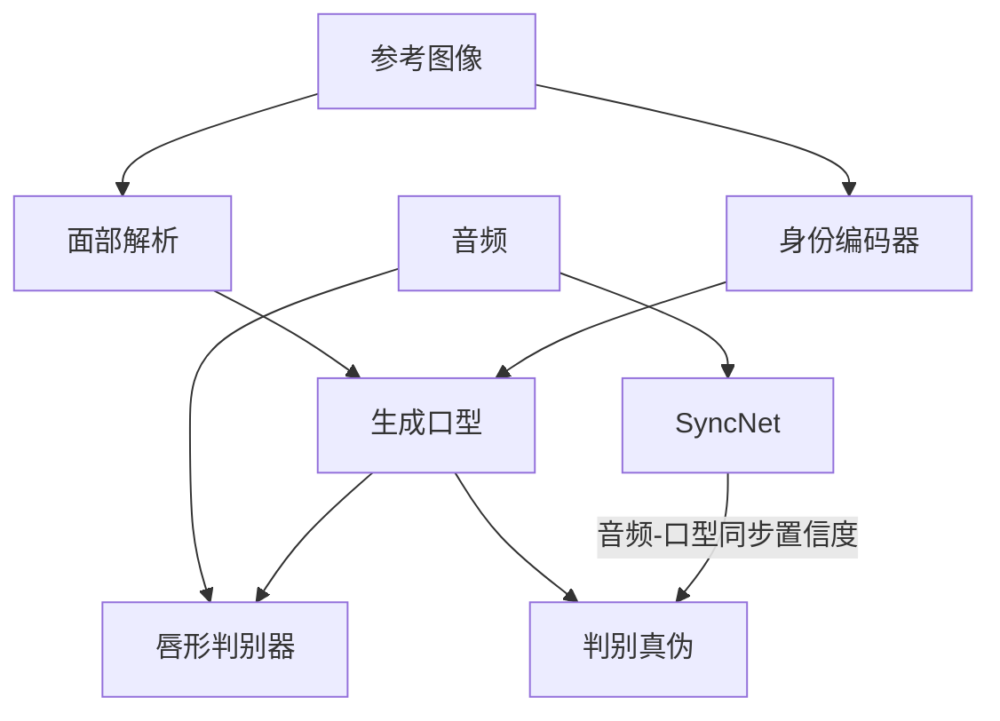
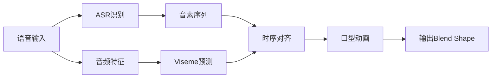

# 口型同步技术

## 关键词

| 类别 | 关键词 |
|------|--------|
| 技术原理 | 口型同步、Lip Sync、Viseme、语音驱动、Blend Shape |
| 核心技术 | Wav2Lip、SadTalker、Dinotalk、MakeItTalk、Audio-driven |
| 2D方案 | Wav2Lip、Video-retalking、DINet |
| 3D方案 | FLITE、ARCA、MetaHuman Face Solver |
| 实时方案 | OVRLipSync、WebRTC、MediaPipe |
| 质量评估 | SSIM、PSNR、LMD、SyncNet置信度 |
| 开源工具 | SadTalker、wav2lip_gan、MuseTalk、Live2D |
| 应用场景 | 虚拟主播、语音翻译、视频配音、直播带货 |

> [!abstract] 摘要
> 口型同步（Lip Synchronization）是数字人实现自然说话效果的核心技术，负责将语音信号转换为对应的唇形动画。本文档系统梳理口型同步的技术原理、主流算法方案、开源工具及实时应用部署方案，为构建高质量数字人提供全面的口型同步技术参考。

---

## 1. Lip Sync技术原理

### 1.1 核心概念

口型同步的核心是将音频信号转换为对应的嘴型状态。在语音学和计算机图形学中，这个基本单元被称为**视素（Viseme）**。

**Viseme定义**：

| Viseme | 描述 | 典型音素 | 口型特征 |
|--------|------|----------|----------|
| AI | 安静状态 | - | 双唇闭合 |
| E | 微笑元音 | /iː/ | 嘴角上扬，露齿 |
| O | 圆唇元音 | /oʊ/ | 嘴唇圆缩 |
| U | 小圆唇 | /uː/ | 嘴唇收紧 |
| A | 张嘴元音 | /æ/ | 嘴巴张大 |
| M/B/P | 闭合辅音 | /m/,/b/,/p/ | 双唇紧闭 |
| F/V | 唇齿音 | /f/,/v/ | 下唇接触上齿 |
| TH | 舌尖音 | /ð/,/θ/ | 舌尖抵上齿 |

### 1.2 技术架构



#### 音频特征提取

```python
# MFCC特征提取
import librosa
import numpy as np

def extract_audio_features(audio_path):
    # 加载音频
    y, sr = librosa.load(audio_path, sr=16000)
    
    # 提取MFCC特征
    mfcc = librosa.feature.mfcc(y=y, sr=sr, n_mfcc=13)
    
    # 提取梅尔频谱
    mel_spec = librosa.feature.melspectrogram(
        y=y, sr=sr, n_mels=80
    )
    mel_spec_db = librosa.power_to_db(mel_spec, ref=np.max)
    
    return mfcc, mel_spec_db

# 提取音素
def get_phonemes(audio_path):
    import speech_recognition as sr
    recognizer = sr.Recognizer()
    # 使用强制对齐获取音素边界
    # ...
```

#### Viseme映射规则

```python
# 音素到Viseme映射表
PHONEME_TO_VISEME = {
    # 元音
    'i': 'E', 'ɪ': 'E', 'e': 'E', 'ɛ': 'E',
    'æ': 'A', 'ɑ': 'A', 'ɔ': 'O', 'o': 'O',
    'ʊ': 'U', 'u': 'U', 'ʌ': 'A',
    # 辅音
    'm': 'MBP', 'b': 'MBP', 'p': 'MBP',
    'f': 'FV', 'v': 'FV',
    'θ': 'TH', 'ð': 'TH',
    's': 'SZ', 'z': 'SZ',
    'ʃ': 'SH', 'ʒ': 'SH',
    't': 'TD', 'd': 'TD',
    'n': 'N', 'l': 'L', 'r': 'R',
    'w': 'W', 'j': 'Y',
    'k': 'KG', 'g': 'KG',
    'h': 'AI'
}
```

### 1.3 Blend Shape驱动

对于3D数字人，口型同步通过控制Blend Shape实现：

```python
# Unreal Engine Blend Shape控制
class LipSyncController:
    def __init__(self):
        self.blend_shapes = {
            'mouth_smile_left': 0.0,
            'mouth_smile_right': 0.0,
            'mouth_open': 0.0,
            'jaw_open': 0.0,
            'mouth_pucker': 0.0,
            # ... 更多Blend Shape
        }
    
    def update_viseme(self, viseme_name, intensity):
        """根据Viseme更新Blend Shape"""
        blend_value = self.calculate_blend_value(viseme_name)
        self.blend_shapes[viseme_name] = blend_value * intensity
        self.apply_to_model()
    
    def calculate_blend_value(self, viseme):
        """计算各Blend Shape的权重"""
        # 不同Viseme组合不同Blend Shape
        if viseme == 'O':
            return {
                'jaw_open': 0.5,
                'mouth_pucker': 0.8,
                'mouth_widen': 0.0
            }
        # ...
```

---

## 2. Wav2Lip技术详解

### 2.1 论文核心思想

Wav2Lip是2020年发表的里程碑式论文，提出了基于GAN的口型同步方法：

> [!note] 核心贡献
> Wav2Lip首次实现了在任意视频上精确同步口型的效果，即使原始视频中人物不说话也能进行口型驱动。

**技术架构**：



### 2.2 代码实现

```python
# Wav2Lip推理代码
import torch
from Wav2Lip import models

class Wav2LipInferencer:
    def __init__(self, checkpoint_path):
        self.device = torch.device(
            'cuda' if torch.cuda.is_available() else 'cpu'
        )
        self.model = models.Wav2Lip().to(self.device)
        checkpoint = torch.load(checkpoint_path)
        self.model.load_state_dict(checkpoint['state_dict'])
        self.model.eval()
    
    @torch.no_grad()
    def generate(self, image_path, audio_path, static=False):
        # 预处理
        face = self.preprocess_image(image_path)
        mel = self.preprocess_audio(audio_path)
        
        # 生成
        pred = self.model(face, mel)
        
        return pred
    
    def preprocess_image(self, image_path):
        """预处理人脸图像"""
        # 检测人脸边界框
        # 调整大小至96x96
        # 归一化处理
        pass
    
    def preprocess_audio(self, audio_path):
        """预处理音频为mel频谱"""
        # 加载音频
        # 计算80维mel频谱
        # 时间对齐
        pass
```

### 2.3 使用示例

```bash
# 安装Wav2Lip
git clone https://github.com/Rudrabha/Wav2Lip.git
cd Wav2Lip
pip install -r requirements.txt

# 下载预训练模型
# 方式1: 使用wget
wget "https://www.adrianbulat.com/downloads/python-faces/wav2lip_gan.pth"

# 方式2: 使用Google Drive
gdown "https://drive.google.com/uc?id=1N3mPkPzlP5xCVdF2A6vJsXK1z9R7h4z-"

# 推理命令
python inference.py \
    --checkpoint_path wav2lip_gan.pth \
    --face sample_video.mp4 \
    --audio sample_audio.wav \
    --outfile output.mp4
```

### 2.4 参数配置

| 参数 | 说明 | 推荐值 |
|------|------|--------|
| `pad` | 面部周围padding | `[0, 30, 0, 30]` |
| `static` | 是否使用单帧静态图 | `False` |
| `fps` | 输出视频帧率 | `25` |
| `pads` | 额外的边界框调整 | `[0, 10, 0, 0]` |
| `face_det_batch_size` | 人脸检测批次大小 | `16` |
| `wav2lip_batch_size` | 推理批次大小 | `8` |

---

## 3. SadTalker与Dinotalk

### 3.1 SadTalker技术解析

SadTalker（2023）是新一代口型同步技术，能够从单张静态图像生成3D一致的头部运动：

**核心技术**：

- **3D感知**：生成3D运动系数而非直接像素修改
- **表情一致**：保持原图的表情和身份特征
- **自然运动**：头部旋转、视线变化更自然

```python
# SadTalker推理示例
from SadTalker import SadTalker

sadtalker = SadTalker(
    checkpoint_dir='checkpoints',
    device='cuda'
)

# 生成口型同步视频
sadtalker.generate(
    image_path='portrait.jpg',
    audio_path='speech.wav',
    ref_pose=None,  # 可指定参考姿势
    enhancer='gfpgan'  # 可选：使用GFPGAN增强画质
)
```

### 3.2 Dinotalk（虎牙开源）

Dinotalk是虎牙团队开源的高质量实时口型同步方案：

| 特性 | 说明 |
|------|------|
| 实时性 | 支持实时推理 |
| 轻量化 | 模型体积小 |
| 多语言 | 支持中英日韩等多语种 |
| 开源 | 完全免费可商用 |

### 3.3 技术对比

| 方案 | 质量 | 速度 | 3D支持 | 开源 | 推荐场景 |
|------|------|------|--------|------|----------|
| Wav2Lip | ⭐⭐⭐⭐ | 中 | ❌ | ✅ | 视频口型同步 |
| SadTalker | ⭐⭐⭐⭐⭐ | 慢 | ✅ | ✅ | 高质量创作 |
| Dinotalk | ⭐⭐⭐⭐ | 快 | ✅ | ✅ | 实时应用 |
| Video-retalking | ⭐⭐⭐⭐⭐ | 慢 | ✅ | ✅ | 最高质量 |

---

## 4. 音频驱动口型

### 4.1 技术流程



### 4.2 OVRLipSync（Meta）

OVRLipSync是Meta推出的实时唇形同步SDK：

```c++
// OVRLipSync集成示例
#include "OVRLipSync.h"

// 初始化
ovrLipSyncContextHandle lipSyncContext;
ovrLipSync_CreateContext(
    &lipSyncContext, 
    48000,  // 采样率
    ovrLipSyncMode::Original
);

// 处理音频帧
float audioBuffer[1024];
ovrLipSync_ProcessAudio(
    lipSyncContext,
    audioBuffer,
    1024,
    &visemes[0],  // 输出viseme系数
    &frameScore
);

// 应用到模型
for (int i = 0; i < NUM_VISEMES; i++) {
    SetBlendShapeWeight(visemeIndex[i], visemes[i]);
}
```

### 4.3 Web Audio API实现

```javascript
// Web端实时口型同步
class WebLipSync {
    constructor() {
        this.audioContext = new AudioContext();
        this.analyser = this.audioContext.createAnalyser();
        this.visemeStates = new Float32Array(22);
    }
    
    async init(modelPath) {
        // 加载ONNX模型
        this.session = await ort.InferenceSession.create(modelPath);
    }
    
    processAudio(audioBuffer) {
        // 提取MFCC特征
        const features = this.extractMFCC(audioBuffer);
        
        // 推理得到Viseme
        const feeds = {
            'input': new ort.Tensor('float32', features, [1, features.length])
        };
        
        const results = this.session.run(feeds);
        this.visemeStates = results.output.data;
        
        // 更新3D模型口型
        this.updateModelVisemes(this.visemeStates);
    }
    
    extractMFCC(audioBuffer) {
        // MFCC特征提取实现
        // ...
    }
    
    updateModelVisemes(visemes) {
        // 将Viseme映射到3D模型BlendShape
        const blendShapes = this.visemeToBlendShape(visemes);
        this.model.setBlendShapes(blendShapes);
    }
}
```

---

## 5. 视频驱动口型

### 5.1 原理说明

视频驱动口型（Video-driven Lip Sync）使用源视频中的口型信息来驱动目标数字人：

| 方法 | 输入 | 优势 | 劣势 |
|------|------|------|------|
| 直接替换 | 源视频+目标图像 | 效果精确 | 需要同一人 |
| 特征迁移 | 任意视频 | 灵活性高 | 质量损失 |
| 3D重建 | 单目/多目视频 | 可控性强 | 复杂度高 |

### 5.2 MakeItTalk

MakeItTalk可以将说话视频转换为动画：

```python
# MakeItTalk使用
from makeittalk import MakeItTalk

mit = MakeItTalk('checkpoints/')

# 使用音频驱动图像
mit.animate(
    image='speaker.jpg',
    audio='speech.wav'
)

# 或使用视频驱动
mit.animate_from_video(
    source_video='source.mp4',
    target_image='target.jpg'
)
```

### 5.3 DINet（AAAI 2022）

DINet提出了基于分解式注意力网络的视频驱动口型同步：

> [!example] 技术创新点
> DINet将口型运动分解为身份无关的形状变化和身份相关的纹理变化分别处理

```python
# DINet核心代码结构
class DINet(nn.Module):
    def __init__(self):
        self.content_encoder = ContentEncoder()  # 内容编码
        self.shape_estimator = ShapeEstimator()  # 形状估计
        self.texture_generator = TextureGenerator()  # 纹理生成
        self.motion_field = MotionField()  # 运动场
        
    def forward(self, source, driving):
        # 编码源图像和驱动视频
        content = self.content_encoder(source)
        driving_features = self.content_encoder(driving)
        
        # 估计口型形状
        shape = self.shape_estimator(driving_features)
        
        # 生成新纹理
        texture = self.texture_generator(content, driving_features)
        
        # 计算运动场并变形
        output = self.motion_field(texture, shape)
        return output
```

---

## 6. 实时口型同步

### 6.1 技术挑战

实时口型同步面临以下挑战：

| 挑战 | 影响 | 解决方案 |
|------|------|----------|
| 延迟 | 口型与声音不同步 | 音频预取、异步处理 |
| 抖动 | 口型跳跃不稳定 | 时序平滑滤波 |
| 质量 | 实时性影响质量 | 模型量化、TensorRT加速 |
| 丢帧 | 网络抖动导致 | 缓冲与插值 |

### 6.2 MuseTalk（腾讯开源）

MuseTalk是腾讯开源的实时数字人嘴型驱动方案：

```python
# MuseTalk实时推理
import torch
from musechat import MuseTalk

# 初始化（支持WebSocket服务）
mt = MuseTalk(
    model_path='musechat_model.pth',
    device='cuda',
    websocket_mode=True
)

# 启动服务
mt.start_server(port=8080)

# 客户端调用
def send_audio_chunk(audio_data):
    # 发送音频块到服务端
    response = requests.post(
        'http://localhost:8080/lipsync',
        data=audio_data,
        headers={'Content-Type': 'audio/raw'}
    )
    return response.json()['viseme_data']
```

### 6.3 Live2D口型方案

对于二次元风格的数字人，Live2D是常用的解决方案：

```javascript
// Live2D Cubism SDK口型控制
class Live2DLipSync {
    constructor(modelPath) {
        Live2D.Cubism4.Motion.ignoreOptimization = true;
        this.model = Live2D.Cubism4.Model.fromModelJson(modelPath);
    }
    
    updateVisemes(audioAnalyzer) {
        // 获取音频分析数据
        const spectrum = audioAnalyzer.getSpectrum();
        const formants = this.extractFormants(spectrum);
        
        // 映射到Live2D参数
        // mouthOpenY 控制嘴巴开合
        // mouthForm  控制嘴巴形状
        this.model.setParameterValueById(
            'ParamMouthOpenY',
            formants.openness * 0.8
        );
        this.model.setParameterValueById(
            'ParamMouthForm',
            formants.roundness - 0.5
        );
    }
    
    extractFormants(spectrum) {
        // 使用线性预测编码提取共振峰
        // F1: 300-800Hz（决定元音类型）
        // F2: 800-2500Hz（决定元音类型）
        return {
            openness: this.calculateFormantRatio(spectrum),
            roundness: this.calculateRoundness(spectrum)
        };
    }
}
```

### 6.4 性能优化

> [!tip] 实时优化策略
> 实现毫秒级口型同步的关键优化：

```python
# TensorRT加速推理
import torch
from torch2trt import torch2trt

# 转换模型到TensorRT
model = load_model('lipsync_model.pth')
model.eval()
model = model.cuda()

# 准备示例输入
x = torch.randn(1, 80, 16).cuda()

# 转换
model_trt = torch2trt(
    model,
    [x],
    fp16_mode=True,  # 使用半精度
    max_batch_size=8
)

# 加速推理
with torch.no_grad():
    output = model_trt(x)
```

---

## 7. 质量评估与调优

### 7.1 评估指标

| 指标 | 说明 | 计算方式 | 阈值 |
|------|------|----------|------|
| SyncNet置信度 | 音视频同步程度 | 余弦相似度 | >0.5 |
| LMD | 口型距离误差 | 关键点距离 | <5像素 |
| SSIM | 结构相似度 | 图像对比 | >0.8 |
| 主观MOS | 用户评分 | 人工评估 | >4.0 |

### 7.2 常见问题与修复

| 问题 | 原因 | 解决方案 |
|------|------|----------|
| 口型夸张 | Viseme权重过高 | 降低Blend Shape强度 |
| 口型抖动 | 时序不平滑 | 添加低通滤波 |
| 不同步 | 延迟累积 | 调整音频预取量 |
| 表情僵硬 | 缺少微表情 | 添加副语言动画 |

---

## 相关文档

- [[数字人形象生成]] - 数字人视觉形象
- [[TTS语音合成]] - 语音生成技术
- [[动作捕捉技术]] - 身体动作捕捉
- [[数字人交互系统]] - 多模态交互
- [[实时渲染技术]] - 渲染管线
- [[数字人平台工具]] - 工具链整合

---

## 更新日志

| 日期 | 版本 | 修改内容 |
|------|------|----------|
| 2026-04-18 | v1.0 | 初版完成 |

---

> [!copyright] 版权声明
> 本文档为归愚知识库原创内容，采用CC BY-NC-SA 4.0协议授权。
