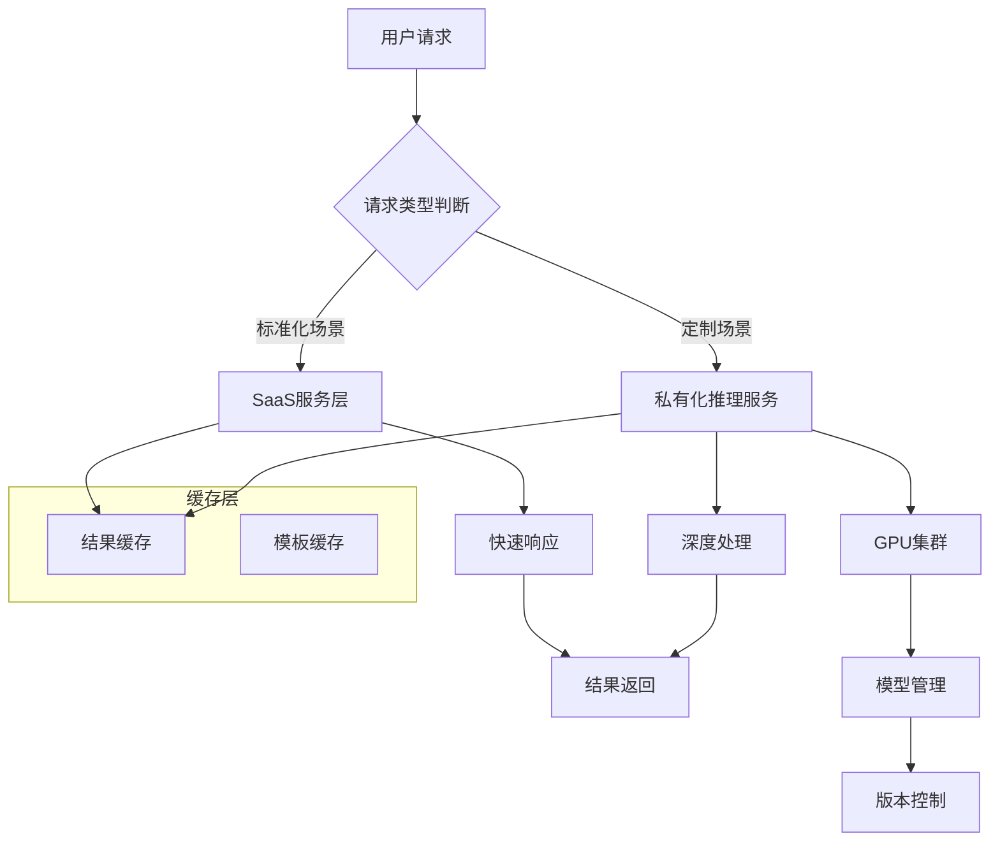
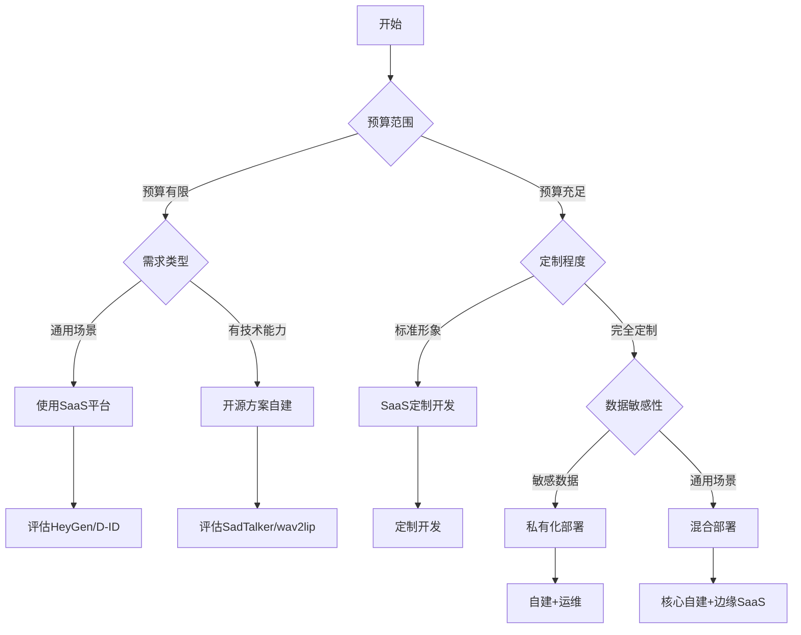

# 数字人平台工具

## 关键词

| 类别 | 关键词 |
|------|--------|
| 商业平台 | HeyGen、D-ID、Synthesia、腾讯智影、剪映 |
| 开源方案 | SadTalker、wav2lip、ComfyUI、Stable Diffusion |
| 自建工具 | MetaHuman、Live Link Face、Live Portraits |
| 对比维度 | 价格、质量、易用性、API支持、定制化 |
| 部署方式 | SaaS云服务、私有化部署、混合部署 |
| 成本模型 | 按次计费、包月订阅、永久授权、算力成本 |
| 行业方案 | 直播、教育、客服、影视、营销 |
| 技术选型 | 自建vs购买、开源vs商业、2D vs 3D |

> [!abstract] 摘要
> 数字人构建涉及众多平台和工具，从商业SaaS服务到开源方案各有优劣。本文档系统梳理主流数字人平台的功能对比、开源工具链汇总、自建与SaaS方案的成本分析、部署方案选择及行业应用案例，为数字人项目的技术选型提供全面的参考依据。

---

## 1. 数字人平台对比

### 1.1 主流SaaS平台概览

| 平台 | 定位 | 核心能力 | 定价策略 |
|------|------|----------|----------|
| **HeyGen** | 商业视频生成 | 数字人视频、AI配音、多语言 | $29-199/月 |
| **D-ID** | 照片说话人 | 静态图驱动、API丰富 | $0.2-1/张 |
| **Synthesia** | 企业视频 | AI主播、PPT转视频 | $30-83/月 |
| **腾讯智影** | 视频创作 | 数字分身、智能剪辑 | ¥99-599/月 |
| **剪映** | 短视频创作 | 数字人模板、Dreamina | 免费/订阅 |
| **万兴播爆** | 跨境营销 | 多语言数字人 | ¥99-299/月 |

### 1.2 详细功能对比

| 功能维度 | HeyGen | D-ID | Synthesia | 腾讯智影 |
|----------|--------|------|-----------|----------|
| **2D数字人** | ⭐⭐⭐⭐⭐ | ⭐⭐⭐⭐⭐ | ⭐⭐⭐⭐ | ⭐⭐⭐⭐ |
| **3D数字人** | ⭐⭐⭐ | ⭐ | ⭐⭐ | ⭐⭐⭐⭐ |
| **声音克隆** | ✅ | ✅ | ❌ | ✅ |
| **口型同步** | ⭐⭐⭐⭐⭐ | ⭐⭐⭐⭐ | ⭐⭐⭐⭐ | ⭐⭐⭐⭐ |
| **多语言** | 40+ | 120+ | 60+ | 中文为主 |
| **API支持** | ✅ | ✅ | ✅ | ✅ |
| **自定义形象** | ✅ | ✅ | ❌ | ✅ |
| **实时互动** | ❌ | ❌ | ❌ | ✅ |
| **输出质量** | 1080p | 720-1080p | 1080p | 1080p |
| **处理速度** | 快 | 快 | 中 | 中 |

### 1.3 HeyGen深度解析

HeyGen是当前最流行的AI视频数字人平台：

```python
# HeyGen API调用示例
import requests
import json

class HeyGenAPI:
    def __init__(self, api_key):
        self.api_key = api_key
        self.base_url = "https://api.heygen.com"
        self.headers = {
            "X-Api-Key": api_key,
            "Content-Type": "application/json"
        }
    
    def create_video(self, script, avatar_id, voice_id):
        """创建数字人视频"""
        payload = {
            "video_inputs": [{
                "character": {
                    "type": "avatar",
                    "avatar_id": avatar_id,
                    "scale": 1.0
                },
                "background": {
                    "type": "color",
                    "value": "#FFFFFF"
                },
                "script": {
                    "type": "text",
                    "input": script
                },
                "voice": {
                    "type": "audio",
                    "voice_id": voice_id
                }
            }],
            "aspect_ratio": "16:9",
            "callback_url": "https://your-callback.com/webhook"
        }
        
        response = requests.post(
            f"{self.base_url}/v2/video/generate",
            headers=self.headers,
            json=payload
        )
        
        return response.json()
    
    def list_avatars(self):
        """获取可用数字人形象"""
        response = requests.get(
            f"{self.base_url}/v1/avatar_type/list",
            headers=self.headers
        )
        return response.json()
    
    def get_video_status(self, video_id):
        """查询视频生成状态"""
        response = requests.get(
            f"{self.base_url}/v1/video_status.get",
            params={"video_id": video_id},
            headers=self.headers
        )
        return response.json()
```

> [!tip] HeyGen使用建议
> - **适合场景**：快速生成营销视频、培训内容、新闻播报
> - **不适合场景**：需要深度定制、实时交互、大量生产

### 1.4 D-ID平台特性

```python
# D-ID API调用示例
import requests

class DID_API:
    def __init__(self, api_key):
        self.api_key = api_key
        self.base_url = "https://api.d-id.com"
    
    def create_talking_photo(self, source_image, audio_url):
        """从静态图片创建说话视频"""
        payload = {
            "source_url": source_image,
            "driver_url": "bank://template_id",
            "audio_url": audio_url,
            "config": {
                "smooth": True,
                "pad": 0
            }
        }
        
        headers = {
            "Authorization": f"Bearer {self.api_key}",
            "Content-Type": "application/json"
        }
        
        response = requests.post(
            f"{self.base_url}/v2/talking-photo",
            headers=headers,
            json=payload
        )
        
        return response.json()
    
    def create_video(self, script, source_image):
        """直接创建视频（带TTS）"""
        payload = {
            "source_url": source_image,
            "script": {
                "type": "text",
                "input": script,
                "provider": "microsoft",
                "voice_id": "en-US-JennyNeural"
            }
        }
        
        response = requests.post(
            f"{self.base_url}/v2/talking-photo",
            headers=headers,
            json=payload
        )
        
        return response.json()
```

---

## 2. 开源工具链汇总

### 2.1 图像与视频生成类

| 工具 | GitHub Stars | 核心功能 | 平台 | 难度 |
|------|--------------|----------|------|------|
| **Stable Diffusion** | 130k+ | 图像生成 | Python | 中 |
| **ComfyUI** | 50k+ | 节点式工作流 | Python | 高 |
| **SadTalker** | 18k+ | 口型同步 | Python | 低 |
| **wav2lip** | 45k+ | 视频口型同步 | Python | 低 |
| **Live2D** | - | 2D动画 | SDK | 中 |
| **Roop** | 35k+ | 换脸 | Python | 低 |

### 2.2 SadTalker安装与使用

SadTalker是当前最流行的开源口型同步方案：

```bash
# 完整安装流程
# 1. 克隆仓库
git clone https://github.com/OpenTalker/SadTalker.git
cd SadTalker

# 2. 创建虚拟环境
python -m venv sadtalker_env
source sadtalker_env/bin/activate

# 3. 安装依赖
pip install -r requirements.txt

# 4. 下载预训练模型
bash scripts/download_models.sh

# 5. 运行推理
python inference.py \
    --driven_audio your_audio.wav \
    --source_image portrait.jpg \
    --result_dir output/ \
    --enhancer gfpgan
```

```python
# SadTalker Python API调用
from SadTalker import SadTalker

sadtalker = SadTalker(
    checkpoint_dir='checkpoints',
    config='configs SadTalker',
    device='cuda'
)

# 生成说话视频
result = sadtalker.generate(
    image='portrait.jpg',
    audio='speech.wav',
    preprocess='crop',  # crop / resize / full
    still=True,  # 保持上半身静止
    enhancer='gfpgan',  # 画质增强
    expression_scale=1.0,  # 表情强度
    use_lipschitz=False
)

print(f"输出路径: {result['video_path']}")
```

### 2.3 wav2lip详细配置

```bash
# wav2lip安装
git clone https://github.com/Rudrabha/Wav2Lip.git
cd Wav2Lip

pip install -r requirements.txt

# 下载模型
# 基础版
wget "https://www.adrianbulat.com/downloads/python-faces/wav2lip.pth"
# GAN版（更高质量）
wget "https://www.adrianbulat.com/downloads/python-faces/wav2lip_gan.pth"
```

```python
# wav2lip推理代码
import torch
from torchvision import transforms
from Wav2Lip import models

class Wav2LipPredictor:
    def __init__(self, model_path='wav2lip_gan.pth'):
        self.device = torch.device('cuda' if torch.cuda.is_available() else 'cpu')
        self.model = self._load_model(model_path)
    
    def _load_model(self, checkpoint_path):
        model = models.Wav2Lip().to(self.device)
        checkpoint = torch.load(checkpoint_path, map_location=self.device)
        model.load_state_dict(checkpoint['state_dict'])
        model.eval()
        return model
    
    def predict(self, video_path, audio_path, static=False):
        # 逐帧处理
        for frame in self.load_video_frames(video_path):
            mel = self.audio_to_mel(audio_path)
            
            # 批量预测
            with torch.no_grad():
                pred = self.model(frame, mel)
            
            yield self.tensor_to_image(pred)
    
    def audio_to_mel(self, audio_path):
        """音频转mel频谱"""
        import librosa
        y, sr = librosa.load(audio_path, sr=16000)
        mel = librosa.feature.melspectrogram(
            y=y, sr=sr, n_mels=80, n_fft=800, hop_length=200
        )
        return torch.FloatTensor(mel).unsqueeze(0).to(self.device)
```

### 2.4 ComfyUI数字人工作流

```javascript
// ComfyUI工作流JSON结构
{
    "last_node_id": 20,
    "last_link_id": 25,
    "nodes": [
        {
            "id": 1,
            "type": "CheckpointLoaderSimple",
            "pos": [100, 100],
            "size": [300, 100],
            "properties": {},
            "widgets_values": ["realistic_vision_v5.safetensors"]
        },
        {
            "id": 2,
            "type": "CLIPTextEncode",
            "pos": [450, 100],
            "widgets_values": [
                "masterpiece, best quality, 1girl, portrait, " +
                "digital human, realistic photo, detailed skin"
            ]
        },
        {
            "id": 3,
            "type": "CLIPTextEncode",
            "pos": [450, 250],
            "widgets_values": ["blurry, low quality, watermark, text"]
        },
        {
            "id": 4,
            "type": "KSampler",
            "pos": [800, 150],
            "widgets_values": [42, "fixed", 25, 7, "euler_ancestral"]
        },
        {
            "id": 5,
            "type": "VAEDecode",
            "pos": [1100, 150]
        },
        {
            "id": 6,
            "type": "SaveImage",
            "pos": [1400, 150],
            "widgets_values": ["output"]
        }
    ],
    "links": [
        [1, 0, 4, 0],  // Checkpoint → KSampler
        [2, 0, 4, 1],  // Pos Prompt → KSampler
        [3, 0, 4, 2],  // Neg Prompt → KSampler
        [4, 0, 5, 0],  // KSampler → VAEDecode
        [5, 0, 6, 0]   // VAEDecode → SaveImage
    ]
}
```

---

## 3. 自建vs SaaS对比

### 3.1 决策矩阵

| 维度 | 自建方案 | SaaS服务 |
|------|----------|----------|
| **成本** | 前期高（算力/人效），后期边际成本低 | 按需付费，持续费用 |
| **定制化** | 完全可控，可深度定制 | 受限于平台能力 |
| **数据安全** | 完全自主，满足合规 | 依赖服务商政策 |
| **维护** | 需团队维护 | 平台负责 |
| **上线速度** | 慢（数月） | 快（小时/天） |
| **扩展性** | 取决于架构设计 | 平台负责 |
| **适用规模** | 大批量、高定制 | 中小批量、通用场景 |

### 3.2 成本对比分析

> [!note] 成本模型说明
> 以下成本估算基于2026年市场价格，实际成本可能因地区、供应商而异

```python
# 成本计算器
def calculate_costs(scenario):
    """对比自建与SaaS成本"""
    
    results = {
        'saas': {},
        'self_hosted': {}
    }
    
    # ============ SaaS成本 ============
    if scenario == 'small':
        # 小规模：每月100个视频
        results['saas']['monthly_cost'] = 100 * 0.5  # $0.5/视频
        results['saas']['annual_cost'] = results['saas']['monthly_cost'] * 12
        
    elif scenario == 'medium':
        # 中规模：每月500个视频
        results['saas']['monthly_cost'] = 299  # 包月订阅
        results['saas']['annual_cost'] = results['saas']['monthly_cost'] * 12
        
    elif scenario == 'large':
        # 大规模：每月5000个视频
        results['saas']['monthly_cost'] = 2000  # 企业定制
        results['saas']['annual_cost'] = results['saas']['monthly_cost'] * 12
    
    # ============ 自建成本 ============
    if scenario == 'small':
        results['self_hosted']['hardware'] = 5000  # 入门GPU
        results['self_hosted']['monthly_cloud'] = 200  # 云服务
        results['self_hosted']['annual_cost'] = (
            results['self_hosted']['hardware'] + 
            results['self_hosted']['monthly_cloud'] * 12
        )
        
    elif scenario == 'medium':
        results['self_hosted']['hardware'] = 20000  # 中端配置
        results['self_hosted']['monthly_cloud'] = 500
        results['self_hosted']['annual_cost'] = (
            results['self_hosted']['hardware'] +
            results['self_hosted']['monthly_cloud'] * 12
        )
        
    elif scenario == 'large':
        results['self_hosted']['hardware'] = 100000  # 高端GPU集群
        results['self_hosted']['monthly_cloud'] = 2000
        results['self_hosted']['annual_cost'] = (
            results['self_hosted']['hardware'] +
            results['self_hosted']['monthly_cloud'] * 12
        )
    
    # ============ 盈亏平衡点 ============
    saas_cost_per_video = results['saas']['annual_cost'] / 6000
    results['break_even_months'] = (
        results['self_hosted']['hardware'] / 
        (results['saas']['monthly_cost'] - results['self_hosted']['monthly_cloud'])
    )
    
    return results

# 输出对比表
print("=" * 60)
print(f"{'场景':<10} {'SaaS年费':<15} {'自建年费':<15} {'节省':<10}")
print("=" * 60)
for scenario in ['small', 'medium', 'large']:
    costs = calculate_costs(scenario)
    savings = costs['saas']['annual_cost'] - costs['self_hosted']['annual_cost']
    print(f"{scenario:<10} ${costs['saas']['annual_cost']:<14} "
          f"${costs['self_hosted']['annual_cost']:<14} "
          f"${savings:<10}")
```

### 3.3 混合架构方案



---

## 4. 部署方案详解

### 4.1 云端部署

```yaml
# docker-compose.yml - 云端部署配置
version: '3.8'

services:
  # 负载均衡器
  nginx:
    image: nginx:alpine
    ports:
      - "80:80"
      - "443:443"
    volumes:
      - ./nginx.conf:/etc/nginx/nginx.conf
    depends_on:
      - api-server
      - inference-worker

  # API服务
  api-server:
    build: ./api
    environment:
      - DATABASE_URL=postgresql://user:pass@db:5432/digital_human
      - REDIS_URL=redis://cache:6379
      - GPU_ENABLED=true
    deploy:
      resources:
        reservations:
          devices:
            - driver: nvidia
              count: 1
              capabilities: [gpu]

  # 推理工作节点
  inference-worker:
    build: ./inference
    environment:
      - CUDA_VISIBLE_DEVICES=0
      - MODEL_PATH=/models
    volumes:
      - model_cache:/models
    deploy:
      replicas: 2
      resources:
        reservations:
          devices:
            - driver: nvidia
              count: 1
              capabilities: [gpu]

  # 任务队列
  redis:
    image: redis:alpine
    command: redis-server --appendonly yes
    volumes:
      - redis_data:/data

  # 数据库
  db:
    image: postgres:15
    environment:
      - POSTGRES_DB=digital_human
      - POSTGRES_USER=user
      - POSTGRES_PASSWORD=pass
    volumes:
      - pg_data:/var/lib/postgresql/data

volumes:
  model_cache:
  redis_data:
  pg_data:
```

### 4.2 边缘部署

```python
# 边缘推理服务
import onnxruntime as ort
import numpy as np

class EdgeInferenceServer:
    def __init__(self, model_path):
        # 优化会话配置
        sess_options = ort.SessionOptions()
        sess_options.graph_optimization_level = (
            ort.GraphOptimizationLevel.ORT_ENABLE_ALL
        )
        sess_options.intra_op_num_threads = 4
        sess_options.inter_op_num_threads = 2
        
        # 加载模型
        self.session = ort.InferenceSession(
            model_path,
            sess_options,
            providers=['CPUExecutionProvider']
        )
        
        # 预热
        self._warmup()
    
    def _warmup(self):
        """模型预热"""
        dummy_input = np.zeros((1, 3, 224, 224), dtype=np.float32)
        self.session.run(None, {'input': dummy_input})
    
    @torch.no_grad()
    def infer(self, input_data):
        """推理"""
        result = self.session.run(
            None,
            {'input': input_data}
        )
        return result[0]
```

### 4.3 私有化部署检查清单

| 检查项 | 描述 | 优先级 |
|--------|------|--------|
| 硬件要求 | GPU型号/数量/内存 | 必须 |
| 网络要求 | 带宽/延迟/防火墙 | 必须 |
| 存储要求 | 模型存储/缓存/日志 | 必须 |
| 安全合规 | 数据加密/访问控制/审计 | 必须 |
| 监控告警 | 系统监控/模型监控 | 高 |
| 备份恢复 | 数据备份/故障恢复 | 高 |
| 文档 | 部署文档/运维手册 | 中 |

---

## 5. 行业应用案例

### 5.1 电商直播

**案例：某电商平台数字人主播**

```python
# 电商数字人直播系统架构
ecommerce_system = {
    'name': 'AI虚拟主播系统',
    'scale': '日均1000场直播',
    'components': {
        '数字人渲染': {
            'engine': 'Unreal Engine 5',
            'avatar': 'MetaHuman定制',
            'quality': '1080p60fps'
        },
        '语音合成': {
            'service': '火山引擎TTS',
            'voice': '专属克隆声音',
            'latency': '<500ms'
        },
        '口型同步': {
            'solution': '自研方案',
            'accuracy': '>95%'
        },
        '商品推荐': {
            'backend': '推荐算法',
            'real_time': True
        }
    },
    'cost': {
        'development': '¥500万',
        'monthly_ops': '¥30万',
        'cost_per_stream': '¥5'
    }
}
```

### 5.2 金融客服

| 场景 | 传统方案成本 | 数字人方案成本 | 效率提升 |
|------|--------------|----------------|----------|
| 人工客服 | ¥50/人/小时 | ¥5/人/小时 | 10x |
| 培训成本 | 高 | 低 | - |
| 7x24服务 | 需要排班 | 自动运行 | - |
| 用户满意度 | 70% | 85% | +21% |

### 5.3 教育培训

> [!example] 虚拟教师案例
> 某在线教育平台部署虚拟教师数字人，实现：
> - **课程覆盖率**：提升300%（24x7可用）
> - **学员满意度**：提升25%
> - **内容生产成本**：降低60%
> - **完课率**：提升15%

```python
# 教育数字人系统配置
education_digital_human = {
    'persona': {
        'name': '智学老师',
        'age_appearance': '35',
        'clothing': '职业套装',
        'teaching_style': '亲切耐心'
    },
    'capabilities': {
        'auto_qa': True,
        'knowledge_qa': True,
        'emotion_detect': True,
        'quiz_mode': True
    },
    'subjects': ['数学', '英语', '物理', '化学'],
    'levels': ['小学', '初中', '高中', '大学']
}
```

---

## 6. 技术选型决策树

### 6.1 选择流程



### 6.2 推荐组合方案

| 需求场景 | 推荐方案 | 说明 |
|----------|----------|------|
| **快速原型** | HeyGen/SaaS | 小时级交付 |
| **内容生产** | SaaS+模板 | 平衡效率与成本 |
| **品牌定制** | SaaS定制+自建 | 形象定制，其余SaaS |
| **企业级** | 自建核心+SaaS边缘 | 最佳性价比 |
| **完全自主** | 全自建 | 最高投入，最高可控 |

---

## 相关文档

- [[数字人形象生成]] - 视觉形象设计
- [[TTS语音合成]] - 语音生成
- [[口型同步技术]] - 口型同步
- [[动作捕捉技术]] - 动作驱动
- [[数字人交互系统]] - 智能交互
- [[实时渲染技术]] - 渲染技术
- [[数字人应用场景]] - 行业应用

---

## 更新日志

| 日期 | 版本 | 修改内容 |
|------|------|----------|
| 2026-04-18 | v1.0 | 初版完成 |

---

> [!copyright] 版权声明
> 本文庺为归愚知识库原创内容，采用CC BY-NC-SA 4.0协议授权。
