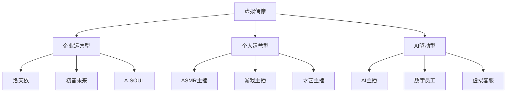
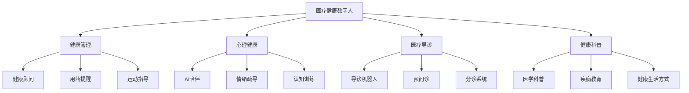

# 数字人应用场景

## 关键词

| 类别 | 关键词 |
|------|--------|
| 虚拟主播 | 直播带货、才艺主播、虚拟偶像、VTuber、虚拟主播 |
| 客服场景 | 智能客服、金融客服、电商客服、24/7服务 |
| 教育培训 | 虚拟教师、在线教育、职业培训、模拟实训 |
| 医疗健康 | 虚拟护士、健康顾问、心理健康、医疗科普 |
| 企业应用 | 数字员工、品牌代言、企业宣传、CEO分身 |
| 虚拟社交 | 元宇宙社交、虚拟约会、AI伴侣、虚拟形象 |
| 技术选型 | 实时渲染、预录制、2D/3D、技术成本 |
| 成功案例 | 柳夜熙、AYAYI、华智冰、洛天依 |

> [!abstract] 摘要
> 数字人技术已在多个行业领域实现规模化应用，从虚拟主播到企业数字员工，从虚拟教师到医疗健康顾问。本文档系统梳理数字人的主要应用场景、典型案例、技术需求及发展趋势，为企业数字化转型和创业者选择赛道提供全面的应用参考。

---

## 1. 虚拟主播与虚拟偶像

### 1.1 市场概览

虚拟主播（Virtual YouTuber, VTuber）市场正在爆发式增长：

| 数据维度 | 数值 | 同比增长 |
|----------|------|----------|
| 全球市场规模 | $45亿美元 | +35% |
| 中国市场规模 | ¥280亿 | +42% |
| 头部主播收入 | ¥5000万+/年 | +25% |
| 平台活跃VTuber | 50万+ | +30% |

### 1.2 虚拟偶像分类



### 1.3 虚拟主播技术架构

```python
# 虚拟主播系统配置
virtual_streamer_system = {
    'realtime': {
        'avatar_type': '3D实时渲染',
        'rendering_engine': 'Unreal Engine 5',
        'tracking': {
            'face': 'ARKit / Live Link Face',
            'body': 'MediaPipe / Xsens',
            'hands': 'Leap Motion / MediaPipe'
        },
        'latency_requirement': '<100ms',
        'fps': 60
    },
    'content': {
        'prerecorded': {
            'tools': 'MMD / Blender',
            'lip_sync': 'Wav2Lip / SadTalker',
            'quality': '4K60fps'
        },
        'live': {
            'tools': 'VSeeFace / Luppet',
            'platforms': ['Bilibili', 'TikTok', 'YouTube']
        }
    },
    'interaction': {
        'chatbot': 'LLM集成',
        'vtuber_tools': 'Falbot / niconicomments'
    }
}
```

### 1.4 典型案例

#### 洛天依

洛天依是中国最成功的虚拟偶像之一：

| 维度 | 数据 |
|------|------|
| 出道时间 | 2012年 |
| 全网粉丝 | 5000万+ |
| 代表作品 | 《权御天下》等 |
| 商业模式 | 演唱会、授权、周边、直播 |

#### A-SOUL

字节跳动旗下虚拟女团，代表了国内最新的虚拟偶像运营模式：

- **技术亮点**：实时捕捉驱动的3D虚拟偶像
- **内容策略**：中之人+AI混合运营
- **粉丝经济**：会员订阅、直播打赏、周边销售

> [!tip] 虚拟偶像成功要素
> - **人设一致性**：保持角色人设的长期稳定
> - **内容质量**：高质量的音乐、舞蹈、直播内容
> - **粉丝互动**：建立深度粉丝社区
> - **技术支撑**：稳定的技术系统保障直播流畅

---

## 2. 客服数字人

### 2.1 市场痛点与机会

传统客服面临的问题：

| 问题 | 影响 | 数字人解决方案 |
|------|------|----------------|
| 人力成本高 | 客服人员工资+培训 | 边际成本趋近于零 |
| 服务时间限制 | 夜班节假日成本高 | 7x24不间断服务 |
| 服务质量不稳定 | 情绪波动影响 | 标准化服务输出 |
| 业务知识更新慢 | 新员工培训周期长 | 实时知识库同步 |
| 多语言支持困难 | 小语种人才稀缺 | 多语言TTS支持 |

### 2.2 金融行业应用

#### 银行数字员工

```python
# 银行数字员工配置
bank_digital_employee = {
    'name': '小银',
    'position': '智能柜员',
    'deployments': [
        '手机银行APP',
        '网点大屏',
        '官方网站',
        '电话客服'
    ],
    'capabilities': {
        'account_inquiry': {
            'enabled': True,
            'accuracy': 0.95
        },
        'product_recommendation': {
            'enabled': True,
            'requires_verification': True
        },
        'loan_application': {
            'enabled': True,
            'pre_check': True,
            'escalation': 'human_agent'
        },
        'risk_disclosure': {
            'enabled': True,
            'mandatory': True
        }
    },
    'compliance': {
        'audit_trail': True,
        'conversation_recording': True,
        'sentiment_monitoring': True
    }
}
```

#### 保险数字顾问

```python
insurance_advisor = {
    'scenario': '保险产品咨询',
    'workflow': {
        '1_greeting': '友好问候，确认客户需求',
        '2_need_analysis': '通过问答了解客户需求',
        '3_product_intro': '推荐适合的保险产品',
        '4_comparison': '对比不同产品方案',
        '5_risk_explanation': '详细说明条款和免责',
        '6_application_guide': '指导投保流程'
    },
    'emotional_support': {
        'death_coverage': '敏感话题处理',
        'claim_stories': '正面案例分享'
    }
}
```

### 2.3 电商客服

| 场景 | 传统方案 | 数字人方案 | 效率提升 |
|------|----------|------------|----------|
| 售前咨询 | 人工客服 | AI数字人 | 5x |
| 商品推荐 | 规则引擎 | 多模态理解 | 3x |
| 售后服务 | 工单系统 | 数字人+知识库 | 4x |
| 退换货 | 人工处理 | 数字人引导 | 2x |

```python
# 电商数字人客服配置
ecommerce_support_config = {
    'business_hours': '24/7',
    'response_time': '<3秒',
    'language': ['中文', '英语', '日语', '韩语'],
    'capabilities': {
        'product_qa': {
            'database': '商品知识库',
            'update_frequency': '实时同步'
        },
        'size_guide': {
            'input': '用户身高体重',
            'output': '尺码推荐'
        },
        'order_tracking': {
            'integration': 'ERP系统',
            'status_updates': '实时推送'
        },
        'return_process': {
            'auto_approval': True,
            'threshold': '订单<500元'
        }
    },
    'escalation': {
        'trigger_conditions': [
            '客户明确要求人工',
            '情绪检测为负面',
            '复杂投诉问题'
        ],
        'transfer_mode': '无缝转接人工'
    }
}
```

---

## 3. 教育虚拟教师

### 3.1 教育场景需求分析

| 教育类型 | 需求特点 | 数字人适配度 |
|----------|----------|--------------|
| K12教育 | 趣味性、互动性 | ⭐⭐⭐⭐ |
| 高等教育 | 专业性、深度讲解 | ⭐⭐⭐⭐⭐ |
| 职业教育 | 实用性、技能演示 | ⭐⭐⭐⭐⭐ |
| 企业培训 | 标准化、可重复 | ⭐⭐⭐⭐⭐ |
| 语言学习 | 口语陪练、发音纠正 | ⭐⭐⭐⭐ |
| 老年教育 | 耐心、简化操作 | ⭐⭐⭐⭐ |

### 3.2 虚拟教师系统设计

```python
# 虚拟教师配置
virtual_teacher_config = {
    'persona': {
        'name': '智学君',
        'appearance': {
            'age': '30岁左右',
            'style': '知性优雅',
            'clothing': '职业正装'
        },
        'personality': {
            'primary': '耐心细致',
            'secondary': '鼓励引导',
            'communication': '生动有趣'
        }
    },
    'teaching_modes': {
        'lecture': {
            'voice_style': '清晰稳重',
            'gestures': '适度示范',
            'slides_sync': True
        },
        'qa': {
            'wait_time': 3,  # 秒
            'hint_levels': 3,
            'encouragement': True
        },
        'practice': {
            'feedback_immediate': True,
            'error_explanation': '详细',
            'progress_tracking': True
        },
        'assessment': {
            'adaptive_difficulty': True,
            'question_types': ['选择', '填空', '简答'],
            'feedback_style': '建设性'
        }
    },
    'multimodal': {
        'gesture_teaching': True,
        'whiteboard_drawing': True,
        '3d_model_display': True,
        'code_demonstration': True
    }
}
```

### 3.3 医学教育案例

> [!example] 虚拟解剖教师
> 某医学院部署的虚拟解剖教师数字人，能够：
> - **3D模型展示**：人体器官、骨骼的三维展示
> - **动态讲解**：血液循环、神经传导等过程动画
> - **互动问答**：学生可随时提问并获得解答
> - **实操指导**：手术操作的标准化演示
> - **评估反馈**：实时评估学生掌握程度

```python
# 医学虚拟教师系统
medical_education_system = {
    'specialties': ['解剖学', '生理学', '病理学', '药理学'],
    'features': {
        'anatomy_3d': {
            'models': ['完整人体', '各系统', '器官切片'],
            'interactions': ['旋转', '剖面', '标注']
        },
        'procedure_simulation': {
            'scenarios': ['问诊', '体检', '手术基本操作'],
            'feedback': ['实时评分', '错误提示']
        },
        'case_study': {
            'cases': '500+真实病例',
            'learning_mode': ['诊断推理', '治疗决策']
        }
    },
    'patient_interaction': {
        'virtual_patient': True,
        'empathy_training': True,
        'bedside_manner': True
    }
}
```

### 3.4 企业培训应用

```python
# 企业培训数字人配置
corporate_training_config = {
    'use_cases': {
        'onboarding': {
            'topics': ['公司文化', '规章制度', '业务介绍'],
            'duration': '30-60分钟',
            'completion_rate_target': 0.95
        },
        'product_training': {
            'products': '产品知识库',
            'scenarios': ['销售话术', '客户答疑'],
            'certification': True
        },
        'compliance': {
            'topics': ['合规政策', '伦理规范', '数据安全'],
            'frequency': '年度必修',
            'assessment': '通过性考试'
        },
        'skill_workshop': {
            'soft_skills': ['沟通', '领导力', '时间管理'],
            'hard_skills': ['Excel', '编程', '数据分析']
        }
    },
    'analytics': {
        'engagement_tracking': True,
        'knowledge_gaps': True,
        'learning_path': '个性化推荐'
    }
}
```

---

## 4. 医疗健康

### 4.1 应用场景分类



### 4.2 心理健康应用

> [!warning] 重要提示
> 心理健康数字人不能替代专业心理咨询师或精神科医生，其定位是：
> - 初步筛查和情绪支持
> - 非紧急情况下的陪伴
> - 专业资源的引导和转介

```python
# 心理健康AI陪伴系统
mental_health_companion = {
    'name': '心灵伙伴',
    'capabilities': {
        'emotion_recognition': {
            'text': '情绪分析',
            'voice': '语调识别',
            'facial': '表情识别'
        },
        'conversation_skills': {
            'active_listening': True,
            'empathy_expression': True,
            'cognitive_restructuring': True,
            'cbt_techniques': True
        },
        'exercises': {
            'breathing': '呼吸练习',
            'grounding': '54321 grounding',
            'journaling': '情绪日记',
            'meditation': '引导冥想'
        },
        'escalation': {
            'crisis_detection': True,
            'hotline_info': True,
            'professional_referral': True
        }
    },
    'privacy': {
        'data_encryption': True,
        'anonymous_mode': True,
        'consent_required': True
    }
}
```

### 4.3 医疗导诊机器人

```python
# 医院导诊数字人配置
hospital_guide_config = {
    'location': ['门诊大厅', '住院部', '急诊入口'],
    'capabilities': {
        'department_routing': {
            'coverage': '全科室导航',
            'indoor_positioning': '精确到楼层'
        },
        'pre_consultation': {
            'symptom_collection': True,
            'urgency_assessment': True,
            'waiting_time': '实时更新'
        },
        'registration_assistance': {
            'department_recommendation': True,
            'doctor_matching': True,
            'appointment_booking': True
        },
        'information_query': {
            'hospital_intro': True,
            'facility_guide': True,
            'process_explanation': True
        }
    },
    'accessibility': {
        'elderly_mode': True,
        'multilingual': ['普通话', '方言', '英语'],
        'visual_accessibility': True
    }
}
```

---

## 5. 虚拟社交与元宇宙

### 5.1 虚拟社交形态

| 形态 | 描述 | 平台案例 |
|------|------|----------|
| **虚拟形象社交** | 以虚拟形象参与社交活动 | Soul、VRChat |
| **数字分身社交** | 在元宇宙中以数字分身社交 | Horizon Worlds, Roblox |
| **AI伴侣** | 与AI虚拟角色建立情感连接 | Replika, Character.AI |
| **虚拟约会** | 与数字人进行模拟约会 | AI Dating Apps |
| **虚拟演唱会** | 在虚拟空间观看/参与演出 | Fortnite Concert |

### 5.2 AI伴侣系统设计

```python
# AI伴侣配置
ai_companion_config = {
    'persona': {
        'customizable': True,
        'presets': [
            '温柔型', '活泼型', '知性型', '运动型'
        ],
        'voice': '可选择/克隆'
    },
    'relationship_modes': {
        'friend': {
            'topics': '日常分享、兴趣讨论',
            'emotional_support': '中'
        },
        'partner': {
            'intimacy_level': '可调节',
            'conversation_style': '亲密友好'
        },
        'mentor': {
            'expertise_areas': '用户指定',
            'advice_style': '引导式'
        }
    },
    'memory_system': {
        'episodic': '记住对话内容',
        'preferences': '学习用户喜好',
        'long_term': '跨会话记忆',
        'forgetful_mode': '可选'
    },
    'safety': {
        'content_filter': True,
        'boundaries': '可配置',
        'age_verification': True
    }
}
```

### 5.3 元宇宙企业空间

```python
# 企业元宇宙空间配置
enterprise_metaverse_config = {
    'spaces': {
        'virtual_office': {
            'purpose': '远程协作、会议',
            'features': ['白板协作', '3D演示', '空间音频'],
            'capacity': '100人同时在线'
        },
        'showroom': {
            'purpose': '产品展示、企业宣传',
            'features': ['3D产品', '互动体验', '销售对接']
        },
        'event_hall': {
            'purpose': '发布会、年会、培训',
            'features': ['大屏直播', '观众互动', '抽奖活动']
        }
    },
    'avatar_customization': {
        'realistic': '企业员工形象',
        'stylized': '卡通形象',
        'brand_avatar': '品牌专属IP'
    },
    'analytics': {
        'engagement_tracking': True,
        'heatmaps': '空间热点分析',
        'attendance_reports': True
    }
}
```

---

## 6. 企业数字员工

### 6.1 数字员工岗位类型

| 岗位类型 | 工作内容 | 替代人工 |
|----------|----------|----------|
| **前台接待** | 来访登记、身份核验 | 初级替代 |
| **行政助理** | 日程管理、会议纪要 | 中级替代 |
| **HR助理** | 招聘筛选、入职办理 | 中级替代 |
| **法务助理** | 合同审核、条款查询 | 部分替代 |
| **财务助理** | 报销审核、报表生成 | 部分替代 |
| **培训专员** | 新人培训、技能考核 | 高级替代 |
| **品牌代言人** | 品牌宣传、活动出席 | 特殊场景 |

### 6.2 CEO数字分身

> [!example] CEO数字分身案例
> 某科技公司CEO部署了自己的数字分身，用于：
> - **投资者沟通**：定期财报解读
> - **内部沟通**：全员大会讲话
> - **媒体采访**：标准问题的自动回答
> - **品牌活动**：无法亲自出席的活动

```python
# CEO数字分身配置
ceo_digital_twin = {
    'source': {
        'video_training': '5小时高质量视频',
        'voice_clone': '2小时音频样本',
        'writing_samples': '演讲稿、邮件、文章'
    },
    'use_cases': {
        'automated_updates': {
            'earnings_calls': True,
            'company_all_hands': True,
            'industry_conferences': True
        },
        'media_responses': {
            'standard_qa': True,
            'custom_questions': False  # 需要人工审核
        },
        'personalized_outreach': {
            'investor_messages': True,
            'employee_recognition': True,
            'customer_appreciation': True
        }
    },
    'authenticity': {
        'disclosure_required': True,
        'ai_generated_watermark': True,
        'quality_review': '关键内容人工审核'
    },
    'brand_protection': {
        'content_filter': True,
        'sentiment_guardrails': True,
        'emergency_shutdown': True
    }
}
```

### 6.3 企业培训数字员工

```python
# 企业培训数字员工
training_digital_employee = {
    'capabilities': {
        'course_delivery': {
            'formats': ['视频', '互动', '模拟'],
            'adaptive_learning': True
        },
        'assessment': {
            'quiz_generation': True,
            'auto_grading': True,
            'feedback_generation': True
        },
        'support': {
            'qa_bot': True,
            'study_tips': True,
            'progress_cheering': True
        }
    },
    'personalization': {
        'learning_style_detection': True,
        'pace_adjustment': True,
        'example_warehouse': '学员相关领域'
    },
    'analytics': {
        'completion_tracking': True,
        'knowledge_gap_analysis': True,
        'skill_assessment': True,
        'learning_recommendations': True
    }
}
```

---

## 7. 技术需求与选型

### 7.1 不同场景的技术要求

| 场景 | 实时性 | 形象要求 | 交互复杂度 | 技术选型 |
|------|--------|----------|------------|----------|
| 直播带货 | 极高 | 中高 | 高 | UE5 + 实时动捕 |
| 客服咨询 | 中 | 中 | 中 | 预录制 + AI |
| 虚拟教师 | 高 | 中 | 高 | 实时渲染 + 白板 |
| 医疗导诊 | 中 | 中 | 中 | 预录制 + 对话AI |
| 虚拟社交 | 极高 | 高 | 极高 | UE5 + 全身体感 |
| 企业代言 | 低 | 极高 | 低 | 影视级制作 |

### 7.2 成本效益分析

| 场景 | 单次成本 | 边际成本 | ROI周期 |
|------|----------|----------|----------|
| 虚拟主播 | ¥10万+形象 | ¥5/分钟 | 3-6个月 |
| 客服数字人 | ¥30-100万 | ¥0.1/次 | 6-12个月 |
| 虚拟教师 | ¥50-200万 | ¥0.5/分钟 | 12-18个月 |
| 医疗顾问 | ¥100-300万 | ¥0.2/次 | 12-24个月 |
| 企业代言 | ¥50-500万 | ¥1/分钟 | 6-12个月 |

---

## 相关文档

- [[数字人形象生成]] - 视觉形象设计
- [[TTS语音合成]] - 语音生成
- [[口型同步技术]] - 口型同步
- [[动作捕捉技术]] - 动作驱动
- [[数字人交互系统]] - 智能交互
- [[实时渲染技术]] - 渲染技术
- [[数字人平台工具]] - 平台与工具

---

## 更新日志

| 日期 | 版本 | 修改内容 |
|------|------|----------|
| 2026-04-18 | v1.0 | 初版完成 |

---

> [!copyright] 版权声明
> 本文档为归愚知识库原创内容，采用CC BY-NC-SA 4.0协议授权。
