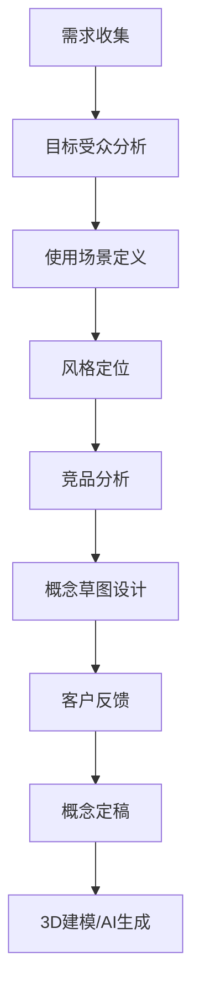

# 数字人形象生成

## 关键词

| 类别 | 关键词 |
|------|--------|
| 技术类型 | 2D数字人、3D数字人、超写实数字人 |
| 建模工具 | Blender、Maya、ZBrush、Metahuman |
| AI生成 | Stable Diffusion、Midjourney、Sora、Runway |
| 渲染技术 | 实时渲染、光线追踪、PBR材质 |
| 应用方向 | 虚拟主播、游戏角色、企业数字员工 |
| 开源方案 | SadTalker、Roop、ComfyUI、Stable Diffusion WebUI |
| 风格分类 | 写实风格、动漫风格、卡通风格、二次元风格 |
| 技术指标 | 面数、贴图分辨率、骨骼绑定、表情数量 |

> [!abstract] 摘要
> 数字人形象生成是虚拟人构建的核心环节，决定了数字人的视觉呈现效果。根据技术路径不同，可分为传统3D建模和AI生成两大类。本文档系统梳理数字人形象的类型划分、主流技术方案、开源工具链及完整定制流程，为构建高质量数字人提供全面的技术参考。

---

## 1. 数字人类型详解

### 1.1 2D数字人

2D数字人是基于平面图像技术生成的虚拟形象，主要通过AI图像生成和视频合成技术实现。其核心技术包括：

- **真人克隆**：使用单张照片或少量样本，通过深度学习模型提取面部特征，生成与真人高度相似的数字形象
- **风格迁移**：将真人形象转换为不同艺术风格，如动漫化、油画化、素描化等
- **视频驱动**：基于音频或视频输入，驱动2D形象产生动态效果

2D数字人的优势在于生成速度快、成本相对较低，适合快速产出内容。劣势则是交互能力有限，难以实现360度全方位视角展示。

> [!tip] 适用场景
> 短视频制作、直播带货、新闻播报、教育培训等需要快速产出内容的场景

### 1.2 3D数字人

3D数字人基于三维建模技术构建，具有完整的立体结构和可操控的骨骼系统。其技术特征包括：

- **多视角一致性**：从任意角度观察都能保持正确的透视关系和光影效果
- **骨骼绑定**：通过Rigging技术赋予模型骨骼系统，支持动画驱动
- **物理模拟**：可模拟头发飘逸、衣物摆动等物理效果
- **场景融合**：更容易与3D场景、AR/VR环境进行集成

3D数字人根据写实程度可进一步细分为：

| 类型 | 写实程度 | 面数范围 | 贴图精度 | 适用场景 |
|------|----------|----------|----------|----------|
| 卡通风格 | 低 | 5K-20K | 1K-2K | 游戏、动画、儿童内容 |
| 风格化写实 | 中 | 20K-50K | 2K-4K | 虚拟主播、元宇宙 |
| 高写实 | 高 | 50K-200K | 4K-8K | 影视、特效、企业形象 |
| 超写实 | 极高 | 200K+ | 8K+ | 数字替身、高端广告 |

### 1.3 超写实数字人

超写实数字人（MetaHuman）是当前技术巅峰，其视觉真实度已接近真人照片级别。代表性案例包括：

- **Siren**：由腾讯和Epic Games联合打造的实时渲染数字人
- **AYAYI**：国内首个超写实数字人，拥有微博粉丝超百万
- **华智冰**：清华大学虚拟学生，具备多模态交互能力

超写实数字人的技术挑战：

1. **皮肤渲染**：需要模拟真实皮肤的次表面散射、半透明性、血管纹理
2. **毛发系统**：头发、眉毛、睫毛的高精度渲染和物理模拟
3. **微表情捕捉**：眼轮匝肌、口轮匝肌等细微表情的捕捉和还原
4. **光线交互**：在复杂光照环境下保持真实的光影效果

---

## 2. 3D数字人建模技术

### 2.1 主流建模软件对比

| 软件 | 优势 | 劣势 | 学习曲线 | 成本 |
|------|------|------|----------|------|
| **Blender** | 开源免费、功能全面、社区活跃 | 界面较复杂 | 中等 | 免费 |
| **Maya** | 行业标准、绑定功能强大 | 授权费用高 | 陡峭 | $1,350/年 |
| **ZBrush** | 高模雕刻神器 | 只能做高模 | 中等 | $895(永久) |
| **Cinema 4D** | 易上手、动画强 | 角色建模功能较弱 | 较平缓 | €549.95 |
| **Metahuman** | 快速生成、写实度高 | 定制化有限 | 平缓 | 免费+UE授权 |

### 2.2 Blender数字人建模流程

Blender作为开源界的翘楚，是个人开发者和小型团队构建数字人的首选工具。以下是基于Blender的完整建模流程：

#### 第一阶段：基础网格创建

```python
# Blender Python脚本：创建基础头部网格
import bpy

# 删除默认立方体
bpy.data.objects['Cube'].select_set(True)
bpy.context.view_layer.objects.active = bpy.data.objects['Cube']
bpy.ops.object.delete()

# 添加球体作为头部基础
bpy.ops.mesh.primitive_uv_sphere_add(segments=32, ring_count=16, size=1)
head = bpy.context.object
head.name = "Head_Base"

# 进入编辑模式进行塑形
bpy.ops.object.mode_set(mode='EDIT')
```

#### 第二阶段：拓扑优化

高质量的数字人模型需要整洁的四边形拓扑，建议使用以下技术：

- **Loop Cuts**：添加循环切割改善拓扑结构
- **Knife Tool**：手动切割创建所需拓扑
- **Retopology**：使用RetopoFlow等插件进行自动拓扑重建

#### 第三阶段：细节雕刻

```python
# 使用Multiresolution修饰器进行多精度雕刻
bpy.ops.object.modifier_add(type='MULTIRES')
bpy.context.object.modifiers['Multires'].levels = 4
bpy.ops.object.mode_set(mode='SCULPT')
```

### 2.3 MetaHuman Creator快速生成

Epic Games推出的MetaHuman Creator彻底改变了数字人制作方式：

> [!note] 技术要点
> MetaHuman Creator基于虚幻引擎的Nanite和Lumen技术，可实时渲染数百万面片的超写实数字人

**使用流程**：

1. 访问MetaHuman Creator网页端（免费注册）
2. 在预设模板基础上调整：
   - 脸型模板选择
   - 肤色与种族特征
   - 头发样式与颜色
   - 面部细节（眉形、眼型、唇形等）
3. 下载Quixel Megascan资产包
4. 导入Unreal Engine进行骨骼绑定
5. 使用Live Link进行实时驱动

---

## 3. AI生成形象技术

### 3.1 图像生成模型

#### Stable Diffusion

Stable Diffusion是当前最流行的开源图像生成模型，其数字人生成能力通过以下工作流实现：

```markdown
# ComfyUI数字人生成工作流

## 节点连接
1. CheckpointLoaderSimple → ModelLoader(RealisticVision/ majicmix)
2. CLIPTextEncode → 正向提示词编码
3. CLIPTextEncode → 负向提示词编码
4. KSampler → 采样器配置
5. VAEDecode → 图像解码
6. SaveImage → 输出保存

## 推荐参数
- 采样步数: 25-35
- CFG Scale: 7-9
- 尺寸: 512x768(半身) / 768x1024(全身)
```

**提示词模板**：

```
(masterpiece, best quality, ultra-detailed), 
realistic photo of a beautiful young woman, 
detailed skin texture, natural lighting, 
half body portrait, professional photography,
(digital human:1.3), (virtual avatar:1.2),
clean background, 8k uhd, dslr quality
```

#### Midjourney与DALL-E

| 平台 | 优势 | 劣势 | 版权条款 |
|------|------|------|----------|
| Midjourney | 艺术感强、细节丰富 | 版权归属用户 | 可商用 |
| DALL-E 3 | OpenAI集成、理解力强 | 价格较高 | 可商用 |
| Stable Diffusion | 完全免费、可本地部署 | 需要硬件配置 | 取决于模型 |

### 3.2 视频生成技术

#### Sora与Runway Gen-2

2024年OpenAI发布的Sora展示了AI视频生成的突破性进展：

- **时长**：最长60秒连贯视频
- **分辨率**：最高1920x1080
- **场景理解**：具备复杂的物理世界理解能力
- **角色一致性**：可在长视频中保持角色特征稳定

```markdown
## Sora生成数字人视频示例提示词

A professional female digital human anchor sitting in a modern news 
studio, wearing business attire, speaking naturally to camera, 
realistic skin texture, soft studio lighting, smooth body movements,
high quality broadcast journalism style
```

#### Runway Gen-2/Gen-3

Runway作为AI视频领域的先驱，提供了更成熟的商业化方案：

- **Motion Brush**：选择性运动控制
- **Advanced Camera Controls**：高级镜头控制
- **API集成**：支持第三方应用对接

### 3.3 一致性保持技术

AI生成数字人面临的最大挑战是保持多帧/多场景间的一致性。主流解决方案包括：

> [!example] IP-Adapter技术方案
> IP-Adapter是腾讯开源的一致性保持方案，通过解耦图像特征和文本特征，实现：
> - 主体一致性：通过参考图锁定主体特征
> - 风格一致性：保持画面艺术风格统一
> - 动作一致性：视频序列中的动作连贯

```python
# IP-Adapter调用示例
from diffusers import StableDiffusionInflatedImg2ImgPipeline

pipe = StableDiffusionInflatedImg2ImgPipeline.from_pretrained(
    " stabilityai/stable-diffusion-2-1",
    torch_dtype=torch.float16,
)
pipe.load_ip_adapter("h94/IP-Adapter", weight_name="ip-adapter_sd15.bin")

# 使用参考图生成新图像
generator = torch.Generator("cuda").manual_seed(42)
image = pipe(
    prompt="digital human in formal suit, professional pose",
    ip_adapter_image=reference_image,
    generator=generator,
).images[0]
```

---

## 4. 风格化与写实的权衡

### 4.1 风格化数字人

风格化数字人刻意与真实人像拉开距离，形成独特的视觉识别度：

**动漫风格特点**：
- 简化的面部结构（大眼睛、小鼻子）
- 鲜艳的色彩运用
- 夸张的表情变化
- 程式化的动作设计

**技术实现**：

| 技术方案 | 工具 | 效果 | 成本 |
|----------|------|------|------|
| 模型微调 | Stable Diffusion + LoRA | 高度可控 | 低 |
| 3D渲染风格化 | Cel Shader | 2D动漫感 | 中 |
| 混合渲染 | Unreal Engine + Toon Shader | 3D动漫效果 | 高 |

### 4.2 写实数字人

写实数字人追求与真人无异的视觉效果，是技术难度最高的领域：

**核心技术挑战**：

1. **皮肤材质**：需要精确模拟次表面散射（Subsurface Scattering）
2. **眼睛渲染**：虹膜细节、泪膜反光、眼神光
3. **毛发系统**：头皮与毛发的自然过渡
4. **微表情**：眼轮匝肌、口轮匝肌的细微变化

> [!warning] 技术风险
> 写实数字人存在"恐怖谷效应"（Uncanny Valley），当真实度达到某个阈值但尚未完全仿真时，反而会引发观众反感。解决方案包括：
> - 刻意保留部分"非人类"特征
> - 使用艺术化处理规避真实细节
> - 在特定场景下（如背光、阴影）展示数字人

---

## 5. 形象定制完整流程

### 5.1 需求分析与概念设计



**概念设计文档模板**：

| 项目 | 内容 |
|------|------|
| 姓名/代号 | 数字人名称 |
| 人设定位 | 性格特征、背景故事 |
| 外形特征 | 年龄、性别、发型、着装风格 |
| 品牌契合度 | 与企业VI的匹配程度 |
| 输出规格 | 分辨率、帧率、格式要求 |

### 5.2 形象生成与迭代

**迭代流程**：

1. **初稿生成**：AI批量生成多个候选方案
2. **内部评审**：技术团队评估可行性
3. **客户反馈**：收集意见并调整
4. **细节优化**：针对选定方案进行精细化调整
5. **终稿确认**：最终形象定稿

### 5.3 技术整合

最终形象需要整合以下技术模块：

- **3D模型**：完成拓扑优化和UV展开
- **骨骼绑定**：配置IK/FK系统
- **表情系统**：创建Blend Shape
- **材质贴图**：PBR材质烘焙
- **物理属性**：碰撞体和布料模拟设置

---

## 6. 开源方案汇总

### 6.1 图像生成类

| 项目 | GitHub Stars | 特点 | 适用场景 |
|------|--------------|------|----------|
| Stable Diffusion WebUI | 130k+ | 功能全面、插件丰富 | 数字人形象生成 |
| ComfyUI | 50k+ | 节点式工作流、内存高效 | 专业级生成 |
| Fooocus | 25k+ | 简化操作、效果接近MJ | 快速上手 |
| SDXL Turbo | 15k+ | 极速生成、单步采样 | 实时应用 |

### 6.2 形象克隆类

| 项目 | GitHub Stars | 特点 | 平台 |
|------|--------------|------|------|
| Roop | 45k+ | 单张照片换脸 | Python |
| FaceSwap | 30k+ | 视频换脸老牌方案 | Python |
| FaceChain | 20k+ | 阿里开源数字人 | Python |
| IP-Adapter | 15k+ | 一致性控制 | ComfyUI |

### 6.3 3D建模类

| 项目 | 类型 | 授权 | 特点 |
|------|------|------|------|
| Blender | 建模软件 | GPL | 全功能3D创作套件 |
| MakeHuman | 角色生成 | AGPL | 快速生成基础人形 |
| MB-Lab | Blender插件 | AGPL | 程序化角色生成 |
| VRM | 3D角色格式 | 开放 | 跨平台Avatar标准 |

> [!success] 推荐组合方案
> - **快速原型**：Stable Diffusion + Roop + ComfyUI
> - **中等品质**：MetaHuman + 人工微调
> - **最高品质**：Maya/ZBrush手工建模 + 表情捕捉

---

## 相关文档

- [[TTS语音合成]] - 数字人声音生成
- [[口型同步技术]] - 数字人唇形动画
- [[动作捕捉技术]] - 数字人动作驱动
- [[数字人交互系统]] - 数字人智能交互
- [[实时渲染技术]] - 数字人视觉呈现
- [[数字人平台工具]] - 工具链与平台对比

---

## 更新日志

| 日期 | 版本 | 修改内容 |
|------|------|----------|
| 2026-04-18 | v1.0 | 初版完成 |

---

> [!copyright] 版权声明
> 本文档为归愚知识库原创内容，采用CC BY-NC-SA 4.0协议授权。
