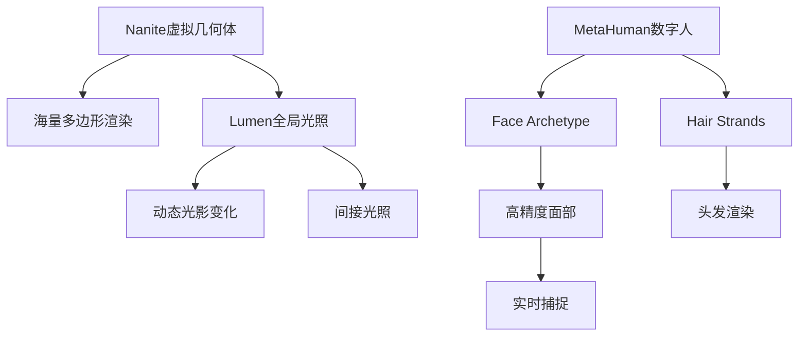
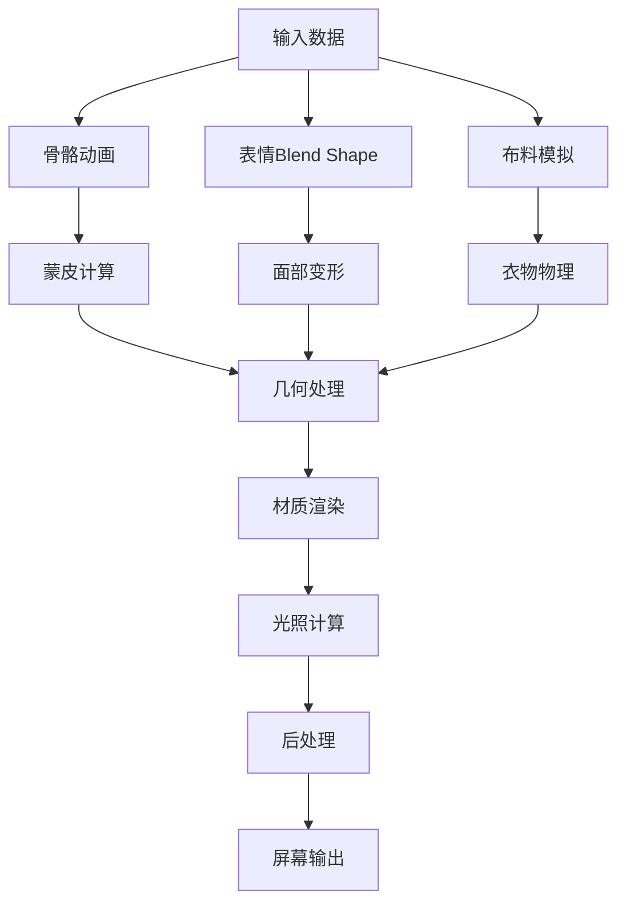

# 实时渲染技术

## 关键词

| 类别 | 关键词 |
|------|--------|
| 渲染引擎 | Unreal Engine、Unity、Godot、WebGPU |
| 核心特性 | Lumen、Nanite、Path Tracing、Ray Tracing |
| 渲染管线 | PBR、光线追踪、光栅化、延迟渲染、前向渲染 |
| 材质系统 | Shader Graph、HLSL、GLSL、节点式编辑 |
| 皮肤渲染 | SSS、次表面散射、血管纹理、皮肤着色器 |
| 毛发渲染 | 发丝着色、各向异性、物理模拟、VR渲染 |
| 性能优化 | LOD、Occlusion Culling、DLSS、FSR |
| 技术指标 | FPS、帧时间、Draw Calls、显存占用 |

> [!abstract] 摘要
> 实时渲染是数字人视觉呈现的关键技术，决定了最终画面质量与用户体验。本文档系统梳理主流实时渲染引擎（Unreal Engine/Unity）、核心渲染技术（Lumen/Nanite/Path Tracing）、数字人专用渲染管线、皮肤与毛发渲染方案及性能优化策略，为构建高质量数字人渲染系统提供全面的技术参考。

---

## 1. 实时渲染引擎对比

### 1.1 主流引擎概览

| 引擎 | 开发公司 | 授权模式 | 画质 | 学习曲线 | 数字人支持 |
|------|----------|----------|------|----------|------------|
| **Unreal Engine** | Epic Games | 订阅/分成 | ⭐⭐⭐⭐⭐ | 陡峭 | ⭐⭐⭐⭐⭐ |
| **Unity** | Unity Technologies | 订阅/订阅 | ⭐⭐⭐⭐ | 平缓 | ⭐⭐⭐⭐ |
| **Godot** | 社区 | 免费开源 | ⭐⭐⭐ | 平缓 | ⭐⭐⭐ |
| **Blender** | 基金会 | 免费开源 | ⭐⭐⭐⭐ | 中等 | ⭐⭐ |

### 1.2 Unreal Engine 5（UE5）

UE5是当前数字人渲染的首选引擎：

**核心技术**：



#### Lumen全局光照

Lumen是UE5的动态全局光照系统：

> [!note] 技术特性
> Lumen无需预先计算灯光贴图，支持场景中所有物体与光线实时交互，适合需要动态光影的数字人应用

```cpp
// UE5 Lumen配置
// ProjectSettings -> Rendering -> Global Illumination
// Lumen设置
struct FLumenGlobalIlluminationSettings {
    // 质量等级
    enum class EQualityLevel {
        Low,      // 移动设备
        Medium,   // 主机/中端PC
        High,     // 高端PC
        Ultra,    // 顶级PC
        Epic      // 影视级
    };
    
    // 追踪距离
    float TraceMaxDistance = 500000.0f;
    
    // 场景卡片距离
    float SceneCardDistance = 50000.0f;
    
    // 反射质量
    float ReflectionCaptures = 4;
};
```

#### Nanite虚拟几何体

Nanite支持导入数百万面片的影视级资产：

```python
# UE5 Python脚本：导入Nanite资产
import unreal

def import_nanite_mesh(mesh_path, destination):
    task = unreal.AssetImportTask()
    task.set_editor_property('automated', True)
    task.set_editor_property('destination_path', destination)
    task.set_editor_property('filename', mesh_path)
    task.set_editor_property('replace_existing', True)
    task.set_editor_property('save', True)
    
    # 配置Nanite导入选项
    options = unreal.FbxImportUI()
    options.set_editor_property('import_mesh_lod_data', True)
    options.set_editor_property('import_nanite', True)  # 启用Nanite
    
    task.set_editor_property('options', options)
    
    unreal.AssetToolsHelpers.get_asset_tools().import_asset_tasks([task])
```

### 1.3 Unity渲染管线

Unity提供多种渲染管线选择：

| 渲染管线 | 适用场景 | 性能 | 定制性 |
|----------|----------|------|--------|
| **Built-in** | 通用 | 中 | 高 |
| **URP** | 跨平台/移动 | 高 | 中 |
| **HDRP** | 高端/主机 | 低 | 高 |
| **SRP** | 自定义需求 | 依赖实现 | 极高 |

```csharp
// Unity HDRP皮肤着色器配置
public class SkinMaterial : MonoBehaviour {
    public Material skinMaterial;
    
    void ConfigureSkinMaterial() {
        // 次表面散射设置
        skinMaterial.SetFloat("_SubsurfaceScattering", 1.0f);
        skinMaterial.SetColor("_SubsurfaceColor", 
            new Color(0.8f, 0.4f, 0.3f));
        
        // 透射设置
        skinMaterial.SetFloat("_Transmission", 0.5f);
        skinMaterial.SetColor("_TransmissionColor", 
            new Color(1.0f, 0.3f, 0.2f));
        
        // 平滑度设置
        skinMaterial.SetFloat("_Smoothness", 0.3f);
    }
}
```

---

## 2. 数字人渲染管线

### 2.1 渲染架构设计



### 2.2 分层渲染策略

```python
# UE5分层渲染配置
class DigitalHumanRenderer:
    def __init__(self):
        self.render_layers = {
            'base': self.render_base_layer,
            'skin': self.render_skin_layer,
            'eyes': self.render_eye_layer,
            'hair': self.render_hair_layer,
            'clothes': self.render_clothes_layer,
            'transparency': self.render_transparency_layer
        }
    
    def render_base_layer(self, character):
        """基础几何层"""
        # 身体模型
        self.render_mesh(character.body_mesh)
        
        # 应用基础PBR材质
        self.apply_pbr_material(
            character.body_mesh,
            albedo=character.skin_color,
            metallic=0.0,
            roughness=0.5
        )
    
    def render_skin_layer(self, character):
        """皮肤层渲染"""
        # 次表面散射
        skin_shader = self.create_sss_shader()
        skin_shader.set_parameter('SSS_Color', 
            self.calculate_sss_color(character.skin_type))
        skin_shader.set_parameter('SSS_Radius', 1.0)
        
        # 血管纹理
        skin_shader.set_texture('血管Map', 
            character.skin_detail_map)
        
        self.render_with_shader(character.body_mesh, skin_shader)
    
    def render_eye_layer(self, character):
        """眼睛渲染（最高优先级）"""
        eye_shader = self.create_eye_shader()
        
        # 虹膜细节
        eye_shader.set_texture('Iris_Map', 
            character.iris_texture)
        
        # 眼神光
        eye_shader.set_parameter('SpecularIntensity', 1.2)
        
        # 泪膜反射
        eye_shader.set_parameter('TearFilmReflections', 0.8)
        
        self.render_with_shader(character.eye_mesh, eye_shader)
```

---

## 3. 皮肤渲染技术

### 3.1 次表面散射原理

皮肤渲染的核心是模拟光线在皮肤内部的散射行为：

```glsl
// GLSL皮肤散射着色器
#ifdef GL_ES
precision highp float;
#endif

uniform vec3 lightPosition;
uniform vec3 viewPosition;
uniform vec3 subsurfaceColor;
uniform float subsurfaceRadius;
uniform float distortion;
uniform float power;
uniform float scale;

varying vec3 vNormal;
varying vec3 vPosition;
varying vec2 vUv;

float calculateSSS(vec3 lightDir, vec3 viewDir, vec3 normal) {
    vec3 H = normalize(lightDir + normal * distortion);
    float VdotH = pow(clamp(dot(viewDir, -H), 0.0, 1.0), power) * scale;
    
    // 透射计算
    float attenuation = 1.0;
    float transLight = max(0.0, dot(viewDir, -lightDir)) * attenuation;
    
    // SSS颜色混合
    vec3 sssColor = subsurfaceColor * (VdotH + transLight);
    
    return length(sssColor);
}

void main() {
    vec3 normal = normalize(vNormal);
    vec3 lightDir = normalize(lightPosition - vPosition);
    vec3 viewDir = normalize(viewPosition - vPosition);
    
    // 基础漫反射
    float NdotL = max(dot(normal, lightDir), 0.0);
    vec3 diffuse = NdotL * vec3(1.0);
    
    // 次表面散射
    float sss = calculateSSS(lightDir, viewDir, normal);
    
    // 最终颜色合成
    vec3 finalColor = diffuse + vec3(sss);
    
    gl_FragColor = vec4(finalColor, 1.0);
}
```

### 3.2 皮肤材质参数

| 参数 | 描述 | 推荐值范围 |
|------|------|------------|
| Albedo | 基础颜色 | 根据角色设定调整 |
| Roughness | 粗糙度 | 0.3-0.6 |
| Normal Strength | 法线强度 | 0.5-1.0 |
| SSS Weight | 散射权重 | 0.5-1.0 |
| SSS Radius | 散射半径 | 0.5-2.0 |
| SSS Color | 散射颜色 | 偏红/橙 |
| Transmission | 透射强度 | 0.1-0.5 |

### 3.3 毛孔与细节纹理

```python
# 皮肤细节纹理生成
def generate_skin_details(character_config):
    """生成皮肤细节纹理"""
    texture_size = 2048
    
    # 创建皮肤细节纹理
    skin_details = np.zeros((texture_size, texture_size, 3))
    
    # 1. 毛孔分布
    pore_mask = generate_pore_distribution(
        density=character_config.pore_density,
        size_range=(1, 3)
    )
    
    # 2. 细小毛孔纹理
    fine_pores = generate_pore_distribution(
        density=character_config.pore_density * 2,
        size_range=(0.5, 1.5)
    )
    
    # 3. 皮肤纹理噪声
    skin_noise = generate_perlin_noise(
        scale=50,
        octaves=4,
        persistence=0.5
    )
    
    # 组合
    skin_details[:, :, 0] = pore_mask * 0.3
    skin_details[:, :, 1] = fine_pores * 0.15
    skin_details[:, :, 2] = skin_noise * 0.1
    
    return skin_details
```

---

## 4. 毛发渲染技术

### 4.1 发丝着色模型

毛发渲染需要特殊的各向异性着色：

```glsl
// Kajiya-Kay发丝着色模型
#ifdef GL_ES
precision highp float;
#endif

varying vec3 vPosition;
varying vec3 vTangent;
varying vec3 vBitangent;

uniform vec3 lightPosition;
uniform vec3 baseColor;
uniform vec3 tipColor;
uniform float strandThickness;
uniform float roughness;

// 沿着发丝的非均匀反射
float hair specular(vec3 T, vec3 L, vec3 V, float exponent) {
    vec3 H = normalize(L + V);
    float dotTH = dot(T, H);
    float sinTH = sqrt(1.0 - dotTH * dotTH);
    
    // 高光沿发丝方向延伸
    return pow(sinTH, exponent);
}

void main() {
    vec3 N = normalize(vNormal);
    vec3 T = normalize(vTangent);
    vec3 L = normalize(lightPosition - vPosition);
    vec3 V = normalize(cameraPosition - vPosition);
    
    // 漫反射（吸收）
    float NdotL = max(0.0, dot(N, L));
    float TdotL = dot(T, L);
    
    // 各向异性高光
    float specular = hair_specular(T, L, V, 80.0);
    
    // 颜色沿发丝渐变
    vec3 hairColor = mix(baseColor, tipColor, 
        clamp(1.0 - NdotL, 0.0, 1.0));
    
    // 阴影遮挡
    float shadow = calculateShadow(vPosition, lightPosition);
    
    vec3 finalColor = hairColor * NdotL * shadow + 
                      vec3(specular) * 0.5;
    
    gl_FragColor = vec4(finalColor, 1.0);
}
```

### 4.2 VR毛发渲染优化

VR场景对毛发渲染要求极高：

| 技术 | 优化效果 | 适用场景 |
|------|----------|----------|
| **Instancing** | 减少Draw Call | 大量发丝 |
| **LOD系统** | 根据距离简化 | 所有场景 |
| **Alpha Cutout** | 替代透明混合 | 远处毛发 |
| **粒子毛发** | 极低成本 | 远景 |
| **代理几何体** | LOD简化 | 交互距离外 |

```csharp
// Unity VR毛发优化
public class VRHairSettings : MonoBehaviour {
    public LODGroup lodGroup;
    
    void ConfigureVROptimizations() {
        // 设置LOD距离（VR需要更近的LOD切换）
        LOD[] lods = new LOD[4];
        lods[0] = new LOD(0.5f, GetRenderers(0));  // 近距离
        lods[1] = new LOD(0.2f, GetRenderers(1));  // 中距离
        lods[2] = new LOD(0.05f, GetRenderers(2)); // 远距离
        lods[3] = new LOD(0.01f, GetRenderers(3)); // 超远
        
        lodGroup.SetLODs(lods);
        
        // 启用GPU Instancing
        foreach (var renderer in GetAllRenderers()) {
            renderer.enableInstancing = true;
            renderer.materialCache = true;
        }
    }
    
    Renderer[] GetRenderers(int level) {
        // 根据LOD级别获取渲染器
        return GetComponentsInChildren<Renderer>();
    }
}
```

---

## 5. 光照与阴影

### 5.1 数字人打光策略

> [!tip] 打光原则
> 数字人打光需要模拟专业摄影棚环境，关键要点：
> - 主光：塑造轮廓与立体感
> - 补光：消除阴影细节
> - 轮廓光：分离主体与背景
> - 环境光：填充整体氛围

```python
# 数字人三点布光配置
lighting_setup = {
    'key_light': {
        'position': (-3, 4, 2),  # 右前上方
        'intensity': 1.0,
        'color': (1.0, 0.98, 0.95),  # 暖白
        'type': 'rectangular_soft',
        'softness': 0.6
    },
    'fill_light': {
        'position': (3, 2, 1),  # 左前方
        'intensity': 0.4,
        'color': (0.95, 0.98, 1.0),  # 冷白
        'type': 'circular_soft',
        'softness': 0.8
    },
    'rim_light': {
        'position': (0, 3, -3),  # 正后方
        'intensity': 0.6,
        'color': (1.0, 0.95, 0.9),  # 轮廓光
        'type': 'spotlight',
        'angle': 45
    },
    'ambient': {
        'intensity': 0.15,
        'color': (0.9, 0.9, 0.95)  # 环境蓝
    }
}
```

### 5.2 软阴影实现

```glsl
// PCF软阴影着色器
float calculateSoftShadow(vec3 position, vec3 lightPos) {
    float shadow = 1.0;
    float bias = 0.005;
    
    vec3 lightDir = normalize(lightPos - position);
    float NdotL = dot(normal, lightDir);
    
    // PCF采样
    float shadowMapSize = 2048.0;
    float kernelSize = 4.0;  // PCF核大小
    float pixelSize = 1.0 / shadowMapSize;
    
    for (float x = -kernelSize; x <= kernelSize; x++) {
        for (float y = -kernelSize; y <= kernelSize; y++) {
            vec2 offset = vec2(x, y) * pixelSize;
            float shadowDepth = texture(shadowMap, 
                projCoords.xy + offset).r;
            
            shadow += NdotL - bias > shadowDepth ? 0.0 : 1.0;
        }
    }
    
    shadow /= (2.0 * kernelSize + 1.0) * (2.0 * kernelSize + 1.0);
    return shadow;
}
```

---

## 6. 性能优化策略

### 6.1 帧率优化清单

| 优化项 | 目标 | 方法 |
|--------|------|------|
| Draw Calls | <100 | 合并网格、GPU Instancing |
| 三角形数 | <100K | LOD系统、视锥裁剪 |
| 着色器复杂度 | 中等 | 简化着色、使用URP/HDRP |
| 阴影分辨率 | 1080p | 级联阴影、软阴影优化 |
| 后处理 | 按需 | 禁用不必要的效果 |

### 6.2 LOD系统配置

```python
# UE5 LOD配置脚本
import unreal

def configure_character_lods(character_actor):
    # 获取静态网格组件
    smc = character_actor.get_component_by_class(
        unreal.StaticMeshComponent)
    
    # 配置LOD距离
    lod_info = [
        {'ScreenSize': 1.0, 'LODType': 'MaxQuality'},
        {'ScreenSize': 0.5, 'ReductionPercentage': 0.0},
        {'ScreenSize': 0.25, 'ReductionPercentage': 0.3},
        {'ScreenSize': 0.1, 'ReductionPercentage': 0.6},
        {'ScreenSize': 0.05, 'ReductionPercentage': 0.8}
    ]
    
    for i, info in enumerate(lod_info):
        smc.set_lod_screen_size(i, info['ScreenSize'])
        smc.set_reduction_setting(
            i, 
            unreal.NewProxyMeshReduction(
                info['ReductionPercentage']
            )
        )
```

### 6.3 神经渲染技术

DLSS（深度学习超采样）技术可以大幅提升渲染效率：

```python
# Unity中集成DLSS
using NVIDIA;
using NVIDIA RTX;

public class DLSSComponent : MonoBehaviour {
    public DLSSSettings settings;
    
    void Start() {
        var feature = DLSSFeature.GetFeature();
        if (feature != null) {
            feature.Configure(new DLSSConfig {
                OptimalSettings = settings.quality,
                Sharpness = settings.sharpness
            });
        }
    }
    
    void OnDestroy() {
        var feature = DLSSFeature.GetFeature();
        feature?.Release();
    }
}
```

---

## 7. 后处理与特效

### 7.1 数字人专用后处理

```glsl
// 皮肤后处理优化
vec3 skinPostProcess(vec3 color, vec2 uv, float depth) {
    // 肤色校正
    vec3 skinTone = vec3(0.87, 0.72, 0.59);  // 目标肤色
    float skinMask = calculateSkinLikeness(color);
    
    // 轻微晕影（眼神聚焦）
    float vignette = 1.0 - length(uv - 0.5) * 0.5;
    
    // 色彩分级
    vec3 graded = colorgrading(color);
    
    return mix(color, graded, 0.8) * vignette;
}

float calculateSkinLikeness(vec3 color) {
    // 基于肤色模型的皮肤检测
    float r = color.r;
    float g = color.g;
    float b = color.b;
    
    // 简单肤色范围判断
    bool isSkin = r > 0.4 && r > g && r > b &&
                  g > 0.2 && b > 0.1 &&
                  (r - g) > 0.05;
    
    return isSkin ? 1.0 : 0.0;
}
```

### 7.2 常见问题与解决方案

| 问题 | 原因 | 解决方案 |
|------|------|----------|
| 皮肤过亮 | 曝光过高/SSS过强 | 降低曝光，调整SSS参数 |
| 摩尔纹 | 高频纹理冲突 | 开启MSAA，使用去噪 |
| 闪烁 | 光照不稳定 | 启用时间抗锯齿 |
| 毛发穿插 | 物理模拟不稳定 | 增加碰撞迭代 |
| 阴影断层 | 阴影级联问题 | 调整级联距离 |

---

## 相关文档

- [[数字人形象生成]] - 数字人视觉形象
- [[TTS语音合成]] - 语音生成
- [[口型同步技术]] - 唇形同步
- [[动作捕捉技术]] - 动作驱动
- [[数字人交互系统]] - 智能交互
- [[数字人平台工具]] - 平台与工具

---

## 更新日志

| 日期 | 版本 | 修改内容 |
|------|------|----------|
| 2026-04-18 | v1.0 | 初版完成 |

---

> [!copyright] 版权声明
> 本文档为归愚知识库原创内容，采用CC BY-NC-SA 4.0协议授权。
