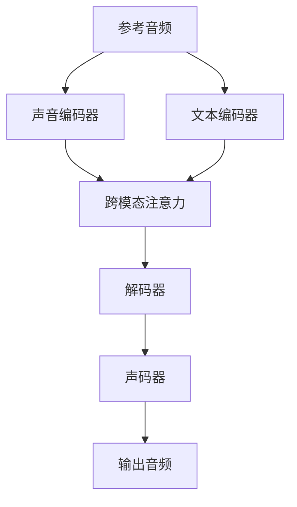
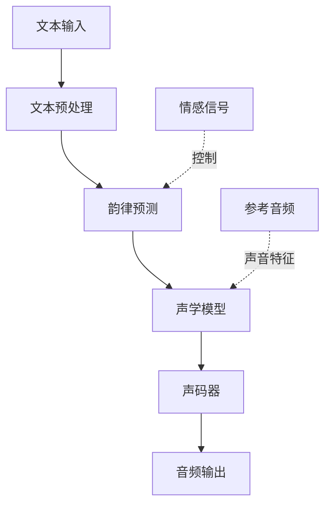

# TTS语音合成

## 关键词

| 类别 | 关键词 |
|------|--------|
| 技术原理 | 拼接合成、参数合成、神经网络TTS、WaveNet、Tacotron |
| 主流服务 | Azure TTS、Google Cloud TTS、AWS Polly、火山引擎、阿里云 |
| 开源方案 | Coqui TTS、Tortoise-TTS、ESPnet、MaryTTS |
| 声音克隆 | Few-shot克隆、声音迁移、声音风格迁移 |
| 情感合成 | 情感语音合成、情绪控制、语音表现力 |
| 多语言 | 多语种TTS、跨语言迁移、中文TTS |
| 技术指标 | MOS分数、实时率、延迟、发音准确率 |
| 应用场景 | 数字人配音、语音导航、智能客服、有声书 |

> [!abstract] 摘要
> 语音合成（Text-to-Speech, TTS）是将文字转换为自然语音的技术，是数字人实现"开口说话"能力的关键技术。本文档系统梳理TTS技术原理、主流商业服务、开源解决方案、声音克隆技术及情感语音合成方案，为数字人声音系统的构建提供全面的技术参考。

---

## 1. TTS技术原理

### 1.1 技术演进历程


TTS技术经历了从拼接合成到神经网络生成的革命性变革：

| 时代 | 技术特征 | 代表模型 | MOS分数 |
|------|----------|----------|---------|
| 早期 | 波形拼接 | PSOLA | 3.0-3.5 |
| 中期 | 参数合成 | HTS | 3.5-4.0 |
| 深度学习前期 | 神经网络声码器 | WaveNet | 4.0-4.5 |
| 端到端时代 | 自回归生成 | Tacotron 2 | 4.2-4.6 |
| 当前 | Transformer+扩散 | VALL-E, Fish-Speech | 4.5-4.8 |

### 1.2 核心架构解析

#### 声学模型（Acoustic Model）

声学模型负责将文本特征转换为声学参数：

```python
# Tacotron 2 声学模型简化架构
class Tacotron2(nn.Module):
    def __init__(self, n_symbols, embedding_dim=512):
        self.embedding = nn.Embedding(n_symbols, embedding_dim)
        self.encoder = CBHG()  # 编码器
        self.decoder = LocationSensitiveAttention()  # 解码器
        self.linear = Linear(256, 80)  # 输出mel频谱
        
    def forward(self, text):
        # 文本 → 字符嵌入 → 编码 → 解码 → Mel频谱
        embedded = self.embedding(text)
        encoded = self.encoder(embedded)
        mel_output = self.decoder(encoded)
        return self.linear(mel_output)
```

#### 声码器（Vocoder）

声码器将声学参数转换为波形信号：

| 声码器类型 | 代表模型 | 优点 | 缺点 |
|------------|----------|------|------|
| 自回归 | WaveNet | 音质极高 | 推理速度慢 |
| Flow-based | Parallel WaveGAN | 可并行生成 | 计算量大 |
| GAN-based | HiFi-GAN | 速度快、质量好 | 训练不稳定 |
| Diffusion | DiffWave | 音质好 | 需要多步采样 |
| Neural HM | Griffin-Lim | 速度快 | 音质损失大 |

### 1.3 关键技术指标

> [!note] 评估维度
> TTS系统的评估主要从以下维度进行：
> - **MOS（Mean Opinion Score）**：主观质量评分，1-5分制
> - **实时率（RTF）**：生成速度与实时播放速度的比值
> - **首包延迟**：从输入文本到输出首段音频的时间
> - **发音准确率**：合成音频中发音错误的比例

---

## 2. 主流TTS服务对比

### 2.1 国际云服务

#### Microsoft Azure TTS

Azure TTS是微软推出的企业级语音合成服务，拥有全球最大的语音库：

| 特性 | 详情 |
|------|------|
| 语音数量 | 400+种声音，70+语言 |
| 神经网络语音 | Neural TTS，音质接近人类 |
| 声音定制 | Custom Neural Voice（声音克隆） |
| 特色功能 | 情感控制、语速调节、音调调整 |
| API形式 | REST API, WebSocket, SDK |
| 免费额度 | 50万字符/月（标准语音），5千字符/月（神经网络） |

**情感控制示例**：

```python
import azure.cognitiveservices.speech as speechsdk

speech_config = speechsdk.SpeechConfig(
    subscription="YOUR_KEY",
    region="eastus"
)

# 配置情感样式
speech_config.speech_synthesis_voice_name = "zh-CN-XiaoxiaoNeural"
synthesizer = speechsdk.SpeechSynthesizer(speech_config=speech_config)

# 使用"愉快"情感合成
ssml = """
<speak version='1.0' xmlns='https://www.w3.org/2001/10/synthesis' 
       xml:lang='zh-CN'>
    <voice name='zh-CN-XiaoxiaoNeural'>
        <mstts:express-as style='cheerful'>
            今天天气真好，我们一起去公园吧！
        </mstts:express-as>
    </voice>
</speak>"""

result = synthesizer.speak_ssml_async(ssml).get()
```

#### Google Cloud TTS

Google Cloud TTS以WaveNet声码器著称，音质表现出色：

| 特性 | 详情 |
|------|------|
| 标准语音 | 40+语言，220+声音 |
| WaveNet语音 | 更自然的语音质量 |
| 语音定制 | Custom Voice（需申请） |
| 流式输出 | 支持媒体流实时输出 |

#### Amazon Polly

AWS Polly支持多种输出格式，深度集成AWS生态系统：

```python
import boto3

polly = boto3.client('polly')

# 合成语音
response = polly.synthesize_speech(
    Text="欢迎使用Amazon Polly语音合成服务",
    OutputFormat='mp3',
    VoiceId='Zhiyu',  # 中文语音
    Engine='neural'   # 神经网络引擎
)

# 保存音频
with open('output.mp3', 'wb') as f:
    f.write(response['AudioStream'].read())
```

### 2.2 国内云服务

#### 火山引擎TTS（字节跳动）

| 特性 | 详情 |
|------|------|
| 语音质量 | 支持高清/极高清音质 |
| 声音克隆 | 少量样本快速克隆 |
| 情感合成 | 支持开心、悲伤、愤怒等情感 |
| 价格 | 约0.1元/千次调用 |

#### 阿里云语音合成

```python
from aliyunsdkcore.client import AcsClient
from aliyunsdknls.cloud_sdk.request import SynthesizeSpeechRequest

client = AcsClient('ACCESS_KEY', 'ACCESS_SECRET', 'cn-shanghai')

request = SynthesizeSpeechRequest()
request.set_Text("欢迎使用阿里云语音合成服务")
request.set_Voice("zhixiaobai")
request.set_Format("mp3")
request.set_SampleRate("16000")

response = client.do_action_with_exception(request)
```

#### 腾讯云TTS

| 特性 | 详情 |
|------|------|
| 语音类型 | 基础音色+精品音色 |
| 声音克隆 | 私人定制 |
| 行业方案 | 客服、教育、导航等 |
| API支持 | RESTful API, SDK |

### 2.3 服务对比总结

| 服务商 | 语音质量 | 价格 | 中文支持 | 声音克隆 | 推荐指数 |
|--------|----------|------|----------|----------|----------|
| Azure | ⭐⭐⭐⭐⭐ | 中 | ⭐⭐⭐⭐ | ✅ | ⭐⭐⭐⭐⭐ |
| Google | ⭐⭐⭐⭐⭐ | 中 | ⭐⭐⭐ | ✅ | ⭐⭐⭐⭐ |
| AWS Polly | ⭐⭐⭐⭐ | 低 | ⭐⭐⭐ | ✅ | ⭐⭐⭐⭐ |
| 火山引擎 | ⭐⭐⭐⭐ | 低 | ⭐⭐⭐⭐⭐ | ✅ | ⭐⭐⭐⭐⭐ |
| 阿里云 | ⭐⭐⭐⭐ | 低 | ⭐⭐⭐⭐⭐ | ✅ | ⭐⭐⭐⭐ |
| 腾讯云 | ⭐⭐⭐⭐ | 低 | ⭐⭐⭐⭐⭐ | ✅ | ⭐⭐⭐⭐ |

---

## 3. 开源TTS方案

### 3.1 Coqui TTS

Coqui TTS是目前最活跃的开源TTS项目，提供高质量的端到端语音合成：

```bash
# 安装Coqui TTS
pip install TTS

# 使用预训练模型合成语音
from TTS.api import TTS

tts = TTS(model_name="tts_models/zh-CN/baker/tacotron2-DDC-GST")
tts.tts_to_file(text="你好，这是Coqui TTS语音合成演示", 
                file_path="output.wav")
```

**支持的模型**：

| 模型 | 语言 | 特点 | 显存需求 |
|------|------|------|----------|
| Tacotron2-DDC | 中文 | 适合中文 | 4GB |
| YourTTS | 多语言 | 零样本迁移 | 6GB |
| VITS | 多语言 | 快速、高质量 | 4GB |

### 3.2 Tortoise-TTS

Tortoise-TTS以极高质量著称，支持声音克隆：

```python
from tortoise.api import TextToSpeech
from tortoise.utils.audio import load_audio, load_pretrained

tts = TextToSpeech()

# 使用自定义声音克隆
reference_audio = load_audio("reference.wav", 24000)
audio = tts.tts(
    text="你好，这是一段使用自定义声音合成的语音",
    voice_samples=[reference_audio],
    conditioning_latents=None
)
```

> [!warning] 使用注意
> Tortoise-TTS生成速度较慢，建议使用量化模型或ONNX加速：
> ```bash
> tortoise-tts --model tortoise/onnx --text "文本内容"
> ```

### 3.3 Fish-Speech

Fish-Speech是国产开源TTS项目，专为中文优化：

```python
# 使用Fish-Speech进行语音合成
from fish_speech.models_tts import FishTTS

model = FishTTS.from_pretrained("fishaudio/fish-speech-1")
model.generate(
    text="你好，欢迎使用Fish-Speech语音合成系统",
    speaker="default"
)
```

**Fish-Speech优势**：

- 完全开源，可商用
- 对中文优化良好
- 支持多说话人
- 训练推理效率高

### 3.4 开源方案对比

| 项目 | GitHub Stars | 中文支持 | 声音克隆 | 训练难度 | 推荐场景 |
|------|--------------|----------|----------|----------|----------|
| Coqui TTS | 30k+ | ⭐⭐⭐⭐ | ✅ | 中等 | 生产部署 |
| Tortoise-TTS | 20k+ | ⭐⭐⭐ | ✅ | 较高 | 高质量定制 |
| Fish-Speech | 15k+ | ⭐⭐⭐⭐⭐ | ✅ | 较低 | 中文场景 |
| VITS | 18k+ | ⭐⭐⭐⭐ | ✅ | 中等 | 通用场景 |
| ESPnet | 10k+ | ⭐⭐⭐⭐ | ❌ | 较高 | 学术研究 |

---

## 4. 声音克隆技术

### 4.1 技术原理

声音克隆（Voice Cloning）是指通过少量参考音频，提取说话人的声音特征，生成具有相同音色的新语音。根据样本需求量可分为：

| 方法 | 所需样本 | 克隆质量 | 适用场景 |
|------|----------|----------|----------|
| 零样本克隆 | 0（仅文本） | 中等 | 通用TTS |
| 少样本克隆 | 10秒-1分钟 | 较高 | 个人定制 |
| 充分样本 | 1小时+ | 极高 | 专业配音 |

### 4.2 XTTS声音克隆

XTTS是Coqui推出的高质量声音克隆模型：

```python
from TTS.api import TTS

tts = TTS(model_name="tts_models/multilingual/multi-dataset/xtts")
tts.tts_to_file(
    text="你好，这是使用你声音特征克隆的语音",
    speaker_wav="my_voice.wav",
    language="zh"
)
```

**技术架构**：



### 4.3 声音风格迁移

声音风格迁移（Voice Style Transfer）可以将一种声音的风格迁移到另一种声音：

> [!example] 应用场景
> 将专业播音员的声音风格（如抑扬顿挫、情感表达）迁移到普通用户的音色上

**技术方案**：

```python
# 使用Grad-TTS进行风格控制
from grad_tts import GradTTS

model = GradTTS()
model.load_checkpoint("grad_tts_style_control.pt")

# 提取参考音频的风格向量
style_embedding = model.extract_style(reference_audio)

# 合成带有指定风格的语音
output = model.generate(
    text="输入文本",
    style_vector=style_embedding,
    temperature=0.7
)
```

---

## 5. 情感语音合成

### 5.1 情感控制维度

情感语音合成需要精细控制以下维度：

| 维度 | 参数 | 影响效果 |
|------|------|----------|
| 语速 | Speed | 快/慢节奏 |
| 音调 | Pitch | 高/低沉 |
| 音量 | Volume | 强/弱力度 |
| 停顿 | Pause | 语句间隔 |
| 语气 | Intonation | 升降调变化 |
| 呼吸 | Breathing | 自然停顿 |

### 5.2 EMOTAIX模型

EMOTAIX是专门针对中文情感TTS优化的模型：

```python
# 情感语音合成示例
from emotaix import EmotionalTTS

tts = EmotionalTTS(model_path="emotaix_chinese.pt")

# 指定情感类型
emotions = ["happy", "sad", "angry", "neutral", "surprise"]

for emotion in emotions:
    audio = tts.synthesize(
        text="今天是个好日子",
        emotion=emotion,
        intensity=0.8  # 情感强度0-1
    )
    tts.save(f"emotion_{emotion}.wav", audio)
```

### 5.3 控制信号注入

通过Fine-tuning在基础模型上注入情感控制能力：

```python
# 使用LoRA进行情感控制微调
from lora_tts import apply_lora

base_model = load_model("tts_base_chinese.pt")

# 应用不同情感的LoRA权重
emotion_loras = {
    "happy": "lora_happy.pt",
    "sad": "lora_sad.pt",
    "angry": "lora_angry.pt"
}

for emotion, lora_path in emotion_loras.items():
    model = apply_lora(base_model, lora_path)
    audio = model.generate("测试文本")
```

---

## 6. 多语言支持

### 6.1 跨语言TTS技术

现代TTS系统需要支持多语言切换，关键技术包括：

| 技术 | 描述 | 挑战 |
|------|------|------|
| 多语言模型 | 单一模型支持多语言 | 语言间干扰 |
| 代码切换 | 同一句子中切换语言 | 发音一致性 |
| 跨语言迁移 | 用少量数据扩展新语言 | 音质保持 |

### 6.2 MMS-FT项目

Meta的Massively Multilingual Speech项目支持1100+语言：

```python
# 使用MMS-FT进行多语言合成
from mms_mozilla import MMSFT

mms = MMSFT()

# 检测语言并合成
result = mms.synthesize(
    text="Bonjour, comment allez-vous?",
    language="fra",  # 自动检测或指定
    speaker_id=0
)
```

### 6.3 中文方言支持

| 方言 | 支持情况 | 质量评估 |
|------|----------|----------|
| 普通话 | ⭐⭐⭐⭐⭐ | 极高 |
| 粤语 | ⭐⭐⭐⭐ | 高 |
| 四川话 | ⭐⭐⭐⭐ | 高 |
| 东北话 | ⭐⭐⭐⭐ | 高 |
| 上海话 | ⭐⭐⭐ | 中 |
| 闽南语 | ⭐⭐ | 待提升 |

---

## 7. 数字人语音系统架构

### 7.1 端到端架构



### 7.2 部署优化

> [!tip] 实时性能优化
> 数字人场景对TTS延迟极为敏感，建议采用以下优化策略：

```python
# ONNX Runtime加速
import onnxruntime as ort

session = ort.InferenceSession("tts_model.onnx")

# 使用CUDA执行提供程序加速
sess_options = ort.SessionOptions()
sess_options.graph_optimization_level = (
    ort.GraphOptimizationLevel.ORT_ENABLE_ALL
)
providers = ['CUDAExecutionProvider', 'CPUExecutionProvider']
```

---

## 相关文档

- [[数字人形象生成]] - 数字人视觉形象
- [[口型同步技术]] - 唇形动画同步
- [[动作捕捉技术]] - 身体动作驱动
- [[数字人交互系统]] - 智能对话交互
- [[实时渲染技术]] - 语音可视化渲染
- [[数字人平台工具]] - 工具链整合

---

## 更新日志

| 日期 | 版本 | 修改内容 |
|------|------|----------|
| 2026-04-18 | v1.0 | 初版完成 |

---

> [!copyright] 版权声明
> 本文档为归愚知识库原创内容，采用CC BY-NC-SA 4.0协议授权。
