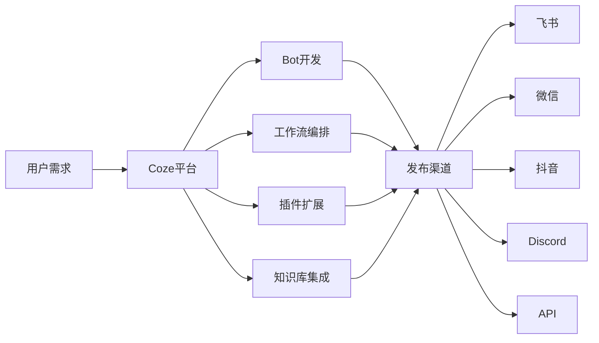
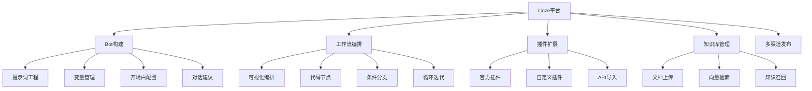
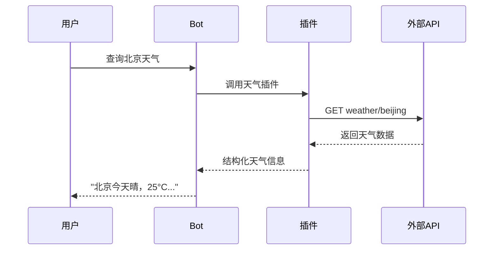
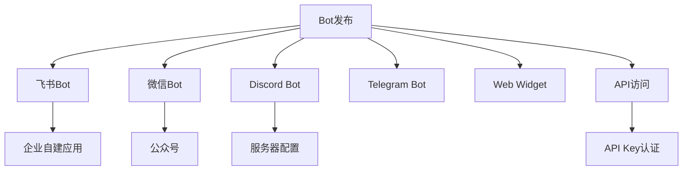

# Coze扣子平台深度指南

> [!abstract] 摘要
> Coze（扣子）是字节跳动推出的AI应用开发平台，支持快速构建、部署和管理聊天机器人的AI应用。本文档全面介绍Coze平台的核心功能、国际版与国内版差异、Bot创建发布流程及插件系统。

## 核心关键词速览

| 关键词 | 说明 | 关键词 | 说明 |
|--------|------|--------|------|
| Coze国际版 | 海外版平台 | Coze国内版 | 豆包/飞书版 |
| Bot编排 | 对话机器人配置 | 插件系统 | 扩展能力 |
| 工作流 | 流程编排引擎 | 知识库 | RAG检索 |
| 变量 | 状态管理 | 开场白 | 首次对话 |
| 对话体验 | UI配置 | 发布渠道 | 多平台分发 |

## 1. 平台概述

### 1.1 产品定位

Coze（扣子）是字节跳动推出的下一代AI应用构建平台，无论用户是否具备编程基础，都能在Coze平台上快速搭建基于各类大模型的聊天机器人、智能体和应用，并将其部署到不同的社交平台和通讯软件上。



### 1.2 国际版vs国内版

| 特性 | Coze国际版 (coze.com) | Coze国内版 (coze.cn) |
|------|----------------------|---------------------|
| 大模型底座 | GPT-4、Claude、Gemini等 | 豆包大模型、云雀大模型 |
| 发布渠道 | Discord、Telegram、Web等 | 飞书、微信、抖音等 |
| 插件生态 | OpenAI兼容插件 | 抖音、飞书等国内服务 |
| 数据存储 | 海外服务器 | 国内服务器 |
| 适用用户 | 海外用户、出海业务 | 国内用户、企业内控 |
| API访问 | 支持 | 通过豆包API |

> [!note] 版本选择建议
> - 出海应用或需要接入GPT/Claude → 选择国际版
> - 国内企业应用、飞书集成 → 选择国内版
> - 两个版本可同时使用，互不冲突

### 1.3 核心能力矩阵



## 2. Bot创建与基础配置

### 2.1 创建Bot流程

**步骤1：进入创建页面**

```
1. 登录 Coze 平台
2. 点击左侧菜单「Bot」
3. 点击「创建Bot」按钮
4. 选择工作空间
5. 填写Bot基本信息
```

**步骤2：基础信息配置**

```yaml
Bot配置:
  name: "智能客服助手"
  description: "提供7x24小时产品咨询与售后服务"
  icon: "上传或选择预设图标"
  language: "中文"
  
  # 模型配置
  model: "gpt-4o"
  temperature: 0.7
  maxTokens: 2000
```

**步骤3：提示词编写**

```markdown
# 角色设定
你是一个专业的智能客服助手，隶属于XX科技公司。

## 核心能力
- 解答产品功能相关问题
- 指导用户完成常见操作
- 收集用户反馈与建议
- 无法解答时引导转人工

## 服务规范
1. 使用友好、专业的语言风格
2. 回答简洁明了，突出重点
3. 涉及隐私信息时提醒用户通过官方渠道
4. 遇到复杂问题时主动转人工

## 禁止行为
- 不提供任何投资建议
- 不承诺具体服务期限
- 不透露公司内部信息
```

### 2.2 变量管理

Coze支持多种类型的变量用于状态管理：

| 变量类型 | 说明 | 示例 |
|----------|------|------|
| Bot变量 | Bot级别共享 | 用户等级、系统配置 |
| 会话变量 | 当前会话内共享 | 上下文状态 |
| 用户变量 | 跨会话持久化 | 用户偏好、积分 |

```yaml
# Bot变量配置示例
variables:
  - name: company_name
    type: string
    default: "XX科技"
    description: "公司名称"
  
  - name: support_hours
    type: string
    default: "9:00-18:00"
    description: "人工客服时间"
  
  - name: escalation_threshold
    type: number
    default: 3
    description: "转人工的连续问题次数"
```

### 2.3 开场白配置

```yaml
开场白:
  content: |
    👋 你好！我是{{company_name}}的智能客服助手。
    
    我可以帮助你：
    • 了解产品功能和特点
    • 解答使用过程中的问题
    • 提供常见问题的解决方案
    
    请直接描述你的问题，我会尽力帮助您！
  
  # 对话建议
  suggested:
    - "产品有哪些核心功能？"
    - "如何开通会员服务？"
    - "遇到技术问题怎么办？"
```

### 2.4 对话体验配置

```yaml
对话体验:
  # 思考过程配置
  thinking:
    enabled: true
    showMode: "collapsed"  # collapsed/expanded/hidden
  
  # 回复生成配置
  generation:
    stream: true  # 流式输出
    markdown: true  # 支持Markdown
  
  # 敏感词过滤
  moderation:
    enabled: true
    action: "block"  # block/flag
```

## 3. 插件系统详解

### 3.1 官方插件

Coze提供了丰富的官方插件：

| 插件类别 | 代表插件 | 功能说明 |
|----------|----------|----------|
| 搜索 | Google搜索、Bing搜索 | 网页信息检索 |
| 天气 | OpenWeather | 实时天气查询 |
| 日程 | Google Calendar | 日程管理 |
| 邮件 | Gmail | 邮件收发 |
| 数据库 | Notion | 笔记与知识库 |
| AI能力 | DALL-E、Stable Diffusion | 图像生成 |

### 3.2 自定义插件开发

Coze支持通过API导入或代码开发自定义插件：

```yaml
# 方式一：API导入
plugin:
  type: openapi
  spec: |
    openapi: 3.0.0
    info:
      title: 产品查询API
      version: 1.0.0
    paths:
      /products:
        get:
          operationId: listProducts
          parameters:
            - name: category
              in: query
              schema:
                type: string
          responses:
            '200':
              description: 产品列表
```

### 3.3 插件使用示例



## 4. 工作流编排

### 4.1 工作流节点类型

Coze工作流支持以下核心节点：

| 节点类型 | 功能 | 典型用途 |
|----------|------|----------|
| LLM节点 | 调用大语言模型 | 内容生成、意图分析 |
| 条件节点 | 条件分支判断 | 流程分流 |
| 循环节点 | 循环执行逻辑 | 批量处理 |
| 代码节点 | 执行Python/JS代码 | 数据处理 |
| 插件节点 | 调用外部服务 | 扩展功能 |
| 知识库节点 | 检索知识库 | RAG增强 |

### 4.2 工作流设计示例

```yaml
# 意图识别工作流
name: intent_classification
nodes:
  - id: start
    type: start
  
  - id: parse_input
    type: llm
    input: "{{start.user_message}}"
    prompt: |
      分析用户消息的意图类别：
      - product_inquiry: 产品咨询
      - technical_support: 技术支持
      - complaint: 投诉建议
      - chitchat: 闲聊
      
      只返回类别名称和置信度JSON
    output: intent_result
  
  - id: route
    type: condition
    condition: "{{intent_result.category}}"
    branches:
      - case: "product_inquiry"
        next: "product_flow"
      - case: "technical_support"
        next: "tech_flow"
      - case: "complaint"
        next: "complaint_flow"
      - case: "chitchat"
        next: "chitchat_flow"
      - case: "*"
        next: "default_flow"
  
  - id: product_flow
    type: knowledge_base
    query: "{{start.user_message}}"
    collection: "product_docs"
  
  - id: generate_response
    type: llm
    input: "{{product_flow.result}}"
    prompt: |
      基于知识库内容，用友好的语气回答用户问题。
```

### 4.3 代码节点示例

```javascript
// Coze代码节点 - JavaScript
module.exports = async ({ params, inputs }) => {
  const { message, userId } = inputs;
  
  // 数据清洗
  const cleanedMessage = message.trim().toLowerCase();
  
  // 关键词提取
  const keywords = cleanedMessage.match(/\b\w{2,}\b/g) || [];
  const uniqueKeywords = [...new Set(keywords)];
  
  // 情感分析（简化版）
  const positiveWords = ['好', '棒', '赞', '喜欢', '满意'];
  const negativeWords = ['差', '烂', '糟', '不满', '投诉'];
  
  let sentiment = 'neutral';
  if (positiveWords.some(w => cleanedMessage.includes(w))) {
    sentiment = 'positive';
  } else if (negativeWords.some(w => cleanedMessage.includes(w))) {
    sentiment = 'negative';
  }
  
  return {
    keywords: uniqueKeywords.slice(0, 10),
    sentiment,
    wordCount: cleanedMessage.length
  };
};
```

## 5. 知识库配置

### 5.1 知识库创建

```yaml
知识库配置:
  name: "产品文档知识库"
  description: "公司产品相关文档"
  
  # 向量模型
  embedding:
    provider: "openai"
    model: "text-embedding-3-small"
  
  # 召回策略
  retrieval:
    topK: 5
    scoreThreshold: 0.5
    rerankEnabled: true
```

### 5.2 文档上传格式

| 格式 | 支持 | 单文件大小 |
|------|------|------------|
| TXT | ✅ | ≤10MB |
| Markdown | ✅ | ≤10MB |
| PDF | ✅ | ≤50MB |
| Word | ✅ | ≤20MB |
| HTML | ✅ | ≤10MB |
| CSV | ✅ | ≤50MB |

> [!tip] 知识库优化建议
> 1. 文档结构化：使用标题、列表、表格增强可读性
> 2. QA分离：复杂文档建议转换为问答对格式
> 3. 定期更新：知识库内容需及时同步最新信息
> 4. 质量把控：上传前检查文档准确性和完整性

## 6. Bot发布与分发

### 6.1 发布渠道



### 6.2 发布配置示例

```yaml
# 飞书发布配置
lark_publish:
  botName: "智能助手"
  botAvatar: "自定义图标"
  
  # 权限配置
  permissions:
    - "接收消息"
    - "发送消息"
    - "使用应用内跳转"
  
  # 可见范围
  visibility:
    type: "all"  # all/organization/specified
    departments: []
```

### 6.3 API访问配置

```yaml
# API发布
api_publish:
  enabled: true
  
  # 认证方式
  auth:
    type: "bearer_token"
    tokenName: "X-API-Token"
  
  # 访问控制
  rateLimit:
    requests: 100
    period: "1m"
  
  # 日志配置
  logging:
    enabled: true
    level: "info"
```

## 7. 实战案例：构建客服Bot

### 7.1 需求分析

```
核心功能：
1. 自动问候与意图识别
2. 产品咨询智能回答
3. 订单状态查询
4. 投诉建议收集
5. 人工客服转接

业务流程：
用户 → 问候 → 意图识别 → 分流处理 → 回答/转人工
```

### 7.2 完整实现

```yaml
# Bot完整配置
bot:
  name: "智能客服"
  
  # 提示词
  prompt: |
    你是一个专业的在线客服，名字叫"小智"。
    
    ## 能力范围
    - 产品功能咨询
    - 订单状态查询（通过插件）
    - 常见问题解答
    - 投诉建议收集
    
    ## 服务准则
    1. 态度热情友好
    2. 回答专业准确
    3. 复杂问题及时转人工
    
    ## 转人工条件
    - 用户明确要求转人工
    - 连续3次无法解答
    - 涉及退款、投诉升级
  
  # 插件配置
  plugins:
    - name: "订单查询"
      type: "http_api"
      endpoint: "https://api.example.com/orders"
  
  # 知识库配置
  knowledge_base:
    - name: "产品FAQ"
      enabled: true
    - name: "使用手册"
      enabled: true
  
  # 开场白
  greeting: |
    👋 你好！我是智能客服小智。
    
    我可以帮你：
    • 了解我们的产品
    • 查询订单状态
    • 解答使用问题
    • 受理投诉建议
    
    请问有什么可以帮到你？
```

## 8. 相关资源

- [[扣子Bot开发]] - Bot开发进阶指南
- [[多Agent系统设计]] - 多Bot协作架构
- [[工作流设计模式]] - 工作流设计原则
- [[AI对话记忆系统]] - 对话上下文管理

---

*本文档由归愚知识系统自动生成 last updated: 2026-04-18*
