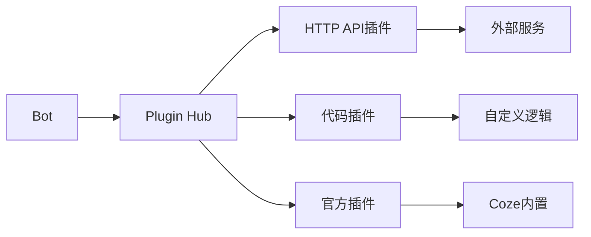

# 扣子Bot开发

> [!abstract] 摘要
> 本文档深入介绍Coze平台Bot开发的核心技术，包括提示词设计最佳实践、变量与状态管理、开场白与对话设计、对话框配置以及自定义插件开发方法。

## 核心关键词速览

| 关键词 | 说明 | 关键词 | 说明 |
|--------|------|--------|------|
| 提示词工程 | Prompt Engineering | 变量作用域 | Bot/会话/用户 |
| 开场白 | Welcome Message | 对话建议 | Suggested Replies |
| 插件SDK | Plugin Development | Function Calling | 函数调用 |
| 意图识别 | Intent Detection | 槽位填充 | Slot Filling |

## 1. 提示词设计进阶

### 1.1 提示词结构

一个优秀的Coze Bot提示词应包含以下模块：

```markdown
# Role Definition (角色定义)
## Profile (基础信息)
## Background (背景设定)

# Capabilities (核心能力)
## Skills (技能列表)
## Tools (可用工具)

# Behavioral Guidelines (行为准则)
## Dos (应该做)
## Don'ts (禁止做)

# Conversation Flow (对话流程)
## Greeting (问候)
## Main Interaction (主要交互)
## Escalation (升级处理)

# Output Format (输出格式)
```

### 1.2 提示词模板

```markdown
# 角色：{bot_name}

## 基础信息
- 名字：{bot_name}
- 性格：{personality}
- 语言风格：{language_style}

## 专业知识
{domain_knowledge}

## 可用工具
- {tool_1}：{tool_1_description}
- {tool_2}：{tool_2_description}

## 服务准则
1. {rule_1}
2. {rule_2}
3. {rule_3}

## 禁止事项
- 不谈论的话题：{banned_topics}
- 不做的行为：{banned_actions}

## 输出格式
- 回答使用{format}格式
- 涉及代码时使用{code_format}
```

### 1.3 提示词优化技巧

> [!tip] 提示词优化七原则
> 1. **具体明确**：避免模糊描述，给出具体例子
> 2. **结构清晰**：使用Markdown层级结构
> 3. **边界清晰**：明确"能做什么"和"不能做什么"
> 4. **示例驱动**：通过Few-shot示例传递期望风格
> 5. **格式约束**：明确输出格式要求
> 6. **容错处理**：预设异常情况的处理方式
> 7. **持续迭代**：根据实际效果不断优化

### 1.4 Few-shot示例设计

```markdown
## 示例对话

### 示例1：正常咨询
用户：请问产品A有什么特点？
助手：产品A是我们公司的旗舰产品，主要特点包括：
1. 高性能处理器，处理速度提升40%
2. 超长续航，满电可用12小时
3. 轻薄设计，重量仅1.2kg
4. AI智能助手内置

### 示例2：模糊问题
用户：那个产品
助手：您提到的"那个产品"比较模糊，我可以帮您：
• 如果是指热门产品"产品A"，请回复"产品A"
• 如果是想了解新品，请回复"新品"
• 或者您可以直接描述具体需求，我来推荐

### 示例3：转人工
用户：我要投诉，你们服务太差了
助手：非常抱歉给您带来不好的体验。对于投诉类问题，我建议转接人工客服为您处理，这样能更详细地了解情况并及时解决。
请回复"转人工"，我为您安排。
```

## 2. 变量与状态管理

### 2.1 变量类型与作用域

| 变量类型 | 作用域 | 生命周期 | 典型用途 |
|----------|--------|----------|----------|
| Bot变量 | 所有会话 | 永久 | 全局配置 |
| 会话变量 | 当前会话 | 会话结束 | 上下文状态 |
| 用户变量 | 特定用户 | 永久 | 用户偏好 |

### 2.2 Bot变量配置

```yaml
# Bot变量定义
variables:
  # 系统配置类
  - name: company_name
    type: String
    default: "XX科技"
    description: "公司名称"
  
  - name: working_hours
    type: String
    default: "周一至周五 9:00-18:00"
    description: "工作时间"
  
  - name: max_retries
    type: Number
    default: 3
    description: "最大重试次数"
  
  # 业务配置类
  - name: enabled_features
    type: Array
    default: ["faq", "order_query", "complaint"]
    description: "启用的功能模块"
```

### 2.3 会话变量使用

```yaml
# 会话流程中的变量管理
session_flow:
  # 阶段1：收集信息
  collect_info:
    - var: user_intent
      type: String
      prompt: "请描述您要咨询的问题"
    
    - var: user_contact
      type: String
      condition: "{{user_intent == 'callback'}}"
      prompt: "请留下您的联系电话"
  
  # 阶段2：状态标记
  update_state:
    - var: conversation_stage
      value: "resolved"  # resolving/in_progress/escalated/resolved
    - var: last_question_time
      value: "{{current_timestamp}}"
```

### 2.4 变量表达式

```markdown
# 在提示词和节点中使用变量

# 引用Bot变量
{{bot.company_name}}        # 公司名称
{{bot.max_retries}}         # 最大重试次数

# 引用会话变量
{{session.user_intent}}      # 用户意图
{{session.conversation_stage}}  # 对话阶段

# 引用用户变量
{{user.id}}                 # 用户ID
{{user.tier}}               # 用户等级
{{user.preferences.lang}}   # 用户偏好语言

# 条件表达式
{{session.retry_count >= bot.max_retries ? '转人工' : '继续尝试'}}

# 默认值处理
{{user.email || '未提供邮箱'}}
```

## 3. 开场白与对话设计

### 3.1 开场白设计原则

> [!note] 优秀开场白四要素
> 1. **价值说明**：让用户知道Bot能做什么
> 2. **降低门槛**：给出具体的使用引导
> 3. **风格呈现**：展现Bot的性格特点
> 4. **行动引导**：提供默认选项加速启动

### 3.2 开场白模板

```yaml
# 基础模板
greeting:
  text: |
    👋 你好！我是{bot_name}。
    
    {value_proposition}
    
    你可以这样问我：
    {suggested_questions}
  
  suggestions:
    - "问题1"
    - "问题2"
    - "问题3"
    - "其他问题"

# 进阶模板（带个性化）
greeting_advanced:
  text: |
    {{#if user.name}}
    👋 {{user.name}}，欢迎回来！
    {{else}}
    👋 你好！
    {{/if}}
    
    有什么我可以帮你的吗？
  
  # 根据用户历史动态调整
  dynamic_content:
    condition: "{{user.last_visit}}"
    content: |
      上次你询问了关于{user.last_topic}的问题，
      是否需要继续了解？

# 行业模板（电商客服）
greeting_ecommerce:
  text: |
    🛒 欢迎来到{store_name}！
    
    我可以帮你：
    • 查找商品、比较价格
    • 查询订单物流
    • 办理退换货
    • 解答购物问题
    
    {{user.name}}，有什么需要帮忙的？
```

### 3.3 对话建议设计

```yaml
# 对话建议配置
suggestions:
  # 静态建议
  static:
    - "查看热门商品"
    - "我的订单"
    - "联系客服"
  
  # 动态建议（根据上下文）
  dynamic:
    - condition: "{{session.viewing_product}}"
      items:
        - "加入购物车"
        - "查看相似商品"
        - "联系客服"
    
    - condition: "{{session.has_order}}"
      items:
        - "查看物流"
        - "申请售后"
        - "确认收货"
  
  # 智能建议（AI生成）
  ai_generated:
    enabled: true
    prompt: |
      基于用户当前状态{{session.current_state}}，
      生成3个最可能的后续问题。
```

### 3.4 对话流程编排

```mermaid
graph TD
    A[开场白] --> B[用户输入]
    B --> C{意图识别}
    C -->|咨询| D[知识库检索]
    C -->|订单| E[订单查询]
    C -->|[^人工]| F[转人工]
    C -->|闲聊| G[闲聊回复]
    
    D --> H{知识命中?}
    H -->|是| I[返回答案]
    H -->|否| J[多轮澄清]
    
    I --> K{用户满意?}
    K -->|否| F
    K -->|是| L[结束/推荐]
    
    J --> B
    L --> M[推荐下一步]
    M --> B
```

## 4. 插件开发

### 4.1 插件架构



### 4.2 HTTP API插件开发

```yaml
# plugin_definition.yaml
schema: "2.0"
info:
  name: "订单查询插件"
  description: "查询用户订单状态、物流信息"
  icon: "📦"

# API定义
apis:
  - name: "get_order_list"
    description: "获取用户订单列表"
    method: "GET"
    path: "/api/v1/orders"
    
    headers:
      Authorization: "Bearer {{env.API_KEY}}"
      Content-Type: "application/json"
    
    parameters:
      - name: "status"
        type: "string"
        required: false
        description: "订单状态筛选"
        enum: ["pending", "paid", "shipped", "completed"]
      
      - name: "page"
        type: "integer"
        required: false
        default: 1
        description: "页码"
      
      - name: "page_size"
        type: "integer"
        required: false
        default: 10
        description: "每页数量"
    
    response:
      schema: |
        {
          "orders": [
            {
              "order_id": "string",
              "status": "string",
              "total_amount": "number",
              "created_at": "string"
            }
          ],
          "total": "number",
          "page": "number"
        }

  - name: "get_order_detail"
    description: "获取订单详情"
    method: "GET"
    path: "/api/v1/orders/{order_id}"
    
    path_parameters:
      - name: "order_id"
        type: "string"
        required: true
        description: "订单ID"
```

### 4.3 代码插件开发（Node.js）

```javascript
// 插件入口文件：index.js
const axios = require('axios');

// 插件元数据
module.exports.meta = {
  name: '天气查询插件',
  version: '1.0.0',
  description: '查询全球城市天气信息',
  author: 'Developer',
  icon: '🌤️'
};

// 插件配置
module.exports.config = {
  apiKey: {
    type: 'secret',
    required: true,
    description: '天气API密钥'
  },
  baseUrl: {
    type: 'string',
    default: 'https://api.weather.example.com',
    description: 'API基础地址'
  }
};

// 工具函数定义
module.exports.tools = [
  {
    name: 'get_current_weather',
    description: '获取当前天气信息',
    parameters: {
      type: 'object',
      properties: {
        city: {
          type: 'string',
          description: '城市名称或城市代码'
        },
        unit: {
          type: 'string',
          enum: ['celsius', 'fahrenheit'],
          default: 'celsius',
          description: '温度单位'
        }
      },
      required: ['city']
    }
  }
];

// 工具实现
module.exports.handlers = {
  async get_current_weather(params, context) {
    const { city, unit = 'celsius' } = params;
    const { apiKey, baseUrl } = context.config;
    
    try {
      const response = await axios.get(`${baseUrl}/current`, {
        params: {
          city,
          unit,
          apikey: apiKey
        }
      });
      
      const data = response.data;
      
      // 格式化返回结果
      return {
        success: true,
        data: {
          city: data.location,
          country: data.country,
          temperature: data.temp,
          feels_like: data.feelsLike,
          humidity: data.humidity,
          description: data.weatherDesc,
          wind_speed: data.windSpeed,
          updated_at: data.updateTime
        }
      };
    } catch (error) {
      return {
        success: false,
        error: error.message
      };
    }
  }
};
```

### 4.4 插件调试

```yaml
# 本地调试配置
debug:
  enabled: true
  port: 3000
  
  # 模拟数据
  mock:
    get_current_weather:
      city: "北京"
      country: "中国"
      temperature: 22
      humidity: 45
      description: "晴"
```

## 5. 高级功能配置

### 5.1 多轮对话管理

```yaml
conversation:
  # 对话状态机配置
  state_machine:
    initial_state: "greeting"
    states:
      - name: "greeting"
        on_enter: "show_welcome"
        transitions:
          - event: "user_input"
            target: "intent_detection"
      
      - name: "intent_detection"
        on_enter: "analyze_intent"
        transitions:
          - condition: "{{intent == 'query'}}"
            target: "query_handling"
          - condition: "{{intent == 'complaint'}}"
            target: "complaint_handling"
          - event: "timeout"
            target: "escalate"
      
      - name: "query_handling"
        on_enter: "search_knowledge"
        transitions:
          - event: "resolved"
            target: "followup"
          - event: "escalate"
            target: "escalate"
```

### 5.2 敏感信息处理

```yaml
# 敏感信息检测与脱敏
sensitive_data:
  # 检测规则
  detection:
    patterns:
      - type: "phone"
        regex: "1[3-9]\\d{9}"
        action: "mask"
        mask_format: "****${{last4}}"
      
      - type: "id_card"
        regex: "\\d{17}[\\dXx]"
        action: "mask"
        mask_format: "${{first6}}********${{last4}}"
      
      - type: "email"
        regex: "[a-zA-Z0-9._%+-]+@[a-zA-Z0-9.-]+\\.[a-zA-Z]{2,}"
        action: "mask"
        mask_format: "${{local}}***@${{domain}}"
  
  # 处理策略
  handling:
    - type: "collect_phone"
      trigger: "{{intent == 'callback'}}"
      prompt: "请提供联系电话以便我们回电"
      storage: "encrypted"
```

### 5.3 性能监控配置

```yaml
# Bot性能监控
monitoring:
  enabled: true
  
  # 指标收集
  metrics:
    - response_time      # 响应时间
    - intent_accuracy    # 意图识别准确率
    - resolution_rate    # 问题解决率
    - escalation_rate    # 转人工率
    - user_satisfaction  # 用户满意度
  
  # 告警配置
  alerts:
    - condition: "{{response_time > 5000}}"
      level: "warning"
      action: "notify"
    
    - condition: "{{escalation_rate > 0.3}}"
      level: "critical"
      action: "escalate"
```

## 6. 实战案例：营销Bot开发

### 6.1 需求规格

```
Bot名称：智能营销助手
目标：产品推广、线索收集、预约咨询

核心流程：
1. 了解用户需求
2. 推荐合适产品
3. 解答产品疑问
4. 收集联系信息
5. 预约咨询时间
```

### 6.2 完整实现

```yaml
bot:
  name: "智能营销助手"
  
  # 提示词
  prompt: |
    # 角色设定
    你是{company_name}的智能营销助手"小营"，负责产品推广和客户咨询服务。
    
    ## 产品线
    - 企业SaaS套餐：面向中大型企业，年费制
    - 成长版套餐：面向成长型企业，按月付费
    - 初创版套餐：面向初创团队，基础功能免费
    
    ## 服务准则
    1. 热情专业，了解客户真实需求
    2. 不夸大产品功能，如实介绍
    3. 尊重客户选择，不强买强卖
    4. 收集有效联系方式以便后续跟进
    
    ## 推荐流程
    1. 询问企业规模和行业
    2. 了解当前痛点和需求
    3. 推荐合适的套餐
    4. 解答具体问题
    5. 预约咨询或试用
    
    ## 禁忌
    - 不承诺具体价格（需转销售确认）
    - 不贬低竞品
    - 不泄露其他客户信息
    - 不在非工作时间打扰客户
  
  # 变量
  variables:
    - name: "lead_stage"
      type: "String"
      default: "initial"  # initial/interested/qualified/converted
    - name: "interested_product"
      type: "String"
      default: ""
    - name: "contact_collected"
      type: "Boolean"
      default: false
  
  # 开场白
  greeting: |
    👋 你好！欢迎来到{company_name}！
    
    我是智能营销助手小营，可以帮你：
    • 了解我们的产品解决方案
    • 获取个性化的产品推荐
    • 预约产品演示或试用
    
    请告诉我：
    1. 你的企业规模是？
    2. 主要想解决什么问题？
  
  # 对话建议
  suggestions:
    - "我想了解企业SaaS套餐"
    - "我们有50人左右"
    - "想提高团队协作效率"
    - "有免费试用吗？"
```

## 7. 相关资源

- [[coze平台深度指南]] - Coze平台完整教程
- [[Function_Calling与工具调用]] - 函数调用规范
- [[多Agent系统设计]] - 多Bot协作架构
- [[AI对话记忆系统]] - 对话状态管理

---

*本文档由归愚知识系统自动生成 last updated: 2026-04-18*
