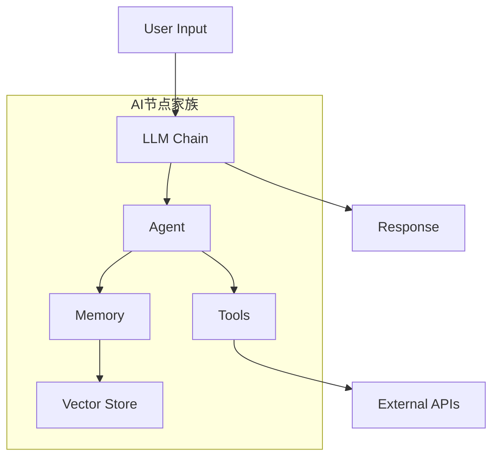
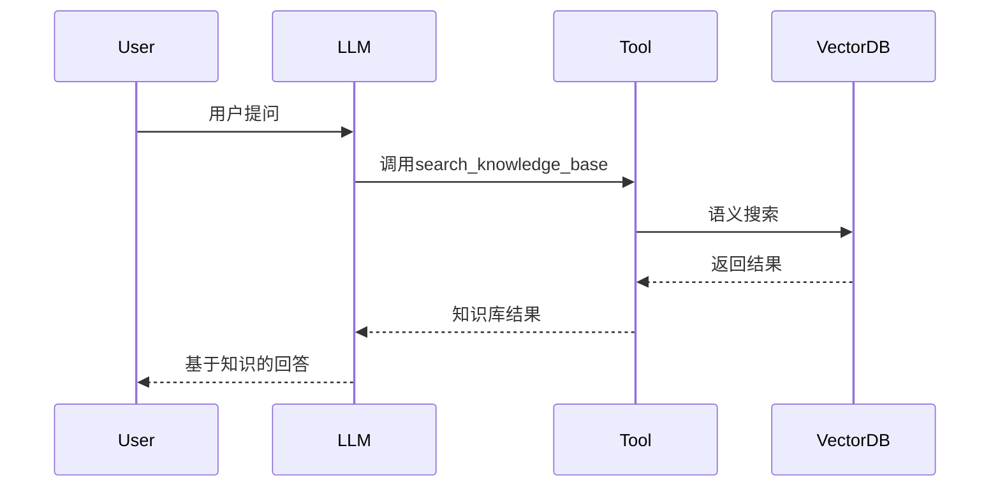
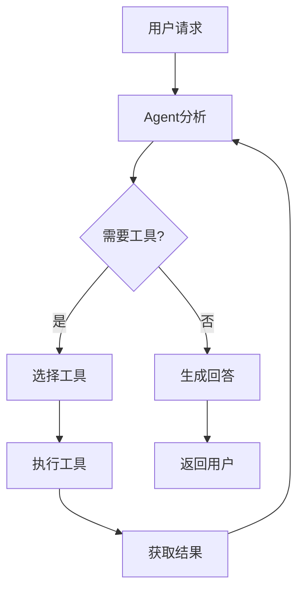

# n8n与LLM集成

> [!abstract] 摘要
> 本文档详细介绍n8n平台中与AI大语言模型集成的核心能力，包括LLM节点、Prompt节点、Memory节点、Tool节点和Agent节点的配置方法与实战技巧。

## 核心关键词速览

| 关键词 | 说明 | 关键词 | 说明 |
|--------|------|--------|------|
| LLM Chain | 大语言模型调用链 | Prompt模板 | 结构化提示词 |
| Memory节点 | 对话上下文管理 | Tool节点 | 外部工具调用 |
| Agent节点 | 自主决策代理 | 向量存储 | 语义检索引擎 |
| Embedding | 文本向量化 | Function Calling | 函数调用接口 |
| Token限制 | 上下文窗口控制 | 温度参数 | 生成多样性控制 |

## 1. AI节点体系概述

n8n提供了完整的AI能力组件，构成了一个模块化的AI系统：



### 1.1 节点能力矩阵

| 节点类型 | 核心功能 | 典型场景 |
|----------|----------|----------|
| LLM Chain | 调用大语言模型 | 文本生成、翻译、摘要 |
| Prompt | 构建结构化提示词 | 角色扮演、任务分解 |
| Memory | 管理对话历史 | 多轮对话、上下文理解 |
| Tool | 定义外部工具 | 搜索、计算、API调用 |
| Agent | 自主决策执行 | 复杂任务自动化 |
| Embedding | 文本向量化 | 语义搜索、RAG |

## 2. LLM节点详解

### 2.1 节点配置

LLM Chain节点是n8n调用大语言模型的核心入口：

```yaml
节点配置:
  provider: OpenAI  # 模型提供商
  model: gpt-4o     # 具体模型
  
  # 认证方式
  credentials:
    apiKey: "{{ $credentials.openAiApi }}"  # 引用凭证
  
  # 消息配置
  messages:
    - role: system
      content: |
        你是一位专业的技术文档助手。
        擅长用简洁清晰的语言解释复杂概念。
        回答时使用Markdown格式。
    
    - role: user  
      content: "{{ $json.userMessage }}"
  
  # 生成参数
  options:
    temperature: 0.7      # 创造性：0-2，越高越有创意
    maxTokens: 1000        # 最大生成token数
    topP: 1.0             # 采样策略
    frequencyPenalty: 0   # 频率惩罚
    presencePenalty: 0     # 存在惩罚
```

### 2.2 模型选择指南

| 模型 | 特点 | 适用场景 | 成本 |
|------|------|----------|------|
| GPT-4o | 最强综合能力 | 复杂推理、代码生成 | 高 |
| GPT-4o-mini | 性价比优 | 日常对话、简单任务 | 中 |
| Claude 3.5 | 长文本处理强 | 文档分析、长文写作 | 中高 |
| Gemini 1.5 | 多模态支持 | 图像理解、跨模态 | 中 |

> [!tip] 成本优化建议
> 根据任务复杂度选择模型：简单任务用GPT-4o-mini，复杂推理用GPT-4o。可设置默认模型+备用模型实现自动降级。

### 2.3 动态模型选择

```javascript
// 根据任务复杂度动态选择模型
const inputLength = $json.userMessage.length;
const isCodeTask = $json.userMessage.includes('代码') || 
                   $json.userMessage.includes('function');

let model = 'gpt-4o-mini';
if (inputLength > 5000 || isCodeTask) {
  model = 'gpt-4o';
}

return { model };
```

## 3. Prompt节点配置

### 3.1 模板语法

Prompt节点支持强大的模板语法：

```markdown
## 基础变量
{{ $json.field }}                    # 引用JSON字段
{{ $node["NodeName"].json.field }}   # 引用其他节点输出
{{ $vars.secretKey }}                # 引用变量

## 条件逻辑
{{ $json.lang === 'zh' ? '中文' : '英文' }}

## 循环处理
{{ $json.items.map(item => `- ${item}`).join('\n') }}

## 数学运算
{{ Math.round($json.price * 1.1) }}

## 日期时间
{{ new Date().toLocaleDateString('zh-CN') }}
```

### 3.2 Few-shot Prompt模板

```yaml
messages:
  - role: system
    content: |
      你是一个情感分类助手。判断用户评论的情感是正面、负面还是中性。
  
  - role: user
    content: |
      示例：
      输入："这个产品太棒了，完全超出预期！"
      分类：正面
      
      输入："服务态度很差，等了两个小时都没人理。"
      分类：负面
      
      输入："今天天气不错。"
      分类：中性
      
      现在请分类：
      输入："{{ $json.comment }}"
```

### 3.3 链式Prompt

```yaml
# 第一阶段：提取关键信息
stage1:
  prompt: |
    从以下文本中提取：人名、地点、时间、事件
    文本：{{ $json.rawText }}
    只返回JSON格式。

# 第二阶段：基于提取结果生成摘要
stage2:
  prompt: |
    基于以下信息生成事件摘要：
    {{ $node["Stage1"].json }}
    
    摘要要求：
    1. 50字以内
    2. 包含所有关键信息
    3. 语言流畅
```

## 4. Memory节点详解

### 4.1 内存类型对比

| 内存类型 | 实现方式 | 容量 | 适用场景 |
|----------|----------|------|----------|
| Buffer Window | 固定窗口 | 最近N条 | 短期对话 |
| Vector Store | 向量数据库 | 无限 | 长期记忆 |
| Summary | 摘要压缩 | 无限 | 压缩历史 |
| Combined | 混合模式 | 灵活 | 综合场景 |

### 4.2 Buffer Memory配置

```yaml
type: bufferWindow
windowSize: 10  # 保留最近10轮对话
sessionKey: "{{ $json.sessionId }}"  # 按会话隔离
```

### 4.3 向量记忆配置

```yaml
type: vectorStore
provider: Pinecone
index: conversations
dimension: 1536  # OpenAI embedding维度
metadata:
  userId: "{{ $json.userId }}"
  sessionId: "{{ $json.sessionId }}"
```

### 4.4 混合记忆配置

```yaml
type: combined
buffers:
  - type: bufferWindow
    windowSize: 5
  - type: vectorStore
    topK: 3
    similarityThreshold: 0.7
```

> [!example] 实战：智能客服记忆
> 
> 场景：用户咨询产品问题，需要记住用户身份和历史问题
> 
> ```yaml
> memory:
>   type: combined
>   buffers:
>     - type: bufferWindow
>       windowSize: 20  # 保留最近20轮对话
>     - type: vectorStore
>       index: customer_history
>       topK: 5
>       filter:
>         userId: "{{ $json.userId }}"
> ```

## 5. Tool节点配置

### 5.1 工具定义格式

n8n支持OpenAI格式的工具定义：

```yaml
tools:
  - name: search_knowledge_base
    description: 在知识库中搜索相关内容
    parameters:
      type: object
      properties:
        query:
          type: string
          description: 搜索关键词
        topK:
          type: integer
          description: 返回结果数量
          default: 5
      required:
        - query
  
  - name: send_email
    description: 发送电子邮件
    parameters:
      type: object
      properties:
        to:
          type: string
          description: 收件人邮箱
        subject:
          type: string
          description: 邮件主题
        body:
          type: string
          description: 邮件正文
      required:
        - to
        - subject
        - body
```

### 5.2 HTTP Request作为Tool

```yaml
tools:
  - name: get_weather
    description: 查询指定城市的天气
    parameters:
      type: object
      properties:
        city:
          type: string
          description: 城市名称
  
  # 实际执行由HTTP Request节点处理
httpNode:
  method: GET
  url: "https://api.weather.com/v3/wx/conditions?city={{ $json.city }}"
  authentication: inherit
```

### 5.3 工具调用示例



## 6. Agent节点配置

### 6.1 Agent类型

| Agent类型 | 特点 | 适用场景 |
|----------|------|----------|
| ReAct Agent | 推理+行动 | 复杂多步骤任务 |
| OpenAI Function Agent | 函数调用 | 工具丰富的场景 |
| Plan and Execute | 计划后执行 | 需要规划的任务 |

### 6.2 ReAct Agent配置

```yaml
type: ReAct
llm: gpt-4o
tools:
  - search_knowledge_base
  - calculate
  - web_search
maxIterations: 10
earlyStopping: true
stopSequence: "最终回答"
```

### 6.3 自主决策工作流



> [!warning] 风险控制
> Agent自主执行时建议设置：
> - 最大迭代次数防止死循环
> - 敏感操作需要人工确认
> - 执行日志完整记录

## 7. 完整实战案例

### 7.1 需求：构建AI研究助手

实现功能：
- 接收研究主题
- 自动搜索最新资讯
- 生成研究报告
- 支持追问

### 7.2 工作流实现

```yaml
# 工作流配置
nodes:
  # 1. Webhook触发
  - name: Webhook
    type: webhook
    endpoint: /research-assistant
  
  # 2. 初始化记忆
  - name: InitMemory
    type: memoryBuffer
    windowSize: 5
  
  # 3. 搜索外部信息
  - name: SearchWeb
    type: httpRequest
    method: GET
    url: "https://api.search.com?q={{ $json.topic }}"
  
  # 4. 总结搜索结果
  - name: Summarize
    type: llmChain
    model: gpt-4o
    prompt: |
      基于以下搜索结果，为主题"{{ $json.topic }}"生成研究报告：
      
      搜索结果：
      {{ $node["SearchWeb"].json.results }}
      
      报告要求：
      1. 包含背景介绍
      2. 列出3-5个关键发现
      3. 提供未来展望
      4. 使用Markdown格式
  
  # 5. 更新记忆
  - name: UpdateMemory
    type: memoryBuffer
    operation: append
    data:
      role: assistant
      content: "{{ $node["Summarize"].json.report }}"
  
  # 6. 返回结果
  - name: Response
    type: respondToWebhook
    response:
      report: "{{ $node["Summarize"].json.report }}"
```

### 7.3 对话上下文处理

```javascript
// 表达式：构建带历史的对话上下文
const history = $node["Memory"].data;
const currentMessage = $json.message;

let context = "";
history.forEach(msg => {
  context += `${msg.role}: ${msg.content}\n`;
});
context += `user: ${currentMessage}`;

return { context };
```

## 8. 高级技巧

### 8.1 Token控制

```yaml
# 计算预估token数
tokenEstimate: |
  {{ Math.ceil(($json.prompt.length + $json.context.length) / 4) }}

# 动态截断
truncateContext: |
  {{ $json.fullContext.slice(0, 6000) }}
```

### 8.2 批量处理

```yaml
# 使用SplitInBatches并行调用
batchProcess:
  - name: SplitInBatches
    batchSize: 5
    options:
      reset: false
  
  - name: LLMCall
    type: llmChain
    # 每个批次处理5个请求
```

### 8.3 错误重试

```yaml
errorWorkflow:
  onError: continue
  retryNode: LLMCall
  maxRetries: 3
  retryWait: 5000  # ms
```

## 9. 相关资源

- [[n8n平台深度指南]] - n8n完整教程
- [[工作流设计模式]] - 工作流设计原则
- [[Function_Calling与工具调用]] - 函数调用规范详解
- [[AI对话记忆系统]] - 记忆系统设计
- [[多Agent系统设计]] - 多智能体协作

---

*本文档由归愚知识系统自动生成 last updated: 2026-04-18*
