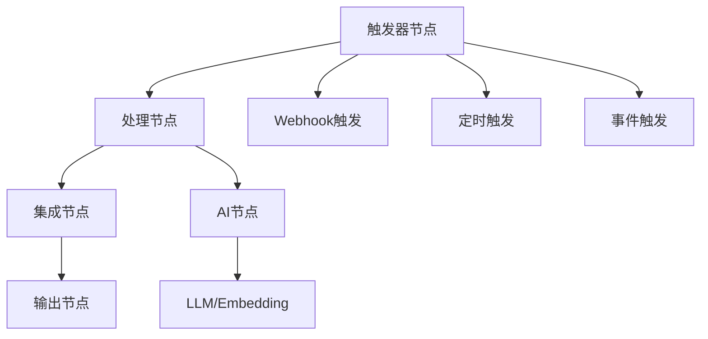
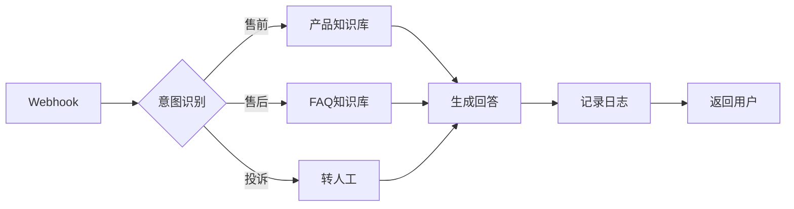

# n8n平台深度指南

> [!abstract] 摘要
> n8n是一款强大的开源工作流自动化平台，支持可视化拖拽构建工作流，内置400+应用集成，深度支持AI能力。本文档全面介绍n8n平台的核心功能、工作流编辑器、AI节点及实战技巧。

## 核心关键词速览

| 关键词 | 说明 | 关键词 | 说明 |
|--------|------|--------|------|
| 工作流编辑器 | 可视化拖拽构建 | AI节点 | 内置LLM/Prompt节点 |
| 400+集成 | 第三方应用连接 | 自托管 | 私有化部署选项 |
| 代码节点 | JavaScript/Python执行 | Webhook | 事件触发接口 |
| 错误处理 | 自动化容错机制 | 凭证管理 | 安全存储敏感信息 |
| 子工作流 | 模块化复用 | 执行历史 | 调试与回溯 |
| n8n表达式 | 数据转换语言 | 版本控制 | 工作流版本管理 |

## 1. n8n平台概述

### 1.1 平台定位与优势

n8n（发音为"n-eight-n"）是一款开源的工作流自动化工具，由德国团队开发维护。与Zapier、Make等商业平台相比，n8n的核心优势在于：

- **完全开源**：代码透明，可自托管部署，数据不经过第三方
- **灵活扩展**：支持自定义节点开发，满足个性化需求
- **成本可控**：自托管版本免费，适合企业级应用
- **AI优先**：深度集成大语言模型，支持AI工作流构建

> [!tip] 选型建议
> 个人用户或小型团队可使用n8n.cloud托管版本快速上手；中大型企业建议自托管部署以获得更好的数据控制和成本优化。

### 1.2 核心架构

n8n的架构由以下核心组件构成：



- **触发器层**：Webhook、定时器、事件监听构成工作流入口
- **处理层**：数据转换、条件分支、循环迭代等逻辑控制
- **集成层**：400+应用连接器实现外部系统对接
- **AI层**：LLM节点、Prompt节点、Memory节点提供AI能力

## 2. 工作流编辑器详解

### 2.1 界面布局

n8n的工作流编辑器采用直观的画布式设计：

```
┌─────────────────────────────────────────────────────────┐
│  [执行历史] [模板] [变量] [凭证]          [保存] [执行]  │
├─────────────────────────────────────────────────────────┤
│                                                         │
│   ┌──────────┐    ┌──────────┐    ┌──────────┐         │
│   │  触发器   │───▶│  处理1   │───▶│  输出节点 │         │
│   └──────────┘    └──────────┘    └──────────┘         │
│                          │                               │
│                          ▼                               │
│                   ┌──────────┐                          │
│                   │  处理2   │                          │
│                   └──────────┘                          │
│                                                         │
├─────────────────────────────────────────────────────────┤
│  [节点面板]                                              │
│  ▼ 触发器                                                │
│    Webhook / 定时 / 事件                                │
│  ▼ 应用节点                                              │
│    HTTP请求 / 代码 / AI / 数据库                        │
└─────────────────────────────────────────────────────────┘
```

### 2.2 节点类型体系

n8n的节点分为以下几大类：

| 节点类别 | 代表节点 | 用途 |
|----------|----------|------|
| 触发器 | Webhook、定时器、轮询 | 启动工作流 |
| 通信 | Slack、Email、Telegram | 消息通知 |
| 数据 | HTTP请求、代码、转换 | 数据处理 |
| AI | LLM、Prompt、Memory | AI能力 |
| 数据库 | MySQL、MongoDB、Redis | 数据持久化 |
| 工具 | OAuth2 API、凭证 | 认证与安全 |

### 2.3 节点连接与数据流

n8n采用节点连线的方式传递数据，每个节点的输出成为下一个节点的输入：

```javascript
// n8n表达式示例：获取上一个节点的输出
{{ $json.message }}
{{ $node["节点名称"].json["字段名"] }}
{{ $inputs.first().json.array[0] }}

// 复杂表达式
{{ new Date().toISOString().split('T')[0] }}
{{ $json.price * (1 + $json.taxRate / 100) }}
```

> [!example] 数据转换实战
> 假设API返回的用户数据结构为：
> ```json
> { "user": { "name": "张三", "age": 28 } }
> ```
> 在下一节点中使用表达式获取嵌套字段：
> ```
> {{ $json.user.name }}
> // 输出：张三
> ```

## 3. AI节点详解

### 3.1 LLM Chain节点

LLM Chain是n8n中连接AI模型的核心节点：

```yaml
配置参数:
  model: gpt-4  # 模型选择
  messages:
    - role: system
      content: "你是一个专业的翻译助手"
    - role: user
      content: "{{ $json.text }}"
  temperature: 0.3  # 创造性控制
  maxTokens: 500    # 最大生成长度
```

### 3.2 Prompt节点

Prompt节点用于构建结构化提示词：

```markdown
## Prompt模板语法

基础变量：{{ $json.input }}
条件判断：{{ $json.lang === 'en' ? '翻译为英文' : '翻译为中文' }}
循环迭代：{{ $json.items.map(i => i.name).join(', ') }}
```

### 3.3 Memory节点

Memory节点实现对话上下文管理：

| Memory类型 | 适用场景 | 配置要点 |
|------------|----------|----------|
| 窗口Buffer | 短期对话 | 设置窗口大小 |
| 向量存储 | 长期记忆 | 选择向量数据库 |
| 缓冲+向量 | 综合场景 | 两层结合使用 |

## 4. 实战案例：构建AI客服工作流

### 4.1 需求分析

构建一个智能客服系统，具备以下功能：
- 接收用户通过Webhook发送的咨询
- 判断意图（售前/售后/投诉）
- 调用不同知识库回答
- 支持转人工机制
- 记录对话日志

### 4.2 工作流设计



### 4.3 完整配置

**步骤1：Webhook触发器**
```yaml
method: POST
path: /customer-service
authentication: none  # 生产环境应启用JWT
```

**步骤2：意图识别LLM调用**
```yaml
model: gpt-4
prompt: |
  分析用户消息的意图类别：
  - 售前咨询：产品功能、价格、购买
  - 售后支持：使用问题、退换货、维修
  - 投诉建议：不满反馈、改进建议
  
  用户消息：{{ $json.message }}
  
  只返回意图类别名称（售前/售后/投诉之一）
```

**步骤3：知识库查询**
```yaml
# 使用向量搜索
vectorStore: Pinecone
collection: knowledge_base
query: "{{ $json.message }}"
topK: 3
```

**步骤4：回答生成**
```yaml
model: gpt-4
prompt: |
  基于以下知识回答用户问题：
  
  知识内容：
  {{ $json.retrieved_docs }}
  
  用户问题：{{ $json.message }}
  
  要求：
  1. 回答简洁专业
  2. 如知识库无相关内容，回复"暂时无法回答您的问题"
  3. 涉及转人工时，提示用户输入"转人工"
```

> [!warning] 注意事项
> 1. 生产环境务必启用Webhook认证
> 2. 建议添加速率限制防止滥用
> 3. 对话日志需符合数据合规要求

## 5. 部署与运维

### 5.1 Docker部署

```yaml
# docker-compose.yml
version: '3'
services:
  n8n:
    image: n8nio/n8n
    ports:
      - "5678:5678"
    environment:
      - N8N_BASIC_AUTH_ACTIVE=true
      - N8N_BASIC_AUTH_USER=admin
      - N8N_BASIC_AUTH_PASSWORD=${N8N_PASSWORD}
      - N8N_HOST=${DOMAIN}
      - N8N_PROTOCOL=https
      - WEBHOOK_URL=https://${DOMAIN}/
    volumes:
      - ./data:/home/node/.n8n
    restart: unless-stopped
```

### 5.2 环境变量配置

| 变量名 | 说明 | 示例 |
|--------|------|------|
| N8N_BASIC_AUTH_ACTIVE | 启用基础认证 | true |
| N8N_HOST | 访问域名 | n8n.example.com |
| N8N_PROTOCOL | 协议类型 | https |
| WEBHOOK_URL | Webhook基础URL | https://n8n.example.com |
| EXECUTIONS_DATA_SAVE_ON_ERROR | 错误时保存数据 | all |
| EXECUTIONS_DATA_SAVE_ON_SUCCESS | 成功时保存数据 | all |

### 5.3 高可用配置

```yaml
# 使用PostgreSQL作为主数据库
services:
  n8n:
    depends_on:
      - postgres
    environment:
      - DB_TYPE=postgresdb
      - DB_POSTGRESDB_HOST=postgres
      - DB_POSTGRESDB_PORT=5432
      - DB_POSTGRESDB_DATABASE=n8n
      - DB_POSTGRESDB_USER=n8n
      - DB_POSTGRESDB_PASS=${DB_PASSWORD}
  
  postgres:
    image: postgres:15
    environment:
      - POSTGRES_DB=n8n
      - POSTGRES_USER=n8n
      - POSTGRES_PASSWORD=${DB_PASSWORD}
    volumes:
      - postgres_data:/var/lib/postgresql/data
```

## 6. 性能优化

### 6.1 执行效率提升

1. **异步并行**：使用SplitInBatches节点并行处理
2. **缓存复用**：重复调用的API结果缓存
3. **分页处理**：大数据量分批处理避免超时
4. **精简数据**：只传递必要字段减少传输

### 6.2 监控告警

```yaml
# 错误监控工作流
触发: 定时器 (每小时)
处理:
  1. 查询执行历史
  2. 筛选失败记录
  3. 发送告警通知
  4. 记录到监控数据库
```

## 7. 相关资源

- [[n8n与LLM集成]] - n8n的AI能力详解
- [[工作流设计模式]] - 通用工作流设计原则
- [[AI应用API化部署]] - 工作流API化部署方案
- [[AI应用生产部署]] - 企业级部署最佳实践

---

*本文档由归愚知识系统自动生成 last updated: 2026-04-18*
