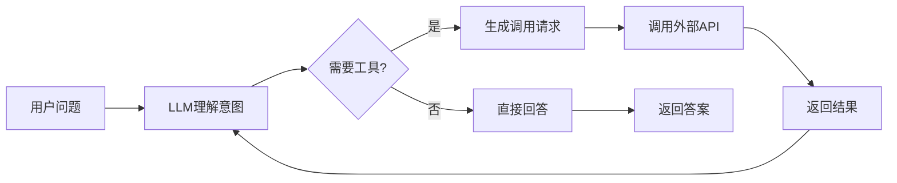

# Function Calling与工具调用

> [!abstract] 摘要
> Function Calling（函数调用）是现代AI智能体的核心能力之一，它使大语言模型能够根据用户意图自动调用外部工具和API。本文档详细对比OpenAI、Claude、Gemini等主流模型的函数调用规范，并提供完整的工具定义、执行流程和实战代码示例。

## 核心关键词速览

| 关键词 | 说明 | 关键词 | 说明 |
|--------|------|--------|------|
| Function Call | 函数调用接口 | Tool Definition | 工具定义格式 |
| JSON Schema | 参数描述规范 | 执行流程 | Request-Response |
| OpenAI规范 | GPT函数调用 | Claude规范 | Anthropic工具 |
| Gemini规范 | Google工具调用 | 类型安全 | Type Safety |

## 1. Function Calling概述

### 1.1 什么是Function Calling

Function Calling是LLM与外部世界交互的桥梁，它允许模型：



| 核心能力 | 说明 |
|----------|------|
| 实时信息 | 获取最新新闻、股价、天气等 |
| 外部操作 | 发送邮件、操作数据库、控制设备 |
| 精确计算 | 执行复杂数学运算 |
| 知识检索 | 查询企业知识库、数据库 |
| 多工具协调 | 串联多个工具完成复杂任务 |

### 1.2 主流模型对比

| 模型 | 规范名称 | 特点 | 文档 |
|------|----------|------|------|
| GPT-4o | function_call | 结构化强、广泛支持 | OpenAI官方 |
| Claude 3.5 | tool_use | 简洁清晰、安全优先 | Anthropic官方 |
| Gemini 1.5 | function_declarations | 多模态集成 | Google官方 |

## 2. OpenAI Function Calling

### 2.1 工具定义格式

```yaml
# OpenAI tools格式
tools:
  - type: function
    function:
      name: "get_weather"           # 函数名称（必须唯一）
      description: "获取城市天气信息"  # 描述模型如何使用
      parameters:                   # 参数Schema
        type: object
        properties:
          city:
            type: string
            description: "城市名称，如北京、上海"
          unit:
            type: string
            enum: ["celsius", "fahrenheit"]
            default: "celsius"
            description: "温度单位"
        required: ["city"]
        additionalProperties: false
```

### 2.2 完整调用示例

```python
from openai import OpenAI
import json

client = OpenAI(api_key="your-api-key")

# 1. 定义工具
tools = [
    {
        "type": "function",
        "function": {
            "name": "get_weather",
            "description": "获取指定城市的天气信息",
            "parameters": {
                "type": "object",
                "properties": {
                    "city": {
                        "type": "string",
                        "description": "城市名称"
                    },
                    "unit": {
                        "type": "string",
                        "enum": ["celsius", "fahrenheit"],
                        "default": "celsius"
                    }
                },
                "required": ["city"]
            }
        }
    },
    {
        "type": "function", 
        "function": {
            "name": "send_email",
            "description": "发送电子邮件",
            "parameters": {
                "type": "object",
                "properties": {
                    "to": {"type": "string", "description": "收件人邮箱"},
                    "subject": {"type": "string", "description": "邮件主题"},
                    "body": {"type": "string", "description": "邮件正文"}
                },
                "required": ["to", "subject", "body"]
            }
        }
    }
]

# 2. 构建消息
messages = [
    {"role": "system", "content": "你是一个智能助手，可以调用工具来完成任务。"},
    {"role": "user", "content": "帮我查一下北京今天的天气怎么样？"}
]

# 3. 调用API
response = client.chat.completions.create(
    model="gpt-4o",
    messages=messages,
    tools=tools,
    tool_choice="auto"  # auto让模型决定，或指定"none"/"get_weather"
)

# 4. 处理响应
assistant_message = response.choices[0].message

if assistant_message.tool_calls:
    # 模型请求调用工具
    for tool_call in assistant_message.tool_calls:
        function_name = tool_call.function.name
        arguments = json.loads(tool_call.function.arguments)
        
        print(f"需要调用函数: {function_name}")
        print(f"参数: {arguments}")
        
        # 执行工具
        if function_name == "get_weather":
            result = execute_weather_api(arguments['city'], arguments.get('unit', 'celsius'))
        
        # 添加工具结果到消息
        messages.append({
            "role": "tool",
            "tool_call_id": tool_call.id,
            "content": json.dumps(result)
        })

# 5. 二次调用获取最终回答
final_response = client.chat.completions.create(
    model="gpt-4o",
    messages=messages,
    tools=tools
)

print(final_response.choices[0].message.content)
```

### 2.3 强制调用指定工具

```python
# 强制使用特定工具
response = client.chat.completions.create(
    model="gpt-4o",
    messages=messages,
    tools=tools,
    tool_choice={
        "type": "function",
        "function": {"name": "get_weather"}
    }
)
```

> [!warning] 注意事项
> - `tool_choice="auto"` 由模型决定是否调用工具
> - `tool_choice="none"` 禁止调用工具
> - 强制指定时，模型会直接调用指定函数

## 3. Claude Function Calling

### 3.1 Anthropic Tools格式

```yaml
# Claude tools格式（更简洁）
tools:
  - name: "get_weather"
    description: "获取城市天气信息"
    input_schema:
      type: object
      properties:
        city:
          type: string
          description: "城市名称"
        unit:
          type: string
          enum: ["celsius", "fahrenheit"]
          default: "celsius"
      required: ["city"]
```

### 3.2 Claude 3.5完整示例

```python
from anthropic import Anthropic

client = Anthropic(api_key="your-api-key")

# 定义工具
tools = [
    {
        "name": "get_weather",
        "description": "获取城市天气信息",
        "input_schema": {
            "type": "object",
            "properties": {
                "city": {
                    "type": "string",
                    "description": "城市名称"
                },
                "unit": {
                    "type": "string",
                    "enum": ["celsius", "fahrenheit"],
                    "description": "温度单位"
                }
            },
            "required": ["city"]
        }
    },
    {
        "name": "calculate",
        "description": "执行数学计算",
        "input_schema": {
            "type": "object",
            "properties": {
                "expression": {
                    "type": "string",
                    "description": "数学表达式，如 2+3*4"
                }
            },
            "required": ["expression"]
        }
    }
]

# 构建消息（注意Claude使用不同格式）
messages = [
    {
        "role": "user",
        "content": "北京今天多少度？帮我算一下20度转换成华氏度是多少。"
    }
]

# 调用API
response = client.messages.create(
    model="claude-3-5-sonnet-20241022",
    max_tokens=1024,
    tools=tools,
    messages=messages
)

# 处理响应
for content in response.content:
    if content.type == "tool_use":
        tool_name = content.name
        tool_input = content.input
        
        print(f"调用工具: {tool_name}")
        print(f"参数: {tool_input}")
        
        # 执行工具并获取结果
        if tool_name == "get_weather":
            result = execute_weather_api(tool_input['city'])
        elif tool_name == "calculate":
            result = eval(tool_input['expression'])
        
        # 添加工具结果
        messages.append({
            "role": "assistant",
            "content": response.content
        })
        messages.append({
            "role": "user",
            "content": [{
                "type": "tool_result",
                "tool_use_id": content.id,
                "content": str(result)
            }]
        })

# 二次调用获取最终回答
final_response = client.messages.create(
    model="claude-3-5-sonnet-20241022",
    max_tokens=1024,
    tools=tools,
    messages=messages
)

print(final_response.content[0].text)
```

### 3.3 Claude的特殊机制

```python
# Claude的thinking模式（扩展思考）
response = client.messages.create(
    model="claude-3-5-sonnet-20241022",
    max_tokens=8192,
    thinking={
        "type": "enabled",
        "budget_tokens": 1024  # 思考预算
    },
    tools=tools,
    messages=messages
)
```

> [!tip] Claude优势
> - 更简洁的工具定义格式
> - 支持thinking扩展思考
> - 对复杂推理任务更友好
> - 内置内容安全过滤

## 4. Gemini Function Calling

### 4.1 Gemini工具格式

```yaml
# Gemini function declarations
tools:
  - function_declarations:
      - name: "get_weather"
        description: "获取城市天气信息"
        parameters:
          type: "OBJECT"
          properties:
            city:
              type: "STRING"
              description: "城市名称"
            unit:
              type: "STRING"
              enum: ["celsius", "fahrenheit"]
          required: ["city"]
```

### 4.2 Gemini 1.5完整示例

```python
import google.generativeai as genai

genai.configure(api_key="your-api-key")

model = genai.GenerativeModel(
    model_name="gemini-1.5-pro",
    tools=[
        {
            "function_declarations": [
                {
                    "name": "get_weather",
                    "description": "获取城市天气信息",
                    "parameters": {
                        "type": "object",
                        "properties": {
                            "city": {
                                "type": "string",
                                "description": "城市名称"
                            },
                            "unit": {
                                "type": "string",
                                "enum": ["celsius", "fahrenheit"]
                            }
                        },
                        "required": ["city"]
                    }
                }
            ]
        }
    ]
)

# 聊天会话
chat = model.start_chat()

response = chat.send_message("北京今天天气如何？")

# 处理函数调用
for candidate in response.candidates:
    for part in candidate.content.parts:
        if part.function_call:
            func = part.function_call
            print(f"调用函数: {func.name}")
            print(f"参数: {dict(func.args)}")
            
            # 执行函数
            if func.name == "get_weather":
                result = execute_weather_api(
                    func.args['city'],
                    func.args.get('unit', 'celsius')
                )
            
            # 发送函数结果
            response = chat.send_message(
                Part(
                    function_response=FunctionResponse(
                        name=func.name,
                        response={"result": result}
                    )
                )
            )

print(response.text)
```

## 5. 工具执行框架

### 5.1 统一工具注册表

```python
from typing import Dict, Callable, Any
from dataclasses import dataclass
import inspect

@dataclass
class Tool:
    """工具定义"""
    name: str
    description: str
    func: Callable
    parameters: Dict[str, Any]
    is_async: bool = False

class ToolRegistry:
    """工具注册表"""
    
    def __init__(self):
        self._tools: Dict[str, Tool] = {}
    
    def register(
        self,
        name: str,
        description: str,
        parameters: Dict = None
    ):
        """装饰器注册工具"""
        def decorator(func: Callable):
            sig = inspect.signature(func)
            params = parameters or self._extract_params(sig)
            
            self._tools[name] = Tool(
                name=name,
                description=description,
                func=func,
                parameters=params,
                is_async=inspect.iscoroutinefunction(func)
            )
            return func
        return decorator
    
    def _extract_params(self, sig: inspect.Signature) -> Dict:
        """从函数签名提取参数定义"""
        params = {
            "type": "object",
            "properties": {},
            "required": []
        }
        
        for name, param in sig.parameters.items():
            param_type = "string"
            if param.annotation == int:
                param_type = "integer"
            elif param.annotation == float:
                param_type = "number"
            elif param.annotation == bool:
                param_type = "boolean"
            
            params["properties"][name] = {"type": param_type}
            
            if param.default == inspect.Parameter.empty:
                params["required"].append(name)
        
        return params
    
    def get_openai_format(self) -> list:
        """转换为OpenAI工具格式"""
        return [
            {
                "type": "function",
                "function": {
                    "name": tool.name,
                    "description": tool.description,
                    "parameters": tool.parameters
                }
            }
            for tool in self._tools.values()
        ]
    
    async def execute(self, name: str, arguments: Dict) -> Any:
        """执行工具"""
        if name not in self._tools:
            raise ValueError(f"Unknown tool: {name}")
        
        tool = self._tools[name]
        
        if tool.is_async:
            return await tool.func(**arguments)
        else:
            return tool.func(**arguments)

# 使用示例
registry = ToolRegistry()

@registry.register(
    name="get_weather",
    description="获取城市天气信息"
)
def get_weather(city: str, unit: str = "celsius") -> dict:
    """获取天气"""
    # 实际API调用
    return {"city": city, "temperature": 25, "unit": unit}

@registry.register(
    name="search_web",
    description="搜索网络信息"
)
async def search_web(query: str, limit: int = 5) -> list:
    """网络搜索"""
    # 实际搜索逻辑
    return [{"title": "result", "url": "..."}]

# 获取所有工具
tools = registry.get_openai_format()
```

### 5.2 Agent执行循环

```python
class ToolUsingAgent:
    """工具调用Agent"""
    
    def __init__(self, registry: ToolRegistry, model: str = "gpt-4o"):
        self.registry = registry
        self.model = model
        self.client = OpenAI()
    
    async def chat(self, user_message: str, max_turns: int = 10) -> str:
        """对话循环"""
        messages = [
            {"role": "system", "content": "你是一个智能助手，可以使用工具完成任务。"}
        ]
        
        for turn in range(max_turns):
            # 添加用户消息
            messages.append({"role": "user", "content": user_message})
            
            # 调用模型
            response = self.client.chat.completions.create(
                model=self.model,
                messages=messages,
                tools=self.registry.get_openai_format(),
                tool_choice="auto"
            )
            
            assistant_message = response.choices[0].message
            messages.append(assistant_message)
            
            # 检查是否有工具调用
            if not assistant_message.tool_calls:
                # 没有工具调用，返回最终回答
                return assistant_message.content
            
            # 处理工具调用
            for tool_call in assistant_message.tool_calls:
                try:
                    result = await self.registry.execute(
                        tool_call.function.name,
                        json.loads(tool_call.function.arguments)
                    )
                    
                    messages.append({
                        "role": "tool",
                        "tool_call_id": tool_call.id,
                        "content": json.dumps(result)
                    })
                except Exception as e:
                    messages.append({
                        "role": "tool",
                        "tool_call_id": tool_call.id,
                        "content": f"Error: {str(e)}"
                    })
        
        return "对话达到最大轮次限制"
```

## 6. 最佳实践

### 6.1 工具设计原则

> [!tip] 工具设计五原则
> 1. **单一职责**：每个工具只做一件事
> 2. **命名清晰**：函数名需表达功能，如 `get_order_status`
> 3. **描述准确**：description帮助模型理解何时调用
> 4. **参数精简**：只暴露必要参数，避免过度设计
> 5. **错误处理**：返回结构化错误信息，便于模型理解

### 6.2 参数设计建议

```yaml
# 好的参数设计
parameters:
  city:
    type: string
    description: "城市名称，支持中英文，如'北京'、'Shanghai'"
  
  date:
    type: string
    format: date
    description: "日期，格式YYYY-MM-DD，如'2024-01-15'"
  
  amount:
    type: number
    minimum: 0
    maximum: 1000000
    description: "金额，单位元"

# 不好的参数设计
parameters:
  data:  # 过于宽泛
    type: object
    description: "数据"
```

### 6.3 安全考虑

```python
class SecureToolRegistry(ToolRegistry):
    """安全工具注册表"""
    
    def __init__(self):
        super().__init__()
        self._security_policy = SecurityPolicy()
    
    async def execute(self, name: str, arguments: Dict) -> Any:
        """带安全检查的执行"""
        # 权限检查
        if not self._security_policy.can_execute(name):
            raise PermissionError(f"Tool {name} not allowed")
        
        # 参数校验
        self._validate_arguments(name, arguments)
        
        # 敏感操作审计
        await self._audit_tool_call(name, arguments)
        
        return await super().execute(name, arguments)
    
    def _validate_arguments(self, name: str, arguments: Dict):
        """参数安全校验"""
        # SQL注入检测
        for value in arguments.values():
            if isinstance(value, str) and self._contains_sql_injection(value):
                raise ValueError("Invalid parameter detected")
    
    def _contains_sql_injection(self, value: str) -> bool:
        """检测SQL注入"""
        dangerous = ["'", '"', ';', '--', 'DROP', 'DELETE']
        return any(d in value.upper() for d in dangerous)
```

## 7. 相关资源

- [[多Agent系统设计]] - 多智能体协作架构
- [[n8n与LLM集成]] - n8n工具调用配置
- [[扣子Bot开发]] - Coze插件开发
- [[AI平台插件开发]] - 插件开发指南

---

*本文档由归愚知识系统自动生成 last updated: 2026-04-18*
