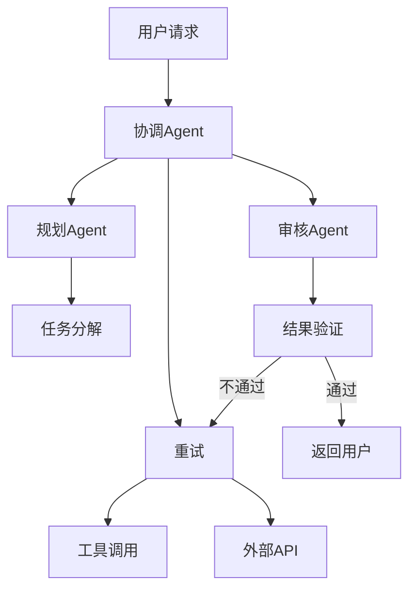
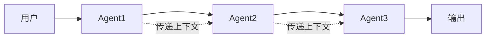
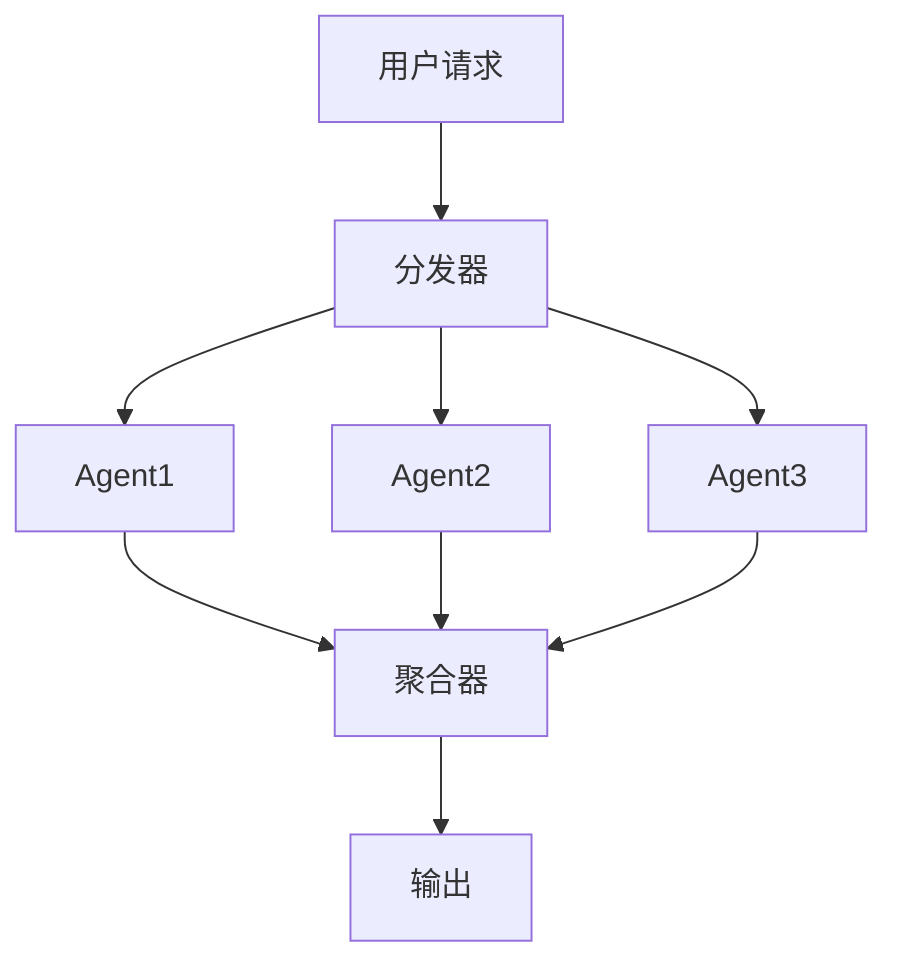
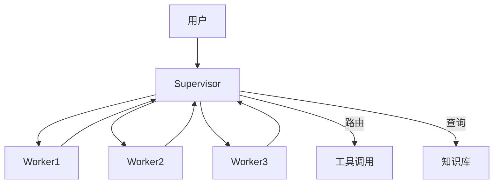
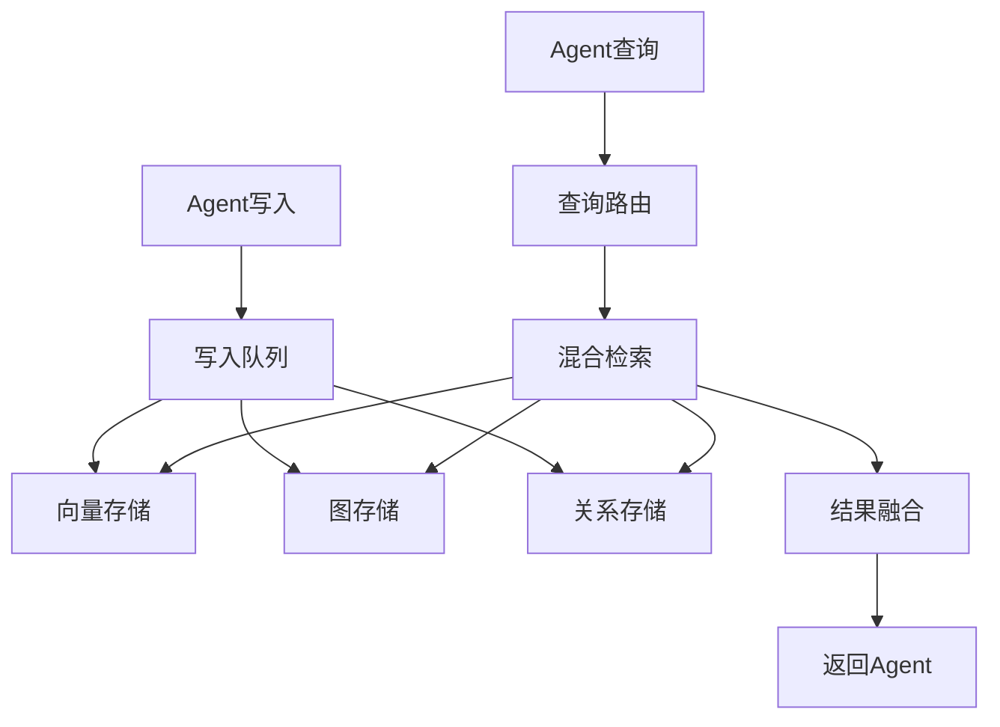

# 多Agent系统设计

> [!abstract] 摘要
> 本文档深入探讨多智能体系统的架构设计与实现，包括通信协议定义、协作模式选择、共享知识库构建以及冲突解决机制。通过详细的架构图、代码示例和实战案例，帮助读者构建高效、可靠的多Agent系统。

## 核心关键词速览

| 关键词 | 说明 | 关键词 | 说明 |
|--------|------|--------|------|
| Agent通信 | 消息传递机制 | 协作模式 | 串行/并行/分层 |
| 共享知识库 | 统一信息来源 | 冲突解决 | 优先级/投票/协商 |
| 任务分解 | Task Decomposition | 状态同步 | 一致性保证 |
| 监督Agent | Supervisor Agent | 专家Agent | Specialized Agent |
| 消息队列 | Message Queue | 事件驱动 | Event-Driven |

## 1. 多Agent系统概述

### 1.1 为什么要用多Agent

单Agent系统面临的核心挑战：

| 问题 | 说明 | 多Agent解决方案 |
|------|------|-----------------|
| 能力边界 | 单模型能力有限 | 分工给不同专长Agent |
| 上下文限制 | Token窗口有限 | 各Agent维护独立上下文 |
| 单点故障 | 一个Agent挂了全挂 | 冗余+容错设计 |
| 扩展性差 | 新能力需重训 | 添加新Agent即可 |
| 维护困难 | 代码膨胀 | 模块化、职责单一 |

### 1.2 典型应用场景



| 场景 | Agent配置 | 协作模式 |
|------|----------|----------|
| 智能客服 | 接待+知识库+订单+投诉 | 分层协作 |
| 代码助手 | 需求分析+代码生成+测试+审查 | 流水线 |
| 研究助手 | 搜索+阅读+整理+写作 | 串行协作 |
| 自动化办公 | 日程+邮件+文档+审批 | 事件驱动 |

## 2. 通信协议设计

### 2.1 消息格式定义

```yaml
# 消息协议格式
MessageProtocol:
  message_id: "uuid-v4"           # 全局唯一消息ID
  timestamp: "ISO-8601"            # 时间戳
  sender:                          # 发送方
    agent_id: "string"
    agent_type: "string"
    capabilities: ["capability_list"]
  
  receiver:                        # 接收方
    agent_id: "string"             # 空表示广播
    agent_type: "string"           # 类型匹配
  
  message_type:                    # 消息类型
    enum: ["request", "response", "event", "broadcast"]
  
  content:                         # 消息内容
    action: "string"               # 操作名称
    params: {}                     # 参数
    context: {}                     # 上下文
  
  metadata:                        # 元信息
    priority: 1-10                 # 优先级
    ttl: 300                       # 生存时间(秒)
    retry_count: 0                 # 重试次数
```

### 2.2 消息类型详解

```python
from enum import Enum
from typing import Optional, Dict, Any, List
from dataclasses import dataclass, field
from datetime import datetime
import uuid

class MessageType(Enum):
    """消息类型枚举"""
    REQUEST = "request"           # 请求消息
    RESPONSE = "response"         # 响应消息
    EVENT = "event"               # 事件通知
    BROADCAST = "broadcast"       # 广播消息
    HEARTBEAT = "heartbeat"       # 心跳检测

class MessagePriority(Enum):
    """消息优先级"""
    CRITICAL = 1   # 关键任务
    HIGH = 3       # 高优先级
    NORMAL = 5     # 普通
    LOW = 7        # 低优先级
    BACKGROUND = 9 # 后台任务

@dataclass
class AgentMessage:
    """Agent通信消息"""
    message_id: str = field(default_factory=lambda: str(uuid.uuid4()))
    timestamp: str = field(default_factory=lambda: datetime.now().isoformat())
    
    sender: Dict[str, Any] = field(default_factory=dict)
    receiver: Dict[str, Any] = field(default_factory=dict)
    
    message_type: MessageType = MessageType.REQUEST
    content: Dict[str, Any] = field(default_factory=dict)
    metadata: Dict[str, Any] = field(default_factory=dict)
    
    def __post_init__(self):
        if 'priority' not in self.metadata:
            self.metadata['priority'] = MessagePriority.NORMAL.value
    
    def to_json(self) -> str:
        """序列化为JSON"""
        import json
        return json.dumps({
            'message_id': self.message_id,
            'timestamp': self.timestamp,
            'sender': self.sender,
            'receiver': self.receiver,
            'message_type': self.message_type.value,
            'content': self.content,
            'metadata': self.metadata
        }, ensure_ascii=False)
```

### 2.3 通信中间件实现

```python
import asyncio
from typing import Callable, Dict, Set
from collections import defaultdict
import logging

logger = logging.getLogger(__name__)

class MessageBroker:
    """消息代理 - 实现Agent间通信"""
    
    def __init__(self):
        self.subscribers: Dict[str, Set[Callable]] = defaultdict(set)
        self.message_queue: asyncio.Queue = asyncio.Queue()
        self.message_history: List[AgentMessage] = []
        self.max_history = 1000
    
    async def publish(self, message: AgentMessage) -> None:
        """发布消息"""
        # 记录历史
        self.message_history.append(message)
        if len(self.message_history) > self.max_history:
            self.message_history.pop(0)
        
        # 根据接收者类型分发
        if message.receiver.get('agent_id'):
            # 点对点消息
            await self._deliver_to_agent(message)
        elif message.receiver.get('agent_type'):
            # 类型广播
            await self._broadcast_to_type(message)
        else:
            # 全局广播
            await self._broadcast_all(message)
    
    async def subscribe(
        self, 
        agent_id: str, 
        callback: Callable[[AgentMessage], None]
    ) -> None:
        """订阅消息"""
        self.subscribers[agent_id].add(callback)
    
    async def request(
        self,
        sender_id: str,
        receiver_id: str,
        action: str,
        params: Dict[str, Any],
        timeout: float = 30.0
    ) -> AgentMessage:
        """发送请求并等待响应"""
        request_msg = AgentMessage(
            sender={'agent_id': sender_id},
            receiver={'agent_id': receiver_id},
            message_type=MessageType.REQUEST,
            content={'action': action, 'params': params}
        )
        
        response_future = asyncio.Future()
        
        async def response_handler(msg: AgentMessage):
            if (msg.message_type == MessageType.RESPONSE and 
                msg.content.get('request_id') == request_msg.message_id):
                response_future.set_result(msg)
        
        await self.subscribe(sender_id, response_handler)
        await self.publish(request_msg)
        
        try:
            return await asyncio.wait_for(response_future, timeout)
        except asyncio.TimeoutError:
            raise TimeoutError(f"Request to {receiver_id} timed out")
```

## 3. 协作模式详解

### 3.1 串行协作模式



适用场景：任务有严格先后依赖

```python
class SequentialCollaboration:
    """串行协作模式"""
    
    async def execute(
        self, 
        agents: List[BaseAgent],
        initial_input: Any
    ) -> Any:
        context = {'input': initial_input}
        
        for agent in agents:
            logger.info(f"Executing {agent.name}")
            result = await agent.process(context)
            context[agent.name] = result
            
            if result.get('should_stop'):
                logger.info(f"Early stop at {agent.name}")
                break
        
        return context
    
# 使用示例
async def document_generation_pipeline():
    """文档生成流水线"""
    agents = [
        ResearchAgent(),      # 1. 研究收集
        OutlineAgent(),      # 2. 大纲生成
        DraftAgent(),        # 3. 初稿写作
        ReviewAgent(),       # 4. 审核修订
        FormatAgent()        # 5. 格式整理
    ]
    
    pipeline = SequentialCollaboration()
    result = await pipeline.execute(agents, user_topic)
    
    return result['FormatAgent']['final_output']
```

### 3.2 并行协作模式



适用场景：任务可分解为独立子任务

```python
class ParallelCollaboration:
    """并行协作模式"""
    
    async def execute(
        self,
        agents: List[BaseAgent],
        initial_input: Any,
        aggregator: Callable = None
    ) -> Any:
        # 创建任务
        tasks = [agent.process(initial_input) for agent in agents]
        
        # 并行执行
        results = await asyncio.gather(*tasks, return_exceptions=True)
        
        # 处理异常
        successful = [r for r in results if not isinstance(r, Exception)]
        failed = [r for r in results if isinstance(r, Exception)]
        
        if failed:
            logger.warning(f"{len(failed)} agents failed: {failed}")
        
        # 聚合结果
        if aggregator:
            return aggregator(successful)
        
        return successful

# 使用示例
async def multi_perspective_analysis():
    """多视角分析"""
    agents = [
        TechnicalAnalysisAgent(),    # 技术视角
        MarketAnalysisAgent(),      # 市场视角
        RiskAnalysisAgent(),        # 风险视角
        CompetitorAgent()           # 竞争视角
    ]
    
    parallel = ParallelCollaboration()
    
    async def aggregate(results):
        return {
            'technical': results[0],
            'market': results[1],
            'risk': results[2],
            'competitor': results[3],
            'summary': await generate_summary(results)
        }
    
    return await parallel.execute(agents, topic, aggregate)
```

### 3.3 分层协作模式



适用场景：需要智能路由和任务分配

```python
class HierarchicalCollaboration:
    """分层协作模式"""
    
    def __init__(self):
        self.supervisor = SupervisorAgent()
        self.workers: Dict[str, BaseAgent] = {}
        self.router = TaskRouter()
    
    async def execute(self, user_input: str) -> str:
        # Supervisor分析并规划
        plan = await self.supervisor.plan(user_input)
        
        if plan['type'] == 'direct':
            # 直接回答
            return await self.supervisor.execute_direct(plan)
        
        elif plan['type'] == 'multi_step':
            # 多步骤任务
            results = []
            for step in plan['steps']:
                worker = self.router.route(step)
                result = await worker.process(step)
                results.append(result)
                
                # Supervisor审核
                if not await self.supervisor.verify(result):
                    # 重新执行
                    result = await worker.retry(step)
            
            return await self.supervisor.synthesize(results)

class SupervisorAgent:
    """监督Agent"""
    
    async def plan(self, user_input: str) -> Dict[str, Any]:
        """任务规划"""
        response = await self.llm.chat([
            {"role": "system", "content": SUPERVISOR_PROMPT},
            {"role": "user", "content": user_input}
        ])
        
        return json.loads(response)
    
    async def verify(self, result: Dict) -> bool:
        """结果验证"""
        if result.get('confidence', 1.0) < 0.7:
            return False
        return True
```

## 4. 共享知识库设计

### 4.1 知识库架构



### 4.2 知识共享实现

```python
from typing import List, Optional, Dict, Any
import hashlib

class SharedKnowledgeBase:
    """共享知识库"""
    
    def __init__(self):
        self.vector_store = VectorStore()      # 向量存储
        self.graph_store = GraphStore()        # 图存储
        self.metadata_store = MetadataStore()  # 元数据存储
        self.version_control = VersionControl()
    
    async def write(
        self,
        agent_id: str,
        content: str,
        knowledge_type: str,
        metadata: Dict[str, Any]
    ) -> str:
        """写入知识"""
        # 生成知识ID
        knowledge_id = hashlib.sha256(
            f"{agent_id}:{content}:{datetime.now().isoformat()}".encode()
        ).hexdigest()[:16]
        
        # 向量化
        embedding = await self._embed(content)
        
        # 事务写入
        await self.vector_store.add(knowledge_id, embedding)
        await self.graph_store.add_triples(
            self._extract_entities(content)
        )
        await self.metadata_store.save(knowledge_id, {
            'agent_id': agent_id,
            'type': knowledge_type,
            'metadata': metadata,
            'created_at': datetime.now().isoformat(),
            'version': 1
        })
        
        return knowledge_id
    
    async def query(
        self,
        agent_id: str,
        query: str,
        top_k: int = 10,
        filters: Dict = None
    ) -> List[Dict]:
        """查询知识"""
        # 向量检索
        query_embedding = await self._embed(query)
        vector_results = await self.vector_store.search(
            query_embedding, top_k
        )
        
        # 图谱扩展
        related = await self.graph_store.expand(
            [r['id'] for r in vector_results],
            depth=2
        )
        
        # 结果融合与重排
        fused = self._rerank(
            query,
            vector_results + related,
            agent_id
        )
        
        # 过滤
        if filters:
            fused = self._apply_filters(fused, filters)
        
        return fused
    
    async def subscribe(self, agent_id: str) -> AsyncIterator:
        """订阅知识更新"""
        pubsub = await self._create_pubsub(agent_id)
        async for update in pubsub.listen():
            yield update
```

### 4.3 知识一致性协议

```python
class ConsistencyProtocol:
    """一致性协议"""
    
    async def validate_write(
        self,
        agent_id: str,
        knowledge_id: str,
        content: str
    ) -> bool:
        """验证写入权限"""
        # 检查Agent是否有写入权限
        if not await self._has_write_permission(agent_id, knowledge_id):
            return False
        
        # 检查内容冲突
        existing = await self.knowledge_base.get(knowledge_id)
        if existing and existing['version'] > 0:
            # 需要处理冲突
            return await self._resolve_conflict(
                agent_id, existing, content
            )
        
        return True
    
    async def _resolve_conflict(
        self,
        agent_id: str,
        existing: Dict,
        new_content: str
    ) -> bool:
        """冲突解决"""
        # 策略1：时间戳优先
        if existing['updated_at'] > new_content.get('updated_at'):
            return False
        
        # 策略2：Agent优先级
        if (self._get_agent_priority(existing['agent_id']) > 
            self._get_agent_priority(agent_id)):
            return False
        
        # 策略3：合并策略
        merged = self._merge_content(existing['content'], new_content)
        await self.knowledge_base.update(knowledge_id, merged)
        
        return True
```

## 5. 冲突解决机制

### 5.1 冲突类型

| 冲突类型 | 描述 | 解决策略 |
|----------|------|----------|
| 资源冲突 | 多Agent争用同一资源 | 锁机制/优先级 |
| 决策冲突 | 不同Agent给出不同建议 | 投票/仲裁 |
| 状态冲突 | 并发修改导致状态不一致 | 乐观锁/版本控制 |
| 知识冲突 | 知识库中存在矛盾信息 | 置信度评估 |

### 5.2 冲突解决实现

```python
from enum import Enum
from typing import List, Optional

class ConflictResolutionStrategy(Enum):
    PRIORITY = "priority"           # 优先级策略
    VOTING = "voting"               # 投票策略
    ARBITRATION = "arbitration"      # 仲裁策略
    MERGE = "merge"                 # 合并策略
    TIMESTAMP = "timestamp"         # 时间戳策略

class ConflictResolver:
    """冲突解决器"""
    
    def __init__(self):
        self.strategies = {
            ConflictResolutionStrategy.PRIORITY: self._priority_resolve,
            ConflictResolutionStrategy.VOTING: self._voting_resolve,
            ConflictResolutionStrategy.ARBITRATION: self._arbitration_resolve,
        }
    
    async def resolve(
        self,
        conflict: Dict,
        strategy: ConflictResolutionStrategy
    ) -> Any:
        """解决冲突"""
        return await self.strategies[strategy](conflict)
    
    async def _priority_resolve(self, conflict: Dict) -> Any:
        """优先级策略"""
        candidates = conflict['candidates']
        # 按Agent优先级排序
        sorted_candidates = sorted(
            candidates,
            key=lambda x: self._get_agent_priority(x['agent_id']),
            reverse=True
        )
        return sorted_candidates[0]['result']
    
    async def _voting_resolve(self, conflict: Dict) -> Any:
        """投票策略"""
        votes = defaultdict(int)
        for candidate in conflict['candidates']:
            votes[candidate['result']] += 1
        
        return max(votes.items(), key=lambda x: x[1])[0]
    
    async def _arbitration_resolve(self, conflict: Dict) -> Any:
        """仲裁策略 - 由监督Agent决定"""
        arbitrator = conflict.get('arbitrator')
        return await arbitrator.judge(conflict)
```

## 6. 完整实战案例

### 6.1 需求：智能研究助手

```
系统目标：
- 接收研究主题
- 自动完成信息收集、分析、报告生成
- 支持多角度分析

Agent配置：
1. 协调Agent：任务分解与调度
2. 搜索Agent：多源信息收集
3. 分析Agent：数据处理与分析
4. 写作Agent：报告撰写
5. 审核Agent：质量把控
```

### 6.2 系统实现

```python
class ResearchAssistantSystem:
    """研究助手系统"""
    
    def __init__(self):
        self.broker = MessageBroker()
        self.knowledge_base = SharedKnowledgeBase()
        
        # 初始化Agent
        self.coordinator = CoordinatorAgent(
            broker=self.broker,
            knowledge_base=self.knowledge_base
        )
        self.search_agent = SearchAgent(
            broker=self.broker,
            knowledge_base=self.knowledge_base
        )
        self.analysis_agent = AnalysisAgent(
            broker=self.broker,
            knowledge_base=self.knowledge_base
        )
        self.writer_agent = WriterAgent(
            broker=self.broker,
            knowledge_base=self.knowledge_base
        )
        self.reviewer_agent = ReviewerAgent(
            broker=self.broker,
            knowledge_base=self.knowledge_base
        )
        
        # 注册Agent
        self.agents = {
            'coordinator': self.coordinator,
            'search': self.search_agent,
            'analysis': self.analysis_agent,
            'writer': self.writer_agent,
            'reviewer': self.reviewer_agent
        }
    
    async def research(self, topic: str) -> str:
        """执行研究任务"""
        # 1. 协调Agent规划任务
        plan = await self.coordinator.plan(topic)
        
        # 2. 并行执行搜索与分析
        search_task = self.search_agent.search(plan['search_queries'])
        analysis_task = self.analysis_agent.analyze(plan['analysis_framework'])
        
        search_results, analysis_results = await asyncio.gather(
            search_task, analysis_task
        )
        
        # 3. 写作Agent生成初稿
        draft = await self.writer_agent.write(
            topic=topic,
            search_results=search_results,
            analysis_results=analysis_results
        )
        
        # 4. 审核Agent质量检查
        review = await self.reviewer_agent.review(draft)
        
        # 5. 如需修订，循环处理
        while review['needs_revision']:
            draft = await self.writer_agent.revise(
                draft, 
                review['feedback']
            )
            review = await self.reviewer_agent.review(draft)
        
        return draft['final_report']
```

## 7. 相关资源

- [[n8n平台深度指南]] - 工作流编排平台
- [[Function_Calling与工具调用]] - 工具调用规范
- [[AI对话记忆系统]] - 记忆系统设计
- [[AI应用API化部署]] - 系统部署方案
- [[AI应用生产部署]] - 企业级部署最佳实践

---

*本文档由归愚知识系统自动生成 last updated: 2026-04-18*
