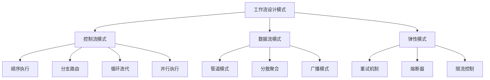
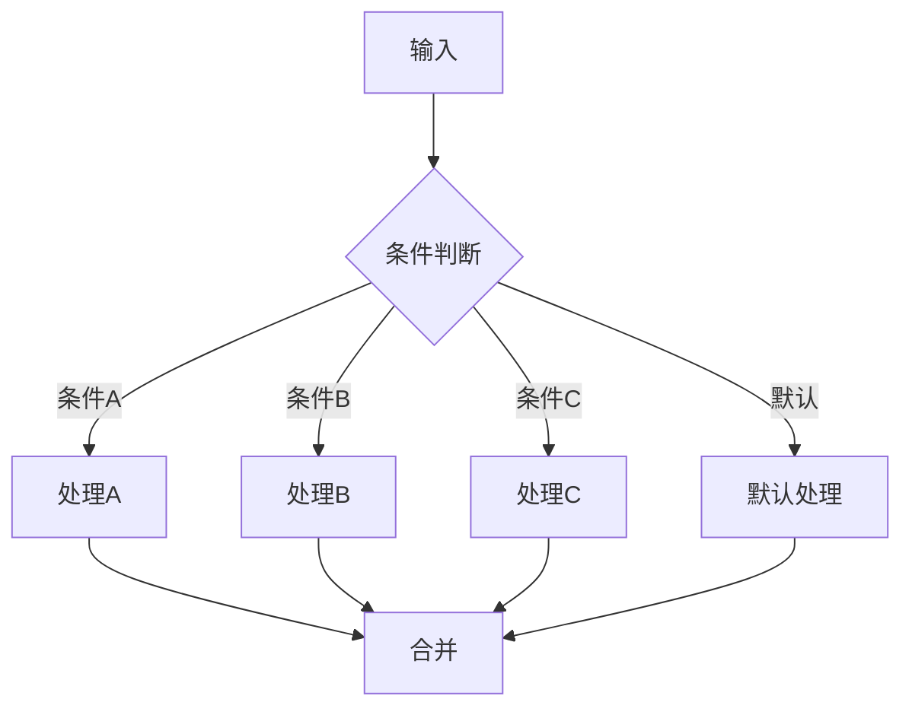
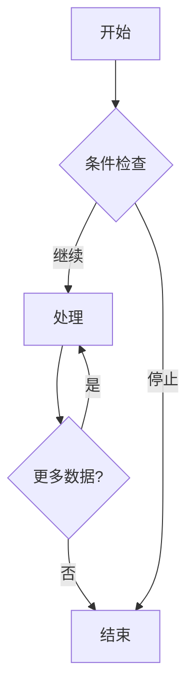
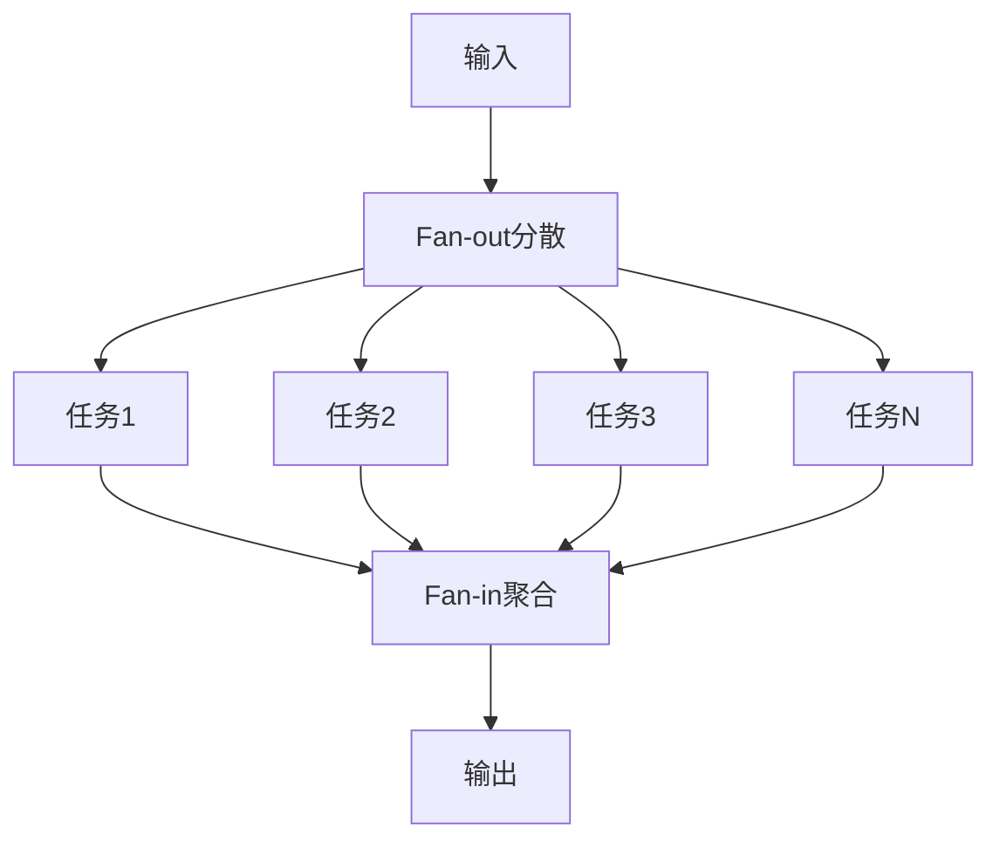

# 工作流设计模式

> [!abstract] 摘要
> 本文档系统介绍工作流设计的核心模式，包括Pipeline模式、分支模式、循环模式、Fan-out-Fan-in模式、重试机制和幂等性设计。通过详细的架构图和代码示例，帮助读者构建健壮、可维护的AI工作流系统。

## 核心关键词速览

| 关键词 | 说明 | 关键词 | 说明 |
|--------|------|--------|------|
| Pipeline | 流水线处理 | 分支模式 | 条件路由 |
| 循环模式 | 迭代处理 | Fan-out-Fan-in | 分散-聚合 |
| 重试机制 | Retry Pattern | 幂等性 | Idempotency |
| 限流 | Rate Limiting | 超时控制 | Timeout |
| 补偿机制 | Compensation | 状态机 | State Machine |

## 1. 工作流模式概述

### 1.1 模式分类



### 1.2 模式选择指南

| 场景 | 推荐模式 | 原因 |
|------|----------|------|
| 顺序处理数据 | Pipeline | 简单、清晰 |
| 多条件分支 | 分支模式 | 可读性强 |
| 批量处理 | Fan-out-Fan-in | 高效利用资源 |
| 不稳定外部调用 | 重试+熔断 | 提高稳定性 |
| 需要补偿 | Saga模式 | 保证最终一致性 |

## 2. Pipeline模式

### 2.1 模式定义

Pipeline模式将数据处理过程分解为多个有序的阶段，每个阶段接收上一阶段的输出作为输入。


### 2.2 Python实现

```python
from typing import TypeVar, Generic, Callable, List, Optional
from dataclasses import dataclass
from abc import ABC, abstractmethod

T = TypeVar('T')
R = TypeVar('R')

@dataclass
class PipelineContext:
    """流水线上下文"""
    request_id: str
    data: dict
    metadata: dict
    errors: List[str] = None
    
    def __post_init__(self):
        if self.errors is None:
            self.errors = []

class PipelineStage(ABC, Generic[T, R]):
    """流水线阶段基类"""
    
    @property
    @abstractmethod
    def name(self) -> str:
        """阶段名称"""
        pass
    
    @abstractmethod
    async def execute(self, context: T) -> R:
        """执行阶段"""
        pass
    
    async def on_error(self, error: Exception, context: T) -> Optional[R]:
        """错误处理"""
        return None

class Pipeline(Generic[T, R]):
    """Pipeline执行器"""
    
    def __init__(self, name: str):
        self.name = name
        self.stages: List[PipelineStage] = []
    
    def add_stage(self, stage: PipelineStage) -> 'Pipeline':
        """添加阶段"""
        self.stages.append(stage)
        return self
    
    async def execute(self, initial_input: T) -> R:
        """执行流水线"""
        context = initial_input
        result = None
        
        for stage in self.stages:
            try:
                result = await stage.execute(context)
                context = result
            except Exception as e:
                result = await stage.on_error(e, context)
                if result is None:
                    raise
        
        return result

# 具体阶段实现
class ValidationStage(PipelineStage[PipelineContext, PipelineContext]):
    """数据验证阶段"""
    
    @property
    def name(self) -> str:
        return "validation"
    
    async def execute(self, context: PipelineContext) -> PipelineContext:
        # 验证逻辑
        if not context.data.get('content'):
            raise ValueError("Content is required")
        return context

class TransformStage(PipelineStage[PipelineContext, PipelineContext]):
    """数据转换阶段"""
    
    def __init__(self, transform_fn: Callable):
        self.transform_fn = transform_fn
    
    @property
    def name(self) -> str:
        return "transform"
    
    async def execute(self, context: PipelineContext) -> PipelineContext:
        context.data = self.transform_fn(context.data)
        return context

class LLMStage(PipelineStage[PipelineContext, PipelineContext]):
    """LLM处理阶段"""
    
    def __init__(self, model_client):
        self.client = model_client
    
    @property
    def name(self) -> str:
        return "llm"
    
    async def execute(self, context: PipelineContext) -> PipelineContext:
        response = await self.client.chat(context.data['content'])
        context.data['response'] = response
        return context

# 使用示例
async def build_summary_pipeline(client):
    pipeline = Pipeline[PipelineContext, PipelineContext]("summary_pipeline")
    
    pipeline.add_stage(ValidationStage())
    pipeline.add_stage(TransformStage(lambda d: {
        'content': d['content'].strip(),
        'max_length': d.get('max_length', 500)
    }))
    pipeline.add_stage(LLMStage(client))
    
    context = PipelineContext(
        request_id="req_001",
        data={'content': '要总结的长文本...'},
        metadata={'source': 'user_input'}
    )
    
    result = await pipeline.execute(context)
    return result.data['response']
```

## 3. 分支模式

### 3.1 条件分支



### 3.2 分支路由实现

```python
from typing import Dict, Callable, Any, List
from enum import Enum

class RouteStrategy(Enum):
    FIRST_MATCH = "first_match"      # 第一个匹配
    ALL_MATCH = "all_match"           # 全部匹配
    WEIGHTED = "weighted"             # 加权路由

class BranchRouter:
    """分支路由器"""
    
    def __init__(self, strategy: RouteStrategy = RouteStrategy.FIRST_MATCH):
        self.strategy = strategy
        self.routes: Dict[str, Callable] = {}
        self.default_handler: Callable = None
    
    def add_route(
        self, 
        condition: str, 
        handler: Callable
    ) -> 'BranchRouter':
        """添加路由"""
        self.routes[condition] = handler
        return self
    
    def set_default(self, handler: Callable) -> 'BranchRouter':
        """设置默认处理器"""
        self.default_handler = handler
        return self
    
    async def route(
        self, 
        context: Dict[str, Any]
    ) -> List[Any]:
        """执行路由"""
        matched_handlers = []
        
        for condition, handler in self.routes.items():
            if self._evaluate_condition(condition, context):
                if self.strategy == RouteStrategy.FIRST_MATCH:
                    return [await handler(context)]
                matched_handlers.append(handler)
        
        if not matched_handlers and self.default_handler:
            return [await self.default_handler(context)]
        
        return [await h(context) for h in matched_handlers]
    
    def _evaluate_condition(
        self, 
        condition: str, 
        context: Dict
    ) -> bool:
        """评估条件"""
        # 支持表达式解析
        try:
            return eval(condition, {"context": context})
        except:
            return condition in str(context)

# 意图识别路由示例
async def intent_routing_example():
    router = BranchRouter(strategy=RouteStrategy.FIRST_MATCH)
    
    @router.add_route("context.get('intent') == 'query'", 
                      lambda ctx: handle_query(ctx))
    @router.add_route("context.get('intent') == 'order'",
                      lambda ctx: handle_order(ctx))
    @router.add_route("context.get('intent') == 'complaint'",
                      lambda ctx: handle_complaint(ctx))
    @router.set_default(lambda ctx: handle_unknown(ctx))
    
    return await router.route(context)
```

### 3.3 多级路由

```python
class HierarchicalRouter:
    """层级路由器"""
    
    def __init__(self):
        self.routers: Dict[str, BranchRouter] = {}
        self.current_level = None
    
    def create_level(self, name: str) -> BranchRouter:
        """创建路由层级"""
        router = BranchRouter()
        self.routers[name] = router
        return router
    
    def set_entry(self, level_name: str) -> 'HierarchicalRouter':
        """设置入口层级"""
        self.current_level = level_name
        return self
    
    async def route(self, context: Dict[str, Any]) -> Any:
        """执行层级路由"""
        if not self.current_level:
            raise ValueError("No entry level set")
        
        current_context = context
        result = None
        
        while self.current_level:
            router = self.routers[self.current_level]
            results = await router.route(current_context)
            
            if not results:
                break
            
            result = results[0]
            
            # 检查是否需要切换层级
            self.current_level = result.get('next_level')
            
            if self.current_level:
                current_context = result.get('context', {})
        
        return result
```

## 4. 循环模式

### 4.1 循环处理



### 4.2 循环处理器

```python
from typing import List, TypeVar, Callable, AsyncIterator

T = TypeVar('T')
R = TypeVar('R')

class BatchProcessor:
    """批处理器"""
    
    def __init__(
        self,
        batch_size: int = 10,
        max_iterations: int = 100,
        continue_on_error: bool = True
    ):
        self.batch_size = batch_size
        self.max_iterations = max_iterations
        self.continue_on_error = continue_on_error
    
    async def process(
        self,
        items: List[T],
        processor: Callable[[T], R],
        aggregator: Callable[[List[R]], R] = None
    ) -> R:
        """处理列表"""
        results = []
        
        for i in range(0, len(items), self.batch_size):
            if i // self.batch_size >= self.max_iterations:
                break
            
            batch = items[i:i + self.batch_size]
            
            try:
                batch_results = await self._process_batch(batch, processor)
                results.extend(batch_results)
            except Exception as e:
                if not self.continue_on_error:
                    raise
        
        if aggregator:
            return aggregator(results)
        
        return results
    
    async def _process_batch(
        self,
        batch: List[T],
        processor: Callable
    ) -> List[R]:
        """处理单个批次"""
        import asyncio
        tasks = [processor(item) for item in batch]
        return await asyncio.gather(*tasks, return_exceptions=True)

class WhileLoop:
    """while循环"""
    
    def __init__(
        self,
        max_iterations: int = 100,
        delay_seconds: float = 0
    ):
        self.max_iterations = max_iterations
        self.delay_seconds = delay_seconds
    
    async def execute(
        self,
        initial_state: T,
        condition: Callable[[T], bool],
        body: Callable[[T], T]
    ) -> T:
        """执行循环"""
        state = initial_state
        iterations = 0
        
        while condition(state) and iterations < self.max_iterations:
            state = await body(state)
            iterations += 1
            
            if self.delay_seconds > 0:
                import asyncio
                await asyncio.sleep(self.delay_seconds)
        
        return state

# 使用示例：分页数据处理
async def paginated_processing():
    items = list(range(100))
    
    processor = BatchProcessor(batch_size=10)
    
    async def process_item(item):
        # 实际处理逻辑
        return item * 2
    
    results = await processor.process(items, process_item)
    return results
```

## 5. Fan-out-Fan-in模式

### 5.1 模式定义

Fan-out-Fan-in是一种并行处理模式，先将任务分散（Fan-out）到多个并行执行单元，再将结果聚合（Fan-in）返回。



### 5.2 实现

```python
import asyncio
from typing import List, Callable, TypeVar, Dict, Any

T = TypeVar('T')
R = TypeVar('R')

class FanOutFanIn:
    """Fan-out-Fan-in处理器"""
    
    def __init__(
        self,
        max_concurrency: int = 10,
        timeout_seconds: float = 60
    ):
        self.max_concurrency = max_concurrency
        self.timeout = timeout_seconds
    
    async def execute(
        self,
        tasks: List[Callable[[], R]],
        aggregator: Callable[[List[R]], Any] = None
    ) -> Any:
        """执行并行任务"""
        semaphore = asyncio.Semaphore(self.max_concurrency)
        
        async def bounded_task(task: Callable[[], R]) -> R:
            async with semaphore:
                return await asyncio.wait_for(task(), timeout=self.timeout)
        
        results = await asyncio.gather(
            *[bounded_task(t) for t in tasks],
            return_exceptions=True
        )
        
        # 处理异常
        successful = [r for r in results if not isinstance(r, Exception)]
        errors = [r for r in results if isinstance(r, Exception)]
        
        if errors:
            print(f"Warning: {len(errors)} tasks failed")
        
        if aggregator:
            return aggregator(successful)
        
        return successful

# 实战示例：多源数据聚合
async def aggregate_multi_source():
    fanout = FanOutFanIn(max_concurrency=5)
    
    def create_search_task(source: str):
        async def task():
            # 模拟搜索
            await asyncio.sleep(0.1)
            return {"source": source, "data": f"data_from_{source}"}
        return task
    
    tasks = [
        create_search_task("web"),
        create_search_task("news"),
        create_search_task("social"),
        create_search_task("academic")
    ]
    
    def aggregator(results):
        return {
            "total": len(results),
            "items": results
        }
    
    return await fanout.execute(tasks, aggregator)
```

### 5.3 带状态的Fan-out-Fan-in

```python
class StatefulFanOutFanIn:
    """带状态的Fan-out-Fan-in"""
    
    async def execute(
        self,
        initial_context: Dict[str, Any],
        task_definitions: List[Dict[str, Any]],
        result_handler: Callable[[Dict, Any], Dict],
        final_aggregator: Callable[[List[Dict]], Any]
    ) -> Any:
        """带状态传递的并行处理"""
        # 准备任务
        async def execute_task(task_def: Dict) -> Dict:
            context = task_def.get('initial_context', {})
            context.update(initial_context)
            
            result = await task_def['handler'](context)
            
            return result_handler(context, result)
        
        # 并行执行
        tasks = [execute_task(td) for td in task_definitions]
        results = await asyncio.gather(*tasks, return_exceptions=True)
        
        # 过滤异常
        successful = [r for r in results if isinstance(r, dict)]
        
        return final_aggregator(successful)
```

## 6. 重试机制

### 6.1 重试策略

```python
from typing import Callable, TypeVar, Optional
from dataclasses import dataclass
from datetime import datetime, timedelta
import asyncio

T = TypeVar('T')

@dataclass
class RetryConfig:
    """重试配置"""
    max_attempts: int = 3
    initial_delay: float = 1.0
    max_delay: float = 60.0
    backoff_factor: float = 2.0
    jitter: bool = True

class RetryHandler:
    """重试处理器"""
    
    def __init__(self, config: RetryConfig = None):
        self.config = config or RetryConfig()
    
    async def execute(
        self,
        func: Callable[[], T],
        should_retry: Callable[[Exception], bool] = None
    ) -> T:
        """带重试执行"""
        last_exception = None
        
        for attempt in range(1, self.config.max_attempts + 1):
            try:
                return await func()
            except Exception as e:
                last_exception = e
                
                # 检查是否应该重试
                if should_retry and not should_retry(e):
                    raise
                
                if attempt == self.config.max_attempts:
                    break
                
                # 计算延迟
                delay = self._calculate_delay(attempt)
                await asyncio.sleep(delay)
        
        raise last_exception
    
    def _calculate_delay(self, attempt: int) -> float:
        """计算延迟时间"""
        delay = min(
            self.config.initial_delay * (self.config.backoff_factor ** (attempt - 1)),
            self.config.max_delay
        )
        
        if self.config.jitter:
            import random
            delay *= (0.5 + random.random())
        
        return delay

# 使用示例
async def retry_example():
    retry = RetryHandler(RetryConfig(
        max_attempts=3,
        initial_delay=1.0,
        backoff_factor=2.0
    ))
    
    async def unreliable_api_call():
        # 模拟不稳定的API
        import random
        if random.random() < 0.7:
            raise ConnectionError("Network error")
        return "Success"
    
    try:
        result = await retry.execute(unreliable_api_call)
        print(result)
    except ConnectionError as e:
        print(f"最终失败: {e}")
```

### 6.2 指数退避

```python
class ExponentialBackoff:
    """指数退避"""
    
    @staticmethod
    def calculate(
        attempt: int,
        base_delay: float = 1.0,
        max_delay: float = 60.0,
        jitter: bool = True
    ) -> float:
        """计算退避时间"""
        delay = min(base_delay * (2 ** attempt), max_delay)
        
        if jitter:
            import random
            delay *= (0.5 + random.random() * 0.5)
        
        return delay
```

## 7. 幂等性设计

### 7.1 幂等性概念

幂等性是指同一个操作执行一次和执行多次的结果相同，是分布式系统可靠性的重要保证。

| 操作类型 | 幂等性 | 实现方式 |
|----------|--------|----------|
| GET | 天然幂等 | - |
| PUT | 幂等 | 基于ID覆盖 |
| DELETE | 幂等 | 软删除/不存在也成功 |
| POST | 非幂等 | 唯一键/去重表 |

### 7.2 幂等性实现

```python
import hashlib
import asyncio
from typing import Optional
from dataclasses import dataclass

@dataclass
class IdempotencyKey:
    """幂等键"""
    key: str
    created_at: datetime
    status: str  # pending/completed/failed
    result: Optional[Any] = None

class IdempotencyStore:
    """幂等存储"""
    
    def __init__(self):
        self._store: Dict[str, IdempotencyKey] = {}
    
    async def check(self, key: str) -> Optional[Any]:
        """检查幂等键"""
        if key in self._store:
            record = self._store[key]
            if record.status == "completed":
                return record.result
            elif record.status == "pending":
                # 等待完成
                return await self._wait_for_completion(key)
        return None
    
    async def save_pending(self, key: str) -> None:
        """保存待处理状态"""
        self._store[key] = IdempotencyKey(
            key=key,
            created_at=datetime.now(),
            status="pending"
        )
    
    async def save_result(self, key: str, result: Any) -> None:
        """保存结果"""
        if key in self._store:
            self._store[key].status = "completed"
            self._store[key].result = result
    
    async def _wait_for_completion(self, key: str, timeout: float = 30) -> Any:
        """等待结果完成"""
        for _ in range(int(timeout * 10)):
            await asyncio.sleep(0.1)
            if self._store[key].status != "pending":
                return self._store[key].result
        raise TimeoutError(f"Idempotency key {key} timeout")

class IdempotentExecutor:
    """幂等执行器"""
    
    def __init__(self, store: IdempotencyStore):
        self.store = store
    
    async def execute(
        self,
        idempotency_key: str,
        operation: Callable
    ) -> Any:
        """幂等执行"""
        # 检查是否存在
        existing = await self.store.check(idempotency_key)
        if existing is not None:
            return existing
        
        # 标记为待处理
        await self.store.save_pending(idempotency_key)
        
        try:
            result = await operation()
            await self.store.save_result(idempotency_key, result)
            return result
        except Exception as e:
            self._store[idempotency_key].status = "failed"
            raise

# 使用示例
async def idempotent_example():
    store = IdempotencyStore()
    executor = IdempotentExecutor(store)
    
    key = hashlib.md5(f"order_123_user_456".encode()).hexdigest()
    
    async def create_order():
        # 创建订单逻辑
        return {"order_id": "order_123", "status": "created"}
    
    result = await executor.execute(key, create_order)
    return result
```

## 8. 相关资源

- [[n8n平台深度指南]] - n8n工作流编排
- [[AI应用API化部署]] - API部署方案
- [[AI应用生产部署]] - 企业级部署最佳实践
- [[多Agent系统设计]] - 多智能体协作

---

*本文档由归愚知识系统自动生成 last updated: 2026-04-18*
