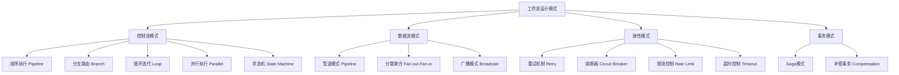

# 工作流设计模式：从入门到精通

> [!NOTE] 这篇指南讲什么
> 工作流设计是AI应用开发的核心技能。这篇指南从基础到高级，系统讲解Pipeline、分支路由、循环迭代、Fan-out-Fan-in、Saga状态机、熔断器、限流等设计模式，通过详细的代码示例和平台实战，帮助你构建生产级别的AI工作流。

## 核心关键词速览

| 关键词 | 说明 | 关键词 | 说明 |
|--------|------|--------|------|
| Pipeline | 流水线处理 | 分支模式 | 条件路由 |
| 循环模式 | 迭代处理 | Fan-out-Fan-in | 分散-聚合 |
| 重试机制 | Retry Pattern | 幂等性 | Idempotency |
| 限流 | Rate Limiting | 超时控制 | Timeout |
| 补偿机制 | Compensation | 状态机 | State Machine |
| Saga模式 | 分布式事务 | 熔断器 | Circuit Breaker |
| 观察者 | Observer | 发布订阅 | Pub/Sub |

## 1. 工作流模式概述

### 1.1 为什么需要设计模式？

很多新手写工作流，代码是这样的：

```python
# 新手写法 - 所有逻辑堆在一起
async def process_user_request(user_input):
    # 验证
    if not user_input.get('content'):
        return {'error': 'content required'}
    
    # 查询数据库
    user = await db.query(user_input['user_id'])
    
    # 调用LLM
    response = await llm.chat(user_input['content'])
    
    # 保存结果
    await db.save(response)
    
    # 发送通知
    await notification.send(user_id, response)
    
    return response
```

问题：
- 逻辑耦合，修改一处影响全局
- 难以测试，单个步骤无法独立测试
- 无法复用，重复代码满天飞
- 错误处理混乱

**设计模式能帮你解决这些问题。**

### 1.2 模式分类全景图



### 1.3 模式选择指南

| 场景 | 推荐模式 | 原因 |
|------|----------|------|
| 顺序处理数据 | Pipeline | 简单、清晰 |
| 多条件分支 | 分支模式 | 可读性强 |
| 批量处理 | Fan-out-Fan-in | 高效利用资源 |
| 不稳定外部调用 | 重试+熔断 | 提高稳定性 |
| 需要补偿 | Saga模式 | 保证最终一致性 |
| 多阶段状态流转 | 状态机 | 清晰可控 |
| 防止系统过载 | 限流+熔断 | 保护系统 |

## 2. Pipeline模式

### 2.1 模式定义

Pipeline模式将数据处理过程分解为多个有序的阶段，每个阶段接收上一阶段的输出作为输入。

```
graph LR
    A[输入] --> B[阶段1 验证]
    B --> C[阶段2 转换]
    C --> D[阶段3 处理]
    D --> E[阶段4 输出]
    
    B -.->|状态传递| C
    C -.->|状态传递| D
    D -.->|状态传递| E
```

### 2.2 Python完整实现

```python
from typing import TypeVar, Generic, Callable, List, Optional, Any, Dict
from dataclasses import dataclass, field
from abc import ABC, abstractmethod
from datetime import datetime
from enum import Enum
import logging

T = TypeVar('T')
R = TypeVar('R')

logger = logging.getLogger(__name__)


class StageStatus(Enum):
    """阶段状态"""
    PENDING = "pending"
    RUNNING = "running"
    COMPLETED = "completed"
    FAILED = "failed"
    SKIPPED = "skipped"


@dataclass
class PipelineContext:
    """流水线上下文 - 贯穿整个Pipeline的数据载体"""
    request_id: str
    data: Dict[str, Any] = field(default_factory=dict)
    metadata: Dict[str, Any] = field(default_factory=dict)
    errors: List[Dict] = field(default_factory=list)
    stage_results: Dict[str, Any] = field(default_factory=dict)
    
    def add_error(self, stage: str, error: Exception):
        """添加错误"""
        self.errors.append({
            'stage': stage,
            'error': str(error),
            'timestamp': datetime.now().isoformat()
        })
    
    def add_result(self, stage: str, result: Any):
        """添加阶段结果"""
        self.stage_results[stage] = result


@dataclass
class StageResult:
    """阶段执行结果"""
    status: StageStatus
    output: Any = None
    error: Optional[Exception] = None
    metadata: Dict = field(default_factory=dict)


class PipelineStage(ABC, Generic[T, R]):
    """流水线阶段基类"""
    
    def __init__(self):
        self.execution_count = 0
    
    @property
    @abstractmethod
    def name(self) -> str:
        """阶段名称"""
        pass
    
    @abstractmethod
    async def execute(self, context: T) -> R:
        """执行阶段 - 核心逻辑"""
        pass
    
    async def before_execute(self, context: T) -> T:
        """执行前钩子 - 可选实现"""
        return context
    
    async def after_execute(self, context: T, result: R) -> R:
        """执行后钩子 - 可选实现"""
        return result
    
    async def on_error(self, error: Exception, context: T) -> Optional[R]:
        """错误处理钩子 - 返回值则继续流程"""
        logger.error(f"Stage {self.name} error: {error}")
        return None
    
    def should_skip(self, context: T) -> bool:
        """判断是否跳过此阶段"""
        return False


class Pipeline(Generic[T, R]):
    """Pipeline执行器 - 核心编排器"""
    
    def __init__(self, name: str):
        self.name = name
        self.stages: List[PipelineStage] = []
        self.error_handlers: List[Callable] = []
    
    def add_stage(self, stage: PipelineStage) -> 'Pipeline':
        """添加阶段"""
        self.stages.append(stage)
        return self
    
    def on_error(self, handler: Callable) -> 'Pipeline':
        """添加全局错误处理器"""
        self.error_handlers.append(handler)
        return self
    
    async def execute(self, initial_input: T) -> StageResult:
        """执行流水线"""
        context = initial_input
        final_result = None
        
        for stage in self.stages:
            # 检查是否跳过
            if stage.should_skip(context):
                logger.info(f"Stage {stage.name} skipped")
                continue
            
            stage.execution_count += 1
            
            try:
                # 前置钩子
                context = await stage.before_execute(context)
                
                # 执行阶段
                logger.info(f"Executing stage: {stage.name}")
                result = await stage.execute(context)
                
                # 后置钩子
                result = await stage.after_execute(context, result)
                
                final_result = result
                context = result
                
            except Exception as e:
                logger.error(f"Stage {stage.name} failed: {e}")
                
                # 调用错误处理
                error_result = await stage.on_error(e, context)
                
                if error_result is None:
                    # 不处理错误，抛出异常
                    return StageResult(
                        status=StageStatus.FAILED,
                        error=e,
                        metadata={'failed_stage': stage.name}
                    )
                
                final_result = error_result
        
        return StageResult(status=StageStatus.COMPLETED, output=final_result)


# ============== 具体阶段实现 ==============

class ValidationStage(PipelineStage[PipelineContext, PipelineContext]):
    """数据验证阶段"""
    
    def __init__(self, validators: List[Callable] = None):
        super().__init__()
        self.validators = validators or []
    
    @property
    def name(self) -> str:
        return "validation"
    
    async def execute(self, context: PipelineContext) -> PipelineContext:
        for validator in self.validators:
            await validator(context)
        return context


class TransformStage(PipelineStage[PipelineContext, PipelineContext]):
    """数据转换阶段"""
    
    def __init__(self, transform_fn: Callable[[Dict], Dict]):
        self.transform_fn = transform_fn
    
    @property
    def name(self) -> str:
        return "transform"
    
    async def execute(self, context: PipelineContext) -> PipelineContext:
        context.data = self.transform_fn(context.data)
        return context


class LLMStage(PipelineStage[PipelineContext, PipelineContext]):
    """LLM处理阶段"""
    
    def __init__(self, model_client, prompt_template: str = None):
        self.client = model_client
        self.prompt_template = prompt_template or "{content}"
    
    @property
    def name(self) -> str:
        return "llm"
    
    async def execute(self, context: PipelineContext) -> PipelineContext:
        prompt = self.prompt_template.format(**context.data)
        
        response = await self.client.chat([
            {"role": "user", "content": prompt}
        ])
        
        context.data['llm_response'] = response
        context.metadata['model_used'] = self.client.model
        return context


class CacheStage(PipelineStage[PipelineContext, PipelineContext]):
    """缓存阶段"""
    
    def __init__(self, cache_client):
        self.cache = cache_client
    
    @property
    def name(self) -> str:
        return "cache"
    
    async def execute(self, context: PipelineContext) -> PipelineContext:
        cache_key = context.data.get('cache_key')
        
        if cache_key:
            cached = await self.cache.get(cache_key)
            if cached:
                context.data['cached_result'] = cached
                context.metadata['cache_hit'] = True
        
        return context


# ============== 使用示例 ==============

async def build_summary_pipeline(client, cache_client=None):
    """构建文章摘要流水线"""
    pipeline = Pipeline[PipelineContext, PipelineContext]("summary_pipeline")
    
    # 添加阶段
    pipeline.add_stage(ValidationStage(validators=[
        lambda ctx: ctx.data.get('content') or ctx.add_error('validation', ValueError("内容不能为空"))
    ]))
    
    pipeline.add_stage(TransformStage(transform_fn=lambda d: {
        'content': d['content'].strip(),
        'max_length': d.get('max_length', 500),
        'style': d.get('style', 'concise')
    }))
    
    if cache_client:
        pipeline.add_stage(CacheStage(cache_client))
    
    pipeline.add_stage(LLMStage(
        client,
        prompt_template="请用{style}的风格，用不超过{max_length}字总结以下内容：\n{content}"
    ))
    
    return pipeline


async def run_pipeline_example():
    """运行示例"""
    # 模拟客户端
    class MockLLMClient:
        model = "gpt-4o"
        async def chat(self, messages):
            return f"这是{messages[0]['content'][:20]}...的摘要"
    
    client = MockLLMClient()
    pipeline = await build_summary_pipeline(client)
    
    # 准备输入
    context = PipelineContext(
        request_id="req_001",
        data={
            'content': '这是一篇关于人工智能发展历程的长文章...',
            'max_length': 200
        },
        metadata={'source': 'user_input'}
    )
    
    # 执行
    result = await pipeline.execute(context)
    
    print(f"Status: {result.status}")
    print(f"Result: {result.output.data.get('llm_response')}")
```

### 2.3 n8n中的Pipeline实现

在n8n中，Pipeline通过节点的顺序连接实现：

```yaml
# n8n工作流配置示例 - 文章摘要流水线
name: "文章摘要处理流水线"
nodes:
  # 1. 触发节点
  - name: "Webhook触发"
    type: "webhook"
    parameters:
      path: "article-summary"
    outputs: ["验证"]
  
  # 2. 验证节点
  - name: "验证"
    type: "IF"
    parameters:
      conditions:
        - operation: "isNotEmpty"
          value2: "{{ $json.content }}"
    outputs: ["转换", "错误处理"]
  
  # 3. 转换节点
  - name: "转换"
    type: "Set"
    parameters:
      values:
        article: "{{ $json.content }}"
        maxLength: "{{ $json.maxLength || 500 }}"
        style: "{{ $json.style || 'concise' }}"
    outputs: ["LLM处理"]
  
  # 4. LLM处理节点
  - name: "LLM处理"
    type: "@n8n/n8n-nodes-langchain.chatOpenAi"
    parameters:
      model: "gpt-4o"
      messages:
        - role: "user"
          content: "=请用{{ $json.style }}的风格，用不超过{{ $json.maxLength }}字总结以下内容：\n{{ $json.article }}"
    outputs: ["格式化"]
  
  # 5. 格式化输出
  - name: "格式化"
    type: "Set"
    parameters:
      values:
        summary: "{{ $json.content }}"
        requestId: "{{ $('Webhook触发').item.json.requestId }}"
        timestamp: "{{ $now.toISO() }}"
    outputs: ["响应"]
  
  # 6. HTTP响应
  - name: "响应"
    type: "respondToWebhook"
    parameters:
      responseCode: 200
      responseData: "{{ $json }}"
```

## 3. 分支模式

### 3.1 条件分支

分支模式根据条件将工作流分成多个路径：

```
graph TD
    A[输入] --> B{条件判断}
    B -->|条件A| C[处理A]
    B -->|条件B| D[处理B]
    B -->|条件C| E[处理C]
    B -->|默认| F[默认处理]
    
    C --> G[合并]
    D --> G
    E --> G
    F --> G
    G --> H[输出]
```

### 3.2 分支路由实现

```python
from typing import Dict, Callable, Any, List, Optional, Union
from enum import Enum
from dataclasses import dataclass, field
import re


class RouteStrategy(Enum):
    """路由策略"""
    FIRST_MATCH = "first_match"      # 第一个匹配
    ALL_MATCH = "all_match"           # 全部匹配
    WEIGHTED = "weighted"             # 加权路由


@dataclass
class Route:
    """路由定义"""
    name: str
    condition: Union[str, Callable[[Dict], bool]]
    handler: Callable
    priority: int = 0
    metadata: Dict = field(default_factory=dict)


class BranchRouter:
    """分支路由器"""
    
    def __init__(self, strategy: RouteStrategy = RouteStrategy.FIRST_MATCH):
        self.strategy = strategy
        self.routes: List[Route] = []
        self.default_handler: Optional[Callable] = None
    
    def add_route(
        self,
        condition: Union[str, Callable[[Dict], bool]],
        handler: Callable,
        name: str = None,
        priority: int = 0
    ) -> 'BranchRouter':
        """添加路由"""
        route = Route(
            name=name or f"route_{len(self.routes)}",
            condition=condition,
            handler=handler,
            priority=priority
        )
        self.routes.append(route)
        # 按优先级排序
        self.routes.sort(key=lambda x: x.priority, reverse=True)
        return self
    
    def set_default(self, handler: Callable) -> 'BranchRouter':
        """设置默认处理器"""
        self.default_handler = handler
        return self
    
    async def route(self, context: Dict[str, Any]) -> Any:
        """执行路由"""
        matched_routes = []
        
        for route in self.routes:
            if self._evaluate_condition(route.condition, context):
                if self.strategy == RouteStrategy.FIRST_MATCH:
                    return await route.handler(context)
                matched_routes.append(route)
        
        # 所有匹配
        if matched_routes and self.strategy == RouteStrategy.ALL_MATCH:
            results = []
            for route in matched_routes:
                result = await route.handler(context)
                results.append(result)
            return results
        
        # 默认处理
        if self.default_handler:
            return await self.default_handler(context)
        
        return None
    
    def _evaluate_condition(
        self,
        condition: Union[str, Callable],
        context: Dict
    ) -> bool:
        """评估条件"""
        if callable(condition):
            return condition(context)
        
        if isinstance(condition, str):
            # 支持表达式
            if re.match(r'^[\w.]+\s*(==|!=|>|<|in|contains)\s*.+$', condition):
                try:
                    return eval(condition, {"context": context})
                except Exception:
                    return False
            
            # 支持简单的键存在检查
            if condition.startswith('$.'):
                keys = condition[2:].split('.')
                val = context
                for key in keys:
                    if isinstance(val, dict):
                        val = val.get(key)
                    else:
                        return False
                return bool(val)
            
            return condition in str(context)
        
        return bool(condition)


# ============== 实战示例 ==============

async def intent_routing_example():
    """意图识别路由示例"""
    router = BranchRouter(strategy=RouteStrategy.FIRST_MATCH)
    
    # 查询意图
    router.add_route(
        condition=lambda ctx: ctx.get('intent') == 'query',
        handler=lambda ctx: {"action": "search", "params": ctx.get('query')},
        name="query_intent",
        priority=10
    )
    
    # 订单意图
    router.add_route(
        condition=lambda ctx: ctx.get('intent') == 'order',
        handler=lambda ctx: {"action": "create_order", "params": ctx.get('order_data')},
        name="order_intent",
        priority=10
    )
    
    # 投诉意图
    router.add_route(
        condition=lambda ctx: ctx.get('intent') == 'complaint',
        handler=lambda ctx: {"action": "handle_complaint", "params": ctx.get('complaint')},
        name="complaint_intent",
        priority=10
    )
    
    # VIP用户特殊处理
    router.add_route(
        condition=lambda ctx: ctx.get('is_vip') and ctx.get('intent') == 'query',
        handler=lambda ctx: {"action": "vip_search", "params": ctx.get('query')},
        name="vip_query",
        priority=20  # 更高优先级
    )
    
    # 默认处理
    router.set_default(lambda ctx: {"action": "fallback", "message": "无法理解您的请求"})
    
    # 测试
    test_cases = [
        {'intent': 'query', 'query': '产品信息'},
        {'intent': 'order', 'order_data': {'product_id': '123'}},
        {'intent': 'query', 'query': '订单', 'is_vip': True},
        {'intent': 'unknown', 'message': 'hello'},
    ]
    
    results = []
    for case in test_cases:
        result = await router.route(case)
        results.append({'input': case, 'output': result})
    
    return results
```

### 3.3 多级路由

```python
class HierarchicalRouter:
    """层级路由器 - 支持复杂的多级路由"""
    
    def __init__(self):
        self.levels: Dict[str, BranchRouter] = {}
        self.transitions: Dict[str, str] = {}  # level_a: level_b
        self.current_level = None
        self.entry_level = None
    
    def create_level(self, name: str, strategy: RouteStrategy = RouteStrategy.FIRST_MATCH) -> BranchRouter:
        """创建路由层级"""
        router = BranchRouter(strategy=strategy)
        self.levels[name] = router
        return router
    
    def add_transition(self, from_level: str, to_level: str, condition: Callable = None):
        """添加层级转换规则"""
        self.transitions[from_level] = {
            'to': to_level,
            'condition': condition or (lambda _: True)
        }
    
    def set_entry(self, level_name: str) -> 'HierarchicalRouter':
        """设置入口层级"""
        self.entry_level = level_name
        self.current_level = level_name
        return self
    
    async def route(self, initial_context: Dict[str, Any]) -> Any:
        """执行层级路由"""
        if not self.current_level:
            raise ValueError("No entry level set. Call set_entry() first.")
        
        context = initial_context.copy()
        result = None
        max_hops = 10  # 防止无限循环
        
        while self.current_level and max_hops > 0:
            router = self.levels.get(self.current_level)
            if not router:
                break
            
            result = await router.route(context)
            
            # 检查结果中的层级转换
            if isinstance(result, dict) and result.get('next_level'):
                self.current_level = result['next_level']
                context = result.get('context', {})
            elif self.current_level in self.transitions:
                transition = self.transitions[self.current_level]
                if transition['condition'](result):
                    self.current_level = transition['to']
            else:
                # 没有更多转换
                break
            
            max_hops -= 1
        
        return result


# ============== 实战：客服工作流 ==============

async def customer_service_workflow():
    """客服工作流 - 多级路由示例"""
    
    # 创建层级路由
    router = HierarchicalRouter()
    
    # 第一层：意图识别
    triage = router.create_level("triage")
    triage.add_route(
        condition=lambda ctx: ctx.get('type') == 'complaint',
        handler=lambda ctx: {'next_level': 'complaint_handler', 'context': ctx}
    )
    triage.add_route(
        condition=lambda ctx: ctx.get('type') == 'inquiry',
        handler=lambda ctx: {'next_level': 'inquiry_handler', 'context': ctx}
    )
    triage.add_route(
        condition=lambda ctx: ctx.get('type') == 'order',
        handler=lambda ctx: {'next_level': 'order_handler', 'context': ctx}
    )
    
    # 第二层：投诉处理
    complaint = router.create_level("complaint_handler")
    complaint.add_route(
        condition=lambda ctx: ctx.get('severity') == 'high',
        handler=lambda ctx: {'response': '紧急投诉已转接人工', 'escalate': True}
    )
    complaint.add_route(
        condition=lambda ctx: ctx.get('severity') == 'normal',
        handler=lambda ctx: {'response': '您的投诉已记录，我们会尽快处理'}
    )
    
    # 第二层：咨询处理
    inquiry = router.create_level("inquiry_handler")
    inquiry.add_route(
        condition=lambda ctx: 'refund' in ctx.get('content', ''),
        handler=lambda ctx: {'response': '关于退款，请查看...', 'kb_match': 'refund_policy'}
    )
    inquiry.add_route(
        condition=lambda ctx: 'shipping' in ctx.get('content', ''),
        handler=lambda ctx: {'response': '您的订单正在配送中...', 'order_id': ctx.get('order_id')}
    )
    inquiry.set_default(lambda ctx: {'response': '请详细描述您的问题'})
    
    # 第二层：订单处理
    order = router.create_level("order_handler")
    order.add_route(
        condition=lambda ctx: ctx.get('action') == 'cancel',
        handler=lambda ctx: {'response': '订单已取消', 'action': 'cancel_confirmed'}
    )
    order.add_route(
        condition=lambda ctx: ctx.get('action') == 'modify',
        handler=lambda ctx: {'response': '请选择要修改的内容'}
    )
    
    # 设置入口
    router.set_entry("triage")
    
    # 测试
    test_cases = [
        {'type': 'complaint', 'severity': 'high', 'content': '产品损坏'},
        {'type': 'inquiry', 'content': '如何申请退款'},
        {'type': 'order', 'action': 'cancel', 'order_id': '12345'},
    ]
    
    results = []
    for case in test_cases:
        result = await router.route(case)
        results.append(result)
    
    return results
```

### 3.4 n8n分支实现

```yaml
# n8n分支工作流示例 - 订单处理
name: "订单智能路由"
nodes:
  - name: "触发"
    type: "webhook"
    parameters:
      path: "order-process"
    outputs: ["意图识别"]
  
  # 意图识别 - 使用Switch节点
  - name: "意图识别"
    type: "switch"
    parameters:
      dataType: "string"
      value1: "{{ $json.intent }}"
      rules:
        rules:
          - operation: "equals"
            value2: "cancel"
          - operation: "equals"
            value2: "modify"
          - operation: "equals"
            value2: "query"
      fallbackOutput: "默认处理"
    outputs:
      - "取消订单流程"
      - "修改订单流程"
      - "查询订单流程"
      - "默认处理"
  
  # 取消订单分支
  - name: "取消订单流程"
    type: "code"
    parameters:
      jsCode: |
        // 检查是否在可取消时间内
        const order = $input.first().json;
        const now = new Date();
        const orderTime = new Date(order.createdAt);
        const hoursDiff = (now - orderTime) / (1000 * 60 * 60);
        
        if (hoursDiff > 24) {
          return [{json: {...order, canCancel: false, reason: "超过24小时不可取消"}}];
        }
        return [{json: {...order, canCancel: true}}];
    outputs: ["条件判断"]
  
  - name: "条件判断"
    type: "IF"
    parameters:
      conditions:
        - operation: "boolean"
          value1: "{{ $json.canCancel }}"
      combineOperation: "AND"
    outputs: ["执行取消", "返回拒绝"]
  
  - name: "执行取消"
    type: "set"
    parameters:
      values:
        status: "cancelled"
        message: "订单已取消"
    outputs: ["响应"]
  
  - name: "返回拒绝"
    type: "set"
    parameters:
      values:
        status: "rejected"
        message: "{{ $json.reason }}"
    outputs: ["响应"]
  
  # 其他分支类似...
  
  - name: "默认处理"
    type: "set"
    parameters:
      values:
        message: "无法识别您的请求"
    outputs: ["响应"]
```

## 4. 循环模式

### 4.1 循环处理

循环模式用于处理需要反复执行的任务：

```
graph TD
    A[开始] --> B{条件检查}
    B -->|继续| C[处理]
    C --> D{更多数据?}
    D -->|是| C
    D -->|否| E[结束]
    B -->|停止| E
```

### 4.2 循环处理器

```python
from typing import List, TypeVar, Callable, AsyncIterator, Optional, Any
import asyncio

T = TypeVar('T')
R = TypeVar('R')


class BatchProcessor:
    """批处理器 - 批量数据循环处理"""
    
    def __init__(
        self,
        batch_size: int = 10,
        max_iterations: int = 100,
        continue_on_error: bool = True,
        delay_between_batches: float = 0
    ):
        self.batch_size = batch_size
        self.max_iterations = max_iterations
        self.continue_on_error = continue_on_error
        self.delay_between_batches = delay_between_batches
    
    async def process(
        self,
        items: List[T],
        processor: Callable[[T], R],
        aggregator: Callable[[List[R]], Any] = None
    ) -> Any:
        """处理列表"""
        results = []
        failed = []
        
        for i in range(0, len(items), self.batch_size):
            if i // self.batch_size >= self.max_iterations:
                break
            
            batch = items[i:i + self.batch_size]
            
            try:
                batch_results = await self._process_batch(batch, processor)
                results.extend(batch_results)
            except Exception as e:
                if self.continue_on_error:
                    failed.append({'batch': i, 'error': str(e)})
                else:
                    raise
            
            # 批次间延迟
            if self.delay_between_batches > 0:
                await asyncio.sleep(self.delay_between_batches)
        
        if aggregator:
            return aggregator(results)
        
        return {'results': results, 'failed': failed}
    
    async def _process_batch(
        self,
        batch: List[T],
        processor: Callable
    ) -> List[R]:
        """处理单个批次 - 并行处理"""
        tasks = [processor(item) for item in batch]
        return await asyncio.gather(*tasks, return_exceptions=True)


class WhileLoop:
    """While循环 - 条件驱动循环"""
    
    def __init__(
        self,
        max_iterations: int = 100,
        delay_seconds: float = 0,
        timeout_seconds: Optional[float] = None
    ):
        self.max_iterations = max_iterations
        self.delay_seconds = delay_seconds
        self.timeout_seconds = timeout_seconds
    
    async def execute(
        self,
        initial_state: T,
        condition: Callable[[T], bool],
        body: Callable[[T], T]
    ) -> T:
        """执行循环"""
        state = initial_state
        iterations = 0
        start_time = asyncio.get_event_loop().time()
        
        while condition(state) and iterations < self.max_iterations:
            # 检查超时
            if self.timeout_seconds:
                elapsed = asyncio.get_event_loop().time() - start_time
                if elapsed >= self.timeout_seconds:
                    raise TimeoutError(f"Loop timeout after {elapsed:.2f}s")
            
            state = await body(state)
            iterations += 1
            
            if self.delay_seconds > 0:
                await asyncio.sleep(self.delay_seconds)
        
        return state


class DoWhileLoop:
    """Do-While循环 - 至少执行一次"""
    
    def __init__(
        self,
        max_iterations: int = 100,
        delay_seconds: float = 0
    ):
        self.max_iterations = max_iterations
        self.delay_seconds = delay_seconds
    
    async def execute(
        self,
        initial_state: T,
        body: Callable[[T], T],
        condition: Callable[[T], bool]
    ) -> T:
        """执行循环"""
        state = initial_state
        iterations = 0
        
        while iterations < self.max_iterations:
            state = await body(state)
            iterations += 1
            
            if not condition(state):
                break
            
            if self.delay_seconds > 0:
                await asyncio.sleep(self.delay_seconds)
        
        return state


class AsyncIteratorLoop:
    """异步迭代器循环 - 流式处理"""
    
    async def process(
        self,
        iterator: AsyncIterator[T],
        processor: Callable[[T], R],
        on_item: Callable[[R], None] = None,
        max_items: Optional[int] = None
    ) -> List[R]:
        """处理异步迭代器"""
        results = []
        count = 0
        
        async for item in iterator:
            if max_items and count >= max_items:
                break
            
            result = await processor(item)
            results.append(result)
            
            if on_item:
                on_item(result)
            
            count += 1
        
        return results


# ============== 实战示例 ==============

async def paginated_processing_example():
    """分页数据处理示例"""
    items = list(range(100))
    
    processor = BatchProcessor(
        batch_size=10,
        delay_between_batches=0.5
    )
    
    async def process_item(item):
        # 模拟API调用
        await asyncio.sleep(0.1)
        return {"id": item, "processed": True, "result": item * 2}
    
    def aggregator(results):
        return {
            "total": len(results),
            "sum": sum(r.get('result', 0) for r in results if isinstance(r, dict)),
            "success_rate": sum(1 for r in results if isinstance(r, dict)) / len(results)
        }
    
    result = await processor.process(items, process_item, aggregator)
    return result


async def retry_until_success_example():
    """重试直到成功示例"""
    loop = WhileLoop(max_iterations=10, delay_seconds=1)
    
    class RetryState:
        def __init__(self):
            self.attempts = 0
            self.max_attempts = 5
            self.success = False
            self.result = None
        
        def should_continue(self):
            return not self.success and self.attempts < self.max_attempts
    
    async def attempt(state: RetryState):
        state.attempts += 1
        import random
        if random.random() < 0.7:  # 70%成功率
            state.success = True
            state.result = {"status": "success", "attempts": state.attempts}
        else:
            print(f"Attempt {state.attempts} failed, retrying...")
        return state
    
    final_state = await loop.execute(RetryState(), RetryState.should_continue, attempt)
    return final_state.result
```

## 5. Fan-out-Fan-in模式

### 5.1 模式定义

Fan-out-Fan-in是一种并行处理模式，先将任务分散（Fan-out）到多个并行执行单元，再将结果聚合（Fan-in）返回。

```
graph TD
    A[输入] --> B[Fan-out 分散]
    B --> C[任务1]
    B --> D[任务2]
    B --> E[任务3]
    B --> F[任务N]
    
    C --> G[Fan-in 聚合]
    D --> G
    E --> G
    F --> G
    G --> H[输出]
```

### 5.2 完整实现

```python
import asyncio
from typing import List, Callable, TypeVar, Dict, Any, Optional
from dataclasses import dataclass, field
from datetime import datetime
from enum import Enum
import logging

logger = logging.getLogger(__name__)

T = TypeVar('T')
R = TypeVar('R')


class TaskStatus(Enum):
    """任务状态"""
    PENDING = "pending"
    RUNNING = "running"
    COMPLETED = "completed"
    FAILED = "failed"
    CANCELLED = "cancelled"


@dataclass
class TaskResult:
    """任务结果"""
    task_id: str
    status: TaskStatus
    result: Any = None
    error: Optional[Exception] = None
    duration_ms: float = 0
    metadata: Dict = field(default_factory=dict)


class FanOutFanIn:
    """Fan-out-Fan-in处理器 - 核心并行处理引擎"""
    
    def __init__(
        self,
        max_concurrency: int = 10,
        timeout_seconds: float = 60,
        continue_on_error: bool = True
    ):
        self.max_concurrency = max_concurrency
        self.timeout = timeout_seconds
        self.continue_on_error = continue_on_error
        self.semaphore: Optional[asyncio.Semaphore] = None
    
    async def execute(
        self,
        tasks: List[Callable[[], R]],
        aggregator: Callable[[List[R]], Any] = None,
        task_names: List[str] = None
    ) -> Dict[str, Any]:
        """执行并行任务"""
        if not self.semaphore:
            self.semaphore = asyncio.Semaphore(self.max_concurrency)
        
        # 创建带命名的任务
        named_tasks = []
        for i, task in enumerate(tasks):
            name = task_names[i] if task_names and i < len(task_names) else f"task_{i}"
            named_tasks.append((name, task))
        
        # 执行所有任务
        results = await asyncio.gather(
            *[self._execute_task(name, task) for name, task in named_tasks],
            return_exceptions=not self.continue_on_error
        )
        
        # 分离成功和失败
        successful = []
        failed = []
        
        for i, result in enumerate(results):
            if isinstance(result, Exception):
                failed.append({
                    'task': named_tasks[i][0],
                    'error': str(result)
                })
            elif result.status == TaskStatus.COMPLETED:
                successful.append(result.result)
            else:
                failed.append({
                    'task': named_tasks[i][0],
                    'error': result.error
                })
        
        # 聚合结果
        aggregated = None
        if aggregator and successful:
            try:
                aggregated = aggregator(successful)
            except Exception as e:
                logger.error(f"Aggregation failed: {e}")
                aggregated = {'error': str(e), 'partial_results': successful}
        
        return {
            'successful': successful,
            'failed': failed,
            'aggregated': aggregated,
            'total': len(tasks),
            'success_count': len(successful),
            'failure_count': len(failed),
            'success_rate': len(successful) / len(tasks) if tasks else 0
        }
    
    async def _execute_task(self, name: str, task: Callable) -> TaskResult:
        """执行单个任务"""
        start_time = asyncio.get_event_loop().time()
        
        async def bounded_task():
            async with self.semaphore:
                return await asyncio.wait_for(task(), timeout=self.timeout)
        
        try:
            result = await bounded_task()
            duration = (asyncio.get_event_loop().time() - start_time) * 1000
            
            return TaskResult(
                task_id=name,
                status=TaskStatus.COMPLETED,
                result=result,
                duration_ms=duration
            )
        except asyncio.TimeoutError:
            duration = (asyncio.get_event_loop().time() - start_time) * 1000
            return TaskResult(
                task_id=name,
                status=TaskStatus.FAILED,
                error=TimeoutError(f"Task {name} timed out"),
                duration_ms=duration
            )
        except Exception as e:
            duration = (asyncio.get_event_loop().time() - start_time) * 1000
            return TaskResult(
                task_id=name,
                status=TaskStatus.FAILED,
                error=e,
                duration_ms=duration
            )


class StatefulFanOutFanIn:
    """带状态的Fan-out-Fan-in - 支持状态传递"""
    
    def __init__(self, max_concurrency: int = 10):
        self.max_concurrency = max_concurrency
    
    async def execute(
        self,
        initial_context: Dict[str, Any],
        task_definitions: List[Dict[str, Any]],
        result_handler: Callable[[Dict, Any], Dict],
        final_aggregator: Callable[[List[Dict]], Any],
        timeout: float = 60
    ) -> Dict[str, Any]:
        """带状态传递的并行处理"""
        semaphore = asyncio.Semaphore(self.max_concurrency)
        
        async def execute_task(task_def: Dict) -> Dict:
            async with semaphore:
                # 合并上下文
                context = {**initial_context, **task_def.get('initial_context', {})}
                
                # 执行任务
                result = await asyncio.wait_for(
                    task_def['handler'](context),
                    timeout=timeout
                )
                
                # 处理结果
                return result_handler(context, result)
        
        # 并行执行
        tasks = [execute_task(td) for td in task_definitions]
        results = await asyncio.gather(*tasks, return_exceptions=True)
        
        # 过滤成功结果
        successful = [r for r in results if isinstance(r, dict)]
        failed = [r for r in results if isinstance(r, Exception)]
        
        # 聚合
        aggregated = final_aggregator(successful)
        
        return {
            'results': successful,
            'failed': [str(f) for f in failed],
            'aggregated': aggregated,
            'success_count': len(successful)
        }


# ============== 实战示例 ==============

async def multi_source_aggregation():
    """多源数据聚合示例"""
    fanout = FanOutFanIn(max_concurrency=5)
    
    def create_search_task(source: str, query: str):
        async def task():
            # 模拟搜索
            await asyncio.sleep(0.1)
            return {
                "source": source,
                "query": query,
                "data": [f"result_{i}_from_{source}" for i in range(3)]
            }
        return task
    
    sources = ["web", "news", "social", "academic", "wiki"]
    query = "artificial intelligence"
    
    tasks = [create_search_task(source, query) for source in sources]
    
    def aggregator(results):
        all_items = []
        for r in results:
            all_items.extend(r.get('data', []))
        
        return {
            "total_sources": len(results),
            "total_items": len(all_items),
            "items": all_items,
            "by_source": {r['source']: r['data'] for r in results}
        }
    
    return await fanout.execute(tasks, aggregator)


async def parallel_llm_processing():
    """并行LLM处理示例"""
    fanout = FanOutFanIn(max_concurrency=3)
    
    prompts = [
        "解释量子计算",
        "解释机器学习",
        "解释区块链",
        "解释云计算",
        "解释边缘计算"
    ]
    
    async def process_prompt(prompt: str):
        # 模拟LLM调用
        await asyncio.sleep(0.2)
        return {
            "prompt": prompt,
            "response": f"关于{prompt}的详细解释...",
            "tokens_used": len(prompt) * 2
        }
    
    tasks = [lambda p=p: process_prompt(p) for p in prompts]
    
    def aggregator(results):
        return {
            "total_prompts": len(results),
            "total_tokens": sum(r.get('tokens_used', 0) for r in results),
            "responses": [r.get('response') for r in results]
        }
    
    return await fanout.execute(tasks, aggregator)
```

### 5.3 n8n Fan-out-Fan-in实现

```yaml
# n8n Fan-out-Fan-in示例 - 多源内容聚合
name: "多源内容聚合"
nodes:
  # 1. 触发
  - name: "Webhook触发"
    type: "webhook"
    parameters:
      path: "aggregate"
    outputs: ["并行搜索"]
  
  # 2. Fan-out: 并行执行多个搜索
  - name: "并行搜索"
    type: "splitInBatches"
    parameters:
      batchSize: 1
      options:
        reset: true
    outputs:
      - "Web搜索"
      - "News搜索"
      - "学术搜索"
      - "合并"
  
  # Web搜索分支
  - name: "Web搜索"
    type: "HTTP Request"
    parameters:
      url: "https://api.search.com/web"
      qs:
        q: "{{ $json.query }}"
        limit: 5
    outputs: ["合并"]
  
  # News搜索分支
  - name: "News搜索"
    type: "HTTP Request"
    parameters:
      url: "https://api.search.com/news"
      qs:
        q: "{{ $json.query }}"
        limit: 5
    outputs: ["合并"]
  
  # 学术搜索分支
  - name: "学术搜索"
    type: "HTTP Request"
    parameters:
      url: "https://api.search.com/academic"
      qs:
        q: "{{ $json.query }}"
        limit: 5
    outputs: ["合并"]
  
  # 3. Fan-in: 合并结果
  - name: "合并"
    type: "merge"
    parameters:
      mode: "multiplex"
      join: "outer"
    outputs: ["聚合处理"]
  
  # 4. 聚合处理
  - name: "聚合处理"
    type: "code"
    parameters:
      jsCode: |
        const allResults = $input.all();
        
        const aggregated = {
          query: $('Webhook触发').first().json.query,
          totalSources: allResults.length,
          webResults: [],
          newsResults: [],
          academicResults: [],
          timestamp: new Date().toISOString()
        };
        
        for (const item of allResults) {
          const source = item.json.source;
          if (source === 'web') aggregated.webResults.push(item.json);
          else if (source === 'news') aggregated.newsResults.push(item.json);
          else if (source === 'academic') aggregated.academicResults.push(item.json);
        }
        
        return [{json: aggregated}];
    outputs: ["格式化"]
  
  # 5. 格式化输出
  - name: "格式化"
    type: "set"
    parameters:
      values:
        summary: "=找到 {{ $json.totalSources }} 个来源的结果"
        results: "{{ $json }}"
    outputs: ["响应"]
```

## 6. Saga模式

### 6.1 模式定义

Saga模式用于管理分布式事务，通过将大事务拆分为多个本地事务，每个本地事务有对应的补偿操作。

```
graph TD
    A[开始下单] --> B[验证库存]
    B --> C[创建订单]
    C --> D[扣减库存]
    D --> E[发送通知]
    E --> F[完成]
    
    C -.->|失败| G[取消订单]
    D -.->|失败| H[回滚库存]
    E -.->|失败| I[补偿通知]
    
    G --> J[结束]
    H --> J
    I --> J
```

### 6.2 Saga实现

```python
from typing import List, Callable, Any, Dict, Optional
from dataclasses import dataclass, field
from enum import Enum
from datetime import datetime
import asyncio


class SagaStatus(Enum):
    """Saga执行状态"""
    RUNNING = "running"
    COMPLETED = "completed"
    COMPENSATING = "compensating"
    COMPENSATED = "compensated"
    FAILED = "failed"


@dataclass
class SagaStep:
    """Saga步骤"""
    name: str
    forward: Callable  # 正向操作
    backward: Callable  # 补偿操作
    timeout: float = 30
    retry_count: int = 3
    metadata: Dict = field(default_factory=dict)


@dataclass
class SagaExecution:
    """Saga执行记录"""
    saga_id: str
    status: SagaStatus
    current_step: int = 0
    completed_steps: List[Dict] = field(default_factory=list)
    compensation_log: List[Dict] = field(default_factory=list)
    error: Optional[Exception] = None
    started_at: datetime = field(default_factory=datetime.now)
    completed_at: Optional[datetime] = None


class Saga:
    """Saga事务管理器"""
    
    def __init__(self, saga_id: str):
        self.saga_id = saga_id
        self.steps: List[SagaStep] = []
        self.execution: Optional[SagaExecution] = None
    
    def add_step(self, step: SagaStep) -> 'Saga':
        """添加步骤"""
        self.steps.append(step)
        return self
    
    async def execute(self, initial_context: Dict[str, Any]) -> SagaExecution:
        """执行Saga"""
        self.execution = SagaExecution(
            saga_id=self.saga_id,
            status=SagaStatus.RUNNING
        )
        
        context = initial_context.copy()
        
        try:
            for i, step in enumerate(self.steps):
                self.execution.current_step = i
                
                # 执行正向操作
                result = await self._execute_with_retry(
                    step.forward,
                    context,
                    step.timeout,
                    step.retry_count
                )
                
                # 记录完成
                self.execution.completed_steps.append({
                    'step': step.name,
                    'result': result,
                    'timestamp': datetime.now().isoformat()
                })
                
                # 更新上下文
                if isinstance(result, dict):
                    context.update(result)
            
            # 全部成功
            self.execution.status = SagaStatus.COMPLETED
            self.execution.completed_at = datetime.now()
            
        except Exception as e:
            self.execution.error = e
            self.execution.status = SagaStatus.COMPENSATING
            
            # 执行补偿
            await self._compensate()
        
        return self.execution
    
    async def _execute_with_retry(
        self,
        operation: Callable,
        context: Dict,
        timeout: float,
        retry_count: int
    ) -> Any:
        """带重试的执行"""
        last_error = None
        
        for attempt in range(retry_count + 1):
            try:
                if asyncio.iscoroutinefunction(operation):
                    return await asyncio.wait_for(operation(context), timeout=timeout)
                else:
                    return operation(context)
            except Exception as e:
                last_error = e
                if attempt < retry_count:
                    await asyncio.sleep(0.5 * (attempt + 1))  # 退避
        
        raise last_error
    
    async def _compensate(self):
        """执行补偿操作"""
        completed = list(reversed(self.execution.completed_steps))
        
        for step_record in completed:
            step_name = step_record['step']
            
            # 找到对应的步骤
            step = next((s for s in self.steps if s.name == step_name), None)
            
            if step and step.backward:
                try:
                    await asyncio.wait_for(
                        step.backward(step_record['result']),
                        timeout=30
                    )
                    
                    self.execution.compensation_log.append({
                        'step': step_name,
                        'status': 'compensated',
                        'timestamp': datetime.now().isoformat()
                    })
                except Exception as e:
                    self.execution.compensation_log.append({
                        'step': step_name,
                        'status': 'failed',
                        'error': str(e),
                        'timestamp': datetime.now().isoformat()
                    })
        
        self.execution.status = SagaStatus.COMPENSATED
        self.execution.completed_at = datetime.now()


# ============== 实战示例：订单处理Saga ==============

async def order_processing_saga():
    """订单处理Saga示例"""
    
    # 步骤1: 验证库存
    async def validate_inventory(ctx: Dict) -> Dict:
        product_id = ctx['product_id']
        quantity = ctx['quantity']
        
        # 模拟库存检查
        inventory = 100  # 假设有100件库存
        
        if inventory < quantity:
            raise ValueError(f"库存不足: 需要{quantity}, 仅有{inventory}")
        
        return {'inventory_validated': True, 'available': inventory}
    
    # 步骤1补偿: 释放库存锁定
    async def release_inventory_lock(result: Dict) -> Dict:
        print("释放库存锁定")
        return {'inventory_released': True}
    
    # 步骤2: 创建订单
    async def create_order(ctx: Dict) -> Dict:
        product_id = ctx['product_id']
        quantity = ctx['quantity']
        
        # 模拟创建订单
        order_id = f"ORDER_{int(datetime.now().timestamp())}"
        
        return {
            'order_id': order_id,
            'status': 'pending',
            'total': quantity * 100  # 假设单价100
        }
    
    # 步骤2补偿: 取消订单
    async def cancel_order(result: Dict) -> Dict:
        order_id = result.get('order_id')
        print(f"取消订单: {order_id}")
        return {'order_cancelled': True}
    
    # 步骤3: 扣减库存
    async def deduct_inventory(ctx: Dict, inventory_result: Dict) -> Dict:
        quantity = ctx['quantity']
        available = inventory_result.get('available', 100)
        
        # 模拟扣减
        new_inventory = available - quantity
        
        return {'inventory_deducted': True, 'remaining': new_inventory}
    
    # 步骤3补偿: 回滚库存
    async def rollback_inventory(result: Dict, ctx: Dict) -> Dict:
        quantity = ctx['quantity']
        print(f"回滚库存: +{quantity}")
        return {'inventory_rolled_back': True}
    
    # 步骤4: 发送通知
    async def send_notification(order_result: Dict) -> Dict:
        order_id = order_result.get('order_id')
        print(f"发送订单通知: {order_id}")
        return {'notification_sent': True}
    
    # 步骤4补偿: 撤回通知
    async def retract_notification(result: Dict) -> Dict:
        print("撤回订单通知")
        return {'notification_retracted': True}
    
    # 构建Saga
    saga = Saga(saga_id="order_saga_001")
    
    saga.add_step(SagaStep(
        name="validate_inventory",
        forward=validate_inventory,
        backward=release_inventory_lock
    ))
    
    saga.add_step(SagaStep(
        name="create_order",
        forward=create_order,
        backward=cancel_order
    ))
    
    saga.add_step(SagaStep(
        name="deduct_inventory",
        forward=lambda ctx: deduct_inventory(ctx, ctx.get('_inventory_result', {})),
        backward=lambda result: rollback_inventory(result, ctx)
    ))
    
    saga.add_step(SagaStep(
        name="send_notification",
        forward=send_notification,
        backward=retract_notification
    ))
    
    # 执行
    context = {
        'product_id': 'PROD_001',
        'quantity': 5,
        'user_id': 'USER_001'
    }
    
    result = await saga.execute(context)
    
    print(f"Saga状态: {result.status}")
    print(f"完成步骤: {len(result.completed_steps)}")
    print(f"补偿日志: {result.compensation_log}")
    
    return result
```

## 7. 状态机模式

### 7.1 状态机定义

状态机模式用于管理有明确状态流转的对象或流程：

```python
from enum import Enum
from typing import Callable, Dict, List, Optional, Any
from dataclasses import dataclass, field


class OrderState(Enum):
    """订单状态"""
    CREATED = "created"
    PAID = "paid"
    PROCESSING = "processing"
    SHIPPED = "shipped"
    DELIVERED = "delivered"
    CANCELLED = "cancelled"
    REFUNDED = "refunded"


class OrderEvent(Enum):
    """订单事件"""
    PAY = "pay"
    PROCESS = "process"
    SHIP = "ship"
    DELIVER = "deliver"
    CANCEL = "cancel"
    REFUND = "refund"


@dataclass
class StateTransition:
    """状态转换"""
    from_state: OrderState
    event: OrderEvent
    to_state: OrderState
    guard: Optional[Callable] = None
    action: Optional[Callable] = None


class StateMachine:
    """通用状态机"""
    
    def __init__(self, initial_state: Any):
        self.current_state = initial_state
        self.transitions: List[StateTransition] = []
        self.state_handlers: Dict[Any, List[Callable]] = {
            initial_state: []
        }
        self.history: List[Dict] = []
    
    def add_transition(
        self,
        from_state: Any,
        event: Any,
        to_state: Any,
        guard: Callable = None,
        action: Callable = None
    ) -> 'StateMachine':
        """添加转换"""
        transition = StateTransition(
            from_state=from_state,
            event=event,
            to_state=to_state,
            guard=guard,
            action=action
        )
        self.transitions.append(transition)
        
        # 确保状态处理器存在
        if to_state not in self.state_handlers:
            self.state_handlers[to_state] = []
        
        return self
    
    def on_state(self, state: Any, handler: Callable) -> 'StateMachine':
        """状态进入时的处理器"""
        if state not in self.state_handlers:
            self.state_handlers[state] = []
        self.state_handlers[state].append(handler)
        return self
    
    def can_transition(self, event: Any) -> bool:
        """检查是否可以转换"""
        return any(
            t.from_state == self.current_state and t.event == event
            for t in self.transitions
        )
    
    async def trigger(self, event: Any, context: Dict = None) -> bool:
        """触发事件"""
        context = context or {}
        
        # 查找匹配的转换
        for transition in self.transitions:
            if (transition.from_state == self.current_state and 
                transition.event == event):
                
                # 检查守卫条件
                if transition.guard and not await self._call_guard(transition.guard, context):
                    return False
                
                # 执行转换前动作
                if transition.action:
                    await transition.action(context)
                
                # 切换状态
                old_state = self.current_state
                self.current_state = transition.to_state
                
                # 执行状态处理器
                await self._execute_state_handlers(transition.to_state, context)
                
                # 记录历史
                self.history.append({
                    'from': old_state,
                    'event': event,
                    'to': transition.to_state,
                    'timestamp': context.get('timestamp')
                })
                
                return True
        
        return False
    
    async def _call_guard(self, guard: Callable, context: Dict) -> bool:
        """调用守卫函数"""
        if asyncio.iscoroutinefunction(guard):
            return await guard(context)
        return guard(context)
    
    async def _execute_state_handlers(self, state: Any, context: Dict):
        """执行状态处理器"""
        handlers = self.state_handlers.get(state, [])
        for handler in handlers:
            if asyncio.iscoroutinefunction(handler):
                await handler(context)
            else:
                handler(context)


# ============== 订单状态机示例 ==============

import asyncio

async def order_state_machine_example():
    """订单状态机示例"""
    
    # 创建状态机
    machine = StateMachine(OrderState.CREATED)
    
    # 定义转换
    # 支付
    machine.add_transition(
        OrderState.CREATED,
        OrderEvent.PAY,
        OrderState.PAID
    )
    
    # 开始处理
    machine.add_transition(
        OrderState.PAID,
        OrderEvent.PROCESS,
        OrderState.PROCESSING,
        guard=lambda ctx: ctx.get('payment_verified', False)
    )
    
    # 发货
    machine.add_transition(
        OrderState.PROCESSING,
        OrderEvent.SHIP,
        OrderState.SHIPPED
    )
    
    # 送达
    machine.add_transition(
        OrderState.SHIPPED,
        OrderEvent.DELIVER,
        OrderState.DELIVERED
    )
    
    # 取消 (在特定状态下可取消)
    machine.add_transition(
        OrderState.CREATED,
        OrderEvent.CANCEL,
        OrderState.CANCELLED
    )
    
    machine.add_transition(
        OrderState.PAID,
        OrderEvent.CANCEL,
        OrderState.CANCELLED,
        guard=lambda ctx: not ctx.get('processing_started', False)
    )
    
    # 退款
    machine.add_transition(
        OrderState.DELIVERED,
        OrderEvent.REFUND,
        OrderState.REFUNDED
    )
    
    # 状态处理器
    def on_paid(context):
        print(f"订单已支付: {context.get('order_id')}")
    
    def on_shipped(context):
        print(f"订单已发货: {context.get('tracking_number')}")
    
    def on_cancelled(context):
        print(f"订单已取消")
    
    machine.on_state(OrderState.PAID, on_paid)
    machine.on_state(OrderState.SHIPPED, on_shipped)
    machine.on_state(OrderState.CANCELLED, on_cancelled)
    
    # 测试流程
    context = {
        'order_id': 'ORDER_001',
        'payment_verified': True,
        'tracking_number': 'SF123456789'
    }
    
    # 正常流程
    print(f"初始状态: {machine.current_state}")
    
    await machine.trigger(OrderEvent.PAY, context)
    print(f"支付后: {machine.current_state}")
    
    await machine.trigger(OrderEvent.PROCESS, context)
    print(f"处理中: {machine.current_state}")
    
    await machine.trigger(OrderEvent.SHIP, context)
    print(f"已发货: {machine.current_state}")
    
    await machine.trigger(OrderEvent.DELIVER, context)
    print(f"已送达: {machine.current_state}")
    
    # 打印历史
    print("\n状态转换历史:")
    for h in machine.history:
        print(f"  {h['from'].value} --[{h['event'].value}]--> {h['to'].value}")
    
    return machine
```

## 8. 熔断器模式

### 8.1 模式定义

熔断器模式防止级联故障，当某个服务连续失败达到阈值时，熔断器打开，后续请求直接失败或返回降级响应。

```
graph TD
    A[请求] --> B{熔断器状态}
    
    B -->|CLOSED| C[正常调用]
    C -->|成功| D[失败计数清零]
    C -->|失败| E[失败计数+1]
    E --> F{失败次数 >= 阈值?}
    F -->|是| G[打开熔断器]
    F -->|否| D
    
    B -->|HALF_OPEN| H[允许单个请求]
    H -->|成功| G
    H -->|失败| G
    
    B -->|OPEN| I[直接返回降级响应]
    
    G --> J[等待超时]
    J -->|超时| K[进入半开]
```

### 8.2 熔断器实现

```python
import asyncio
import time
from enum import Enum
from dataclasses import dataclass, field
from typing import Callable, Any, Optional


class CircuitState(Enum):
    """熔断器状态"""
    CLOSED = "closed"       # 关闭 - 正常调用
    OPEN = "open"            # 打开 - 快速失败
    HALF_OPEN = "half_open"  # 半开 - 试探恢复


@dataclass
class CircuitBreakerConfig:
    """熔断器配置"""
    failure_threshold: int = 5      # 失败阈值
    success_threshold: int = 2       # 成功阈值（半开状态下）
    timeout: float = 60              # 打开持续时间（秒）
    half_open_max_calls: int = 1     # 半开状态允许的调用数


@dataclass
class CircuitBreaker:
    """熔断器"""
    name: str
    config: CircuitBreakerConfig = field(default_factory=CircuitBreakerConfig)
    
    def __post_init__(self):
        self.state = CircuitState.CLOSED
        self.failure_count = 0
        self.success_count = 0
        self.last_failure_time: Optional[float] = None
        self.half_open_calls = 0
    
    @property
    def is_closed(self) -> bool:
        return self.state == CircuitState.CLOSED
    
    @property
    def is_open(self) -> bool:
        return self.state == CircuitState.OPEN
    
    @property
    def is_half_open(self) -> bool:
        return self.state == CircuitState.HALF_OPEN
    
    async def call(
        self,
        func: Callable,
        fallback: Callable = None,
        *args,
        **kwargs
    ) -> Any:
        """调用函数"""
        
        # 检查状态
        if self.is_open:
            # 检查是否应该进入半开状态
            if self._should_attempt_reset():
                self._to_half_open()
            else:
                # 返回降级响应
                if fallback:
                    return await fallback(*args, **kwargs)
                raise CircuitOpenError(f"Circuit {self.name} is open")
        
        # 半开状态：限制调用数
        if self.is_half_open:
            if self.half_open_calls >= self.config.half_open_max_calls:
                raise CircuitOpenError(f"Circuit {self.name} is half-open, max calls reached")
            self.half_open_calls += 1
        
        # 执行调用
        try:
            result = await func(*args, **kwargs)
            self._on_success()
            return result
        except Exception as e:
            self._on_failure()
            raise
    
    def _should_attempt_reset(self) -> bool:
        """检查是否应该尝试重置"""
        if self.last_failure_time is None:
            return False
        
        elapsed = time.time() - self.last_failure_time
        return elapsed >= self.config.timeout
    
    def _to_half_open(self):
        """切换到半开状态"""
        self.state = CircuitState.HALF_OPEN
        self.half_open_calls = 0
        self.success_count = 0
    
    def _on_success(self):
        """成功处理"""
        if self.is_half_open:
            self.success_count += 1
            if self.success_count >= self.config.success_threshold:
                # 恢复到关闭状态
                self.state = CircuitState.CLOSED
                self.failure_count = 0
        else:
            # 关闭状态：重置失败计数
            self.failure_count = 0
    
    def _on_failure(self):
        """失败处理"""
        self.failure_count += 1
        self.last_failure_time = time.time()
        
        if self.is_half_open:
            # 半开状态失败：立即打开
            self.state = CircuitState.OPEN
        elif self.failure_count >= self.config.failure_threshold:
            # 达到阈值：打开熔断器
            self.state = CircuitState.OPEN
    
    def reset(self):
        """手动重置"""
        self.state = CircuitState.CLOSED
        self.failure_count = 0
        self.success_count = 0
        self.last_failure_time = None
        self.half_open_calls = 0


class CircuitOpenError(Exception):
    """熔断器打开异常"""
    pass


# ============== 使用示例 ==============

async def circuit_breaker_example():
    """熔断器使用示例"""
    
    # 创建熔断器
    breaker = CircuitBreaker(
        name="external_api",
        config=CircuitBreakerConfig(
            failure_threshold=3,
            success_threshold=2,
            timeout=10
        )
    )
    
    call_count = {'success': 0, 'failure': 0}
    
    async def unreliable_api():
        """不稳定的API"""
        import random
        if random.random() < 0.7:  # 70%失败率
            call_count['failure'] += 1
            raise ConnectionError("API连接失败")
        call_count['success'] += 1
        return {"status": "ok", "data": "result"}
    
    async def fallback():
        """降级响应"""
        return {"status": "degraded", "data": "fallback result"}
    
    # 测试调用
    results = []
    for i in range(10):
        try:
            result = await breaker.call(unreliable_api, fallback)
            results.append({'call': i+1, 'status': 'success', 'result': result})
        except CircuitOpenError as e:
            results.append({'call': i+1, 'status': 'circuit_open', 'error': str(e)})
        except Exception as e:
            results.append({'call': i+1, 'status': 'error', 'error': str(e)})
        
        print(f"Call {i+1}: State={breaker.state.value}, Result={results[-1]['status']}")
        
        await asyncio.sleep(0.5)
    
    print(f"\n统计: 成功={call_count['success']}, 失败={call_count['failure']}")
    print(f"熔断器最终状态: {breaker.state.value}")
    
    return results
```

## 9. 限流模式

### 9.1 限流算法实现

```python
import time
import asyncio
from typing import Dict, Optional, Callable, Any
from dataclasses import dataclass
from collections import deque
from enum import Enum


class RateLimitStrategy(Enum):
    """限流策略"""
    FIXED_WINDOW = "fixed_window"      # 固定窗口
    SLIDING_WINDOW = "sliding_window"  # 滑动窗口
    TOKEN_BUCKET = "token_bucket"      # 令牌桶
    LEAKY_BUCKET = "leaky_bucket"      # 漏桶


@dataclass
class RateLimitConfig:
    """限流配置"""
    requests_per_second: float
    burst_size: Optional[int] = None  # 突发容量


class FixedWindowLimiter:
    """固定窗口限流器"""
    
    def __init__(self, config: RateLimitConfig):
        self.rate = config.requests_per_second
        self.window_size = 1.0  # 1秒窗口
        self.count = 0
        self.window_start = time.time()
        self.lock = asyncio.Lock()
    
    async def acquire(self) -> bool:
        """获取许可"""
        async with self.lock:
            now = time.time()
            
            # 窗口重置
            if now - self.window_start >= self.window_size:
                self.count = 0
                self.window_start = now
            
            # 检查限制
            if self.count < self.rate:
                self.count += 1
                return True
            
            return False
    
    async def wait_and_acquire(self, timeout: float = 30) -> bool:
        """等待并获取许可"""
        start = time.time()
        
        while time.time() - start < timeout:
            if await self.acquire():
                return True
            
            # 等待下一个窗口
            await asyncio.sleep(0.1)
        
        return False


class SlidingWindowLimiter:
    """滑动窗口限流器"""
    
    def __init__(self, config: RateLimitConfig):
        self.rate = config.requests_per_second
        self.window_size = 1.0
        self.requests: deque = deque()
        self.lock = asyncio.Lock()
    
    async def acquire(self) -> bool:
        """获取许可"""
        async with self.lock:
            now = time.time()
            cutoff = now - self.window_size
            
            # 移除过期的请求
            while self.requests and self.requests[0] < cutoff:
                self.requests.popleft()
            
            # 检查限制
            if len(self.requests) < self.rate:
                self.requests.append(now)
                return True
            
            return False


class TokenBucketLimiter:
    """令牌桶限流器"""
    
    def __init__(self, config: RateLimitConfig):
        self.rate = config.requests_per_second
        self.capacity = config.burst_size or int(config.requests_per_second * 2)
        self.tokens = float(self.capacity)
        self.last_update = time.time()
        self.lock = asyncio.Lock()
    
    async def acquire(self, tokens: int = 1) -> bool:
        """获取令牌"""
        async with self.lock:
            # 补充令牌
            now = time.time()
            elapsed = now - self.last_update
            self.tokens = min(
                self.capacity,
                self.tokens + elapsed * self.rate
            )
            self.last_update = now
            
            # 尝试获取
            if self.tokens >= tokens:
                self.tokens -= tokens
                return True
            
            return False


class RateLimiter:
    """限流器管理器"""
    
    def __init__(self):
        self.limiters: Dict[str, Any] = {}
    
    def create_limiter(
        self,
        name: str,
        strategy: RateLimitStrategy,
        config: RateLimitConfig
    ) -> Any:
        """创建限流器"""
        if strategy == RateLimitStrategy.FIXED_WINDOW:
            limiter = FixedWindowLimiter(config)
        elif strategy == RateLimitStrategy.SLIDING_WINDOW:
            limiter = SlidingWindowLimiter(config)
        elif strategy == RateLimitStrategy.TOKEN_BUCKET:
            limiter = TokenBucketLimiter(config)
        else:
            raise ValueError(f"Unknown strategy: {strategy}")
        
        self.limiters[name] = limiter
        return limiter
    
    async def check_limit(self, name: str, tokens: int = 1) -> bool:
        """检查限制"""
        limiter = self.limiters.get(name)
        if not limiter:
            return True  # 没有限流器，直接通过
        
        return await limiter.acquire(tokens)
    
    async def with_limit(
        self,
        name: str,
        func: Callable,
        *args,
        **kwargs
    ) -> Any:
        """在限流下执行函数"""
        if await self.check_limit(name):
            return await func(*args, **kwargs)
        else:
            raise RateLimitExceeded(f"Rate limit exceeded for {name}")


class RateLimitExceeded(Exception):
    """超出限流异常"""
    pass


# ============== 使用示例 ==============

async def rate_limiter_example():
    """限流器使用示例"""
    
    limiter_manager = RateLimiter()
    
    # 创建令牌桶限流器: 每秒10个请求，突发容量20
    limiter = limiter_manager.create_limiter(
        "api_calls",
        RateLimitStrategy.TOKEN_BUCKET,
        RateLimitConfig(requests_per_second=10, burst_size=20)
    )
    
    results = []
    
    # 测试100次调用
    for i in range(100):
        success = await limiter.acquire()
        results.append({
            'call': i + 1,
            'allowed': success,
            'tokens': limiter.tokens
        })
        
        if success:
            print(f"Call {i+1}: Allowed, Tokens remaining: {limiter.tokens:.2f}")
        
        await asyncio.sleep(0.01)  # 10ms间隔
    
    allowed = sum(1 for r in results if r['allowed'])
    print(f"\n总共100次调用，成功: {allowed}, 拒绝: {100-allowed}")
```

## 10. 重试机制

### 10.1 重试策略实现

```python
from typing import Callable, TypeVar, Optional, List
from dataclasses import dataclass
from datetime import datetime
import asyncio
import random


T = TypeVar('T')


@dataclass
class RetryConfig:
    """重试配置"""
    max_attempts: int = 3
    initial_delay: float = 1.0      # 初始延迟（秒）
    max_delay: float = 60.0          # 最大延迟（秒）
    backoff_factor: float = 2.0      # 退避因子
    jitter: bool = True              # 是否添加抖动
    jitter_factor: float = 0.5       # 抖动因子


@dataclass
class RetryResult:
    """重试结果"""
    success: bool
    attempts: int
    result: any = None
    error: Optional[Exception] = None
    history: List[dict] = None


class RetryHandler:
    """重试处理器"""
    
    def __init__(self, config: RetryConfig = None):
        self.config = config or RetryConfig()
    
    async def execute(
        self,
        func: Callable[[], T],
        should_retry: Callable[[Exception], bool] = None,
        on_retry: Callable[[Exception, int], None] = None
    ) -> RetryResult:
        """带重试执行"""
        history = []
        last_error = None
        
        for attempt in range(1, self.config.max_attempts + 1):
            try:
                # 执行函数
                result = await func() if asyncio.iscoroutinefunction(func) else func()
                
                return RetryResult(
                    success=True,
                    attempts=attempt,
                    result=result,
                    history=history
                )
                
            except Exception as e:
                last_error = e
                
                history.append({
                    'attempt': attempt,
                    'error': str(e),
                    'timestamp': datetime.now().isoformat()
                })
                
                # 检查是否应该重试
                if should_retry and not should_retry(e):
                    break
                
                # 检查是否还有重试机会
                if attempt == self.config.max_attempts:
                    break
                
                # 计算延迟
                delay = self._calculate_delay(attempt)
                
                # 回调
                if on_retry:
                    on_retry(e, attempt)
                
                # 等待
                await asyncio.sleep(delay)
        
        return RetryResult(
            success=False,
            attempts=attempt,
            error=last_error,
            history=history
        )
    
    def _calculate_delay(self, attempt: int) -> float:
        """计算延迟时间（指数退避）"""
        # 指数退避
        delay = min(
            self.config.initial_delay * (self.config.backoff_factor ** (attempt - 1)),
            self.config.max_delay
        )
        
        # 添加抖动
        if self.config.jitter:
            jitter_range = delay * self.config.jitter_factor
            delay += random.uniform(-jitter_range, jitter_range)
            delay = max(0, delay)
        
        return delay


# ============== 装饰器实现 ==============

def retry(
    max_attempts: int = 3,
    initial_delay: float = 1.0,
    backoff_factor: float = 2.0,
    jitter: bool = True,
    retry_on: List[type] = None
):
    """重试装饰器"""
    def decorator(func: Callable) -> Callable:
        async def wrapper(*args, **kwargs):
            config = RetryConfig(
                max_attempts=max_attempts,
                initial_delay=initial_delay,
                backoff_factor=backoff_factor,
                jitter=jitter
            )
            
            handler = RetryHandler(config)
            
            should_retry = None
            if retry_on:
                def should_retry(e: Exception):
                    return any(isinstance(e, exc_type) for exc_type in retry_on)
            
            result = await handler.execute(
                lambda: func(*args, **kwargs),
                should_retry=should_retry
            )
            
            if not result.success:
                raise result.error
            
            return result.result
        
        return wrapper
    return decorator


# ============== 使用示例 ==============

async def retry_example():
    """重试机制使用示例"""
    
    handler = RetryHandler(RetryConfig(
        max_attempts=5,
        initial_delay=0.5,
        backoff_factor=2.0,
        jitter=True
    ))
    
    attempt_count = {'count': 0}
    
    async def unstable_operation():
        """不稳定的操作"""
        attempt_count['count'] += 1
        
        import random
        if random.random() < 0.8:  # 80%失败率
            raise ConnectionError("网络连接失败")
        
        return {"status": "success", "attempts": attempt_count['count']}
    
    # 执行重试
    result = await handler.execute(unstable_operation)
    
    print(f"成功: {result.success}")
    print(f"尝试次数: {result.attempts}")
    print(f"结果: {result.result}")
    print(f"历史: {result.history}")
    
    return result
```

## 11. 幂等性设计

### 11.1 幂等性概念

幂等性是指同一个操作执行一次和执行多次的结果相同，是分布式系统可靠性的重要保证。

| 操作类型 | 幂等性 | 实现方式 |
|----------|--------|----------|
| GET | 天然幂等 | - |
| PUT | 幂等 | 基于ID覆盖 |
| DELETE | 幂等 | 软删除/不存在也成功 |
| POST | 非幂等 | 唯一键/去重表 |

### 11.2 幂等性实现

```python
import hashlib
import asyncio
from typing import Optional, Dict, Any
from dataclasses import dataclass
from datetime import datetime, timedelta


@dataclass
class IdempotencyRecord:
    """幂等记录"""
    key: str
    created_at: datetime
    status: str  # pending/completed/failed
    result: Optional[Any] = None
    error: Optional[str] = None


class IdempotencyStore:
    """幂等存储"""
    
    def __init__(self, ttl_seconds: int = 3600):
        self._store: Dict[str, IdempotencyRecord] = {}
        self.ttl_seconds = ttl_seconds
    
    async def get(self, key: str) -> Optional[IdempotencyRecord]:
        """获取记录"""
        # 检查过期
        if key in self._store:
            record = self._store[key]
            age = (datetime.now() - record.created_at).total_seconds()
            if age > self.ttl_seconds:
                del self._store[key]
                return None
            return record
        return None
    
    async def set_pending(self, key: str) -> None:
        """设置为待处理"""
        self._store[key] = IdempotencyRecord(
            key=key,
            created_at=datetime.now(),
            status="pending"
        )
    
    async def set_completed(self, key: str, result: Any) -> None:
        """设置为已完成"""
        if key in self._store:
            self._store[key].status = "completed"
            self._store[key].result = result
    
    async def set_failed(self, key: str, error: str) -> None:
        """设置为失败"""
        if key in self._store:
            self._store[key].status = "failed"
            self._store[key].error = error


class IdempotencyGuard:
    """幂等性守卫"""
    
    def __init__(self, store: IdempotencyStore):
        self.store = store
    
    async def execute(
        self,
        idempotency_key: str,
        operation: Callable,
        wait_completion: bool = True,
        timeout: float = 30
    ) -> Any:
        """幂等执行"""
        # 检查是否存在已完成的结果
        existing = await self.store.get(idempotency_key)
        
        if existing:
            if existing.status == "completed":
                return existing.result
            elif existing.status == "pending" and wait_completion:
                return await self._wait_for_completion(idempotency_key, timeout)
            elif existing.status == "failed":
                raise Exception(existing.error)
        
        # 标记为待处理
        await self.store.set_pending(idempotency_key)
        
        try:
            # 执行操作
            result = await operation()
            
            # 保存结果
            await self.store.set_completed(idempotency_key, result)
            
            return result
            
        except Exception as e:
            await self.store.set_failed(idempotency_key, str(e))
            raise
    
    async def _wait_for_completion(
        self,
        key: str,
        timeout: float
    ) -> Any:
        """等待完成"""
        start = datetime.now()
        
        while (datetime.now() - start).total_seconds() < timeout:
            record = await self.store.get(key)
            
            if record:
                if record.status == "completed":
                    return record.result
                elif record.status == "failed":
                    raise Exception(record.error)
            
            await asyncio.sleep(0.1)
        
        raise TimeoutError(f"等待幂等键 {key} 超时")


# ============== 使用示例 ==============

async def idempotent_payment_example():
    """支付幂等性示例"""
    
    store = IdempotencyStore(ttl_seconds=3600)
    guard = IdempotencyGuard(store)
    
    order_id = "ORDER_123"
    user_id = "USER_456"
    amount = 100.00
    
    # 生成幂等键
    idempotency_key = hashlib.sha256(
        f"{order_id}:{user_id}:{amount}".encode()
    ).hexdigest()
    
    # 模拟支付函数
    async def process_payment():
        await asyncio.sleep(0.5)  # 模拟API调用
        return {
            "transaction_id": f"TXN_{int(datetime.now().timestamp())}",
            "status": "success",
            "amount": amount
        }
    
    # 第一次调用
    print("第一次调用:")
    result1 = await guard.execute(idempotency_key, process_payment)
    print(f"结果: {result1}")
    
    # 第二次调用（应该返回相同结果）
    print("\n第二次调用:")
    result2 = await guard.execute(idempotency_key, process_payment)
    print(f"结果: {result2}")
    
    # 验证幂等性
    print(f"\n幂等性验证: {result1['transaction_id'] == result2['transaction_id']}")
```

## 12. Dify工作流模式实战

### 12.1 Dify条件分支

在Dify中，条件分支通过IF节点实现：

```yaml
# Dify工作流配置示例
name: "智能客服工作流"
nodes:
  # 开始
  - id: start
    type: start
    outputs: ["意图识别"]
  
  # LLM意图识别
  - id: 意图识别
    type: llm
    model: gpt-4o
    prompt: |
      分析用户消息的意图：
      {{#Sys.Text#}}
      
      返回以下JSON格式：
      {
        "intent": "inquiry|complaint|order|refund|other",
        "entities": {}
      }
    outputs: ["条件分支"]
  
  # 条件分支
  - id: 条件分支
    type: if
    conditions:
      - variable: 意图识别
        operator: contains
        value: "inquiry"
        output: "咨询"
      - variable: 意图识别
        operator: contains
        value: "complaint"
        output: "投诉"
      - variable: 意图识别
        operator: contains
        value: "order"
        output: "订单"
    default_output: "其他"
  
  # 咨询处理
  - id: 咨询处理
    type: llm
    model: gpt-4o
    prompt: |
      你是一个客服助手，回答用户的咨询。
      
      用户问题：{{#Sys.Text#}}
    outputs: ["结束"]
  
  # 投诉处理
  - id: 投诉处理
    type: llm
    model: gpt-4o
    prompt: |
      你是一个高级客服代表，处理用户投诉。
      
      用户投诉：{{#Sys.Text#}}
      
      请：
      1. 表示理解和歉意
      2. 记录投诉详情
      3. 承诺解决方案
    outputs: ["结束"]
  
  # 结束
  - id: 结束
    type: end
```

### 12.2 Dify循环处理

```yaml
# Dify迭代器示例 - 处理批量数据
name: "批量内容处理"
nodes:
  - id: start
    type: start
    outputs: ["批量处理"]
  
  # 批量处理 (Dify的迭代节点)
  - id: 批量处理
    type: iterator
    iterator_list: "{{#Sys.items#}}"  # 输入的列表
    max_iterations: 100
    outputs: ["聚合结果"]
  
  # 迭代体内的LLM处理
  - id: 处理单条
    type: llm
    model: gpt-4o-mini
    prompt: |
      处理以下内容：
      {{#item#}}
      
      提取关键信息并整理。
    outputs: ["添加到结果"]
  
  - id: 添加到结果
    type: variable_assigner
    variable: results
    value: "{{#处理单条#}}"
    append: true
  
  # 聚合
  - id: 聚合结果
    type: variable_assigner
    variable: final_result
    value: |
      共处理 {{#Sys.items# | length}} 条数据
      结果：{{#results#}}
    outputs: ["结束"]
  
  - id: 结束
    type: end
```

## 13. 总结

### 模式选择速查表

| 场景 | 推荐模式 | 关键配置 |
|------|----------|----------|
| 顺序处理 | Pipeline | 阶段解耦、错误钩子 |
| 多条件分支 | 分支路由 | 优先级、条件评估 |
| 批量处理 | Fan-out-Fan-in | 并发控制、超时 |
| 分布式事务 | Saga | 补偿操作、超时 |
| 状态流转 | 状态机 | 转换规则、守卫 |
| 服务保护 | 熔断器 | 阈值、超时 |
| 流量控制 | 限流 | 算法选择、容量 |
| 临时故障 | 重试 | 退避策略、抖动 |
| 重复请求 | 幂等性 | 唯一键、TTL |

### 实战建议

1. **组合使用**：实际项目中，通常需要组合多种模式
2. **渐进式设计**：从简单开始，逐步引入复杂模式
3. **可观测性**：添加日志、监控、追踪
4. **优雅降级**：始终考虑失败场景
5. **性能测试**：验证并发、限流配置

---

## 相关资源

- [[n8n平台深度指南]] - n8n工作流编排
- [[n8n与LLM集成]] - AI节点配置
- [[AI应用API化部署]] - API部署方案
- [[AI应用生产部署]] - 企业级部署最佳实践
- [[多Agent系统设计]] - 多智能体协作
- [[Function Calling与工具调用]] - 工具调用规范
- [[AI对话记忆系统]] - 记忆系统设计

---

*本文档由归愚知识系统生成 last updated: 2026-04-24*
