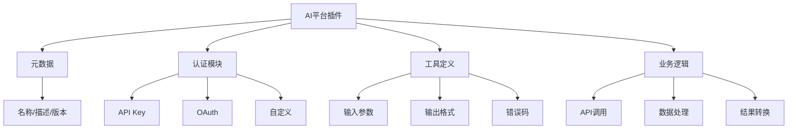

# AI平台插件开发

> [!abstract] 摘要
> 本文档系统介绍主流AI平台的插件开发方法，包括Dify插件开发、n8n自定义节点、Coze插件SDK以及OpenAI兼容格式开发。通过详细的代码示例和实战项目，帮助开发者构建可扩展的AI能力。

## 核心关键词速览

| 关键词 | 说明 | 关键词 | 说明 |
|--------|------|--------|------|
| Dify插件 | Dify扩展能力 | n8n自定义节点 | 节点开发 |
| Coze SDK | Coze插件开发 | OpenAI格式 | 兼容开发 |
| API导入 | 快速集成 | OAuth认证 | 安全认证 |
| 工具定义 | Tool Schema | 认证管理 | 凭证安全 |

## 1. 插件开发概述

### 1.1 插件架构对比

| 平台 | 插件类型 | 开发语言 | 扩展方式 |
|------|----------|----------|----------|
| Dify | 工具/模型/插件包 | Python | 代码+配置 |
| n8n | 自定义节点 | TypeScript | npm包 |
| Coze | 插件/机器人 | API规范 | OpenAPI导入 |
| LangChain | 工具/工具包 | Python/JS | 装饰器 |

### 1.2 插件核心要素



## 2. Dify插件开发

### 2.1 插件结构

```
dify_plugin/
├── __init__.py
├── manifest.yaml           # 插件元数据
├── credentials.py         # 认证配置
├── tools/
│   ├── __init__.py
│   ├── my_tool.py         # 工具实现
│   └── tool.yaml          # 工具定义
└── README.md
```

### 2.2 插件元数据

```yaml
# manifest.yaml
identifier: "my-ai-plugin"
name: "我的AI插件"
description: "提供天气预报、新闻搜索等能力"
version: "1.0.0"
author: "Developer <dev@example.com>"
homepage: "https://github.com/example/dify-plugin"
icon: "icon.png"

# 插件类型
type: "official"  # official//community/custom

# 依赖
dependencies:
  requests: "^2.28.0"
  aiohttp: "^3.8.0"

# 需要的凭证
credentials:
  - name: "api_key"
    label: "API密钥"
    type: "secret-input"
    required: true
    placeholder: "请输入API密钥"
```

### 2.3 认证配置

```python
# credentials.py
from typing import Optional
from pydantic import BaseModel

class MyPluginCredentials(BaseModel):
    """凭证模型"""
    api_key: str
    base_url: str = "https://api.example.com"
    
    def validate(self) -> bool:
        """验证凭证有效性"""
        # 可以在这里调用验证接口
        return bool(self.api_key and len(self.api_key) > 10)
    
    def headers(self) -> dict:
        """获取认证头"""
        return {
            "Authorization": f"Bearer {self.api_key}",
            "Content-Type": "application/json"
        }
```

### 2.4 工具实现

```python
# tools/my_tool.py
import requests
from typing import Dict, Any, List
from dify_plugin import Tool, ToolService

class WeatherTool(Tool):
    """天气查询工具"""
    
    # 工具元数据
    name = "get_weather"
    description = "获取指定城市的天气信息，支持国内外城市查询"
    parameters = {
        "type": "object",
        "properties": {
            "city": {
                "type": "string",
                "description": "城市名称，支持中英文，如'北京'、'Shanghai'"
            },
            "unit": {
                "type": "string",
                "enum": ["celsius", "fahrenheit"],
                "default": "celsius",
                "description": "温度单位"
            }
        },
        "required": ["city"]
    }
    
    def invoke(self, tool_parameters: Dict[str, Any]) -> Dict[str, Any]:
        """执行工具"""
        city = tool_parameters.get("city")
        unit = tool_parameters.get("unit", "celsius")
        
        # 获取凭证
        credentials = self.get_credentials()
        
        # 调用API
        try:
            response = requests.get(
                f"{credentials.base_url}/weather",
                params={"city": city, "unit": unit},
                headers=credentials.headers(),
                timeout=10
            )
            response.raise_for_status()
            data = response.json()
            
            return {
                "success": True,
                "data": {
                    "city": data.get("location"),
                    "temperature": data.get("temp"),
                    "weather": data.get("condition"),
                    "humidity": data.get("humidity"),
                    "wind": data.get("wind_speed")
                }
            }
        except requests.RequestException as e:
            return {
                "success": False,
                "error": f"API调用失败: {str(e)}"
            }
    
    def validate_credentials(self, credentials: Dict) -> bool:
        """验证凭证"""
        return bool(credentials.get("api_key"))
```

### 2.5 工具定义YAML

```yaml
# tools/tool.yaml
tools:
  - name: get_weather
    label: "查询天气"
    description: "获取城市天气信息"
    parameters:
      - name: city
        type: string
        required: true
        label: "城市"
      - name: unit
        type: select
        required: false
        default: celsius
        options:
          - value: celsius
            label: "摄氏度"
          - value: fahrenheit
            label: "华氏度"
  
  - name: search_news
    label: "搜索新闻"
    description: "搜索相关新闻资讯"
    parameters:
      - name: keyword
        type: string
        required: true
        label: "关键词"
      - name: limit
        type: number
        required: false
        default: 10
        label: "返回数量"
```

## 3. n8n自定义节点开发

### 3.1 节点项目结构

```
n8n-nodes-myplugin/
├── package.json
├── src/
│   ├── nodes/
│   │   └── MyNode/
│   │       ├── MyNode.ts
│   │       └── MyNodeDescription.ts
│   └── credentials/
│       └── MyCredentialsApi.ts
├── README.md
└── tsconfig.json
```

### 3.2 节点包配置

```json
{
  "name": "n8n-nodes-myplugin",
  "version": "1.0.0",
  "description": "我的自定义n8n节点",
  "keywords": ["n8n", "nodes", "myplugin"],
  "license": "MIT",
  "n8n": {
    "nodes": ["dist/MyNode.node.js"]
  },
  "dependencies": {
    "n8n-core": "*"
  },
  "devDependencies": {
    "typescript": "^5.0.0",
    "@types/node": "^18.0.0",
    "ts-node": "^10.0.0"
  }
}
```

### 3.3 节点描述定义

```typescript
// src/nodes/MyNode/MyNodeDescription.ts
import type { INodeTypeDescription } from 'n8n-workflow';

export const myNodeDescription: INodeTypeDescription = {
  displayName: '我的自定义节点',
  name: 'myNode',
  group: ['transform'],
  version: 1,
  description: '执行自定义逻辑的n8n节点',
  defaults: {
    name: '我的节点',
  },
  inputs: ['main'],
  outputs: ['main'],
  credentials: [
    {
      name: 'myCredentialsApi',
      required: true,
    },
  ],
  properties: [
    {
      displayName: '操作模式',
      name: 'operation',
      type: 'options',
      options: [
        {
          name: '处理数据',
          value: 'process',
          description: '处理输入数据',
        },
        {
          name: '转换格式',
          value: 'transform',
          description: '转换数据格式',
        },
      ],
      default: 'process',
      required: true,
    },
    {
      displayName: '处理规则',
      name: 'rules',
      type: 'string',
      displayOptions: {
        show: {
          operation: ['process'],
        },
      },
      default: '',
      placeholder: '输入处理规则',
      description: '定义数据处理规则，支持JSONata表达式',
    },
  ],
};
```

### 3.4 节点实现

```typescript
// src/nodes/MyNode/MyNode.ts
import {
  IExecuteFunctions,
  INodeType,
  INodeTypeDescription,
} from 'n8n-workflow';
import { myNodeDescription } from './MyNodeDescription';

export class MyNode implements INodeType {
  description: INodeTypeDescription = myNodeDescription;

  async execute(this: IExecuteFunctions) {
    const items = this.getInputData();
    const returnData: any[] = [];
    
    // 获取节点参数
    const operation = this.getNodeParameter('operation', 0) as string;
    
    for (let i = 0; i < items.length; i++) {
      try {
        const item = items[i].json;
        
        if (operation === 'process') {
          const rules = this.getNodeParameter('rules', i) as string;
          
          // 处理逻辑
          const result = await this.processItem(item, rules);
          returnData.push({ json: result });
          
        } else if (operation === 'transform') {
          // 转换逻辑
          const result = this.transformItem(item);
          returnData.push({ json: result });
        }
      } catch (error) {
        // 错误处理
        if (this.continueOnFail()) {
          returnData.push({ json: { error: error.message } });
        } else {
          throw error;
        }
      }
    }
    
    return [returnData];
  }
  
  private async processItem(item: any, rules: string): Promise<any> {
    // 实际处理逻辑
    return {
      ...item,
      processed: true,
      timestamp: new Date().toISOString(),
    };
  }
  
  private transformItem(item: any): any {
    // 转换逻辑
    return {
      id: item.id,
      name: item.name?.toUpperCase(),
      value: item.value * 1.1,
    };
  }
}
```

### 3.5 凭证定义

```typescript
// src/credentials/MyCredentialsApi.ts
import {
  ICredentialType,
  INodeProperties,
} from 'n8n-workflow';

export class MyCredentialsApi implements ICredentialType {
  name = 'myCredentialsApi';
  displayName = '我的API凭证';
  documentationUrl = 'https://docs.example.com/api';
  
  properties: INodeProperties[] = [
    {
      displayName: 'API Key',
      name: 'apiKey',
      type: 'string',
      typeOptions: {
        password: true,
      },
      default: '',
      description: '从API控制台获取的API密钥',
    },
    {
      displayName: 'Base URL',
      name: 'baseUrl',
      type: 'string',
      default: 'https://api.example.com',
      description: 'API基础URL',
    },
  ];
}
```

## 4. Coze插件开发

### 4.1 Coze插件格式

Coze支持通过OpenAPI规范导入插件：

```yaml
# Coze插件定义 (coze_plugin.yaml)
schema: "coze.plugin.1.0"

info:
  name: "企业服务插件"
  description: "提供企业相关的查询和管理服务"
  version: "1.0.0"
  icon: "https://example.com/icon.png"

# API定义
apis:
  - name: "query_employee"
    description: "查询员工信息"
    method: "GET"
    path: "/api/v1/employees/{employee_id}"
    
    headers:
      Authorization: "Bearer {{credentials.api_key}}"
    
    path_parameters:
      - name: "employee_id"
        type: "string"
        required: true
        description: "员工ID"
    
    response:
      schema: |
        {
          "employee_id": "string",
          "name": "string",
          "department": "string",
          "email": "string",
          "position": "string"
        }
  
  - name: "create_task"
    description: "创建任务"
    method: "POST"
    path: "/api/v1/tasks"
    
    body:
      type: "object"
      properties:
        title:
          type: "string"
          required: true
        assignee:
          type: "string"
        due_date:
          type: "string"
          format: "date-time"
```

### 4.2 Coze JavaScript SDK

```javascript
// coze-plugin-sdk-example/index.js
const { CozePlugin } = require('@coze/sdk');

class MyPlugin extends CozePlugin {
  constructor() {
    super({
      name: 'my-plugin',
      version: '1.0.0',
      description: '我的Coze插件'
    });
    
    this.registerTool('get_data', this.getData.bind(this));
    this.registerTool('process_data', this.processData.bind(this));
  }
  
  async getData(params) {
    const { query, limit = 10 } = params;
    
    // 实现获取数据的逻辑
    return {
      success: true,
      data: [
        { id: 1, content: `Result for: ${query}` }
      ],
      total: limit
    };
  }
  
  async processData(params) {
    const { data, operation } = params;
    
    switch (operation) {
      case 'transform':
        return this.transform(data);
      case 'aggregate':
        return this.aggregate(data);
      default:
        throw new Error(`Unknown operation: ${operation}`);
    }
  }
  
  transform(data) {
    return data.map(item => ({
      ...item,
      transformed: true,
      timestamp: Date.now()
    }));
  }
  
  aggregate(data) {
    return {
      count: data.length,
      sum: data.reduce((acc, item) => acc + (item.value || 0), 0),
      avg: data.reduce((acc, item) => acc + (item.value || 0), 0) / data.length
    };
  }
}

// 导出
module.exports = MyPlugin;
```

## 5. OpenAI兼容格式开发

### 5.1 工具定义格式

```typescript
// OpenAI兼容的工具定义
interface OpenAITool {
  type: 'function';
  function: {
    name: string;
    description: string;
    parameters: {
      type: 'object';
      properties: Record<string, ToolProperty>;
      required: string[];
    };
  };
}

interface ToolProperty {
  type: 'string' | 'number' | 'integer' | 'boolean' | 'array' | 'object';
  description?: string;
  enum?: string[];
  default?: any;
  minimum?: number;
  maximum?: number;
  format?: string;
}
```

### 5.2 统一工具注册表

```typescript
// unified-tool-registry.ts
interface Tool {
  name: string;
  description: string;
  parameters: Record<string, ToolProperty>;
  handler: (params: any) => Promise<any>;
}

class UnifiedToolRegistry {
  private tools: Map<string, Tool> = new Map();
  
  register(tool: Tool): void {
    this.tools.set(tool.name, tool);
  }
  
  // 转换为OpenAI格式
  toOpenAIFormat(): OpenAITool[] {
    return Array.from(this.tools.values()).map(tool => ({
      type: 'function',
      function: {
        name: tool.name,
        description: tool.description,
        parameters: {
          type: 'object',
          properties: tool.parameters,
          required: Object.entries(tool.parameters)
            .filter(([_, p]) => p.required)
            .map(([name]) => name)
        }
      }
    }));
  }
  
  // 转换为Claude格式
  toClaudeFormat(): any[] {
    return Array.from(this.tools.values()).map(tool => ({
      name: tool.name,
      description: tool.description,
      input_schema: {
        type: 'object',
        properties: tool.parameters,
        required: Object.entries(tool.parameters)
          .filter(([_, p]) => p.required)
            .map(([name]) => name)
      }
    }));
  }
  
  // 执行工具
  async execute(toolName: string, params: any): Promise<any> {
    const tool = this.tools.get(toolName);
    if (!tool) {
      throw new Error(`Tool not found: ${toolName}`);
    }
    
    return await tool.handler(params);
  }
}
```

### 5.3 工具实现示例

```typescript
// tools/weather.ts
const weatherTool: Tool = {
  name: 'get_weather',
  description: '获取指定城市的天气信息',
  parameters: {
    city: {
      type: 'string',
      description: '城市名称',
      required: true
    },
    unit: {
      type: 'string',
      enum: ['celsius', 'fahrenheit'],
      description: '温度单位',
      default: 'celsius'
    }
  },
  handler: async (params) => {
    const { city, unit = 'celsius' } = params;
    
    // 实际API调用
    const response = await fetch(
      `https://api.weather.com/v1?city=${city}&unit=${unit}`
    );
    
    if (!response.ok) {
      throw new Error(`Weather API error: ${response.status}`);
    }
    
    const data = await response.json();
    
    return {
      city: data.location,
      temperature: data.temp,
      condition: data.condition,
      humidity: data.humidity,
      unit
    };
  }
};

// 注册到工具表
registry.register(weatherTool);
```

## 6. 认证与安全

### 6.1 凭证管理

```typescript
interface CredentialStore {
  save(key: string, value: string): Promise<void>;
  get(key: string): Promise<string | null>;
  delete(key: string): Promise<void>;
}

class EncryptedCredentialStore implements CredentialStore {
  private encryptionKey: Buffer;
  
  constructor(key: Buffer) {
    this.encryptionKey = key;
  }
  
  async save(key: string, value: string): Promise<void> {
    const encrypted = this.encrypt(value);
    await this.storage.set(key, encrypted);
  }
  
  async get(key: string): Promise<string | null> {
    const encrypted = await this.storage.get(key);
    if (!encrypted) return null;
    return this.decrypt(encrypted);
  }
  
  private encrypt(data: string): string {
    // 使用AES加密
    const iv = crypto.randomBytes(16);
    const cipher = crypto.createCipheriv('aes-256-cbc', this.encryptionKey, iv);
    return iv.toString('hex') + ':' + cipher.update(data, 'utf8', 'hex') + ':' + cipher.final('hex');
  }
  
  private decrypt(encrypted: string): string {
    const [ivHex, dataHex] = encrypted.split(':');
    const iv = Buffer.from(ivHex, 'hex');
    const decipher = crypto.createDecipheriv('aes-256-cbc', this.encryptionKey, iv);
    return decipher.update(dataHex, 'hex', 'utf8') + decipher.final('utf8');
  }
}
```

### 6.2 OAuth认证

```typescript
// OAuth 2.0集成
class OAuthHandler {
  constructor(
    private clientId: string,
    private clientSecret: string,
    private redirectUri: string,
    private tokenEndpoint: string,
    private authorizeEndpoint: string
  ) {}
  
  getAuthorizationUrl(state: string): string {
    const params = new URLSearchParams({
      client_id: this.clientId,
      redirect_uri: this.redirectUri,
      response_type: 'code',
      scope: 'read write',
      state
    });
    
    return `${this.authorizeEndpoint}?${params.toString()}`;
  }
  
  async exchangeCodeForToken(code: string): Promise<OAuthToken> {
    const response = await fetch(this.tokenEndpoint, {
      method: 'POST',
      headers: {
        'Content-Type': 'application/x-www-form-urlencoded',
        'Authorization': `Basic ${Buffer.from(
          `${this.clientId}:${this.clientSecret}`
        ).toString('base64')}`
      },
      body: new URLSearchParams({
        grant_type: 'authorization_code',
        code,
        redirect_uri: this.redirectUri
      })
    });
    
    if (!response.ok) {
      throw new Error(`Token exchange failed: ${response.status}`);
    }
    
    return response.json();
  }
  
  async refreshToken(refreshToken: string): Promise<OAuthToken> {
    const response = await fetch(this.tokenEndpoint, {
      method: 'POST',
      headers: {
        'Content-Type': 'application/x-www-form-urlencoded',
        'Authorization': `Basic ${Buffer.from(
          `${this.clientId}:${this.clientSecret}`
        ).toString('base64')}`
      },
      body: new URLSearchParams({
        grant_type: 'refresh_token',
        refresh_token: refreshToken
      })
    });
    
    return response.json();
  }
}
```

## 7. 相关资源

- [[Function_Calling与工具调用]] - 函数调用规范
- [[n8n与LLM集成]] - n8n AI能力
- [[扣子Bot开发]] - Coze Bot开发
- [[AI应用API化部署]] - API部署方案

---

*本文档由归愚知识系统自动生成 last updated: 2026-04-18*
