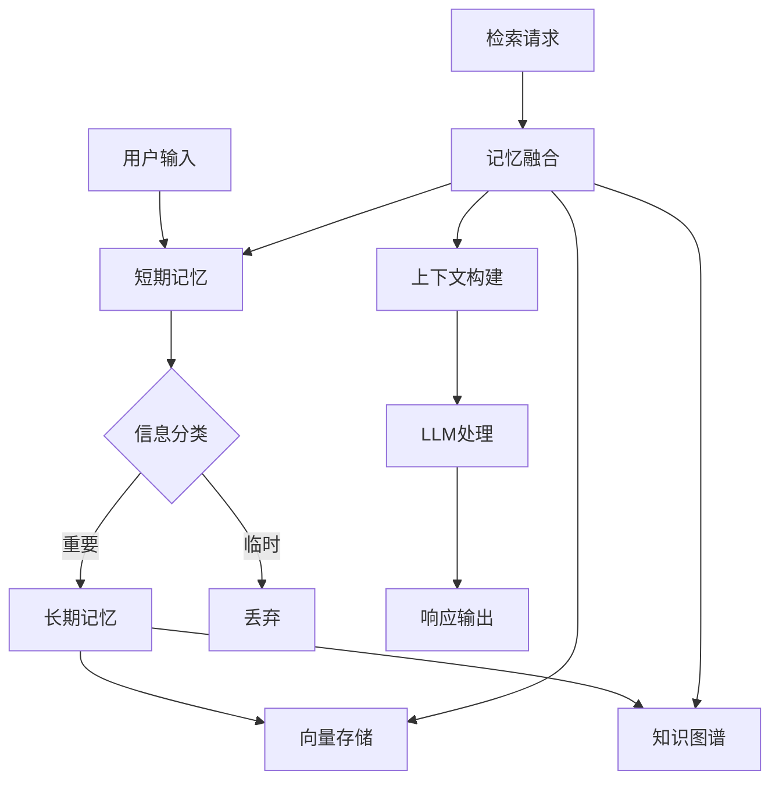
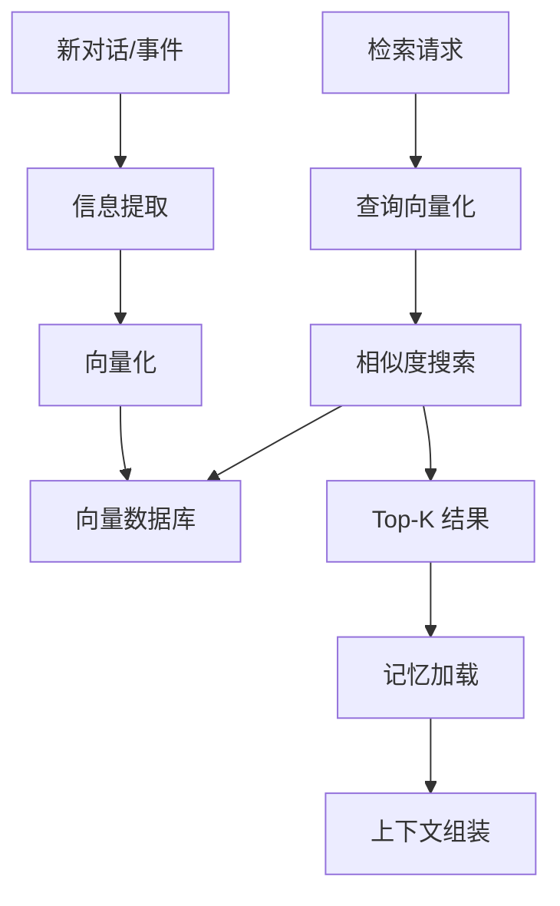

# AI对话记忆系统

> [!abstract] 摘要
> 本文档详细介绍AI对话记忆系统的设计与实现，包括短期记忆（Buffer Memory）、长期记忆（向量存储）、知识图谱记忆以及个性化记忆系统。通过详细的架构设计和代码实现，帮助开发者构建具备持久上下文理解能力的AI智能体。

## 核心关键词速览

| 关键词 | 说明 | 关键词 | 说明 |
|--------|------|--------|------|
| 短期记忆 | Buffer Memory | 长期记忆 | Vector Store |
| 知识图谱 | Knowledge Graph | 向量检索 | Vector Search |
| 记忆压缩 | Summarization | 语义相似度 | Semantic Similarity |
| RAG | 检索增强生成 | 记忆检索 | Memory Retrieval |
| 上下文窗口 | Context Window | 记忆融合 | Memory Fusion |

## 1. 记忆系统概述

### 1.1 记忆层级架构



### 1.2 记忆类型对比

| 记忆类型 | 存储方式 | 容量 | 生命周期 | 适用场景 |
|----------|----------|------|----------|----------|
| 短期记忆 | 内存/缓存 | Token限制 | 会话内 | 当前对话 |
| 长期记忆 | 向量数据库 | 无限 | 持久 | 知识累积 |
| 工作记忆 | 内存 | 有限 | 任务内 | 任务执行 |
| 情景记忆 | 图数据库 | 无限 | 持久 | 事件序列 |
| 程序记忆 | 代码/规则 | 固定 | 持久 | 技能保持 |

## 2. 短期记忆实现

### 2.1 Buffer Memory

```python
from typing import List, Dict, Any, Optional
from dataclasses import dataclass, field
from datetime import datetime
import json

@dataclass
class Message:
    """消息结构"""
    role: str  # system/user/assistant
    content: str
    timestamp: datetime = field(default_factory=datetime.now)
    metadata: Dict[str, Any] = field(default_factory=dict)

class BufferMemory:
    """Buffer Memory - 固定窗口短期记忆"""
    
    def __init__(self, window_size: int = 10):
        self.window_size = window_size
        self.messages: List[Message] = []
    
    def add_message(self, role: str, content: str, metadata: Dict = None) -> None:
        """添加消息"""
        message = Message(
            role=role,
            content=content,
            metadata=metadata or {}
        )
        self.messages.append(message)
        
        # 保持窗口大小
        if len(self.messages) > self.window_size:
            self.messages.pop(0)
    
    def get_messages(self) -> List[Message]:
        """获取所有消息"""
        return self.messages.copy()
    
    def get_context(self) -> str:
        """获取格式化上下文"""
        return "\n".join([
            f"{msg.role}: {msg.content}"
            for msg in self.messages
        ])
    
    def clear(self) -> None:
        """清空记忆"""
        self.messages.clear()
    
    def get_token_count(self) -> int:
        """估算Token数（简单估算）"""
        return sum(len(msg.content) // 4 for msg in self.messages)
```

### 2.2 滑动窗口记忆

```python
class SlidingWindowMemory:
    """滑动窗口记忆 - 基于Token数"""
    
    def __init__(self, max_tokens: int = 4000):
        self.max_tokens = max_tokens
        self.messages: List[Message] = []
    
    def add_message(self, role: str, content: str) -> None:
        """添加消息，自动滑动"""
        self.messages.append(Message(role=role, content=content))
        self._trim_to_token_limit()
    
    def _trim_to_token_limit(self) -> None:
        """根据Token限制裁剪"""
        while self.get_token_count() > self.max_tokens and len(self.messages) > 1:
            # 优先保留系统消息和最新消息
            if self.messages[0].role == 'system':
                # 裁剪第二条消息
                if len(self.messages) > 2:
                    self.messages.pop(1)
                else:
                    self.messages.pop(0)
            else:
                self.messages.pop(0)
    
    def get_messages(self) -> List[Message]:
        """获取消息（保留系统消息）"""
        return self.messages.copy()
    
    def get_token_count(self) -> int:
        """Token估算"""
        return sum(len(m.content) // 4 for m in self.messages)
```

## 3. 长期记忆实现

### 3.1 向量存储架构



### 3.2 向量存储实现

```python
from typing import List, Dict, Any, Optional, Tuple
import numpy as np
from abc import ABC, abstractmethod
import hashlib
import json

class VectorStore(ABC):
    """向量存储抽象基类"""
    
    @abstractmethod
    async def add(
        self,
        id: str,
        embedding: List[float],
        metadata: Dict[str, Any]
    ) -> None:
        pass
    
    @abstractmethod
    async def search(
        self,
        query_embedding: List[float],
        top_k: int = 5,
        filter: Dict = None
    ) -> List[Dict]:
        pass
    
    @abstractmethod
    async def delete(self, id: str) -> None:
        pass

class InMemoryVectorStore(VectorStore):
    """内存向量存储（开发环境使用）"""
    
    def __init__(self, dimension: int = 1536):
        self.dimension = dimension
        self.vectors: Dict[str, np.ndarray] = {}
        self.metadata: Dict[str, Dict] = {}
    
    async def add(
        self,
        id: str,
        embedding: List[float],
        metadata: Dict[str, Any]
    ) -> None:
        self.vectors[id] = np.array(embedding)
        self.metadata[id] = metadata
    
    async def search(
        self,
        query_embedding: List[float],
        top_k: int = 5,
        filter: Dict = None
    ) -> List[Dict]:
        if not self.vectors:
            return []
        
        query_vec = np.array(query_embedding)
        
        # 计算余弦相似度
        results = []
        for id, vec in self.vectors.items():
            # 过滤
            if filter:
                if not all(
                    self.metadata[id].get(k) == v
                    for k, v in filter.items()
                ):
                    continue
            
            # 相似度计算
            similarity = self._cosine_similarity(query_vec, vec)
            results.append({
                'id': id,
                'score': float(similarity),
                'metadata': self.metadata[id]
            })
        
        # 排序并返回Top-K
        results.sort(key=lambda x: x['score'], reverse=True)
        return results[:top_k]
    
    async def delete(self, id: str) -> None:
        self.vectors.pop(id, None)
        self.metadata.pop(id, None)
    
    @staticmethod
    def _cosine_similarity(a: np.ndarray, b: np.ndarray) -> float:
        """计算余弦相似度"""
        dot = np.dot(a, b)
        norm_a = np.linalg.norm(a)
        norm_b = np.linalg.norm(b)
        return dot / (norm_a * norm_b + 1e-8)

class PineconeVectorStore(VectorStore):
    """Pinecone向量存储（生产环境）"""
    
    def __init__(self, api_key: str, environment: str, index_name: str):
        import pinecone
        self.pinecone = pinecone
        pinecone.init(api_key=api_key, environment=environment)
        self.index = pinecone.Index(index_name)
    
    async def add(
        self,
        id: str,
        embedding: List[float],
        metadata: Dict[str, Any]
    ) -> None:
        await self.index.upsert([(id, embedding, metadata)])
    
    async def search(
        self,
        query_embedding: List[float],
        top_k: int = 5,
        filter: Dict = None
    ) -> List[Dict]:
        result = await self.index.query(
            vector=query_embedding,
            top_k=top_k,
            filter=filter,
            include_metadata=True
        )
        
        return [
            {
                'id': match['id'],
                'score': match['score'],
                'metadata': match.get('metadata', {})
            }
            for match in result['matches']
        ]
    
    async def delete(self, id: str) -> None:
        await self.index.delete(ids=[id])
```

### 3.3 记忆存储服务

```python
from typing import Optional
import hashlib

class MemoryService:
    """记忆服务"""
    
    def __init__(
        self,
        vector_store: VectorStore,
        embedding_model: str = "text-embedding-3-small"
    ):
        self.vector_store = vector_store
        self.embedding_model = embedding_model
        self._client = None  # OpenAI client
    
    async def store_interaction(
        self,
        user_id: str,
        session_id: str,
        user_message: str,
        assistant_response: str,
        metadata: Dict = None
    ) -> str:
        """存储对话交互"""
        # 生成唯一ID
        content = f"用户: {user_message}\n助手: {assistant_response}"
        memory_id = self._generate_id(user_id, session_id, content)
        
        # 向量化
        embedding = await self._get_embedding(content)
        
        # 存储
        await self.vector_store.add(
            id=memory_id,
            embedding=embedding,
            metadata={
                'user_id': user_id,
                'session_id': session_id,
                'user_message': user_message,
                'assistant_response': assistant_response,
                'timestamp': datetime.now().isoformat(),
                **(metadata or {})
            }
        )
        
        return memory_id
    
    async def retrieve_memories(
        self,
        user_id: str,
        query: str,
        top_k: int = 5,
        session_id: Optional[str] = None
    ) -> List[Dict]:
        """检索相关记忆"""
        # 向量化查询
        query_embedding = await self._get_embedding(query)
        
        # 构建过滤条件
        filter_conditions = {'user_id': user_id}
        if session_id:
            filter_conditions['session_id'] = session_id
        
        # 检索
        results = await self.vector_store.search(
            query_embedding=query_embedding,
            top_k=top_k,
            filter=filter_conditions
        )
        
        return results
    
    async def _get_embedding(self, text: str) -> List[float]:
        """获取文本向量"""
        if not self._client:
            from openai import OpenAI
            self._client = OpenAI()
        
        response = self._client.embeddings.create(
            model=self.embedding_model,
            input=text
        )
        
        return response.data[0].embedding
    
    def _generate_id(self, *parts) -> str:
        """生成唯一ID"""
        content = "|".join(str(p) for p in parts)
        return hashlib.md5(content.encode()).hexdigest()[:16]
```

## 4. 知识图谱记忆

### 4.1 图谱存储设计

```python
from typing import List, Dict, Any, Optional, Set
from dataclasses import dataclass
from enum import Enum

class EntityType(Enum):
    """实体类型"""
    PERSON = "person"
    ORGANIZATION = "organization"
    LOCATION = "location"
    EVENT = "event"
    CONCEPT = "concept"
    OBJECT = "object"

class RelationType(Enum):
    """关系类型"""
    WORKS_FOR = "works_for"
    LOCATED_IN = "located_in"
    PARTICIPATED_IN = "participated_in"
    KNOWS = "knows"
    RELATED_TO = "related_to"
    IS_A = "is_a"

@dataclass
class Entity:
    """实体"""
    id: str
    type: EntityType
    name: str
    properties: Dict[str, Any]
    created_at: datetime

@dataclass
class Relation:
    """关系"""
    id: str
    source_id: str
    target_id: str
    type: RelationType
    properties: Dict[str, Any]
    created_at: datetime

class KnowledgeGraph:
    """知识图谱"""
    
    def __init__(self):
        self.entities: Dict[str, Entity] = {}
        self.relations: Dict[str, Relation] = {}
        self.adjacency: Dict[str, Set[str]] = {}  # 邻接表
    
    def add_entity(self, entity: Entity) -> None:
        """添加实体"""
        self.entities[entity.id] = entity
        self.adjacency.setdefault(entity.id, set())
    
    def add_relation(self, relation: Relation) -> None:
        """添加关系"""
        self.relations[relation.id] = relation
        
        # 更新邻接表
        self.adjacency.setdefault(relation.source_id, set()).add(relation.target_id)
        self.adjacency.setdefault(relation.target_id, set()).add(relation.source_id)
    
    def get_entity(self, entity_id: str) -> Optional[Entity]:
        """获取实体"""
        return self.entities.get(entity_id)
    
    def get_neighbors(
        self,
        entity_id: str,
        depth: int = 1,
        relation_type: RelationType = None
    ) -> List[tuple]:
        """获取邻居节点"""
        result = []
        visited = set()
        
        def dfs(current_id: str, current_depth: int):
            if current_depth > depth:
                return
            
            for relation in self._get_relations(current_id):
                if relation_type and relation.type != relation_type:
                    continue
                
                neighbor_id = relation.target_id if relation.source_id == current_id else relation.source_id
                
                if neighbor_id not in visited:
                    visited.add(neighbor_id)
                    result.append((neighbor_id, relation))
                    dfs(neighbor_id, current_depth + 1)
        
        dfs(entity_id, 0)
        return result
    
    def _get_relations(self, entity_id: str) -> List[Relation]:
        """获取实体的所有关系"""
        return [
            r for r in self.relations.values()
            if r.source_id == entity_id or r.target_id == entity_id
        ]
    
    def query_path(
        self,
        source_id: str,
        target_id: str,
        max_depth: int = 3
    ) -> List[List[str]]:
        """查询两点间的路径"""
        paths = []
        
        def dfs(current: str, path: List[str]):
            if len(path) > max_depth:
                return
            if current == target_id:
                paths.append(path.copy())
                return
            
            for neighbor in self.adjacency.get(current, set()):
                if neighbor not in path:
                    path.append(neighbor)
                    dfs(neighbor, path)
                    path.pop()
        
        dfs(source_id, [source_id])
        return paths
```

### 4.2 从对话中提取知识

```python
class KnowledgeExtractor:
    """知识提取器"""
    
    def __init__(self, llm_client):
        self.llm = llm_client
    
    async def extract_from_conversation(
        self,
        conversation: str
    ) -> Dict[str, Any]:
        """从对话中提取知识"""
        prompt = f"""
从以下对话中提取实体和关系：

{conversation}

请以JSON格式返回：
{{
    "entities": [
        {{"name": "实体名", "type": "实体类型", "properties": {{}}}}
    ],
    "relations": [
        {{"source": "实体1", "target": "实体2", "type": "关系类型"}}
    ]
}}

实体类型：person, organization, location, event, concept, object
关系类型：works_for, located_in, participated_in, knows, related_to, is_a
"""
        
        response = await self.llm.chat(prompt)
        return json.loads(response)
```

## 5. 记忆检索与融合

### 5.1 多记忆源检索

```python
class MemoryRetriever:
    """记忆检索器"""
    
    def __init__(
        self,
        short_term: BufferMemory,
        long_term: MemoryService,
        knowledge_graph: KnowledgeGraph
    ):
        self.short_term = short_term
        self.long_term = long_term
        self.knowledge_graph = knowledge_graph
    
    async def retrieve(
        self,
        user_id: str,
        query: str,
        include_short_term: bool = True,
        include_long_term: bool = True,
        include_graph: bool = True,
        top_k: int = 5
    ) -> Dict[str, Any]:
        """多源检索"""
        results = {
            'short_term': [],
            'long_term': [],
            'graph': [],
            'context': []
        }
        
        # 短期记忆检索
        if include_short_term:
            results['short_term'] = self._search_short_term(query)
        
        # 长期记忆检索
        if include_long_term:
            results['long_term'] = await self.long_term.retrieve_memories(
                user_id=user_id,
                query=query,
                top_k=top_k
            )
        
        # 知识图谱检索
        if include_graph:
            results['graph'] = self._search_graph(query)
        
        # 融合构建上下文
        results['context'] = self._fuse_context(results)
        
        return results
    
    def _search_short_term(self, query: str) -> List[Dict]:
        """搜索短期记忆"""
        # 简单关键词匹配
        messages = self.short_term.get_messages()
        relevant = []
        
        for msg in messages:
            if any(kw in msg.content.lower() for kw in query.lower().split()):
                relevant.append({
                    'role': msg.role,
                    'content': msg.content,
                    'score': 1.0
                })
        
        return relevant
    
    async def _search_long_term(self, query: str, top_k: int) -> List[Dict]:
        """搜索长期记忆"""
        # 向量相似度检索
        return await self.long_term.vector_store.search(
            query_embedding=await self.long_term._get_embedding(query),
            top_k=top_k
        )
    
    def _search_graph(self, query: str) -> List[Dict]:
        """搜索知识图谱"""
        # 简化实现：查找包含关键词的实体
        results = []
        keywords = query.lower().split()
        
        for entity in self.knowledge_graph.entities.values():
            if any(kw in entity.name.lower() for kw in keywords):
                results.append({
                    'entity': entity,
                    'neighbors': self.knowledge_graph.get_neighbors(entity.id)
                })
        
        return results
    
    def _fuse_context(self, results: Dict) -> str:
        """融合多源记忆构建上下文"""
        context_parts = []
        
        # 添加图谱知识
        if results['graph']:
            context_parts.append("相关背景知识：")
            for item in results['graph'][:2]:
                entity = item['entity']
                context_parts.append(f"- {entity.name}（{entity.type.value}）")
        
        # 添加历史对话
        if results['long_term']:
            context_parts.append("\n相关历史对话：")
            for item in results['long_term'][:2]:
                context_parts.append(f"用户：{item['metadata'].get('user_message', '')}")
                context_parts.append(f"助手：{item['metadata'].get('assistant_response', '')}")
        
        # 添加当前对话
        if results['short_term']:
            context_parts.append("\n当前对话：")
            for item in results['short_term']:
                context_parts.append(f"{item['role']}：{item['content']}")
        
        return "\n".join(context_parts)
```

### 5.2 上下文组装

```python
class ContextBuilder:
    """上下文构建器"""
    
    def __init__(
        self,
        max_tokens: int = 4000,
        system_prompt: str = ""
    ):
        self.max_tokens = max_tokens
        self.system_prompt = system_prompt
    
    def build(
        self,
        system_template: str,
        memory_context: str,
        recent_messages: List[Message],
        user_input: str
    ) -> List[Dict]:
        """构建完整的对话上下文"""
        messages = []
        
        # 系统提示词
        if self.system_prompt:
            messages.append({
                "role": "system",
                "content": self.system_prompt
            })
        
        # 记忆上下文
        if memory_context:
            messages.append({
                "role": "system",
                "content": f"相关记忆：\n{memory_context}"
            })
        
        # 近期消息
        for msg in recent_messages:
            messages.append({
                "role": msg.role,
                "content": msg.content
            })
        
        # 用户输入
        messages.append({
            "role": "user",
            "content": user_input
        })
        
        # Token裁剪
        messages = self._trim_to_token_limit(messages)
        
        return messages
    
    def _trim_to_token_limit(self, messages: List[Dict]) -> List[Dict]:
        """根据Token限制裁剪"""
        while self._count_tokens(messages) > self.max_tokens and len(messages) > 2:
            # 优先裁剪早期消息
            if messages[1]["role"] == "system" and len(messages[1]["content"]) > 100:
                messages[1]["content"] = messages[1]["content"][:len(messages[1]["content"]) // 2] + "\n...(已截断)"
            else:
                messages.pop(1)
        
        return messages
    
    def _count_tokens(self, messages: List[Dict]) -> int:
        """估算Token数"""
        return sum(
            len(m["content"]) // 4
            for m in messages
        )
```

## 6. 个性化记忆

### 6.1 用户画像存储

```python
from typing import Dict, Any
import json

@dataclass
class UserProfile:
    """用户画像"""
    user_id: str
    name: Optional[str] = None
    preferences: Dict[str, Any] = field(default_factory=dict)
    interaction_style: str = "formal"  # formal/casual/technical
    topics_of_interest: List[str] = field(default_factory=list)
    communication_patterns: Dict[str, Any] = field(default_factory=dict)
    last_updated: datetime = field(default_factory=datetime.now)

class UserProfileManager:
    """用户画像管理器"""
    
    def __init__(self, db):
        self.db = db
        self._cache: Dict[str, UserProfile] = {}
    
    async def get_profile(self, user_id: str) -> UserProfile:
        """获取用户画像"""
        if user_id in self._cache:
            return self._cache[user_id]
        
        # 从数据库加载
        data = await self.db.user_profiles.find_one({"user_id": user_id})
        
        if data:
            profile = UserProfile(**data)
        else:
            profile = UserProfile(user_id=user_id)
        
        self._cache[user_id] = profile
        return profile
    
    async def update_profile(
        self,
        user_id: str,
        updates: Dict[str, Any]
    ) -> None:
        """更新用户画像"""
        profile = await self.get_profile(user_id)
        
        for key, value in updates.items():
            if hasattr(profile, key):
                setattr(profile, key, value)
        
        profile.last_updated = datetime.now()
        
        # 保存到数据库
        await self.db.user_profiles.update_one(
            {"user_id": user_id},
            {"$set": asdict(profile)},
            upsert=True
        )
        
        # 更新缓存
        self._cache[user_id] = profile
    
    async def learn_from_interaction(
        self,
        user_id: str,
        user_message: str,
        assistant_response: str
    ) -> None:
        """从交互中学习用户偏好"""
        # 简单规则学习
        profile = await self.get_profile(user_id)
        
        # 学习沟通风格
        if "!" in user_message or "?" in user_message:
            profile.interaction_style = "casual"
        elif any(word in user_message for word in ["分析", "评估", "建议"]):
            profile.interaction_style = "technical"
        
        # 学习兴趣话题
        topics = self._extract_topics(user_message)
        for topic in topics:
            if topic not in profile.topics_of_interest:
                profile.topics_of_interest.append(topic)
        
        await self.update_profile(user_id, asdict(profile))
    
    def _extract_topics(self, text: str) -> List[str]:
        """提取话题"""
        # 简化实现
        topic_keywords = {
            "技术": ["代码", "开发", "API", "系统"],
            "商业": ["市场", "销售", "运营", "增长"],
            "创意": ["设计", "创意", "灵感", "想法"]
        }
        
        found = []
        for topic, keywords in topic_keywords.items():
            if any(kw in text for kw in keywords):
                found.append(topic)
        
        return found
```

### 6.2 个性化响应适配

```python
class PersonalizedResponseBuilder:
    """个性化响应构建器"""
    
    def __init__(self, profile_manager: UserProfileManager):
        self.profile_manager = profile_manager
    
    async def adapt_response(
        self,
        base_response: str,
        user_id: str
    ) -> str:
        """适配响应风格"""
        profile = await self.profile_manager.get_profile(user_id)
        
        # 根据用户偏好调整
        if profile.interaction_style == "casual":
            response = self._make_casual(base_response)
        elif profile.interaction_style == "technical":
            response = self._add_technical_depth(base_response)
        else:
            response = base_response
        
        # 添加个性化元素
        if profile.topics_of_interest:
            response = self._add_personalized_content(response, profile)
        
        return response
    
    def _make_casual(self, text: str) -> str:
        """转为休闲风格"""
        replacements = {
            "您好": "嗨",
            "请问": "有啥",
            "感谢": "谢啦",
            "如果": "要是"
        }
        for formal, casual in replacements.items():
            text = text.replace(formal, casual)
        return text
    
    def _add_technical_depth(self, text: str) -> str:
        """添加技术细节"""
        # 简化实现
        return text + "\n\n如果需要更详细的技术实现方案，请告诉我。"
    
    def _add_personalized_content(
        self,
        text: str,
        profile: UserProfile
    ) -> str:
        """添加个性化内容"""
        if "技术" in profile.topics_of_interest:
            text += "\n\n另外，关于技术方面的问题，我可以帮你深入分析。"
        return text
```

## 7. 完整实战案例

### 7.1 记忆系统集成

```python
class ConversationalAgent:
    """具备记忆能力的对话Agent"""
    
    def __init__(self, config: dict):
        # 初始化各组件
        self.short_term = SlidingWindowMemory(
            max_tokens=config.get('short_term_tokens', 4000)
        )
        self.long_term = MemoryService(
            vector_store=self._init_vector_store(config),
            embedding_model=config.get('embedding_model', 'text-embedding-3-small')
        )
        self.knowledge_graph = KnowledgeGraph()
        self.retriever = MemoryRetriever(
            short_term=self.short_term,
            long_term=self.long_term,
            knowledge_graph=self.knowledge_graph
        )
        self.context_builder = ContextBuilder(
            max_tokens=config.get('context_limit', 8000)
        )
        self.llm = OpenAIChatClient(config['model'])
    
    async def chat(self, user_id: str, message: str) -> str:
        """对话处理"""
        # 1. 检索相关记忆
        memories = await self.retriever.retrieve(
            user_id=user_id,
            query=message,
            include_long_term=True,
            include_graph=True
        )
        
        # 2. 构建上下文
        messages = self.context_builder.build(
            system_template=self.system_prompt,
            memory_context=memories['context'],
            recent_messages=self.short_term.get_messages(),
            user_input=message
        )
        
        # 3. 调用LLM
        response = await self.llm.chat(messages)
        
        # 4. 更新记忆
        await self._update_memories(
            user_id=user_id,
            user_message=message,
            assistant_response=response
        )
        
        return response
    
    async def _update_memories(
        self,
        user_id: str,
        user_message: str,
        assistant_response: str
    ) -> None:
        """更新各类记忆"""
        # 短期记忆
        self.short_term.add_message("user", user_message)
        self.short_term.add_message("assistant", assistant_response)
        
        # 长期记忆（异步）
        await self.long_term.store_interaction(
            user_id=user_id,
            session_id=self.session_id,
            user_message=user_message,
            assistant_response=assistant_response
        )
        
        # 知识图谱
        extractor = KnowledgeExtractor(self.llm)
        knowledge = await extractor.extract_from_conversation(
            f"用户：{user_message}\n助手：{assistant_response}"
        )
        await self._integrate_knowledge(knowledge)
```

## 8. 相关资源

- [[n8n与LLM集成]] - n8n记忆节点配置
- [[多Agent系统设计]] - Agent间知识共享
- [[Function_Calling与工具调用]] - 工具调用设计
- [[AI应用API化部署]] - 记忆系统API化

---

*本文档由归愚知识系统自动生成 last updated: 2026-04-18*
