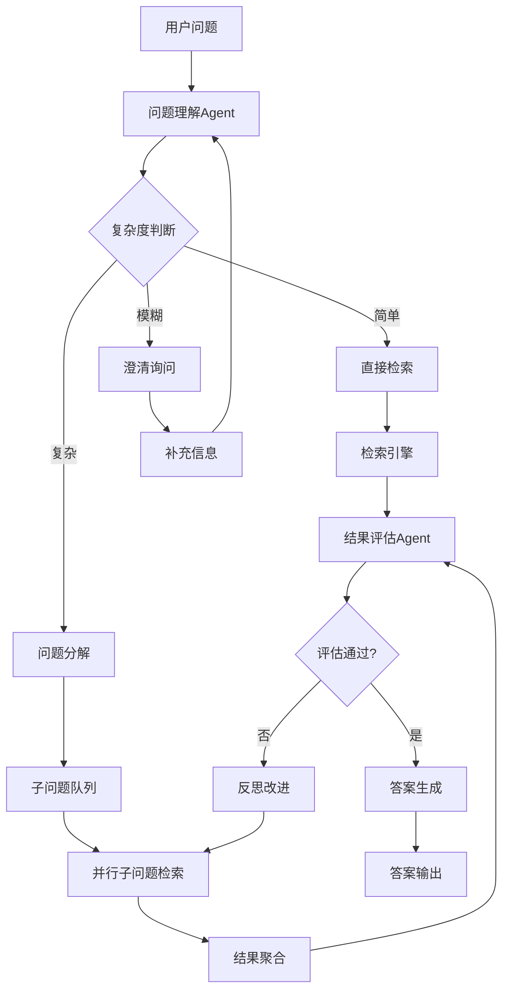

# Agentic RAG详解

> [!abstract] 摘要
> Agentic RAG是RAG系统的高级形态，通过引入AI Agent的决策能力，实现更智能、更自适应的检索-生成流程。本文档深入讲解自适应检索、子问题分解、反思机制、迭代优化和ReAct范式，帮助构建真正具备自主能力的知识库问答系统。

---

## 关键词速览

| 术语 | 英文 | 核心概念 |
|------|------|----------|
| Agentic RAG | Agentic RAG | 具备Agent决策能力的RAG系统 |
| 自适应检索 | Adaptive Retrieval | 根据上下文动态调整检索策略 |
| 子问题分解 | Sub-question Decomposition | 将复杂问题拆解为可检索的子问题 |
| 反思机制 | Reflection | 评估检索结果质量并决定是否迭代 |
| 迭代优化 | Iterative Refinement | 多轮检索-评估-优化循环 |
| ReAct | Reasoning + Acting | 推理与行动结合的Agent范式 |
| [[查询改写与扩展]] | Query Rewrite | 查询预处理 |
| [[知识图谱构建]] | Knowledge Graph | 结构化知识支持 |

---

## 一、Agentic RAG概述

### 1.1 从传统RAG到Agentic RAG

| 维度 | 传统RAG | Agentic RAG |
|------|---------|-------------|
| 检索触发 | 一次性 | 按需触发 |
| 查询处理 | 固定流程 | 动态策略 |
| 结果评估 | 无 | Agent评估 |
| 失败处理 | 返回低质量结果 | 迭代优化 |
| 多步推理 | 不支持 | 支持 |
| 外部工具调用 | 不支持 | 支持 |

### 1.2 Agentic RAG核心架构



---

## 二、ReAct范式

### 2.1 ReAct原理

ReAct（Reasoning + Acting）是一种将推理链（Chain of Thought）与工具调用（Tool Use）相结合的Agent范式：

| 阶段 | 动作 | 输出 |
|------|------|------|
| Thought | 思考当前状态 | 分析决策 |
| Action | 执行工具调用 | 检索结果 |
| Observation | 观察执行结果 | 状态更新 |

### 2.2 ReAct实现

```python
from enum import Enum
from typing import List, Dict, Optional, Callable, Any
from dataclasses import dataclass, field
import json

class ActionType(Enum):
    """Agent可执行的行动类型"""
    RETRIEVE = "retrieve"           # 信息检索
    REWRITE_QUERY = "rewrite"        # 改写查询
    DECOMPOSE = "decompose"          # 分解问题
    GENERATE = "generate"            # 生成答案
    REFINE = "refine"               # 精炼答案
    VERIFY = "verify"               # 验证答案
    CLARIFY = "clarify"             # 澄清问题
    FINISH = "finish"               # 完成任务

@dataclass
class ReActStep:
    """ReAct推理步骤"""
    step_id: int
    thought: str           # 思考过程
    action: ActionType     # 执行的动作
    action_input: Any     # 动作输入
    observation: Any      # 执行结果
    reasoning_score: float = 0.0  # 推理置信度

@dataclass
class ReActResult:
    """ReAct执行结果"""
    steps: List[ReActStep] = field(default_factory=list)
    final_answer: str = ""
    success: bool = False
    total_steps: int = 0
    reasoning_chain: str = ""

class ReActAgent:
    """ReAct推理Agent"""
    
    def __init__(
        self,
        llm_client,
        retriever,
        max_steps: int = 10,
        reflection_threshold: float = 0.6
    ):
        self.llm = llm_client
        self.retriever = retriever
        self.max_steps = max_steps
        self.reflection_threshold = reflection_threshold
        self.tools = self._register_tools()
    
    def _register_tools(self) -> Dict[ActionType, Callable]:
        """注册Agent可调用的工具"""
        return {
            ActionType.RETRIEVE: self._tool_retrieve,
            ActionType.REWRITE_QUERY: self._tool_rewrite,
            ActionType.DECOMPOSE: self._tool_decompose,
            ActionType.GENERATE: self._tool_generate,
            ActionType.REFINE: self._tool_refine,
            ActionType.VERIFY: self._tool_verify,
            ActionType.CLARIFY: self._tool_clarify,
            ActionType.FINISH: self._tool_finish,
        }
    
    async def run(self, question: str, context: str = "") -> ReActResult:
        """
        执行ReAct推理
        
        Args:
            question: 用户问题
            context: 额外的上下文信息
        
        Returns:
            ReAct执行结果
        """
        result = ReActResult()
        
        # 构建系统提示
        system_prompt = self._build_system_prompt()
        
        # 初始化状态
        state = {
            'question': question,
            'context': context,
            'retrieved_info': [],
            'sub_questions': [],
            'answer_attempts': [],
            'confidence': 0.0
        }
        
        for step_id in range(self.max_steps):
            # 获取下一步行动
            action_decision = await self._decide_next_action(
                state, system_prompt, result.steps
            )
            
            # 执行行动
            tool = self.tools.get(action_decision['action'])
            if not tool:
                thought = f"未找到工具: {action_decision['action']}"
                observation = "错误：无效的行动类型"
            else:
                observation = await tool(state, action_decision['action_input'])
                thought = action_decision['thought']
            
            # 记录步骤
            step = ReActStep(
                step_id=step_id,
                thought=thought,
                action=action_decision['action'],
                action_input=action_decision['action_input'],
                observation=observation,
                reasoning_score=action_decision.get('confidence', 0.5)
            )
            result.steps.append(step)
            
            # 检查是否完成
            if action_decision['action'] == ActionType.FINISH:
                result.success = True
                result.final_answer = observation
                break
            
            # 更新状态
            state = self._update_state(state, step)
        
        result.total_steps = len(result.steps)
        result.reasoning_chain = self._format_reasoning_chain(result.steps)
        
        return result
    
    def _build_system_prompt(self) -> str:
        """构建系统提示"""
        return """
你是一个专门用于RAG系统的ReAct推理Agent。你的任务是帮助用户回答复杂问题。

## 可用工具
1. retrieve: 检索相关信息
2. rewrite: 改写查询以获得更好的检索结果
3. decompose: 将复杂问题分解为子问题
4. generate: 基于当前信息生成答案
5. refine: 精炼现有答案
6. verify: 验证答案的准确性
7. clarify: 向用户澄清问题
8. finish: 完成回答

## 推理格式
在每一步，你需要输出：
- thought: 你的思考过程
- action: 要执行的动作
- action_input: 动作的输入参数

## 决策规则
1. 如果当前信息足以回答问题，使用 generate + finish
2. 如果检索结果不足，使用 refine + retrieve 迭代
3. 如果问题复杂，先使用 decompose 分解
4. 如果问题模糊，使用 clarify 澄清
"""
    
    async def _decide_next_action(
        self,
        state: Dict,
        system_prompt: str,
        history: List[ReActStep]
    ) -> Dict:
        """决定下一步行动"""
        
        # 构建上下文
        history_text = self._format_history(history)
        state_text = self._format_state(state)
        
        prompt = f"""
{system_prompt}

## 当前状态
{state_text}

## 执行历史
{history_text}

请决定下一步行动。返回JSON格式：
{{
    "thought": "你的思考过程",
    "action": "工具名称",
    "action_input": {{}},
    "confidence": 0.8
}}
"""
        
        response = await self.llm.generate(prompt)
        
        try:
            decision = json.loads(response.content)
            decision['action'] = ActionType(decision['action'])
            return decision
        except:
            return {
                'thought': '解析失败，使用默认行动',
                'action': ActionType.RETRIEVE,
                'action_input': {'query': state['question']},
                'confidence': 0.5
            }
    
    async def _tool_retrieve(
        self,
        state: Dict,
        action_input: Dict
    ) -> str:
        """检索工具"""
        query = action_input.get('query', state['question'])
        
        results = await self.retriever.search(query, top_k=5)
        
        # 更新状态
        state['retrieved_info'].append({
            'query': query,
            'results': results
        })
        
        if results:
            return f"检索到{len(results)}条相关信息: {results[0]['content'][:100]}..."
        return "未找到相关信息"
    
    async def _tool_rewrite(
        self,
        state: Dict,
        action_input: Dict
    ) -> str:
        """查询改写工具"""
        original_query = action_input.get('query', state['question'])
        context = action_input.get('context', "")
        
        prompt = f"""
请改写以下查询，使其更适合信息检索。

原始查询：{original_query}
当前上下文：{context}

改写要求：
1. 保留核心语义
2. 扩展同义词和表达方式
3. 使用更精确的专业术语

改写后的查询：
"""
        
        rewritten = await self.llm.generate(prompt)
        state['rewritten_query'] = rewritten
        return rewritten
    
    async def _tool_decompose(
        self,
        state: Dict,
        action_input: Dict
    ) -> str:
        """问题分解工具"""
        question = action_input.get('question', state['question'])
        
        prompt = f"""
请将以下复杂问题分解为多个独立的子问题。

问题：{question}

分解要求：
1. 每个子问题应该独立可检索
2. 子问题之间应有逻辑顺序
3. 优先分解为2-4个子问题

以JSON格式返回：
{{
    "sub_questions": [
        {{"id": 1, "question": "子问题1", "priority": "high"}},
        ...
    ]
}}
"""
        
        response = await self.llm.generate(prompt)
        result = json.loads(response.content)
        
        state['sub_questions'] = result.get('sub_questions', [])
        return f"分解为{len(state['sub_questions'])}个子问题"
    
    async def _tool_generate(
        self,
        state: Dict,
        action_input: Dict
    ) -> str:
        """答案生成工具"""
        retrieved = self._get_latest_retrieved(state)
        
        prompt = f"""
基于以下信息回答问题。如果没有足够信息，请明确说明。

问题：{state['question']}

检索到的信息：
{retrieved}

请生成一个准确、完整的答案。
"""
        
        answer = await self.llm.generate(prompt)
        state['answer_attempts'].append(answer)
        
        return answer
    
    async def _tool_refine(
        self,
        state: Dict,
        action_input: Dict
    ) -> str:
        """答案精炼工具"""
        current_answer = state['answer_attempts'][-1] if state['answer_attempts'] else ""
        retrieved = self._get_latest_retrieved(state)
        issues = action_input.get('issues', [])
        
        prompt = f"""
请精炼以下答案，解决发现的问题。

当前答案：
{current_answer}

发现的问题：
{chr(10).join(f"- {issue}" for issue in issues)}

补充信息：
{retrieved}

请生成改进后的答案。
"""
        
        refined = await self.llm.generate(prompt)
        state['answer_attempts'].append(refined)
        
        return refined
    
    async def _tool_verify(
        self,
        state: Dict,
        action_input: Dict
    ) -> Dict:
        """答案验证工具"""
        answer = action_input.get('answer', 
                                  state['answer_attempts'][-1] if state['answer_attempts'] else "")
        
        prompt = f"""
请验证以下答案的准确性。

问题：{state['question']}
答案：{answer}

验证维度：
1. 事实准确性
2. 完整性
3. 相关性

请返回JSON：
{{
    "is_accurate": true/false,
    "confidence": 0.85,
    "issues": ["问题1", "问题2"],
    "suggestions": ["建议1", "建议2"]
}}
"""
        
        response = await self.llm.generate(prompt)
        result = json.loads(response.content)
        
        state['confidence'] = result.get('confidence', 0.5)
        return result
    
    async def _tool_clarify(
        self,
        state: Dict,
        action_input: Dict
    ) -> str:
        """问题澄清工具"""
        ambiguity = action_input.get('ambiguity', "")
        
        prompt = f"""
用户的问题存在以下歧义：
{ambiguity}

请生成一个澄清性问题，帮助用户明确需求。

澄清问题应该：
1. 具体明确
2. 提供选项或示例
3. 保持中立

澄清问题：
"""
        
        question = await self.llm.generate(prompt)
        state['clarification_needed'] = True
        state['clarification_question'] = question
        
        return question
    
    async def _tool_finish(
        self,
        state: Dict,
        action_input: Dict
    ) -> str:
        """完成工具"""
        answer = action_input.get('answer', 
                                  state['answer_attempts'][-1] if state['answer_attempts'] else "")
        return answer
    
    def _get_latest_retrieved(self, state: Dict) -> str:
        """获取最新检索结果"""
        if not state.get('retrieved_info'):
            return "无检索信息"
        
        latest = state['retrieved_info'][-1]['results']
        return '\n\n'.join([
            f"- {r['content']}" 
            for r in latest[:3]
        ])
    
    def _update_state(self, state: Dict, step: ReActStep) -> Dict:
        """更新Agent状态"""
        # 可以在这里添加更复杂的状态更新逻辑
        state['last_action'] = step.action.value
        state['last_observation'] = step.observation
        return state
    
    def _format_history(self, history: List[ReActStep]) -> str:
        """格式化历史记录"""
        if not history:
            return "无历史记录"
        
        lines = []
        for step in history[-5:]:  # 只显示最近5步
            lines.append(f"步骤{step.step_id + 1}:")
            lines.append(f"  思考: {step.thought}")
            lines.append(f"  行动: {step.action.value}")
            lines.append(f"  结果: {str(step.observation)[:100]}...")
        
        return '\n'.join(lines)
    
    def _format_state(self, state: Dict) -> str:
        """格式化状态"""
        return f"""
问题: {state['question']}
检索次数: {len(state.get('retrieved_info', []))}
子问题数: {len(state.get('sub_questions', []))}
答案尝试: {len(state.get('answer_attempts', []))}
置信度: {state.get('confidence', 0):.2%}
"""
    
    def _format_reasoning_chain(self, steps: List[ReActStep]) -> str:
        """格式化推理链"""
        lines = ["## 推理链\n"]
        
        for step in steps:
            lines.append(f"### 步骤 {step.step_id + 1}")
            lines.append(f"**思考**: {step.thought}")
            lines.append(f"**行动**: {step.action.value}")
            lines.append(f"**结果**: {step.observation}\n")
        
        return '\n'.join(lines)
```

---

## 三、自适应检索策略

### 3.1 检索决策Agent

```python
from typing import List, Dict, Optional
import numpy as np

class AdaptiveRetrievalAgent:
    """自适应检索决策Agent"""
    
    def __init__(
        self,
        llm_client,
        retriever,
        evaluator
    ):
        self.llm = llm_client
        self.retriever = retriever
        self.evaluator = evaluator
        self.retrieval_strategies = self._init_strategies()
    
    def _init_strategies(self) -> Dict[str, Dict]:
        """初始化检索策略库"""
        return {
            'semantic': {
                'name': '语义检索',
                'description': '基于向量相似度的语义匹配',
                'weight': 0.6,
                'best_for': ['概念理解', '原理解释']
            },
            'keyword': {
                'name': '关键词检索',
                'description': 'BM25等关键词匹配',
                'weight': 0.3,
                'best_for': ['精确术语', '专有名词']
            },
            'hybrid': {
                'name': '混合检索',
                'description': '语义+关键词融合',
                'weight': 0.8,
                'best_for': ['一般问题']
            },
            'knowledge_graph': {
                'name': '知识图谱检索',
                'description': '图谱关系路径检索',
                'weight': 0.7,
                'best_for': ['实体关系', '因果推理']
            }
        }
    
    async def decide_retrieval_strategy(
        self,
        question: str,
        context: Dict = None
    ) -> Dict:
        """
        根据问题特征决定检索策略
        
        Args:
            question: 用户问题
            context: 额外上下文
        
        Returns:
            策略选择结果
        """
        # 提取问题特征
        features = self._extract_question_features(question)
        
        # 匹配最佳策略
        strategy_scores = {}
        
        for strategy_id, strategy in self.retrieval_strategies.items():
            score = self._calculate_strategy_match(features, strategy)
            strategy_scores[strategy_id] = score
        
        # 选择最佳策略
        best_strategy_id = max(strategy_scores, key=strategy_scores.get)
        best_strategy = self.retrieval_strategies[best_strategy_id]
        
        return {
            'selected_strategy': best_strategy_id,
            'strategy_name': best_strategy['name'],
            'confidence': strategy_scores[best_strategy_id],
            'all_scores': strategy_scores,
            'features': features
        }
    
    def _extract_question_features(self, question: str) -> Dict:
        """提取问题特征"""
        # 关键词检测
        semantic_keywords = [
            '什么', '为什么', '如何', '原理', '概念', '理解',
            'what', 'why', 'how', '原理', 'explain'
        ]
        
        keyword_keywords = [
            '定义', '术语', '名称', '缩写', 'API', '参数',
            'definition', 'function', 'method'
        ]
        
        kg_keywords = [
            '关系', '区别', '对比', '联系', '因果', '影响',
            'relationship', 'difference', 'compare', 'effect'
        ]
        
        text = question.lower()
        
        features = {
            'has_semantic': any(kw in text for kw in semantic_keywords),
            'has_keyword': any(kw in text for kw in keyword_keywords),
            'has_kg_relation': any(kw in text for kw in kg_keywords),
            'is_comparative': '比' in question or 'vs' in text.lower(),
            'is_definition': '是' in question and '定义' in question,
            'length': len(question),
            'complexity_score': self._estimate_complexity(question)
        }
        
        return features
    
    def _estimate_complexity(self, question: str) -> float:
        """估计问题复杂度"""
        # 基于长度、从句数量、特殊符号估计
        complexity = 0.0
        
        # 长度因子
        if len(question) > 50:
            complexity += 0.3
        elif len(question) > 100:
            complexity += 0.5
        
        # 多重问题
        if question.count('？') > 1 or '和' in question:
            complexity += 0.3
        
        # 条件从句
        if any(kw in question for kw in ['如果', '当', '的情况下']):
            complexity += 0.2
        
        return min(1.0, complexity)
    
    def _calculate_strategy_match(
        self,
        features: Dict,
        strategy: Dict
    ) -> float:
        """计算策略匹配度"""
        scores = []
        
        if 'semantic' in strategy['name'].lower():
            if features['has_semantic']:
                scores.append(0.9)
            else:
                scores.append(0.4)
        
        if 'keyword' in strategy['name'].lower():
            if features['has_keyword']:
                scores.append(0.85)
            else:
                scores.append(0.3)
        
        if 'knowledge graph' in strategy['name'].lower():
            if features['has_kg_relation']:
                scores.append(0.9)
            else:
                scores.append(0.3)
        
        if 'hybrid' in strategy['name'].lower():
            scores.append(0.6)  # 混合策略通常是比较安全的默认选择
        
        # 复杂度调整
        if features['complexity_score'] > 0.5:
            if 'hybrid' in strategy['name'].lower():
                scores.append(0.2)  # 复杂问题更适合混合策略
        
        return np.mean(scores) if scores else 0.5
    
    async def execute_retrieval(
        self,
        question: str,
        strategy_id: str,
        top_k: int = 5
    ) -> List[Dict]:
        """执行检索"""
        if strategy_id == 'semantic':
            return await self._semantic_retrieval(question, top_k)
        elif strategy_id == 'keyword':
            return await self._keyword_retrieval(question, top_k)
        elif strategy_id == 'hybrid':
            return await self._hybrid_retrieval(question, top_k)
        elif strategy_id == 'knowledge_graph':
            return await self._kg_retrieval(question, top_k)
        else:
            return await self._hybrid_retrieval(question, top_k)
    
    async def _semantic_retrieval(
        self,
        query: str,
        top_k: int
    ) -> List[Dict]:
        """语义检索"""
        return await self.retriever.semantic_search(query, top_k)
    
    async def _keyword_retrieval(
        self,
        query: str,
        top_k: int
    ) -> List[Dict]:
        """关键词检索"""
        return await self.retriever.bm25_search(query, top_k)
    
    async def _hybrid_retrieval(
        self,
        query: str,
        top_k: int
    ) -> List[Dict]:
        """混合检索"""
        # 并行执行两种检索
        semantic_results = await self._semantic_retrieval(query, top_k * 2)
        keyword_results = await self._keyword_retrieval(query, top_k * 2)
        
        # RRF融合
        return self._rrf_fusion(semantic_results, keyword_results, top_k)
    
    async def _kg_retrieval(
        self,
        query: str,
        top_k: int
    ) -> List[Dict]:
        """知识图谱检索"""
        # 先抽取实体和关系
        entities = await self._extract_entities(query)
        
        # 图谱路径查询
        results = []
        for entity in entities:
            kg_results = await self.retriever.kg_search(entity, top_k)
            results.extend(kg_results)
        
        # 去重排序
        return self._deduplicate_and_rank(results, top_k)
    
    async def _extract_entities(self, query: str) -> List[str]:
        """提取查询中的实体"""
        # 可以使用NER模型
        prompt = f"""
从以下问题中提取所有实体（人名、机构名、技术名词等）：

问题：{query}

以JSON格式返回：
{{"entities": ["实体1", "实体2", ...]}}
"""
        
        response = await self.llm.generate(prompt)
        result = json.loads(response.content)
        return result.get('entities', [])
    
    def _rrf_fusion(
        self,
        results1: List[Dict],
        results2: List[Dict],
        top_k: int
    ) -> List[Dict]:
        """RRF融合"""
        k = 60  # RRF常数
        
        scores = {}
        for rank, result in enumerate(results1):
            doc_id = result['id']
            scores[doc_id] = scores.get(doc_id, 0) + 1 / (k + rank + 1)
        
        for rank, result in enumerate(results2):
            doc_id = result['id']
            scores[doc_id] = scores.get(doc_id, 0) + 1 / (k + rank + 1)
        
        sorted_ids = sorted(scores, key=scores.get, reverse=True)
        
        # 构建结果映射
        result_map = {r['id']: r for r in results1 + results2}
        
        return [result_map[doc_id] for doc_id in sorted_ids[:top_k] if doc_id in result_map]
    
    def _deduplicate_and_rank(
        self,
        results: List[Dict],
        top_k: int
    ) -> List[Dict]:
        """去重排序"""
        seen = set()
        unique_results = []
        
        for result in results:
            if result['id'] not in seen:
                seen.add(result['id'])
                unique_results.append(result)
        
        return unique_results[:top_k]
```

---

## 四、迭代检索与反思机制

### 4.1 迭代检索Agent

```python
from typing import List, Dict, Optional, Tuple
import asyncio

class IterativeRetrievalAgent:
    """迭代检索Agent"""
    
    def __init__(
        self,
        retrieval_agent: AdaptiveRetrievalAgent,
        evaluation_agent,
        max_iterations: int = 3,
        confidence_threshold: float = 0.7
    ):
        self.retrieval_agent = retrieval_agent
        self.evaluation_agent = evaluation_agent
        self.max_iterations = max_iterations
        self.confidence_threshold = confidence_threshold
    
    async def iterative_retrieve(
        self,
        question: str,
        context: Dict = None
    ) -> Tuple[List[Dict], List[Dict]]:
        """
        执行迭代检索
        
        Returns:
            (检索结果列表, 迭代历史)
        """
        all_results = []
        iteration_history = []
        current_confidence = 0.0
        
        for iteration in range(self.max_iterations):
            print(f"开始第 {iteration + 1} 轮检索...")
            
            # 决定检索策略
            strategy_result = await self.retrieval_agent.decide_retrieval_strategy(
                question, context
            )
            
            # 执行检索
            results = await self.retrieval_agent.execute_retrieval(
                question,
                strategy_result['selected_strategy'],
                top_k=5
            )
            
            # 评估检索质量
            eval_result = await self.evaluation_agent.evaluate_retrieval(
                question, results
            )
            
            current_confidence = eval_result['confidence']
            
            # 记录迭代历史
            iteration_history.append({
                'iteration': iteration + 1,
                'strategy': strategy_result['strategy_name'],
                'results_count': len(results),
                'confidence': current_confidence,
                'quality_score': eval_result.get('quality_score', 0)
            })
            
            # 合并新结果
            all_results = self._merge_results(all_results, results)
            
            # 检查是否满足终止条件
            if current_confidence >= self.confidence_threshold:
                print(f"第 {iteration + 1} 轮检索达到置信度阈值，终止迭代")
                break
            
            # 如果结果没有改善，增加迭代可能无益
            if iteration > 0:
                if self._check_stagnation(iteration_history):
                    print("检索结果停滞，终止迭代")
                    break
        
        return all_results, iteration_history
    
    def _merge_results(
        self,
        existing: List[Dict],
        new: List[Dict]
    ) -> List[Dict]:
        """合并新旧结果"""
        seen_ids = {r['id'] for r in existing}
        merged = list(existing)
        
        for result in new:
            if result['id'] not in seen_ids:
                merged.append(result)
                seen_ids.add(result['id'])
        
        # 按相关性重新排序
        merged.sort(key=lambda x: x.get('score', 0), reverse=True)
        return merged
    
    def _check_stagnation(
        self,
        history: List[Dict]
    ) -> bool:
        """检查是否停滞"""
        if len(history) < 2:
            return False
        
        # 检查最近两轮是否结果数量和质量都相同
        recent = history[-2:]
        if (recent[0]['results_count'] == recent[1]['results_count'] and
            recent[0]['confidence'] == recent[1]['confidence']):
            return True
        
        return False


class RetrievalReflectionAgent:
    """检索反思Agent"""
    
    def __init__(self, llm_client):
        self.llm = llm_client
    
    async def reflect_and_improve(
        self,
        question: str,
        retrieved_docs: List[Dict],
        current_answer: str = None
    ) -> Dict:
        """
        反思检索结果，提出改进建议
        
        Returns:
            反思结果 {issues, suggestions, improved_query}
        """
        docs_content = '\n\n'.join([
            f"[{i+1}] {doc.get('content', '')[:200]}..."
            for i, doc in enumerate(retrieved_docs[:5])
        ])
        
        prompt = f"""
请反思以下检索结果的充分性和相关性。

问题：{question}

检索到的文档：
{docs_content}

{f"当前生成的答案：{current_answer}" if current_answer else ""}

请分析：
1. 检索结果是否足够回答问题？
2. 是否有遗漏的重要信息？
3. 是否需要调整检索策略？

请返回JSON格式：
{{
    "is_sufficient": true/false,
    "issues": ["问题1", "问题2"],
    "suggestions": ["建议1", "建议2"],
    "improved_query": "改进后的查询",
    "missing_aspects": ["未覆盖的方面1", "未覆盖的方面2"]
}}
"""
        
        response = await self.llm.generate(prompt)
        result = json.loads(response.content)
        
        return result
    
    async def should_continue_retrieval(
        self,
        question: str,
        retrieved_docs: List[Dict],
        confidence: float
    ) -> Tuple[bool, str]:
        """
        判断是否需要继续检索
        
        Returns:
            (是否继续, 原因)
        """
        reflection = await self.reflect_and_improve(question, retrieved_docs)
        
        if not reflection['is_sufficient'] and confidence < 0.6:
            return True, "检索结果不足，需要更多信息"
        
        if reflection.get('missing_aspects') and len(reflection['missing_aspects']) > 2:
            return True, f"存在{len(reflection['missing_aspects'])}个未覆盖的方面"
        
        return False, "检索结果已足够"
    
    async def generate_refined_queries(
        self,
        question: str,
        issues: List[str]
    ) -> List[str]:
        """生成改进的查询"""
        prompt = f"""
基于以下问题和建议，生成改进的查询以获取更好的检索结果。

原始问题：{question}

发现的问题：
{chr(10).join(f"- {issue}" for issue in issues)}

请生成3个不同的查询变体，每个都针对不同的问题点：
"""
        
        response = await self.llm.generate(prompt)
        queries = [q.strip() for q in response.split('\n') if q.strip()]
        return queries[:3]
```

---

## 五、子问题分解

### 5.1 复杂问题分解Agent

```python
from typing import List, Dict, Tuple, Optional
from dataclasses import dataclass
import asyncio

@dataclass
class SubQuestion:
    """子问题定义"""
    id: int
    question: str
    priority: str  # high, medium, low
    depends_on: List[int] = None  # 依赖的子问题ID
    estimated_answer: str = ""
    retrieved_content: str = ""
    is_answered: bool = False

class SubQuestionDecomposer:
    """子问题分解Agent"""
    
    def __init__(self, llm_client):
        self.llm = llm_client
    
    async def decompose(
        self,
        question: str,
        context: str = ""
    ) -> List[SubQuestion]:
        """
        分解复杂问题
        
        Args:
            question: 原始问题
            context: 额外上下文
        
        Returns:
            子问题列表
        """
        prompt = f"""
请将以下复杂问题分解为多个独立的子问题。

原始问题：{question}
{chr(10).join(context) if context else ""}

分解要求：
1. 每个子问题应该独立可回答
2. 子问题之间可以有依赖关系，但应明确标注
3. 根据复杂度和重要性分配优先级
4. 子问题数量控制在3-7个之间

返回JSON格式：
{{
    "sub_questions": [
        {{
            "id": 1,
            "question": "子问题内容",
            "priority": "high/medium/low",
            "depends_on": [2],  // 依赖的子问题ID列表
            "reasoning": "为什么需要这个问题"
        }}
    ],
    "answer_plan": "整体回答策略"
}}
"""
        
        response = await self.llm.generate(prompt)
        result = json.loads(response.content)
        
        sub_questions = []
        for sq in result.get('sub_questions', []):
            sub_questions.append(SubQuestion(
                id=sq['id'],
                question=sq['question'],
                priority=sq.get('priority', 'medium'),
                depends_on=sq.get('depends_on', [])
            ))
        
        return sub_questions
    
    def get_execution_order(
        self,
        sub_questions: List[SubQuestion]
    ) -> List[List[int]]:
        """
        获取执行顺序（考虑依赖关系）
        
        Returns:
            分批执行的ID列表 [[第一轮可执行的ID], [第二轮], ...]
        """
        # 拓扑排序
        batches = []
        remaining = {sq.id for sq in sub_questions}
        completed = set()
        
        while remaining:
            # 找出所有依赖都已完成的子问题
            ready = [
                sq.id for sq in sub_questions
                if sq.id in remaining and 
                all(dep in completed for dep in sq.depends_on)
            ]
            
            if not ready:
                # 避免死循环
                ready = list(remaining)
            
            batches.append(ready)
            completed.update(ready)
            remaining -= set(ready)
        
        return batches


class SubQuestionAnsweringAgent:
    """子问题回答Agent"""
    
    def __init__(
        self,
        decomposer: SubQuestionDecomposer,
        retriever,
        answerer
    ):
        self.decomposer = decomposer
        self.retriever = retriever
        self.answerer = answerer
    
    async def answer_sub_questions(
        self,
        question: str,
        context: Dict = None
    ) -> Tuple[str, List[Dict]]:
        """
        回答子问题并整合
        
        Returns:
            (最终答案, 执行过程)
        """
        # 分解问题
        sub_questions = await self.decomposer.decompose(question)
        execution_order = self.decomposer.get_execution_order(sub_questions)
        
        # 建立ID到对象的映射
        sq_map = {sq.id: sq for sq in sub_questions}
        execution_history = []
        
        # 按批次执行
        for batch_id, batch_ids in enumerate(execution_order):
            batch_history = {
                'batch': batch_id + 1,
                'questions': [],
                'answers': []
            }
            
            # 并行回答当前批次的子问题
            tasks = []
            for sq_id in batch_ids:
                sq = sq_map[sq_id]
                task = self._answer_single_subquestion(
                    sq, sq_map, context
                )
                tasks.append((sq_id, task))
            
            # 执行
            for sq_id, task in tasks:
                sq = sq_map[sq_id]
                answer = await task
                sq.estimated_answer = answer
                sq.is_answered = True
                
                batch_history['questions'].append(sq.question)
                batch_history['answers'].append(answer)
            
            execution_history.append(batch_history)
        
        # 整合答案
        final_answer = await self._synthesize_answer(
            question, sub_questions
        )
        
        return final_answer, execution_history
    
    async def _answer_single_subquestion(
        self,
        sub_question: SubQuestion,
        sq_map: Dict[int, SubQuestion],
        context: Dict
    ) -> str:
        """回答单个子问题"""
        # 构建包含依赖答案的上下文
        context_parts = []
        
        for dep_id in sub_question.depends_on:
            dep_sq = sq_map[dep_id]
            if dep_sq.is_answered:
                context_parts.append(
                    f"相关问题的答案：{dep_sq.question} -> {dep_sq.estimated_answer}"
                )
        
        context_str = '\n'.join(context_parts)
        
        # 检索相关信息
        retrieved = await self.retriever.search(
            sub_question.question,
            top_k=3
        )
        retrieved_content = '\n'.join([
            r.get('content', '') for r in retrieved
        ])
        
        sub_question.retrieved_content = retrieved_content
        
        # 生成答案
        answer = await self.answerer.answer(
            question=sub_question.question,
            context=context_str + '\n' + retrieved_content
        )
        
        return answer
    
    async def _synthesize_answer(
        self,
        original_question: str,
        sub_questions: List[SubQuestion]
    ) -> str:
        """整合子问题答案"""
        sub_answers = []
        for sq in sub_questions:
            sub_answers.append({
                'question': sq.question,
                'answer': sq.estimated_answer,
                'priority': sq.priority
            })
        
        prompt = f"""
请基于以下子问题的答案，整合回答原始问题。

原始问题：{original_question}

子问题及答案：
{chr(10).join([
    f"Q: {sa['question']}\nA: {sa['answer']}"
    for sa in sub_answers
])}

整合要求：
1. 保持逻辑连贯性
2. 突出重点信息
3. 直接回答原始问题
4. 如有矛盾，说明取舍理由

最终答案：
"""
        
        final_answer = await self.llm.generate(prompt)
        return final_answer
```

---

## 六、完整Agentic RAG实现

### 6.1 系统集成

```python
class AgenticRAGSystem:
    """完整的Agentic RAG系统"""
    
    def __init__(
        self,
        llm_client,
        retriever,
        embedding_model
    ):
        # 核心组件
        self.llm = llm_client
        self.retriever = retriever
        self.embedding = embedding_model
        
        # Agent组件
        self.react_agent = ReActAgent(llm_client, retriever)
        self.adaptive_retriever = AdaptiveRetrievalAgent(
            llm_client, retriever, None
        )
        self.iterative_retriever = IterativeRetrievalAgent(
            self.adaptive_retriever, None
        )
        self.reflection_agent = RetrievalReflectionAgent(llm_client)
        self.decomposer = SubQuestionDecomposer(llm_client)
        
        # 配置
        self.config = {
            'use_react': True,
            'use_iterative': True,
            'use_decomposition': True,
            'max_retries': 3,
            'confidence_threshold': 0.7
        }
    
    async def query(
        self,
        question: str,
        mode: str = "auto"
    ) -> Dict:
        """
        执行查询
        
        Args:
            question: 用户问题
            mode: 执行模式（auto/quick/deep）
        
        Returns:
            查询结果
        """
        result = {
            'question': question,
            'mode': mode,
            'steps': [],
            'final_answer': "",
            'confidence': 0.0,
            'sources': []
        }
        
        if mode == "quick":
            # 快速模式：单次检索直接生成
            retrieved = await self.retriever.search(question, top_k=5)
            result['sources'] = retrieved
            result['final_answer'] = await self._generate_answer(question, retrieved)
            result['confidence'] = 0.6
        
        elif mode == "deep" or mode == "auto":
            # 深度模式：使用Agentic RAG
            
            # Step 1: 复杂度判断
            is_complex = self._is_complex_question(question)
            
            if is_complex and self.config['use_decomposition']:
                # 复杂问题：子问题分解
                sub_result = await self._handle_complex_question(question)
                result.update(sub_result)
            
            elif self.config['use_react']:
                # 使用ReAct推理
                react_result = await self.react_agent.run(question)
                result['steps'] = react_result.steps
                result['final_answer'] = react_result.final_answer
                result['confidence'] = react_result.success
            
            else:
                # 迭代检索
                if self.config['use_iterative']:
                    retrieved, history = await self.iterative_retriever.iterative_retrieve(
                        question
                    )
                    result['sources'] = retrieved
                    result['steps'] = history
                else:
                    retrieved = await self.retriever.search(question, top_k=5)
                    result['sources'] = retrieved
                
                # 反思改进
                reflection = await self.reflection_agent.reflect_and_improve(
                    question, result['sources']
                )
                
                if reflection.get('improved_query'):
                    # 二次检索
                    improved_retrieved = await self.retriever.search(
                        reflection['improved_query'], top_k=3
                    )
                    result['sources'].extend(improved_retrieved)
                
                result['final_answer'] = await self._generate_answer(
                    question, result['sources']
                )
        
        return result
    
    def _is_complex_question(self, question: str) -> bool:
        """判断问题复杂度"""
        # 简单启发式规则
        complexity_indicators = [
            '对比', '比较', '差异', '区别',
            '首先', '然后', '最后', '原因',
            '为什么', '如何', '怎么',
            '和', '或', '以及'
        ]
        
        score = sum(1 for ind in complexity_indicators if ind in question)
        
        # 长度因子
        if len(question) > 50:
            score += 1
        if len(question) > 100:
            score += 1
        
        return score >= 3
    
    async def _handle_complex_question(self, question: str) -> Dict:
        """处理复杂问题"""
        # 子问题分解回答
        sub_agent = SubQuestionAnsweringAgent(
            self.decomposer, self.retriever, self
        )
        
        final_answer, history = await sub_agent.answer_sub_questions(question)
        
        return {
            'steps': history,
            'final_answer': final_answer,
            'confidence': 0.8,
            'sources': []
        }
    
    async def _generate_answer(
        self,
        question: str,
        sources: List[Dict]
    ) -> str:
        """生成答案"""
        context = '\n\n'.join([
            f"来源 {i+1}: {s.get('content', '')}"
            for i, s in enumerate(sources[:5])
        ])
        
        prompt = f"""
基于以下检索到的信息，回答用户问题。如果信息不足，请明确说明。

问题：{question}

参考信息：
{context}

请生成一个准确、有帮助的回答。
"""
        
        return await self.llm.generate(prompt)
    
    def set_config(self, **kwargs):
        """更新配置"""
        self.config.update(kwargs)
```

### 6.2 配置示例

```python
# 配置Agentic RAG系统
agentic_rag = AgenticRAGSystem(
    llm_client=llm,
    retriever=retriever,
    embedding_model=embedding
)

# 设置配置
agentic_rag.set_config(
    use_react=True,
    use_iterative=True,
    use_decomposition=True,
    max_retries=3,
    confidence_threshold=0.7
)

# 执行查询
result = await agentic_rag.query(
    "解释Transformer的注意力机制原理，并与RNN进行对比分析",
    mode="deep"
)
```

---

## 七、最佳实践与注意事项

> [!tip] 实践建议
> 1. **渐进式启用**：先从简单模式开始，逐步启用Agent能力
> 2. **成本控制**：设置最大迭代次数和token限制
> 3. **优雅降级**：Agent失败时自动回退到传统RAG
> 4. **监控追踪**：记录完整的推理过程便于调试

> [!warning] 注意事项
> - 过度迭代可能导致响应延迟和成本增加
> - Agent的LLM调用质量直接影响效果
> - 复杂推理链可能引入新的错误

---

## 八、相关文档

- [[混合检索技术]] - 底层检索技术
- [[查询改写与扩展]] - 查询处理能力
- [[知识图谱构建]] - 结构化知识支持
- [[知识库评估体系]] - 系统评估方法
- [[向量数据库]] - 向量检索基础

---

> [!note] 更新记录
> - 2026-04-18：初版创建，整合ReAct、自适应检索、迭代反思、子问题分解等核心技术
