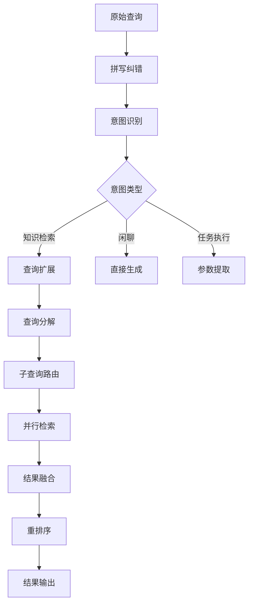

# 查询改写与扩展

> [!abstract] 摘要
> 查询改写与扩展是提升检索系统用户体验的关键技术栈。本文档系统讲解查询分类、扩展、分解、路由、意图识别和纠错等核心模块，配合实战代码帮助知识库管理者构建更智能的检索系统。

---

## 关键词速览

| 术语 | 英文 | 核心概念 |
|------|------|----------|
| 查询分类 | Query Classification | 判断查询类型的任务 |
| 查询扩展 | Query Expansion | 增加同义词/相关词丰富查询 |
| 查询分解 | Query Decomposition | 将复杂查询拆分为子查询 |
| 查询路由 | Query Routing | 根据特征将查询分发到不同处理管道 |
| 意图识别 | Intent Detection | 识别用户的真实查询意图 |
| 拼写纠错 | Spell Correction | 修正查询中的错误 |
| 同义词扩展 | Synonym Expansion | 添加语义等价词 |
| 伪相关反馈 | Pseudo Relevance Feedback | 自动扩展相关术语 |
| [[混合检索技术]] | Hybrid Search | 多模态检索融合 |

---

## 一、查询处理概述

### 1.1 为什么需要查询改写

用户查询存在天然的歧义性和不完整性：

| 问题类型 | 示例 | 影响 |
|----------|------|------|
| 歧义性 | "苹果" | 可能是水果/公司/电影 |
| 拼写错误 | "machine learnig" | 无法正确匹配 |
| 表达不完整 | "反向传播原理" | 缺少上下文 |
| 专业术语差异 | "深度学习" vs "deep learning" | 词汇鸿沟 |
| 口语化表达 | "咋整" | 正式文本中不存在 |

### 1.2 查询处理流程



---

## 二、意图识别详解

### 2.1 意图分类体系

常见的查询意图类型：

| 意图类别 | 子类型 | 用户行为 |
|----------|--------|----------|
| 知识型 | 事实查询、概念解释 | "什么是RAG？" |
| 导航型 | 定位资源 | "打开设置文档" |
| 事务型 | 执行操作 | "帮我创建一个笔记" |
| 比较型 | 对比分析 | "对比Transformer和RNN" |
| 列表型 | 列举项目 | "列出常见的聚类算法" |
| 闲聊型 | 社交对话 | "今天天气怎么样" |

### 2.2 意图识别实现

```python
from enum import Enum
from typing import List, Dict, Optional, Tuple
import re
from dataclasses import dataclass
import json

class IntentType(Enum):
    """查询意图枚举"""
    KNOWLEDGE = "knowledge"           # 知识检索
    FACTUAL = "factual"               # 事实查询
    COMPARISON = "comparison"         # 对比分析
    LISTING = "listing"               # 列表请求
    NAVIGATION = "navigation"         # 导航意图
    TASK_EXECUTION = "task"           # 任务执行
    CHITCHAT = "chitchat"             # 闲聊
    UNKNOWN = "unknown"               # 未知

@dataclass
class IntentResult:
    """意图识别结果"""
    intent: IntentType
    confidence: float
    entities: Dict[str, List[str]]
    sub_intents: List[Tuple[IntentType, float]]
    reasoning: str

class IntentClassifier:
    """基于规则+模型融合的意图识别器"""
    
    def __init__(self, model=None):
        self.model = model
        self.patterns = self._init_patterns()
        self.entity_extractor = EntityExtractor()
    
    def _init_patterns(self) -> Dict[IntentType, List[re.Pattern]]:
        """初始化意图识别模式"""
        return {
            IntentType.KNOWLEDGE: [
                re.compile(r'^什么是|何为|定义'),
                re.compile(r'的概念|的含义'),
                re.compile(r'原理|机制|工作原理'),
            ],
            IntentType.COMPARISON: [
                re.compile(r'对比|比较|差异|区别'),
                re.compile(r'哪个好|哪个更|选择'),
                re.compile(r'vs\.?|versus'),
            ],
            IntentType.LISTING: [
                re.compile(r'列出|列举|有哪些'),
                re.compile(r'常见的|所有的|各种'),
                re.compile(r'列表|清单|目录'),
            ],
            IntentType.FACTUAL: [
                re.compile(r'^什么时候|何时'),
                re.compile(r'^在哪里|何地'),
                re.compile(r'谁.*发明的|谁.*创建'),
            ],
            IntentType.NAVIGATION: [
                re.compile(r'打开|转到|去.*文档'),
                re.compile(r'找到.*文件'),
            ],
            IntentType.TASK: [
                re.compile(r'帮我.*创建|帮我.*生成'),
                re.compile(r'执行|运行|计算'),
            ],
        }
    
    def classify(self, query: str) -> IntentResult:
        """
        执行意图分类
        
        Args:
            query: 用户查询文本
        
        Returns:
            IntentResult: 包含意图、置信度、实体等
        """
        query_clean = query.strip()
        
        # Step 1: 规则匹配
        rule_scores = {}
        for intent, patterns in self.patterns.items():
            for pattern in patterns:
                if pattern.search(query_clean):
                    rule_scores[intent] = rule_scores.get(intent, 0) + 1
        
        # Step 2: 模型预测（如果有）
        if self.model:
            model_scores = self.model.predict(query_clean)
            # 融合规则和模型分数
            combined_scores = {
                intent: 0.6 * rule_scores.get(intent, 0) + 
                        0.4 * model_scores.get(intent, 0)
                for intent in IntentType
            }
        else:
            combined_scores = rule_scores
        
        # Step 3: 计算置信度
        total_score = sum(combined_scores.values())
        if total_score > 0:
            normalized_scores = {
                intent: score / total_score 
                for intent, score in combined_scores.items()
            }
        else:
            normalized_scores = {IntentType.UNKNOWN: 1.0}
        
        # Step 4: 提取意图和实体
        top_intent = max(normalized_scores, key=normalized_scores.get)
        confidence = normalized_scores[top_intent]
        entities = self.entity_extractor.extract(query_clean)
        
        # 获取子意图列表
        sub_intents = sorted(
            [(k, v) for k, v in normalized_scores.items() if v > 0.1],
            key=lambda x: x[1],
            reverse=True
        )[:3]
        
        return IntentResult(
            intent=top_intent,
            confidence=confidence,
            entities=entities,
            sub_intents=sub_intents,
            reasoning=self._generate_reasoning(top_intent, confidence, entities)
        )
    
    def _generate_reasoning(
        self, 
        intent: IntentType, 
        confidence: float,
        entities: Dict
    ) -> str:
        """生成推理说明"""
        entity_str = ", ".join(
            f"{k}: {', '.join(v[:2])}" 
            for k, v in list(entities.items())[:3]
        )
        return f"识别为{intents[intent]}意图（置信度{confidence:.2%}），提取实体：{entity_str}"


class EntityExtractor:
    """实体提取器"""
    
    def __init__(self):
        self.entity_patterns = {
            'tech': r'\b(Python|Java|深度学习|机器学习|Transformer)\b',
            'person': r'\b(张三|李四|OpenAI|Google|Microsoft)\b',
            'time': r'\b(\d{4}年|\d+月|\d+日|今天|昨天|明天)\b',
            'number': r'\b(\d+%|\d+个|\d+次)\b',
            'code': r'`([^`]+)`',
        }
    
    def extract(self, text: str) -> Dict[str, List[str]]:
        """提取各类实体"""
        entities = {}
        for entity_type, pattern in self.entity_patterns.items():
            matches = re.findall(pattern, text)
            if matches:
                entities[entity_type] = list(matches)
        return entities
```

---

## 三、查询扩展技术

### 3.1 扩展策略分类

| 策略类型 | 方法 | 优点 | 缺点 |
|----------|------|------|------|
| 同义词扩展 | 词典/词向量 | 简单有效 | 覆盖有限 |
| 相关词扩展 | 词向量相似度 | 自动发现 | 可能引入噪音 |
| 伪相关反馈 | PRF | 无需人工标注 | 误差累积 |
| 用户历史扩展 | 点击日志分析 | 个性化 | 冷启动问题 |
| LLM生成扩展 | 大模型生成 | 语义丰富 | 成本较高 |

### 3.2 查询扩展实现

```python
from typing import List, Set, Tuple, Optional
import numpy as np
from collections import defaultdict

class QueryExpander:
    """查询扩展器"""
    
    def __init__(
        self,
        embedding_model=None,
        synonym_dict: dict = None,
        word_vectors: dict = None
    ):
        self.embedding = embedding_model
        self.synonym_dict = synonym_dict or {}
        self.word_vectors = word_vectors or {}
        self.corpus_term_freq = defaultdict(int)
        self.total_docs = 0
    
    def expand(
        self, 
        query: str, 
        strategy: str = "hybrid",
        top_k: int = 5,
        min_similarity: float = 0.7
    ) -> Tuple[str, List[Tuple[str, float, str]]]:
        """
        执行查询扩展
        
        Args:
            query: 原始查询
            strategy: 扩展策略（synonym/vector/prf/hybrid）
            top_k: 返回的扩展词数量
            min_similarity: 最小相似度阈值
        
        Returns:
            扩展后的查询 + 扩展词详情列表
        """
        original_terms = self._tokenize(query)
        expanded_terms = []
        
        if strategy in ["synonym", "hybrid"]:
            synonym_expansions = self._synonym_expansion(original_terms)
            expanded_terms.extend(synonym_expansions)
        
        if strategy in ["vector", "hybrid"]:
            vector_expansions = self._vector_expansion(
                original_terms, top_k, min_similarity
            )
            expanded_terms.extend(vector_expansions)
        
        if strategy in ["prf", "hybrid"]:
            prf_expansions = self._pseudo_relevance_feedback(
                query, original_terms, top_k
            )
            expanded_terms.extend(prf_expansions)
        
        # 去重并排序
        seen = set(t.lower() for t in original_terms)
        unique_expansions = []
        for term, score, source in expanded_terms:
            if term.lower() not in seen:
                unique_expansions.append((term, score, source))
                seen.add(term.lower())
        
        # 合并生成新查询
        expanded_query = self._merge_queries(query, unique_expansions)
        
        return expanded_query, unique_expansions[:top_k]
    
    def _tokenize(self, text: str) -> List[str]:
        """简单分词"""
        import re
        return re.findall(r'[\u4e00-\u9fff]+|[a-zA-Z]+', text.lower())
    
    def _synonym_expansion(
        self, 
        terms: List[str]
    ) -> List[Tuple[str, float, str]]:
        """同义词扩展"""
        expansions = []
        for term in terms:
            synonyms = self.synonym_dict.get(term, [])
            for syn in synonyms[:3]:
                expansions.append((syn, 0.9, f"同义词:{term}"))
        return expansions
    
    def _vector_expansion(
        self,
        terms: List[str],
        top_k: int,
        min_similarity: float
    ) -> List[Tuple[str, float, str]]:
        """基于词向量的扩展"""
        if not self.embedding:
            return []
        
        expansions = []
        for term in terms:
            if term not in self.word_vectors:
                continue
            
            term_vec = self.word_vectors[term]
            
            # 计算与所有词的相似度
            similarities = []
            for word, vec in self.word_vectors.items():
                if word == term:
                    continue
                sim = self._cosine_similarity(term_vec, vec)
                if sim >= min_similarity:
                    similarities.append((word, sim))
            
            # 取top_k
            similarities.sort(key=lambda x: x[1], reverse=True)
            for word, sim in similarities[:top_k]:
                expansions.append((word, sim, f"向量相似:{term}"))
        
        return expansions
    
    def _pseudo_relevance_feedback(
        self,
        original_query: str,
        terms: List[str],
        top_k: int
    ) -> List[Tuple[str, float, str]]:
        """
        伪相关反馈扩展
        
        原理：假设检索返回的Top-K文档中频繁出现的词与查询相关
        """
        if not hasattr(self, 'vector_store'):
            return []
        
        # 初次检索获取相关文档
        initial_results = self.vector_store.search(original_query, top_k=10)
        
        if not initial_results:
            return []
        
        # 统计词频
        term_scores = defaultdict(float)
        for doc in initial_results:
            doc_terms = self._tokenize(doc['content'])
            doc_len = len(doc_terms)
            
            # TF-IDF权重
            for term in doc_terms:
                tf = doc_terms.count(term) / doc_len
                idf = np.log(self.total_docs / (self.corpus_term_freq[term] + 1))
                term_scores[term] += tf * idf
        
        # 排除查询中已有的词
        query_terms_set = set(t.lower() for t in terms)
        
        # 排序并返回
        sorted_terms = sorted(
            [(t, s) for t, s in term_scores.items() 
             if t.lower() not in query_terms_set],
            key=lambda x: x[1],
            reverse=True
        )
        
        return [
            (term, score, "PRF")
            for term, score in sorted_terms[:top_k]
        ]
    
    def _cosine_similarity(self, vec1: np.ndarray, vec2: np.ndarray) -> float:
        """计算余弦相似度"""
        dot = np.dot(vec1, vec2)
        norm1 = np.linalg.norm(vec1)
        norm2 = np.linalg.norm(vec2)
        return dot / (norm1 * norm2) if norm1 * norm2 > 0 else 0
    
    def _merge_queries(
        self, 
        original: str, 
        expansions: List[Tuple[str, float, str]]
    ) -> str:
        """合并生成扩展查询"""
        # 保留原始查询
        expanded = original
        
        # 按权重添加扩展词
        for term, score, source in sorted(expansions, key=lambda x: x[1], reverse=True):
            # 根据分数决定是否加入
            if score > 0.7:
                expanded += f" OR {term}"
        
        return expanded


class SynonymDictionary:
    """同义词词典构建器"""
    
    def __init__(self):
        self.synonyms = defaultdict(set)
        self._build_default_dict()
    
    def _build_default_dict(self):
        """构建默认同义词库"""
        # 人工智能领域同义词
        ai_synonyms = {
            '深度学习': ['deep learning', 'DL', '深层神经网络'],
            '机器学习': ['machine learning', 'ML', '统计学习'],
            '神经网络': ['neural network', 'NN', '人工神经网络'],
            'Transformer': ['注意力机制', 'self-attention', '变换器'],
            'RAG': ['检索增强生成', 'retrieval augmented generation'],
            'embedding': ['嵌入', '向量表示', '分布式表示'],
            'LLM': ['大语言模型', '大型语言模型', 'large language model'],
        }
        
        for term, syns in ai_synonyms.items():
            for syn in syns:
                self.synonyms[term].add(syn)
                self.synonyms[syn].add(term)
    
    def add_synonym(self, term1: str, term2: str):
        """添加同义词对"""
        self.synonyms[term1].add(term2)
        self.synonyms[term2].add(term1)
    
    def get_synonyms(self, term: str) -> List[str]:
        """获取同义词列表"""
        return list(self.synonyms.get(term.lower(), set()))
    
    def save(self, path: str):
        """保存到文件"""
        with open(path, 'w', encoding='utf-8') as f:
            json.dump(dict(self.synonyms), f, ensure_ascii=False, indent=2)
    
    def load(self, path: str):
        """从文件加载"""
        with open(path, 'r', encoding='utf-8') as f:
            self.synonyms = defaultdict(set, json.load(f))
```

---

## 四、查询分解技术

### 4.1 分解策略

| 策略 | 适用场景 | 示例 |
|------|----------|------|
| 并列分解 | 多个独立子问题 | "Python和Java的区别" → ["Python特点", "Java特点"] |
| 递进分解 | 逻辑递进关系 | "什么是AI，然后怎么学习" → ["AI定义", "AI学习方法"] |
| 约束分解 | 带约束的问题 | "有哪些分类算法，准确率高的" → ["分类算法", "高性能分类算法"] |

### 4.2 查询分解实现

```python
from typing import List, Dict, Optional
import re

class QueryDecomposer:
    """查询分解器"""
    
    def __init__(self, llm_client=None):
        self.llm = llm_client
        self.operators = {
            'and': 'AND',
            'or': 'OR',
            'but': 'BUT',
            'and': 'AND',
            'vs': 'VS',
            'versus': 'VS',
            '对比': 'VS',
            '和': 'AND',
            '或': 'OR',
            '与': 'AND',
        }
    
    def decompose(self, query: str) -> List[Dict]:
        """
        分解查询
        
        Returns:
            List of {sub_query, relation, constraints}
        """
        # 检测连接词
        sub_queries = self._split_by_operators(query)
        
        if len(sub_queries) == 1:
            # 无法分解，作为单一查询处理
            return [{
                'query': query,
                'relation': None,
                'constraints': self._extract_constraints(query)
            }]
        
        # 重组子查询
        decomposed = []
        for i, sub in enumerate(sub_queries):
            relation = self.operators.get(
                sub.get('operator', 'AND').lower(), 'AND'
            )
            
            decomposed.append({
                'query': sub['text'],
                'relation': relation,
                'constraints': self._extract_constraints(sub['text']),
                'index': i
            })
        
        return decomposed
    
    def _split_by_operators(self, query: str) -> List[Dict]:
        """基于连接词分割查询"""
        # 按连接词分割
        pattern = r'\s+(和|与|以及|或|或者|对比|比较|vs|versus)\s+'
        parts = re.split(pattern, query)
        
        sub_queries = []
        operators = re.findall(pattern, query, re.IGNORECASE)
        
        for i, part in enumerate(parts):
            if part.strip():
                op = operators[i - 1] if i > 0 else None
                sub_queries.append({
                    'text': part.strip(),
                    'operator': op
                })
        
        return sub_queries if sub_queries else [{'text': query, 'operator': None}]
    
    def _extract_constraints(self, query: str) -> Dict[str, any]:
        """提取约束条件"""
        constraints = {}
        
        # 时序约束
        time_patterns = [
            (r'(\d{4})年', 'year'),
            (r'(\d+)月', 'month'),
            (r'最近(\d+)', 'recent'),
        ]
        for pattern, key in time_patterns:
            match = re.search(pattern, query)
            if match:
                constraints[key] = match.group(1)
        
        # 数量约束
        if '最多' in query or '不超过' in query:
            num_match = re.search(r'(\d+)', query)
            if num_match:
                constraints['max_count'] = int(num_match.group(1))
        
        # 质量约束
        quality_keywords = {
            '准确率高': ('quality', 'high_accuracy'),
            '效果好': ('quality', 'high_performance'),
            '简单': ('complexity', 'simple'),
            '复杂': ('complexity', 'complex'),
        }
        for kw, (key, val) in quality_keywords.items():
            if kw in query:
                constraints[key] = val
        
        return constraints
    
    async def decompose_with_llm(self, query: str) -> List[Dict]:
        """使用LLM进行智能分解"""
        if not self.llm:
            return self.decompose(query)
        
        prompt = f"""
请将以下查询分解为多个独立的子查询。如果查询可以分解为多个部分，请返回分解后的子查询列表。

查询：{query}

要求：
1. 每个子查询应该是独立完整的
2. 标注子查询之间的关系（AND/OR/VS）
3. 提取每个子查询的约束条件

以JSON格式返回：
{{
  "sub_queries": [
    {{"query": "子查询内容", "relation": "AND|OR|VS", "constraints": {{}}}} 
  ]
}}
"""
        
        response = await self.llm.generate(prompt)
        return json.loads(response.content)['sub_queries']
```

---

## 五、查询纠错技术

### 5.1 纠错策略

| 错误类型 | 示例 | 纠错策略 |
|----------|------|----------|
| 拼写错误 | "machien learning" | 编辑距离纠错 |
| 中文拼音错误 | "shenduxuexi" | 拼音匹配纠错 |
| 术语差异 | "机器学习" vs "machine learning" | 标准化映射 |
| 上下文错误 | 指代消解 | 共指解析 |

### 5.2 纠错实现

```python
from typing import List, Tuple, Optional
import re

class SpellCorrector:
    """拼写纠错器"""
    
    def __init__(self, dictionary: set = None):
        self.dictionary = dictionary or set()
        self.ngram_counts = {}
        self._build_default_dictionary()
    
    def _build_default_dictionary(self):
        """构建默认词典"""
        tech_terms = [
            'python', 'java', 'javascript', 'typescript', 'golang',
            'machine learning', 'deep learning', 'neural network',
            'transformer', 'attention', 'embedding', 'rag',
            'retrieval', 'generation', 'nlp', 'nlu',
            'classification', 'regression', 'clustering',
            'supervised', 'unsupervised', 'reinforcement',
            'gradient', 'backpropagation', 'optimizer',
        ]
        self.dictionary.update(tech_terms)
    
    def correct(self, query: str) -> Tuple[str, List[Dict]]:
        """
        执行拼写纠错
        
        Returns:
            (纠错后查询, 纠错详情列表)
        """
        corrections = []
        
        # 分词处理
        tokens = self._tokenize(query)
        corrected_tokens = []
        
        for token in tokens:
            if self._is_chinese(token) or self._is_number(token):
                corrected_tokens.append(token)
                continue
            
            token_lower = token.lower()
            
            # 检查是否在词典中
            if token_lower in self.dictionary:
                corrected_tokens.append(token)
                continue
            
            # 查找最相似的词
            candidates = self._find_candidates(token_lower)
            
            if candidates:
                best_match, distance = candidates[0]
                if distance <= 2:  # 编辑距离阈值
                    corrections.append({
                        'original': token,
                        'corrected': best_match,
                        'distance': distance,
                        'method': 'edit_distance'
                    })
                    corrected_tokens.append(best_match)
                else:
                    corrected_tokens.append(token)
            else:
                corrected_tokens.append(token)
        
        corrected_query = ' '.join(corrected_tokens)
        return corrected_query, corrections
    
    def _tokenize(self, text: str) -> List[str]:
        """分词"""
        # 保留英文单词和数字，分割中文字符
        return re.findall(r'[\u4e00-\u9fff]+|[a-zA-Z]+|\d+', text)
    
    def _is_chinese(self, text: str) -> bool:
        """判断是否为中文"""
        return bool(re.match(r'^[\u4e00-\u9fff]+$', text))
    
    def _is_number(self, text: str) -> bool:
        """判断是否为数字"""
        return text.isdigit()
    
    def _find_candidates(self, word: str) -> List[Tuple[str, int]]:
        """查找候选纠错词"""
        candidates = []
        
        # 生成编辑距离为1和2的词
        for i in range(1, 3):
            for edit in self._generate_edits(word, i):
                if edit in self.dictionary:
                    candidates.append((edit, i))
        
        # 按编辑距离排序
        candidates.sort(key=lambda x: (x[1], len(x[0])))
        return candidates
    
    def _generate_edits(self, word: str, distance: int) -> set:
        """生成编辑距离内的所有词"""
        if distance == 0:
            return {word}
        
        edits = set()
        for edit in self._single_edits(word):
            edits.add(edit)
            edits.update(self._generate_edits(edit, distance - 1))
        
        return edits
    
    def _single_edits(self, word: str) -> set:
        """生成单次编辑的变体"""
        letters = 'abcdefghijklmnopqrstuvwxyz'
        splits = [(word[:i], word[i:]) for i in range(len(word) + 1)]
        
        deletes = [L + R[1:] for L, R in splits if R]
        transposes = [L + R[1] + R[0] + R[2:] for L, R in splits if len(R) > 1]
        replaces = [L + c + R[1:] for L, R in splits if R for c in letters]
        inserts = [L + c + R for L, R in splits for c in letters]
        
        return deletes + transposes + replaces + inserts
```

---

## 六、查询路由技术

### 6.1 路由策略

```python
class QueryRouter:
    """查询路由器"""
    
    def __init__(self, retrieval_pipelines: Dict[str, Any]):
        """
        初始化路由器
        
        Args:
            retrieval_pipelines: 管道名称 -> 检索管道实例
        """
        self.pipelines = retrieval_pipelines
        self.route_rules = self._init_rules()
    
    def _init_rules(self) -> List[Dict]:
        """初始化路由规则"""
        return [
            {
                'name': '代码路由',
                'condition': lambda q: any(kw in q for kw in ['代码', '实现', 'code', '函数', 'class']),
                'pipeline': 'code_search',
                'priority': 10
            },
            {
                'name': '文档路由',
                'condition': lambda q: any(kw in q for kw in ['文档', '说明', '如何使用', '怎么用']),
                'pipeline': 'doc_search',
                'priority': 8
            },
            {
                'name': '对话历史路由',
                'condition': lambda q: any(kw in q for kw in ['它', '这个', '那', '继续', '上文']),
                'pipeline': 'context_search',
                'priority': 9
            },
            {
                'name': '学术论文路由',
                'condition': lambda q: any(kw in q for kw in ['论文', '研究', 'paper', 'arxiv']),
                'pipeline': 'academic_search',
                'priority': 7
            },
        ]
    
    def route(self, query: str, intent_result: IntentResult = None) -> str:
        """
        路由查询到对应管道
        
        Args:
            query: 查询文本
            intent_result: 意图识别结果（可选）
        
        Returns:
            管道名称
        """
        matched_rules = []
        
        for rule in self.route_rules:
            if rule['condition'](query):
                matched_rules.append(rule)
        
        if matched_rules:
            # 按优先级排序
            matched_rules.sort(key=lambda x: x['priority'], reverse=True)
            return matched_rules[0]['pipeline']
        
        # 默认路由
        return 'general_search'
    
    def multi_route(self, query: str) -> List[Tuple[str, float]]:
        """
        多管道路由
        
        Returns:
            [(管道名, 匹配度), ...]
        """
        scores = {}
        for rule in self.route_rules:
            if rule['condition'](query):
                scores[rule['pipeline']] = rule['priority']
        
        # 归一化
        if scores:
            total = sum(scores.values())
            return [(k, v/total) for k, v in sorted(scores.items(), key=lambda x: x[1], reverse=True)]
        
        return [('general_search', 1.0)]
```

---

## 七、完整查询处理管道

```python
class QueryProcessingPipeline:
    """完整查询处理管道"""
    
    def __init__(
        self,
        intent_classifier: IntentClassifier,
        spell_corrector: SpellCorrector,
        query_expander: QueryExpander,
        query_decomposer: QueryDecomposer,
        query_router: QueryRouter
    ):
        self.intent_classifier = intent_classifier
        self.spell_corrector = spell_corrector
        self.query_expander = query_expander
        self.query_decomposer = query_decomposer
        self.query_router = query_router
    
    async def process(self, query: str) -> Dict:
        """处理查询的完整流程"""
        result = {
            'original_query': query,
            'steps': []
        }
        
        # Step 1: 拼写纠错
        corrected_query, corrections = self.spell_corrector.correct(query)
        result['corrected_query'] = corrected_query
        result['corrections'] = corrections
        result['steps'].append('spell_correction')
        
        # Step 2: 意图识别
        intent_result = self.intent_classifier.classify(corrected_query)
        result['intent'] = {
            'type': intent_result.intent.value,
            'confidence': intent_result.confidence,
            'entities': intent_result.entities,
            'reasoning': intent_result.reasoning
        }
        result['steps'].append('intent_classification')
        
        # Step 3: 查询扩展（仅对知识检索类意图）
        if intent_result.intent in [IntentType.KNOWLEDGE, IntentType.FACTUAL]:
            expanded_query, expansions = self.query_expander.expand(
                corrected_query,
                strategy='hybrid'
            )
            result['expanded_query'] = expanded_query
            result['expansions'] = expansions
            result['steps'].append('query_expansion')
        else:
            result['expanded_query'] = corrected_query
        
        # Step 4: 查询分解
        sub_queries = self.query_decomposer.decompose(result['expanded_query'])
        result['sub_queries'] = sub_queries
        if len(sub_queries) > 1:
            result['steps'].append('query_decomposition')
        
        # Step 5: 路由决策
        route_result = self.query_router.route(corrected_query, intent_result)
        result['routed_pipeline'] = route_result
        result['steps'].append('query_routing')
        
        return result
```

---

## 八、相关文档

- [[混合检索技术]] - 检索融合策略
- [[意图识别]] - 意图分类详解
- [[查询扩展]] - 扩展技术深入
- [[语义检索]] - 向量语义匹配
- [[RAG架构设计]] - RAG系统集成

---

> [!note] 更新记录
> - 2026-04-18：初版创建，涵盖查询处理全链路技术
