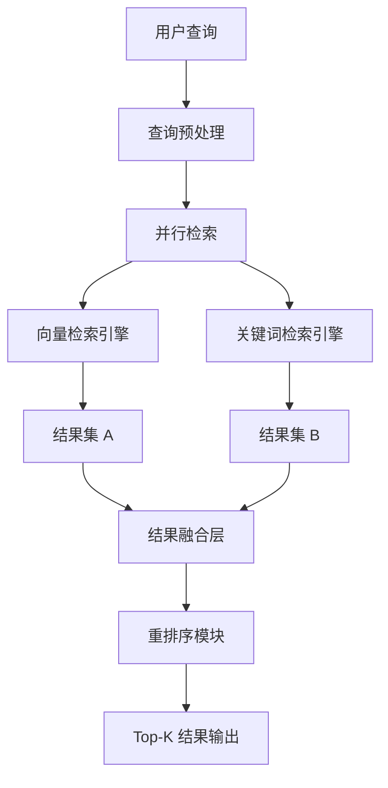

# 混合检索技术

> [!abstract] 摘要
> 混合检索技术是现代RAG系统的核心组件，通过融合向量检索与关键词检索的优势，实现更精准、更全面的信息获取。本文档深入解析BF25、RRF、学习排序（Learning to Rank）以及HyDE等前沿技术，为知识库管理者提供系统性的技术指南。

---

## 关键词速览

| 术语 | 英文 | 核心概念 |
|------|------|----------|
| 混合检索 | Hybrid Search | 结合多种检索范式的综合搜索策略 |
| 向量检索 | Vector Search | 基于语义embedding的相似度匹配 |
| 关键词检索 | BM25 | 基于词频统计的传统信息检索 |
| BF25 | BM25F | 多字段加权的BM25变体 |
| RRF | Reciprocal Rank Fusion | 倒数排名融合算法 |
| 学习排序 | Learning to Rank | 机器学习驱动的排序优化 |
| HyDE | Hypothetical Document Embeddings | 假设文档嵌入技术 |
| RAG | Retrieval-Augmented Generation | 检索增强生成 |

---

## 一、混合检索概述

### 1.1 为什么需要混合检索

单一的检索方式存在明显局限性：

- **纯向量检索**虽然擅长语义理解，但在处理精确关键词匹配（如人名、术语、ID）时表现不佳
- **纯关键词检索**虽然精确，但无法捕捉语义相似性和同义词关系

> [!example] 实际场景示例
> 用户搜索"神经网络反向传播原理"时：
> - 关键词检索可能找不到仅使用"BP算法"表述的文档
> - 向量检索能理解"反向传播"与"BP"的关系，但可能遗漏精确的技术细节

### 1.2 混合检索架构



---

## 二、BF25 算法详解

### 2.1 算法原理

BM25F（BM25 Fields）是BM25的多字段扩展版本，在处理多字段文档时显著优于标准BM25。

**核心公式：**

$$
\text{BM25F}(q, d) = \sum_{t \in q} \frac{(k_1 + 1) \cdot \text{tf}_{t,d}^{*}}{(k_1 + \text{tf}_{t,d}^{*}) + k_3 \cdot \frac{qtf}{qtf + k_3}} \cdot \log\left(\frac{N - df_t + 0.5}{df_t + 0.5}\right)
$$

其中加权词频：

$$
\text{tf}_{t,d}^{*} = \sum_{f \in F} \frac{w_f \cdot b_f}{1 - b_f + b_f \cdot \frac{|d_f|}{|d_{avg,f}|}} \cdot tf_{t,d_f}
$$

### 2.2 Python实现

```python
from typing import List, Dict, Tuple
import math

class BM25F:
    """BM25F多字段检索实现"""
    
    def __init__(self, k1: float = 1.5, b: float = 0.75, 
                 field_weights: Dict[str, float] = None):
        self.k1 = k1
        self.b = b if isinstance(b, dict) else {'default': b}
        self.field_weights = field_weights or {'default': 1.0}
        self.avg_field_lengths = {}
        self.doc_count = 0
        self.doc_freqs = {}
        self.idf = {}
        self.corpus = []
    
    def fit(self, documents: List[Dict[str, str]]):
        """构建索引"""
        self.corpus = documents
        self.doc_count = len(documents)
        
        # 计算平均字段长度
        for field in set(self.field_weights.keys()):
            lengths = [len(doc.get(field, '').split()) 
                      for doc in documents]
            self.avg_field_lengths[field] = sum(lengths) / len(lengths) if lengths else 1
        
        # 计算文档频率和IDF
        for doc in documents:
            seen_terms = set()
            for field, text in doc.items():
                if field in self.field_weights:
                    terms = text.lower().split()
                    for term in set(terms):
                        if term not in seen_terms:
                            self.doc_freqs[term] = self.doc_freqs.get(term, 0) + 1
                            seen_terms.add(term)
        
        # 计算IDF
        for term, df in self.doc_freqs.items():
            self.idf[term] = math.log((self.doc_count - df + 0.5) / (df + 0.5))
    
    def score(self, query: str, doc: Dict[str, str]) -> float:
        """计算单文档得分"""
        query_terms = query.lower().split()
        score = 0.0
        
        for term in query_terms:
            if term not in self.idf:
                continue
                
            idf = self.idf[term]
            weighted_tf = 0.0
            
            for field, text in doc.items():
                if field not in self.field_weights:
                    continue
                    
                field_len = len(text.split())
                avg_len = self.avg_field_lengths.get(field, 1)
                tf = text.lower().split().count(term)
                
                # 字段长度归一化
                norm_tf = tf * self.field_weights[field] / \
                         (1 - self.b.get(field, 0.75) + 
                          self.b.get(field, 0.75) * field_len / avg_len)
                
                weighted_tf += norm_tf
            
            # BM25公式核心
            term_score = idf * (weighted_tf * (self.k1 + 1)) / \
                        (weighted_tf + self.k1)
            score += term_score
        
        return score
    
    def search(self, query: str, top_k: int = 10) -> List[Tuple[int, float]]:
        """检索Top-K结果"""
        scores = [(i, self.score(query, doc)) 
                  for i, doc in enumerate(self.corpus)]
        return sorted(scores, key=lambda x: x[1], reverse=True)[:top_k]

# 使用示例
bm25f = BM25F(
    field_weights={'title': 2.0, 'content': 1.0, 'tags': 1.5},
    b={'title': 0.8, 'content': 0.75, 'tags': 0.6}
)

documents = [
    {'title': '深度学习入门', 'content': '介绍神经网络基础...', 'tags': 'AI 机器学习'},
    {'title': 'RAG技术详解', 'content': '检索增强生成原理...', 'tags': 'NLP RAG'},
]
bm25f.fit(documents)
results = bm25f.search('深度学习 神经网络', top_k=5)
```

---

## 三、RRF 倒数排名融合

### 3.1 算法原理

RRF是最常用的结果融合算法，通过倒数排名加权实现多源结果的有效整合。

**核心公式：**

$$
\text{RRF}(d) = \sum_{i=1}^{k} \frac{1}{k + \text{rank}_i(d)}
$$

其中：
- $k$：RRF常量（通常取60）
- $\text{rank}_i(d)$：文档$d$在第$i$个结果列表中的排名

### 3.2 Python实现

```python
from typing import List, Dict, Tuple, Any
from collections import defaultdict

def reciprocal_rank_fusion(
    result_lists: List[List[Tuple[Any, float]]],
    k: int = 60
) -> List[Tuple[Any, float]]:
    """
    RRF倒数排名融合算法实现
    
    Args:
        result_lists: 多个检索结果列表，每个元素为(doc_id, score)元组
        k: RRF常量，默认60
    
    Returns:
        融合后的排序结果
    """
    scores = defaultdict(float)
    doc_scores = defaultdict(dict)
    
    for list_idx, results in enumerate(result_lists):
        for rank, (doc_id, original_score) in enumerate(results):
            # RRF得分计算
            rrf_score = 1.0 / (k + rank + 1)
            scores[doc_id] += rrf_score
            # 同时记录原始分数
            doc_scores[doc_id][list_idx] = original_score
    
    # 按RRF分数排序
    ranked = sorted(scores.items(), key=lambda x: x[1], reverse=True)
    
    # 添加原始分数信息
    enriched_results = [
        (doc_id, rrf_score, doc_scores[doc_id])
        for doc_id, rrf_score in ranked
    ]
    
    return enriched_results


class HybridSearchEngine:
    """混合搜索引擎实现"""
    
    def __init__(self, vector_engine, bm25_engine, rrf_k: int = 60):
        self.vector_engine = vector_engine
        self.bm25_engine = bm25_engine
        self.rrf_k = rrf_k
    
    def search(
        self, 
        query: str, 
        top_k: int = 10,
        vector_weight: float = 0.5,
        keyword_weight: float = 0.5
    ) -> List[Dict]:
        """
        执行混合检索
        
        Args:
            query: 查询文本
            top_k: 返回结果数
            vector_weight: 向量检索权重
            keyword_weight: 关键词检索权重
        """
        # 并行执行两种检索
        vector_results = self.vector_engine.search(query, top_k * 2)
        keyword_results = self.bm25_engine.search(query, top_k * 2)
        
        # RRF融合
        fused_results = reciprocal_rank_fusion(
            [vector_results, keyword_results],
            k=self.rrf_k
        )
        
        # 重新加权
        final_results = []
        for doc_id, rrf_score, original_scores in fused_results[:top_k]:
            vector_score = original_scores.get(0, 0)
            keyword_score = original_scores.get(1, 0)
            
            combined_score = (
                vector_weight * vector_score + 
                keyword_weight * keyword_score +
                0.1 * rrf_score  # RRF作为微调因子
            )
            
            final_results.append({
                'doc_id': doc_id,
                'score': combined_score,
                'vector_score': vector_score,
                'keyword_score': keyword_score,
                'rrf_score': rrf_score
            })
        
        return final_results
```

---

## 四、学习排序 (Learning to Rank)

### 4.1 LTR框架

学习排序将排序问题转化为机器学习问题，常见方法包括：

| 方法类型 | 代表算法 | 特点 |
|----------|----------|------|
| Pointwise | PRMSE, Regression | 独立预测每个文档的相关性分数 |
| Pairwise | RankSVM, RankNet | 优化文档对之间的相对顺序 |
| Listwise | ListNet, LambdaMART | 直接优化排序列表 |

### 4.2 LambdaMART实现

```python
import numpy as np
from dataclasses import dataclass
from typing import List

@dataclass
class QueryDocument:
    """查询-文档对"""
    query_id: str
    doc_id: str
    features: np.ndarray
    relevance: int  # 0-4 相关性等级

class LambdaMART:
    """LambdaMART排序模型简化实现"""
    
    def __init__(self, n_estimators: int = 100, max_depth: int = 5):
        self.n_estimators = n_estimators
        self.max_depth = max_depth
        self.trees = []
        self.feature_importance = None
    
    def _compute_ndcg(self, relevance_labels: List[int], k: int = 10) -> float:
        """计算NDCG@k"""
        def dcg(scores):
            return sum((2**s - 1) / np.log2(i + 2) for i, s in enumerate(scores))
        
        sorted_labels = sorted(relevance_labels, reverse=True)
        dcg_val = dcg(sorted_labels[:k])
        idcg_val = dcg(sorted_labels[:min(k, len(sorted_labels))])
        
        return dcg_val / idcg_val if idcg_val > 0 else 0
    
    def _compute_lambdas(self, predictions: np.ndarray, 
                         relevance: np.ndarray) -> np.ndarray:
        """计算Lambda梯度"""
        n = len(predictions)
        lambdas = np.zeros(n)
        weights = np.zeros(n)
        
        # 计算文档对之间的交换概率
        for i in range(n):
            for j in range(n):
                if relevance[i] > relevance[j]:
                    # 计算交换概率
                    diff = predictions[i] - predictions[j]
                    prob = 1 / (1 + np.exp(diff))
                    
                    # NDCG差值
                    delta_ndcg = abs(
                        1 / np.log2(i + 2) - 1 / np.log2(j + 2)
                    )
                    
                    # Lambda更新
                    delta = (relevance[i] - relevance[j]) * delta_ndcg * prob
                    lambdas[i] += delta
                    lambdas[j] -= delta
    
    def fit(self, training_data: List[QueryDocument]):
        """训练模型"""
        for _ in range(self.n_estimators):
            # 构建梯度提升树
            tree = self._build_tree(training_data)
            self.trees.append(tree)
    
    def predict(self, features: np.ndarray) -> float:
        """预测排序分数"""
        score = 0.0
        for tree in self.trees:
            score += tree.predict(features)
        return score


def extract_ranking_features(doc: Dict, query: str, 
                            position_hints: Dict = None) -> np.ndarray:
    """提取排序特征"""
    features = []
    
    # 文本相似度特征
    features.append(doc['bm25_score'])      # BM25分数
    features.append(doc['vector_score'])     # 向量相似度
    features.append(doc['exact_match'])      # 精确匹配标记
    
    # 文档质量特征
    features.append(doc['page_rank'])        # PageRank值
    features.append(doc['recency'])          // 时效性得分
    features.append(doc['authority'])        # 权威性得分
    
    # 语义匹配特征
    features.append(doc['query_term_coverage'])  # 查询词覆盖率
    features.append(doc['semantic_similarity'])   # 语义相似度
    
    # 位置特征
    if position_hints:
        features.append(position_hints.get('first_position', 1000))
        features.append(position_hints.get('url_depth', 10))
    
    return np.array(features)
```

---

## 五、HyDE 技术详解

### 5.1 HyDE原理

HyDE（Hypothetical Document Embeddings）是一种创新的查询到文档转换技术：

1. 使用LLM生成"假设性答案文档"
2. 对假设文档进行向量化
3. 用假设文档的向量检索真实文档


### 5.2 HyDE实现

```python
from typing import List, Dict, Optional
import json

class HyDERetriever:
    """HyDE检索器实现"""
    
    def __init__(
        self,
        llm_client,
        embedding_model,
        vector_store,
        max_tokens: int = 300,
        temperature: float = 0.7
    ):
        self.llm = llm_client
        self.embedding = embedding_model
        self.vector_store = vector_store
        self.max_tokens = max_tokens
        self.temperature = temperature
    
    def _generate_hypothetical_doc(
        self, 
        query: str, 
        style: str = "academic"
    ) -> str:
        """生成假设性文档"""
        
        style_prompts = {
            "academic": "你是一个专业的学术作者，请撰写一段详细的技术文档...",
            "technical": "你是一个技术专家，请提供详尽的技术说明...",
            "conversational": "用通俗易懂的语言解释..."
        }
        
        prompt = f"""
{style_prompts.get(style, style_prompts['technical'])}

问题：{query}

请撰写一段300-500字的技术文档，直接回答这个问题，包含关键概念、原理和实践建议。不要使用列表格式，用连贯的段落表述。
"""
        
        response = self.llm.generate(
            prompt=prompt,
            max_tokens=self.max_tokens,
            temperature=self.temperature
        )
        
        return response.content
    
    def retrieve(
        self, 
        query: str, 
        top_k: int = 5,
        use_hyde: bool = True
    ) -> List[Dict]:
        """
        执行HyDE检索
        
        Args:
            query: 用户查询
            top_k: 返回结果数
            use_hyde: 是否使用HyDE
        """
        if use_hyde:
            # Step 1: 生成假设文档
            hypothetical_doc = self._generate_hypothetical_doc(query)
            
            # Step 2: 向量化假设文档
            query_embedding = self.embedding.encode(hypothetical_doc)
            
            # 可选：记录假设文档供调试
            metadata = {'hypothetical_doc': hypothetical_doc}
        else:
            # 标准检索：直接向量化查询
            query_embedding = self.embedding.encode(query)
            metadata = {}
        
        # Step 3: 向量检索
        results = self.vector_store.similarity_search(
            vector=query_embedding,
            top_k=top_k
        )
        
        # 添加HyDE元信息
        for result in results:
            result['metadata'].update(metadata)
        
        return results
    
    def hybrid_retrieve(
        self,
        query: str,
        top_k: int = 5,
        hyde_weight: float = 0.6
    ) -> List[Dict]:
        """
        混合检索：结合HyDE和标准检索
        """
        # HyDE检索
        hyde_results = self.retrieve(query, top_k * 2, use_hyde=True)
        
        # 标准检索
        direct_results = self.retrieve(query, top_k * 2, use_hyde=False)
        
        # 分数加权融合
        combined = {}
        for doc_id, score in hyde_results:
            combined[doc_id] = hyde_weight * score
        
        for doc_id, score in direct_results:
            if doc_id in combined:
                combined[doc_id] += (1 - hyde_weight) * score
            else:
                combined[doc_id] = (1 - hyde_weight) * score
        
        # 排序返回
        sorted_results = sorted(combined.items(), key=lambda x: x[1], reverse=True)
        return sorted_results[:top_k]
```

---

## 六、实战配置指南

### 6.1 ChromaDB混合检索配置

```python
from chromadb.config import Settings
import chromadb

# 配置ChromaDB客户端
client = chromadb.Client(Settings(
    persist_directory="./chroma_db",
    anonymized_telemetry=False
))

# 创建支持混合检索的集合
collection = client.create_collection(
    name="hybrid_docs",
    metadata={
        "hnsw:space": "cosine",      # 向量空间
        "hnsw:construction_ef": 200,  # 索引构建参数
        "hnsw:search_ef": 200,          # 搜索参数
        "hnsw:M": 16                     # 连接数
    }
)

# 存储文档（包含文本和向量）
collection.add(
    documents=["文档内容..."],
    embeddings=[embedding_vector],
    metadatas=[{"source": "doc1", "category": "tech"}],
    ids=["doc1"]
)

# 检索时同时使用文本和向量
results = collection.query(
    query_texts=["查询文本"],      # 用于关键词匹配
    query_embeddings=[query_vec],  # 用于向量检索
    n_results=10,
    include=["documents", "distances", "metadatas"]
)
```

### 6.2 Qdrant混合检索配置

```yaml
# Qdrant配置示例
storage:
  storage_path: ./qdrant_storage
  
search:
  # RRF融合配置
  fusion:
    type: rrf
    params:
      score_threshold: 0.5
      limit: 20

indexing:
  field_index:
    - field_name: text
      tokenizer: multilang
      filterable: true
    - field_name: category
      type: keyword
```

---

## 七、最佳实践与注意事项

> [!tip] 实践建议
> 1. **权重调优**：通过A/B测试确定向量检索和关键词检索的最佳权重配比
> 2. **冷启动**：新系统建议先使用固定权重（如0.5:0.5），再逐步优化
> 3. **领域适配**：不同领域（如法律、医疗、技术文档）的最优配置差异显著

> [!warning] 常见陷阱
> - 过度依赖语义相似度忽略精确匹配
> - RRF的k参数选择不当（通常60是较好的默认值）
> - 忽略检索结果的多样性（Diversity）问题

---

## 八、相关文档

- [[向量数据库详解]] - 向量检索基础
- [[BM25算法原理]] - 关键词检索核心
- [[重排序模型]] - Learning to Rank进阶
- [[查询理解与处理]] - 查询预处理技术
- [[RAG架构设计]] - RAG系统整体架构

---

> [!note] 更新记录
> - 2026-04-18：初版创建，整合BF25、RRF、LTR、HyDE等核心技术
