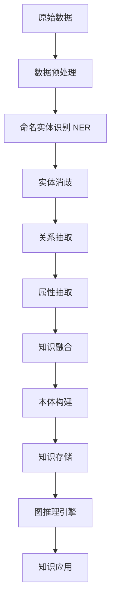
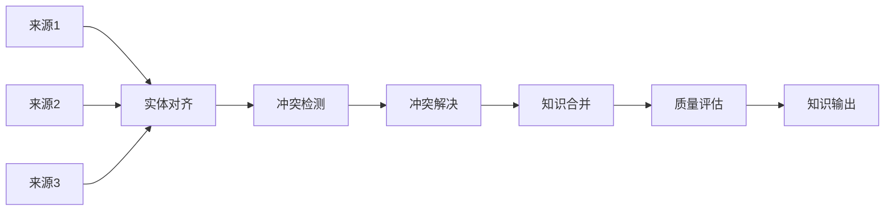

# 知识图谱构建实战

> [!abstract] 摘要
> 知识图谱是RAG系统的重要基础设施，能够提供结构化的知识表示和推理能力。本文档从实战角度出发，详细讲解实体识别、关系抽取、属性抽取、知识融合、本体构建和图推理等核心环节，配合可落地的代码实现。

---

## 关键词速览

| 术语 | 英文 | 核心概念 |
|------|------|----------|
| 命名实体识别 | NER | 识别文本中的实体边界和类型 |
| 关系抽取 | Relation Extraction | 抽取实体间的语义关系 |
| 属性抽取 | Attribute Extraction | 抽取实体的属性信息 |
| 知识融合 | Knowledge Fusion | 合并多源知识消除冲突 |
| 本体构建 | Ontology Building | 定义概念和关系的规范化模型 |
| 图推理 | Graph Reasoning | 在图谱上进行逻辑推理 |
| 实体链接 | Entity Linking | 将文本实体映射到知识库 |
| [[向量数据库]] | Vector DB | 知识向量化存储 |

---

## 一、知识图谱概述

### 1.1 知识图谱的定义

知识图谱（Knowledge Graph）以「实体-关系-实体」或「实体-属性-值」的三元组形式，对现实世界中的概念、实体及其相互关系进行形式化描述。

**核心数据结构：**

| 格式 | 示例 | 适用场景 |
|------|------|----------|
| 三元组 | (深度学习, 属于, 机器学习) | 关系表示 |
| 属性图 | 节点+属性+关系 | 图数据库存储 |
| RDF | <subject> <predicate> <object> | 语义网络标准 |
| OWL | 本体逻辑表达 | 推理引擎 |

### 1.2 构建流程



---

## 二、命名实体识别（NER）

### 2.1 NER任务定义

NER（Named Entity Recognition）是从文本中识别出特定类型实体的任务。

| 实体类型 | 示例 | 标注 |
|----------|------|------|
| 人物 | 张三、OpenAI创始人 | PER |
| 机构 | 清华大学、Google | ORG |
| 地点 | 北京、美国 | LOC |
| 时间 | 2024年、昨天 | TIME |
| 技术术语 | Transformer、RAG | TECH |
| 产品名 | GPT-4、PyTorch | PROD |

### 2.2 基于BiLSTM-CRF的NER实现

```python
import torch
import torch.nn as nn
from torch.utils.data import Dataset, DataLoader
from typing import List, Dict, Tuple
from dataclasses import dataclass
import numpy as np

@dataclass
class NERExample:
    """NER训练样例"""
    tokens: List[str]
    labels: List[str]

class NERVocabulary:
    """NER词表管理"""
    
    def __init__(self):
        self.token_to_idx = {'<PAD>': 0, '<UNK>': 1}
        self.label_to_idx = {'O': 0}
        self.idx_to_label = {0: 'O'}
        self.tag_counts = {}
    
    def build_vocab(self, examples: List[NERExample]):
        """从训练数据构建词表"""
        for ex in examples:
            for token in ex.tokens:
                if token not in self.token_to_idx:
                    self.token_to_idx[token] = len(self.token_to_idx)
            
            for label in ex.labels:
                if label not in self.label_to_idx:
                    idx = len(self.label_to_idx)
                    self.label_to_idx[label] = idx
                    self.idx_to_label[idx] = label
    
    def encode_tokens(self, tokens: List[str]) -> List[int]:
        return [self.token_to_idx.get(t, self.token_to_idx['<UNK>']) for t in tokens]
    
    def decode_labels(self, indices: List[int]) -> List[str]:
        return [self.idx_to_label.get(i, 'O') for i in indices]


class BiLSTM_CRF(nn.Module):
    """BiLSTM-CRF模型"""
    
    def __init__(
        self,
        vocab_size: int,
        embedding_dim: int,
        hidden_dim: int,
        num_tags: int,
        dropout: float = 0.3
    ):
        super().__init__()
        
        self.embedding = nn.Embedding(vocab_size, embedding_dim, padding_idx=0)
        self.lstm = nn.LSTM(
            embedding_dim, hidden_dim // 2,
            num_layers=1,
            batch_first=True,
            bidirectional=True
        )
        self.dropout = nn.Dropout(dropout)
        self.hidden2tag = nn.Linear(hidden_dim, num_tags)
        
        # CRF层
        self.crf = CRF(num_tags, batch_first=True)
    
    def forward(self, x, mask=None, tags=None):
        # Embedding
        emissions = self.embedding(x)
        
        # BiLSTM
        lstm_out, _ = self.lstm(emissions)
        lstm_out = self.dropout(lstm_out)
        emissions = self.hidden2tag(lstm_out)
        
        if tags is not None and mask is not None:
            # 训练模式：返回CRF损失
            loss = -self.crf(emissions, tags, mask=mask)
            return loss
        else:
            # 推理模式：返回最优路径
            return self.crf.decode(emissions, mask=mask)


class CRF(nn.Module):
    """条件随机场层"""
    
    def __init__(self, num_tags: int, batch_first: bool = True):
        super().__init__()
        self.num_tags = num_tags
        self.batch_first = batch_first
        
        # 转移矩阵：[num_tags, num_tags]
        self.transitions = nn.Parameter(torch.randn(num_tags, num_tags))
        self.start_transitions = nn.Parameter(torch.randn(num_tags))
        self.end_transitions = nn.Parameter(torch.randn(num_tags))
    
    def forward(self, emissions, tags, mask=None):
        """计算负对数似然损失"""
        if mask is None:
            mask = torch.ones_like(tags, dtype=torch.bool)
        
        if self.batch_first:
            emissions = emissions.transpose(0, 1)
            tags = tags.transpose(0, 1)
            mask = mask.transpose(0, 1)
        
        # Viterbi算法计算得分
        score = self._compute_score(emissions, tags, mask)
        partition = self._compute_partition(emissions, mask)
        
        return score - partition
    
    def decode(self, emissions, mask=None):
        """使用Viterbi算法解码"""
        if mask is None:
            mask = torch.ones(emissions.shape[:2], dtype=torch.bool, device=emissions.device)
        
        if self.batch_first:
            emissions = emissions.transpose(0, 1)
            mask = mask.transpose(0, 1)
        
        return self._viterbi_decode(emissions, mask)
    
    def _compute_score(self, emissions, tags, mask):
        """计算序列得分"""
        seq_length, batch_size = tags.shape
        
        score = self.start_transitions[tags[0]]
        score += emissions[0, torch.arange(batch_size), tags[0]]
        
        for i in range(1, seq_length):
            score += self.transitions[tags[i-1], tags[i]] * mask[i]
            score += emissions[i, torch.arange(batch_size), tags[i]] * mask[i]
        
        seq_ends = mask.long().sum(dim=0) - 1
        last_tags = tags[seq_ends, torch.arange(batch_size)]
        score += self.end_transitions[last_tags]
        
        return score
    
    def _viterbi_decode(self, emissions, mask):
        """Viterbi解码算法"""
        seq_length, batch_size, _ = emissions.shape
        
        score = self.start_transitions + emissions[0]
        history = []
        
        for i in range(1, seq_length):
            broadcast_score = score.unsqueeze(2)
            broadcast_emissions = emissions[i].unsqueeze(1)
            
            next_score = broadcast_score + self.transitions + broadcast_emissions
            next_score, indices = next_score.max(dim=1)
            
            score = torch.where(mask[i].unsqueeze(1), next_score, score)
            history.append(indices)
        
        score += self.end_transitions
        
        seq_ends = mask.long().sum(dim=0) - 1
        best_tags_list = []
        
        for idx in range(batch_size):
            _, best_last_tag = score[idx].max(dim=0)
            best_tags = [best_last_tag.item()]
            
            for hist in reversed(history[:seq_ends[idx]]):
                best_last_tag = hist[idx][best_tags[-1]]
                best_tags.append(best_last_tag.item())
            
            best_tags.reverse()
            best_tags_list.append(best_tags)
        
        return best_tags_list


class NERModel:
    """NER模型封装"""
    
    def __init__(
        self,
        model_path: str = None,
        device: str = 'cuda' if torch.cuda.is_available() else 'cpu'
    ):
        self.device = device
        self.vocab = NERVocabulary()
        self.model = None
        if model_path:
            self.load(model_path)
    
    def train(
        self,
        train_data: List[NERExample],
        dev_data: List[NERExample] = None,
        epochs: int = 10,
        batch_size: int = 32,
        lr: float = 0.001
    ):
        """训练NER模型"""
        self.vocab.build_vocab(train_data)
        
        # 准备数据
        train_dataset = NERDataset(train_data, self.vocab)
        train_loader = DataLoader(
            train_dataset, batch_size=batch_size, shuffle=True, collate_fn=self._collate
        )
        
        # 初始化模型
        self.model = BiLSTM_CRF(
            vocab_size=len(self.vocab.token_to_idx),
            embedding_dim=128,
            hidden_dim=256,
            num_tags=len(self.vocab.label_to_idx)
        ).to(self.device)
        
        optimizer = torch.optim.Adam(self.model.parameters(), lr=lr)
        
        for epoch in range(epochs):
            self.model.train()
            total_loss = 0
            
            for batch in train_loader:
                tokens = batch['tokens'].to(self.device)
                tags = batch['labels'].to(self.device)
                mask = batch['mask'].to(self.device)
                
                optimizer.zero_grad()
                loss = self.model(tokens, mask, tags)
                loss.backward()
                optimizer.step()
                
                total_loss += loss.item()
            
            print(f"Epoch {epoch+1}, Loss: {total_loss/len(train_loader):.4f}")
    
    def predict(self, text: str) -> List[Dict]:
        """预测文本中的实体"""
        self.model.eval()
        
        tokens = list(text)
        token_ids = self.vocab.encode_tokens(tokens)
        input_tensor = torch.tensor([token_ids], dtype=torch.long).to(self.device)
        mask = torch.ones_like(input_tensor, dtype=torch.bool).to(self.device)
        
        with torch.no_grad():
            predictions = self.model(input_tensor, mask)
        
        labels = self.vocab.decode_labels(predictions[0])
        
        # 提取实体
        entities = self._extract_entities(tokens, labels)
        return entities
    
    def _extract_entities(self, tokens: List[str], labels: List[str]) -> List[Dict]:
        """从标注序列中提取实体"""
        entities = []
        current_entity = None
        current_type = None
        current_tokens = []
        
        for token, label in zip(tokens, labels):
            if label.startswith('B-'):
                # 新实体开始
                if current_entity:
                    entities.append({
                        'text': ''.join(current_tokens),
                        'type': current_type,
                        'start': current_start,
                        'end': current_end
                    })
                current_type = label[2:]
                current_tokens = [token]
                current_start = len(''.join(tokens[:tokens.index(token)]))
                current_end = current_start + len(token)
            elif label.startswith('I-') and current_type == label[2:]:
                current_tokens.append(token)
                current_end = len(''.join(tokens[:tokens.index(token)+1]))
            else:
                if current_entity:
                    entities.append({
                        'text': ''.join(current_tokens),
                        'type': current_type,
                        'start': current_start,
                        'end': current_end
                    })
                current_entity = None
                current_type = None
                current_tokens = []
        
        if current_entity:
            entities.append({
                'text': ''.join(current_tokens),
                'type': current_type,
                'start': current_start,
                'end': current_end
            })
        
        return entities
    
    def _collate(self, batch):
        """批处理数据整理"""
        max_len = max(len(ex['tokens']) for ex in batch)
        
        tokens = []
        labels = []
        masks = []
        
        for ex in batch:
            pad_len = max_len - len(ex['tokens'])
            tokens.append(ex['tokens'] + [0] * pad_len)
            labels.append(ex['labels'] + [0] * pad_len)
            masks.append([1] * len(ex['tokens']) + [0] * pad_len)
        
        return {
            'tokens': torch.tensor(tokens, dtype=torch.long),
            'labels': torch.tensor(labels, dtype=torch.long),
            'mask': torch.tensor(masks, dtype=torch.bool)
        }
    
    def save(self, path: str):
        """保存模型"""
        torch.save({
            'model_state': self.model.state_dict(),
            'vocab': self.vocab
        }, path)
    
    def load(self, path: str):
        """加载模型"""
        checkpoint = torch.load(path, map_location=self.device)
        self.vocab = checkpoint['vocab']
        # 需要重新初始化模型结构
```

---

## 三、关系抽取技术

### 3.1 关系类型定义

| 关系类型 | 示例 | 三元组 |
|----------|------|--------|
| 上下位关系 | 深度学习 → 机器学习 | (深度学习, IS_A, 机器学习) |
| 组成关系 | 变压器 → 神经网络 | (神经网络, HAS_COMPONENT, 变压器) |
| 引用关系 | Attention论文 → Transformer | (Transformer, CITES, Attention) |
| 协同关系 | Python → PyTorch | (Python, USES, PyTorch) |
| 对抗关系 | GAN ← → VAE | (GAN, ALTERNATIVE_TO, VAE) |

### 3.2 基于预训练模型的关系抽取

```python
from transformers import AutoModel, AutoTokenizer
import torch
import torch.nn as nn
from typing import List, Dict, Tuple, Optional

class RelationExtractor:
    """基于BERT的关系抽取模型"""
    
    def __init__(
        self,
        model_name: str = 'bert-base-chinese',
        num_relations: int = 10
    ):
        self.tokenizer = AutoTokenizer.from_pretrained(model_name)
        self.model = AutoModel.from_pretrained(model_name)
        self.num_relations = num_relations
        self.relation_classifier = nn.Linear(768, num_relations)
        
        self.relation_types = [
            '上下位', '组成', '引用', '协同', '对抗',
            '因果', '时序', '相似', '无关', '未知'
        ]
    
    def extract_relations(
        self,
        text: str,
        entities: List[Dict]
    ) -> List[Dict]:
        """
        从文本中抽取实体对之间的关系
        
        Args:
            text: 输入文本
            entities: 识别出的实体列表
        
        Returns:
            关系列表 [{subject, predicate, object, confidence}]
        """
        relations = []
        
        # 遍历所有实体对
        for i, ent1 in enumerate(entities):
            for j, ent2 in enumerate(entities):
                if i >= j:
                    continue
                
                # 构建关系抽取输入
                relation_text = self._construct_relation_text(
                    text, ent1, ent2
                )
                
                # 预测关系类型
                pred_relation, confidence = self._predict_relation(relation_text)
                
                if pred_relation != '无关' and confidence > 0.7:
                    relations.append({
                        'subject': ent1,
                        'predicate': pred_relation,
                        'object': ent2,
                        'confidence': confidence,
                        'evidence': relation_text
                    })
        
        return relations
    
    def _construct_relation_text(
        self,
        text: str,
        entity1: Dict,
        entity2: Dict
    ) -> str:
        """构建关系分类输入"""
        e1_start, e1_end = entity1['start'], entity1['end']
        e2_start, e2_end = entity2['start'], entity2['end']
        
        # 确保entity1在前面
        if e1_start > e2_start:
            e1_start, e1_end, e2_start, e2_end = e2_start, e2_end, e1_start, e1_end
            entity1, entity2 = entity2, entity1
        
        # 添加特殊标记
        prefix = text[:e1_start]
        e1_text = text[e1_start:e1_end]
        middle = text[e1_end:e2_start]
        e2_text = text[e2_start:e2_end]
        suffix = text[e2_end:]
        
        return f"{prefix}[E1]{e1_text}[/E1]{middle}[E2]{e2_text}[/E2]{suffix}"
    
    def _predict_relation(
        self,
        relation_text: str
    ) -> Tuple[str, float]:
        """预测关系类型"""
        inputs = self.tokenizer(
            relation_text,
            return_tensors='pt',
            truncation=True,
            max_length=512
        )
        
        outputs = self.model(**inputs)
        
        # 使用[CLS] token进行分类
        cls_output = outputs.last_hidden_state[:, 0, :]
        logits = self.relation_classifier(cls_output)
        probs = torch.softmax(logits, dim=-1)
        
        pred_idx = torch.argmax(probs, dim=-1).item()
        confidence = probs[0, pred_idx].item()
        
        return self.relation_types[pred_idx], confidence


class MultiLabelRelationExtractor(RelationExtractor):
    """多标签关系抽取器"""
    
    def extract_relations(
        self,
        text: str,
        entities: List[Dict]
    ) -> List[Dict]:
        """多标签关系抽取"""
        relations = []
        
        for i, ent1 in enumerate(entities):
            for j, ent2 in enumerate(entities):
                if i >= j:
                    continue
                
                relation_text = self._construct_relation_text(text, ent1, ent2)
                
                # 多标签预测
                predictions = self._predict_multilabel_relation(relation_text)
                
                for rel_type, confidence in predictions:
                    if confidence > 0.5:
                        relations.append({
                            'subject': ent1,
                            'predicate': rel_type,
                            'object': ent2,
                            'confidence': confidence
                        })
        
        return relations
    
    def _predict_multilabel_relation(
        self,
        relation_text: str
    ) -> List[Tuple[str, float]]:
        """多标签关系预测"""
        inputs = self.tokenizer(
            relation_text,
            return_tensors='pt',
            truncation=True
        )
        
        outputs = self.model(**inputs)
        cls_output = outputs.last_hidden_state[:, 0, :]
        logits = self.relation_classifier(cls_output)
        probs = torch.sigmoid(logits)[0]
        
        predictions = []
        for idx, prob in enumerate(probs):
            if prob.item() > 0.5:
                predictions.append((self.relation_types[idx], prob.item()))
        
        predictions.sort(key=lambda x: x[1], reverse=True)
        return predictions
```

---

## 四、知识融合技术

### 4.1 知识融合流程



### 4.2 实体对齐实现

```python
from typing import List, Dict, Set, Tuple
import numpy as np
from collections import defaultdict
import json

class EntityAligner:
    """实体对齐器"""
    
    def __init__(
        self,
        similarity_threshold: float = 0.85,
        embedding_model=None
    ):
        self.similarity_threshold = similarity_threshold
        self.embedding_model = embedding_model
        self.entity_index = {}  # entity_id -> entity_info
        self.signature_index = defaultdict(list)  # 签名 -> 实体列表
    
    def add_source(self, source_name: str, entities: List[Dict]):
        """添加知识源"""
        for entity in entities:
            entity_id = f"{source_name}:{entity.get('id', hash(entity['name']))}"
            entity['source'] = source_name
            entity['merged_id'] = entity_id
            self.entity_index[entity_id] = entity
            
            # 构建签名用于快速匹配
            signature = self._generate_signature(entity)
            self.signature_index[signature].append(entity_id)
    
    def _generate_signature(self, entity: Dict) -> str:
        """生成实体签名"""
        # 去除空格、转小写
        name = ''.join(entity['name'].split()).lower()
        return name
    
    def align(self) -> List[List[str]]:
        """
        执行实体对齐
        
        Returns:
            对齐的实体簇列表，每个子列表包含等价的实体ID
        """
        # Step 1: 基于签名快速匹配
        signature_clusters = []
        for sig, entity_ids in self.signature_index.items():
            if len(entity_ids) > 1:
                signature_clusters.append(entity_ids)
        
        # Step 2: 合并簇（基于传递性）
        merged_clusters = self._merge_clusters(signature_clusters)
        
        # Step 3: 精确匹配验证
        final_clusters = []
        for cluster in merged_clusters:
            if len(cluster) == 1:
                final_clusters.append(cluster)
            else:
                # 验证簇内实体是否真的匹配
                if self._verify_cluster(cluster):
                    final_clusters.append(cluster)
        
        return final_clusters
    
    def _merge_clusters(
        self,
        clusters: List[List[str]]
    ) -> List[List[str]]:
        """基于并查集合并重叠的簇"""
        parent = {eid: eid for cid in clusters for eid in cid}
        
        def find(x):
            if parent[x] != x:
                parent[x] = find(parent[x])
            return parent[x]
        
        def union(x, y):
            px, py = find(x), find(y)
            if px != py:
                parent[px] = py
        
        # 合并有共同实体的簇
        for cluster in clusters:
            for i in range(len(cluster) - 1):
                union(cluster[i], cluster[i + 1])
        
        # 按根节点分组
        groups = defaultdict(list)
        for eid in parent:
            groups[find(eid)].append(eid)
        
        return list(groups.values())
    
    def _verify_cluster(self, cluster: List[str]) -> bool:
        """验证簇内实体是否真正匹配"""
        if len(cluster) == 1:
            return True
        
        # 使用embedding计算相似度
        if self.embedding_model:
            embeddings = []
            for eid in cluster:
                entity = self.entity_index[eid]
                emb = self.embedding_model.encode(entity['name'])
                embeddings.append(emb)
            
            # 计算平均相似度
            similarities = []
            for i in range(len(embeddings)):
                for j in range(i + 1, len(embeddings)):
                    sim = self._cosine_sim(embeddings[i], embeddings[j])
                    similarities.append(sim)
            
            avg_sim = sum(similarities) / len(similarities)
            return avg_sim >= self.similarity_threshold
        
        return True
    
    def _cosine_sim(self, v1: np.ndarray, v2: np.ndarray) -> float:
        """计算余弦相似度"""
        return np.dot(v1, v2) / (np.linalg.norm(v1) * np.linalg.norm(v2))


class KnowledgeFusion:
    """知识融合器"""
    
    def __init__(self):
        self.fusion_rules = {
            'priority_by_source': self._priority_by_source,
            'latest_take_precedence': self._latest_precedence,
            'voting': self._voting_fusion,
            'averaging': self._averaging
        }
    
    def fuse_clusters(
        self,
        clusters: List[List[str]],
        entity_index: Dict,
        strategy: str = 'priority_by_source',
        source_priority: Dict[str, int] = None
    ) -> Dict[str, Dict]:
        """
        融合实体簇
        
        Args:
            clusters: 对齐后的实体簇
            entity_index: 实体索引
            strategy: 融合策略
            source_priority: 知识源优先级
        """
        fused_entities = {}
        
        for cluster in clusters:
            # 选择融合策略
            if strategy == 'priority_by_source':
                fused = self._priority_by_source(cluster, entity_index, source_priority)
            elif strategy == 'latest_take_precedence':
                fused = self._latest_precedence(cluster, entity_index)
            elif strategy == 'voting':
                fused = self._voting_fusion(cluster, entity_index)
            else:
                fused = self._priority_by_source(cluster, entity_index, source_priority)
            
            fused_entities[fused['id']] = fused
        
        return fused_entities
    
    def _priority_by_source(
        self,
        cluster: List[str],
        entity_index: Dict,
        source_priority: Dict[str, int] = None
    ) -> Dict:
        """基于知识源优先级融合"""
        if source_priority is None:
            source_priority = {
                'wikipedia': 10,
                'academic': 8,
                'official': 7,
                'community': 5
            }
        
        # 按优先级排序
        sorted_entities = sorted(
            cluster,
            key=lambda eid: source_priority.get(
                entity_index[eid].get('source', ''), 0
            ),
            reverse=True
        )
        
        # 合并属性
        fused = self._merge_entity_properties(
            [entity_index[eid] for eid in sorted_entities]
        )
        fused['id'] = sorted_entities[0]
        fused['source_entity'] = sorted_entities[0]
        fused['merged_from'] = sorted_entities
        
        return fused
    
    def _latest_precedence(
        self,
        cluster: List[str],
        entity_index: Dict
    ) -> Dict:
        """最新数据优先"""
        sorted_entities = sorted(
            cluster,
            key=lambda eid: entity_index[eid].get('update_time', ''),
            reverse=True
        )
        
        fused = self._merge_entity_properties(
            [entity_index[eid] for eid in sorted_entities]
        )
        fused['id'] = sorted_entities[0]
        fused['merged_from'] = sorted_entities
        
        return fused
    
    def _voting_fusion(
        self,
        cluster: List[str],
        entity_index: Dict
    ) -> Dict:
        """投票融合"""
        entities = [entity_index[eid] for eid in cluster]
        fused = self._merge_entity_properties(entities)
        fused['merged_from'] = cluster
        return fused
    
    def _merge_entity_properties(
        self,
        entities: List[Dict]
    ) -> Dict:
        """合并实体属性"""
        merged = {}
        
        # 收集所有属性
        all_keys = set()
        for entity in entities:
            all_keys.update(entity.keys())
        
        for key in all_keys:
            values = [e.get(key) for e in entities if e.get(key) is not None]
            
            if not values:
                continue
            
            # 根据属性类型选择合并策略
            if isinstance(values[0], str):
                # 字符串：选择最长的（更完整）
                merged[key] = max(values, key=len)
            elif isinstance(values[0], list):
                # 列表：合并去重
                merged[key] = list(set(v for val in values for v in val))
            elif isinstance(values[0], (int, float)):
                # 数值：取平均
                merged[key] = sum(values) / len(values)
            else:
                merged[key] = values[0]
        
        return merged
```

---

## 五、本体构建

### 5.1 本体定义方法

> [!tip] 最佳实践
> 知识库管理的本体构建应遵循以下原则：
> 1. **可扩展性**：预留扩展槽位
> 2. **层次性**：建立清晰的层级结构
> 3. **标准化**：复用现有本体如Schema.org
> 4. **领域适配**：根据实际需求定制

### 5.2 本体构建代码

```python
from dataclasses import dataclass, field
from typing import List, Dict, Optional, Set
import json
from enum import Enum

class DataType(Enum):
    """数据类型枚举"""
    STRING = "str"
    INTEGER = "int"
    FLOAT = "float"
    BOOLEAN = "bool"
    DATETIME = "datetime"
    ENTITY = "entity"
    LIST = "list"

@dataclass
class PropertyDefinition:
    """属性定义"""
    name: str
    data_type: DataType
    description: str = ""
    domain: str = ""  # 适用的实体类型
    range_constraint: str = ""  # 值域约束
    required: bool = False
    unique: bool = False
    indexed: bool = False
    default_value: any = None

@dataclass
class EntityClass:
    """实体类定义"""
    name: str
    display_name: str
    description: str = ""
    parent_class: Optional[str] = None
    properties: List[PropertyDefinition] = field(default_factory=list)
    abstract: bool = False
    synonyms: List[str] = field(default_factory=list)
    
    @property
    def full_path(self) -> str:
        if self.parent_class:
            return f"{self.parent_class}.{self.name}"
        return self.name

class OntologyBuilder:
    """本体构建器"""
    
    def __init__(self, name: str, version: str = "1.0"):
        self.name = name
        self.version = version
        self.entity_classes: Dict[str, EntityClass] = {}
        self.relations: Dict[str, Dict] = {}
        self.rules: List[Dict] = []
    
    def add_entity_class(
        self,
        name: str,
        display_name: str,
        description: str = "",
        parent: Optional[str] = None,
        **kwargs
    ) -> EntityClass:
        """添加实体类"""
        entity = EntityClass(
            name=name,
            display_name=display_name,
            description=description,
            parent_class=parent,
            **kwargs
        )
        
        # 继承父类属性
        if parent and parent in self.entity_classes:
            parent_entity = self.entity_classes[parent]
            entity.properties.extend(parent_entity.properties)
        
        self.entity_classes[name] = entity
        return entity
    
    def add_property(
        self,
        entity_name: str,
        property_def: PropertyDefinition
    ):
        """为实体添加属性"""
        if entity_name not in self.entity_classes:
            raise ValueError(f"Entity {entity_name} not found")
        
        self.entity_classes[entity_name].properties.append(property_def)
    
    def add_relation(
        self,
        name: str,
        source_entity: str,
        target_entity: str,
        description: str = "",
        inverse: Optional[str] = None,
        transitive: bool = False
    ):
        """添加关系类型"""
        self.relations[name] = {
            'name': name,
            'source': source_entity,
            'target': target_entity,
            'description': description,
            'inverse': inverse,
            'transitive': transitive
        }
        
        # 添加反向关系
        if inverse:
            self.relations[inverse] = {
                'name': inverse,
                'source': target_entity,
                'target': source_entity,
                'description': f"反向关系: {description}",
                'inverse': name,
                'transitive': transitive
            }
    
    def export_json(self) -> Dict:
        """导出为JSON"""
        return {
            'name': self.name,
            'version': self.version,
            'entity_classes': {
                name: {
                    'display_name': e.display_name,
                    'description': e.description,
                    'parent_class': e.parent_class,
                    'properties': [
                        {
                            'name': p.name,
                            'data_type': p.data_type.value,
                            'description': p.description,
                            'required': p.required
                        }
                        for p in e.properties
                    ],
                    'synonyms': e.synonyms
                }
                for name, e in self.entity_classes.items()
            },
            'relations': self.relations,
            'rules': self.rules
        }
    
    def save(self, path: str):
        """保存本体到文件"""
        with open(path, 'w', encoding='utf-8') as f:
            json.dump(self.export_json(), f, ensure_ascii=False, indent=2)
    
    def load(self, path: str):
        """从文件加载本体"""
        with open(path, 'r', encoding='utf-8') as f:
            data = json.load(f)
        
        self.name = data['name']
        self.version = data['version']
        
        for name, e_data in data['entity_classes'].items():
            self.entity_classes[name] = EntityClass(
                name=name,
                display_name=e_data['display_name'],
                description=e_data['description'],
                parent_class=e_data.get('parent_class'),
                synonyms=e_data.get('synonyms', [])
            )


# 示例：构建AI领域本体
def build_ai_ontology() -> OntologyBuilder:
    """构建AI领域本体"""
    ontology = OntologyBuilder("AI Knowledge Graph", "1.0")
    
    # 定义实体类层级
    ontology.add_entity_class(
        "技术",
        "AI技术",
        "人工智能相关技术"
    )
    
    ontology.add_entity_class(
        "算法",
        "算法",
        "具体算法实现",
        parent="技术"
    )
    
    ontology.add_entity_class(
        "模型",
        "模型",
        "训练好的模型实例",
        parent="技术"
    )
    
    ontology.add_entity_class(
        "框架",
        "框架",
        "开发框架",
        parent="技术"
    )
    
    # 添加属性
    ontology.add_property("算法", PropertyDefinition(
        name="复杂度",
        data_type=DataType.STRING,
        description="算法时间/空间复杂度"
    ))
    
    ontology.add_property("模型", PropertyDefinition(
        name="参数数量",
        data_type=DataType.INTEGER,
        description="模型参数量"
    ))
    
    # 添加关系
    ontology.add_relation(
        "依赖于",
        "算法",
        "算法",
        "算法A依赖于算法B",
        inverse="被依赖"
    )
    
    ontology.add_relation(
        "使用",
        "模型",
        "框架",
        "模型使用某框架实现",
        inverse="被使用于"
    )
    
    return ontology
```

---

## 六、知识存储与查询

### 6.1 图数据库存储

```python
import networkx as nx
from typing import List, Dict, Tuple, Optional
import numpy as np

class KnowledgeGraph:
    """知识图谱存储与查询"""
    
    def __init__(self):
        self.graph = nx.MultiDiGraph()
        self.entity_index = {}  # 实体ID -> 节点属性
        self.relation_types = set()
    
    def add_triple(
        self,
        subject: str,
        predicate: str,
        object_: str,
        properties: Dict = None
    ):
        """添加三元组"""
        # 添加节点
        self.graph.add_node(subject, node_type='entity')
        self.graph.add_node(object_, node_type='entity')
        
        # 添加边
        self.graph.add_edge(
            subject,
            object_,
            relation=predicate,
            **(properties or {})
        )
        
        # 索引
        self.entity_index[subject] = self.entity_index.get(subject, {})
        self.entity_index[object_] = self.entity_index.get(object_, {})
        self.relation_types.add(predicate)
    
    def query_by_subject(self, subject: str) -> List[Tuple[str, str]]:
        """查询某实体的所有关系"""
        results = []
        for _, obj, data in self.graph.out_edges(subject, data=True):
            results.append((data['relation'], obj))
        return results
    
    def query_by_pattern(
        self,
        subject: Optional[str] = None,
        predicate: Optional[str] = None,
        object_: Optional[str] = None
    ) -> List[Dict]:
        """模式匹配查询"""
        results = []
        
        for s, o, data in self.graph.edges(data=True):
            if subject and s != subject:
                continue
            if object_ and o != object_:
                continue
            if predicate and data.get('relation') != predicate:
                continue
            
            results.append({
                'subject': s,
                'predicate': data['relation'],
                'object': o,
                **data
            })
        
        return results
    
    def get_neighbors(
        self,
        entity: str,
        depth: int = 1,
        relation_filter: str = None
    ) -> List[Dict]:
        """获取邻居节点"""
        neighbors = []
        
        for i in range(depth):
            current_level = []
            if i == 0:
                current_level = [entity]
            else:
                current_level = [n['node'] for n in neighbors[-1:]]
            
            for node in current_level:
                for _, neighbor, data in self.graph.out_edges(node, data=True):
                    if relation_filter and data.get('relation') != relation_filter:
                        continue
                    neighbors.append({
                        'node': neighbor,
                        'relation': data.get('relation'),
                        'depth': i + 1,
                        'path': f"{node} --[{data.get('relation')}]--> {neighbor}"
                    })
        
        return neighbors
    
    def path_finding(
        self,
        source: str,
        target: str,
        max_length: int = 5
    ) -> List[List[str]]:
        """查找两点间的路径"""
        try:
            paths = list(nx.all_simple_paths(
                self.graph, source, target, cutoff=max_length
            ))
            return paths
        except nx.NetworkXNoPath:
            return []
    
    def compute_centrality(self) -> Dict[str, float]:
        """计算节点中心性"""
        return nx.degree_centrality(self.graph)
    
    def get_subgraph(
        self,
        center: str,
        radius: int = 2
    ) -> 'KnowledgeGraph':
        """提取子图"""
        subgraph = KnowledgeGraph()
        
        nodes = {center}
        for _ in range(radius):
            new_nodes = set()
            for node in nodes:
                new_nodes.update(self.graph.predecessors(node))
                new_nodes.update(self.graph.successors(node))
            nodes.update(new_nodes)
        
        subgraph.graph = self.graph.subgraph(nodes).copy()
        return subgraph
    
    def export_to_cypher(self) -> List[str]:
        """导出为Cypher查询语句（Neo4j格式）"""
        queries = []
        
        for node in self.graph.nodes():
            properties = self.entity_index.get(node, {})
            props_str = ', '.join(f'{k}: "{v}"' for k, v in properties.items())
            queries.append(f'CREATE (n:Entity {{{props_str}}})')
        
        for s, o, data in self.graph.edges(data=True):
            rel = data.get('relation', 'RELATED_TO')
            queries.append(f'MATCH (a), (b) WHERE a.id="{s}" AND b.id="{o}" CREATE (a)-[:{rel}]->(b)')
        
        return queries
```

---

## 七、相关文档

- [[混合检索技术]] - 混合搜索融合
- [[向量数据库]] - 向量存储与检索
- [[查询改写与扩展]] - 查询预处理
- [[知识库评估体系]] - 图谱质量评估
- [[Agentic_RAG]] - 知识图谱在RAG中的应用

---

> [!note] 更新记录
> - 2026-04-18：初版创建，涵盖NER、关系抽取、知识融合、本体构建完整流程
